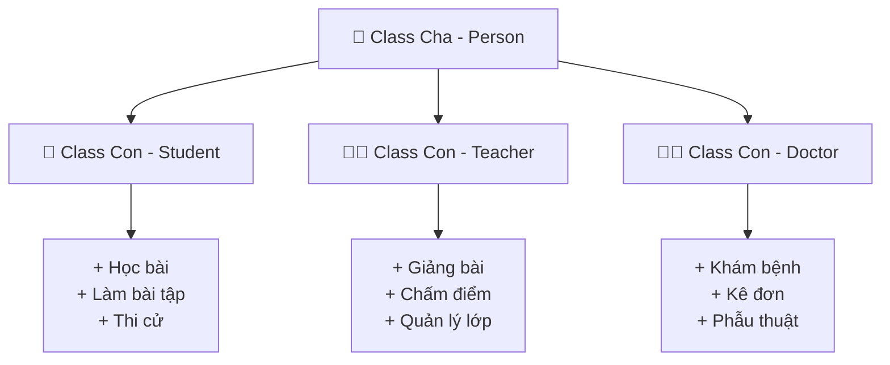

# 🧬 Kế Thừa (Inheritance) - Code Thông Minh Hơn

> **Mục tiêu**: Tạo class con từ class cha để tránh viết lại code và xây dựng hệ thống phân cấp thông minh! 🎯

## 🤔 Kế Thừa Là Gì? (Giải Thích Siêu Dễ)

### 👨‍👩‍👧‍👦 Hãy Tưởng Tượng Gia Đình...

**Class Cha** giống như **Bố/Mẹ**:
- 👀 Có mắt đen, tóc thẳng
- 🏃‍♂️ Biết chạy, nhảy, nói
- 🧠 Thông minh, tử tế

**Class Con** giống như **Con cái**:
- ✅ **Kế thừa từ cha mẹ**: Mắt đen, tóc thẳng, biết chạy nhảy
- ➕ **Thêm kỹ năng riêng**: Biết dùng máy tính, chơi game
- 🔄 **Cải tiến**: Chạy nhanh hơn, thông minh hơn



## 👤 Ví Dụ Cơ Bản: Từ Con Người Đến Học Sinh

### 🏗️ Class Cha (Parent Class)
```python
class Person:
    """Class cơ sở mô tả con người"""
    
    def __init__(self, full_name, age, gender):
        self.full_name = full_name
        self.age = age
        self.gender = gender
        self.health = 100
        
    def introduce(self):
        """Tự giới thiệu"""
        return f"Xin chào! Tôi là {self.full_name}, {self.age} tuổi"
    
    def eat(self, food):
        """Ăn uống để hồi sức khỏe"""
        self.health = min(100, self.health + 10)
        print(f"😋 {self.full_name} ăn {food}. Sức khỏe: {self.health}")
    
    def sleep(self, hours):
        """Ngủ nghỉ"""
        self.health = min(100, self.health + hours * 5)
        print(f"💤 {self.full_name} ngủ {hours} giờ. Sức khỏe: {self.health}")
    
    def work(self, job):
        """Làm việc chung chung"""
        self.health = max(0, self.health - 20)
        print(f"💼 {self.full_name} làm {job}. Sức khỏe: {self.health}")

### 👦 Class Con (Child Class)  
class Student(Person):  # Kế thừa từ Person
    """Class học sinh kế thừa từ Person"""
    
    def __init__(self, full_name, age, gender, class_name, school):
        # Gọi constructor của class cha
        super().__init__(full_name, age, gender)
        
        # Thêm thuộc tính riêng của học sinh
        self.class_name = class_name
        self.school = school
        self.scores = {}
        self.academic_performance = "Chưa xếp loại"
    
    def introduce(self):
        """Override - Ghi đè phương thức của class cha"""
        parent_introduction = super().introduce()
        return f"{parent_introduction}, học lớp {self.class_name} trường {self.school}"
    
    def study(self, subject):
        """Phương thức mới - chỉ có ở class con"""
        self.health = max(0, self.health - 5)
        print(f"📚 {self.full_name} học {subject}. Sức khỏe: {self.health}")
        
        # Thêm điểm ngẫu nhiên cho môn học
        import random
        score = random.uniform(6.0, 10.0)
        if subject not in self.scores:
            self.scores[subject] = []
        self.scores[subject].append(score)
        print(f"✅ Đã ghi nhận điểm {score:.1f} môn {subject}")
    
    def do_homework(self, homework):
        """Phương thức đặc biệt của học sinh"""
        self.health = max(0, self.health - 10)
        print(f"✍️ {self.full_name} làm bài tập {homework}. Sức khỏe: {self.health}")
    
    def calculate_average_score(self):
        """Tính điểm trung bình tất cả môn"""
        if not self.scores:
            return 0
        
        total_score = 0
        total_count = 0
        
        for subject, score_list in self.scores.items():
            total_score += sum(score_list)
            total_count += len(score_list)
        
        return total_score / total_count if total_count > 0 else 0
    
    def classify_academic_performance(self):
        """Xếp loại học lực"""
        avg_score = self.calculate_average_score()
        
        if avg_score >= 9.0:
            self.academic_performance = "Xuất sắc"
        elif avg_score >= 8.0:
            self.academic_performance = "Giỏi" 
        elif avg_score >= 6.5:
            self.academic_performance = "Khá"
        elif avg_score >= 5.0:
            self.academic_performance = "Trung bình"
        else:
            self.academic_performance = "Yếu"
            
        return self.academic_performance
    
    def generate_academic_report(self):
        """Báo cáo học tập chi tiết"""
        print(f"\n📊 BÁO CÁO HỌC TẬP - {self.full_name}")
        print("-" * 50)
        print(f"🎓 Lớp: {self.class_name}")
        print(f"🏫 Trường: {self.school}")
        
        if self.scores:
            for subject, score_list in self.scores.items():
                avg_subject = sum(score_list) / len(score_list)
                print(f"📚 {subject}: {avg_subject:.1f} (có {len(score_list)} điểm)")
        
        avg_overall = self.calculate_average_score()
        performance = self.classify_academic_performance()
        print(f"📈 Điểm TB chung: {avg_overall:.1f}")
        print(f"🏆 Học lực: {performance}")

# Test kế thừa
print("=== TEST CLASS CHA ===")
person = Person("Anh Nam", 35, "Nam")
print(person.introduce())
person.eat("cơm")
person.work("lập trình")

print("\n=== TEST CLASS CON ===")
student = Student("Nguyễn Văn An", 16, "Nam", "10A", "THPT Behitek")
print(student.introduce())  # Method được override

# Sử dụng method từ class cha
student.eat("bánh mì")
student.sleep(8)

# Sử dụng method riêng của class con
student.study("Toán")
student.study("Lý") 
student.study("Toán")
student.do_homework("Bài tập Hóa học")

# Báo cáo học tập
student.generate_academic_report()
```

## 👩‍🏫 Ví Dụ Phức Tạp Hơn: Hệ Thống Trường Học

```python
class Person:
    """Class cơ sở cho mọi người trong trường"""
    
    def __init__(self, full_name, age, id_number):
        self.full_name = full_name
        self.age = age
        self.id_number = id_number
        self.is_in_school = False
    
    def enter_school(self):
        """Vào trường học"""
        self.is_in_school = True
        print(f"🏫 {self.full_name} đã vào trường")
    
    def leave_school(self):
        """Rời khỏi trường"""
        self.is_in_school = False
        print(f"🚪 {self.full_name} đã rời trường")
    
    def basic_introduction(self):
        """Giới thiệu cơ bản"""
        return f"Tôi là {self.full_name}, mã số {self.id_number}"

class Student(Person):
    """Class học sinh"""
    
    def __init__(self, full_name, age, id_number, class_name):
        super().__init__(full_name, age, id_number)
        self.class_name = class_name
        self.attendance = []
        self.scores = {}
    
    def take_attendance(self):
        """Điểm danh học sinh"""
        from datetime import datetime
        self.attendance.append(datetime.now())
        print(f"✅ Điểm danh {self.full_name} - Lớp {self.class_name}")
    
    def submit_homework(self, subject, homework):
        """Nộp bài tập"""
        print(f"📝 {self.full_name} nộp bài tập {subject}: {homework}")
        return f"Bài tập {homework} - {self.full_name}"
    
    def basic_introduction(self):
        """Override giới thiệu"""
        return f"{super().basic_introduction()}, học sinh lớp {self.class_name}"

class Teacher(Person):
    """Class giáo viên"""
    
    def __init__(self, full_name, age, id_number, subject, base_salary=15000000):
        super().__init__(full_name, age, id_number)
        self.subject = subject
        self.base_salary = base_salary
        self.class_list = []
        self.received_homework = []
    
    def assign_class(self, class_name):
        """Phân công dạy lớp"""
        self.class_list.append(class_name)
        print(f"👩‍🏫 {self.full_name} được phân công dạy lớp {class_name}")
    
    def assign_homework(self, class_name, content):
        """Giao bài tập cho lớp"""
        print(f"📋 Cô {self.full_name} giao bài tập cho lớp {class_name}: {content}")
        return f"Bài tập {self.subject} - {content}"
    
    def receive_homework(self, homework):
        """Nhận bài tập từ học sinh"""
        self.received_homework.append(homework)
        print(f"📥 Cô {self.full_name} nhận bài: {homework}")
    
    def grade_homework(self, student_name, score):
        """Chấm điểm cho học sinh"""
        print(f"📊 Cô {self.full_name} chấm điểm {student_name}: {score}")
        return score
    
    def calculate_salary(self, coefficient=1.0, bonus=0):
        """Tính lương giáo viên"""
        monthly_salary = self.base_salary * coefficient + bonus
        return monthly_salary
    
    def basic_introduction(self):
        """Override giới thiệu"""
        return f"{super().basic_introduction()}, giáo viên dạy {self.subject}"

class Principal(Teacher):
    """Class hiệu trưởng kế thừa từ Teacher"""
    
    def __init__(self, full_name, age, id_number, base_salary=30000000):
        # Hiệu trưởng không dạy môn cụ thể
        super().__init__(full_name, age, id_number, "Quản lý", base_salary)
        self.authority = "Cao nhất"
        self.teacher_list = []
        self.student_list = []
    
    def hire_teacher(self, teacher):
        """Tuyển giáo viên mới"""
        self.teacher_list.append(teacher)
        print(f"🎉 Hiệu trưởng {self.full_name} tuyển giáo viên {teacher.full_name}")
    
    def enroll_student(self, student):
        """Tuyển học sinh mới"""
        self.student_list.append(student)
        print(f"📚 Hiệu trưởng {self.full_name} tiếp nhận học sinh {student.full_name}")
    
    def hold_teacher_meeting(self):
        """Tổ chức họp giáo viên"""
        print(f"🏛️ Hiệu trưởng {self.full_name} tổ chức họp với {len(self.teacher_list)} giáo viên")
    
    def approve_salary(self, teacher, coefficient, bonus=0):
        """Duyệt lương cho giáo viên"""
        salary = teacher.calculate_salary(coefficient, bonus)
        print(f"💰 Hiệu trưởng duyệt lương {teacher.full_name}: {salary:,} VNĐ")
        return salary
    
    def basic_introduction(self):
        """Override giới thiệu"""
        return f"Tôi là Hiệu trưởng {self.full_name}, mã số {self.id_number}"

# Mô phỏng hoạt động trường học
print("🏫 === MÔ PHỎNG TRƯỜNG BEHITEK ACADEMY ===")

# Tạo hiệu trưởng
principal = Principal("Nguyễn Văn Minh", 45, "HT001")
print(principal.basic_introduction())

# Tạo giáo viên
teacher_lan = Teacher("Trần Thị Lan", 30, "GV001", "Toán", 18000000)
teacher_nam = Teacher("Lê Văn Nam", 35, "GV002", "Lý", 20000000)

# Hiệu trưởng tuyển giáo viên
principal.hire_teacher(teacher_lan)
principal.hire_teacher(teacher_nam)

# Tạo học sinh
student_an = Student("Nguyễn Văn An", 16, "HS001", "10A")
student_binh = Student("Trần Thị Bình", 15, "HS002", "10A")

# Hiệu trưởng tiếp nhận học sinh
principal.enroll_student(student_an)
principal.enroll_student(student_binh)

# Phân công giảng dạy
teacher_lan.assign_class("10A")
teacher_nam.assign_class("10A")

# Hoạt động học tập
print("\n📚 === HOẠT ĐỘNG HỌC TẬP ===")
student_an.enter_school()
student_binh.enter_school()
teacher_lan.enter_school()

student_an.take_attendance()
student_binh.take_attendance()

# Giao và nộp bài tập
math_homework = teacher_lan.assign_homework("10A", "Giải phương trình bậc 2")
an_homework = student_an.submit_homework("Toán", "Bài giải phương trình bậc 2")
teacher_lan.receive_homework(an_homework)
teacher_lan.grade_homework("An", 9.5)

# Họp giáo viên và duyệt lương
print("\n💼 === QUẢN LÝ TRƯỜNG ===")
principal.hold_teacher_meeting()
principal.approve_salary(teacher_lan, 1.2, 2000000)
principal.approve_salary(teacher_nam, 1.1, 1500000)
```

## 🔄 Các Loại Kế Thừa

### 1. 🎯 **Single Inheritance** - Kế Thừa Đơn
```python
class Animal:
    def __init__(self, name):
        self.name = name
    
    def make_sound(self):
        print(f"{self.name} phát ra âm thanh")

class Dog(Animal):  # Dog kế thừa từ Animal
    def make_sound(self):
        print(f"{self.name}: Gâu gâu! 🐕")

class Cat(Animal):  # Cat kế thừa từ Animal  
    def make_sound(self):
        print(f"{self.name}: Meo meo! 🐱")

# Test
dog_vang = Dog("Vàng")
cat_mun = Cat("Mun")

dog_vang.make_sound()
cat_mun.make_sound()
```

### 2. 🎭 **Multiple Inheritance** - Đa Kế Thừa
```python
class CanFly:
    """Khả năng bay"""
    def fly(self):
        print("🦅 Đang bay lên cao!")

class CanSwim:
    """Khả năng bơi"""
    def swim(self):
        print("🏊‍♀️ Đang bơi trong nước!")

class Duck(Animal, CanFly, CanSwim):  # Kế thừa từ nhiều class
    """Vịt có thể bay và bơi"""
    
    def __init__(self, name):
        super().__init__(name)
    
    def make_sound(self):
        print(f"{self.name}: Quạc quạc! 🦆")

# Test đa kế thừa
duck_donald = Duck("Donald")
duck_donald.make_sound()   # Từ class Duck
duck_donald.fly()          # Từ class CanFly
duck_donald.swim()         # Từ class CanSwim
```

### 3. 🌲 **Multilevel Inheritance** - Kế Thừa Nhiều Cấp
```python
class Vehicle:
    """Class cơ sở cho phương tiện"""
    def __init__(self, name, max_speed):
        self.name = name
        self.max_speed = max_speed
        self.current_speed = 0
    
    def start_engine(self):
        print(f"🔥 {self.name} đã khởi động")

class Car(Vehicle):
    """Class xe kế thừa từ Vehicle"""
    def __init__(self, name, max_speed, wheel_count):
        super().__init__(name, max_speed)
        self.wheel_count = wheel_count
    
    def drive(self):
        print(f"🏃‍♂️ {self.name} với {self.wheel_count} bánh đang chạy")

class Sedan(Car):
    """Class xe sedan kế thừa từ Car"""
    def __init__(self, name, max_speed, brand):
        super().__init__(name, max_speed, 4)  # Sedan có 4 bánh
        self.brand = brand
        self.door_open = False
    
    def open_door(self):
        self.door_open = True
        print(f"🚪 Mở cửa {self.name} {self.brand}")
    
    def close_door(self):
        self.door_open = False
        print(f"🚪 Đóng cửa {self.name} {self.brand}")

# Test kế thừa nhiều cấp
camry_car = Sedan("Camry", 200, "Toyota")
camry_car.start_engine()  # Từ Vehicle (ông)
camry_car.drive()         # Từ Car (cha)
camry_car.open_door()     # Từ Sedan (chính nó)
```

## 🛠️ Method Override và Super()

```python
class Computer:
    """Class máy tính cơ bản"""
    
    def __init__(self, brand, ram):
        self.brand = brand
        self.ram = ram
        self.is_running = False
    
    def power_on(self):
        self.is_running = True
        print(f"💻 Máy tính {self.brand} đang khởi động...")
        self.startup_notification()
    
    def startup_notification(self):
        print("✅ Hệ điều hành đã sẵn sàng")
    
    def power_off(self):
        self.is_running = False
        print(f"🔌 Đã tắt máy tình {self.brand}")

class Laptop(Computer):
    """Class laptop kế thừa từ Computer"""
    
    def __init__(self, brand, ram, battery_percent=100):
        super().__init__(brand, ram)
        self.battery_percent = battery_percent
        self.is_charging = False
    
    def startup_notification(self):
        """Override method của class cha"""
        # Gọi method gốc từ class cha
        super().startup_notification()
        
        # Thêm thông báo riêng của laptop
        print(f"🔋 Pin hiện tại: {self.battery_percent}%")
        if self.battery_percent < 20:
            print("⚠️ Pin yếu! Hãy sạc máy!")
    
    def charge_battery(self):
        """Method riêng của laptop"""
        self.is_charging = True
        print(f"⚡ Đang sạc laptop {self.brand}...")
        
        # Mô phỏng sạc pin
        while self.battery_percent < 100 and self.is_charging:
            self.battery_percent = min(100, self.battery_percent + 10)
            print(f"🔋 Pin: {self.battery_percent}%")
            if self.battery_percent == 100:
                print("✅ Đã sạc đầy!")
                self.is_charging = False
                break

class GamingLaptop(Laptop):
    """Class laptop gaming kế thừa từ Laptop"""
    
    def __init__(self, brand, ram, graphics_card, battery_percent=100):
        super().__init__(brand, ram, battery_percent)
        self.graphics_card = graphics_card
        self.gaming_mode = False
    
    def startup_notification(self):
        """Override với thêm thông tin gaming"""
        super().startup_notification()  # Gọi từ Laptop
        print(f"🎮 Card đồ họa: {self.graphics_card}")
        print("🚀 Sẵn sàng cho gaming!")
    
    def enable_gaming_mode(self):
        """Chế độ gaming đặc biệt"""
        self.gaming_mode = True
        print(f"🎯 {self.brand} bật chế độ Gaming Mode!")
        print("⚡ Tăng hiệu năng tối đa!")
        print("🌟 LED RGB bật sáng!")

# Test inheritance với override
print("=== LAPTOP THƯỜNG ===")
dell_laptop = Laptop("Dell XPS", "16GB", 15)
dell_laptop.power_on()

print("\n=== LAPTOP GAMING ===") 
gaming_laptop = GamingLaptop("ASUS ROG", "32GB", "RTX 4070", 80)
gaming_laptop.power_on()
gaming_laptop.enable_gaming_mode()
gaming_laptop.charge_battery()
```

## 💡 Mẹo Hay Ho Về Kế Thừa

1. **Sử dụng `super()`** - Gọi method từ class cha
2. **Override có mục đích** - Chỉ ghi đè khi cần thiết
3. **Đặt tên rõ ràng** - Class con nên rõ ràng hơn class cha
4. **Tránh kế thừa quá sâu** - Không quá 3-4 cấp
5. **Composition over Inheritance** - Đôi khi chứa object tốt hơn kế thừa

## 🎮 Bài Tập Thực Hành

### 🏆 Bài 1: Hệ Thống Game RPG
Tạo hệ thống nhân vật với:
- Class `Character` (base)
- Class `Warrior`, `Mage`, `Archer` (kế thừa)
- Mỗi class có kỹ năng riêng

### 🏆 Bài 2: Quản Lý Ngân Hàng
Tạo hệ thống tài khoản:
- Class `Account` (base) 
- Class `SavingsAccount`, `LoanAccount` (kế thừa)
- Các loại tài khoản có lãi suất khác nhau

### 🏆 Bài 3: Cửa Hàng Điện Tử
Tạo hệ thống sản phẩm:
- Class `Product` (base)
- Class `Phone`, `Laptop`, `Headphone` (kế thừa)
- Mỗi loại có tính năng đặc biệt

## 🔗 Kiến Thức Liên Quan

- **[Class và Object](./classes-and-objects.md)** - Nền tảng trước khi học kế thừa
- **[Polymorphism](./polymorphism.md)** - Đa hình với kế thừa (sắp có)
- **[Abstract Classes](./abstract-classes.md)** - Class trừu tượng (sắp có)

---

*🎉 **Chúc mừng!** Bạn đã hiểu được Inheritance - một trong những trụ cột của OOP! Giờ bạn có thể xây dựng hệ thống class linh hoạt và tái sử dụng code hiệu quả! 🚀*
