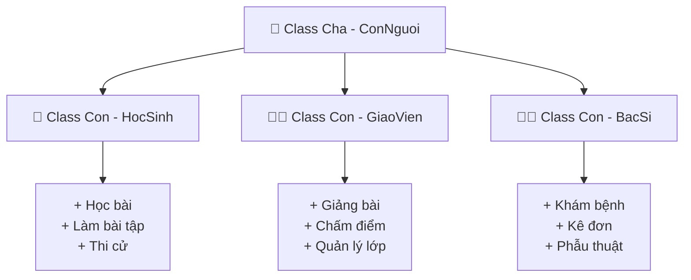

# 🧬 Kế Thừa (Inheritance) - Code Thông Minh Hơn

> **Mục tiêu**: Tạo class con từ class cha để tránh viết lại code và xây dựng hệ thống phân cấp thông minh! 🎯

## 🤔 Kế Thừa Là Gì? (Giải Thích Siêu Dễ)

### 👨‍👩‍👧‍👦 Hãy Tưởng Tượng Gia Đình...

**Class Cha** giống như **Bố/Mẹ**:
- 👀 Có mắt đen, tóc thẳng
- 🏃‍♂️ Biết chạy, nhảy, nói
- 🧠 Thông minh, tử tế

**Class Con** giống như **Con cái**:
- ✅ **Kế thừa từ cha mẹ**: Mắt đen, tóc thẳng, biết chạy nhảy
- ➕ **Thêm kỹ năng riêng**: Biết dùng máy tính, chơi game
- 🔄 **Cải tiến**: Chạy nhanh hơn, thông minh hơn



## 👤 Ví Dụ Cơ Bản: Từ Con Người Đến Học Sinh

### 🏗️ Class Cha (Parent Class)
```python
class ConNguoi:
    """Class cơ sở mô tả con người"""
    
    def __init__(self, ho_ten, tuoi, gioi_tinh):
        self.ho_ten = ho_ten
        self.tuoi = tuoi
        self.gioi_tinh = gioi_tinh
        self.suc_khoe = 100
        
    def gioi_thieu(self):
        """Tự giới thiệu"""
        return f"Xin chào! Tôi là {self.ho_ten}, {self.tuoi} tuổi"
    
    def an_uong(self, do_an):
        """Ăn uống để hồi sức khỏe"""
        self.suc_khoe = min(100, self.suc_khoe + 10)
        print(f"😋 {self.ho_ten} ăn {do_an}. Sức khỏe: {self.suc_khoe}")
    
    def ngu_ngoi(self, gio):
        """Ngủ nghỉ"""
        self.suc_khoe = min(100, self.suc_khoe + gio * 5)
        print(f"💤 {self.ho_ten} ngủ {gio} giờ. Sức khỏe: {self.suc_khoe}")
    
    def lam_viec(self, cong_viec):
        """Làm việc chung chung"""
        self.suc_khoe = max(0, self.suc_khoe - 20)
        print(f"💼 {self.ho_ten} làm {cong_viec}. Sức khỏe: {self.suc_khoe}")

### 👦 Class Con (Child Class)  
class HocSinh(ConNguoi):  # Kế thừa từ ConNguoi
    """Class học sinh kế thừa từ ConNguoi"""
    
    def __init__(self, ho_ten, tuoi, gioi_tinh, lop, truong):
        # Gọi constructor của class cha
        super().__init__(ho_ten, tuoi, gioi_tinh)
        
        # Thêm thuộc tính riêng của học sinh
        self.lop = lop
        self.truong = truong
        self.diem_so = {}
        self.hoc_luc = "Chưa xếp loại"
    
    def gioi_thieu(self):
        """Override - Ghi đè phương thức của class cha"""
        cha_gioi_thieu = super().gioi_thieu()
        return f"{cha_gioi_thieu}, học lớp {self.lop} trường {self.truong}"
    
    def hoc_bai(self, mon_hoc):
        """Phương thức mới - chỉ có ở class con"""
        self.suc_khoe = max(0, self.suc_khoe - 5)
        print(f"📚 {self.ho_ten} học {mon_hoc}. Sức khỏe: {self.suc_khoe}")
        
        # Thêm điểm ngẫu nhiên cho môn học
        import random
        diem = random.uniform(6.0, 10.0)
        if mon_hoc not in self.diem_so:
            self.diem_so[mon_hoc] = []
        self.diem_so[mon_hoc].append(diem)
        print(f"✅ Đã ghi nhận điểm {diem:.1f} môn {mon_hoc}")
    
    def lam_bai_tap(self, bai_tap):
        """Phương thức đặc biệt của học sinh"""
        self.suc_khoe = max(0, self.suc_khoe - 10)
        print(f"✍️ {self.ho_ten} làm bài tập {bai_tap}. Sức khỏe: {self.suc_khoe}")
    
    def tinh_diem_trung_binh(self):
        """Tính điểm trung bình tất cả môn"""
        if not self.diem_so:
            return 0
        
        tong_diem = 0
        tong_so_diem = 0
        
        for mon, danh_sach_diem in self.diem_so.items():
            tong_diem += sum(danh_sach_diem)
            tong_so_diem += len(danh_sach_diem)
        
        return tong_diem / tong_so_diem if tong_so_diem > 0 else 0
    
    def xep_loai_hoc_luc(self):
        """Xếp loại học lực"""
        dtb = self.tinh_diem_trung_binh()
        
        if dtb >= 9.0:
            self.hoc_luc = "Xuất sắc"
        elif dtb >= 8.0:
            self.hoc_luc = "Giỏi" 
        elif dtb >= 6.5:
            self.hoc_luc = "Khá"
        elif dtb >= 5.0:
            self.hoc_luc = "Trung bình"
        else:
            self.hoc_luc = "Yếu"
            
        return self.hoc_luc
    
    def bao_cao_hoc_tap(self):
        """Báo cáo học tập chi tiết"""
        print(f"\n📊 BÁO CÁO HỌC TẬP - {self.ho_ten}")
        print("-" * 50)
        print(f"🎓 Lớp: {self.lop}")
        print(f"🏫 Trường: {self.truong}")
        
        if self.diem_so:
            for mon, diem_list in self.diem_so.items():
                dtb_mon = sum(diem_list) / len(diem_list)
                print(f"📚 {mon}: {dtb_mon:.1f} (có {len(diem_list)} điểm)")
        
        dtb_chung = self.tinh_diem_trung_binh()
        hoc_luc = self.xep_loai_hoc_luc()
        print(f"📈 Điểm TB chung: {dtb_chung:.1f}")
        print(f"🏆 Học lực: {hoc_luc}")

# Test kế thừa
print("=== TEST CLASS CHA ===")
nguoi = ConNguoi("Anh Nam", 35, "Nam")
print(nguoi.gioi_thieu())
nguoi.an_uong("cơm")
nguoi.lam_viec("lập trình")

print("\n=== TEST CLASS CON ===")
hoc_sinh = HocSinh("Nguyễn Văn An", 16, "Nam", "10A", "THPT Behitek")
print(hoc_sinh.gioi_thieu())  # Method được override

# Sử dụng method từ class cha
hoc_sinh.an_uong("bánh mì")
hoc_sinh.ngu_ngoi(8)

# Sử dụng method riêng của class con
hoc_sinh.hoc_bai("Toán")
hoc_sinh.hoc_bai("Lý") 
hoc_sinh.hoc_bai("Toán")
hoc_sinh.lam_bai_tap("Bài tập Hóa học")

# Báo cáo học tập
hoc_sinh.bao_cao_hoc_tap()
```

## 👩‍🏫 Ví Dụ Phức Tạp Hơn: Hệ Thống Trường Học

```python
class ConNguoi:
    """Class cơ sở cho mọi người trong trường"""
    
    def __init__(self, ho_ten, tuoi, ma_so):
        self.ho_ten = ho_ten
        self.tuoi = tuoi
        self.ma_so = ma_so
        self.co_mat_trong_truong = False
    
    def vao_truong(self):
        """Vào trường học"""
        self.co_mat_trong_truong = True
        print(f"🏫 {self.ho_ten} đã vào trường")
    
    def ra_khoi_truong(self):
        """Rời khỏi trường"""
        self.co_mat_trong_truong = False
        print(f"🚪 {self.ho_ten} đã rời trường")
    
    def gioi_thieu_co_ban(self):
        """Giới thiệu cơ bản"""
        return f"Tôi là {self.ho_ten}, mã số {self.ma_so}"

class HocSinh(ConNguoi):
    """Class học sinh"""
    
    def __init__(self, ho_ten, tuoi, ma_so, lop):
        super().__init__(ho_ten, tuoi, ma_so)
        self.lop = lop
        self.diem_danh = []
        self.diem_so = {}
    
    def diem_danh_hoc_sinh(self):
        """Điểm danh học sinh"""
        from datetime import datetime
        self.diem_danh.append(datetime.now())
        print(f"✅ Điểm danh {self.ho_ten} - Lớp {self.lop}")
    
    def nop_bai_tap(self, mon_hoc, bai_tap):
        """Nộp bài tập"""
        print(f"📝 {self.ho_ten} nộp bài tập {mon_hoc}: {bai_tap}")
        return f"Bài tập {bai_tap} - {self.ho_ten}"
    
    def gioi_thieu_co_ban(self):
        """Override giới thiệu"""
        return f"{super().gioi_thieu_co_ban()}, học sinh lớp {self.lop}"

class GiaoVien(ConNguoi):
    """Class giáo viên"""
    
    def __init__(self, ho_ten, tuoi, ma_so, mon_day, luong_cb=15000000):
        super().__init__(ho_ten, tuoi, ma_so)
        self.mon_day = mon_day
        self.luong_co_ban = luong_cb
        self.danh_sach_lop = []
        self.bai_tap_nhan = []
    
    def phan_cong_lop(self, lop):
        """Phân công dạy lớp"""
        self.danh_sach_lop.append(lop)
        print(f"👩‍🏫 {self.ho_ten} được phân công dạy lớp {lop}")
    
    def giao_bai_tap(self, lop, noi_dung):
        """Giao bài tập cho lớp"""
        print(f"📋 Cô {self.ho_ten} giao bài tập cho lớp {lop}: {noi_dung}")
        return f"Bài tập {self.mon_day} - {noi_dung}"
    
    def nhan_bai_tap(self, bai_tap):
        """Nhận bài tập từ học sinh"""
        self.bai_tap_nhan.append(bai_tap)
        print(f"📥 Cô {self.ho_ten} nhận bài: {bai_tap}")
    
    def cham_diem(self, ten_hoc_sinh, diem):
        """Chấm điểm cho học sinh"""
        print(f"📊 Cô {self.ho_ten} chấm điểm {ten_hoc_sinh}: {diem}")
        return diem
    
    def tinh_luong(self, he_so=1.0, thuong=0):
        """Tính lương giáo viên"""
        luong_thang = self.luong_co_ban * he_so + thuong
        return luong_thang
    
    def gioi_thieu_co_ban(self):
        """Override giới thiệu"""
        return f"{super().gioi_thieu_co_ban()}, giáo viên dạy {self.mon_day}"

class HieuTruong(GiaoVien):
    """Class hiệu trưởng kế thừa từ GiaoVien"""
    
    def __init__(self, ho_ten, tuoi, ma_so, luong_cb=30000000):
        # Hiệu trưởng không dạy môn cụ thể
        super().__init__(ho_ten, tuoi, ma_so, "Quản lý", luong_cb)
        self.quyen_han = "Cao nhất"
        self.danh_sach_giao_vien = []
        self.danh_sach_hoc_sinh = []
    
    def tuyen_giao_vien(self, giao_vien):
        """Tuyển giáo viên mới"""
        self.danh_sach_giao_vien.append(giao_vien)
        print(f"🎉 Hiệu trưởng {self.ho_ten} tuyển giáo viên {giao_vien.ho_ten}")
    
    def tuyen_hoc_sinh(self, hoc_sinh):
        """Tuyển học sinh mới"""
        self.danh_sach_hoc_sinh.append(hoc_sinh)
        print(f"📚 Hiệu trưởng {self.ho_ten} tiếp nhận học sinh {hoc_sinh.ho_ten}")
    
    def hop_giao_vien(self):
        """Tổ chức họp giáo viên"""
        print(f"🏛️ Hiệu trưởng {self.ho_ten} tổ chức họp với {len(self.danh_sach_giao_vien)} giáo viên")
    
    def duyet_luong(self, giao_vien, he_so, thuong=0):
        """Duyệt lương cho giáo viên"""
        luong = giao_vien.tinh_luong(he_so, thuong)
        print(f"💰 Hiệu trưởng duyệt lương {giao_vien.ho_ten}: {luong:,} VNĐ")
        return luong
    
    def gioi_thieu_co_ban(self):
        """Override giới thiệu"""
        return f"Tôi là Hiệu trưởng {self.ho_ten}, mã số {self.ma_so}"

# Mô phỏng hoạt động trường học
print("🏫 === MÔ PHỎNG TRƯỜNG BEHITEK ACADEMY ===")

# Tạo hiệu trưởng
hieu_truong = HieuTruong("Nguyễn Văn Minh", 45, "HT001")
print(hieu_truong.gioi_thieu_co_ban())

# Tạo giáo viên
co_lan = GiaoVien("Trần Thị Lan", 30, "GV001", "Toán", 18000000)
thay_nam = GiaoVien("Lê Văn Nam", 35, "GV002", "Lý", 20000000)

# Hiệu trưởng tuyển giáo viên
hieu_truong.tuyen_giao_vien(co_lan)
hieu_truong.tuyen_giao_vien(thay_nam)

# Tạo học sinh
an = HocSinh("Nguyễn Văn An", 16, "HS001", "10A")
binh = HocSinh("Trần Thị Bình", 15, "HS002", "10A")

# Hiệu trưởng tiếp nhận học sinh
hieu_truong.tuyen_hoc_sinh(an)
hieu_truong.tuyen_hoc_sinh(binh)

# Phân công giảng dạy
co_lan.phan_cong_lop("10A")
thay_nam.phan_cong_lop("10A")

# Hoạt động học tập
print("\n📚 === HOẠT ĐỘNG HỌC TẬP ===")
an.vao_truong()
binh.vao_truong()
co_lan.vao_truong()

an.diem_danh_hoc_sinh()
binh.diem_danh_hoc_sinh()

# Giao và nộp bài tập
bt_toan = co_lan.giao_bai_tap("10A", "Giải phương trình bậc 2")
bai_cua_an = an.nop_bai_tap("Toán", "Bài giải phương trình bậc 2")
co_lan.nhan_bai_tap(bai_cua_an)
co_lan.cham_diem("An", 9.5)

# Họp giáo viên và duyệt lương
print("\n💼 === QUẢN LÝ TRƯỜNG ===")
hieu_truong.hop_giao_vien()
hieu_truong.duyet_luong(co_lan, 1.2, 2000000)
hieu_truong.duyet_luong(thay_nam, 1.1, 1500000)
```

## 🔄 Các Loại Kế Thừa

### 1. 🎯 **Single Inheritance** - Kế Thừa Đơn
```python
class DongVat:
    def __init__(self, ten):
        self.ten = ten
    
    def keu(self):
        print(f"{self.ten} phát ra âm thanh")

class Cho(DongVat):  # Cho kế thừa từ DongVat
    def keu(self):
        print(f"{self.ten}: Gâu gâu! 🐕")

class Meo(DongVat):  # Mèo kế thừa từ DongVat  
    def keu(self):
        print(f"{self.ten}: Meo meo! 🐱")

# Test
cho_vang = Cho("Vàng")
meo_mun = Meo("Mun")

cho_vang.keu()
meo_mun.keu()
```

### 2. 🎭 **Multiple Inheritance** - Đa Kế Thừa
```python
class CoTheBay:
    """Khả năng bay"""
    def bay(self):
        print("🦅 Đang bay lên cao!")

class CoBoi:
    """Khả năng bơi"""
    def boi(self):
        print("🏊‍♀️ Đang bơi trong nước!")

class Vit(DongVat, CoTheBay, CoBoi):  # Kế thừa từ nhiều class
    """Vịt có thể bay và bơi"""
    
    def __init__(self, ten):
        super().__init__(ten)
    
    def keu(self):
        print(f"{self.ten}: Quạc quạc! 🦆")

# Test đa kế thừa
vit_donald = Vit("Donald")
vit_donald.keu()   # Từ class Vit
vit_donald.bay()   # Từ class CoTheBay
vit_donald.boi()   # Từ class CoBoi
```

### 3. 🌲 **Multilevel Inheritance** - Kế Thừa Nhiều Cấp
```python
class PhuongTien:
    """Class cơ sở cho phương tiện"""
    def __init__(self, ten, toc_do_toi_da):
        self.ten = ten
        self.toc_do_toi_da = toc_do_toi_da
        self.toc_do_hien_tai = 0
    
    def khoi_dong(self):
        print(f"🔥 {self.ten} đã khởi động")

class Xe(PhuongTien):
    """Class xe kế thừa từ PhuongTien"""
    def __init__(self, ten, toc_do_toi_da, so_banh):
        super().__init__(ten, toc_do_toi_da)
        self.so_banh = so_banh
    
    def chay(self):
        print(f"🏃‍♂️ {self.ten} với {self.so_banh} bánh đang chạy")

class XeHoi(Xe):
    """Class xe hơi kế thừa từ Xe"""
    def __init__(self, ten, toc_do_toi_da, hang_sx):
        super().__init__(ten, toc_do_toi_da, 4)  # Xe hơi có 4 bánh
        self.hang_sx = hang_sx
        self.dang_mo_cua = False
    
    def mo_cua(self):
        self.dang_mo_cua = True
        print(f"🚪 Mở cửa {self.ten} {self.hang_sx}")
    
    def dong_cua(self):
        self.dang_mo_cua = False
        print(f"🚪 Đóng cửa {self.ten} {self.hang_sx}")

# Test kế thừa nhiều cấp
xe_camry = XeHoi("Camry", 200, "Toyota")
xe_camry.khoi_dong()  # Từ PhuongTien (ông)
xe_camry.chay()       # Từ Xe (cha)
xe_camry.mo_cua()     # Từ XeHoi (chính nó)
```

## 🛠️ Method Override và Super()

```python
class MayTinh:
    """Class máy tính cơ bản"""
    
    def __init__(self, hang, ram):
        self.hang = hang
        self.ram = ram
        self.dang_bat = False
    
    def bat_may(self):
        self.dang_bat = True
        print(f"💻 Máy tính {self.hang} đang khởi động...")
        self.thong_bao_khoi_dong()
    
    def thong_bao_khoi_dong(self):
        print("✅ Hệ điều hành đã sẵn sàng")
    
    def tat_may(self):
        self.dang_bat = False
        print(f"🔌 Đã tắt máy tình {self.hang}")

class Laptop(MayTinh):
    """Class laptop kế thừa từ MayTinh"""
    
    def __init__(self, hang, ram, pin_percent=100):
        super().__init__(hang, ram)
        self.pin_percent = pin_percent
        self.dang_sac = False
    
    def thong_bao_khoi_dong(self):
        """Override method của class cha"""
        # Gọi method gốc từ class cha
        super().thong_bao_khoi_dong()
        
        # Thêm thông báo riêng của laptop
        print(f"🔋 Pin hiện tại: {self.pin_percent}%")
        if self.pin_percent < 20:
            print("⚠️ Pin yếu! Hãy sạc máy!")
    
    def sac_pin(self):
        """Method riêng của laptop"""
        self.dang_sac = True
        print(f"⚡ Đang sạc laptop {self.hang}...")
        
        # Mô phỏng sạc pin
        while self.pin_percent < 100 and self.dang_sac:
            self.pin_percent = min(100, self.pin_percent + 10)
            print(f"🔋 Pin: {self.pin_percent}%")
            if self.pin_percent == 100:
                print("✅ Đã sạc đầy!")
                self.dang_sac = False
                break

class LaptopGaming(Laptop):
    """Class laptop gaming kế thừa từ Laptop"""
    
    def __init__(self, hang, ram, card_do_hoa, pin_percent=100):
        super().__init__(hang, ram, pin_percent)
        self.card_do_hoa = card_do_hoa
        self.che_do_gaming = False
    
    def thong_bao_khoi_dong(self):
        """Override với thêm thông tin gaming"""
        super().thong_bao_khoi_dong()  # Gọi từ Laptop
        print(f"🎮 Card đồ họa: {self.card_do_hoa}")
        print("🚀 Sẵn sàng cho gaming!")
    
    def bat_che_do_gaming(self):
        """Chế độ gaming đặc biệt"""
        self.che_do_gaming = True
        print(f"🎯 {self.hang} bật chế độ Gaming Mode!")
        print("⚡ Tăng hiệu năng tối đa!")
        print("🌟 LED RGB bật sáng!")

# Test inheritance với override
print("=== LAPTOP THƯỜNG ===")
laptop_dell = Laptop("Dell XPS", "16GB", 15)
laptop_dell.bat_may()

print("\n=== LAPTOP GAMING ===") 
laptop_gaming = LaptopGaming("ASUS ROG", "32GB", "RTX 4070", 80)
laptop_gaming.bat_may()
laptop_gaming.bat_che_do_gaming()
laptop_gaming.sac_pin()
```

## 💡 Mẹo Hay Ho Về Kế Thừa

1. **Sử dụng `super()`** - Gọi method từ class cha
2. **Override có mục đích** - Chỉ ghi đè khi cần thiết
3. **Đặt tên rõ ràng** - Class con nên rõ ràng hơn class cha
4. **Tránh kế thừa quá sâu** - Không quá 3-4 cấp
5. **Composition over Inheritance** - Đôi khi chứa object tốt hơn kế thừa

## 🎮 Bài Tập Thực Hành

### 🏆 Bài 1: Hệ Thống Game RPG
Tạo hệ thống nhân vật với:
- Class `NhanVat` (base)
- Class `ChienBinh`, `PhapSu`, `CungThu` (kế thừa)
- Mỗi class có kỹ năng riêng

### 🏆 Bài 2: Quản Lý Ngân Hàng
Tạo hệ thống tài khoản:
- Class `TaiKhoan` (base) 
- Class `TaiKhoanTietKiem`, `TaiKhoanVay` (kế thừa)
- Các loại tài khoản có lãi suất khác nhau

### 🏆 Bài 3: Cửa Hàng Điện Tử
Tạo hệ thống sản phẩm:
- Class `SanPham` (base)
- Class `DienThoai`, `Laptop`, `TaiNghe` (kế thừa)
- Mỗi loại có tính năng đặc biệt

## 🔗 Kiến Thức Liên Quan

- **[Class và Object](./classes-and-objects.md)** - Nền tảng trước khi học kế thừa
- **[Polymorphism](./polymorphism.md)** - Đa hình với kế thừa (sắp có)
- **[Abstract Classes](./abstract-classes.md)** - Class trừu tượng (sắp có)

---

*🎉 **Chúc mừng!** Bạn đã hiểu được Inheritance - một trong những trụ cột của OOP! Giờ bạn có thể xây dựng hệ thống class linh hoạt và tái sử dụng code hiệu quả! 🚀*
