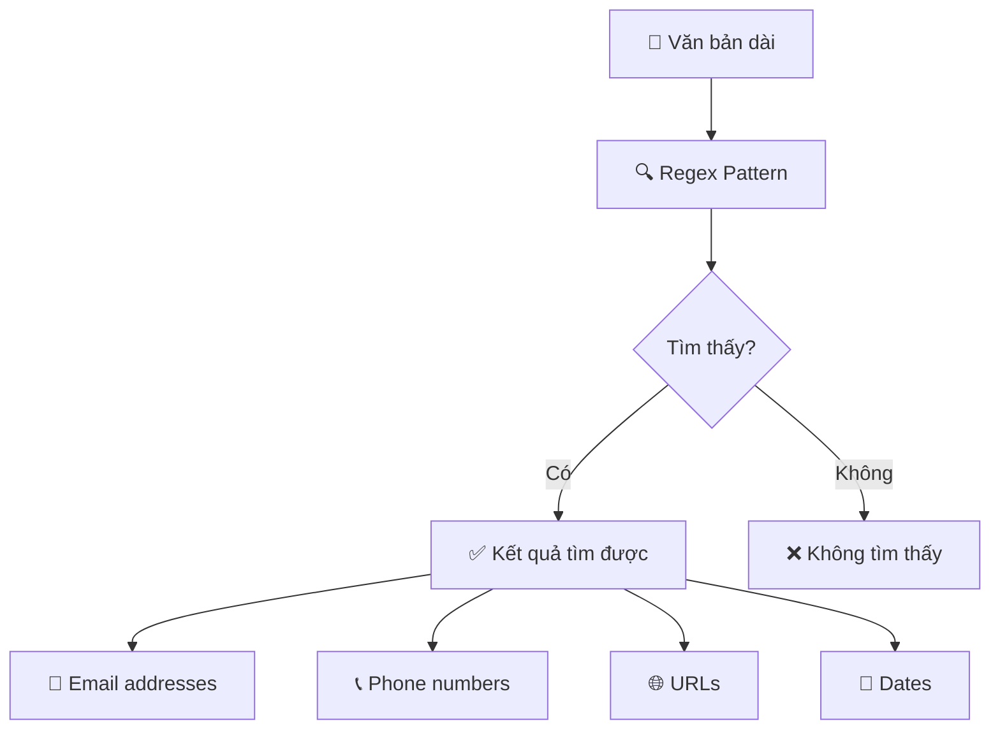

# 🔍 Biểu Thức Chính Quy (Regular Expressions) - Siêu Công Cụ Tìm Kiếm

> **Mục tiêu**: Học cách sử dụng Regex để tìm kiếm, kiểm tra và xử lý văn bản như một chuyên gia! 🎯

## 🤔 Regular Expression (Regex) Là Gì? (Giải Thích Siêu Dễ)

**Regular Expression** giống như **công thức siêu mạnh để tìm kiếm** trong văn bản:

### 🔎 Hãy Tưởng Tượng...
- **Regex** = **Kính lúp thông minh** 🔍
- **Có thể tìm mọi thứ** theo pattern cụ thể
- **Nhanh và chính xác** hơn tìm kiếm thường
- **Linh hoạt** - tìm được cả những gì "giống giống"



### 🎯 Regex Có Thể Làm Gì?
- ✅ **Kiểm tra email hợp lệ**: `user@behitek.com`
- ✅ **Tìm số điện thoại**: `0901234567` hoặc `(028) 1234-5678`
- ✅ **Trích xuất URL**: `https://behitek.com`
- ✅ **Validate mật khẩu**: Có chữ hoa, số, ký tự đặc biệt
- ✅ **Thay thế văn bản thông minh**: Đổi format ngày tháng

## 📚 Nhập Môn Regex với Python

```python
import re

# Module 're' của Python để làm việc với regex

print("🎯 REGEX CƠ BẢN VỚI PYTHON")
print("=" * 50)

# Ví dụ đầu tiên: Tìm từ "Python" trong text
text = "Tôi yêu Python! Python rất tuyệt vời. Python là tương lai!"

# Tìm tất cả từ "Python"
result = re.findall(r'Python', text)
print(f"📝 Text: {text}")
print(f"🔍 Tìm 'Python': {result}")
print(f"📊 Tìm được {len(result)} lần")

print("\n" + "-" * 50)

# Tìm với case-insensitive (không phân biệt hoa thường)
result_2 = re.findall(r'python', text, re.IGNORECASE)
print(f"🔍 Tìm 'python' (không phân biệt hoa/thường): {result_2}")
```

## 🔤 Các Ký Tự Đặc Biệt Trong Regex

### 📋 Bảng Ký Tự Cơ Bản

| Ký tự | Ý nghĩa | Ví dụ | Giải thích |
|-------|---------|--------|------------|
| `.` | Bất kỳ ký tự nào | `a.c` | `abc`, `aXc`, `a9c` |
| `*` | 0 hoặc nhiều lần | `ab*c` | `ac`, `abc`, `abbbbc` |
| `+` | 1 hoặc nhiều lần | `ab+c` | `abc`, `abbc`, `abbbbc` |
| `?` | 0 hoặc 1 lần | `ab?c` | `ac`, `abc` |
| `^` | Bắt đầu chuỗi | `^Hello` | Chuỗi bắt đầu bằng "Hello" |
| `$` | Kết thúc chuỗi | `end$` | Chuỗi kết thúc bằng "end" |
| `\d` | Chữ số (0-9) | `\d+` | `123`, `456`, `7` |
| `\w` | Chữ cái, số, _ | `\w+` | `hello`, `test_123` |
| `\s` | Khoảng trắng | `\s+` | Dấu cách, tab, xuống dòng |

### 🎮 Thực Hành Các Ký Tự Đặc Biệt

```python
import re

def demo_regex_patterns():
    """Demo các pattern regex cơ bản"""
    
    test_text = """
    Chào mừng đến với Behitek Academy!
    Email: admin@behitek.com
    Phone: 0901234567
    Website: https://behitek.com
    Ngày: 29/09/2024
    Giờ: 14:30
    Giá: $199.99
    """
    
    print("📝 TEXT MẪU:")
    print(test_text)
    print("\n🔍 DEMO REGEX PATTERNS:")
    print("=" * 60)
    
    # 1. Tìm tất cả số
    numbers = re.findall(r'\d+', test_text)
    print(f"🔢 Tìm tất cả số: {numbers}")
    
    # 2. Tìm từ (chỉ chữ cái)
    words = re.findall(r'[a-zA-ZÀ-ỹ]+', test_text)
    print(f"🔤 Tìm từ: {words[:5]}...")  # Chỉ hiển thị 5 từ đầu
    
    # 3. Tìm email
    emails = re.findall(r'\b[A-Za-z0-9._%+-]+@[A-Za-z0-9.-]+\.[A-Z|a-z]{2,}\b', test_text)
    print(f"📧 Tìm email: {emails}")
    
    # 4. Tìm URL
    urls = re.findall(r'https?://[^\s]+', test_text)
    print(f"🌐 Tìm URL: {urls}")
    
    # 5. Tìm số điện thoại (pattern Việt Nam)
    phones = re.findall(r'0\d{9}', test_text)
    print(f"📞 Tìm SĐT: {phones}")
    
    # 6. Tìm ngày tháng (dd/mm/yyyy)
    dates = re.findall(r'\d{2}/\d{2}/\d{4}', test_text)
    print(f"📅 Tìm ngày: {dates}")
    
    # 7. Tìm giá tiền
    prices = re.findall(r'\$\d+\.\d{2}', test_text)
    print(f"💰 Tìm giá: {prices}")

# Chạy demo
demo_regex_patterns()
```

## 🎯 Các Phương Thức Regex Quan Trọng

```python
import re

def demo_regex_methods():
    """Demo các phương thức regex quan trọng"""
    
    text = "Python là ngôn ngữ lập trình tuyệt vời. Python được yêu thích bởi nhiều lập trình viên."
    
    print("🛠️ CÁC PHƯƠNG THỨC REGEX:")
    print("=" * 50)
    
    # 1. re.search() - Tìm match đầu tiên
    match = re.search(r'Python', text)
    if match:
        print(f"🔍 re.search(): Tìm thấy '{match.group()}' ở vị trí {match.start()}-{match.end()}")
    
    # 2. re.match() - Kiểm tra từ đầu chuỗi
    match_start = re.match(r'Python', text)
    if match_start:
        print(f"✅ re.match(): Chuỗi bắt đầu bằng 'Python'")
    else:
        print(f"❌ re.match(): Chuỗi KHÔNG bắt đầu bằng 'Python'")
    
    # 3. re.findall() - Tìm tất cả
    all_matches = re.findall(r'Python', text)
    print(f"📋 re.findall(): Tìm thấy {len(all_matches)} lần: {all_matches}")
    
    # 4. re.finditer() - Tìm tất cả với thông tin vị trí
    matches_with_pos = list(re.finditer(r'Python', text))
    print(f"📍 re.finditer(): Chi tiết vị trí:")
    for i, match in enumerate(matches_with_pos):
        print(f"   Match {i+1}: '{match.group()}' ở vị trí {match.start()}-{match.end()}")
    
    # 5. re.sub() - Thay thế
    new_text = re.sub(r'Python', 'Java', text)
    print(f"🔄 re.sub(): Thay 'Python' → 'Java'")
    print(f"   Kết quả: {new_text}")
    
    # 6. re.split() - Tách chuỗi
    sentences = re.split(r'[.!?]', text)
    sentences = [s.strip() for s in sentences if s.strip()]  # Loại bỏ chuỗi rỗng
    print(f"✂️ re.split(): Tách câu:")
    for i, sentence in enumerate(sentences):
        print(f"   Câu {i+1}: {sentence}")

# Chạy demo
demo_regex_methods()
```

## 📧 Ví Dụ Thực Tế: Validation Email và Số Điện Thoại

```python
import re

class DataValidator:
    """Class validation dữ liệu với regex"""
    
    def __init__(self):
        # Compile regex patterns để tăng hiệu suất
        self.email_pattern = re.compile(
            r'^[a-zA-Z0-9._%+-]+@[a-zA-Z0-9.-]+\.[a-zA-Z]{2,}$'
        )
        
        # Pattern số điện thoại Việt Nam
        self.phone_pattern = re.compile(
            r'^(0[1-9])[0-9]{8}$|^\+84[1-9][0-9]{8}$'
        )
        
        # Pattern mật khẩu mạnh (ít nhất 8 ký tự, có chữ hoa, thường, số, ký tự đặc biệt)
        self.password_pattern = re.compile(
            r'^(?=.*[a-z])(?=.*[A-Z])(?=.*\d)(?=.*[@$!%*?&])[A-Za-z\d@$!%*?&]{8,}$'
        )
        
        # Pattern URL
        self.url_pattern = re.compile(
            r'^https?:\/\/(www\.)?[-a-zA-Z0-9@:%._\+~#=]{1,256}\.[a-zA-Z0-9()]{1,6}\b([-a-zA-Z0-9()@:%_\+.~#?&//=]*)$'
        )
    
    def validate_email(self, email):
        """Kiểm tra email hợp lệ"""
        if self.email_pattern.match(email):
            print(f"✅ Email '{email}' hợp lệ")
            return True
        else:
            print(f"❌ Email '{email}' không hợp lệ")
            return False
    
    def validate_phone(self, phone):
        """Kiểm tra số điện thoại Việt Nam hợp lệ"""
        # Loại bỏ khoảng trắng và dấu gạch ngang
        clean_phone = re.sub(r'[\s-]', '', phone)
        
        if self.phone_pattern.match(clean_phone):
            print(f"✅ SĐT '{phone}' hợp lệ")
            return True
        else:
            print(f"❌ SĐT '{phone}' không hợp lệ")
            return False
    
    def validate_password(self, password):
        """Kiểm tra mật khẩu mạnh"""
        if self.password_pattern.match(password):
            print(f"✅ Mật khẩu mạnh")
            return True
        else:
            print(f"❌ Mật khẩu yếu (cần ít nhất 8 ký tự, có chữ hoa, thường, số, ký tự đặc biệt)")
            return False
    
    def validate_url(self, url):
        """Kiểm tra URL hợp lệ"""
        if self.url_pattern.match(url):
            print(f"✅ URL '{url}' hợp lệ")
            return True
        else:
            print(f"❌ URL '{url}' không hợp lệ")
            return False
    
    def extract_info_from_text(self, text):
        """Trích xuất thông tin từ văn bản"""
        
        print(f"📝 Phân tích văn bản: {text}")
        print("-" * 50)
        
        # Tìm email
        emails = self.email_pattern.findall(text)
        if emails:
            print(f"📧 Email tìm thấy: {emails}")
        
        # Tìm số điện thoại
        phones = re.findall(r'0[1-9]\d{8}', text)
        if phones:
            print(f"📞 SĐT tìm thấy: {phones}")
        
        # Tìm URL
        urls = re.findall(r'https?://[^\s]+', text)
        if urls:
            print(f"🌐 URL tìm thấy: {urls}")
        
        # Tìm ngày tháng (nhiều định dạng)
        date_patterns = [
            r'\d{1,2}/\d{1,2}/\d{4}',  # dd/mm/yyyy
            r'\d{1,2}-\d{1,2}-\d{4}',  # dd-mm-yyyy
            r'\d{4}-\d{1,2}-\d{1,2}'   # yyyy-mm-dd
        ]
        
        dates = []
        for pattern in date_patterns:
            dates.extend(re.findall(pattern, text))
        
        if dates:
            print(f"📅 Ngày tháng tìm thấy: {dates}")
        
        return {
            'emails': emails,
            'phones': phones,
            'urls': urls,
            'dates': dates
        }

# Demo validation
def demo_validation():
    """Demo validation với regex"""
    
    validator = DataValidator()
    
    print("🔍 === DEMO VALIDATION VỚI REGEX ===")
    print()
    
    # Test email
    print("📧 KIỂM TRA EMAIL:")
    test_emails = [
        "admin@behitek.com",
        "student123@gmail.com", 
        "invalid-email",
        "test@domain",
        "user.name+tag@behitek.co.vn"
    ]
    
    for email in test_emails:
        validator.validate_email(email)
    
    print()
    
    # Test số điện thoại
    print("📞 KIỂM TRA SỐ ĐIỆN THOẠI:")
    test_phones = [
        "0901234567",
        "+84901234567",
        "0123456789",  # Đầu số cũ, không hợp lệ
        "84901234567",
        "090-123-4567"
    ]
    
    for phone in test_phones:
        validator.validate_phone(phone)
    
    print()
    
    # Test mật khẩu  
    print("🔐 KIỂM TRA MẬT KHẨU:")
    test_passwords = [
        "Password123!",
        "password123",
        "PASSWORD123!",
        "Pass123!",
        "VeryStrongPassword123@"
    ]
    
    for password in test_passwords:
        validator.validate_password(password)
    
    print()
    
    # Test URL
    print("🌐 KIỂM TRA URL:")
    test_urls = [
        "https://behitek.com",
        "http://www.example.com",
        "https://subdomain.behitek.com/path",
        "not-a-url",
        "ftp://files.example.com"
    ]
    
    for url in test_urls:
        validator.validate_url(url)
    
    print()
    
    # Test trích xuất thông tin
    print("🔍 TRÍCH XUẤT THÔNG TIN TỪ VĂN BẢN:")
    sample_text = """
    Liên hệ với chúng tôi:
    Email: support@behitek.com hoặc admin@behitek.vn
    Điện thoại: 0901234567, 0987654321
    Website: https://behitek.com
    Ngày cập nhật: 29/09/2024
    Hạn chót: 2024-12-31
    """
    
    validator.extract_info_from_text(sample_text)

# Chạy demo
demo_validation()
```

## 🔧 Xử Lý Văn Bản Nâng Cao với Regex

```python
import re
from datetime import datetime

class TextProcessor:
    """Xử lý văn bản nâng cao với regex"""
    
    def clean_text(self, text):
        """Làm sạch văn bản"""
        
        # Loại bỏ HTML tags
        text = re.sub(r'<[^>]+>', '', text)
        
        # Loại bỏ ký tự đặc biệt, chỉ giữ chữ cái, số, dấu cách
        text = re.sub(r'[^\w\s]', '', text)
        
        # Loại bỏ khoảng trắng thừa
        text = re.sub(r'\s+', ' ', text)
        
        # Loại bỏ khoảng trắng đầu cuối
        text = text.strip()
        
        return text
    
    def extract_hashtags(self, text):
        """Trích xuất hashtags"""
        hashtags = re.findall(r'#\w+', text)
        return hashtags
    
    def extract_mentions(self, text):
        """Trích xuất mentions (@username)"""
        mentions = re.findall(r'@\w+', text)
        return mentions
    
    def format_phone_numbers(self, text):
        """Format số điện thoại về dạng chuẩn"""
        
        def format_phone(match):
            phone = match.group()
            # Loại bỏ tất cả ký tự không phải số
            digits = re.sub(r'\D', '', phone)
            
            # Format lại thành 0xxx xxx xxx
            if len(digits) == 10 and digits.startswith('0'):
                return f"{digits[:4]} {digits[4:7]} {digits[7:]}"
            elif len(digits) == 11 and digits.startswith('84'):
                return f"0{digits[2:5]} {digits[5:8]} {digits[8:]}"
            else:
                return phone  # Giữ nguyên nếu không đúng format
        
        # Tìm và format số điện thoại
        formatted_text = re.sub(r'(\+?84|0)[1-9]\d{8}', format_phone, text)
        return formatted_text
    
    def mask_sensitive_data(self, text):
        """Che giấu thông tin nhạy cảm"""
        
        # Che email (giữ 2 ký tự đầu và domain)
        def mask_email(match):
            email = match.group()
            local, domain = email.split('@')
            if len(local) > 2:
                masked_local = local[:2] + '*' * (len(local) - 2)
            else:
                masked_local = local
            return f"{masked_local}@{domain}"
        
        # Che số điện thoại (giữ 3 số đầu và 2 số cuối)
        def mask_phone(match):
            phone = match.group()
            if len(phone) >= 10:
                return phone[:3] + '*' * (len(phone) - 5) + phone[-2:]
            return phone
        
        # Áp dụng mask
        text = re.sub(r'\b[A-Za-z0-9._%+-]+@[A-Za-z0-9.-]+\.[A-Z|a-z]{2,}\b', mask_email, text)
        text = re.sub(r'0[1-9]\d{8}', mask_phone, text)
        
        return text
    
    def extract_and_convert_dates(self, text):
        """Tìm và chuyển đổi ngày tháng sang format chuẩn"""
        
        def convert_date(match):
            date_str = match.group()
            try:
                # Thử parse nhiều format
                for fmt in ['%d/%m/%Y', '%d-%m-%Y', '%Y-%m-%d']:
                    try:
                        date_obj = datetime.strptime(date_str, fmt)
                        return date_obj.strftime('%d/%m/%Y')  # Format chuẩn VN
                    except ValueError:
                        continue
                return date_str  # Giữ nguyên nếu không parse được
            except:
                return date_str
        
        # Tìm và convert các format ngày
        patterns = [
            r'\d{1,2}/\d{1,2}/\d{4}',
            r'\d{1,2}-\d{1,2}-\d{4}', 
            r'\d{4}-\d{1,2}-\d{1,2}'
        ]
        
        for pattern in patterns:
            text = re.sub(pattern, convert_date, text)
        
        return text
    
    def create_slug(self, title):
        """Tạo slug từ tiêu đề (dùng cho URL)"""
        
        # Chuyển về chữ thường
        slug = title.lower()
        
        # Thay thế ký tự Việt Nam
        vietnamese_map = {
            'à|á|ạ|ả|ã|â|ầ|ấ|ậ|ẩ|ẫ|ă|ằ|ắ|ặ|ẳ|ẵ': 'a',
            'è|é|ẹ|ẻ|ẽ|ê|ề|ế|ệ|ể|ễ': 'e',
            'ì|í|ị|ỉ|ĩ': 'i',
            'ò|ó|ọ|ỏ|õ|ô|ồ|ố|ộ|ổ|ỗ|ơ|ờ|ớ|ợ|ở|ỡ': 'o',
            'ù|ú|ụ|ủ|ũ|ư|ừ|ứ|ự|ử|ữ': 'u',
            'ỳ|ý|ỵ|ỷ|ỹ': 'y',
            'đ': 'd'
        }
        
        for pattern, replacement in vietnamese_map.items():
            slug = re.sub(pattern, replacement, slug)
        
        # Thay thế ký tự không phải chữ cái, số thành dấu gạch ngang
        slug = re.sub(r'[^a-z0-9]+', '-', slug)
        
        # Loại bỏ dấu gạch ngang đầu cuối
        slug = slug.strip('-')
        
        return slug

# Demo text processing
def demo_text_processing():
    """Demo xử lý văn bản với regex"""
    
    processor = TextProcessor()
    
    print("📝 === DEMO XỬ LÝ VĂN BẢN VỚI REGEX ===")
    print()
    
    # Test clean text
    dirty_text = "<p>Xin chào!!! Tôi là <b>Behitek</b>... 🎉🎉🎉</p>"
    clean = processor.clean_text(dirty_text)
    print(f"🧹 Làm sạch văn bản:")
    print(f"   Trước: {dirty_text}")
    print(f"   Sau:   {clean}")
    print()
    
    # Test social media text
    social_text = "Học #Python với @behitek rất thú vị! #coding #lap_trinh @student123"
    hashtags = processor.extract_hashtags(social_text)
    mentions = processor.extract_mentions(social_text)
    print(f"📱 Phân tích social media:")
    print(f"   Text: {social_text}")
    print(f"   Hashtags: {hashtags}")
    print(f"   Mentions: {mentions}")
    print()
    
    # Test format phone
    phone_text = "Liên hệ: 0901234567, +84987654321, 0123-456-789"
    formatted_phones = processor.format_phone_numbers(phone_text)
    print(f"📞 Format số điện thoại:")
    print(f"   Trước: {phone_text}")
    print(f"   Sau:   {formatted_phones}")
    print()
    
    # Test mask sensitive data
    sensitive_text = "Email: admin@behitek.com, SĐT: 0901234567"
    masked = processor.mask_sensitive_data(sensitive_text)
    print(f"🔒 Che giấu thông tin:")
    print(f"   Trước: {sensitive_text}")
    print(f"   Sau:   {masked}")
    print()
    
    # Test convert dates
    date_text = "Hạn chót: 29/09/2024, Ngày bắt đầu: 2024-10-01, Kết thúc: 15-12-2024"
    converted_dates = processor.extract_and_convert_dates(date_text)
    print(f"📅 Chuẩn hóa ngày tháng:")
    print(f"   Trước: {date_text}")
    print(f"   Sau:   {converted_dates}")
    print()
    
    # Test create slug
    titles = [
        "Học Python Cơ Bản Tại Behitek Academy",
        "Lập Trình Web với Django Framework!!!",
        "10 Mẹo Hay Ho Khi Code Python 🐍"
    ]
    
    print(f"🔗 Tạo URL slug:")
    for title in titles:
        slug = processor.create_slug(title)
        print(f"   '{title}' → '{slug}'")

# Chạy demo
demo_text_processing()
```

## 🎯 Regex Groups và Capturing

```python
import re

def demo_regex_groups():
    """Demo groups và capturing trong regex"""
    
    print("🎯 === REGEX GROUPS VÀ CAPTURING ===")
    print()
    
    # Ví dụ 1: Parse thông tin người dùng
    user_info = "Họ tên: Nguyễn Văn An, Tuổi: 25, Email: an@behitek.com"
    
    # Pattern với named groups
    pattern = r"Họ tên: (?P<name>.*?), Tuổi: (?P<age>\d+), Email: (?P<email>\S+)"
    
    match = re.search(pattern, user_info)
    if match:
        print("👤 Thông tin người dùng:")
        print(f"   Tên: {match.group('name')}")
        print(f"   Tuổi: {match.group('age')}")
        print(f"   Email: {match.group('email')}")
        print(f"   Tất cả groups: {match.groupdict()}")
    
    print()
    
    # Ví dụ 2: Parse log file
    log_entries = [
        "[2024-09-29 14:30:15] INFO: User logged in successfully",
        "[2024-09-29 14:31:20] ERROR: Database connection failed",
        "[2024-09-29 14:32:05] WARNING: Low disk space"
    ]
    
    log_pattern = r'\[(?P<timestamp>.*?)\] (?P<level>\w+): (?P<message>.*)'
    
    print("📊 Parse log entries:")
    for log in log_entries:
        match = re.match(log_pattern, log)
        if match:
            timestamp = match.group('timestamp')
            level = match.group('level')
            message = match.group('message')
            
            # Thêm emoji theo level
            level_emoji = {'INFO': '✅', 'ERROR': '❌', 'WARNING': '⚠️'}
            emoji = level_emoji.get(level, '📝')
            
            print(f"   {emoji} {timestamp} [{level}] {message}")
    
    print()
    
    # Ví dụ 3: Extract và format URL
    urls = [
        "https://behitek.com/courses/python",
        "http://www.example.com:8080/api/v1/users",
        "https://subdomain.site.org/path/to/resource?param=value"
    ]
    
    url_pattern = r'(?P<protocol>https?):\/\/(?P<domain>[^:\/\s]+)(?::(?P<port>\d+))?(?P<path>\/[^\?\s]*)?(?:\?(?P<query>.*))?'
    
    print("🌐 Parse URLs:")
    for url in urls:
        match = re.match(url_pattern, url)
        if match:
            print(f"   URL: {url}")
            for key, value in match.groupdict().items():
                if value:  # Chỉ hiển thị parts có giá trị
                    print(f"      {key}: {value}")
            print()

# Chạy demo
demo_regex_groups()
```

## 💡 Mẹo Hay Ho với Regex

### 🎯 1. **Regex Flags Hữu Ích**
```python
import re

text = "Hello WORLD\nPython is GREAT"

# IGNORECASE - Không phân biệt hoa thường  
matches = re.findall(r'hello', text, re.IGNORECASE)
print(f"IGNORECASE: {matches}")

# MULTILINE - ^ và $ match đầu/cuối mỗi dòng
matches = re.findall(r'^Python', text, re.MULTILINE)
print(f"MULTILINE: {matches}")

# DOTALL - . match cả \n
matches = re.findall(r'Hello.*Python', text, re.DOTALL)
print(f"DOTALL: {matches}")

# Kết hợp flags
matches = re.findall(r'^HELLO.*GREAT$', text, re.IGNORECASE | re.DOTALL)
print(f"Combined flags: {matches}")
```

### 🎯 2. **Lookahead và Lookbehind**
```python
import re

# Positive lookahead (?=...)
text = "password123, password456, username789"
# Tìm từ kết thúc bằng số nhưng bắt đầu bằng "password"
passwords = re.findall(r'password(?=\d+)', text)
print(f"Passwords: {passwords}")

# Negative lookahead (?!...)  
# Tìm từ không kết thúc bằng số
non_numeric_words = re.findall(r'\b\w+(?!\d)', "word123 hello world456 test")
print(f"Non-numeric words: {non_numeric_words}")

# Positive lookbehind (?<=...)
# Tìm số sau từ "price"
prices = re.findall(r'(?<=price)\d+', "price100 cost200 price50")
print(f"Prices: {prices}")
```

### 🎯 3. **Compiled Patterns cho Performance**
```python
import re
import time

# Nếu sử dụng pattern nhiều lần, nên compile trước
email_pattern = re.compile(r'\b[A-Za-z0-9._%+-]+@[A-Za-z0-9.-]+\.[A-Z|a-z]{2,}\b')

text = "Contact us: admin@behitek.com, support@behitek.com, sales@behitek.com" * 1000

# So sánh performance
start = time.time()
for _ in range(100):
    re.findall(r'\b[A-Za-z0-9._%+-]+@[A-Za-z0-9.-]+\.[A-Z|a-z]{2,}\b', text)
time_uncompiled = time.time() - start

start = time.time()
for _ in range(100):
    email_pattern.findall(text)
time_compiled = time.time() - start

print(f"Uncompiled: {time_uncompiled:.4f}s")
print(f"Compiled: {time_compiled:.4f}s")
print(f"Improvement: {time_uncompiled/time_compiled:.2f}x faster")
```

## 🎮 Bài Tập Thực Hành

### 🏆 Bài 1: Log Analyzer
Tạo chương trình phân tích log files:
- Parse timestamp, level, message
- Thống kê các loại lỗi
- Tìm IP addresses và user agents

### 🏆 Bài 2: Form Validator
Tạo validator cho form đăng ký:
- Email, password, phone validation
- Username format checking
- Credit card number validation

### 🏆 Bài 3: Text Extractor
Tạo tool trích xuất thông tin từ văn bản:
- Extract prices, dates, addresses
- Social media hashtags và mentions
- URL và email addresses

## 🔗 Kiến Thức Liên Quan

- **[String Methods](../intermediate/string-methods.md)** - Xử lý chuỗi cơ bản
- **[File Handling](./file-handling.md)** - Xử lý văn bản từ file
- **[Working with APIs](./working-with-apis.md)** - Validate API responses

---

*🎉 **Chúc mừng!** Bạn đã thành thạo Regular Expressions - siêu công cụ xử lý văn bản! Giờ bạn có thể tìm kiếm, validate và manipulate text như một chuyên gia! 🚀*

