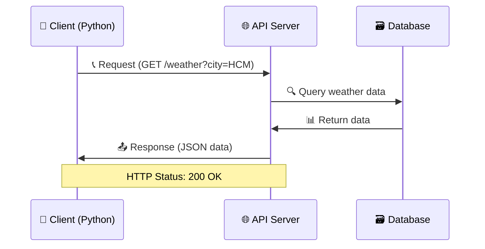

# 🌐 Làm Việc với API - Kết Nối Thế Giới Digital

> **Mục tiêu**: Học cách gọi API, xử lý dữ liệu web và tạo ứng dụng tương tác với internet! 🎯

## 🤔 API Là Gì? (Giải Thích Siêu Dễ)

**API** (Application Programming Interface) giống như **nhà hàng**:

### 🍽️ Hãy Tưởng Tượng...
- **Bạn** = Client (ứng dụng Python)
- **Thực đơn** = API Documentation  
- **Phục vụ** = API Endpoint
- **Món ăn** = Dữ liệu trả về
- **Hóa đơn** = HTTP Status Code



### 🔄 Quy Trình Hoạt Động
1. **Gửi yêu cầu** (Request) → "Tôi muốn thông tin thời tiết TP.HCM"
2. **Nhận phản hồi** (Response) → "Hôm nay 32°C, có mây"
3. **Xử lý dữ liệu** → Hiển thị trong ứng dụng

## 📡 Gửi HTTP Request với Python

### 🛠️ Cài Đặt Thư Viện `requests`
```python
# Nếu chưa có, cài đặt requests
# pip install requests

import requests
import json
from datetime import datetime

print("📦 Thư viện requests đã sẵn sàng!")
```

### 🎯 GET Request - Lấy Dữ Liệu
```python
def demo_get_request():
    """Demo GET request cơ bản"""
    
    # API công khai để test (JSONPlaceholder)
    url = "https://jsonplaceholder.typicode.com/posts/1"
    
    try:
        # Gửi GET request
        response = requests.get(url)
        
        # Kiểm tra status code
        print(f"📊 Status Code: {response.status_code}")
        
        if response.status_code == 200:
            # Chuyển JSON thành Python object
            data = response.json()
            
            print("✅ Lấy dữ liệu thành công!")
            print(f"📝 Tiêu đề: {data['title']}")
            print(f"👤 User ID: {data['userId']}")
            print(f"📄 Nội dung: {data['body'][:100]}...")
            
        else:
            print(f"❌ Lỗi: {response.status_code}")
            
    except requests.RequestException as e:
        print(f"🚫 Lỗi kết nối: {e}")

# Test GET request
demo_get_request()
```

### 📤 POST Request - Gửi Dữ Liệu
```python
def demo_post_request():
    """Demo POST request gửi dữ liệu"""
    
    url = "https://jsonplaceholder.typicode.com/posts"
    
    # Dữ liệu gửi lên server
    data = {
        'title': 'Học Python với Behitek',
        'body': 'Python là ngôn ngữ lập trình tuyệt vời!',
        'userId': 1
    }
    
    try:
        # Gửi POST request với JSON data
        response = requests.post(url, json=data)
        
        print(f"📊 Status Code: {response.status_code}")
        
        if response.status_code == 201:  # 201 = Created
            result = response.json()
            print("✅ Tạo bài viết thành công!")
            print(f"🆔 ID mới: {result['id']}")
            print(f"📝 Tiêu đề: {result['title']}")
        else:
            print(f"❌ Lỗi: {response.status_code}")
            
    except requests.RequestException as e:
        print(f"🚫 Lỗi kết nối: {e}")

# Test POST request
demo_post_request()
```

## 🌤️ Ví Dụ Thực Tế: Ứng Dụng Thời Tiết

```python
import requests
import json
from datetime import datetime

class WeatherApp:
    """Ứng dụng thời tiết sử dụng API"""
    
    def __init__(self):
        # Sử dụng API miễn phí OpenWeatherMap
        # Đăng ký tại: https://openweathermap.org/api
        self.api_key = "YOUR_API_KEY"  # Thay bằng API key thật
        self.base_url = "https://api.openweathermap.org/data/2.5/weather"
        
    def get_weather(self, city):
        """Lấy thông tin thời tiết theo tên thành phố"""
        
        # Tham số cho API call
        params = {
            'q': city,
            'appid': self.api_key,
            'units': 'metric',  # Celsius
            'lang': 'vi'        # Tiếng Việt
        }
        
        try:
            print(f"🔍 Đang tìm thông tin thời tiết {city}...")
            response = requests.get(self.base_url, params=params)
            
            if response.status_code == 200:
                data = response.json()
                return self.parse_weather_data(data)
            elif response.status_code == 404:
                print(f"❌ Không tìm thấy thành phố: {city}")
                return None
            elif response.status_code == 401:
                print("❌ API key không hợp lệ!")
                return None
            else:
                print(f"❌ Lỗi API: {response.status_code}")
                return None
                
        except requests.RequestException as e:
            print(f"🚫 Lỗi kết nối internet: {e}")
            return None
    
    def parse_weather_data(self, data):
        """Phân tích và format dữ liệu thời tiết"""
        
        weather_info = {
            'thanh_pho': data['name'],
            'quoc_gia': data['sys']['country'],
            'mo_ta': data['weather'][0]['description'].title(),
            'nhiet_do': round(data['main']['temp']),
            'cam_giac': round(data['main']['feels_like']),
            'nhiet_do_min': round(data['main']['temp_min']),
            'nhiet_do_max': round(data['main']['temp_max']),
            'do_am': data['main']['humidity'],
            'ap_suat': data['main']['pressure'],
            'toc_do_gio': data['wind']['speed'],
            'huong_gio': data['wind'].get('deg', 0),
            'do_che_phu_may': data['clouds']['all'],
            'thoi_gian_cap_nhat': datetime.fromtimestamp(data['dt'])
        }
        
        return weather_info
    
    def display_weather(self, weather_data):
        """Hiển thị thông tin thời tiết đẹp mắt"""
        
        if not weather_data:
            return
        
        # Icon thời tiết đơn giản
        temp = weather_data['nhiet_do']
        if temp >= 35:
            icon = "🌡️🔥"
        elif temp >= 25:
            icon = "☀️"
        elif temp >= 15:
            icon = "⛅"
        else:
            icon = "🌧️"
        
        print(f"\n{icon} === THỜI TIẾT {weather_data['thanh_pho'].upper()} ===")
        print("-" * 50)
        print(f"📍 Thành phố: {weather_data['thanh_pho']}, {weather_data['quoc_gia']}")
        print(f"🌤️ Tình trạng: {weather_data['mo_ta']}")
        print(f"🌡️ Nhiệt độ: {weather_data['nhiet_do']}°C (Cảm giác {weather_data['cam_giac']}°C)")
        print(f"📊 Min/Max: {weather_data['nhiet_do_min']}°C / {weather_data['nhiet_do_max']}°C")
        print(f"💧 Độ ẩm: {weather_data['do_am']}%")
        print(f"📈 Áp suất: {weather_data['ap_suat']} hPa")
        print(f"💨 Gió: {weather_data['toc_do_gio']} m/s")
        print(f"☁️ Mây che phủ: {weather_data['do_che_phu_may']}%")
        
        cap_nhat = weather_data['thoi_gian_cap_nhat'].strftime("%d/%m/%Y %H:%M")
        print(f"🕐 Cập nhật: {cap_nhat}")
        
    def save_weather_history(self, city, weather_data):
        """Lưu lịch sử thời tiết vào file"""
        
        if not weather_data:
            return
        
        # Chuẩn bị dữ liệu lưu trữ
        history_entry = {
            'timestamp': datetime.now().isoformat(),
            'city': city,
            'weather_data': weather_data
        }
        
        filename = 'weather_history.json'
        
        try:
            # Đọc lịch sử cũ (nếu có)
            try:
                with open(filename, 'r', encoding='utf-8') as file:
                    history = json.load(file)
            except FileNotFoundError:
                history = []
            
            # Thêm entry mới
            history.append(history_entry)
            
            # Giới hạn 100 records gần nhất
            if len(history) > 100:
                history = history[-100:]
            
            # Lưu lại file
            with open(filename, 'w', encoding='utf-8') as file:
                json.dump(history, file, ensure_ascii=False, indent=2, default=str)
            
            print(f"💾 Đã lưu lịch sử thời tiết vào {filename}")
            
        except Exception as e:
            print(f"❌ Lỗi khi lưu lịch sử: {e}")

    def get_multiple_cities(self, cities):
        """Lấy thời tiết nhiều thành phố cùng lúc"""
        
        print(f"🌍 === THỜI TIẾT {len(cities)} THÀNH PHỐ ===\n")
        
        results = {}
        
        for city in cities:
            weather_data = self.get_weather(city)
            if weather_data:
                results[city] = weather_data
                self.display_weather(weather_data)
                self.save_weather_history(city, weather_data)
                print()  # Dòng trống
            else:
                print(f"⚠️ Không lấy được dữ liệu cho {city}\n")
        
        return results

# Demo ứng dụng thời tiết (cần API key thật để chạy)
def demo_weather_app():
    """Demo ứng dụng thời tiết"""
    
    app = WeatherApp()
    
    # Mô phỏng dữ liệu thời tiết (vì không có API key thật)
    fake_weather = {
        'thanh_pho': 'TP. Hồ Chí Minh',
        'quoc_gia': 'VN',
        'mo_ta': 'Có Mây Rải Rác',
        'nhiet_do': 32,
        'cam_giac': 36,
        'nhiet_do_min': 28,
        'nhiet_do_max': 34,
        'do_am': 75,
        'ap_suat': 1013,
        'toc_do_gio': 3.2,
        'huong_gio': 180,
        'do_che_phu_may': 40,
        'thoi_gian_cap_nhat': datetime.now()
    }
    
    print("🌤️ DEMO ỨNG DỤNG THỜI TIẾT")
    app.display_weather(fake_weather)
    app.save_weather_history("Ho Chi Minh City", fake_weather)

# Chạy demo
demo_weather_app()
```

## 📰 Ví Dụ: Ứng Dụng Tin Tức

```python
import requests
from datetime import datetime
import html

class NewsApp:
    """Ứng dụng đọc tin tức từ API"""
    
    def __init__(self):
        # Sử dụng NewsAPI (cần đăng ký miễn phí)
        self.api_key = "YOUR_NEWS_API_KEY"
        self.base_url = "https://newsapi.org/v2"
        
    def get_top_headlines(self, country='us', category=None, max_articles=5):
        """Lấy tin tức nổi bật"""
        
        url = f"{self.base_url}/top-headlines"
        
        params = {
            'country': country,
            'apiKey': self.api_key,
            'pageSize': max_articles
        }
        
        if category:
            params['category'] = category
        
        try:
            response = requests.get(url, params=params)
            
            if response.status_code == 200:
                data = response.json()
                return data['articles']
            else:
                print(f"❌ Lỗi API: {response.status_code}")
                return []
                
        except requests.RequestException as e:
            print(f"🚫 Lỗi kết nối: {e}")
            return []
    
    def search_news(self, query, language='en', sort_by='publishedAt'):
        """Tìm kiếm tin tức theo từ khóa"""
        
        url = f"{self.base_url}/everything"
        
        params = {
            'q': query,
            'language': language,
            'sortBy': sort_by,
            'apiKey': self.api_key,
            'pageSize': 10
        }
        
        try:
            response = requests.get(url, params=params)
            
            if response.status_code == 200:
                data = response.json()
                return data['articles']
            else:
                print(f"❌ Lỗi tìm kiếm: {response.status_code}")
                return []
                
        except requests.RequestException as e:
            print(f"🚫 Lỗi kết nối: {e}")
            return []
    
    def display_articles(self, articles, title="TIN TỨC"):
        """Hiển thị danh sách bài báo"""
        
        if not articles:
            print("❌ Không có tin tức nào!")
            return
        
        print(f"\n📰 === {title.upper()} ===")
        print("-" * 60)
        
        for i, article in enumerate(articles, 1):
            # Xử lý dữ liệu có thể None
            title = article.get('title', 'Không có tiêu đề')
            source = article.get('source', {}).get('name', 'Không rõ nguồn')
            author = article.get('author', 'Không rõ tác giả')
            
            # Xử lý thời gian
            published = article.get('publishedAt')
            if published:
                pub_time = datetime.fromisoformat(published.replace('Z', '+00:00'))
                time_str = pub_time.strftime('%d/%m/%Y %H:%M')
            else:
                time_str = 'Không rõ thời gian'
            
            # Xử lý mô tả (có thể có HTML entities)
            description = article.get('description', 'Không có mô tả')
            if description:
                description = html.unescape(description)[:150] + "..."
            
            print(f"\n{i}. 📰 {title}")
            print(f"   🏢 Nguồn: {source}")
            print(f"   👤 Tác giả: {author}")
            print(f"   📅 Thời gian: {time_str}")
            print(f"   📝 Mô tả: {description}")
            
            url = article.get('url')
            if url:
                print(f"   🔗 Link: {url}")
    
    def save_articles_to_file(self, articles, filename):
        """Lưu tin tức vào file JSON"""
        
        data = {
            'saved_at': datetime.now().isoformat(),
            'total_articles': len(articles),
            'articles': articles
        }
        
        try:
            with open(filename, 'w', encoding='utf-8') as file:
                json.dump(data, file, ensure_ascii=False, indent=2, default=str)
            
            print(f"💾 Đã lưu {len(articles)} bài báo vào {filename}")
            
        except Exception as e:
            print(f"❌ Lỗi khi lưu file: {e}")

# Demo app tin tức với dữ liệu giả
def demo_news_app():
    """Demo ứng dụng tin tức"""
    
    # Dữ liệu tin tức giả để demo
    fake_articles = [
        {
            'title': 'Python Trở Thành Ngôn Ngữ Phổ Biến Nhất 2024',
            'source': {'name': 'Behitek News'},
            'author': 'Đội ngũ Behitek',
            'publishedAt': '2024-09-29T10:30:00Z',
            'description': 'Python tiếp tục dẫn đầu trong các khảo sát về ngôn ngữ lập trình được yêu thích nhất...',
            'url': 'https://behitek.com/python-2024'
        },
        {
            'title': 'AI và Machine Learning: Tương Lai Của Lập Trình',
            'source': {'name': 'Tech Vietnam'},
            'author': 'Nguyễn Văn Tech',
            'publishedAt': '2024-09-29T09:15:00Z',
            'description': 'Trí tuệ nhân tạo đang thay đổi cách chúng ta tiếp cận lập trình và phát triển phần mềm...',
            'url': 'https://techvietnam.com/ai-future'
        }
    ]
    
    app = NewsApp()
    
    print("📰 DEMO ỨNG DỤNG TIN TỨC")
    app.display_articles(fake_articles, "TIN TỨC CÔNG NGHỆ")
    app.save_articles_to_file(fake_articles, "tech_news.json")

# Chạy demo
demo_news_app()
```

## 🎮 Ví Dụ: Game API - Thông Tin Pokémon

```python
import requests
import json

class PokemonAPI:
    """Ứng dụng tra cứu thông tin Pokémon"""
    
    def __init__(self):
        self.base_url = "https://pokeapi.co/api/v2"
    
    def get_pokemon_info(self, pokemon_name):
        """Lấy thông tin chi tiết Pokemon"""
        
        url = f"{self.base_url}/pokemon/{pokemon_name.lower()}"
        
        try:
            print(f"🔍 Đang tìm thông tin Pokemon: {pokemon_name}...")
            response = requests.get(url)
            
            if response.status_code == 200:
                data = response.json()
                return self.parse_pokemon_data(data)
            elif response.status_code == 404:
                print(f"❌ Không tìm thấy Pokemon: {pokemon_name}")
                return None
            else:
                print(f"❌ Lỗi API: {response.status_code}")
                return None
                
        except requests.RequestException as e:
            print(f"🚫 Lỗi kết nối: {e}")
            return None
    
    def parse_pokemon_data(self, data):
        """Phân tích dữ liệu Pokemon"""
        
        # Lấy thông tin cơ bản
        pokemon_info = {
            'id': data['id'],
            'name': data['name'].title(),
            'height': data['height'] / 10,  # Chuyển từ decimeter sang meter
            'weight': data['weight'] / 10,  # Chuyển từ hectogram sang kg
            'base_experience': data['base_experience'],
            'types': [t['type']['name'] for t in data['types']],
            'abilities': [a['ability']['name'] for a in data['abilities']],
        }
        
        # Lấy thông số cơ bản (stats)
        pokemon_info['stats'] = {}
        for stat in data['stats']:
            stat_name = stat['stat']['name']
            stat_value = stat['base_stat']
            pokemon_info['stats'][stat_name] = stat_value
        
        # Lấy sprite (hình ảnh)
        sprites = data['sprites']
        pokemon_info['image_url'] = sprites['front_default']
        pokemon_info['shiny_image_url'] = sprites['front_shiny']
        
        return pokemon_info
    
    def display_pokemon_info(self, pokemon_info):
        """Hiển thị thông tin Pokemon đẹp mắt"""
        
        if not pokemon_info:
            return
        
        print(f"\n🔥 === POKEMON #{pokemon_info['id']}: {pokemon_info['name'].upper()} ===")
        print("-" * 60)
        
        print(f"📏 Chiều cao: {pokemon_info['height']} m")
        print(f"⚖️ Cân nặng: {pokemon_info['weight']} kg")
        print(f"⭐ Base Experience: {pokemon_info['base_experience']}")
        
        # Hiển thị types với emoji
        type_emojis = {
            'fire': '🔥', 'water': '💧', 'grass': '🌿', 'electric': '⚡',
            'psychic': '🔮', 'ice': '❄️', 'dragon': '🐉', 'dark': '🌑',
            'fairy': '✨', 'normal': '⚪', 'fighting': '👊', 'poison': '☠️',
            'ground': '🌍', 'flying': '🦅', 'bug': '🐛', 'rock': '🗿',
            'ghost': '👻', 'steel': '🔩'
        }
        
        types_str = ' / '.join([
            f"{type_emojis.get(t, '❓')} {t.title()}" 
            for t in pokemon_info['types']
        ])
        print(f"🏷️ Loại: {types_str}")
        
        abilities_str = ', '.join([a.title() for a in pokemon_info['abilities']])
        print(f"💪 Kỹ năng: {abilities_str}")
        
        # Hiển thị stats
        print(f"\n📊 THÔNG SỐ CƠ BẢN:")
        stat_names = {
            'hp': 'HP',
            'attack': 'Tấn công',
            'defense': 'Phòng thủ', 
            'special-attack': 'Tấn công đặc biệt',
            'special-defense': 'Phòng thủ đặc biệt',
            'speed': 'Tốc độ'
        }
        
        for stat_key, stat_value in pokemon_info['stats'].items():
            display_name = stat_names.get(stat_key, stat_key.title())
            bar_length = stat_value // 5  # Scale cho thanh progress
            bar = '█' * min(bar_length, 20) + '░' * (20 - min(bar_length, 20))
            print(f"  {display_name:20} │{bar}│ {stat_value}")
        
        if pokemon_info['image_url']:
            print(f"\n🖼️ Hình ảnh: {pokemon_info['image_url']}")
        
        if pokemon_info['shiny_image_url']:
            print(f"✨ Shiny: {pokemon_info['shiny_image_url']}")
    
    def get_pokemon_species_info(self, pokemon_id):
        """Lấy thông tin loài Pokemon (mô tả, v.v.)"""
        
        url = f"{self.base_url}/pokemon-species/{pokemon_id}"
        
        try:
            response = requests.get(url)
            if response.status_code == 200:
                data = response.json()
                
                # Tìm mô tả tiếng Anh
                description = "Không có mô tả"
                for entry in data['flavor_text_entries']:
                    if entry['language']['name'] == 'en':
                        description = entry['flavor_text'].replace('\n', ' ').replace('\f', ' ')
                        break
                
                return {
                    'description': description,
                    'habitat': data['habitat']['name'] if data['habitat'] else 'Unknown',
                    'is_legendary': data['is_legendary'],
                    'is_mythical': data['is_mythical']
                }
            else:
                return None
                
        except requests.RequestException:
            return None
    
    def search_pokemon_team(self, pokemon_names):
        """Tìm thông tin cho một team Pokemon"""
        
        print(f"🎯 === THÔNG TIN TEAM POKEMON ===\n")
        
        team_info = []
        
        for i, name in enumerate(pokemon_names, 1):
            print(f"Đang tải Pokemon {i}/{len(pokemon_names)}...")
            
            pokemon_data = self.get_pokemon_info(name)
            if pokemon_data:
                team_info.append(pokemon_data)
                
                # Lấy thêm thông tin loài
                species_data = self.get_pokemon_species_info(pokemon_data['id'])
                if species_data:
                    pokemon_data.update(species_data)
                
                self.display_pokemon_info(pokemon_data)
                
                if species_data:
                    print(f"📖 Mô tả: {species_data['description']}")
                    if species_data['is_legendary']:
                        print("👑 ĐÂY LÀ POKEMON HUYỀN THOẠI!")
                    if species_data['is_mythical']:
                        print("🌟 ĐÂY LÀ POKEMON THẦN THOẠI!")
                
                print("\n" + "="*60 + "\n")
        
        return team_info

# Demo Pokemon API
def demo_pokemon_app():
    """Demo ứng dụng Pokemon"""
    
    app = PokemonAPI()
    
    # Tìm thông tin một Pokemon
    pikachu = app.get_pokemon_info("pikachu")
    if pikachu:
        app.display_pokemon_info(pikachu)
    
    print("\n" + "="*80)
    
    # Tìm thông tin team Pokemon
    team = ["charizard", "blastoise", "venusaur"]
    app.search_pokemon_team(team)

# Chạy demo (cần internet)
demo_pokemon_app()
```

## 🔒 Xử Lý Authentication & Headers

```python
import requests
import base64

class APIClient:
    """Client để làm việc với API có authentication"""
    
    def __init__(self, base_url):
        self.base_url = base_url
        self.session = requests.Session()
        
        # Headers mặc định
        self.session.headers.update({
            'User-Agent': 'Behitek-Python-Client/1.0',
            'Content-Type': 'application/json'
        })
    
    def set_api_key_auth(self, api_key, header_name='X-API-Key'):
        """Thiết lập API Key authentication"""
        self.session.headers.update({header_name: api_key})
        print(f"🔑 Đã thiết lập API Key authentication")
    
    def set_bearer_token_auth(self, token):
        """Thiết lập Bearer Token authentication"""
        self.session.headers.update({
            'Authorization': f'Bearer {token}'
        })
        print(f"🔐 Đã thiết lập Bearer Token authentication")
    
    def set_basic_auth(self, username, password):
        """Thiết lập Basic Authentication"""
        credentials = f"{username}:{password}"
        encoded = base64.b64encode(credentials.encode()).decode()
        self.session.headers.update({
            'Authorization': f'Basic {encoded}'
        })
        print(f"👤 Đã thiết lập Basic Authentication cho {username}")
    
    def make_request(self, method, endpoint, **kwargs):
        """Gửi request với error handling"""
        
        url = f"{self.base_url.rstrip('/')}/{endpoint.lstrip('/')}"
        
        try:
            response = self.session.request(method, url, **kwargs)
            
            # Log request info
            print(f"📤 {method.upper()} {url}")
            print(f"📊 Status: {response.status_code}")
            
            # Xử lý response theo status code
            if response.status_code >= 200 and response.status_code < 300:
                print("✅ Request thành công")
                try:
                    return response.json()
                except ValueError:
                    return response.text
            elif response.status_code == 401:
                print("❌ Lỗi xác thực (401 Unauthorized)")
                return None
            elif response.status_code == 403:
                print("❌ Không có quyền truy cập (403 Forbidden)")
                return None
            elif response.status_code == 404:
                print("❌ Không tìm thấy (404 Not Found)")
                return None
            elif response.status_code == 429:
                print("❌ Quá nhiều requests (429 Rate Limited)")
                return None
            else:
                print(f"❌ Lỗi server ({response.status_code})")
                return None
                
        except requests.RequestException as e:
            print(f"🚫 Lỗi kết nối: {e}")
            return None
    
    def get(self, endpoint, params=None):
        """GET request"""
        return self.make_request('GET', endpoint, params=params)
    
    def post(self, endpoint, data=None, json=None):
        """POST request"""
        return self.make_request('POST', endpoint, data=data, json=json)
    
    def put(self, endpoint, data=None, json=None):
        """PUT request"""
        return self.make_request('PUT', endpoint, data=data, json=json)
    
    def delete(self, endpoint):
        """DELETE request"""
        return self.make_request('DELETE', endpoint)

# Demo API Client với authentication
def demo_api_client():
    """Demo API client với các loại authentication"""
    
    # Tạo client
    client = APIClient("https://jsonplaceholder.typicode.com")
    
    # Test GET request
    posts = client.get("/posts", params={'_limit': 3})
    if posts:
        print(f"📝 Lấy được {len(posts)} bài viết:")
        for post in posts:
            print(f"  - {post['title'][:50]}...")
    
    # Test POST request
    new_post = {
        'title': 'Học Python API với Behitek',
        'body': 'Đây là bài viết về cách sử dụng API trong Python',
        'userId': 1
    }
    
    result = client.post("/posts", json=new_post)
    if result:
        print(f"✅ Tạo bài viết mới với ID: {result.get('id')}")

# Chạy demo
demo_api_client()
```

## 💡 Mẹo Hay Ho Với API

### 🎯 1. **Rate Limiting & Retry Logic**
```python
import time
from functools import wraps

def rate_limited(max_per_second=1):
    """Decorator để giới hạn số request per second"""
    min_interval = 1.0 / float(max_per_second)
    last_called = [0.0]
    
    def decorator(func):
        @wraps(func)
        def wrapper(*args, **kwargs):
            elapsed = time.time() - last_called[0]
            left_to_wait = min_interval - elapsed
            if left_to_wait > 0:
                time.sleep(left_to_wait)
            ret = func(*args, **kwargs)
            last_called[0] = time.time()
            return ret
        return wrapper
    return decorator

def retry_on_failure(max_retries=3, delay=1):
    """Decorator để retry khi request thất bại"""
    def decorator(func):
        @wraps(func)
        def wrapper(*args, **kwargs):
            for attempt in range(max_retries):
                try:
                    return func(*args, **kwargs)
                except requests.RequestException as e:
                    if attempt == max_retries - 1:
                        print(f"❌ Thất bại sau {max_retries} lần thử: {e}")
                        raise
                    print(f"⚠️ Lần thử {attempt + 1} thất bại, đang retry...")
                    time.sleep(delay * (attempt + 1))  # Exponential backoff
            return None
        return wrapper
    return decorator

# Sử dụng decorators
class SmartAPIClient:
    @rate_limited(max_per_second=2)  # Tối đa 2 request/giây
    @retry_on_failure(max_retries=3, delay=1)
    def safe_get(self, url):
        response = requests.get(url)
        response.raise_for_status()
        return response.json()
```

### 🎯 2. **Caching API Responses**
```python
import json
import hashlib
from datetime import datetime, timedelta
import os

class APICache:
    """Cache cho API responses"""
    
    def __init__(self, cache_dir="api_cache", ttl_minutes=60):
        self.cache_dir = cache_dir
        self.ttl = timedelta(minutes=ttl_minutes)
        
        # Tạo thư mục cache nếu chưa có
        os.makedirs(cache_dir, exist_ok=True)
    
    def _get_cache_key(self, url, params=None):
        """Tạo key cho cache"""
        cache_string = url
        if params:
            cache_string += str(sorted(params.items()))
        
        return hashlib.md5(cache_string.encode()).hexdigest()
    
    def get(self, url, params=None):
        """Lấy dữ liệu từ cache"""
        cache_key = self._get_cache_key(url, params)
        cache_file = os.path.join(self.cache_dir, f"{cache_key}.json")
        
        if os.path.exists(cache_file):
            try:
                with open(cache_file, 'r', encoding='utf-8') as f:
                    cached_data = json.load(f)
                
                # Kiểm tra TTL
                cached_time = datetime.fromisoformat(cached_data['timestamp'])
                if datetime.now() - cached_time < self.ttl:
                    print("🗄️ Sử dụng dữ liệu cache")
                    return cached_data['data']
                
            except (json.JSONDecodeError, KeyError):
                pass
        
        return None
    
    def set(self, url, params, data):
        """Lưu dữ liệu vào cache"""
        cache_key = self._get_cache_key(url, params)
        cache_file = os.path.join(self.cache_dir, f"{cache_key}.json")
        
        cached_data = {
            'timestamp': datetime.now().isoformat(),
            'url': url,
            'params': params,
            'data': data
        }
        
        try:
            with open(cache_file, 'w', encoding='utf-8') as f:
                json.dump(cached_data, f, ensure_ascii=False, indent=2, default=str)
            print("💾 Đã cache dữ liệu")
        except Exception as e:
            print(f"❌ Lỗi khi cache: {e}")

# API client với cache
class CachedAPIClient:
    def __init__(self):
        self.cache = APICache(ttl_minutes=30)
    
    def get_with_cache(self, url, params=None):
        """GET request với cache"""
        
        # Thử lấy từ cache trước
        cached_result = self.cache.get(url, params)
        if cached_result:
            return cached_result
        
        # Nếu không có cache, gọi API
        try:
            response = requests.get(url, params=params)
            if response.status_code == 200:
                data = response.json()
                self.cache.set(url, params, data)
                return data
            else:
                print(f"❌ API Error: {response.status_code}")
                return None
        except requests.RequestException as e:
            print(f"🚫 Connection Error: {e}")
            return None
```

## 🎮 Bài Tập Thực Hành

### 🏆 Bài 1: Ứng Dụng Từ Điển
Tạo ứng dụng tra từ điển sử dụng Dictionary API:
- Tra nghĩa từ tiếng Anh
- Phát âm và ví dụ
- Lưu lịch sử tra cứu

### 🏆 Bài 2: GitHub Profile Viewer
Tạo ứng dụng xem thông tin GitHub:
- Thông tin user
- Danh sách repositories
- Thống kê contributions

### 🏆 Bài 3: Cryptocurrency Tracker
Tạo ứng dụng theo dõi giá crypto:
- Giá real-time từ CoinGecko API
- Lịch sử giá
- Cảnh báo thay đổi giá

## 🔗 Kiến Thức Liên Quan

- **[Làm Việc với JSON](./working-with-json.md)** - Xử lý dữ liệu API
- **[Xử Lý Lỗi](../intermediate/error-handling.md)** - Handle API errors
- **[File Handling](./file-handling.md)** - Lưu trữ API responses

---

*🎉 **Chúc mừng!** Bạn đã biết cách làm việc với API - cửa ngõ để ứng dụng Python kết nối với thế giới! Giờ bạn có thể tạo những ứng dụng thực sự hữu ích! 🚀*
