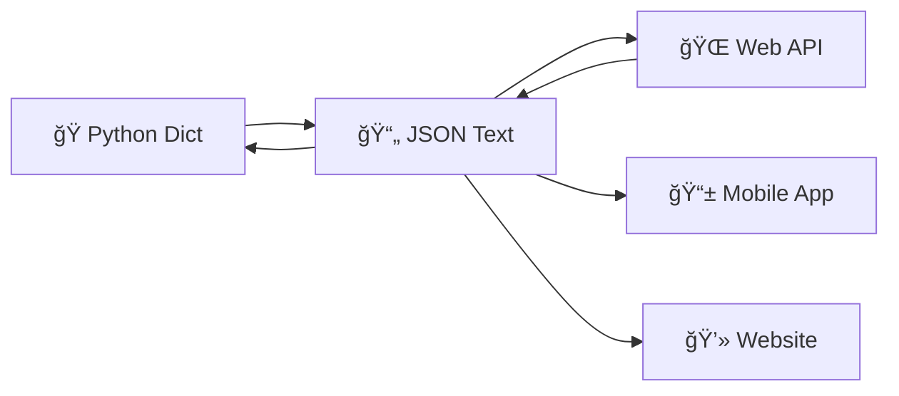

# 📊 Làm Việc với JSON - Dữ Liệu Thông Minh

> **Mục tiêu**: Học cách đọc, ghi và xử lý dữ liệu JSON như một chuyên gia API! 🎯

## 🤔 JSON Là Gì? (Giải Thích Siêu Dễ)

**JSON** (JavaScript Object Notation) giống như **ngôn ngữ chung** để các máy tính "nói chuyện" với nhau:

### 🏠 Hãy Tưởng Tượng...
- **JSON** = **Thẻ thông tin chuẩn quốc tế** 🆔
- **Mọi máy tính đều hiểu** được format này
- **Dễ đọc** cho cả người và máy
- **Nhẹ và nhanh** khi truyền tải



### 🔍 JSON Trông Như Thế Nào?
```json
{
    "ho_ten": "Nguyễn Văn An",
    "tuoi": 16,
    "lop": "10A",
    "mon_hoc_yeu_thich": ["Toán", "Lý", "Tin học"],
    "dia_chi": {
        "duong": "123 Đường ABC",
        "quan": "Quận 1", 
        "thanh_pho": "TP.HCM"
    },
    "dang_hoc": true,
    "diem_trung_binh": 8.5
}
```

## 📖 Đọc JSON trong Python

### 🔄 Từ String JSON → Python Object
```python
import json

# JSON string (thường nhận từ API)
json_string = '''
{
    "hoc_sinh": {
        "ho_ten": "Trần Thị Bình",
        "tuoi": 15,
        "lop": "9B",
        "diem_so": {
            "toan": [8.5, 9.0, 7.5],
            "van": [8.0, 8.5, 9.0],
            "anh": [9.0, 8.0, 9.5]
        },
        "sở_thich": ["đọc sách", "nghe nhạc", "học Python"],
        "la_hoc_sinh_gioi": true
    },
    "thong_tin_lop": {
        "ten_lop": "9B",
        "si_so": 35,
        "giao_vien_chu_nhiem": "Cô Lan"
    }
}
'''

# Chuyển JSON string thành Python dictionary
data = json.loads(json_string)
print("📊 DỮ LIỆU ĐÃ CHUYỂN ĐỔI:")
print(type(data))  # <class 'dict'>

# Truy cập dữ liệu như dictionary bình thường
hoc_sinh = data["hoc_sinh"]
print(f"Học sinh: {hoc_sinh['ho_ten']}")
print(f"Tuổi: {hoc_sinh['tuoi']}")
print(f"Lớp: {hoc_sinh['lop']}")

# Truy cập dữ liệu lồng nhau
diem_toan = hoc_sinh["diem_so"]["toan"]
print(f"Điểm Toán: {diem_toan}")
print(f"Điểm TB Toán: {sum(diem_toan) / len(diem_toan):.1f}")

# Kiểm tra có phải học sinh giỏi không
if hoc_sinh["la_hoc_sinh_gioi"]:
    print("🏆 Đây là học sinh giỏi!")
```

### 📁 Đọc JSON từ File
```python
import json

# Tạo file JSON mẫu trước
du_lieu_mau = {
    "truong_hoc": {
        "ten": "THPT Behitek Academy",
        "dia_chi": "123 Đường Lập Trình, Quận Code, TP.HCM",
        "so_hoc_sinh": 500,
        "cac_lop": [
            {
                "ten_lop": "10A",
                "si_so": 30,
                "chuyen_nganh": "Tin học",
                "hoc_sinh": [
                    {"ten": "An", "diem_tb": 8.5},
                    {"ten": "Bình", "diem_tb": 9.0},
                    {"ten": "Chi", "diem_tb": 8.8}
                ]
            },
            {
                "ten_lop": "11B", 
                "si_so": 28,
                "chuyen_nganh": "Toán tin",
                "hoc_sinh": [
                    {"ten": "Dũng", "diem_tb": 9.2},
                    {"ten": "Em", "diem_tb": 8.7}
                ]
            }
        ]
    }
}

# Lưu dữ liệu mẫu vào file
with open('truong_hoc.json', 'w', encoding='utf-8') as file:
    json.dump(du_lieu_mau, file, ensure_ascii=False, indent=2)

print("✅ Đã tạo file truong_hoc.json")

# Đọc dữ liệu từ file JSON
def doc_thong_tin_truong(file_name):
    """Đọc thông tin trường từ file JSON"""
    try:
        with open(file_name, 'r', encoding='utf-8') as file:
            data = json.load(file)
        return data
    except FileNotFoundError:
        print(f"❌ Không tìm thấy file: {file_name}")
        return None
    except json.JSONDecodeError:
        print(f"❌ File JSON không hợp lệ: {file_name}")
        return None

# Sử dụng
thong_tin = doc_thong_tin_truong('truong_hoc.json')
if thong_tin:
    truong = thong_tin["truong_hoc"]
    print(f"🏫 Trường: {truong['ten']}")
    print(f"📍 Địa chỉ: {truong['dia_chi']}")
    print(f"👥 Tổng số học sinh: {truong['so_hoc_sinh']}")
    
    print("\n📚 DANH SÁCH LỚP:")
    for lop in truong["cac_lop"]:
        print(f"- {lop['ten_lop']}: {lop['si_so']} HS ({lop['chuyen_nganh']})")
        
        # Tính điểm TB của lớp
        tong_diem = sum(hs["diem_tb"] for hs in lop["hoc_sinh"])
        diem_tb_lop = tong_diem / len(lop["hoc_sinh"])
        print(f"  📊 Điểm TB lớp: {diem_tb_lop:.1f}")
```

## ✍️ Ghi JSON trong Python

### 🔄 Từ Python Object → JSON String
```python
import json
from datetime import datetime

# Tạo dữ liệu Python phức tạp
du_lieu_hoc_tap = {
    "thoi_gian_tao": datetime.now().strftime("%d/%m/%Y %H:%M"),
    "hoc_sinh": "Nguyễn Văn An",
    "ket_qua_hoc_tap": {
        "hoc_ki_1": {
            "toan": {"diem": [8.5, 9.0, 8.0], "nhan_xet": "Khá tốt"},
            "ly": {"diem": [7.5, 8.0, 9.0], "nhan_xet": "Cần cố gắng hơn"},
            "hoa": {"diem": [9.0, 8.5, 9.5], "nhan_xet": "Rất giỏi"}
        },
        "hoat_dong_ngoai_khoa": [
            {"ten": "CLB Lập trình", "vai_tro": "Thành viên", "tham_gia": True},
            {"ten": "Đội bóng đá", "vai_tro": "Thủ môn", "tham_gia": False},
            {"ten": "Ban nhạc", "vai_tro": "Guitar", "tham_gia": True}
        ]
    },
    "muc_tieu": {
        "ngắn_hạn": "Đạt điểm 9+ tất cả môn",
        "dài_hạn": "Trở thành lập trình viên Python",
        "ước_mơ": "Tạo ra ứng dụng giúp ích cho mọi người"
    }
}

# Chuyển thành JSON string với format đẹp
json_string = json.dumps(
    du_lieu_hoc_tap, 
    ensure_ascii=False,  # Hiển thị tiếng Việt đúng
    indent=2,           # Thụt lề 2 space
    separators=(',', ': ')  # Dấu phẩy và dấu hai chấm
)

print("📄 JSON STRING:")
print(json_string)

# Lưu vào file với encoding UTF-8
with open('ket_qua_hoc_tap.json', 'w', encoding='utf-8') as file:
    json.dump(du_lieu_hoc_tap, file, ensure_ascii=False, indent=2)

print("\n💾 Đã lưu vào file ket_qua_hoc_tap.json")
```

## 🎮 Ví Dụ Thực Tế: Hệ Thống Quản Lý Game

```python
import json
import random
from datetime import datetime

class GameManager:
    """Quản lý dữ liệu game với JSON"""
    
    def __init__(self, file_name="game_data.json"):
        self.file_name = file_name
        self.data = self.load_game_data()
    
    def load_game_data(self):
        """Tải dữ liệu game từ file JSON"""
        try:
            with open(self.file_name, 'r', encoding='utf-8') as file:
                return json.load(file)
        except FileNotFoundError:
            print("🎮 Tạo dữ liệu game mới...")
            return self.create_default_data()
        except json.JSONDecodeError:
            print("❌ File dữ liệu bị lỗi, tạo mới...")
            return self.create_default_data()
    
    def create_default_data(self):
        """Tạo dữ liệu game mặc định"""
        return {
            "game_info": {
                "name": "Behitek RPG Adventure",
                "version": "1.0.0",
                "created": datetime.now().strftime("%d/%m/%Y %H:%M")
            },
            "players": {},
            "items": {
                "sword_basic": {"name": "Kiếm Thép", "attack": 10, "price": 100},
                "potion_health": {"name": "Thuốc Hồi Máu", "heal": 50, "price": 20},
                "armor_leather": {"name": "Áo Giáp Da", "defense": 5, "price": 80}
            },
            "quests": {
                "kill_10_goblins": {
                    "name": "Tiêu diệt 10 Goblin",
                    "description": "Giúp dân làng tiêu diệt goblin",
                    "reward_exp": 100,
                    "reward_gold": 50
                }
            }
        }
    
    def save_game_data(self):
        """Lưu dữ liệu game vào file JSON"""
        try:
            with open(self.file_name, 'w', encoding='utf-8') as file:
                json.dump(self.data, file, ensure_ascii=False, indent=2)
            print("💾 Đã lưu dữ liệu game!")
            return True
        except Exception as e:
            print(f"❌ Lỗi khi lưu: {e}")
            return False
    
    def create_player(self, player_name):
        """Tạo nhân vật mới"""
        if player_name in self.data["players"]:
            print(f"❌ Nhân vật {player_name} đã tồn tại!")
            return False
        
        new_player = {
            "name": player_name,
            "level": 1,
            "hp": 100,
            "mp": 50,
            "attack": 10,
            "defense": 5,
            "experience": 0,
            "gold": 100,
            "inventory": {
                "sword_basic": 1,
                "potion_health": 3
            },
            "quests_completed": [],
            "last_login": datetime.now().strftime("%d/%m/%Y %H:%M"),
            "play_time_hours": 0
        }
        
        self.data["players"][player_name] = new_player
        self.save_game_data()
        print(f"🎉 Tạo nhân vật {player_name} thành công!")
        return True
    
    def get_player_info(self, player_name):
        """Lấy thông tin nhân vật"""
        if player_name not in self.data["players"]:
            print(f"❌ Không tìm thấy nhân vật {player_name}")
            return None
        
        player = self.data["players"][player_name]
        print(f"\n👤 THÔNG TIN NHÂN VẬT: {player['name']}")
        print("-" * 40)
        print(f"⚡ Level: {player['level']}")
        print(f"❤️ HP: {player['hp']}")
        print(f"💙 MP: {player['mp']}")
        print(f"⚔️ Attack: {player['attack']}")
        print(f"🛡️ Defense: {player['defense']}")
        print(f"🌟 EXP: {player['experience']}")
        print(f"💰 Gold: {player['gold']}")
        print(f"🎒 Inventory: {len(player['inventory'])} items")
        print(f"📅 Last login: {player['last_login']}")
        
        return player
    
    def add_item_to_player(self, player_name, item_id, quantity=1):
        """Thêm item vào inventory"""
        if player_name not in self.data["players"]:
            print(f"❌ Không tìm thấy nhân vật {player_name}")
            return False
        
        if item_id not in self.data["items"]:
            print(f"❌ Không tìm thấy item {item_id}")
            return False
        
        player = self.data["players"][player_name]
        
        if item_id in player["inventory"]:
            player["inventory"][item_id] += quantity
        else:
            player["inventory"][item_id] = quantity
        
        item_name = self.data["items"][item_id]["name"]
        print(f"✅ Đã thêm {quantity} {item_name} cho {player_name}")
        
        self.save_game_data()
        return True
    
    def complete_quest(self, player_name, quest_id):
        """Hoàn thành nhiệm vụ"""
        if player_name not in self.data["players"]:
            return False
        
        if quest_id not in self.data["quests"]:
            print(f"❌ Không tìm thấy quest {quest_id}")
            return False
        
        player = self.data["players"][player_name]
        quest = self.data["quests"][quest_id]
        
        # Kiểm tra đã hoàn thành chưa
        if quest_id in player["quests_completed"]:
            print(f"❌ {player_name} đã hoàn thành quest này rồi!")
            return False
        
        # Thưởng cho player
        player["experience"] += quest["reward_exp"]
        player["gold"] += quest["reward_gold"]
        player["quests_completed"].append(quest_id)
        
        print(f"🎉 {player_name} hoàn thành: {quest['name']}")
        print(f"📈 +{quest['reward_exp']} EXP, +{quest['reward_gold']} Gold")
        
        # Kiểm tra level up
        self.check_level_up(player_name)
        self.save_game_data()
        return True
    
    def check_level_up(self, player_name):
        """Kiểm tra và xử lý level up"""
        player = self.data["players"][player_name]
        exp_needed = player["level"] * 100  # 100 EXP cho level đầu tiên
        
        if player["experience"] >= exp_needed:
            player["level"] += 1
            player["hp"] += 20
            player["mp"] += 10
            player["attack"] += 2
            player["defense"] += 1
            player["experience"] = 0  # Reset EXP
            
            print(f"🌟 {player_name} lên Level {player['level']}!")
            print("📊 Tất cả chỉ số được tăng!")
    
    def export_player_data(self, player_name, export_file="player_export.json"):
        """Xuất dữ liệu nhân vật ra file riêng"""
        if player_name not in self.data["players"]:
            print(f"❌ Không tìm thấy nhân vật {player_name}")
            return False
        
        player_data = {
            "export_info": {
                "player_name": player_name,
                "export_time": datetime.now().strftime("%d/%m/%Y %H:%M"),
                "game_version": self.data["game_info"]["version"]
            },
            "player_data": self.data["players"][player_name]
        }
        
        try:
            with open(export_file, 'w', encoding='utf-8') as file:
                json.dump(player_data, file, ensure_ascii=False, indent=2)
            print(f"📤 Đã xuất dữ liệu {player_name} ra file {export_file}")
            return True
        except Exception as e:
            print(f"❌ Lỗi khi xuất: {e}")
            return False

# Demo hệ thống game
print("🎮 === BEHITEK RPG GAME MANAGER ===")

# Khởi tạo game manager
game = GameManager("behitek_rpg.json")

# Tạo nhân vật mới
game.create_player("HiepSiBehitek")
game.create_player("PhapSuCode")

# Xem thông tin nhân vật
game.get_player_info("HiepSiBehitek")

# Thêm item cho nhân vật
game.add_item_to_player("HiepSiBehitek", "potion_health", 5)
game.add_item_to_player("HiepSiBehitek", "armor_leather", 1)

# Hoàn thành quest
game.complete_quest("HiepSiBehitek", "kill_10_goblins")

# Xem lại thông tin sau khi hoàn thành quest
game.get_player_info("HiepSiBehitek")

# Xuất dữ liệu nhân vật
game.export_player_data("HiepSiBehitek", "hiep_si_behitek_save.json")
```

## 🌐 Làm Việc với API JSON

```python
import json
import urllib.request
from urllib.error import URLError

class WeatherAPI:
    """Ví dụ làm việc với API trả về JSON"""
    
    def __init__(self):
        # Sử dụng free API để demo (không cần API key)
        self.base_url = "https://api.openweathermap.org/data/2.5/weather"
    
    def simulate_api_response(self, city="Ho Chi Minh City"):
        """Mô phỏng response từ API thời tiết"""
        # Trong thực tế, bạn sẽ gọi API thật
        fake_response = {
            "coord": {"lon": 106.6667, "lat": 10.8333},
            "weather": [
                {
                    "id": 803,
                    "main": "Clouds",
                    "description": "broken clouds",
                    "icon": "04d"
                }
            ],
            "main": {
                "temp": 302.15,  # Kelvin
                "feels_like": 309.65,
                "temp_min": 301.15,
                "temp_max": 303.15,
                "pressure": 1013,
                "humidity": 74
            },
            "wind": {
                "speed": 3.5,
                "deg": 180
            },
            "name": city,
            "country": "VN"
        }
        
        return json.dumps(fake_response)
    
    def parse_weather_data(self, json_data):
        """Phân tích dữ liệu thời tiết từ JSON"""
        try:
            data = json.loads(json_data)
            
            # Chuyển đổi nhiệt độ từ Kelvin sang Celsius
            temp_celsius = data["main"]["temp"] - 273.15
            feels_like_celsius = data["main"]["feels_like"] - 273.15
            
            weather_info = {
                "thanh_pho": data["name"],
                "quoc_gia": data.get("country", "N/A"),
                "mo_ta": data["weather"][0]["description"],
                "nhiet_do": round(temp_celsius, 1),
                "cam_giac_nhu": round(feels_like_celsius, 1),
                "do_am": data["main"]["humidity"],
                "ap_suat": data["main"]["pressure"],
                "toc_do_gio": data["wind"]["speed"]
            }
            
            return weather_info
            
        except (json.JSONDecodeError, KeyError) as e:
            print(f"❌ Lỗi khi phân tích dữ liệu: {e}")
            return None
    
    def display_weather(self, city="Ho Chi Minh City"):
        """Hiển thị thông tin thời tiết"""
        print(f"🌤️ === THỜI TIẾT {city.upper()} ===")
        
        # Lấy dữ liệu (mô phỏng)
        json_response = self.simulate_api_response(city)
        weather_data = self.parse_weather_data(json_response)
        
        if weather_data:
            print(f"📍 Thành phố: {weather_data['thanh_pho']}")
            print(f"🌡️ Nhiệt độ: {weather_data['nhiet_do']}°C")
            print(f"🤔 Cảm giác như: {weather_data['cam_giac_nhu']}°C")
            print(f"☁️ Mô tả: {weather_data['mo_ta']}")
            print(f"💧 Độ ẩm: {weather_data['do_am']}%")
            print(f"📊 Áp suất: {weather_data['ap_suat']} hPa")
            print(f"💨 Gió: {weather_data['toc_do_gio']} m/s")
            
            # Lưu vào file để backup
            filename = f"weather_{city.replace(' ', '_').lower()}.json"
            with open(filename, 'w', encoding='utf-8') as file:
                json.dump(weather_data, file, ensure_ascii=False, indent=2)
            
            print(f"💾 Đã lưu vào {filename}")

# Demo API JSON
weather = WeatherAPI()
weather.display_weather("Ho Chi Minh City")
weather.display_weather("Ha Noi")
```

## 🔧 Xử Lý Lỗi với JSON

```python
import json

def safe_json_operations():
    """Các thao tác JSON an toàn với xử lý lỗi"""
    
    # 1. Xử lý JSON không hợp lệ
    invalid_json = '{"name": "An", "age": 16, invalid}'
    
    try:
        data = json.loads(invalid_json)
    except json.JSONDecodeError as e:
        print(f"❌ JSON không hợp lệ: {e}")
        print(f"Lỗi ở vị trí: {e.pos}")
    
    # 2. Xử lý dữ liệu None
    def safe_json_dump(data, filename):
        """Ghi JSON an toàn"""
        try:
            with open(filename, 'w', encoding='utf-8') as file:
                json.dump(data, file, ensure_ascii=False, indent=2)
            return True
        except TypeError as e:
            print(f"❌ Dữ liệu không thể serialize: {e}")
            return False
        except Exception as e:
            print(f"❌ Lỗi khác: {e}")
            return False
    
    # 3. Xử lý key không tồn tại
    def safe_get_value(data, *keys):
        """Lấy giá trị lồng nhau một cách an toàn"""
        try:
            current = data
            for key in keys:
                current = current[key]
            return current
        except (KeyError, TypeError):
            return None
    
    # Test
    test_data = {
        "hoc_sinh": {
            "thong_tin": {
                "ten": "An",
                "tuoi": 16
            }
        }
    }
    
    # An toàn
    ten = safe_get_value(test_data, "hoc_sinh", "thong_tin", "ten")
    diem = safe_get_value(test_data, "hoc_sinh", "diem_so", "toan")  # Không tồn tại
    
    print(f"Tên: {ten}")
    print(f"Điểm toán: {diem}")

safe_json_operations()
```

## 💡 Mẹo Hay Ho với JSON

### 🎯 1. **Custom JSON Encoder cho Object**
```python
import json
from datetime import datetime

class HocSinhEncoder(json.JSONEncoder):
    """Custom encoder cho class HocSinh"""
    
    def default(self, obj):
        if isinstance(obj, datetime):
            return obj.strftime("%d/%m/%Y %H:%M")
        elif hasattr(obj, '__dict__'):
            # Chuyển object thành dict
            return obj.__dict__
        return super().default(obj)

class HocSinh:
    def __init__(self, ten, tuoi):
        self.ten = ten
        self.tuoi = tuoi
        self.ngay_tao = datetime.now()

# Sử dụng custom encoder
hoc_sinh = HocSinh("An", 16)

json_string = json.dumps(hoc_sinh, cls=HocSinhEncoder, ensure_ascii=False, indent=2)
print(json_string)
```

### 🎯 2. **Kiểm Tra JSON Hợp Lệ**
```python
def is_valid_json(json_string):
    """Kiểm tra chuỗi có phải JSON hợp lệ không"""
    try:
        json.loads(json_string)
        return True
    except json.JSONDecodeError:
        return False

# Test
test_cases = [
    '{"valid": true}',  # Hợp lệ
    '{"invalid": }',    # Không hợp lệ  
    '[]',               # Hợp lệ (array)
    'not json at all'   # Không hợp lệ
]

for test in test_cases:
    print(f"'{test[:20]}...' → {'✅' if is_valid_json(test) else '❌'}")
```

### 🎯 3. **Pretty Print JSON**
```python
def pretty_print_json(data):
    """In JSON đẹp màt"""
    print(json.dumps(data, ensure_ascii=False, indent=2, sort_keys=True))

sample_data = {
    "z_field": "Last",
    "a_field": "First", 
    "nested": {
        "c": 3,
        "a": 1,
        "b": 2
    }
}

pretty_print_json(sample_data)
```

## 🎮 Bài Tập Thực Hành

### 🏆 Bài 1: Quản Lý Thư Viện JSON
Tạo hệ thống quản lý thư viện lưu trữ với JSON:
- Thông tin sách (tên, tác giả, năm xuất bản)
- Thông tin người mượn
- Lịch sử mượn/trả

### 🏆 Bài 2: Ứng Dụng Todo với JSON
Tạo todo app lưu dữ liệu JSON:
- Thêm, sửa, xóa task
- Đánh dấu hoàn thành
- Xuất báo cáo tiến độ

### 🏆 Bài 3: API Mock Server
Tạo hệ thống mô phỏng API:
- Trả về dữ liệu JSON theo request
- Lưu log các API call
- Validate dữ liệu đầu vào

## 🔗 Kiến Thức Liên Quan

- **[Làm Việc với File](./file-handling.md)** - Nền tảng để đọc/ghi JSON
- **[Xử Lý Lỗi](../intermediate/error-handling.md)** - Xử lý lỗi JSON
- **[Làm Việc với API](./working-with-apis.md)** - Sử dụng JSON trong API

---

*🎉 **Chúc mừng!** Bạn đã thành thạo JSON - ngôn ngữ giao tiếp của web! Giờ bạn có thể xử lý dữ liệu như một chuyên gia API! 🚀*
