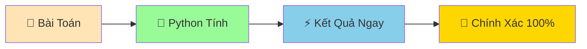

# 🧮 Phép Tính Cơ Bản - Dạy Python Làm Toán

:::tip 🧮 Ví Dụ Dễ Hiểu
Python như một **máy tính siêu thông minh** có thể làm toán nhanh hơn bạn gấp hàng triệu lần! Từ phép cộng đơn giản đến tính toán phức tạp, Python đều làm được!
:::

## 🤔 Tại Sao Python Cần Biết Làm Toán?

Trong cuộc sống, chúng ta làm toán mọi lúc:
- 💰 **Tính tiền mua sắm**: 3 cái bánh × 15.000đ = ?
- 📊 **Tính điểm trung bình**: (8 + 9 + 7) ÷ 3 = ?
- ⏰ **Tính thời gian**: 2 giờ 30 phút = ? phút
- 🏃 **Tính tốc độ**: 100m trong 15 giây = ? m/s

Python giúp chúng ta tính toán **nhanh chóng và chính xác**!



## ➕➖✖️➗ Các Phép Tính Cơ Bản

### ➕ 1. Phép Cộng (+)

```python
# Cộng số
ket_qua = 5 + 3
print(ket_qua)  # 8

# Cộng với biến
tien_tiet_kiem = 100000
tien_duoc_tang = 50000
tong_tien = tien_tiet_kiem + tien_duoc_tang
print(f"Tổng tiền: {tong_tien} VNĐ")  # 150000 VNĐ

# Cộng nhiều số
diem_toan = 8.5
diem_ly = 9.0
diem_hoa = 7.5
tong_diem = diem_toan + diem_ly + diem_hoa
print(f"Tổng điểm: {tong_diem}")  # 25.0
```

### ➖ 2. Phép Trừ (-)

```python
# Trừ số
ket_qua = 10 - 3
print(ket_qua)  # 7

# Tính số tiền còn lại
tien_ban_dau = 200000
tien_mua_sach = 75000
tien_con_lai = tien_ban_dau - tien_mua_sach
print(f"Tiền còn lại: {tien_con_lai} VNĐ")  # 125000 VNĐ

# Tính tuổi
nam_hien_tai = 2024
nam_sinh = 2010
tuoi = nam_hien_tai - nam_sinh
print(f"Tuổi: {tuoi}")  # 14
```

### ✖️ 3. Phép Nhân (*)

```python
# Nhân số
ket_qua = 6 * 4
print(ket_qua)  # 24

# Tính tiền mua nhiều món
gia_banh_mi = 15000
so_luong = 3
tong_tien = gia_banh_mi * so_luong
print(f"Tổng tiền: {tong_tien} VNĐ")  # 45000 VNĐ

# Tính diện tích hình chữ nhật
chieu_dai = 5.5
chieu_rong = 3.2
dien_tich = chieu_dai * chieu_rong
print(f"Diện tích: {dien_tich} m²")  # 17.6 m²
```

### ➗ 4. Phép Chia (/)

```python
# Chia số (kết quả là số thập phân)
ket_qua = 15 / 3
print(ket_qua)  # 5.0

# Tính điểm trung bình
tong_diem = 25.5
so_mon = 3
diem_trung_binh = tong_diem / so_mon
print(f"Điểm trung bình: {diem_trung_binh:.1f}")  # 8.5

# Chia kẹo cho bạn bè
so_keo = 20
so_ban_be = 6
keo_moi_ban = so_keo / so_ban_be
print(f"Mỗi bạn được: {keo_moi_ban:.1f} cái kẹo")  # 3.3 cái kẹo
```

## 🎯 Các Phép Tính Đặc Biệt

### 🔢 1. Chia Lấy Phần Nguyên (//)

Khi bạn muốn **chia và bỏ phần lẻ**:

```python
# Chia thông thường
print(17 / 5)   # 3.4

# Chia lấy phần nguyên
print(17 // 5)  # 3

# Ví dụ thực tế: Chia kẹo đều cho bạn bè
so_keo = 23
so_ban_be = 5
keo_moi_ban = so_keo // so_ban_be
print(f"Mỗi bạn được: {keo_moi_ban} cái kẹo")  # 4 cái kẹo
print(f"Còn thừa: {so_keo % so_ban_be} cái")   # 3 cái
```

### 📐 2. Chia Lấy Dư (%)

Tìm **số dư** sau khi chia:

```python
# Tìm số dư
print(17 % 5)   # 2 (vì 17 = 5×3 + 2)

# Kiểm tra số chẵn/lẻ
so = 15
if so % 2 == 0:
    print(f"{so} là số chẵn")
else:
    print(f"{so} là số lẻ")  # 15 là số lẻ

# Tìm ngày trong tuần
ngay_thu = 25 % 7  # Nếu ngày 1 là Chủ nhật
print(f"Ngày 25 là thứ {ngay_thu + 1}")
```

### 🚀 3. Lũy Thừa (**)

Tính **số mũ**:

```python
# Lũy thừa
print(2 ** 3)   # 8 (2³)
print(5 ** 2)   # 25 (5²)

# Tính diện tích hình vuông
canh = 4
dien_tich = canh ** 2
print(f"Diện tích hình vuông: {dien_tich} cm²")  # 16 cm²

# Tính thể tích hình lập phương
canh_lap_phuong = 3
the_tich = canh_lap_phuong ** 3
print(f"Thể tích: {the_tich} cm³")  # 27 cm³
```

## 📊 Thứ Tự Ưu Tiên Phép Tính

Python tính toán theo **thứ tự ưu tiên** giống như toán học:

```python
# 1. Ngoặc đơn () - ưu tiên cao nhất
ket_qua_1 = (2 + 3) * 4      # 5 * 4 = 20
ket_qua_2 = 2 + 3 * 4        # 2 + 12 = 14

print(f"Có ngoặc: {ket_qua_1}")    # 20
print(f"Không ngoặc: {ket_qua_2}") # 14

# 2. Lũy thừa ** 
print(2 + 3 ** 2)    # 2 + 9 = 11 (không phải 5²)

# 3. Nhân *, Chia /, Chia lấy nguyên //, Chia lấy dư %
print(10 + 6 * 2)    # 10 + 12 = 22

# 4. Cộng +, Trừ - (ưu tiên thấp nhất)
print(5 - 2 + 3)     # 3 + 3 = 6 (từ trái sang phải)
```

:::tip 💡 Mẹo Nhớ Thứ Tự
**PEMDAS** - **P**arentheses (Ngoặc), **E**xponents (Lũy thừa), **M**ultiplication/**D**ivision (Nhân/Chia), **A**ddition/**S**ubtraction (Cộng/Trừ)
:::

## 🎪 Ví Dụ Thực Tế: Máy Tính Mua Sắm

```python
# 🛒 Thông tin sản phẩm
gia_ao = 250000      # 250,000 VNĐ
gia_quan = 180000    # 180,000 VNĐ  
gia_giay = 320000    # 320,000 VNĐ

# 📊 Số lượng mua
so_ao = 2
so_quan = 1
so_giay = 1

# 💰 Tính tiền từng loại
tien_ao = gia_ao * so_ao
tien_quan = gia_quan * so_quan  
tien_giay = gia_giay * so_giay

# 🧮 Tính tổng
tong_tien = tien_ao + tien_quan + tien_giay

# 🎁 Giảm giá 10%
ti_le_giam_gia = 10  # 10%
so_tien_giam = tong_tien * ti_le_giam_gia / 100
tien_phai_tra = tong_tien - so_tien_giam

# 📋 In hóa đơn
print("=== HÓA ĐƠN MUA SẮM ===")
print(f"Áo: {so_ao} × {gia_ao:,} = {tien_ao:,} VNĐ")
print(f"Quần: {so_quan} × {gia_quan:,} = {tien_quan:,} VNĐ")
print(f"Giày: {so_giay} × {gia_giay:,} = {tien_giay:,} VNĐ")
print("-" * 30)
print(f"Tạm tính: {tong_tien:,} VNĐ")
print(f"Giảm giá ({ti_le_giam_gia}%): -{so_tien_giam:,} VNĐ")
print(f"TỔNG CỘNG: {tien_phai_tra:,} VNĐ")
```

## 🔄 Phép Tính Với Biến

```python
# Cập nhật giá trị biến bằng phép tính
diem_thi = 8.0
print(f"Điểm ban đầu: {diem_thi}")

# Cộng thêm điểm thưởng
diem_thi = diem_thi + 0.5  # Hoặc viết ngắn: diem_thi += 0.5
print(f"Sau khi cộng thưởng: {diem_thi}")

# Các phép viết tắt hữu ích
tien = 100000
tien += 50000    # tien = tien + 50000
tien -= 20000    # tien = tien - 20000  
tien *= 2        # tien = tien * 2
tien /= 4        # tien = tien / 4

print(f"Tiền cuối cùng: {tien}")
```

## 🎯 Bài Tập Thực Hành

### 🥇 Bài Tập 1: Máy Tính Cá Nhân
Tạo một máy tính cho việc học tập:

```python
# Thông tin học tập
so_tiet_hoc_ngay = 8
so_phut_moi_tiet = 45
so_ngay_hoc_tuan = 5

# TODO: Tính toán
tong_phut_ngay = so_tiet_hoc_ngay * so_phut_moi_tiet
tong_gio_ngay = tong_phut_ngay / 60
tong_gio_tuan = tong_gio_ngay * so_ngay_hoc_tuan

print(f"Học mỗi ngày: {tong_gio_ngay} giờ")
print(f"Học mỗi tuần: {tong_gio_tuan} giờ")
```

### 🥈 Bài Tập 2: Tính BMI
Tạo máy tính chỉ số BMI:

```python
# Thông tin cá nhân
can_nang = 50.5  # kg
chieu_cao = 1.65  # mét

# TODO: Tính BMI
# Công thức: BMI = cân nặng / (chiều cao × chiều cao)
bmi = can_nang / (chieu_cao ** 2)

print(f"Cân nặng: {can_nang} kg")
print(f"Chiều cao: {chieu_cao} m")
print(f"BMI: {bmi:.1f}")

# Đánh giá BMI
if bmi < 18.5:
    danh_gia = "Thiếu cân"
elif bmi < 25:
    danh_gia = "Bình thường"
else:
    danh_gia = "Thừa cân"
    
print(f"Đánh giá: {danh_gia}")
```

### 🥉 Bài Tập 3: Chia Đều Kẹo
Giải quyết bài toán chia kẹo:

```python
# Thông tin
so_keo = 47
so_ban_be = 8

# TODO: Tính toán
keo_moi_ban = so_keo // so_ban_be  # Chia đều
keo_thua = so_keo % so_ban_be      # Số kẹo thừa

print(f"Có {so_keo} cái kẹo, chia cho {so_ban_be} bạn:")
print(f"Mỗi bạn được: {keo_moi_ban} cái")
print(f"Còn thừa: {keo_thua} cái")
```

## 🎊 Tóm Tắt

Trong bài này, bạn đã học được:

✅ **Phép tính cơ bản**: +, -, *, /  
✅ **Phép tính đặc biệt**: //, %, **  
✅ **Thứ tự ưu tiên**: Ngoặc → Lũy thừa → Nhân/Chia → Cộng/Trừ  
✅ **Phép viết tắt**: +=, -=, *=, /=  
✅ **Ứng dụng thực tế**: Tính tiền, BMI, chia đều...  

## 🚀 Bước Tiếp Theo

Bây giờ Python đã biết làm toán rồi! Tiếp theo, chúng ta sẽ học cách làm việc với **chữ và câu** trong bài [Làm Việc Với Chuỗi Cơ Bản](/python/basics/strings-basics).

:::tip 🎯 Thử Thách Nhỏ
Hãy thử tạo một "máy tính lãi suất" đơn giản: Nếu bạn gửi tiết kiệm 1 triệu VNĐ với lãi suất 5%/năm, sau 3 năm bạn sẽ có bao nhiêu tiền? (Công thức: Tiền cuối = Tiền gốc × (1 + lãi suất)^số năm)
:::

---

*🔗 **Bài tiếp theo**: [Làm Việc Với Chuỗi Cơ Bản - Chơi Với Chữ Và Câu](/python/basics/strings-basics)*
