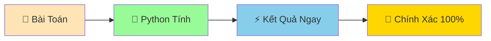

# 🧮 Phép Tính Cơ Bản - Dạy Python Làm Toán

:::tip 🧮 Ví Dụ Dễ Hiểu
Python như một **máy tính siêu thông minh** có thể làm toán nhanh hơn bạn gấp hàng triệu lần! Từ phép cộng đơn giản đến tính toán phức tạp, Python đều làm được!
:::

## 🤔 Tại Sao Python Cần Biết Làm Toán?

Trong cuộc sống, chúng ta làm toán mọi lúc:
- 💰 **Tính tiền mua sắm**: 3 cái bánh × 15.000đ = ?
- 📊 **Tính điểm trung bình**: (8 + 9 + 7) ÷ 3 = ?
- ⏰ **Tính thời gian**: 2 giờ 30 phút = ? phút
- 🏃 **Tính tốc độ**: 100m trong 15 giây = ? m/s

Python giúp chúng ta tính toán **nhanh chóng và chính xác**!



## ➕➖✖️➗ Các Phép Tính Cơ Bản

### ➕ 1. Phép Cộng (+)

```python
# Cộng số
result = 5 + 3
print(result)  # 8

# Cộng với biến
savings = 100000  # tiền tiết kiệm
bonus = 50000     # tiền được tặng
total_money = savings + bonus
print(f"Tổng tiền: {total_money} VNĐ")  # 150000 VNĐ

# Cộng nhiều số
math_score = 8.5    # điểm toán
physics_score = 9.0 # điểm lý
chemistry_score = 7.5 # điểm hóa
total_score = math_score + physics_score + chemistry_score
print(f"Tổng điểm: {total_score}")  # 25.0
```

### ➖ 2. Phép Trừ (-)

```python
# Trừ số
result = 10 - 3
print(result)  # 7

# Tính số tiền còn lại
initial_money = 200000  # tiền ban đầu
book_cost = 75000       # tiền mua sách
remaining_money = initial_money - book_cost
print(f"Tiền còn lại: {remaining_money} VNĐ")  # 125000 VNĐ

# Tính tuổi
current_year = 2024  # năm hiện tại
birth_year = 2010    # năm sinh
age = current_year - birth_year
print(f"Tuổi: {age}")  # 14
```

### ✖️ 3. Phép Nhân (*)

```python
# Nhân số
result = 6 * 4
print(result)  # 24

# Tính tiền mua nhiều món
bread_price = 15000  # giá bánh mì
quantity = 3         # số lượng
total_cost = bread_price * quantity
print(f"Tổng tiền: {total_cost} VNĐ")  # 45000 VNĐ

# Tính diện tích hình chữ nhật
length = 5.5  # chiều dài
width = 3.2   # chiều rộng
area = length * width
print(f"Diện tích: {area} m²")  # 17.6 m²
```

### ➗ 4. Phép Chia (/)

```python
# Chia số (kết quả là số thập phân)
result = 15 / 3
print(result)  # 5.0

# Tính điểm trung bình
total_score = 25.5  # tổng điểm
subject_count = 3   # số môn
average_score = total_score / subject_count
print(f"Điểm trung bình: {average_score:.1f}")  # 8.5

# Chia kẹo cho bạn bè
candy_count = 20     # số kẹo
friend_count = 6     # số bạn bè
candy_per_friend = candy_count / friend_count
print(f"Mỗi bạn được: {candy_per_friend:.1f} cái kẹo")  # 3.3 cái kẹo
```

## 🎯 Các Phép Tính Đặc Biệt

### 🔢 1. Chia Lấy Phần Nguyên (//)

Khi bạn muốn **chia và bỏ phần lẻ**:

```python
# Chia thông thường
print(17 / 5)   # 3.4

# Chia lấy phần nguyên
print(17 // 5)  # 3

# Ví dụ thực tế: Chia kẹo đều cho bạn bè
candy_count = 23      # số kẹo
friend_count = 5      # số bạn bè
candy_per_friend = candy_count // friend_count
print(f"Mỗi bạn được: {candy_per_friend} cái kẹo")  # 4 cái kẹo
print(f"Còn thừa: {candy_count % friend_count} cái")   # 3 cái
```

### 📐 2. Chia Lấy Dư (%)

Tìm **số dư** sau khi chia:

```python
# Tìm số dư
print(17 % 5)   # 2 (vì 17 = 5×3 + 2)

# Kiểm tra số chẵn/lẻ
number = 15  # số
if number % 2 == 0:
    print(f"{number} là số chẵn")
else:
    print(f"{number} là số lẻ")  # 15 là số lẻ

# Tìm ngày trong tuần
day_number = 25 % 7  # ngày thứ - Nếu ngày 1 là Chủ nhật
print(f"Ngày 25 là thứ {day_number + 1}")
```

### 🚀 3. Lũy Thừa (**)

Tính **số mũ**:

```python
# Lũy thừa
print(2 ** 3)   # 8 (2³)
print(5 ** 2)   # 25 (5²)

# Tính diện tích hình vuông
side = 4  # cạnh
area = side ** 2
print(f"Diện tích hình vuông: {area} cm²")  # 16 cm²

# Tính thể tích hình lập phương
cube_side = 3  # cạnh lập phương
volume = cube_side ** 3
print(f"Thể tích: {volume} cm³")  # 27 cm³
```

## 📊 Thứ Tự Ưu Tiên Phép Tính

Python tính toán theo **thứ tự ưu tiên** giống như toán học:

```python
# 1. Ngoặc đơn () - ưu tiên cao nhất
result_1 = (2 + 3) * 4      # 5 * 4 = 20
result_2 = 2 + 3 * 4        # 2 + 12 = 14

print(f"Có ngoặc: {result_1}")    # 20
print(f"Không ngoặc: {result_2}") # 14

# 2. Lũy thừa ** 
print(2 + 3 ** 2)    # 2 + 9 = 11 (không phải 5²)

# 3. Nhân *, Chia /, Chia lấy nguyên //, Chia lấy dư %
print(10 + 6 * 2)    # 10 + 12 = 22

# 4. Cộng +, Trừ - (ưu tiên thấp nhất)
print(5 - 2 + 3)     # 3 + 3 = 6 (từ trái sang phải)
```

:::tip 💡 Mẹo Nhớ Thứ Tự
**PEMDAS** - **P**arentheses (Ngoặc), **E**xponents (Lũy thừa), **M**ultiplication/**D**ivision (Nhân/Chia), **A**ddition/**S**ubtraction (Cộng/Trừ)
:::

## 🎪 Ví Dụ Thực Tế: Máy Tính Mua Sắm

```python
# 🛒 Thông tin sản phẩm
shirt_price = 250000   # giá áo - 250,000 VNĐ
pants_price = 180000   # giá quần - 180,000 VNĐ  
shoes_price = 320000   # giá giày - 320,000 VNĐ

# 📊 Số lượng mua
shirt_qty = 2    # số áo
pants_qty = 1    # số quần
shoes_qty = 1    # số giày

# 💰 Tính tiền từng loại
shirt_total = shirt_price * shirt_qty  # tiền áo
pants_total = pants_price * pants_qty  # tiền quần
shoes_total = shoes_price * shoes_qty  # tiền giày

# 🧮 Tính tổng
subtotal = shirt_total + pants_total + shoes_total  # tổng tiền

# 🎁 Giảm giá 10%
discount_rate = 10  # tỉ lệ giảm giá - 10%
discount_amount = subtotal * discount_rate / 100  # số tiền giảm
final_total = subtotal - discount_amount           # tiền phải trả

# 📋 In hóa đơn
print("=== HÓA ĐƠN MUA SẮM ===")
print(f"Áo: {shirt_qty} × {shirt_price:,} = {shirt_total:,} VNĐ")
print(f"Quần: {pants_qty} × {pants_price:,} = {pants_total:,} VNĐ")
print(f"Giày: {shoes_qty} × {shoes_price:,} = {shoes_total:,} VNĐ")
print("-" * 30)
print(f"Tạm tính: {subtotal:,} VNĐ")
print(f"Giảm giá ({discount_rate}%): -{discount_amount:,} VNĐ")
print(f"TỔNG CỘNG: {final_total:,} VNĐ")
```

## 🔄 Phép Tính Với Biến

```python
# Cập nhật giá trị biến bằng phép tính
exam_score = 8.0  # điểm thi
print(f"Điểm ban đầu: {exam_score}")

# Cộng thêm điểm thưởng
exam_score = exam_score + 0.5  # Hoặc viết ngắn: exam_score += 0.5
print(f"Sau khi cộng thưởng: {exam_score}")

# Các phép viết tắt hữu ích
money = 100000   # tiền
money += 50000   # money = money + 50000
money -= 20000   # money = money - 20000  
money *= 2       # money = money * 2
money /= 4       # money = money / 4

print(f"Tiền cuối cùng: {money}")
```

## 🎯 Bài Tập Thực Hành

### 🥇 Bài Tập 1: Máy Tính Cá Nhân
Tạo một máy tính cho việc học tập:

```python
# Thông tin học tập
periods_per_day = 8      # số tiết học/ngày
minutes_per_period = 45  # số phút/tiết
school_days_per_week = 5 # số ngày học/tuần

# TODO: Tính toán
total_minutes_per_day = periods_per_day * minutes_per_period  # tổng phút/ngày
total_hours_per_day = total_minutes_per_day / 60             # tổng giờ/ngày
total_hours_per_week = total_hours_per_day * school_days_per_week # tổng giờ/tuần

print(f"Học mỗi ngày: {total_hours_per_day} giờ")
print(f"Học mỗi tuần: {total_hours_per_week} giờ")
```

### 🥈 Bài Tập 2: Tính BMI
Tạo máy tính chỉ số BMI:

```python
# Thông tin cá nhân
weight = 50.5  # cân nặng - kg
height = 1.65  # chiều cao - mét

# TODO: Tính BMI
# Công thức: BMI = cân nặng / (chiều cao × chiều cao)
bmi = weight / (height ** 2)

print(f"Cân nặng: {weight} kg")
print(f"Chiều cao: {height} m")
print(f"BMI: {bmi:.1f}")

# Đánh giá BMI
if bmi < 18.5:
    assessment = "Thiếu cân"  # đánh giá
elif bmi < 25:
    assessment = "Bình thường"
else:
    assessment = "Thừa cân"
    
print(f"Đánh giá: {assessment}")
```

### 🥉 Bài Tập 3: Chia Đều Kẹo
Giải quyết bài toán chia kẹo:

```python
# Thông tin
total_candies = 47   # số kẹo
friend_count = 8     # số bạn bè

# TODO: Tính toán
candies_per_friend = total_candies // friend_count  # kẹo mỗi bạn - Chia đều
remaining_candies = total_candies % friend_count    # kẹo thừa - Số kẹo thừa

print(f"Có {total_candies} cái kẹo, chia cho {friend_count} bạn:")
print(f"Mỗi bạn được: {candies_per_friend} cái")
print(f"Còn thừa: {remaining_candies} cái")
```

## 🎊 Tóm Tắt

Trong bài này, bạn đã học được:

✅ **Phép tính cơ bản**: +, -, *, /  
✅ **Phép tính đặc biệt**: //, %, **  
✅ **Thứ tự ưu tiên**: Ngoặc → Lũy thừa → Nhân/Chia → Cộng/Trừ  
✅ **Phép viết tắt**: +=, -=, *=, /=  
✅ **Ứng dụng thực tế**: Tính tiền, BMI, chia đều...  

## 🚀 Bước Tiếp Theo

Bây giờ Python đã biết làm toán rồi! Tiếp theo, chúng ta sẽ học cách làm việc với **chữ và câu** trong bài [Làm Việc Với Chuỗi Cơ Bản](/python/basics/strings-basics).

:::tip 🎯 Thử Thách Nhỏ
Hãy thử tạo một "máy tính lãi suất" đơn giản: Nếu bạn gửi tiết kiệm 1 triệu VNĐ với lãi suất 5%/năm, sau 3 năm bạn sẽ có bao nhiêu tiền? (Công thức: Tiền cuối = Tiền gốc × (1 + lãi suất)^số năm)
:::

---

*🔗 **Bài tiếp theo**: [Làm Việc Với Chuỗi Cơ Bản - Chơi Với Chữ Và Câu](/python/basics/strings-basics)*
