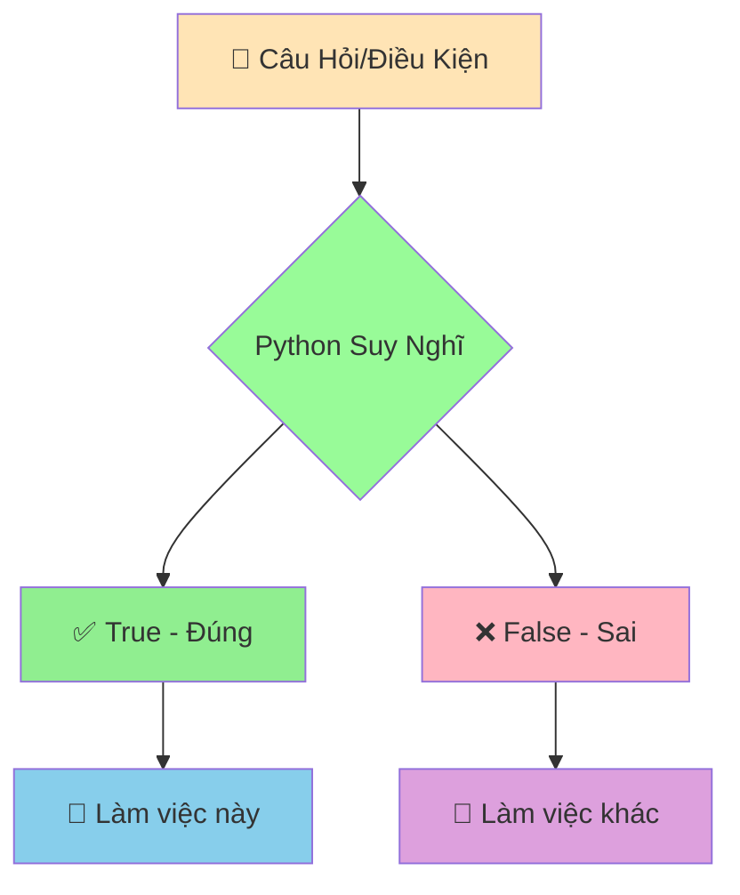

# ✅❌ Boolean và Logic Cơ Bản - Dạy Python Phân Biệt Đúng Sai

:::tip ⚖️ Ví Dụ Dễ Hiểu
Hãy tưởng tượng Python như một **thẩm phán siêu thông minh** có thể đưa ra quyết định dựa trên sự thật! Mọi câu hỏi đều chỉ có 2 đáp án: **Đúng (True)** hoặc **Sai (False)**.
:::

## 🤔 Boolean Là Gì?

**Boolean** là kiểu dữ liệu đặc biệt chỉ có **2 giá trị**:
- ✅ **True** (Đúng)
- ❌ **False** (Sai)

Giống như việc trả lời câu hỏi có/không, đúng/sai, được/không được!



## 🎯 Tạo Giá Trị Boolean

```python
# Tạo trực tiếp
homework_done = True
is_raining = False
likes_python = True

print(homework_done)  # True
print(is_raining)          # False
print(type(likes_python))  # <class 'bool'>
```

:::warning ⚠️ Lưu Ý Quan Trọng
- `True` và `False` phải viết **hoa chữ cái đầu**
- `true` hoặc `TRUE` sẽ bị lỗi!
:::

## 🔍 Phép So Sánh - Tạo Boolean

### 📊 1. So Sánh Số

```python
my_age = 15
friend_age = 16

# So sánh bằng
print(my_age == friend_age)    # False (15 không bằng 16)
print(my_age == 15)          # True (15 bằng 15)

# So sánh lớn hơn, nhỏ hơn
print(my_age > friend_age)     # False (15 không lớn hơn 16)
print(my_age < friend_age)     # True (15 nhỏ hơn 16)
print(my_age >= 15)          # True (15 lớn hơn hoặc bằng 15)
print(my_age <= 14)          # False (15 không nhỏ hơn hoặc bằng 14)

# So sánh khác
print(my_age != friend_age)    # True (15 khác 16)
```

### 📝 2. So Sánh Chuỗi

```python
my_name = "An"
friend_name = "Bình"

# So sánh bằng
print(my_name == "An")         # True
print(my_name == "an")         # False (phân biệt hoa thường!)

# So sánh khác
print(my_name != friend_name)      # True ("An" khác "Bình")

# So sánh thứ tự alphabet
print("An" < "Bình")           # True (A đứng trước B)
print("Python" > "Java")       # True (P đứng sau J)
```

## 🧠 Phép Logic - Kết Hợp Điều Kiện

### 🔗 1. AND - Phải CẢ HAI đều đúng

```python
age = 16
has_sport_shoes = True

# Cả hai điều kiện phải đúng
can_play_football = age >= 15 and has_sport_shoes
print(f"Có thể chơi bóng: {can_play_football}")  # True

# Ví dụ thực tế: Điều kiện thi đại học
math_score = 8.5
physics_score = 7.0
chemistry_score = 8.0

# Phải có điểm trung bình >= 7.5 VÀ không có môn nào dưới 6
average_score = (math_score + physics_score + chemistry_score) / 3
meets_requirement = average_score >= 7.5 and math_score >= 6 and physics_score >= 6 and chemistry_score >= 6

print(f"Đạt điều kiện thi đại học: {meets_requirement}")  # True
```

### 🌟 2. OR - CHỈ CẦN MỘT điều đúng

```python
has_bicycle = False
has_motorcycle = True

# Chỉ cần một trong hai
can_go_to_school = has_bicycle or has_motorcycle
print(f"Có thể đi học: {can_go_to_school}")  # True

# Ví dụ: Được miễn học phí
is_excellent_student = True
is_poor_family = False
is_martyr_child = False

# Chỉ cần một điều kiện đúng là được miễn
gets_tuition_waiver = is_excellent_student or is_poor_family or is_martyr_child
print(f"Được miễn học phí: {gets_tuition_waiver}")  # True
```

### ❗ 3. NOT - Đảo ngược kết quả

```python
is_raining = True
has_raincoat = False

# Đảo ngược
is_sunny = not is_raining
print(f"Trời nắng: {is_sunny}")  # False

# Ví dụ thực tế
need_raincoat = is_raining and not has_raincoat
print(f"Cần mang áo mưa: {need_raincoat}")  # True
```

## 📋 Bảng Chân Lý - Tham Khảo Nhanh

```python
# AND - Cả hai phải đúng
print(True and True)    # True
print(True and False)   # False
print(False and True)   # False  
print(False and False)  # False

# OR - Chỉ cần một đúng
print(True or True)     # True
print(True or False)    # True
print(False or True)    # True
print(False or False)   # False

# NOT - Đảo ngược
print(not True)         # False
print(not False)        # True
```

## 🎪 Ví Dụ Thực Tế: Hệ Thống Chấm Điểm

```python
# 📊 Thông tin học sinh
full_name = "Nguyễn Minh An"
math_score = 8.5
literature_score = 7.5
english_score = 9.0
absent_days = 3
has_discipline_violation = False

# 🧮 Tính toán
average_score = (math_score + literature_score + english_score) / 3
print(f"Điểm trung bình: {average_score:.1f}")

# ✅ Các điều kiện đánh giá
grade_passed = average_score >= 8.0
good_attendance = absent_days <= 5
good_conduct = not has_discipline_violation

print(f"Điểm đạt yêu cầu: {grade_passed}")
print(f"Chuyên cần tốt: {good_attendance}")
print(f"Hạnh kiểm tốt: {good_conduct}")

# 🏆 Xếp loại học sinh
excellent_student = grade_passed and good_attendance and good_conduct
good_student = average_score >= 6.5 and good_attendance and good_conduct
average_student = average_score >= 5.0 and good_conduct

print("\n=== KẾT QUẢ XẾP LOẠI ===")
if excellent_student:
    classification = "GIỎI"
elif good_student:
    classification = "KHÁ"
elif average_student:
    classification = "TRUNG BÌNH"
else:
    classification = "YẾU"

print(f"Học sinh {full_name}: {classification}")
```

## 🔄 Chuyển Đổi Sang Boolean

Python có thể chuyển đổi nhiều thứ thành Boolean:

```python
# Số 0 = False, số khác 0 = True
print(bool(0))      # False
print(bool(1))      # True
print(bool(-5))     # True
print(bool(3.14))   # True

# Chuỗi rỗng = False, có nội dung = True
print(bool(""))     # False
print(bool("Xin chào"))  # True
print(bool(" "))    # True (có khoảng trắng)

# None = False
print(bool(None))   # False

# Danh sách rỗng = False, có phần tử = True
print(bool([]))     # False
print(bool([1, 2])) # True
```

## 🎯 Bài Tập Thực Hành

### 🥇 Bài Tập 1: Kiểm Tra Điều Kiện Thi

```python
# Thông tin thí sinh
candidate_name = "Trần Thị Lan"
age = 18
graduated_high_school = True
has_birth_certificate = True
submitted_documents = True

# TODO: Kiểm tra điều kiện dự thi đại học
# Điều kiện: Tuổi >= 18 VÀ đã tốt nghiệp THPT VÀ có đầy đủ giấy tờ
eligible_for_exam = (age >= 18) and graduated_high_school and has_birth_certificate and submitted_documents

print(f"Thí sinh {candidate_name}:")
print(f"Đủ điều kiện dự thi: {eligible_for_exam}")

# Phân tích từng điều kiện
print(f"Đủ tuổi (>= 18): {age >= 18}")
print(f"Đã tốt nghiệp THPT: {graduated_high_school}")
print(f"Có đầy đủ giấy tờ: {has_birth_certificate and submitted_documents}")
```

### 🥈 Bài Tập 2: Hệ Thống Báo Động Thời Tiết

```python
# Thông tin thời tiết
temperature = 35      # Độ C
humidity = 80         # %
wind_speed = 25    # km/h
is_raining = True

# TODO: Tạo các cảnh báo
heat_warning = temperature > 32
humidity_warning = humidity > 70
strong_wind_warning = wind_speed > 20
storm_warning = is_raining and strong_wind_warning

print("=== BẢN TIN THỜI TIẾT ===")
print(f"Nhiệt độ: {temperature}°C")
print(f"Độ ẩm: {humidity}%")
print(f"Tốc độ gió: {wind_speed} km/h")
print(f"Có mưa: {is_raining}")

print("\n=== CẢNH BÁO ===")
if heat_warning:
    print("⚠️ CẢNH BÁO: Thời tiết nóng, hạn chế ra ngoài!")
if humidity_warning:
    print("💧 LƯU Ý: Độ ẩm cao, dễ cảm thấy ngột ngạt!")
if strong_wind_warning:
    print("💨 CẢNH BÁO: Gió mạnh, chú ý khi di chuyển!")
```

### 🥉 Bài Tập 3: Máy Tính Logic

```python
# Tạo máy tính logic đơn giản
print("=== MÁY TÍNH LOGIC ===")

# TODO: Nhập 2 giá trị boolean từ người dùng
print("Nhập giá trị đầu tiên (True/False):")
# value_1 = input().strip() == "True"

print("Nhập giá trị thứ hai (True/False):")
# value_2 = input().strip() == "True"

# Tạm thời dùng giá trị cố định để test
value_1 = True
value_2 = False

print(f"\nGiá trị 1: {value_1}")
print(f"Giá trị 2: {value_2}")

# Tính toán các phép logic
result_and = value_1 and value_2
result_or = value_1 or value_2
result_not_1 = not value_1
result_not_2 = not value_2

print(f"\n=== KẾT QUẢ ===")
print(f"{value_1} AND {value_2} = {result_and}")
print(f"{value_1} OR {value_2} = {result_or}")
print(f"NOT {value_1} = {result_not_1}")
print(f"NOT {value_2} = {result_not_2}")
```

## 🎊 Tóm Tắt

Trong bài này, bạn đã học được:

✅ **Boolean**: Chỉ có 2 giá trị `True` và `False`  
✅ **Phép so sánh**: `==`, `!=`, `>`, `<`, `>=`, `<=`  
✅ **Phép logic**: `and` (và), `or` (hoặc), `not` (không)  
✅ **Chuyển đổi**: Các giá trị khác có thể chuyển thành Boolean  
✅ **Ứng dụng**: Đánh giá điều kiện, ra quyết định  

## 🚀 Bước Tiếp Theo

Bây giờ Python đã biết phân biệt đúng/sai rồi! Tiếp theo, chúng ta sẽ học cách **tìm và sửa lỗi** khi viết code trong bài [Hiểu và Sửa Lỗi Cơ Bản](/python/basics/errors-and-debugging).

:::tip 🎯 Thử Thách Nhỏ
Hãy thử tạo một "hệ thống kiểm tra mật khẩu mạnh"! Mật khẩu mạnh phải: có ít nhất 8 ký tự VÀ có chữ hoa VÀ có chữ số VÀ không chứa tên người dùng. Sử dụng Boolean để kiểm tra!
:::

---

*🔗 **Bài tiếp theo**: [Hiểu và Sửa Lỗi Cơ Bản - Khi Python "Không Hiểu" Bạn Nói Gì](/python/basics/errors-and-debugging)*
