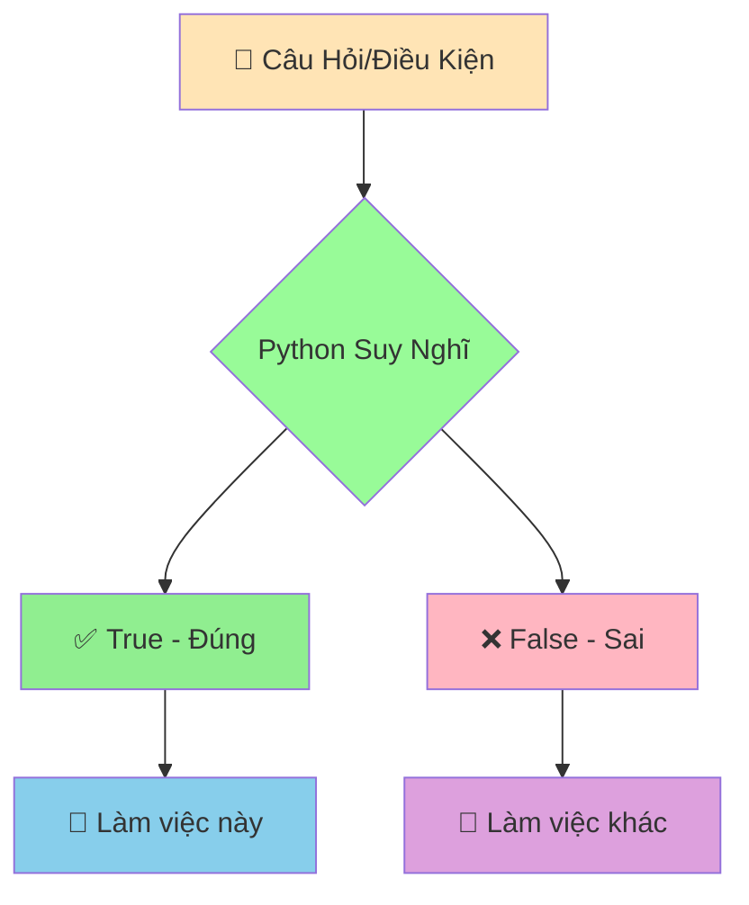

# ✅❌ Boolean và Logic Cơ Bản - Dạy Python Phân Biệt Đúng Sai

:::tip ⚖️ Ví Dụ Dễ Hiểu
Hãy tưởng tượng Python như một **thẩm phán siêu thông minh** có thể đưa ra quyết định dựa trên sự thật! Mọi câu hỏi đều chỉ có 2 đáp án: **Đúng (True)** hoặc **Sai (False)**.
:::

## 🤔 Boolean Là Gì?

**Boolean** là kiểu dữ liệu đặc biệt chỉ có **2 giá trị**:
- ✅ **True** (Đúng)
- ❌ **False** (Sai)

Giống như việc trả lời câu hỏi có/không, đúng/sai, được/không được!



## 🎯 Tạo Giá Trị Boolean

```python
# Tạo trực tiếp
da_lam_bai_tap = True
co_mua = False
thich_python = True

print(da_lam_bai_tap)  # True
print(co_mua)          # False
print(type(thich_python))  # <class 'bool'>
```

:::warning ⚠️ Lưu Ý Quan Trọng
- `True` và `False` phải viết **hoa chữ cái đầu**
- `true` hoặc `TRUE` sẽ bị lỗi!
:::

## 🔍 Phép So Sánh - Tạo Boolean

### 📊 1. So Sánh Số

```python
tuoi_toi = 15
tuoi_ban = 16

# So sánh bằng
print(tuoi_toi == tuoi_ban)    # False (15 không bằng 16)
print(tuoi_toi == 15)          # True (15 bằng 15)

# So sánh lớn hơn, nhỏ hơn
print(tuoi_toi > tuoi_ban)     # False (15 không lớn hơn 16)
print(tuoi_toi < tuoi_ban)     # True (15 nhỏ hơn 16)
print(tuoi_toi >= 15)          # True (15 lớn hơn hoặc bằng 15)
print(tuoi_toi <= 14)          # False (15 không nhỏ hơn hoặc bằng 14)

# So sánh khác
print(tuoi_toi != tuoi_ban)    # True (15 khác 16)
```

### 📝 2. So Sánh Chuỗi

```python
ten_toi = "An"
ten_ban = "Bình"

# So sánh bằng
print(ten_toi == "An")         # True
print(ten_toi == "an")         # False (phân biệt hoa thường!)

# So sánh khác
print(ten_toi != ten_ban)      # True ("An" khác "Bình")

# So sánh thứ tự alphabet
print("An" < "Bình")           # True (A đứng trước B)
print("Python" > "Java")       # True (P đứng sau J)
```

## 🧠 Phép Logic - Kết Hợp Điều Kiện

### 🔗 1. AND - Phải CẢ HAI đều đúng

```python
tuoi = 16
co_giay_the_thao = True

# Cả hai điều kiện phải đúng
co_the_choi_bong = tuoi >= 15 and co_giay_the_thao
print(f"Có thể chơi bóng: {co_the_choi_bong}")  # True

# Ví dụ thực tế: Điều kiện thi đại học
diem_toan = 8.5
diem_ly = 7.0
diem_hoa = 8.0

# Phải có điểm trung bình >= 7.5 VÀ không có môn nào dưới 6
diem_tb = (diem_toan + diem_ly + diem_hoa) / 3
dat_dieu_kien = diem_tb >= 7.5 and diem_toan >= 6 and diem_ly >= 6 and diem_hoa >= 6

print(f"Đạt điều kiện thi đại học: {dat_dieu_kien}")  # True
```

### 🌟 2. OR - CHỈ CẦN MỘT điều đúng

```python
co_xe_dap = False
co_xe_may = True

# Chỉ cần một trong hai
co_the_di_hoc = co_xe_dap or co_xe_may
print(f"Có thể đi học: {co_the_di_hoc}")  # True

# Ví dụ: Được miễn học phí
hoc_sinh_gioi = True
gia_dinh_kho_khan = False
con_liet_si = False

# Chỉ cần một điều kiện đúng là được miễn
duoc_mien_hoc_phi = hoc_sinh_gioi or gia_dinh_kho_khan or con_liet_si
print(f"Được miễn học phí: {duoc_mien_hoc_phi}")  # True
```

### ❗ 3. NOT - Đảo ngược kết quả

```python
troi_mua = True
co_ao_mua = False

# Đảo ngược
troi_nang = not troi_mua
print(f"Trời nắng: {troi_nang}")  # False

# Ví dụ thực tế
can_mang_ao_mua = troi_mua and not co_ao_mua
print(f"Cần mang áo mưa: {can_mang_ao_mua}")  # True
```

## 📋 Bảng Chân Lý - Tham Khảo Nhanh

```python
# AND - Cả hai phải đúng
print(True and True)    # True
print(True and False)   # False
print(False and True)   # False  
print(False and False)  # False

# OR - Chỉ cần một đúng
print(True or True)     # True
print(True or False)    # True
print(False or True)    # True
print(False or False)   # False

# NOT - Đảo ngược
print(not True)         # False
print(not False)        # True
```

## 🎪 Ví Dụ Thực Tế: Hệ Thống Chấm Điểm

```python
# 📊 Thông tin học sinh
ho_ten = "Nguyễn Minh An"
diem_toan = 8.5
diem_van = 7.5
diem_anh = 9.0
so_ngay_nghi = 3
co_vi_pham_ky_luat = False

# 🧮 Tính toán
diem_trung_binh = (diem_toan + diem_van + diem_anh) / 3
print(f"Điểm trung bình: {diem_trung_binh:.1f}")

# ✅ Các điều kiện đánh giá
diem_dat = diem_trung_binh >= 8.0
chuyen_can_tot = so_ngay_nghi <= 5
hanh_kiem_tot = not co_vi_pham_ky_luat

print(f"Điểm đạt yêu cầu: {diem_dat}")
print(f"Chuyên cần tốt: {chuyen_can_tot}")
print(f"Hạnh kiểm tốt: {hanh_kiem_tot}")

# 🏆 Xếp loại học sinh
hoc_sinh_gioi = diem_dat and chuyen_can_tot and hanh_kiem_tot
hoc_sinh_kha = diem_trung_binh >= 6.5 and chuyen_can_tot and hanh_kiem_tot
hoc_sinh_trung_binh = diem_trung_binh >= 5.0 and hanh_kiem_tot

print("\n=== KẾT QUẢ XẾP LOẠI ===")
if hoc_sinh_gioi:
    xep_loai = "GIỎI"
elif hoc_sinh_kha:
    xep_loai = "KHÁ"
elif hoc_sinh_trung_binh:
    xep_loai = "TRUNG BÌNH"
else:
    xep_loai = "YẾU"

print(f"Học sinh {ho_ten}: {xep_loai}")
```

## 🔄 Chuyển Đổi Sang Boolean

Python có thể chuyển đổi nhiều thứ thành Boolean:

```python
# Số 0 = False, số khác 0 = True
print(bool(0))      # False
print(bool(1))      # True
print(bool(-5))     # True
print(bool(3.14))   # True

# Chuỗi rỗng = False, có nội dung = True
print(bool(""))     # False
print(bool("Xin chào"))  # True
print(bool(" "))    # True (có khoảng trắng)

# None = False
print(bool(None))   # False

# Danh sách rỗng = False, có phần tử = True
print(bool([]))     # False
print(bool([1, 2])) # True
```

## 🎯 Bài Tập Thực Hành

### 🥇 Bài Tập 1: Kiểm Tra Điều Kiện Thi

```python
# Thông tin thí sinh
ho_ten = "Trần Thị Lan"
tuoi = 18
da_tot_nghiep_thpt = True
co_ban_khai_sinh = True
nop_du_ho_so = True

# TODO: Kiểm tra điều kiện dự thi đại học
# Điều kiện: Tuổi >= 18 VÀ đã tốt nghiệp THPT VÀ có đầy đủ giấy tờ
du_dieu_kien_thi = (tuoi >= 18) and da_tot_nghiep_thpt and co_ban_khai_sinh and nop_du_ho_so

print(f"Thí sinh {ho_ten}:")
print(f"Đủ điều kiện dự thi: {du_dieu_kien_thi}")

# Phân tích từng điều kiện
print(f"Đủ tuổi (>= 18): {tuoi >= 18}")
print(f"Đã tốt nghiệp THPT: {da_tot_nghiep_thpt}")
print(f"Có đầy đủ giấy tờ: {co_ban_khai_sinh and nop_du_ho_so}")
```

### 🥈 Bài Tập 2: Hệ Thống Báo Động Thời Tiết

```python
# Thông tin thời tiết
nhiet_do = 35      # Độ C
do_am = 80         # %
toc_do_gio = 25    # km/h
co_mua = True

# TODO: Tạo các cảnh báo
canh_bao_nong = nhiet_do > 32
canh_bao_am_uot = do_am > 70
canh_bao_gio_manh = toc_do_gio > 20
canh_bao_bao = co_mua and gio_manh

print("=== BẢN TIN THỜI TIẾT ===")
print(f"Nhiệt độ: {nhiet_do}°C")
print(f"Độ ẩm: {do_am}%")
print(f"Tốc độ gió: {toc_do_gio} km/h")
print(f"Có mưa: {co_mua}")

print("\n=== CẢNH BÁO ===")
if canh_bao_nong:
    print("⚠️ CẢNH BÁO: Thời tiết nóng, hạn chế ra ngoài!")
if canh_bao_am_uot:
    print("💧 LƯU Ý: Độ ẩm cao, dễ cảm thấy ngột ngạt!")
if canh_bao_gio_manh:
    print("💨 CẢNH BÁO: Gió mạnh, chú ý khi di chuyển!")
```

### 🥉 Bài Tập 3: Máy Tính Logic

```python
# Tạo máy tính logic đơn giản
print("=== MÁY TÍNH LOGIC ===")

# TODO: Nhập 2 giá trị boolean từ người dùng
print("Nhập giá trị đầu tiên (True/False):")
# gia_tri_1 = input().strip() == "True"

print("Nhập giá trị thứ hai (True/False):")
# gia_tri_2 = input().strip() == "True"

# Tạm thời dùng giá trị cố định để test
gia_tri_1 = True
gia_tri_2 = False

print(f"\nGiá trị 1: {gia_tri_1}")
print(f"Giá trị 2: {gia_tri_2}")

# Tính toán các phép logic
ket_qua_and = gia_tri_1 and gia_tri_2
ket_qua_or = gia_tri_1 or gia_tri_2
ket_qua_not_1 = not gia_tri_1
ket_qua_not_2 = not gia_tri_2

print(f"\n=== KẾT QUẢ ===")
print(f"{gia_tri_1} AND {gia_tri_2} = {ket_qua_and}")
print(f"{gia_tri_1} OR {gia_tri_2} = {ket_qua_or}")
print(f"NOT {gia_tri_1} = {ket_qua_not_1}")
print(f"NOT {gia_tri_2} = {ket_qua_not_2}")
```

## 🎊 Tóm Tắt

Trong bài này, bạn đã học được:

✅ **Boolean**: Chỉ có 2 giá trị `True` và `False`  
✅ **Phép so sánh**: `==`, `!=`, `>`, `<`, `>=`, `<=`  
✅ **Phép logic**: `and` (và), `or` (hoặc), `not` (không)  
✅ **Chuyển đổi**: Các giá trị khác có thể chuyển thành Boolean  
✅ **Ứng dụng**: Đánh giá điều kiện, ra quyết định  

## 🚀 Bước Tiếp Theo

Bây giờ Python đã biết phân biệt đúng/sai rồi! Tiếp theo, chúng ta sẽ học cách **tìm và sửa lỗi** khi viết code trong bài [Hiểu và Sửa Lỗi Cơ Bản](/python/basics/errors-and-debugging).

:::tip 🎯 Thử Thách Nhỏ
Hãy thử tạo một "hệ thống kiểm tra mật khẩu mạnh"! Mật khẩu mạnh phải: có ít nhất 8 ký tự VÀ có chữ hoa VÀ có chữ số VÀ không chứa tên người dùng. Sử dụng Boolean để kiểm tra!
:::

---

*🔗 **Bài tiếp theo**: [Hiểu và Sửa Lỗi Cơ Bản - Khi Python "Không Hiểu" Bạn Nói Gì](/python/basics/errors-and-debugging)*
