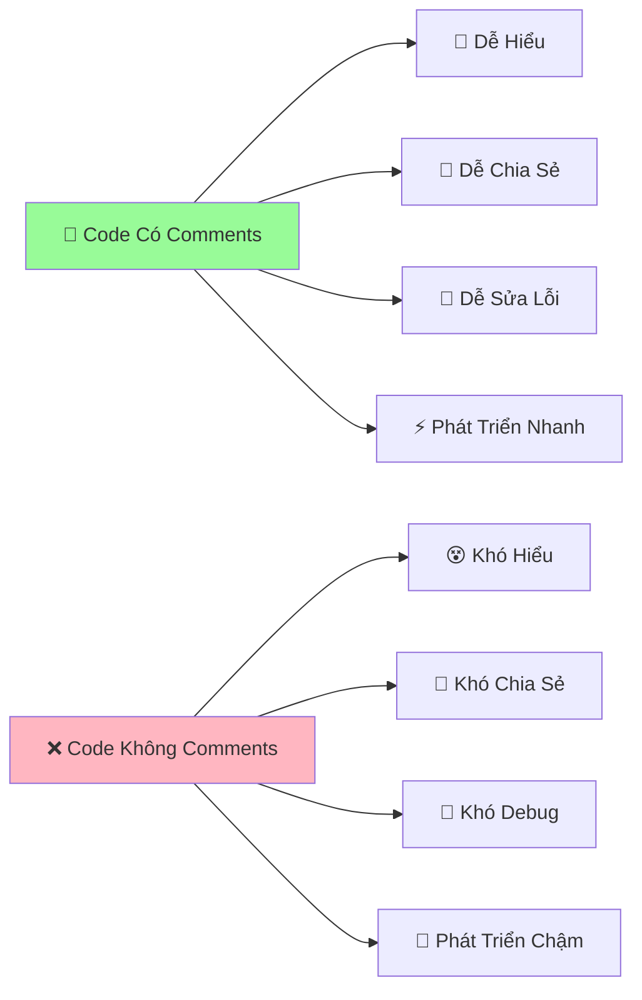

# 💭 Ghi Chú Trong Code - Ghi Nhớ Cho Python

:::tip 📝 Ví Dụ Dễ Hiểu
Giống như bạn viết nhật ký để nhớ những gì đã làm, Python cũng cần "ghi chú" để nhớ mục đích của từng đoạn code. Điều này giúp bạn và người khác hiểu code dễ dàng hơn sau này!
:::

## 🤔 Tại Sao Cần Ghi Chú?

Hãy tưởng tượng bạn viết một đoạn code phức tạp hôm nay, và 6 tháng sau quay lại đọc:

```python
# ❌ Code không có ghi chú - khó hiểu
x = int(input())
if x % 4 == 0 and (x % 100 != 0 or x % 400 == 0):
    print("Yes")
else:
    print("No")
```

**VS**

```python
# ✅ Code có ghi chú - dễ hiểu
# Chương trình kiểm tra năm nhuận
nam = int(input("Nhập năm cần kiểm tra: "))

# Quy tắc năm nhuận:
# - Chia hết cho 4 VÀ
# - (Không chia hết cho 100 HOẶC chia hết cho 400)
if nam % 4 == 0 and (nam % 100 != 0 or nam % 400 == 0):
    print("Năm nhuận")
else:
    print("Không phải năm nhuận")
```



## 📝 Các Loại Comments Trong Python

### 1. **Single Line Comments** - Ghi Chú Một Dòng

```python
# Đây là comment một dòng
print("Hello World!")  # Comment ở cuối dòng

# Sử dụng để:
# - Giải thích dòng code phía dưới
# - Tạm thời "tắt" một dòng code
# - Ghi chú ngắn gọn
```

### 2. **Multi-line Comments** - Ghi Chú Nhiều Dòng

```python
"""
Đây là comment nhiều dòng (docstring)
Có thể viết nhiều dòng
Thường dùng để mô tả function, class hoặc module
"""

# Hoặc dùng nhiều dấu #
# Đây là cách khác để viết
# comment nhiều dòng
# bằng cách dùng # ở đầu mỗi dòng
```

### 3. **Inline Comments** - Ghi Chú Cùng Dòng

```python
age = 18  # Tuổi của người dùng
grade = 8.5  # Điểm trung bình môn Toán
has_girlfriend = False  # Trạng thái độc thân 😄
```

## 🎯 Khi Nào Nên Viết Comments?

### ✅ **Nên Viết Comments Khi:**

```python
# 1. Giải thích LOGIC phức tạp
def check_prime_number(n):
    """Kiểm tra số nguyên tố bằng thuật toán tối ưu"""
    if n < 2:
        return False
    
    # Chỉ cần kiểm tra đến căn bậc 2 của n
    # Vì nếu n có ước số > sqrt(n) thì phải có ước số < sqrt(n)
    for i in range(2, int(n**0.5) + 1):
        if n % i == 0:
            return False
    return True

# 2. Giải thích CÔNG THỨC toán học
def calculate_bmi(weight, height):
    """Tính chỉ số BMI"""
    # BMI = cân nặng (kg) / (chiều cao (m))^2
    bmi = weight / (height ** 2)
    return bmi

# 3. Giải thích TẠI SAO làm như vậy
def format_phone_number(phone):
    """Format số điện thoại Việt Nam"""
    # Loại bỏ khoảng trắng và dấu gạch ngang
    phone = phone.replace(" ", "").replace("-", "")
    
    # Chuyển 84 thành 0 cho số VN (84 là mã quốc gia)
    if phone.startswith("84"):
        phone = "0" + phone[2:]
    
    return phone

# 4. Cảnh báo về ĐIỀU KIỆN đặc biệt
def chia_an_toan(a, b):
    """Thực hiện phép chia an toàn"""
    if b == 0:
        # QUAN TRỌNG: Không được chia cho 0!
        return None
    return a / b
```

### ❌ **Không Nên Viết Comments Khi:**

```python
# ❌ Comment rõ ràng không cần thiết
age = 18  # Gán 18 cho biến age
print("Hello")  # In ra Hello

# ❌ Comment lặp lại code
# In ra "Xin chào"
print("Xin chào")

# ❌ Comment sai hoặc lỗi thời
age = 20  # Tuổi là 18 (SAI!)

# ✅ Thay vào đó, viết code rõ ràng
current_age = 18
print_greeting()
```

## 📚 Docstrings - Tài Liệu Chuyên Nghiệp

**Docstring** là loại comment đặc biệt dùng để mô tả functions, classes, và modules. Chúng tuân theo chuẩn **PEP 257** và có thể được truy cập bằng `help()`.

### 🎯 **Cú Pháp Cơ Bản**

```python
def ten_function(tham_so):
    """
    Mô tả ngắn gọn về function.
    
    Mô tả chi tiết hơn nếu cần.
    
    Args:
        tham_so (type): Mô tả tham số
        
    Returns:
        type: Mô tả giá trị trả về
        
    Raises:
        Exception: Khi nào sẽ có lỗi
    """
    # Code của function
    pass
```

### 📖 **Ví Dụ Thực Tế**

```python
def calculate_average_score(score_list):
    """
    Tính điểm trung bình từ danh sách điểm số.
    
    Function này nhận vào một danh sách các điểm số và trả về
    điểm trung bình. Nếu danh sách rỗng, trả về 0.
    
    Args:
        score_list (list): Danh sách các điểm số (float hoặc int)
        
    Returns:
        float: Điểm trung bình, làm tròn 2 chữ số thập phân
        
    Raises:
        TypeError: Nếu input không phải là list
        ValueError: Nếu có điểm số không hợp lệ (âm hoặc > 10)
        
    Examples:
        >>> calculate_average_score([8, 9, 7, 10])
        8.5
        >>> calculate_average_score([])
        0.0
    """
    if not isinstance(score_list, list):
        raise TypeError("Danh sách điểm phải là list")
    
    if not score_list:
        return 0.0
    
    # Kiểm tra điểm hợp lệ
    for score in score_list:
        if not isinstance(score, (int, float)) or score < 0 or score > 10:
            raise ValueError(f"Điểm không hợp lệ: {score}")
    
    return round(sum(score_list) / len(score_list), 2)

# Sử dụng docstring
print(help(calculate_average_score))
```

### 🏢 **Google Style Docstrings** (Khuyến nghị)

```python
def create_student_info(name, age, grade_class, average_score=0.0):
    """Tạo dictionary chứa thông tin học sinh.
    
    Args:
        name (str): Họ tên học sinh
        age (int): Tuổi của học sinh (6-18)
        grade_class (str): Lớp học (vd: "10A1")
        average_score (float, optional): Điểm trung bình. Defaults to 0.0.
        
    Returns:
        dict: Dictionary chứa thông tin học sinh với keys:
            - name: Tên học sinh
            - age: Tuổi
            - grade_class: Lớp
            - average_score: Điểm trung bình
            - classification: Xếp loại học lực
            
    Raises:
        ValueError: Nếu tuổi không trong khoảng 6-18
        ValueError: Nếu điểm trung bình không trong khoảng 0-10
        
    Example:
        >>> student = create_student_info("Nguyễn Văn A", 16, "10A1", 8.5)
        >>> print(student['classification'])
        'Giỏi'
    """
    # Validation
    if not 6 <= age <= 18:
        raise ValueError("Tuổi phải từ 6 đến 18")
    if not 0 <= average_score <= 10:
        raise ValueError("Điểm TB phải từ 0 đến 10")
    
    # Xếp loại học lực
    if average_score >= 8.5:
        classification = "Giỏi"
    elif average_score >= 7.0:
        classification = "Khá"
    elif average_score >= 5.5:
        classification = "Trung bình"
    else:
        classification = "Yếu"
    
    return {
        "name": name,
        "age": age,
        "grade_class": grade_class,
        "average_score": average_score,
        "classification": classification
    }
```

### 🏭 **Class Docstrings**

```python
class Student:
    """
    Lớp đại diện cho một học sinh.
    
    Class này quản lý thông tin cơ bản của học sinh bao gồm
    thông tin cá nhân và điểm số các môn học.
    
    Attributes:
        name (str): Tên của học sinh
        age (int): Tuổi của học sinh
        grade_class (str): Lớp học hiện tại
        scores (dict): Dictionary chứa điểm các môn học
        
    Example:
        >>> student = Student("Trần Thị B", 15, "9A2")
        >>> student.add_score("Toán", 9.0)
        >>> print(student.calculate_average())
        9.0
    """
    
    def __init__(self, name, age, grade_class):
        """
        Khởi tạo một học sinh mới.
        
        Args:
            name (str): Tên học sinh
            age (int): Tuổi học sinh (6-18)
            grade_class (str): Lớp học (vd: "9A2")
            
        Raises:
            ValueError: Nếu tuổi không hợp lệ
        """
        if not 6 <= age <= 18:
            raise ValueError("Tuổi phải từ 6 đến 18")
            
        self.name = name
        self.age = age
        self.grade_class = grade_class
        self.scores = {}
    
    def add_score(self, subject, score):
        """
        Thêm điểm cho một môn học.
        
        Args:
            subject (str): Tên môn học
            score (float): Điểm số (0-10)
            
        Raises:
            ValueError: Nếu điểm không hợp lệ
        """
        if not 0 <= score <= 10:
            raise ValueError("Điểm phải từ 0 đến 10")
        self.scores[subject] = score
    
    def calculate_average(self):
        """
        Tính điểm trung bình tất cả môn học.
        
        Returns:
            float: Điểm trung bình, 0.0 nếu chưa có điểm nào
        """
        if not self.scores:
            return 0.0
        return sum(self.scores.values()) / len(self.scores)
```

## 🎨 Comment Styles - Phong Cách Viết

### 🌟 **TODO Comments**

```python
def process_data(data):
    """Xử lý dữ liệu từ API"""
    
    # TODO: Thêm validation cho dữ liệu đầu vào
    # TODO: Implement caching để tăng performance
    # FIXME: Bug khi data rỗng - cần xử lý exception
    # HACK: Workaround tạm thời cho API v1, sẽ thay đổi khi có v2
    # NOTE: Function này sẽ deprecated trong version 2.0
    
    processed_data = []
    for item in data:
        # XXX: Logic này cần review lại
        if item.get('status') == 'active':
            processed_data.append(item)
    
    return processed_data
```

### 🎯 **Section Comments**

```python
def guessing_game():
    """Game đoán số từ 1 đến 100"""
    
    # ========================================
    # KHỞI TẠO GAME
    # ========================================
    import random
    secret_number = random.randint(1, 100)
    attempts = 0
    max_attempts = 7
    
    print("🎮 GAME ĐOÁN SỐ")
    print(f"Tôi đã nghĩ ra một số từ 1-100. Bạn có {max_attempts} lần đoán!")
    
    # ========================================
    # VÒNG LẶP GAME CHÍNH
    # ========================================
    while attempts < max_attempts:
        try:
            # Nhận input từ người chơi
            guess = int(input(f"Lần {attempts + 1}: Đoán số: "))
            attempts += 1
            
            # Kiểm tra kết quả
            if guess == secret_number:
                print(f"🎉 Chính xác! Bạn đoán đúng trong {attempts} lần!")
                break
            elif guess < secret_number:
                print("📈 Số của tôi lớn hơn!")
            else:
                print("📉 Số của tôi nhỏ hơn!")
                
        except ValueError:
            print("❌ Vui lòng nhập số nguyên!")
            attempts -= 1  # Không tính lần này
    
    # ========================================
    # KẾT THÚC GAME
    # ========================================
    else:
        print(f"😔 Hết lượt! Số đúng là: {secret_number}")
    
    print("🎮 Game kết thúc!")
```

## 🛠️ Tools Hỗ Trợ Documentation

### 📝 **Tự Động Tạo Docstring**

```python
# Với VS Code extension "Python Docstring Generator"
def calculate_tip(bill_amount, tip_percentage):
    """
    [Tự động generate template]
    
    Args:
        bill_amount ([type]): [description]
        tip_percentage ([type]): [description]

    Returns:
        [type]: [description]
    """
    pass
```

### 🔍 **Kiểm Tra Docstring**

```python
# Sử dụng pydocstyle để kiểm tra
# pip install pydocstyle
# pydocstyle my_file.py

def bad_function(x):
    # ❌ Thiếu docstring
    return x * 2

def good_function(x):
    """
    ✅ Có docstring đầy đủ
    
    Args:
        x (int): Số cần nhân đôi
        
    Returns:
        int: Kết quả nhân đôi
    """
    return x * 2
```

## 🎮 Thực Hành: Comment Challenge

### Challenge 1: Thêm Comments Cho Code

```python
# TODO: Thêm comments phù hợp cho đoạn code này
def mystery_function(lst):
    result = []
    for i in range(len(lst)):
        if i == 0 or lst[i] > lst[i-1]:
            result.append(lst[i])
    return result

# Gợi ý: Function này làm gì?
```

<details>
<summary>💡 Xem đáp án</summary>

```python
def get_increasing_elements(number_list):
    """
    Lấy các phần tử tăng dần trong danh sách.
    
    Trả về danh sách chứa phần tử đầu tiên và các phần tử
    lớn hơn phần tử đứng trước nó.
    
    Args:
        number_list (list): Danh sách số cần xử lý
        
    Returns:
        list: Danh sách các phần tử tăng dần
        
    Example:
        >>> get_increasing_elements([1, 3, 2, 5, 4, 6])
        [1, 3, 5, 6]
    """
    result = []
    
    for i in range(len(number_list)):
        # Lấy phần tử đầu tiên hoặc phần tử lớn hơn phần tử trước
        if i == 0 or number_list[i] > number_list[i-1]:
            result.append(number_list[i])
    
    return result
```
</details>

### Challenge 2: Viết Docstring Hoàn Chỉnh

```python
def calculate_grade(scores):
    # TODO: Viết docstring hoàn chỉnh cho function này
    if not scores:
        return "F"
    
    avg = sum(scores) / len(scores)
    
    if avg >= 90:
        return "A"
    elif avg >= 80:
        return "B"
    elif avg >= 70:
        return "C"
    elif avg >= 60:
        return "D"
    else:
        return "F"
```

## 💡 Mẹo Pro Cho Comments

### 🎯 **Comment Templates**

```python
# Template cho bug fixes
"""
BUG FIX: [Tên bug]
Date: [Ngày sửa]
Author: [Tên người sửa]
Description: [Mô tả bug và cách fix]
Testing: [Cách test đã fix]
"""

# Template cho new features
"""
FEATURE: [Tên feature]
Version: [Version thêm feature]
Requirements: [Yêu cầu từ user/client]
Implementation: [Cách implement]
Dependencies: [Thư viện/module phụ thuộc]
"""
```

### 📊 **Comment Statistics**

```python
def analyze_comments(file_path):
    """
    Phân tích tỷ lệ comment trong file Python.
    
    Đây là tool để kiểm tra chất lượng documentation
    trong code của bạn.
    """
    with open(file_path, 'r', encoding='utf-8') as file:
        lines = file.readlines()
    
    total_lines = len(lines)
    comment_lines = 0
    code_lines = 0
    
    for line in lines:
        line = line.strip()
        if not line:  # Dòng trống
            continue
        elif line.startswith('#') or line.startswith('"""'):  # Comment
            comment_lines += 1
        else:  # Code
            code_lines += 1
    
    comment_ratio = comment_lines / (comment_lines + code_lines) * 100
    
    print(f"📊 THỐNG KÊ FILE: {file_path}")
    print(f"📝 Tổng dòng: {total_lines}")
    print(f"💻 Dòng code: {code_lines}")
    print(f"💭 Dòng comment: {comment_lines}")
    print(f"📈 Tỷ lệ comment: {comment_ratio:.1f}%")
    
    # Đánh giá chất lượng documentation
    if comment_ratio >= 30:
        print("✅ Excellent documentation!")
    elif comment_ratio >= 20:
        print("👍 Good documentation!")
    elif comment_ratio >= 10:
        print("⚠️ Needs more comments!")
    else:
        print("❌ Poor documentation!")
```

## 🎊 Tóm Tắt

:::success 🌟 Những Gì Bạn Đã Học
- 💭 **Comments** - Cách viết ghi chú hiệu quả trong code
- 📚 **Docstrings** - Tài liệu chuyên nghiệp cho functions và classes
- 🎯 **Best practices** - Khi nào nên và không nên comment
- 🛠️ **Tools** - Công cụ hỗ trợ tạo và kiểm tra documentation
- 🎨 **Styles** - Các phong cách comment khác nhau (TODO, FIXME, etc.)
- 📊 **Quality** - Cách đánh giá chất lượng documentation
:::

### 🚀 **Bước Tiếp Theo:**

Bây giờ Python đã biết "ghi nhớ", hãy dạy nó "lưu trữ thông tin":

1. 📦 **Biến số** - Dạy Python lưu trữ và quản lý dữ liệu (sắp ra mắt!)
2. 🧮 **Toán học cơ bản** - Dạy Python tính toán với các phép toán (sắp ra mắt!)
3. ⚖️ **So sánh mọi thứ** - Dạy Python đưa ra quyết định (sắp ra mắt!)

:::tip 💡 Lời Khuyên
**"Code is written once, but read many times"** - Code được viết một lần nhưng được đọc nhiều lần. Hãy viết comments như thể bạn đang giải thích cho chính mình trong tương lai hoặc cho đồng nghiệp mới!
:::

---

*💭 **Ghi nhớ**: Comments tốt không chỉ giải thích code làm gì, mà còn giải thích TẠI SAO làm như vậy. Đó là sự khác biệt giữa code nghiệp dư và chuyên nghiệp!*
