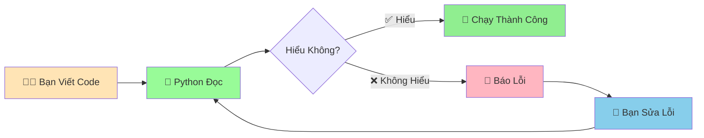

# 🐛 Hiểu và Sửa Lỗi Cơ Bản - Khi Python "Không Hiểu" Bạn Nói Gì

:::tip 🎯 Điều Quan Trọng Nhất
**Gặp lỗi là điều hoàn toàn bình thường!** Ngay cả những lập trình viên có 20+ năm kinh nghiệm vẫn gặp lỗi hàng ngày. Lỗi không phải là dấu hiệu bạn không giỏi - mà là cơ hội để học!
:::

## 🤔 Lỗi Là Gì?

**Lỗi (Error)** xảy ra khi Python **không hiểu** hoặc **không thể thực hiện** những gì bạn yêu cầu. Giống như khi bạn nói tiếng Việt với người nước ngoài - họ sẽ "bối rối" và báo là không hiểu!



## 🚨 Các Loại Lỗi Phổ Biến

### 📝 1. Lỗi Cú Pháp (Syntax Error)

Giống như **viết sai chính tả** hoặc **ngữ pháp sai** trong tiếng Việt:

```python
# ❌ Quên dấu ngoặc kép đóng
print("Xin chào
# SyntaxError: EOL while scanning string literal

# ❌ Quên dấu hai chấm trong if
if 5 > 3
    print("Đúng rồi!")
# SyntaxError: invalid syntax

# ❌ Sai thụt lề (indentation)
if True:
print("Hello")
# IndentationError: expected an indented block

# ✅ Cách viết đúng
print("Xin chào")
if 5 > 3:
    print("Đúng rồi!")
```

### 🏷️ 2. Lỗi Tên Biến (NameError)

Khi bạn sử dụng **biến chưa được tạo**:

```python
# ❌ Sử dụng biến chưa tồn tại
print(ten_toi)
# NameError: name 'ten_toi' is not defined

# ❌ Viết sai tên biến
ten_ban = "An"
print(ten_ban_be)  # Viết sai tên!
# NameError: name 'ten_ban_be' is not defined

# ✅ Cách sửa
ten_toi = "Minh"
print(ten_toi)  # Hoạt động bình thường

ten_ban = "An"
print(ten_ban)  # Viết đúng tên biến
```

### 🔢 3. Lỗi Kiểu Dữ Liệu (TypeError)

Khi bạn **dùng sai kiểu dữ liệu**:

```python
# ❌ Không thể cộng số với chuỗi
tuoi = 15
cau_noi = "Tôi " + tuoi + " tuổi"
# TypeError: can only concatenate str (not "int") to str

# ❌ Không thể chia chuỗi cho số
ten = "Python"
ket_qua = ten / 2
# TypeError: unsupported operand type(s) for /: 'str' and 'int'

# ✅ Cách sửa
tuoi = 15
cau_noi = "Tôi " + str(tuoi) + " tuổi"  # Chuyển số thành chuỗi
# Hoặc dùng f-string
cau_noi = f"Tôi {tuoi} tuổi"
```

### 📋 4. Lỗi Chỉ Số (IndexError)

Khi bạn **truy cập vị trí không tồn tại** trong chuỗi:

```python
# ❌ Chuỗi chỉ có 6 ký tự (0-5) nhưng truy cập vị trí 10
ten = "Python"
ky_tu = ten[10]
# IndexError: string index out of range

# ✅ Cách sửa - kiểm tra độ dài trước
ten = "Python"
if len(ten) > 10:
    ky_tu = ten[10]
else:
    print(f"Chuỗi chỉ có {len(ten)} ký tự")
```

## 🔍 Đọc Hiểu Thông Báo Lỗi

Python báo lỗi rất chi tiết, hãy học cách đọc:

```python
# Code có lỗi
ten = "Minh"
tuoi = 15
gioi_thieu = ten + tuoi
```

**Thông báo lỗi:**
```
Traceback (most recent call last):
  File "test.py", line 3, in <module>
    gioi_thieu = ten + tuoi
TypeError: can only concatenate str (not "int") to str
```

**Cách đọc:**
1. **File "test.py", line 3** → Lỗi ở file `test.py`, dòng 3
2. **gioi_thieu = ten + tuoi** → Dòng code gây lỗi
3. **TypeError** → Loại lỗi (lỗi kiểu dữ liệu)
4. **can only concatenate str (not "int") to str** → Giải thích: chỉ có thể nối chuỗi với chuỗi, không thể nối với số

## 🔧 Chiến Lược Sửa Lỗi

### 🕵️ 1. Phương Pháp Thám Tử

```python
# Khi không biết lỗi ở đâu, hãy "thăm dò"
print("Checkpoint 1: Bắt đầu chương trình")

ten = "An"
print(f"Checkpoint 2: ten = {ten}")

tuoi = 16
print(f"Checkpoint 3: tuoi = {tuoi}")

# Dòng này có thể có lỗi
ket_qua = ten + tuoi  # Lỗi ở đây!
print(f"Checkpoint 4: ket_qua = {ket_qua}")

print("Checkpoint 5: Kết thúc chương trình")
```

### 🧪 2. Kiểm Tra Kiểu Dữ Liệu

```python
# Khi không chắc kiểu dữ liệu
bien_bi_nghi = input("Nhập một số: ")  # input() luôn trả về string!

print(f"Giá trị: {bien_bi_nghi}")
print(f"Kiểu: {type(bien_bi_nghi)}")

# Chuyển đổi an toàn
try:
    so = int(bien_bi_nghi)
    print(f"Đã chuyển thành số: {so}")
except ValueError:
    print("Không thể chuyển thành số!")
```

### 🎯 3. Chia Nhỏ Vấn Đề

```python
# Thay vì viết một dòng phức tạp
# ket_qua = (int(input("Số thứ nhất: ")) + int(input("Số thứ hai: "))) / 2

# Hãy chia nhỏ ra
print("Nhập số thứ nhất:")
so_1_str = input()
print(f"Bạn nhập: '{so_1_str}'")

so_1 = int(so_1_str)
print(f"Chuyển thành số: {so_1}")

print("Nhập số thứ hai:")
so_2_str = input()
so_2 = int(so_2_str)

tong = so_1 + so_2
print(f"Tổng: {tong}")

trung_binh = tong / 2
print(f"Trung bình: {trung_binh}")
```

## 🎪 Ví Dụ Thực Tế: Sửa Lỗi Từng Bước

### 🐛 Code Ban Đầu (Có Nhiều Lỗi)

```python
# Code này có rất nhiều lỗi!
print("Chào mừng đến với máy tính cá nhân!"

ten = input("Tên của bạn: ")
tuoi = input("Tuổi của bạn: ")

if tuoi >= 18
    print(ten + " đã trưởng thành!")
    co_the_lai_xe = True
else:
    print(ten + " vẫn còn trẻ")
    co_the_lai_xe = false

nam_sinh = 2024 - tuoi
print("Năm sinh: " + nam_sinh)
```

### ✅ Code Sau Khi Sửa

```python
# Code đã được sửa lỗi
print("Chào mừng đến với máy tính cá nhân!")  # Thêm dấu ngoặc đóng

ten = input("Tên của bạn: ")
tuoi_str = input("Tuổi của bạn: ")
tuoi = int(tuoi_str)  # Chuyển chuỗi thành số

if tuoi >= 18:  # Thêm dấu hai chấm
    print(ten + " đã trưởng thành!")
    co_the_lai_xe = True
else:
    print(ten + " vẫn còn trẻ")
    co_the_lai_xe = False  # Viết hoa chữ F

nam_sinh = 2024 - tuoi
print("Năm sinh: " + str(nam_sinh))  # Chuyển số thành chuỗi
```

## 🎯 Bài Tập Thực Hành

### 🥇 Bài Tập 1: Tìm và Sửa Lỗi Syntax

```python
# TODO: Tìm và sửa tất cả lỗi syntax trong code này
print("Bắt đầu bài tập"

ten = "Minh
tuoi = 15

if ten == "Minh"
print("Xin chào Minh!")

if tuoi > 10
    print("Bạn đã lớn rồi!")
    
print("Kết thúc bài tập"
```

**Gợi ý:** Có 5 lỗi syntax cần sửa!

### 🥈 Bài Tập 2: Sửa Lỗi Kiểu Dữ Liệu

```python
# TODO: Sửa lỗi để code chạy được
ho = "Nguyễn"
ten = "An" 
tuoi = 16
diem = 8.5

# Các dòng này có lỗi, hãy sửa
ho_ten = ho + ten  # Thiếu khoảng trắng
thong_tin = "Tôi là " + ho_ten + ", " + tuoi + " tuổi"
ket_qua = "Điểm của tôi: " + diem
tuoi_sau_10_nam = tuoi + "10"

print(ho_ten)
print(thong_tin)
print(ket_qua)
print("Tuổi sau 10 năm:", tuoi_sau_10_nam)
```

### 🥉 Bài Tập 3: Debug Máy Tính Đơn Giản

```python
# TODO: Tìm và sửa tất cả lỗi trong máy tính này
print("=== MÁY TÍNH ĐƠN GIẢN ===")

# Nhập số liệu
so_1 = input("Nhập số thứ nhất: ")
so_2 = input("Nhập số thứ hai: ")

# Tính toán (có lỗi!)
tong = so_1 + so_2
hieu = so_1 - so_2  
tich = so_1 * so_2
thuong = so_1 / so_2

# In kết quả
print("Tổng: " + tong)
print("Hiệu: " + hieu)
print("Tích: " + tich)
print("Thương: " + thuong)

# Kiểm tra số chẵn lẻ
if tong % 2 = 0:
    print("Tổng là số chẵn")
else
    print("Tổng là số lẻ")
```

## 🎊 Tóm Tắt

Trong bài này, bạn đã học được:

✅ **Lỗi là bạn, không phải thù** - Giúp bạn học tốt hơn  
✅ **4 loại lỗi phổ biến**: Syntax, Name, Type, Index  
✅ **Đọc thông báo lỗi**: File, dòng, loại lỗi, giải thích  
✅ **Chiến lược debug**: Thám tử, kiểm tra kiểu, chia nhỏ  
✅ **Kinh nghiệm thực tế**: Sửa lỗi từng bước một  

## 🚀 Bước Tiếp Theo

Chúc mừng! Bạn đã hoàn thành **tất cả các bài cơ bản** của Python! 🎉

Bây giờ bạn đã biết:
- Tạo biến và làm việc với dữ liệu
- Tính toán với Python
- Xử lý văn bản
- Logic đúng/sai
- Tìm và sửa lỗi

Tiếp theo, chúng ta sẽ bước vào phần **Trung Bình Thú Vị** với [Câu Lệnh Điều Kiện](/python/intermediate/conditional-statements) - dạy Python đưa ra quyết định thông minh!

:::tip 🎯 Lời Khuyên Cuối Cùng
**Đừng sợ lỗi!** Mỗi lần gặp lỗi là một lần bạn trở nên giỏi hơn. Hãy:
1. **Đọc kỹ thông báo lỗi** - Python đã "chỉ đường" cho bạn
2. **Google là bạn thân** - Tìm "python [tên lỗi]" 
3. **Hỏi khi cần** - Cộng đồng Python rất thân thiện
4. **Thực hành nhiều** - Càng code nhiều, càng ít lỗi
:::

---

*🔗 **Bài tiếp theo**: [Câu Lệnh Điều Kiện - Dạy Python Đưa Ra Quyết định](/python/intermediate/conditional-statements)*
