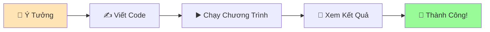

# 👋 Chương Trình Python Đầu Tiên - Dạy Rắn Nói "Xin Chào"

:::tip 🎯 Mục Tiêu Bài Học
Trong bài này, bạn sẽ viết chương trình Python đầu tiên và thấy nó chạy thành công! Giống như dạy con rắn pet nói những từ đầu tiên vậy! 🐍
:::

## 🌟 Chương Trình "Hello World" Là Gì?

**"Hello World"** là chương trình đầu tiên mà hầu hết mọi người viết khi học ngôn ngữ lập trình mới. Nó giống như:

- 👶 **Từ đầu tiên** của em bé
- 🎵 **Nốt nhạc đầu tiên** khi học đàn piano  
- 🚲 **Mét đầu tiên** khi học đi xe đạp



## 🐍 Dạy Python Nói "Xin Chào"

### Chương Trình Đơn Giản Nhất

```python
print("Xin chào! Tôi là Python! 🐍")
```

**Giải thích từng phần:**
- `print()` - Ra lệnh cho Python "nói" (hiển thị) điều gì đó
- `"Xin chào! Tôi là Python! 🐍"` - Câu nói mà Python sẽ hiển thị
- Dấu ngoặc kép `""` - Báo cho Python biết đây là text (văn bản)

:::info 💡 Ví Dụ Dễ Hiểu
Giống như bạn nói với con rắn: "Hãy nói câu này: Xin chào! Tôi là Python!" và con rắn sẽ lặp lại chính xác những gì bạn yêu cầu.
:::

## 🎮 Thực Hành: Viết Chương Trình Đầu Tiên

### Cách 1: Dùng Python Shell (Nhanh Nhất)

1. **Mở Python Shell:**
   ```bash
   # Windows
   python
   
   # Mac/Linux
   python3
   ```

2. **Gõ lệnh và nhấn Enter:**
   ```python
   >>> print("Xin chào! Tôi là Python! 🐍")
   Xin chào! Tôi là Python! 🐍
   ```

3. **Thử thêm các câu khác:**
   ```python
   >>> print("Tôi đang học lập trình!")
   Tôi đang học lập trình!
   
   >>> print("Python thật thú vị! 🎉")
   Python thật thú vị! 🎉
   ```

### Cách 2: Tạo File Python (Khuyến Nghị)

1. **Tạo file mới** tên `xin_chao.py`
2. **Viết code:**
   ```python
   # File: xin_chao.py
   # Chương trình Python đầu tiên của tôi!
   
   print("🎉 Chào mừng đến với Python!")
   print("Xin chào! Tôi là Python! 🐍")
   print("Tôi là con rắn thông minh!")
   print("Tôi có thể giúp bạn làm nhiều việc tuyệt vời!")
   ```

3. **Chạy chương trình:**
   ```bash
   # Windows
   python xin_chao.py
   
   # Mac/Linux
   python3 xin_chao.py
   ```

4. **Kết quả:**
   ```
   🎉 Chào mừng đến với Python!
   Xin chào! Tôi là Python! 🐍
   Tôi là con rắn thông minh!
   Tôi có thể giúp bạn làm nhiều việc tuyệt vời!
   ```

## 🎨 Làm Chương Trình Đẹp Hơn

### Thêm Emoji và Màu Sắc

```python
# File: xin_chao_dep.py
print("=" * 40)
print("🐍 CHÀO MỪNG ĐẾN VỚI PYTHON! 🐍")
print("=" * 40)
print()
print("👋 Xin chào! Tôi là Python!")
print("🎯 Tôi sẽ giúp bạn học lập trình!")
print("🚀 Chúng ta sẽ tạo ra những điều tuyệt vời!")
print("💡 Bắt đầu hành trình thú vị nào!")
print()
print("=" * 40)
print("🎉 CHƯƠNG TRÌNH ĐẦU TIÊN THÀNH CÔNG! 🎉")
print("=" * 40)
```

**Giải thích:**
- `"=" * 40` - Tạo 40 dấu `=` để làm khung đẹp
- `print()` không có gì bên trong - Tạo dòng trống
- Emoji làm chương trình sinh động hơn

### Tạo Thông Tin Cá Nhân

```python
# File: gioi_thieu.py
print("🌟 THÔNG TIN CỦA TÔI 🌟")
print("-" * 25)
print()
print("📛 Tên: [Điền tên bạn vào đây]")
print("🎂 Tuổi: [Điền tuổi bạn]")
print("🏫 Trường: [Điền tên trường]") 
print("🎯 Mục tiêu: Học Python giỏi!")
print("🐍 Trạng thái: Đang làm quen với Python!")
print()
print("💪 Tôi sẽ trở thành Python Developer!")
print("🚀 Hành trình bắt đầu từ hôm nay!")
```

## 🔍 Hiểu Rõ Hàm `print()`

### Cách Sử Dụng Cơ Bản

```python
# In một câu
print("Hello World!")

# In nhiều câu
print("Câu thứ nhất")
print("Câu thứ hai")
print("Câu thứ ba")

# In số
print(123)
print(3.14)

# In cả text và số
print("Tuổi của tôi là:", 15)
```

### Các Tùy Chọn Của `print()`

```python
# In trên cùng một dòng
print("Hello", end=" ")
print("World!")
# Kết quả: Hello World!

# Thay đổi ký tự phân cách
print("Táo", "Cam", "Chuối", sep=" - ")
# Kết quả: Táo - Cam - Chuối

# In nhiều thông tin
print("Tên:", "Minh", "Tuổi:", 15, "Lớp:", "10A")
# Kết quả: Tên: Minh Tuổi: 15 Lớp: 10A
```

## 🎯 Bài Tập Thực Hành

### Bài Tập 1: Tự Giới Thiệu
Tạo file `tu_gioi_thieu.py` và viết chương trình giới thiệu bản thân:

```python
# Hãy thay đổi thông tin thành thông tin của bạn!
print("🌟 XIN CHÀO MỌI NGƯỜI! 🌟")
print()
print("👋 Tôi tên là [Tên của bạn]")
print("🎂 Tôi [tuổi] tuổi")
print("🏠 Tôi sống ở [thành phố]")
print("🎮 Sở thích: [sở thích của bạn]")
print("📚 Tôi đang học Python!")
print()
print("🤝 Rất vui được làm quen với mọi người!")
```

### Bài Tập 2: Thông Điệp Động Viên
Tạo file `dong_vien.py`:

```python
print("💪 THÔNG ĐIỆP ĐỘNG VIÊN 💪")
print("=" * 30)
print()
print("🌟 Bạn có thể làm được!")
print("🚀 Mỗi chuyên gia đều từng là người mới bắt đầu!")
print("💡 Học lập trình là hành trình, không phải đích đến!")
print("🎯 Hôm nay tốt hơn hôm qua là thành công!")
print("🐍 Python sẽ là người bạn tốt nhất của bạn!")
print()
print("🎉 Chúc bạn học tập vui vẻ và thành công!")
```

### Bài Tập 3: Tính Toán Đơn Giản
```python
print("🧮 PYTHON - MÁY TÍNH THÔNG MINH 🧮")
print("-" * 35)
print()
print("Python có thể tính toán:")
print("5 + 3 =", 5 + 3)
print("10 - 4 =", 10 - 4)
print("6 × 7 =", 6 * 7)
print("20 ÷ 4 =", 20 / 4)
print()
print("🤯 Wow! Python giỏi toán thật!")
```

### Bài Tập 4: Lịch Học Python
```python
print("📅 LỊCH HỌC PYTHON CỦA TÔI 📅")
print("=" * 32)
print()
print("🌅 Thứ 2: Học biến và kiểu dữ liệu")
print("🌤️ Thứ 3: Học input và output") 
print("☀️ Thứ 4: Học if-else")
print("🌦️ Thứ 5: Học vòng lặp")
print("🌙 Thứ 6: Làm dự án nhỏ")
print("🎮 Cuối tuần: Nghỉ ngơi và ôn tập")
print()
print("🎯 Mục tiêu: Mỗi ngày tiến bộ một chút!")
```

## 🔧 Xử Lý Lỗi Thường Gặp

### ❌ Lỗi: SyntaxError

**Code sai:**
```python
print("Hello World!)  # Thiếu dấu ngoặc kép đóng
```

**Lỗi:**
```
SyntaxError: EOL while scanning string literal
```

**Sửa:**
```python
print("Hello World!")  # Đủ cặp ngoặc kép
```

### ❌ Lỗi: NameError

**Code sai:**
```python
Print("Hello")  # Viết hoa chữ P
```

**Lỗi:**
```
NameError: name 'Print' is not defined
```

**Sửa:**
```python
print("Hello")  # Viết thường chữ p
```

### ❌ Lỗi: IndentationError

**Code sai:**
```python
print("Line 1")
    print("Line 2")  # Thụt lề không cần thiết
```

**Sửa:**
```python
print("Line 1")
print("Line 2")  # Không thụt lề
```

## 🎊 Chúc Mừng Thành Công!

:::success 🎉 Bạn Đã Hoàn Thành!
Chúc mừng! Bạn vừa viết và chạy thành công chương trình Python đầu tiên! Con rắn Python đã học được cách "nói chuyện" rồi! 🐍✨
:::

### 🏆 Những Gì Bạn Đã Học:
- ✅ Viết chương trình Python đầu tiên
- ✅ Sử dụng hàm `print()` để hiển thị text
- ✅ Tạo và chạy file Python (.py)
- ✅ Làm cho chương trình đẹp mắt với emoji
- ✅ Xử lý một số lỗi cơ bản

### 🚀 Bước Tiếp Theo:

1. 📢 **[In tin nhắn](/python/basics/printing-messages)** - Dạy Python nói chuyện thành thạo hơn
2. 👂 **[Nhận thông tin](/python/basics/getting-input)** - Dạy Python lắng nghe
3. 💭 **[Ghi chú trong code](/python/basics/comments)** - Học cách ghi nhớ

:::tip 💡 Lời Khuyên
**Hãy thử thay đổi và thử nghiệm!** Thay đổi text, thêm emoji, tạo thông điệp của riêng bạn. Đây là cách tốt nhất để học - không sợ "làm hỏng" gì cả!
:::

## 🎮 Thử Thách Bổ Sung

### Thử Thách 1: Tạo Poster Tuyển Dụng
```python
print("🚀 TUYỂN DỤNG PYTHON DEVELOPER 🚀")
print("=" * 40)
print("🏢 Công ty: [Tên công ty mơ ước]")
print("💼 Vị trí: Junior Python Developer") 
print("💰 Lương: 15-25 triệu VNĐ")
print("📍 Địa điểm: Hà Nội/TP.HCM")
print()
print("📋 YÊU CẦU:")
print("   ✅ Biết Python cơ bản")
print("   ✅ Đam mê học hỏi")
print("   ✅ Thái độ tích cực")
print()
print("🎯 ĐÂY SẼ LÀ TÔI TRONG TƯƠNG LAI!")
```

### Thử Thách 2: Tạo Menu Nhà Hàng
```python
print("🍜 NHÀ HÀNG PYTHON PHỞ 🍜")
print("=" * 30)
print()
print("🥢 MENU HÔMNAY:")
print("1. Phở Bò Python        - 50.000 VNĐ")
print("2. Bún Chả Code         - 45.000 VNĐ") 
print("3. Bánh Mì Debug        - 25.000 VNĐ")
print("4. Cà Phê Programming   - 20.000 VNĐ")
print("5. Chè Syntax           - 15.000 VNĐ")
print()
print("🎉 Món nào cũng ngon và bổ dưỡng!")
print("💡 Ăn xong code Python siêu mượt!")
```

---

*👋 **Ghi chú**: Chương trình đầu tiên là bước quan trọng nhất! Từ đây, bạn sẽ dần dần dạy Python những kỹ năng phức tạp hơn. Hãy tự hào về thành tựu này!*
