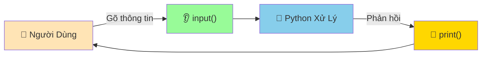

# 👂 Nhận Thông Tin - Dạy Python Lắng Nghe

:::tip 🎧 Ví Dụ Dễ Hiểu
Giống như dạy con rắn pet không chỉ biết "nói" mà còn biết "lắng nghe" và phản hồi với những gì bạn nói. Python sẽ học cách đợi, nghe, hiểu và trả lời người dùng một cách thông minh!
:::

## 🤔 Tại Sao Python Cần Biết Lắng Nghe?

Cho đến giờ, Python chỉ biết "nói" (print). Giờ chúng ta sẽ dạy nó:

- 👂 **Lắng nghe** người dùng gõ thông tin
- 🤝 **Tương tác** hai chiều với con người
- 🎯 **Phản hồi** dựa trên input nhận được
- 🔄 **Tạo chương trình động** thay vì chỉ hiển thị text cố định



## 🎯 Hàm input() Cơ Bản

### 📝 **Cú Pháp Đơn Giản**

```python
# Cách cơ bản nhất
ten = input("Tên bạn là gì? ")
print(f"Xin chào {ten}!")
```

**Kết quả:**
```
Tên bạn là gì? Minh
Xin chào Minh!
```

### 🔍 **input() Hoạt Động Như Thế Nào?**

```python
# Bước 1: Python hiển thị câu hỏi
# Bước 2: Python dừng lại và đợi
# Bước 3: Người dùng gõ và nhấn Enter
# Bước 4: Python lưu thông tin vào biến
# Bước 5: Tiếp tục chạy chương trình

ten = input("Nhập tên: ")  # Python đợi ở đây
print(f"Tên đã nhận: {ten}")  # Chạy sau khi có input
```

:::info 💡 Điều Quan Trọng
**input() luôn trả về STRING** (chuỗi text), dù người dùng nhập số hay chữ. Nếu cần số, phải convert!
:::

## 🔢 Nhận Các Loại Dữ Liệu Khác Nhau

### 📝 **Nhận Text (String)**

```python
# Thông tin cá nhân
ho_ten = input("Họ tên đầy đủ: ")
que_quan = input("Quê quán: ")
so_thich = input("Sở thích: ")

print(f"\n🎭 THÔNG TIN CỦA BẠN:")
print(f"👤 Tên: {ho_ten}")
print(f"🏠 Quê: {que_quan}")
print(f"❤️ Thích: {so_thich}")
```

### 🔢 **Nhận Số (Numbers)**

```python
# ❌ Sai - input() trả về string
tuoi = input("Tuổi của bạn: ")
nam_sau = tuoi + 1  # Lỗi! Không thể cộng string với số

# ✅ Đúng - Convert string thành int
tuoi = int(input("Tuổi của bạn: "))
nam_sau = tuoi + 1
print(f"Năm sau bạn sẽ {nam_sau} tuổi")

# Số thập phân
chieu_cao = float(input("Chiều cao (m): "))
can_nang = float(input("Cân nặng (kg): "))
bmi = can_nang / (chieu_cao ** 2)
print(f"BMI của bạn: {bmi:.2f}")
```

### ✅ **Nhận True/False (Boolean)**

```python
# Cách 1: So sánh string
hoc_python = input("Bạn có thích học Python không? (có/không): ")
if hoc_python.lower() == "có":
    print("🎉 Tuyệt vời! Python sẽ giúp bạn rất nhiều!")
else:
    print("😊 Không sao, có thể bạn sẽ thích sau!")

# Cách 2: Chuyển thành boolean
co_ban_gai = input("Bạn có bạn gái/trai không? (y/n): ").lower()
da_co_nguoi_yeu = co_ban_gai in ['y', 'yes', 'có', 'có chứ']
print(f"Tình trạng: {'Đã có người yêu' if da_co_nguoi_yeu else 'Độc thân'}")
```

## 🛡️ Validation - Kiểm Tra Dữ Liệu

### 🔍 **Kiểm Tra Số Hợp Lệ**
### 🔍 **Kiểm Tra Số Hợp Lệ**

```python
# Cách 1: Sử dụng try-except (Khuyến nghị)
def nhap_so_tuoi():
    while True:
        try:
            tuoi = int(input("Nhập tuổi của bạn: "))
            if tuoi < 0:
                print("❌ Tuổi không thể âm! Thử lại.")
                continue
            elif tuoi > 150:
                print("❌ Tuổi quá lớn! Thử lại.")
                continue
            return tuoi
        except ValueError:
            print("❌ Vui lòng nhập số nguyên! Thử lại.")

# Sử dụng
tuoi = nhap_so_tuoi()
print(f"✅ Tuổi hợp lệ: {tuoi}")
```

### 🔤 **Kiểm Tra Text Hợp Lệ**

```python
def nhap_ten():
    while True:
        ten = input("Nhập tên của bạn: ").strip()
        
        if not ten:  # Kiểm tra rỗng
            print("❌ Tên không được để trống!")
            continue
        
        if len(ten) < 2:
            print("❌ Tên phải có ít nhất 2 ký tự!")
            continue
            
        if not ten.replace(" ", "").isalpha():
            print("❌ Tên chỉ được chứa chữ cái!")
            continue
            
        return ten.title()  # Viết hoa chữ cái đầu

# Sử dụng
ten = nhap_ten()
print(f"✅ Tên hợp lệ: {ten}")
```

### 📧 **Kiểm Tra Email**

```python
import re

def nhap_email():
    pattern = r'^[a-zA-Z0-9._%+-]+@[a-zA-Z0-9.-]+\.[a-zA-Z]{2,}$'
    
    while True:
        email = input("Nhập email: ").strip().lower()
        
        if not email:
            print("❌ Email không được để trống!")
            continue
            
        if re.match(pattern, email):
            return email
        else:
            print("❌ Email không hợp lệ! (vd: ten@gmail.com)")

# Sử dụng
email = nhap_email()
print(f"✅ Email hợp lệ: {email}")
```

## 🎮 Tương Tác Nâng Cao

### 🔄 **Menu Lựa Chọn**

```python
def hien_thi_menu():
    print("\n🎯 MENU CHÍNH")
    print("=" * 30)
    print("1. 📊 Tính BMI")
    print("2. 🎲 Chơi game đoán số")
    print("3. 📝 Ghi chú cá nhân")
    print("4. ❌ Thoát")
    print("=" * 30)

def chon_menu():
    while True:
        hien_thi_menu()
        lua_chon = input("Chọn chức năng (1-4): ").strip()
        
        if lua_chon in ['1', '2', '3', '4']:
            return int(lua_chon)
        else:
            print("❌ Lựa chọn không hợp lệ! Vui lòng chọn 1-4.")

# Sử dụng
while True:
    chon = chon_menu()
    
    if chon == 1:
        print("🔄 Đang tính BMI...")
    elif chon == 2:
        print("🎲 Bắt đầu game...")
    elif chon == 3:
        print("📝 Mở ghi chú...")
    elif chon == 4:
        print("👋 Tạm biệt!")
        break
```

### 💬 **Chatbot Đơn Giản**

```python
import random

def chatbot():
    print("🤖 Xin chào! Tôi là Python Bot!")
    print("💬 Hãy nói chuyện với tôi (gõ 'bye' để thoát)")
    
    responses = {
        "xin chào": ["Xin chào bạn! 😊", "Chào bạn nhé! 👋", "Hello! 🌟"],
        "tên": ["Tôi là Python Bot! 🤖", "Tôi tên là Bot, còn bạn?", "Bot là tên tôi!"],
        "tuổi": ["Tôi vừa được tạo ra! 🆕", "Tôi còn rất trẻ!", "Tuổi? Tôi là AI mà! 😄"],
        "python": ["Python tuyệt vời! 🐍", "Tôi yêu Python!", "Python là ngôn ngữ tốt nhất!"],
        "bye": ["Tạm biệt! 👋", "Bye bye! 🌟", "Hẹn gặp lại! 😊"]
    }
    
    while True:
        user_input = input("\n👤 Bạn: ").lower().strip()
        
        if user_input == "bye":
            print(f"🤖 Bot: {random.choice(responses['bye'])}")
            break
        
        # Tìm từ khóa trong input
        found = False
        for keyword, reply_list in responses.items():
            if keyword in user_input:
                print(f"🤖 Bot: {random.choice(reply_list)}")
                found = True
                break
        
        if not found:
            default_replies = [
                "Thú vị quá! Kể thêm đi! 🤔",
                "Tôi chưa hiểu lắm... 😅",
                "Wow, điều đó thật tuyệt! 🎉",
                "Hm, bạn có thể nói rõ hơn không? 🤷‍♂️"
            ]
            print(f"🤖 Bot: {random.choice(default_replies)}")

# Chạy chatbot
chatbot()
```

## 🎯 Dự Án Thực Hành

### 📋 **Dự Án 1: Hồ Sơ Cá Nhân**

```python
def tao_ho_so_ca_nhan():
    print("🌟 TẠO HỒ SƠ CÁ NHÂN 🌟")
    print("=" * 40)
    
    # Thu thập thông tin
    ho_ten = input("👤 Họ tên: ").title()
    tuoi = int(input("🎂 Tuổi: "))
    que_quan = input("🏠 Quê quán: ").title()
    nghe_nghiep = input("💼 Nghề nghiệp: ")
    so_thich = input("❤️ Sở thích: ")
    mo_ta = input("📝 Mô tả bản thân (1 câu): ")
    
    # Hiển thị hồ sơ đẹp
    print("\n" + "🌟" * 50)
    print(f"{'📋 HỒ SƠ CÁ NHÂN':^50}")
    print("🌟" * 50)
    print(f"👤 Tên: {ho_ten}")
    print(f"🎂 Tuổi: {tuoi} tuổi")
    print(f"🏠 Quê: {que_quan}")
    print(f"💼 Nghề: {nghe_nghiep}")
    print(f"❤️ Thích: {so_thich}")
    print(f"📝 Giới thiệu: {mo_ta}")
    print(f"📅 Năm sinh: {2024 - tuoi}")
    print("🌟" * 50)
    
    # Lưu vào file (nâng cao)
    with open("ho_so.txt", "w", encoding="utf-8") as file:
        file.write(f"Hồ sơ của {ho_ten}\n")
        file.write(f"Tuổi: {tuoi}\n")
        file.write(f"Quê: {que_quan}\n")
        file.write(f"Nghề: {nghe_nghiep}\n")
        file.write(f"Sở thích: {so_thich}\n")
        file.write(f"Mô tả: {mo_ta}\n")
    
    print("💾 Đã lưu hồ sơ vào file 'ho_so.txt'")

# Chạy dự án
tao_ho_so_ca_nhan()
```

### 🧮 **Dự Án 2: Máy Tính Cá Nhân**

```python
def may_tinh_ca_nhan():
    print("🧮 MÁY TÍNH CÁ NHÂN 🧮")
    
    while True:
        print("\n📊 Các phép tính:")
        print("1. ➕ Cộng")
        print("2. ➖ Trừ") 
        print("3. ✖️ Nhân")
        print("4. ➗ Chia")
        print("5. 🔢 Lũy thừa")
        print("6. ❌ Thoát")
        
        chon = input("\nChọn phép tính (1-6): ").strip()
        
        if chon == '6':
            print("👋 Tạm biệt!")
            break
        
        if chon not in ['1', '2', '3', '4', '5']:
            print("❌ Lựa chọn không hợp lệ!")
            continue
        
        try:
            a = float(input("Nhập số thứ nhất: "))
            b = float(input("Nhập số thứ hai: "))
            
            if chon == '1':
                ket_qua = a + b
                print(f"📊 {a} + {b} = {ket_qua}")
            elif chon == '2':
                ket_qua = a - b
                print(f"📊 {a} - {b} = {ket_qua}")
            elif chon == '3':
                ket_qua = a * b
                print(f"📊 {a} × {b} = {ket_qua}")
            elif chon == '4':
                if b == 0:
                    print("❌ Không thể chia cho 0!")
                else:
                    ket_qua = a / b
                    print(f"📊 {a} ÷ {b} = {ket_qua}")
            elif chon == '5':
                ket_qua = a ** b
                print(f"📊 {a}^{b} = {ket_qua}")
                
        except ValueError:
            print("❌ Vui lòng nhập số hợp lệ!")

# Chạy máy tính
may_tinh_ca_nhan()
```

## 🔧 Xử Lý Lỗi Input Thường Gặp

### ❌ **Lỗi: ValueError**

```python
# ❌ Lỗi khi convert
try:
    tuoi = int(input("Tuổi: "))  # User nhập "abc"
except ValueError:
    print("❌ Vui lòng nhập số!")

# ✅ Cách xử lý tốt
def nhap_so_an_toan(prompt, loai_so=int):
    while True:
        try:
            return loai_so(input(prompt))
        except ValueError:
            print(f"❌ Vui lòng nhập {loai_so.__name__} hợp lệ!")

# Sử dụng
tuoi = nhap_so_an_toan("Tuổi: ", int)
diem = nhap_so_an_toan("Điểm: ", float)
```

### ❌ **Lỗi: KeyboardInterrupt**

```python
# Xử lý khi user nhấn Ctrl+C
try:
    ten = input("Tên: ")
    tuoi = int(input("Tuổi: "))
except KeyboardInterrupt:
    print("\n\n👋 Chương trình bị dừng bởi người dùng!")
    print("Tạm biệt! 😊")
```

### ❌ **Lỗi: EOFError**

```python
# Xử lý khi không có input (file rỗng)
try:
    ten = input("Tên: ")
except EOFError:
    print("❌ Không có dữ liệu đầu vào!")
    ten = "Khách"  # Giá trị mặc định
```

## 💡 Mẹo Pro Cho Input

### 🎨 **Input Đẹp Mắt**

```python
def input_dep(prompt, icon="🔸"):
    """Tạo input prompt đẹp mắt"""
    return input(f"{icon} {prompt}: ").strip()

# Sử dụng
ten = input_dep("Tên của bạn", "👤")
tuoi = input_dep("Tuổi", "🎂")
email = input_dep("Email", "📧")
```

### ⏱️ **Input Với Timeout** (Nâng Cao)

```python
import signal
import sys

def timeout_handler(signum, frame):
    raise TimeoutError("Hết thời gian!")

def input_co_thoi_han(prompt, timeout=10):
    """Input với giới hạn thời gian"""
    signal.signal(signal.SIGALRM, timeout_handler)
    signal.alarm(timeout)
    
    try:
        result = input(f"{prompt} (có {timeout}s): ")
        signal.alarm(0)  # Tắt timeout
        return result
    except TimeoutError:
        print(f"\n⏰ Hết {timeout} giây! Sử dụng giá trị mặc định.")
        return ""

# Sử dụng (chỉ hoạt động trên Unix/Linux/Mac)
# ten = input_co_thoi_han("Tên", 5)
```

### 🔒 **Input Mật Khẩu** (Ẩn Text)

```python
import getpass

def nhap_mat_khau():
    """Nhập mật khẩu không hiển thị trên màn hình"""
    while True:
        password = getpass.getpass("🔒 Mật khẩu: ")
        
        if len(password) < 6:
            print("❌ Mật khẩu phải có ít nhất 6 ký tự!")
            continue
        
        confirm = getpass.getpass("🔒 Xác nhận mật khẩu: ")
        
        if password == confirm:
            print("✅ Mật khẩu hợp lệ!")
            return password
        else:
            print("❌ Mật khẩu không khớp!")

# Sử dụng
# mat_khau = nhap_mat_khau()
```

## 🎊 Tóm Tắt

:::success 🌟 Những Gì Bạn Đã Học
- 👂 **input()** - Nhận thông tin từ người dùng
- 🔄 **Type conversion** - Chuyển đổi string thành int/float
- 🛡️ **Validation** - Kiểm tra dữ liệu hợp lệ
- ⚠️ **Error handling** - Xử lý lỗi với try-except
- 🎮 **Interactive programs** - Tạo chương trình tương tác
- 💬 **User experience** - Làm input thân thiện và đẹp mắt
:::

### 🚀 **Bước Tiếp Theo:**

Bây giờ Python đã biết "nói" và "nghe", hãy dạy nó "ghi nhớ":

1. 💭 **[Ghi chú trong code](/python/basics/comments)** - Dạy Python ghi nhớ và giải thích
2. 📦 **Biến số** - Dạy Python lưu trữ thông tin (sắp ra mắt!)
3. 🧮 **Toán học cơ bản** - Dạy Python tính toán (sắp ra mắt!)

:::tip 💡 Lời Khuyên
**Input validation là rất quan trọng!** Luôn giả định người dùng sẽ nhập sai, và chuẩn bị sẵn cách xử lý. Một chương trình tốt là chương trình không bao giờ crash vì input không mong đợi!
:::

---

*👂 **Ghi nhớ**: Input tốt tạo nên trải nghiệm người dùng tuyệt vời. Hãy làm cho việc tương tác với chương trình Python của bạn trở thành niềm vui!*
