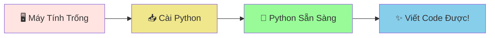
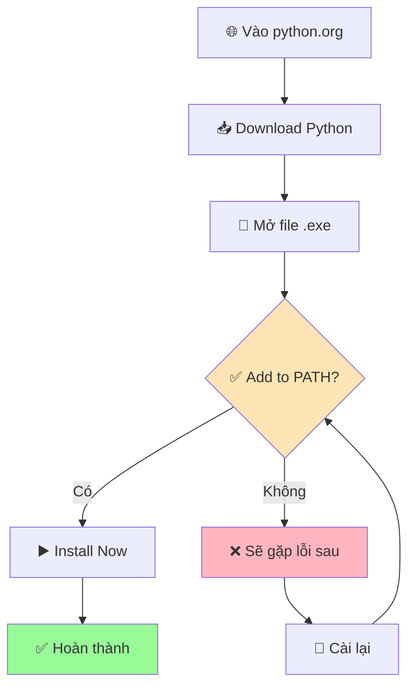
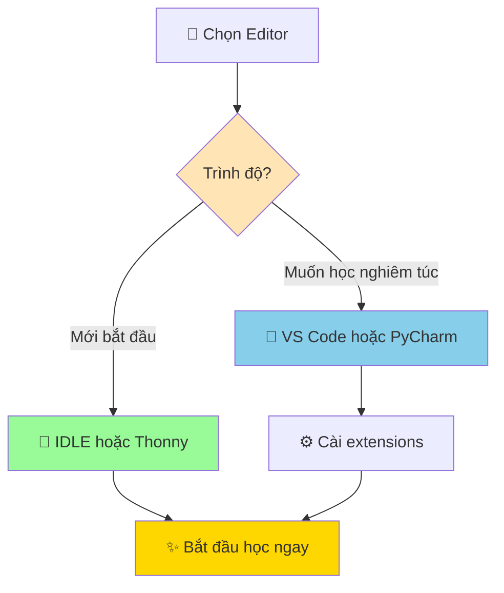

# 💻 Cài Đặt Python - Chuẩn Bị Nhà Cho Con Rắn

:::tip 🏠 Ví Dụ Dễ Hiểu
Giống như bạn cần chuẩn bị một cái chuồng thoải mái cho pet rắn, chúng ta cũng cần cài đặt Python trên máy tính để nó có thể "sống" và làm việc ở đó!
:::

## 🤔 Tại Sao Cần Cài Đặt Python?

Máy tính của bạn hiện tại chưa "hiểu" được ngôn ngữ Python. Việc cài đặt Python giống như:

- 📚 **Dạy máy tính một ngôn ngữ mới** - Python
- 🏠 **Tạo không gian làm việc** cho con rắn Python
- 🔧 **Cung cấp công cụ** để viết và chạy chương trình



## 🔍 Kiểm Tra Python Đã Có Chưa

Trước khi cài mới, hãy kiểm tra xem máy tính đã có Python chưa:

### 🪟 Trên Windows
1. Nhấn `Windows + R`
2. Gõ `cmd` và nhấn Enter
3. Gõ lệnh: `python --version` hoặc `python -V`

### 🍎 Trên Mac
1. Mở **Terminal** (tìm trong Spotlight)
2. Gõ lệnh: `python3 --version`

### 🐧 Trên Linux
1. Mở **Terminal**
2. Gõ lệnh: `python3 --version`

:::info 📋 Kết Quả Mong Đợi
Nếu Python đã được cài, bạn sẽ thấy something like:
```
Python 3.11.5
```
Nếu chưa có, bạn sẽ thấy thông báo lỗi như "command not found" hoặc "không tìm thấy lệnh".
:::

## 📥 Cài Đặt Python Mới

### 🪟 Cài Đặt Trên Windows

#### Bước 1: Tải Python
1. Vào website chính thức: **[python.org](https://python.org)**
2. Click vào **"Downloads"**
3. Click vào **"Download Python 3.x.x"** (phiên bản mới nhất)

#### Bước 2: Chạy File Cài Đặt
1. Mở file `.exe` vừa tải về
2. **⚠️ QUAN TRỌNG**: Tick vào ô **"Add Python to PATH"**
3. Click **"Install Now"**
4. Đợi quá trình cài đặt hoàn thành



#### Bước 3: Kiểm Tra Cài Đặt
1. Mở **Command Prompt** (cmd)
2. Gõ: `python --version`
3. Gõ: `pip --version` (pip là công cụ cài thêm tính năng)

### 🍎 Cài Đặt Trên Mac

#### Cách 1: Từ Website (Khuyến Nghị)
1. Vào **[python.org/downloads](https://python.org/downloads)**
2. Download phiên bản cho macOS
3. Mở file `.pkg` và làm theo hướng dẫn

#### Cách 2: Dùng Homebrew (Nâng Cao)
```bash
# Cài Homebrew trước (nếu chưa có)
/bin/bash -c "$(curl -fsSL https://raw.githubusercontent.com/Homebrew/install/HEAD/install.sh)"

# Cài Python
brew install python
```

#### Kiểm Tra:
```bash
python3 --version
pip3 --version
```

### 🐧 Cài Đặt Trên Linux

#### Ubuntu/Debian:
```bash
sudo apt update
sudo apt install python3 python3-pip
```

#### CentOS/RHEL/Fedora:
```bash
# CentOS/RHEL
sudo yum install python3 python3-pip

# Fedora
sudo dnf install python3 python3-pip
```

#### Kiểm Tra:
```bash
python3 --version
pip3 --version
```

## 🎯 Chọn Code Editor (Trình Soạn Thảo)

Python cần một nơi để viết code. Đây là những lựa chọn tốt:

### 🔰 Cho Người Mới Bắt Đầu

#### 1. **IDLE** (Đi kèm Python)
- ✅ **Ưu điểm**: Đã có sẵn, đơn giản
- ❌ **Nhược điểm**: Tính năng hạn chế
- 🎯 **Phù hợp**: Học cơ bản, thử nghiệm nhanh

#### 2. **Thonny** (Khuyến nghị)
- ✅ **Ưu điểm**: Thiết kế cho người mới, debug dễ
- 📥 **Tải về**: [thonny.org](https://thonny.org)
- 🎯 **Phù hợp**: Học Python từ đầu

### 🚀 Cho Người Muốn Chuyên Nghiệp

#### 1. **Visual Studio Code** (VS Code)
- ✅ **Ưu điểm**: Mạnh mẽ, nhiều tính năng, miễn phí
- 📥 **Tải về**: [code.visualstudio.com](https://code.visualstudio.com)
- 🔧 **Extensions cần thiết**: Python, Python Docstring Generator

#### 2. **PyCharm Community**
- ✅ **Ưu điểm**: Chuyên cho Python, tính năng đầy đủ
- 📥 **Tải về**: [jetbrains.com/pycharm](https://jetbrains.com/pycharm)



## ✅ Kiểm Tra Cài Đặt Hoàn Chỉnh

Hãy chạy những lệnh này để đảm bảo mọi thứ hoạt động:

### 1. Kiểm Tra Python
```bash
# Windows
python --version
python -c "print('Xin chào Python! 🐍')"

# Mac/Linux  
python3 --version
python3 -c "print('Xin chào Python! 🐍')"
```

### 2. Kiểm Tra Pip (Công cụ cài packages)
```bash
# Windows
pip --version
pip list

# Mac/Linux
pip3 --version
pip3 list
```

### 3. Test Chương Trình Đầu Tiên
Tạo file `test.py` với nội dung:
```python
print("🎉 Python đã sẵn sàng!")
print("Chào mừng bạn đến với thế giới lập trình!")

# Tính toán đơn giản
result = 5 + 3
print(f"5 + 3 = {result}")
```

Chạy file:
```bash
# Windows
python test.py

# Mac/Linux
python3 test.py
```

:::success 🎉 Kết Quả Mong Đợi
```
🎉 Python đã sẵn sàng!
Chào mừng bạn đến với thế giới lập trình!
5 + 3 = 8
```
:::

## 🔧 Khắc Phục Sự Cố Thường Gặp

### ❌ Lỗi: "python is not recognized" (Windows)
**Nguyên nhân**: Chưa thêm Python vào PATH

**Giải pháp**:
1. Gỡ cài đặt Python hiện tại
2. Cài lại và nhớ tick "Add Python to PATH"
3. Hoặc thêm PATH thủ công trong System Environment Variables

### ❌ Lỗi: "command not found" (Mac/Linux)
**Nguyên nhân**: Python chưa được cài hoặc dùng sai lệnh

**Giải pháp**:
- Thử `python3` thay vì `python`
- Cài lại Python từ website chính thức
- Kiểm tra PATH: `echo $PATH`

### ❌ Lỗi: Permission denied
**Giải pháp**:
- Mac/Linux: Dùng `sudo` trước lệnh cài đặt
- Windows: Chạy Command Prompt "as Administrator"

## 🎯 Cài Đặt Packages Hữu Ích

Sau khi cài Python xong, hãy cài thêm một số packages cơ bản:

```bash
# Windows
pip install requests matplotlib pillow

# Mac/Linux
pip3 install requests matplotlib pillow
```

**Giải thích**:
- `requests`: Để kết nối internet, tải dữ liệu
- `matplotlib`: Để vẽ biểu đồ đẹp
- `pillow`: Để xử lý hình ảnh

## 🚀 Sẵn Sàng Bước Tiếp Theo!

:::tip 🎊 Chúc Mừng!
Bạn đã cài đặt thành công Python! Con rắn thông minh giờ đã có một căn nhà thoải mái trên máy tính của bạn và sẵn sàng học những kỹ năng mới!
:::

**Bước tiếp theo**:
1. 🏠 **[Tìm hiểu môi trường Python](/python/basics/python-environment)** - Làm quen với "ngôi nhà" của Python
2. 🐍 **[Python là gì?](/python/basics/what-is-python)** - Hiểu rõ hơn về con rắn thông minh
3. 👋 **[Chương trình đầu tiên](/python/basics/first-program)** - Dạy Python nói "Xin chào!"

:::info 💡 Mẹo Hay
**Bookmark trang này** để dễ dàng quay lại khi cần cài đặt Python trên máy tính khác hoặc giúp bạn bè cài đặt!
:::

---

*🔧 **Lưu ý kỹ thuật**: Hướng dẫn này áp dụng cho Python 3.8+ và được cập nhật thường xuyên để đảm bảo tính chính xác.*
