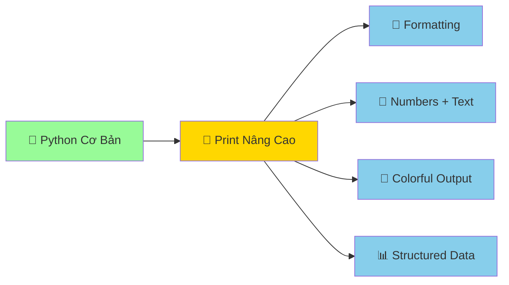

# 📢 In Tin Nhắn - Dạy Python Nói Chuyện

:::tip 🗣️ Ví Dụ Dễ Hiểu
Giống như dạy con rắn pet nói chuyện, chúng ta sẽ dạy Python "nói" những câu phức tạp, đẹp mắt và thông minh hơn. Từ câu đơn giản đến những thông điệp sinh động với màu sắc và định dạng!
:::

## 🎯 Tại Sao Cần Học Print() Nâng Cao?

Trong bài trước, bạn đã học `print("Hello World!")` cơ bản. Giờ chúng ta sẽ nâng cấp con rắn Python để nó có thể:

- 🎨 **Nói đẹp hơn** với formatting
- 🔢 **Kết hợp text và số** một cách thông minh
- 🌈 **Tạo output nhiều màu sắc** và sinh động
- 📊 **Hiển thị dữ liệu** có cấu trúc



## 🔤 Các Cách Print Khác Nhau

### 1. **Print Cơ Bản** (Đã Biết)
```python
print("Xin chào!")
print("Tôi là Python!")
```

### 2. **Print Nhiều Thứ Cùng Lúc**
```python
# Cách cũ - dài dòng
name = "Minh"
age = 15
print("Tên:", name, "Tuổi:", age)

# Kết quả: Tên: Minh Tuổi: 15
```

### 3. **F-Strings** - Cách Hiện Đại Nhất (Python 3.6+)
```python
name = "Minh"
age = 15
print(f"Tên: {name}, Tuổi: {age}")

# Kết quả: Tên: Minh, Tuổi: 15
```

:::info 💡 Tại Sao F-Strings Tốt Nhất?
F-strings (formatted string literals) là cách **nhanh nhất, dễ đọc nhất** và được khuyến nghị trong Python hiện đại. Chúng được cải tiến liên tục và có nhiều tính năng mạnh mẽ!
:::

## 🎨 F-Strings - Nghệ Thuật Formatting

### 🔢 **Kết Hợp Text và Numbers**

```python
# Thông tin cá nhân
full_name = "Nguyễn Văn Minh"
age = 16
math_score = 8.5
literature_score = 9.0

print(f"👋 Xin chào! Tôi là {full_name}")
print(f"🎂 Tôi {age} tuổi")
print(f"📊 Điểm Toán: {math_score}, Điểm Văn: {literature_score}")

# Tính toán trong f-string
print(f"📈 Điểm trung bình: {(math_score + literature_score) / 2}")
```

**Kết quả:**
```
👋 Xin chào! Tôi là Nguyễn Văn Minh
🎂 Tôi 16 tuổi
📊 Điểm Toán: 8.5, Điểm Văn: 9.0
📈 Điểm trung bình: 8.75
```

### 🎯 **Formatting Numbers - Định Dạng Số**

```python
# Số thập phân
price = 125000.789
print(f"💰 Giá: {price:.2f} VNĐ")  # 2 chữ số thập phân
print(f"💰 Giá: {price:,.0f} VNĐ")  # Thêm dấu phẩy, không thập phân

# Phần trăm
accuracy_rate = 0.85
print(f"✅ Tỷ lệ đúng: {accuracy_rate:.1%}")  # Chuyển thành %

# Số nguyên với độ rộng cố định
order_number = 7
print(f"📋 Thứ tự: {order_number:03d}")  # Thêm số 0 phía trước
```

**Kết quả:**
```
💰 Giá: 125000.79 VNĐ
💰 Giá: 125,001 VNĐ
✅ Tỷ lệ đúng: 85.0%
📋 Thứ tự: 007
```

### 📅 **Date và Time Formatting**

```python
from datetime import datetime, date

# Thời gian hiện tại
now = datetime.now()
today = date.today()

# Các cách format khác nhau
print(f"📅 Hôm nay: {today}")
print(f"⏰ Bây giờ: {now}")
print(f"📅 Ngày đẹp: {today:%d/%m/%Y}")
print(f"⏰ Giờ: {now:%H:%M:%S}")
print(f"🌅 Thời điểm: {now:%d tháng %m năm %Y, %H:%M}")

# Ngày trong tuần (tiếng Việt)
days_of_week = ["Thứ Hai", "Thứ Ba", "Thứ Tư", "Thứ Năm", "Thứ Sáu", "Thứ Bảy", "Chủ Nhật"]
day = days_of_week[today.weekday()]
print(f"📆 Hôm nay là {day}")
```

**Kết quả:**
```
📅 Hôm nay: 2024-09-26
⏰ Bây giờ: 2024-09-26 14:30:25.123456
📅 Ngày đẹp: 26/09/2024
⏰ Giờ: 14:30:25
🌅 Thời điểm: 26 tháng 09 năm 2024, 14:30
📆 Hôm nay là Thứ Năm
```

## 🎭 Các Cách Print Khác

### 🔧 **Tùy Chỉnh print() Function**

```python
# Thay đổi ký tự kết thúc (mặc định là \n)
print("Hello", end=" ")
print("World!")  # In trên cùng dòng
# Kết quả: Hello World!

# Thay đổi ký tự phân cách
print("Táo", "Cam", "Chuối", sep=" - ")
# Kết quả: Táo - Cam - Chuối

# Kết hợp cả hai
print("Python", "rất", "thú vị", sep=" ", end="!\n")
# Kết quả: Python rất thú vị!
```

### 🌈 **In Màu Sắc** (Advanced)

```python
# Sử dụng ANSI escape codes để tạo màu
class Colors:
    RED = '\033[91m'
    GREEN = '\033[92m'
    YELLOW = '\033[93m'
    BLUE = '\033[94m'
    PURPLE = '\033[95m'
    CYAN = '\033[96m'
    WHITE = '\033[97m'
    END = '\033[0m'  # Kết thúc màu

# Sử dụng màu trong print
print(f"{Colors.RED}🔴 Cảnh báo: Lỗi quan trọng!{Colors.END}")
print(f"{Colors.GREEN}✅ Thành công: Chương trình chạy tốt!{Colors.END}")
print(f"{Colors.BLUE}ℹ️ Thông tin: Python đang hoạt động{Colors.END}")
print(f"{Colors.YELLOW}⚠️ Chú ý: Kiểm tra lại code{Colors.END}")

# Kết hợp màu với f-strings
name = "Python"
print(f"{Colors.PURPLE}🐍 Xin chào từ {name}!{Colors.END}")
```

:::info 💡 Lưu Ý Về Màu Sắc
Màu sắc hoạt động tốt trên **Terminal/Command Prompt** nhưng có thể không hiển thị trong một số IDE. Để sử dụng màu ổn định hơn, bạn có thể cài package `colorama`:
```bash
pip install colorama
```
:::

### 📊 **In Bảng Đẹp**

```python
# Tạo bảng thông tin học sinh
print("=" * 50)
print(f"{'STT':<5} {'Tên':<15} {'Tuổi':<5} {'Điểm TB':<8}")
print("=" * 50)

student_list = [
    (1, "Nguyễn Văn A", 16, 8.5),
    (2, "Trần Thị B", 15, 9.2),
    (3, "Lê Minh C", 16, 7.8)
]

for order, name, age, score in student_list:
    print(f"{order:<5} {name:<15} {age:<5} {score:<8.1f}")

print("=" * 50)
```

**Kết quả:**
```
==================================================
STT   Tên             Tuổi  Điểm TB 
==================================================
1     Nguyễn Văn A    16    8.5     
2     Trần Thị B      15    9.2     
3     Lê Minh C       16    7.8     
==================================================
```

## 🎮 Thực Hành: Print Challenges

### Challenge 1: Thông Tin Cá Nhân Đẹp
```python
# TODO: Tạo chương trình in thông tin cá nhân đẹp mắt
name = input("Tên của bạn: ")
age = int(input("Tuổi: "))
hobby = input("Sở thích: ")

# Viết code in thông tin đẹp với f-strings và formatting
# Gợi ý: Sử dụng emoji, khung, và định dạng số
```

<details>
<summary>💡 Xem gợi ý</summary>

```python
name = input("Tên của bạn: ")
age = int(input("Tuổi: "))
hobby = input("Sở thích: ")

print("\n" + "🌟" * 40)
print(f"{'🎭 THÔNG TIN CÁ NHÂN':^40}")
print("🌟" * 40)
print(f"👤 Tên: {name}")
print(f"🎂 Tuổi: {age} tuổi")
print(f"❤️ Sở thích: {hobby}")
print(f"📅 Năm sinh: {2024 - age}")
print("🌟" * 40)
print("✨ Chúc bạn học Python vui vẻ! ✨")
```
</details>

### Challenge 2: Máy Tính Tiền Tip
```python
# TODO: Tạo máy tính tip cho nhà hàng
bill_amount = float(input("Số tiền hóa đơn (VNĐ): "))
tip_rate = float(input("Tỷ lệ tip (%, vd: 10): ")) / 100

# Tính toán và in kết quả đẹp
# Gợi ý: Format số tiền với dấu phẩy, làm tròn 2 chữ số thập phân
```

### Challenge 3: Thời Gian Countdown
```python
import time

# TODO: Tạo countdown timer đẹp
seconds = int(input("Đếm ngược bao nhiêu giây: "))

# Tạo countdown với format đẹp và cập nhật realtime
# Gợi ý: Sử dụng \r để ghi đè dòng hiện tại
```

## 🔧 Xử Lý Lỗi Print Thường Gặp

### ❌ **Lỗi: SyntaxError với F-strings**

```python
# ❌ Sai - Không thể có dấu ngoặc kép cùng loại
name = "Python"
print(f"Tôi thích "Python"")  # Lỗi!

# ✅ Đúng - Dùng dấu ngoặc khác nhau
print(f"Tôi thích '{name}'")
print(f'Tôi thích "{name}"')
```

### ❌ **Lỗi: TypeError với Formatting**

```python
# ❌ Sai - Format string với số
age = "20"  # String, không phải số
print(f"Tuổi: {age:.2f}")  # Lỗi! Không thể format string như số

# ✅ Đúng - Convert trước khi format
age = int("20")
print(f"Tuổi: {age:.0f}")
```

### ❌ **Lỗi: UnicodeEncodeError**

```python
# Nếu gặp lỗi với tiếng Việt trên Windows
import sys
print(sys.stdout.encoding)  # Kiểm tra encoding

# Giải pháp: Set encoding khi cần
print("Xin chào! 🐍", encoding='utf-8')  # Chỉ khi cần thiết
```

## 💡 Mẹo Pro Cho Print

### 🚀 **Debug Print**
```python
def debug_print(variable_name, value):
    print(f"🐛 DEBUG: {variable_name} = {value} (type: {type(value).__name__})")

# Sử dụng
x = 42
debug_print("x", x)
# Output: 🐛 DEBUG: x = 42 (type: int)
```

### 📝 **Logging Style Print**
```python
from datetime import datetime

def log_print(level, message):
    now = datetime.now()
    colors = {
        "INFO": "\033[94m",    # Blue
        "WARNING": "\033[93m", # Yellow
        "ERROR": "\033[91m",   # Red
        "SUCCESS": "\033[92m"  # Green
    }
    
    color = colors.get(level, "")
    reset = "\033[0m"
    
    print(f"{color}[{now:%H:%M:%S}] {level}: {message}{reset}")

# Sử dụng
log_print("INFO", "Chương trình bắt đầu")
log_print("SUCCESS", "Kết nối database thành công")
log_print("WARNING", "Bộ nhớ sắp đầy")
log_print("ERROR", "Không thể đọc file")
```

## 🎊 Tóm Tắt

:::success 🌟 Những Gì Bạn Đã Học
- 🎨 **F-strings** - Cách hiện đại nhất để format strings
- 🔢 **Number formatting** - Làm tròn, thêm dấu phẩy, phần trăm
- 📅 **Date/time formatting** - Hiển thị thời gian đẹp mắt
- 🛠️ **Print customization** - sep, end parameters
- 🌈 **Colorful output** - Tạo output có màu sắc
- 📊 **Structured output** - In bảng và dữ liệu có tổ chức
:::

### 🚀 **Bước Tiếp Theo:**

Bây giờ Python đã biết "nói chuyện" thành thạo, hãy dạy nó "lắng nghe":

1. 👂 **[Nhận thông tin](/python/basics/getting-input)** - Dạy Python lắng nghe người dùng
2. 💭 **[Ghi chú trong code](/python/basics/comments)** - Ghi nhớ và giải thích code
3. 📦 **Biến số** - Dạy Python nhớ thông tin (sắp ra mắt!)

:::tip 💡 Lời Khuyên
**Thực hành là chìa khóa!** Hãy thử tạo những thông điệp đẹp mắt, thử nghiệm với màu sắc và formatting. Mỗi lần print, hãy nghĩ: "Làm sao để output này đẹp và dễ đọc hơn?"
:::

---

*📢 **Ghi nhớ**: Print không chỉ là hiển thị text - nó là cách Python giao tiếp với thế giới bên ngoài. Hãy làm cho cuộc trò chuyện đó thú vị và ý nghĩa!*
