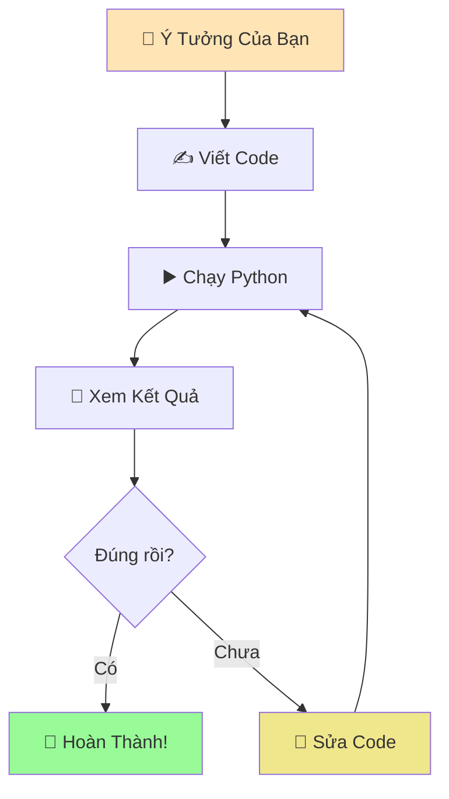
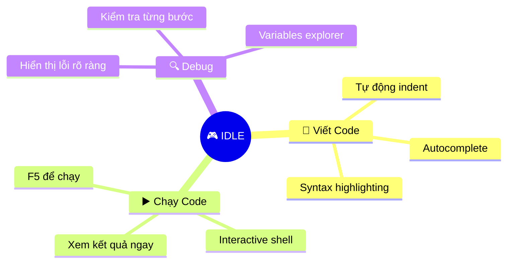
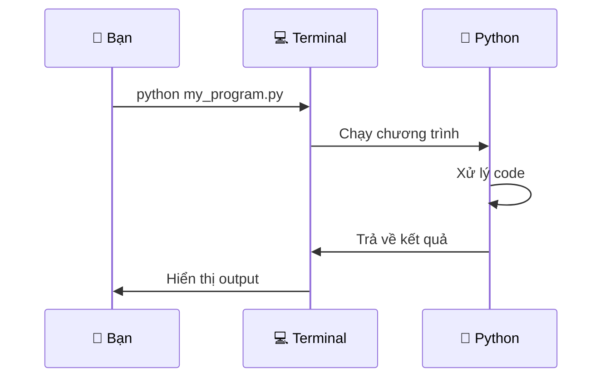
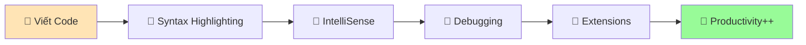
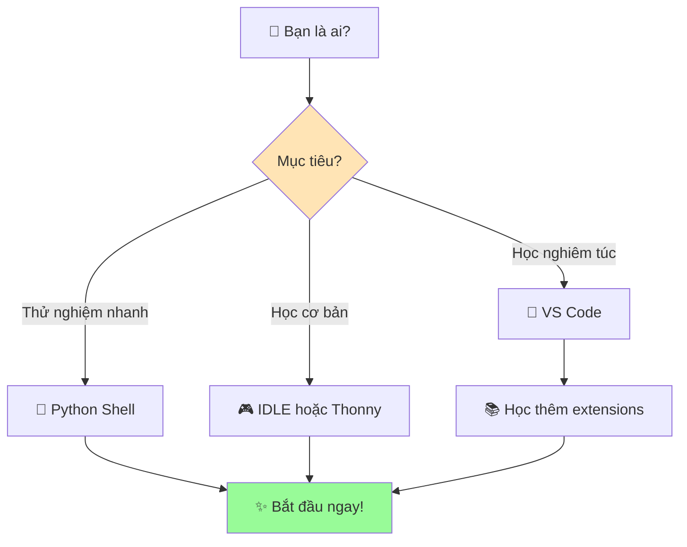

# 🏠 Môi Trường Python - Không Gian Làm Việc

:::tip 🏠 Ví Dụ Dễ Hiểu  
Giống như con rắn pet cần một môi trường sống phù hợp (chuồng, nhiệt độ, ánh sáng), Python cũng cần một "môi trường làm việc" để có thể hoạt động tốt nhất!
:::

## 🤔 Môi Trường Python Là Gì?

**Môi trường Python** là tất cả những công cụ và không gian mà bạn sử dụng để:
- ✍️ **Viết code Python**
- ▶️ **Chạy chương trình**  
- 🔍 **Kiểm tra kết quả**
- 🐛 **Sửa lỗi** (debugging)



## 🛠️ Các Cách Tương Tác Với Python

### 1. 🐍 **Python Interactive Shell** (Cách Nhanh Nhất)

#### Là Gì?
- Như **trò chuyện trực tiếp** với Python
- Gõ lệnh → Nhấn Enter → Thấy kết quả ngay
- Tuyệt vời để **thử nghiệm nhanh**

#### Cách Mở:
```bash
# Windows
python

# Mac/Linux
python3
```

#### Ví Dụ Sử Dụng:
```python
>>> print("Xin chào Python! 🐍")
Xin chào Python! 🐍

>>> 5 + 3
8

>>> ten_toi = "Minh"
>>> print(f"Tên tôi là {ten_toi}")
Tên tôi là Minh

>>> exit()  # Thoát khỏi Python shell
```

:::info 💡 Mẹo Hay
Dấu `>>>` có nghĩa là Python đang đợi bạn gõ lệnh. Đây không phải là phần bạn cần gõ!
:::

### 2. 🎮 **IDLE** (Python's Built-in Editor)

#### Là Gì?
- **I**ntegrated **D**evelopment and **L**earning **E**nvironment
- Như một **phòng học có đầy đủ tiện nghi** cho Python
- Có cả chỗ viết code VÀ chạy code

#### Cách Mở:
- **Windows**: Start Menu → IDLE
- **Mac**: Applications → Python 3.x → IDLE
- **Linux**: Terminal → `idle3`

#### Tính Năng Hay:


#### Ví Dụ Sử Dụng IDLE:
1. **File → New File** (tạo file mới)
2. Viết code:
```python
# File: xin_chao.py
print("🎉 Chào mừng đến với Python!")
ten = input("Tên bạn là gì? ")
print(f"Xin chào {ten}! Rất vui được gặp bạn! 😊")
```
3. **File → Save** (lưu file)
4. **Run → Run Module** (F5) để chạy

### 3. 💻 **Terminal/Command Prompt** (Cách Chuyên Nghiệp)

#### Là Gì?
- **Cửa sổ dòng lệnh** để giao tiếp với máy tính
- Như **nói chuyện trực tiếp** với hệ điều hành
- Chạy Python files từ bất kỳ đâu

#### Cách Sử Dụng:
```bash
# Chạy file Python
python ten_file.py

# Ví dụ cụ thể
python xin_chao.py

# Kiểm tra phiên bản Python
python --version

# Cài package mới
pip install requests
```

#### Workflow Cơ Bản:


### 4. 🚀 **Code Editors** (Khuyến Nghị)

#### Visual Studio Code (VS Code)


**Tính năng tuyệt vời**:
- **IntelliSense**: Gợi ý code thông minh
- **Debugging**: Tìm lỗi dễ dàng
- **Extensions**: Thêm tính năng không giới hạn
- **Git Integration**: Quản lý code chuyên nghiệp

#### Thonny (Cho Người Mới)
- 🎯 **Thiết kế cho người học Python**
- 🔍 **Variables viewer** - xem biến realtime
- 📊 **Step-by-step execution** - chạy từng bước
- 🎨 **Simple interface** - giao diện đơn giản

## 🎯 Chọn Môi Trường Phù Hợp

### 🔰 **Người Mới Bắt Đầu**


### 🚀 **Lộ Trình Phát Triển**

#### Tuần 1-2: Làm Quen
- **Python Shell**: Thử các lệnh cơ bản
- **IDLE**: Viết chương trình đầu tiên
- **Mục tiêu**: Thoải mái với syntax cơ bản

#### Tuần 3-4: Thành Thạo
- **IDLE/Thonny**: Viết chương trình phức tạp hơn
- **Terminal**: Học chạy file từ command line
- **Mục tiêu**: Tự tin viết và chạy code

#### Tháng 2+: Chuyên Nghiệp
- **VS Code/PyCharm**: Môi trường phát triển đầy đủ
- **Git**: Quản lý phiên bản code
- **Virtual Environments**: Quản lý dependencies
- **Mục tiêu**: Làm việc như developer thực thụ

## 🔧 Thiết Lập Workspace Tối Ưu

### 1. **Tổ Chức Thư Mục**
```
📁 python_projects/
├── 📁 hoc_co_ban/
│   ├── 📄 bai_1_xin_chao.py
│   ├── 📄 bai_2_bien_so.py
│   └── 📄 bai_3_tinh_toan.py
├── 📁 du_an/
│   ├── 📄 game_doan_so.py
│   └── 📄 may_tinh_ca_nhan.py
└── 📁 thu_nghiem/
    └── 📄 test_ideas.py
```

### 2. **Extensions Hữu Ích (VS Code)**
```python
# Cài đặt extensions quan trọng:
# 1. Python (Microsoft) - Core support
# 2. Python Docstring Generator - Tự động tạo documentation  
# 3. Python Indent - Auto indent thông minh
# 4. Code Runner - Chạy code nhanh
# 5. Python Type Hint - Type checking
```

### 3. **Cấu Hình Cơ Bản**
```json
// settings.json cho VS Code
{
    "python.defaultInterpreterPath": "python",
    "python.linting.enabled": true,
    "python.formatting.provider": "black",
    "editor.fontSize": 14,
    "editor.tabSize": 4,
    "files.autoSave": "afterDelay"
}
```

## 🎮 Thực Hành: Khám Phá Môi Trường

### Bài Tập 1: Python Shell
Mở Python shell và thử:
```python
>>> print("Tôi đang học Python! 🎉")
>>> import this  # The Zen of Python
>>> help(print)  # Xem hướng dẫn hàm print
>>> 2 ** 10     # 2 mũ 10
>>> "Python" * 3  # Lặp string
```

### Bài Tập 2: Tạo File Đầu Tiên
Tạo file `thong_tin_ca_nhan.py`:
```python
# File: thong_tin_ca_nhan.py
print("=== THÔNG TIN CÁ NHÂN ===")
print()

ten = input("Tên của bạn: ")
tuoi = input("Tuổi của bạn: ")
so_thich = input("Sở thích: ")

print()
print("=== GIỚI THIỆU ===")
print(f"Xin chào! Tôi là {ten}")
print(f"Tôi {tuoi} tuổi")
print(f"Tôi thích {so_thich}")
print()
print("Rất vui được làm quen! 😊")
```

### Bài Tập 3: So Sánh Môi Trường
Chạy cùng một chương trình trên:
1. Python Shell (copy-paste từng dòng)
2. IDLE (tạo file và F5)
3. Terminal (python filename.py)

**Nhận xét sự khác biệt!**

## 🆘 Xử Lý Sự Cố Thường Gặp

### ❌ **"Python not found"**
```bash
# Kiểm tra Python có được cài chưa
python --version
python3 --version

# Nếu không có, quay lại bài cài đặt
```

### ❌ **File không chạy được**
```bash
# Đảm bảo đang ở đúng thư mục
cd /path/to/your/file

# Chạy với đường dẫn đầy đủ
python C:\Users\YourName\Documents\my_program.py
```

### ❌ **IDLE không mở được**
- Windows: Cài lại Python với "tcl/tk and IDLE" checked
- Mac: Cài Python từ python.org thay vì Homebrew
- Linux: `sudo apt install idle3`

## 🚀 Sẵn Sàng Lập Trình!

:::success 🎊 Chúc Mừng!
Bạn đã hiểu rõ về môi trường Python! Giờ đây bạn biết cách:
- 🐍 Trò chuyện trực tiếp với Python
- 📝 Viết và lưu chương trình
- ▶️ Chạy code theo nhiều cách khác nhau
- 🔧 Chọn công cụ phù hợp với mình
:::

**Bước tiếp theo**:
1. 🐍 **[Tìm hiểu Python là gì](/python/basics/what-is-python)** - Hiểu sâu hơn về "con rắn"
2. 👋 **[Chương trình đầu tiên](/python/basics/first-program)** - Dạy Python nói "Xin chào!"
3. 📢 **[In tin nhắn](/python/basics/printing-messages)** - Dạy Python nói chuyện

:::tip 💡 Lời Khuyên
**Đừng lo lắng về việc nhớ tất cả!** Điều quan trọng là bạn biết có những công cụ nào và khi nào nên dùng. Kinh nghiệm sẽ giúp bạn chọn đúng công cụ cho từng tình huống!
:::

---

*🏠 **Ghi chú**: Môi trường làm việc tốt sẽ giúp bạn học Python hiệu quả hơn. Hãy dành thời gian làm quen với các công cụ - đây là khoản đầu tư rất đáng giá!*
