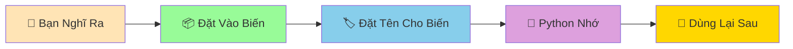

# 📦 Biến và Kiểu Dữ Liệu - Hộp Đựng Thông Tin Thông Minh

:::tip 📦 Ví Dụ Dễ Hiểu
Hãy tưởng tượng biến như những **chiếc hộp thông minh** có thể đựng các loại đồ khác nhau: hộp đựng số, hộp đựng chữ, hộp đựng đúng/sai... Mỗi loại hộp có cách sử dụng riêng!
:::

## 🤔 Biến Là Gì?

**Biến (Variable)** là cách để Python "nhớ" thông tin. Giống như bạn ghi tên lên một chiếc hộp để nhớ bên trong có gì vậy!



### 🎯 Tại Sao Cần Biến?

Không có biến, Python sẽ như một người **bị mất trí nhớ**:

```python
# ❌ Không dùng biến - Python không nhớ gì!
print(5 + 3)  # Tính xong rồi quên luôn
print(5 + 3)  # Phải tính lại từ đầu
print(5 + 3)  # Lại tính lại nữa... mệt quá!
```

```python
# ✅ Dùng biến - Python thông minh nhớ kết quả!
result = 5 + 3  # Python nhớ: "result = 8"
print(result)   # Lấy ra dùng
print(result)   # Lấy ra dùng lại
print(result)   # Dễ dàng!
```

## 🏷️ Cách Tạo Biến

Tạo biến trong Python **siêu đơn giản**:

```python
# Cú pháp: tên_biến = giá_trị
my_name = "Minh"    # tên tôi
my_age = 15         # tuổi tôi
my_height = 1.65    # cao tôi
```

### 📝 Quy Tắc Đặt Tên Biến

```python
# ✅ TÊN TỐT - Dễ hiểu, rõ ràng
full_name = "Nguyễn Văn An"  # họ tên
math_score = 9.5             # điểm toán
friend_count = 20            # số bạn bè

# ✅ CŨNG ĐƯỢC - Ngắn gọn nhưng rõ nghĩa  
name = "An"
age = 16
score = 95

# ❌ TÊN XẤU - Khó hiểu, không rõ nghĩa
x = "An"        # x là gì?
abc = 16        # abc nghĩa là gì?  
qwerty = 95     # Hoàn toàn không hiểu!
```

:::warning ⚠️ Lưu Ý Quan Trọng
- **Không được bắt đầu bằng số**: `1name` ❌, `name1` ✅
- **Không có dấu cách**: `ho ten` ❌, `ho_ten` ✅  
- **Phân biệt hoa thường**: `Name` và `name` là hai biến khác nhau!
- **Không dùng từ khóa Python**: `print`, `if`, `for` đều bị cấm!
:::

## 🎭 Các Kiểu Dữ Liệu Cơ Bản

Python có 4 loại "hộp" chính để đựng thông tin:

### 🔢 1. Số Nguyên (Integer - int)

Dùng để đựng **số không có phần thập phân**:

```python
# Số nguyên - như đếm kẹo, đếm bạn bè
candy_count = 25     # số kẹo
friend_count = 12    # số bạn bè
age = 15             # tuổi
exam_score = 10      # điểm thi

# Python tự biết đây là số nguyên!
print(type(candy_count))  # <class 'int'>
```

### 🎯 2. Số Thập Phân (Float)

Dùng để đựng **số có phần thập phân**:

```python
# Số thập phân - như cân nặng, chiều cao, điểm số
weight = 45.5           # cân nặng
height = 1.65           # chiều cao
average_score = 8.75    # điểm trung bình
bread_price = 15.5      # giá bánh mì

print(type(weight))  # <class 'float'>
```

### 📝 3. Chuỗi Ký Tự (String - str)

Dùng để đựng **chữ, từ, câu**:

```python
# Chuỗi - như tên, địa chỉ, tin nhắn
full_name = "Trần Thị Lan"              # họ tên
address = "Hà Nội, Việt Nam"            # địa chỉ
message = "Chào bạn! Hôm nay thế nào?"  # tin nhắn
favorite_food = "Phở bò"                # món ăn yêu thích

print(type(full_name))  # <class 'str'>
```

:::tip 💡 Mẹo Nhớ String
String phải được **bao quanh bởi dấu ngoặc kép** `"..."` hoặc ngoặc đơn `'...'`. Nếu không có ngoặc, Python sẽ nghĩ đó là tên biến!
:::

### ✅❌ 4. Đúng/Sai (Boolean - bool)

Dùng để đựng **câu trả lời đúng hoặc sai**:

```python
# Boolean - chỉ có 2 giá trị: True hoặc False
homework_done = True     # đã làm bài tập
had_breakfast = False    # đã ăn sáng
is_raining = True        # có mưa
out_of_money = False     # hết tiền

print(type(homework_done))  # <class 'bool'>
```

## 🔍 Kiểm Tra Kiểu Dữ Liệu

Sử dụng hàm `type()` để xem biến thuộc loại nào:

```python
# Tạo các biến khác nhau
name = "Python"      # tên
age = 30             # tuổi
height = 1.75        # cao
is_smart = True      # thông minh

# Kiểm tra kiểu dữ liệu
print("Kiểu của 'name':", type(name))         # <class 'str'>
print("Kiểu của 'age':", type(age))           # <class 'int'>
print("Kiểu của 'height':", type(height))     # <class 'float'>
print("Kiểu của 'is_smart':", type(is_smart)) # <class 'bool'>
```

## 🎪 Ví Dụ Thực Tế: Thông Tin Học Sinh

Hãy tạo một "hồ sơ học sinh" bằng các biến:

```python
# 📋 Thông tin cá nhân
full_name = "Nguyễn Minh An"        # họ tên
age = 14                            # tuổi
class_name = "9A"                   # lớp
school = "THCS Lê Quý Đôn"         # trường

# 📊 Thông tin học tập
math_score = 9.5        # điểm toán
physics_score = 8.0     # điểm lý
chemistry_score = 8.5   # điểm hóa
homework_submitted = True  # đã nộp bài tập

# 🏠 Thông tin gia đình
address = "123 Phố Huế, Hà Nội"  # địa chỉ
sibling_count = 2                 # số anh chị em
has_computer = True               # có máy tính

# 💰 Thông tin tài chính
savings = 500000      # tiền tiết kiệm
daily_allowance = 20.5  # tiền tiêu vặt

# In thông tin
print("=== HỒ SƠ HỌC SINH ===")
print(f"Tên: {full_name}")
print(f"Tuổi: {age}")
print(f"Lớp: {class_name}")
print(f"Điểm trung bình: {(math_score + physics_score + chemistry_score) / 3:.1f}")
print(f"Đã nộp bài tập: {homework_submitted}")
```

## 🔄 Thay Đổi Giá Trị Biến

Biến có thể **thay đổi giá trị** bất cứ lúc nào:

```python
# Ban đầu
exam_score = 7.5  # điểm thi
print("Điểm ban đầu:", exam_score)

# Thầy cô chấm lại, điểm tăng!
exam_score = 8.5
print("Điểm sau khi chấm lại:", exam_score)

# Có thể thay đổi cả kiểu dữ liệu (nhưng không nên!)
exam_score = "Chưa có điểm"  # Từ số thành chữ
print("Trạng thái mới:", exam_score)
```

## 🎯 Bài Tập Thực Hành

### 🥇 Bài Tập 1: Tự Giới Thiệu
Tạo các biến để lưu thông tin về bản thân bạn:

```python
# TODO: Điền thông tin của bạn vào đây
my_name = "..."             # Tên của bạn
my_age = ...                # Tuổi của bạn  
my_height = ...             # Chiều cao (mét)
favorite_subject = "..."    # Môn học yêu thích
like_programming = ...      # True hoặc False

# In ra màn hình
print(f"Xin chào! Tôi là {my_name}")
print(f"Tôi {my_age} tuổi, cao {my_height}m")
print(f"Tôi thích môn {favorite_subject}")
if like_programming:
    print("Và tôi yêu thích lập trình!")
```

### 🥈 Bài Tập 2: Cửa Hàng Nhỏ
Tạo biến để quản lý một cửa hàng bán kẹo:

```python
# Thông tin sản phẩm
product_name = "Kẹo dẻo gấu"    # tên sản phẩm
price_per_item = 2.5            # giá mỗi cái - 2.500 VNĐ
stock_quantity = 100            # số lượng tồn kho
is_bestseller = True            # sản phẩm bán chạy

# Thông tin bán hàng
sold_quantity = 15                                    # số lượng bán
revenue = sold_quantity * price_per_item              # doanh thu
remaining_stock = stock_quantity - sold_quantity      # số lượng còn lại

# In báo cáo
print("=== BÁO CÁO BÁN HÀNG ===")
print(f"Sản phẩm: {product_name}")
print(f"Đã bán: {sold_quantity} cái")
print(f"Doanh thu: {revenue:.1f} nghìn VNĐ")
print(f"Còn lại: {remaining_stock} cái")
```

### 🥉 Bài Tập 3: Kiểm Tra Kiểu Dữ Liệu
Tạo 5 biến khác nhau và in ra kiểu của chúng:

```python
# Tạo 5 biến với 5 kiểu dữ liệu khác nhau
var_1 = ...  # biến 1 - Số nguyên
var_2 = ...  # biến 2 - Số thập phân  
var_3 = ...  # biến 3 - Chuỗi
var_4 = ...  # biến 4 - Boolean
var_5 = ...  # biến 5 - Bất kỳ kiểu nào

# In kiểu dữ liệu
for i, variable in enumerate([var_1, var_2, var_3, var_4, var_5], 1):
    print(f"Biến {i}: {variable} - Kiểu: {type(variable)}")
```

## 🎊 Tóm Tắt

Trong bài này, bạn đã học được:

✅ **Biến là gì** - Hộp đựng thông tin thông minh  
✅ **Cách tạo biến** - `tên_biến = giá_trị`  
✅ **4 kiểu dữ liệu cơ bản**: int, float, str, bool  
✅ **Quy tắc đặt tên** - Rõ ràng, dễ hiểu  
✅ **Kiểm tra kiểu** - Dùng `type()`  
✅ **Thay đổi giá trị** - Biến có thể cập nhật  

## 🚀 Bước Tiếp Theo

Bây giờ bạn đã biết cách "dạy Python nhớ thông tin"! Tiếp theo, chúng ta sẽ học cách dạy Python **tính toán với những thông tin đó** trong bài [Phép Tính Cơ Bản](/python/basics/basic-math-operations).

:::tip 🎯 Thử Thách Nhỏ
Hãy thử tạo một "máy tính BMI" đơn giản bằng cách sử dụng biến để lưu cân nặng và chiều cao, rồi tính BMI = cân nặng / (chiều cao × chiều cao)!
:::

---

*🔗 **Bài tiếp theo**: [Phép Tính Cơ Bản - Dạy Python Làm Toán](/python/basics/basic-math-operations)*
