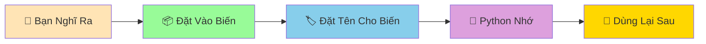

# 📦 Biến và Kiểu Dữ Liệu - Hộp Đựng Thông Tin Thông Minh

:::tip 📦 Ví Dụ Dễ Hiểu
Hãy tưởng tượng biến như những **chiếc hộp thông minh** có thể đựng các loại đồ khác nhau: hộp đựng số, hộp đựng chữ, hộp đựng đúng/sai... Mỗi loại hộp có cách sử dụng riêng!
:::

## 🤔 Biến Là Gì?

**Biến (Variable)** là cách để Python "nhớ" thông tin. Giống như bạn ghi tên lên một chiếc hộp để nhớ bên trong có gì vậy!



### 🎯 Tại Sao Cần Biến?

Không có biến, Python sẽ như một người **bị mất trí nhớ**:

```python
# ❌ Không dùng biến - Python không nhớ gì!
print(5 + 3)  # Tính xong rồi quên luôn
print(5 + 3)  # Phải tính lại từ đầu
print(5 + 3)  # Lại tính lại nữa... mệt quá!
```

```python
# ✅ Dùng biến - Python thông minh nhớ kết quả!
ket_qua = 5 + 3  # Python nhớ: "ket_qua = 8"
print(ket_qua)   # Lấy ra dùng
print(ket_qua)   # Lấy ra dùng lại
print(ket_qua)   # Dễ dàng!
```

## 🏷️ Cách Tạo Biến

Tạo biến trong Python **siêu đơn giản**:

```python
# Cú pháp: tên_biến = giá_trị
ten_toi = "Minh"
tuoi_toi = 15
cao_toi = 1.65
```

### 📝 Quy Tắc Đặt Tên Biến

```python
# ✅ TÊN TỐT - Dễ hiểu, rõ ràng
ho_ten = "Nguyễn Văn An"
diem_toan = 9.5
so_ban_be = 20

# ✅ CŨNG ĐƯỢC - Ngắn gọn nhưng rõ nghĩa  
name = "An"
age = 16
score = 95

# ❌ TÊN XẤU - Khó hiểu, không rõ nghĩa
x = "An"        # x là gì?
abc = 16        # abc nghĩa là gì?  
qwerty = 95     # Hoàn toàn không hiểu!
```

:::warning ⚠️ Lưu Ý Quan Trọng
- **Không được bắt đầu bằng số**: `1name` ❌, `name1` ✅
- **Không có dấu cách**: `ho ten` ❌, `ho_ten` ✅  
- **Phân biệt hoa thường**: `Name` và `name` là hai biến khác nhau!
- **Không dùng từ khóa Python**: `print`, `if`, `for` đều bị cấm!
:::

## 🎭 Các Kiểu Dữ Liệu Cơ Bản

Python có 4 loại "hộp" chính để đựng thông tin:

### 🔢 1. Số Nguyên (Integer - int)

Dùng để đựng **số không có phần thập phân**:

```python
# Số nguyên - như đếm kẹo, đếm bạn bè
so_keo = 25
so_ban_be = 12
tuoi = 15
diem_thi = 10

# Python tự biết đây là số nguyên!
print(type(so_keo))  # <class 'int'>
```

### 🎯 2. Số Thập Phân (Float)

Dùng để đựng **số có phần thập phân**:

```python
# Số thập phân - như cân nặng, chiều cao, điểm số
can_nang = 45.5
chieu_cao = 1.65
diem_trung_binh = 8.75
gia_banh_mi = 15.5

print(type(can_nang))  # <class 'float'>
```

### 📝 3. Chuỗi Ký Tự (String - str)

Dùng để đựng **chữ, từ, câu**:

```python
# Chuỗi - như tên, địa chỉ, tin nhắn
ho_ten = "Trần Thị Lan"
dia_chi = "Hà Nội, Việt Nam"
tin_nhan = "Chào bạn! Hôm nay thế nào?"
mon_an_yeu_thich = "Phở bò"

print(type(ho_ten))  # <class 'str'>
```

:::tip 💡 Mẹo Nhớ String
String phải được **bao quanh bởi dấu ngoặc kép** `"..."` hoặc ngoặc đơn `'...'`. Nếu không có ngoặc, Python sẽ nghĩ đó là tên biến!
:::

### ✅❌ 4. Đúng/Sai (Boolean - bool)

Dùng để đựng **câu trả lời đúng hoặc sai**:

```python
# Boolean - chỉ có 2 giá trị: True hoặc False
da_lam_bai_tap = True
da_an_sang = False
co_mua = True
het_tien = False

print(type(da_lam_bai_tap))  # <class 'bool'>
```

## 🔍 Kiểm Tra Kiểu Dữ Liệu

Sử dụng hàm `type()` để xem biến thuộc loại nào:

```python
# Tạo các biến khác nhau
ten = "Python"
tuoi = 30
cao = 1.75
thong_minh = True

# Kiểm tra kiểu dữ liệu
print("Kiểu của 'ten':", type(ten))           # <class 'str'>
print("Kiểu của 'tuoi':", type(tuoi))         # <class 'int'>
print("Kiểu của 'cao':", type(cao))           # <class 'float'>
print("Kiểu của 'thong_minh':", type(thong_minh))  # <class 'bool'>
```

## 🎪 Ví Dụ Thực Tế: Thông Tin Học Sinh

Hãy tạo một "hồ sơ học sinh" bằng các biến:

```python
# 📋 Thông tin cá nhân
ho_ten = "Nguyễn Minh An"
tuoi = 14
lop = "9A"
truong = "THCS Lê Quý Đôn"

# 📊 Thông tin học tập
diem_toan = 9.5
diem_ly = 8.0
diem_hoa = 8.5
da_nop_bai_tap = True

# 🏠 Thông tin gia đình
dia_chi = "123 Phố Huế, Hà Nội"
so_anh_chi_em = 2
co_may_tinh = True

# 💰 Thông tin tài chính
tien_tiet_kiem = 500000
tien_tieu_vat = 20.5

# In thông tin
print("=== HỒ SƠ HỌC SINH ===")
print(f"Tên: {ho_ten}")
print(f"Tuổi: {tuoi}")
print(f"Lớp: {lop}")
print(f"Điểm trung bình: {(diem_toan + diem_ly + diem_hoa) / 3:.1f}")
print(f"Đã nộp bài tập: {da_nop_bai_tap}")
```

## 🔄 Thay Đổi Giá Trị Biến

Biến có thể **thay đổi giá trị** bất cứ lúc nào:

```python
# Ban đầu
diem_thi = 7.5
print("Điểm ban đầu:", diem_thi)

# Thầy cô chấm lại, điểm tăng!
diem_thi = 8.5
print("Điểm sau khi chấm lại:", diem_thi)

# Có thể thay đổi cả kiểu dữ liệu (nhưng không nên!)
diem_thi = "Chưa có điểm"  # Từ số thành chữ
print("Trạng thái mới:", diem_thi)
```

## 🎯 Bài Tập Thực Hành

### 🥇 Bài Tập 1: Tự Giới Thiệu
Tạo các biến để lưu thông tin về bản thân bạn:

```python
# TODO: Điền thông tin của bạn vào đây
ten_toi = "..."          # Tên của bạn
tuoi_toi = ...           # Tuổi của bạn  
chieu_cao_toi = ...      # Chiều cao (mét)
mon_hoc_yeu_thich = "..." # Môn học yêu thích
co_thich_lap_trinh = ... # True hoặc False

# In ra màn hình
print(f"Xin chào! Tôi là {ten_toi}")
print(f"Tôi {tuoi_toi} tuổi, cao {chieu_cao_toi}m")
print(f"Tôi thích môn {mon_hoc_yeu_thich}")
if co_thich_lap_trinh:
    print("Và tôi yêu thích lập trình!")
```

### 🥈 Bài Tập 2: Cửa Hàng Nhỏ
Tạo biến để quản lý một cửa hàng bán kẹo:

```python
# Thông tin sản phẩm
ten_san_pham = "Kẹo dẻo gấu"
gia_moi_cai = 2.5        # 2.500 VNĐ
so_luong_ton_kho = 100
san_pham_ban_chay = True

# Thông tin bán hàng
so_luong_ban = 15
doanh_thu = so_luong_ban * gia_moi_cai
so_luong_con_lai = so_luong_ton_kho - so_luong_ban

# In báo cáo
print("=== BÁO CÁO BÁN HÀNG ===")
print(f"Sản phẩm: {ten_san_pham}")
print(f"Đã bán: {so_luong_ban} cái")
print(f"Doanh thu: {doanh_thu:.1f} nghìn VNĐ")
print(f"Còn lại: {so_luong_con_lai} cái")
```

### 🥉 Bài Tập 3: Kiểm Tra Kiểu Dữ Liệu
Tạo 5 biến khác nhau và in ra kiểu của chúng:

```python
# Tạo 5 biến với 5 kiểu dữ liệu khác nhau
bien_1 = ...  # Số nguyên
bien_2 = ...  # Số thập phân  
bien_3 = ...  # Chuỗi
bien_4 = ...  # Boolean
bien_5 = ...  # Bất kỳ kiểu nào

# In kiểu dữ liệu
for i, bien in enumerate([bien_1, bien_2, bien_3, bien_4, bien_5], 1):
    print(f"Biến {i}: {bien} - Kiểu: {type(bien)}")
```

## 🎊 Tóm Tắt

Trong bài này, bạn đã học được:

✅ **Biến là gì** - Hộp đựng thông tin thông minh  
✅ **Cách tạo biến** - `tên_biến = giá_trị`  
✅ **4 kiểu dữ liệu cơ bản**: int, float, str, bool  
✅ **Quy tắc đặt tên** - Rõ ràng, dễ hiểu  
✅ **Kiểm tra kiểu** - Dùng `type()`  
✅ **Thay đổi giá trị** - Biến có thể cập nhật  

## 🚀 Bước Tiếp Theo

Bây giờ bạn đã biết cách "dạy Python nhớ thông tin"! Tiếp theo, chúng ta sẽ học cách dạy Python **tính toán với những thông tin đó** trong bài [Phép Tính Cơ Bản](/python/basics/basic-math-operations).

:::tip 🎯 Thử Thách Nhỏ
Hãy thử tạo một "máy tính BMI" đơn giản bằng cách sử dụng biến để lưu cân nặng và chiều cao, rồi tính BMI = cân nặng / (chiều cao × chiều cao)!
:::

---

*🔗 **Bài tiếp theo**: [Phép Tính Cơ Bản - Dạy Python Làm Toán](/python/basics/basic-math-operations)*
