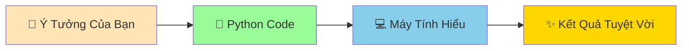
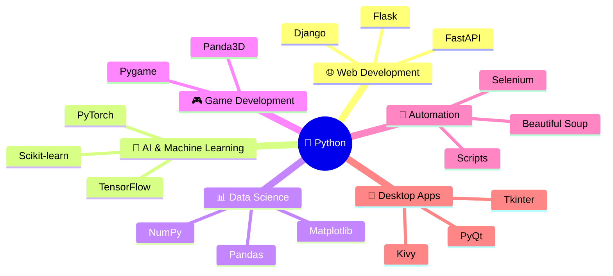
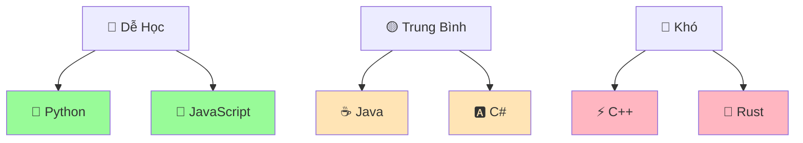
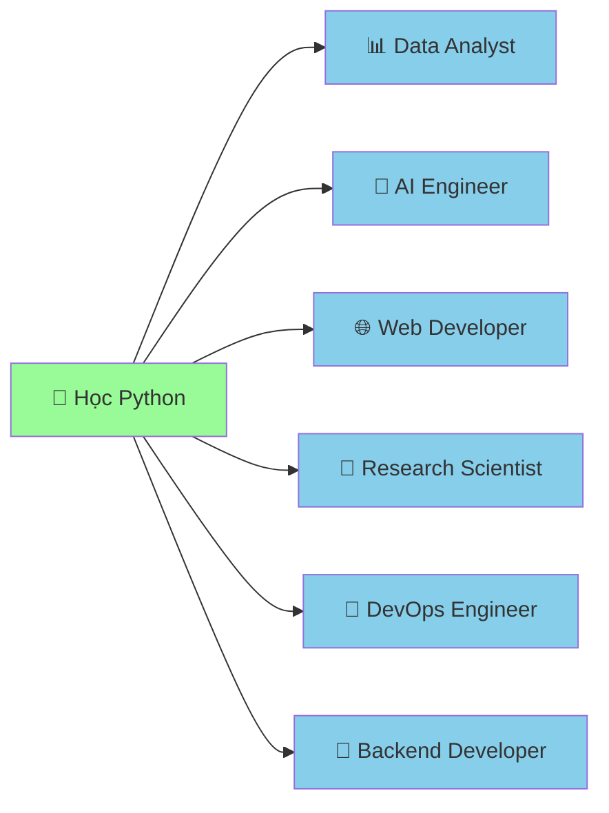

# 🐍 Python Là Gì? - Con Rắn Thông Minh Của Lập Trình

:::tip 🐍 Ví Dụ Dễ Hiểu
Hãy tưởng tượng Python như một **con rắn pet siêu thông minh** mà bạn có thể dạy nó làm bất cứ điều gì: tính toán, vẽ tranh, chơi game, thậm chí là nói chuyện với internet!
:::

## 🤔 Python Thực Sự Là Gì?

**Python** là một **ngôn ngữ lập trình** - tức là cách để con người "nói chuyện" với máy tính và ra lệnh cho máy tính làm việc.



### 🎭 Phép Ẩn Dụ: Python Như Con Rắn Pet

| Con Rắn Pet 🐍 | Python Programming 💻 |
|----------------|------------------------|
| **Thông minh** | Hiểu được ý của bạn dễ dàng |
| **Thân thiện** | Syntax dễ đọc, dễ học |
| **Đa năng** | Làm được nhiều việc khác nhau |
| **Không cắn** | Ít lỗi, dễ debug |
| **Dễ chăm sóc** | Không cần setup phức tạp |

## 📖 Câu Chuyện Tên "Python"

:::info 📺 Sự Thật Thú Vị
Python KHÔNG được đặt tên theo loài rắn! Tác giả Guido van Rossum đặt tên theo chương trình hài "Monty Python's Flying Circus" vì ông muốn tên ngắn gọn, độc đáo và hơi bí ẩn.
:::

Nhưng **biểu tượng con rắn** rất phù hợp vì:
- 🤝 **Thân thiện**: Python dễ học, không "cắn" người mới
- 🧠 **Thông minh**: Có thể giải quyết vấn đề phức tạp
- 🌈 **Linh hoạt**: Thích ứng với mọi loại dự án
- 🏃 **Nhanh nhẹn**: Code ít mà làm được nhiều việc

## 🌟 Tại Sao Python Tuyệt Vời?

### 1. 📖 **Dễ Đọc Như Tiếng Anh**

So sánh với ngôn ngữ khác:

```python
# Python - Dễ hiểu! 🐍
if age >= 18:
    print("Bạn đã trưởng thành!")
else:
    print("Bạn vẫn còn nhỏ!")
```

```java
// Java - Phức tạp hơn ☕
public class Main {
    public static void main(String[] args) {
        int age = 20;
        if (age >= 18) {
            System.out.println("Bạn đã trưởng thành!");
        } else {
            System.out.println("Bạn vẫn còn nhỏ!");
        }
    }
}
```

### 2. 🚀 **Làm Được Mọi Thứ**



### 3. 🌍 **Được Sử Dụng Rộng Rãi**

#### Các Công Ty Lớn Dùng Python:
- **🌐 Toàn Cầu**: Google, Instagram, Netflix, Spotify, Dropbox, YouTube
- **🇻🇳 Việt Nam**: VNG (Zalo, Zing), Tiki, Shopee Vietnam, FPT Software, Viettel

#### Tại Sao Họ Chọn Python?
- ⚡ **Phát triển nhanh**: Code ít mà hiệu quả cao
- 🔧 **Dễ bảo trì**: Code dễ đọc, dễ sửa
- 📚 **Thư viện phong phú**: Có sẵn tools cho mọi việc
- 👥 **Cộng đồng lớn**: Dễ tìm giúp đỡ và tài liệu

## 🎯 Python Có Thể Làm Gì?

### 🌐 **Web Development - Tạo Website**
```python
# Tạo website đơn giản với Flask
from flask import Flask
app = Flask(__name__)

@app.route('/')
def home():
    return "<h1>Chào mừng đến website của tôi! 🎉</h1>"

app.run()
```

### 🤖 **Artificial Intelligence - Trí Tuệ Nhân Tạo**
```python
# Chatbot đơn giản
import random

responses = [
    "Thật thú vị! Kể thêm đi! 🤔",
    "Tôi hiểu rồi! 💡", 
    "Wow, điều đó tuyệt quá! 🎉"
]

while True:
    user_input = input("Bạn: ")
    bot_reply = random.choice(responses)
    print(f"Bot: {bot_reply}")
```

### 📊 **Data Analysis - Phân Tích Dữ Liệu**
```python
# Phân tích điểm thi của lớp
import matplotlib.pyplot as plt

math_scores = [8, 9, 7, 10, 6, 8, 9, 7, 8, 9]
literature_scores = [7, 8, 9, 8, 7, 9, 8, 8, 7, 9]

plt.plot(math_scores, label='Toán')
plt.plot(literature_scores, label='Văn')
plt.legend()
plt.title('Điểm Thi Của Lớp 🎓')
plt.show()
```

### 🎮 **Game Development - Tạo Game**
```python
# Game đoán số
import random

secret_number = random.randint(1, 100)
print("🎮 Tôi đã nghĩ ra một số từ 1 đến 100!")

while True:
    guess = int(input("Đoán số: "))
    if guess == secret_number:
        print("🎉 Chính xác! Bạn thắng rồi!")
        break
    elif guess < secret_number:
        print("📈 Số của tôi lớn hơn!")
    else:
        print("📉 Số của tôi nhỏ hơn!")
```

### 🔧 **Automation - Tự Động Hóa**
```python
# Tự động gửi email chúc mừng sinh nhật
import smtplib
from datetime import date

def send_birthday_email(email, name):
    message = f"🎂 Chúc mừng sinh nhật {name}! 🎉"
    # Code gửi email...
    print(f"Đã gửi email đến {email}")

# Danh sách sinh nhật
birthday_today = ["minh@email.com", "lan@email.com"]
for email in birthday_today:
    send_birthday_email(email, "Bạn")
```

## 🏆 Python vs Các Ngôn Ngữ Khác

### 📊 So Sánh Độ Khó



### 🎯 Khi Nào Dùng Python?

| ✅ **Dùng Python Khi** | ❌ **Không Dùng Python Khi** |
|------------------------|------------------------------|
| Học lập trình lần đầu | Cần tốc độ cực cao (game 3D) |
| Phân tích dữ liệu | Lập trình nhúng (IoT nhỏ) |
| AI/Machine Learning | Mobile apps (Android/iOS) |
| Web development | System programming |
| Automation scripts | Real-time systems |
| Prototyping nhanh | Memory-critical applications |

## 🌈 Triết Lý Python - "The Zen of Python"

Gõ `import this` trong Python shell để xem:

```python
>>> import this
The Zen of Python, by Tim Peters

Beautiful is better than ugly.
Explicit is better than implicit.
Simple is better than complex.
...
```

**Dịch nghĩa quan trọng**:
- 🎨 **Đẹp hơn xấu** - Code phải dễ đọc
- 🔍 **Rõ ràng hơn ẩn ý** - Viết code dễ hiểu
- 🎯 **Đơn giản hơn phức tạp** - Giải pháp đơn giản nhất thường tốt nhất

## 🚀 Tương Lai Với Python

### 📈 **Xu Hướng Công Việc**



### 💰 **Mức Lương Trung Bình (Việt Nam 2024)**
- **Junior Python Developer**: 8-15 triệu VNĐ/tháng
- **Mid-level**: 15-25 triệu VNĐ/tháng  
- **Senior**: 25-40+ triệu VNĐ/tháng
- **AI/ML Engineer**: 20-50+ triệu VNĐ/tháng

## 🎮 Thực Hành: Khám Phá Python

### Bài Tập 1: Python Calculator
```python
# Máy tính Python đơn giản
print("🧮 Máy Tính Python")
print("Nhập hai số để tính toán:")

first_number = float(input("Số thứ nhất: "))
second_number = float(input("Số thứ hai: "))

print(f"\n📊 Kết quả:")
print(f"{first_number} + {second_number} = {first_number + second_number}")
print(f"{first_number} - {second_number} = {first_number - second_number}")
print(f"{first_number} × {second_number} = {first_number * second_number}")
if second_number != 0:
    print(f"{first_number} ÷ {second_number} = {first_number / second_number}")
```

### Bài Tập 2: Thông Tin Python
```python
# Tìm hiểu về Python version
import sys
import platform

print("🐍 THÔNG TIN PYTHON")
print("=" * 30)
print(f"Python Version: {sys.version}")
print(f"Platform: {platform.system()}")
print(f"Architecture: {platform.architecture()[0]}")
print("\n✨ Python đang chạy tuyệt vời!")
```

### Bài Tập 3: Python Modules
```python
# Khám phá các module có sẵn
import math
import random
import datetime

print("🔢 Toán học:")
print(f"π = {math.pi}")
print(f"√16 = {math.sqrt(16)}")

print("\n🎲 Ngẫu nhiên:")
print(f"Số ngẫu nhiên: {random.randint(1, 100)}")
print(f"Chọn màu: {random.choice(['đỏ', 'xanh', 'vàng'])}")

print("\n📅 Thời gian:")
print(f"Hôm nay: {datetime.date.today()}")
print(f"Giờ hiện tại: {datetime.datetime.now().strftime('%H:%M:%S')}")
```

## 🎊 Tóm Tắt: Tại Sao Chọn Python?

:::success 🌟 Python Là Lựa Chọn Tuyệt Vời Vì:
- 🎯 **Dễ học**: Syntax giống tiếng Anh tự nhiên
- 🚀 **Mạnh mẽ**: Làm được từ website đến AI
- 🌍 **Phổ biến**: Được dùng bởi các công ty lớn
- 👥 **Cộng đồng tốt**: Hàng triệu người sẵn sàng giúp đỡ
- 💼 **Cơ hội việc làm**: Nhu cầu cao, lương tốt
- 🔮 **Tương lai sáng**: Xu hướng AI, Data Science
:::

## 🚀 Sẵn Sàng Bắt Đầu!

Bây giờ bạn đã hiểu Python là gì, hãy bắt đầu "dạy con rắn thông minh" những kỹ năng đầu tiên:

1. 👋 **[Chương trình đầu tiên](/python/basics/first-program)** - Dạy Python nói "Xin chào!"
2. 📢 **[In tin nhắn](/python/basics/printing-messages)** - Dạy Python nói chuyện
3. 👂 **[Nhận thông tin](/python/basics/getting-input)** - Dạy Python lắng nghe

:::tip 💡 Lời Khuyên
**Đừng cố gắng nhớ tất cả mọi thứ!** Python có một triết lý: "Có một cách tốt nhất để làm mọi việc." Hãy tập trung vào việc hiểu logic và thực hành thường xuyên. Kiến thức sẽ đến một cách tự nhiên!
:::

---

*🐍 **Ghi chú**: Python không chỉ là một ngôn ngữ lập trình - nó là cánh cửa mở ra thế giới công nghệ vô tận. Chào mừng bạn đến với hành trình thú vị này!*
