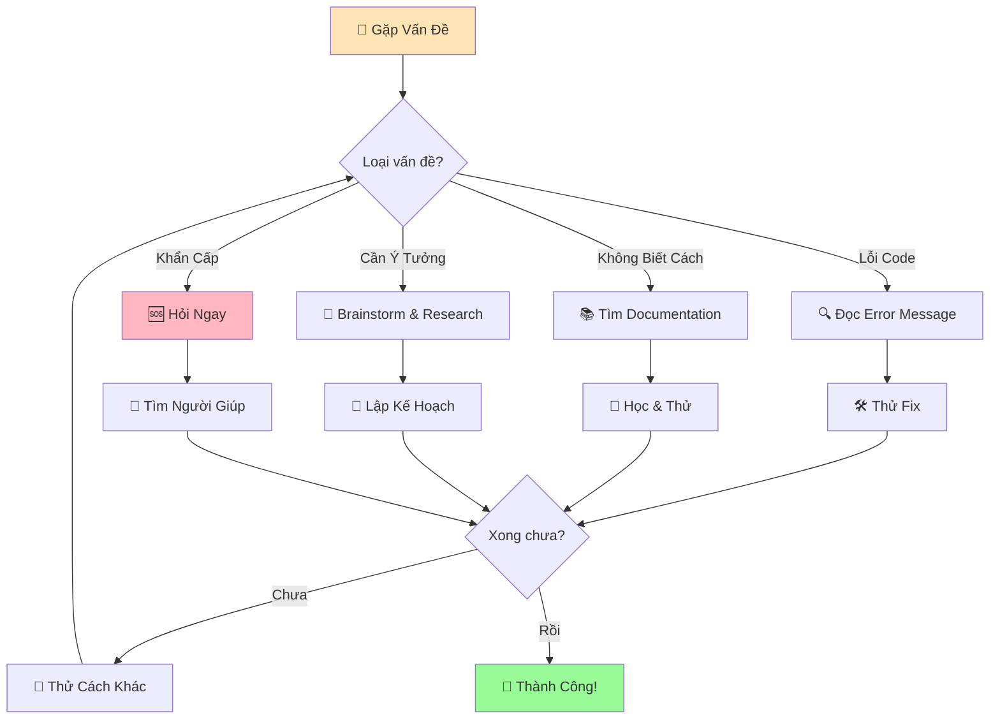
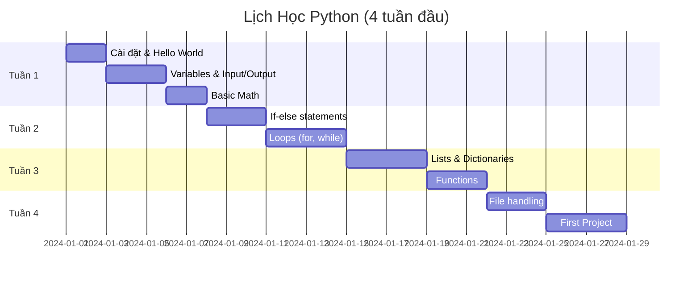
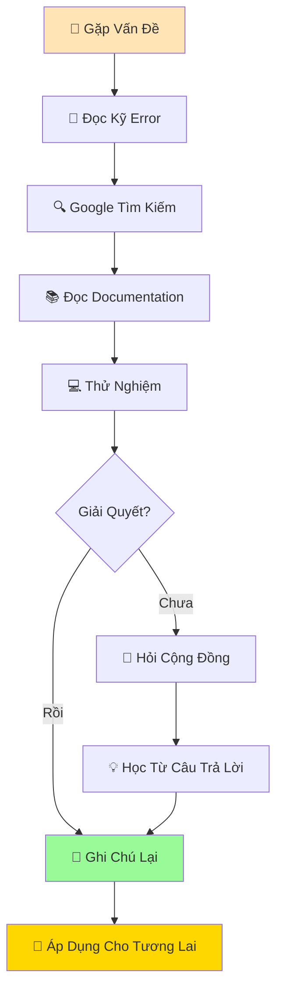

# 🆘 Trợ Giúp & Mẹo Hay Cho Python

:::tip 💡 Điều Quan Trọng Nhất
**Gặp lỗi là điều hoàn toàn bình thường!** Mỗi lập trình viên, kể cả những người có 20+ năm kinh nghiệm, vẫn gặp lỗi hàng ngày. Lỗi không phải là dấu hiệu bạn không giỏi - mà là cơ hội để học!
:::

## 🤔 Khi Nào Cần Tìm Giúp Đỡ?

### ✅ **Những Tình Huống Bình Thường**
- 🐛 **Gặp lỗi** không hiểu nghĩa là gì
- ❓ **Không biết** cách làm một việc gì đó
- 🔍 **Muốn học** cách tốt hơn để giải quyết vấn đề
- 💡 **Tò mò** về tính năng mới của Python
- 🎯 **Cần ý tưởng** cho dự án

### 🚨 **Khi Nào Cần Giúp Đỡ Ngay**
- 💻 **Python không chạy** được trên máy
- 🔥 **Code chạy mãi không dừng** (vòng lặp vô tận)
- 📁 **Mất file** code quan trọng
- 🔒 **Không vào được** môi trường Python



## 🔍 Hiểu Error Messages - "Lời Nói" Của Python

### 📖 Cách Đọc Error Message

Khi Python báo lỗi, nó thực sự đang **cố gắng giúp bạn**:

```python
# Code có lỗi
print("Hello World!)

# Error message
  File "test.py", line 1
    print("Hello World!)
                        ^
SyntaxError: EOL while scanning string literal
```

**Phân tích error message:**
1. **File "test.py", line 1** - Lỗi ở file nào, dòng nào
2. **Dấu mũi tên ^** - Chỉ chính xác vị trí lỗi
3. **SyntaxError** - Loại lỗi
4. **EOL while scanning string literal** - Mô tả cụ thể

### 🏷️ Các Loại Lỗi Thường Gặp

#### 1. **SyntaxError** - Lỗi Cú Pháp
```python
# ❌ Sai
print("Hello World!)  # Thiếu dấu ngoặc kép

# ✅ Đúng  
print("Hello World!")
```

#### 2. **NameError** - Lỗi Tên Biến/Hàm
```python
# ❌ Sai
Print("Hello")  # Viết hoa chữ P

# ✅ Đúng
print("Hello")  # Viết thường
```

#### 3. **IndentationError** - Lỗi Thụt Lề
```python
# ❌ Sai
print("Line 1")
    print("Line 2")  # Thụt lề không cần thiết

# ✅ Đúng
print("Line 1") 
print("Line 2")
```

#### 4. **TypeError** - Lỗi Kiểu Dữ Liệu
```python
# ❌ Sai
age = "20"
next_year = age + 1  # Không thể cộng string với số

# ✅ Đúng
age = 20  # Hoặc age = int("20")
next_year = age + 1
```

#### 5. **ValueError** - Lỗi Giá Trị
```python
# ❌ Sai
age = int("abc")  # Không thể chuyển "abc" thành số

# ✅ Đúng
age_str = input("Nhập tuổi: ")
if age_str.isdigit():
    age = int(age_str)
else:
    print("Vui lòng nhập số!")
```

## 🛠️ Kỹ Thuật Debug Cơ Bản

### 1. **Print Debugging** (Cách Đơn Giản Nhất)

```python
# Thêm print() để kiểm tra giá trị
def tinh_diem_trung_binh(diem_list):
    print(f"🔍 Debug: diem_list = {diem_list}")
    
    tong = sum(diem_list)
    print(f"🔍 Debug: tong = {tong}")
    
    so_luong = len(diem_list)
    print(f"🔍 Debug: so_luong = {so_luong}")
    
    trung_binh = tong / so_luong
    print(f"🔍 Debug: trung_binh = {trung_binh}")
    
    return trung_binh

# Test
diem = [8, 9, 7, 10]
ket_qua = tinh_diem_trung_binh(diem)
print(f"Điểm trung bình: {ket_qua}")
```

### 2. **Kiểm Tra Từng Bước**

```python
# Thay vì viết một lúc nhiều dòng:
# result = complicated_function(complex_calculation(user_input))

# Hãy chia nhỏ:
step1 = complex_calculation(user_input)
print(f"Bước 1: {step1}")

step2 = complicated_function(step1)  
print(f"Bước 2: {step2}")

result = step2
```

### 3. **Sử Dụng `type()` và `len()`**

```python
# Kiểm tra kiểu dữ liệu
data = "123"
print(f"Kiểu của data: {type(data)}")  # <class 'str'>
print(f"Giá trị: {data}")

# Kiểm tra độ dài
my_list = [1, 2, 3, 4, 5]
print(f"Độ dài list: {len(my_list)}")
print(f"Nội dung: {my_list}")
```

## 📚 Nơi Tìm Giúp Đỡ

### 🌐 **Tài Liệu Chính Thức**

#### Python Documentation
- **Link**: [docs.python.org](https://docs.python.org/3/)
- **Khi nào dùng**: Tìm hiểu chi tiết về functions, modules
- **Cách dùng**: Tìm kiếm tên function (vd: "python print function")

#### Built-in Help
```python
# Xem hướng dẫn function trong Python
help(print)
help(len)
help(input)

# Xem các method của object
my_string = "hello"
help(my_string)
```

### 🔍 **Công Cụ Tìm Kiếm**

#### Google Search Tips
```
# Format tìm kiếm hiệu quả:
"python [vấn đề của bạn] example"

# Ví dụ:
"python how to convert string to integer"
"python read file line by line"
"python SyntaxError missing parentheses"
```

#### Stack Overflow
- **Link**: [stackoverflow.com](https://stackoverflow.com)
- **Tip**: Thêm "python" vào đầu câu hỏi
- **Ví dụ**: "python how to remove duplicates from list"

### 👥 **Cộng Đồng Việt Nam**

#### Facebook Groups
- **Python Vietnam**: Cộng đồng Python lớn nhất VN
- **Học lập trình cùng nhau**: Group thân thiện với người mới
- **CodeGym Vietnam**: Học lập trình có hệ thống

#### Discord/Telegram
- **Python Vietnam Discord**: Chat realtime với developer
- **Học lập trình Telegram**: Hỏi đáp nhanh

#### Forums
- **Viblo.asia**: Blog và Q&A tiếng Việt
- **Daynhauhoc.com**: Forum học lập trình VN

## 💡 Mẹo Học Python Hiệu Quả

### 📅 **Lập Lịch Học Tập**



### 🎯 **Phương Pháp Học**

#### 1. **Pomodoro Technique**
- ⏰ **25 phút học** - tập trung 100%
- ☕ **5 phút nghỉ** - không nhìn màn hình
- 🔄 **Lặp lại 4 lần** - sau đó nghỉ dài 15-30 phút

#### 2. **Active Learning**
```python
# ❌ Passive: Chỉ đọc code
# ✅ Active: Gõ lại và thay đổi

# Ví dụ: Thấy code này
for i in range(5):
    print(f"Số {i}")

# Hãy thử:
# - Thay 5 thành 10
# - Thay "Số" thành "Count" 
# - Thêm emoji
# - In từ 1 đến 5 thay vì 0 đến 4
```

#### 3. **Explain to Others**
- 🗣️ **Giải thích** code cho bạn bè/gia đình
- 📝 **Viết blog** về những gì học được
- 🎥 **Quay video** demo dự án nhỏ
- 👥 **Tham gia** group thảo luận

### 📝 **Ghi Chú Hiệu Quả**

#### Template Ghi Chú
```python
"""
📖 CHỦĐỀ: [Tên chủ đề]
📅 NGÀY: [Ngày học]
🎯 MỤC TIÊU: [Học để làm gì]

💡 KIẾN THỨC CHÍNH:
- [Điểm quan trọng 1]
- [Điểm quan trọng 2]

🔧 CODE VÍ DỤ:
[Paste code ví dụ]

❗ LƯU Ý:
- [Điều cần nhớ]
- [Lỗi thường gặp]

🚀 BÀI TẬP:
- [ ] [Bài tập 1]
- [ ] [Bài tập 2]

🔗 TÀI LIỆU THAM KHẢO:
- [Link 1]
- [Link 2]
"""
```

## 🎮 Thực Hành: Debug Challenge

### Challenge 1: Tìm Và Sửa Lỗi

```python
# Code có 5 lỗi - hãy tìm và sửa!
Print("Chào mừng đến với Python!")
name = input("Tên bạn là gì? )
age = input("Bạn bao nhiêu tuổi? ")
next_age = age + 1
print(f"Năm sau bạn sẽ {next_age} tuổi, {name}!")
    print("Chúc bạn học Python vui vẻ!")
```

<details>
<summary>💡 Xem đáp án</summary>

```python
# ✅ Code đã sửa:
print("Chào mừng đến với Python!")  # print viết thường
name = input("Tên bạn là gì? ")  # Thêm dấu ngoặc kép đóng
age = int(input("Bạn bao nhiêu tuổi? "))  # Convert sang int
next_age = age + 1
print(f"Năm sau bạn sẽ {next_age} tuổi, {name}!")
print("Chúc bạn học Python vui vẻ!")  # Bỏ thụt lề
```

**Các lỗi:**
1. `Print` → `print` (viết thường)
2. Thiếu dấu `"` đóng trong input
3. `age` là string, cần `int()`
4. Thụt lề không cần thiết ở dòng cuối
</details>

### Challenge 2: Error Message Detective

Với mỗi error message, hãy đoán code gây ra lỗi:

```
1. SyntaxError: invalid syntax
   Có thể do: _______

2. NameError: name 'x' is not defined  
   Có thể do: _______

3. TypeError: can't multiply sequence by non-int
   Có thể do: _______
```

## 🌟 Mindset Học Lập Trình

### 💪 **Growth Mindset**

| ❌ **Fixed Mindset** | ✅ **Growth Mindset** |
|---------------------|----------------------|
| "Tôi không giỏi lập trình" | "Tôi chưa giỏi lập trình" |
| "Cái này quá khó" | "Cái này thách thức quá" |
| "Tôi không hiểu" | "Tôi chưa hiểu - cần học thêm" |
| "Mình ngu quá" | "Mình cần cách tiếp cận khác" |

### 🎯 **Mục Tiêu SMART**

```
S - Specific (Cụ thể): "Học Python cơ bản"
M - Measurable (Đo được): "Hoàn thành 20 bài tập"  
A - Achievable (Khả thi): "30 phút/ngày"
R - Relevant (Liên quan): "Để làm dự án web"
T - Time-bound (Có thời hạn): "Trong 2 tháng"
```

### 🔄 **Quy Trình Giải Quyết Vấn Đề**



## 🆘 Hotline Khẩn Cấp

### 🚨 **Khi Thực Sự Cần Giúp Ngay**

1. **🔥 Code chạy mãi không dừng**: `Ctrl + C` (Windows/Linux) hoặc `Cmd + C` (Mac)
2. **💻 IDLE/Editor đơ**: Force quit ứng dụng và mở lại
3. **📁 Mất file code**: Kiểm tra Recycle Bin/Trash, hoặc Recent Files
4. **🐍 Python không chạy**: Restart máy tính, cài lại Python

### 📞 **Liên Hệ Cộng Đồng**

```python
# Template hỏi hiệu quả
"""
🆘 CẦN GIÚP ĐỠ

📋 Vấn đề: [Mô tả ngắn gọn]
💻 Hệ điều hành: [Windows/Mac/Linux]  
🐍 Python version: [3.x.x]
📁 Editor: [IDLE/VS Code/etc]

🔧 Code gây lỗi:
```python
[paste code ở đây]
```

❌ Error message:
[paste error message]

🤔 Đã thử:
- [Cách 1 đã thử]
- [Cách 2 đã thử]

🎯 Mục tiêu: [Muốn code làm gì]
"""
```

## 🎊 Tóm Tắt

:::success 🌟 Những Điều Quan Trọng Nhất
- 🐛 **Lỗi là bạn**, không phải kẻ thù
- 🔍 **Đọc kỹ error message** - Python đang cố giúp bạn
- 🤝 **Đừng ngại hỏi** - cộng đồng Python rất thân thiện
- 💪 **Kiên nhẫn và thực hành** - mọi chuyên gia đều từng là người mới
- 📚 **Học từ mọi nguồn** - documentation, Google, cộng đồng
:::

### 🚀 **Bước Tiếp Theo:**

Bây giờ bạn đã có "bộ công cụ cứu hộ", hãy tiếp tục hành trình Python:

1. 📢 **[In tin nhắn](/python/basics/printing-messages)** - Dạy Python nói chuyện thành thạo
2. 👂 **[Nhận thông tin](/python/basics/getting-input)** - Dạy Python lắng nghe
3. 📦 **Biến số** - Dạy Python nhớ thông tin (sắp ra mắt!)

:::tip 🎯 Lời Nhắc Cuối
**Học lập trình là marathon, không phải sprint.** Hãy tận hưởng hành trình, ăn mừng những thành công nhỏ, và nhớ rằng mỗi lỗi bạn gặp đều giúp bạn trở thành developer giỏi hơn! 🌟
:::

---

*🆘 **Ghi nhớ**: Trang này sẽ luôn ở đây khi bạn cần. Hãy bookmark để dễ dàng quay lại khi gặp khó khăn!*
