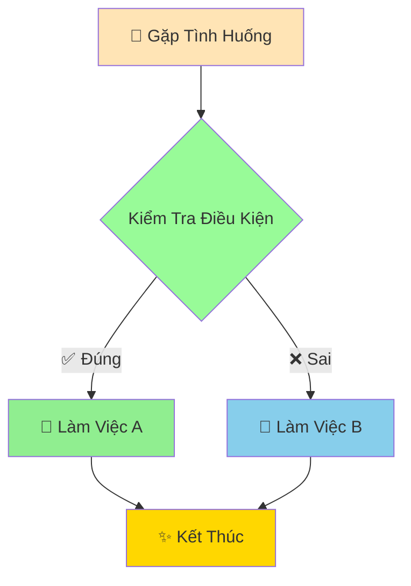

# 🤔 Câu Lệnh Điều Kiện - Dạy Python Đưa Ra Quyết Định

:::tip 🧠 Ví Dụ Dễ Hiểu
Hãy tưởng tượng Python như một **người bạn thông minh** có thể tự đưa ra quyết định! Giống như bạn suy nghĩ "**Nếu** trời mưa **thì** mang ô, **nếu không** thì đi bộ bình thường", Python cũng có thể suy nghĩ tương tự!
:::

## 🤔 Tại Sao Cần Điều Kiện?

Trong cuộc sống, chúng ta liên tục đưa ra quyết định:

- 🌧️ **Nếu** trời mưa **→** mang áo mưa
- 📚 **Nếu** điểm >= 8 **→** được khen thưởng  
- 🕐 **Nếu** muộn hơn 7h **→** đi xe buýt thay vì đi bộ
- 💰 **Nếu** có đủ tiền **→** mua kẹo, **nếu không** **→** tiết kiệm

Python cũng cần khả năng này để tạo ra những chương trình **thông minh và linh hoạt**!



## 🎯 Câu Lệnh IF Cơ Bản

### 📌 Cú Pháp Đơn Giản

```python
if điều_kiện:
    # Làm việc gì đó nếu điều kiện đúng
    print("Điều kiện đúng!")
```

### 🌟 Ví Dụ Thực Tế

```python
# Kiểm tra tuổi để vào rạp phim
tuoi = 16

if tuoi >= 13:
    print("Bạn được xem phim này!")
    print("Chúc bạn xem phim vui vẻ! 🍿")

# Kiểm tra điểm số
diem_thi = 8.5

if diem_thi >= 8.0:
    print("Chúc mừng! Bạn đạt loại Giỏi! 🏆")
    print("Tiếp tục phát huy nhé!")

# Kiểm tra thời tiết
co_mua = True

if co_mua:
    print("Hôm nay có mưa, nhớ mang ô! ☔")
    print("Đi học cẩn thận nhé!")
```

:::warning ⚠️ Lưu Ý Quan Trọng
- **Dấu hai chấm (:)** sau điều kiện là **BẮT BUỘC**
- **Thụt lề (indentation)** 4 khoảng trắng cho code bên trong
- Không có thụt lề = lỗi `IndentationError`!
:::

## 🔄 IF-ELSE - Hai Lựa Chọn

Khi bạn muốn có **2 hành động khác nhau**:

```python
tuoi = 12

if tuoi >= 18:
    print("Bạn đã trưởng thành! 🎓")
    print("Có thể tự quyết định nhiều việc")
else:
    print("Bạn vẫn còn trẻ! 👶")
    print("Hãy tận hưởng tuổi thơ nhé!")

print("Chương trình kết thúc")  # Dòng này luôn chạy
```

### 🎪 Ví Dụ: Máy Kiểm Tra Mật Khẩu

```python
mat_khau_dung = "python123"
mat_khau_nhap = input("Nhập mật khẩu: ")

if mat_khau_nhap == mat_khau_dung:
    print("✅ Đăng nhập thành công!")
    print("Chào mừng bạn đến với hệ thống!")
    print("Bạn có thể sử dụng tất cả tính năng.")
else:
    print("❌ Mật khẩu sai!")
    print("Vui lòng thử lại.")
    print("Gợi ý: Mật khẩu có chứa 'python'")
```

## 🎭 ELIF - Nhiều Lựa Chọn

Khi có **nhiều hơn 2 khả năng**:

```python
diem = 8.2

if diem >= 9.0:
    xep_loai = "Xuất Sắc"
    phan_thuong = "Học bổng 1 triệu"
elif diem >= 8.0:
    xep_loai = "Giỏi"  
    phan_thuong = "Giấy khen"
elif diem >= 6.5:
    xep_loai = "Khá"
    phan_thuong = "Lời khen"
elif diem >= 5.0:
    xep_loai = "Trung Bình"
    phan_thuong = "Khuyến khích"
else:
    xep_loai = "Yếu"
    phan_thuong = "Cần cố gắng hơn"

print(f"Điểm: {diem}")
print(f"Xếp loại: {xep_loai}")
print(f"Phần thưởng: {phan_thuong}")
```

## 🎯 Điều Kiện Phức Tạp

### 🔗 Kết Hợp Với AND/OR

```python
tuoi = 16
co_giay_the_thao = True
co_quan_ao_the_thao = False

# Cần CẢ HAI điều kiện
if tuoi >= 15 and co_giay_the_thao:
    print("✅ Có thể tham gia đội bóng!")
    
    # Kiểm tra thêm điều kiện con
    if co_quan_ao_the_thao:
        print("🎽 Đã có đồ đủ, sẵn sàng thi đấu!")
    else:
        print("👕 Cần mua thêm quần áo thể thao")
else:
    print("❌ Chưa đủ điều kiện tham gia")
    
    # Gợi ý cụ thể
    if tuoi < 15:
        print("   - Cần đợi thêm vài năm nữa")
    if not co_giay_the_thao:
        print("   - Cần mua giày thể thao")
```

### 🎮 Ví Dụ: Game Đoán Số

```python
import random

# Tạo số ngẫu nhiên từ 1-10
so_may_tinh = random.randint(1, 10)
so_ban_doan = int(input("Đoán một số từ 1-10: "))

print(f"Số máy tính: {so_may_tinh}")
print(f"Số bạn đoán: {so_ban_doan}")

if so_ban_doan == so_may_tinh:
    print("🎉 CHÍNH XÁC! Bạn đoán đúng rồi!")
    print("Bạn thật là may mắn!")
elif abs(so_ban_doan - so_may_tinh) == 1:
    print("😮 RẤT GẦN! Chỉ sai 1 số thôi!")
    print("Lần sau chắc chắn đúng!")
elif abs(so_ban_doan - so_may_tinh) <= 3:
    print("🤔 GẦN RỒI! Sai khoảng 2-3 số")
    print("Thử lại xem!")
else:
    print("😅 SAI KHÁ XA! Nhưng không sao")
    print("Luyện tập thêm nhé!")
```

## 🏠 Ví Dụ Thực Tế: Hệ Thống Quản Lý Học Sinh

```python
# 📋 Thông tin học sinh
ho_ten = "Nguyễn Văn An"
lop = "9A"
diem_toan = 8.5
diem_van = 7.0
diem_anh = 9.0
so_ngay_nghi = 2
co_vi_pham = False

# 🧮 Tính điểm trung bình
diem_tb = (diem_toan + diem_van + diem_anh) / 3

print("=== HỆ THỐNG QUẢN LÝ HỌC SINH ===")
print(f"Học sinh: {ho_ten} - Lớp {lop}")
print(f"Điểm TB: {diem_tb:.1f}")
print("-" * 40)

# 🏆 Xếp loại học lực
if diem_tb >= 8.5 and diem_toan >= 8.0 and diem_van >= 8.0 and diem_anh >= 8.0:
    hoc_luc = "XUẤT SẮC"
    mau_sac = "🥇"
elif diem_tb >= 8.0 and diem_toan >= 6.5 and diem_van >= 6.5 and diem_anh >= 6.5:
    hoc_luc = "GIỎI"
    mau_sac = "🥈"
elif diem_tb >= 6.5:
    hoc_luc = "KHÁ"
    mau_sac = "🥉"
elif diem_tb >= 5.0:
    hoc_luc = "TRUNG BÌNH"
    mau_sac = "📚"
else:
    hoc_luc = "YẾU"
    mau_sac = "📖"

# ✅ Xếp loại hạnh kiểm
if so_ngay_nghi <= 3 and not co_vi_pham:
    hanh_kiem = "TỐT"
elif so_ngay_nghi <= 7 and not co_vi_pham:
    hanh_kiem = "KHÁ"
else:
    hanh_kiem = "TB-YẾU"

# 🎯 Kết luận và khuyến nghị
print(f"Học lực: {mau_sac} {hoc_luc}")
print(f"Hạnh kiểm: {hanh_kiem}")

# 💡 Lời khuyên cụ thể
if hoc_luc == "XUẤT SẮC":
    print("\n🌟 XUẤT SẮC! Tiếp tục duy trì!")
    print("💡 Gợi ý: Hỗ trợ bạn bè học yếu hơn")
elif hoc_luc == "GIỎI":
    print("\n🎯 RẤT TỐT! Cố gắng thêm một chút!")
    print("💡 Gợi ý: Tập trung vào môn điểm thấp nhất")
elif hoc_luc == "KHÁ":
    print("\n📈 KHUYẾN KHÍCH! Bạn đang tiến bộ!")
    print("💡 Gợi ý: Dành thêm thời gian ôn tập")
else:
    print("\n💪 ĐỪNG NẢN LÒNG! Mọi chuyện sẽ tốt lên!")
    print("💡 Gợi ý: Tìm thầy cô hoặc bạn bè hỗ trợ")

# 📅 Lời nhắc về chuyên cần
if so_ngay_nghi > 5:
    print(f"\n⚠️  LƯU Ý: Bạn đã nghỉ {so_ngay_nghi} ngày")
    print("   Hãy cố gắng đi học đều đặn hơn!")
```

## 🎯 Bài Tập Thực Hành

### 🥇 Bài Tập 1: Máy Kiểm Tra Tuổi

```python
# TODO: Viết chương trình kiểm tra độ tuổi phù hợp cho các hoạt động

ten = input("Tên của bạn: ")
tuoi = int(input("Tuổi của bạn: "))

print(f"\nXin chào {ten}!")

# Kiểm tra các hoạt động theo tuổi
if tuoi >= 18:
    print("✅ Bạn có thể: Lái xe, bầu cử, làm việc full-time")
elif tuoi >= 16:
    print("✅ Bạn có thể: Làm việc part-time, học lái xe")
elif tuoi >= 13:
    print("✅ Bạn có thể: Tham gia mạng xã hội, xem phim 13+")
elif tuoi >= 6:
    print("✅ Bạn có thể: Đi học tiểu học, tham gia hoạt động trẻ em")
else:
    print("✅ Bạn có thể: Chơi đùa, học mầm non")

# Thêm lời khuyên
if tuoi < 18:
    print(f"📚 Hãy tận hưởng tuổi học trò! Còn {18 - tuoi} năm nữa là trưởng thành.")
```

### 🥈 Bài Tập 2: Tính Cước Taxi

```python
# TODO: Tính cước taxi theo quy định

# Quy định giá:
# - 2km đầu: 15,000đ/km
# - Từ km thứ 3-10: 12,000đ/km  
# - Từ km thứ 11 trở đi: 10,000đ/km
# - Phụ phí chờ đợi: 5,000đ/phút

khoang_cach = float(input("Quãng đường (km): "))
thoi_gian_cho = int(input("Thời gian chờ (phút): "))

# Tính cước theo km
if khoang_cach <= 2:
    cuoc_km = khoang_cach * 15000
elif khoang_cach <= 10:
    cuoc_km = 2 * 15000 + (khoang_cach - 2) * 12000
else:
    cuoc_km = 2 * 15000 + 8 * 12000 + (khoang_cach - 10) * 10000

# Tính phụ phí chờ
phi_cho = thoi_gian_cho * 5000

# Tổng cước
tong_cuoc = cuoc_km + phi_cho

print(f"\n=== HÓA ĐƠN TAXI ===")
print(f"Quãng đường: {khoang_cach} km")
print(f"Thời gian chờ: {thoi_gian_cho} phút")
print(f"Cước theo km: {cuoc_km:,} VNĐ")
print(f"Phí chờ đợi: {phi_cho:,} VNĐ")
print(f"TỔNG CỘNG: {tong_cuoc:,} VNĐ")
```

### 🥉 Bài Tập 3: Game Kéo Búa Bao

```python
import random

# TODO: Tạo game kéo búa bao với máy tính

print("🎮 GAME KÉO BÚA BAO")
print("1 = Kéo ✂️")
print("2 = Búa 🔨") 
print("3 = Bao 📄")

lua_chon_ban = int(input("Lựa chọn của bạn (1-3): "))
lua_chon_may = random.randint(1, 3)

# Chuyển số thành tên
choices = {1: "Kéo ✂️", 2: "Búa 🔨", 3: "Bao 📄"}

print(f"Bạn chọn: {choices[lua_chon_ban]}")
print(f"Máy chọn: {choices[lua_chon_may]}")

# Xác định kết quả
if lua_chon_ban == lua_chon_may:
    ket_qua = "HÒA! 🤝"
elif (lua_chon_ban == 1 and lua_chon_may == 3) or \
     (lua_chon_ban == 2 and lua_chon_may == 1) or \
     (lua_chon_ban == 3 and lua_chon_may == 2):
    ket_qua = "BẠN THẮNG! 🎉"
else:
    ket_qua = "BẠN THUA! 😅"

print(f"\nKết quả: {ket_qua}")

# Giải thích
if ket_qua == "BẠN THẮNG! 🎉":
    print("Chúc mừng! Bạn đã chiến thắng máy tính!")
elif ket_qua == "BẠN THUA! 😅":
    print("Đừng buồn! Thử lại lần nữa nhé!")
else:
    print("Cả hai đều giỏi như nhau!")
```

## 🎊 Tóm Tắt

Trong bài này, bạn đã học được:

✅ **IF cơ bản** - Thực hiện khi điều kiện đúng  
✅ **IF-ELSE** - Hai lựa chọn khác nhau  
✅ **ELIF** - Nhiều lựa chọn liên tiếp  
✅ **Điều kiện phức tạp** - Kết hợp AND/OR  
✅ **Ứng dụng thực tế** - Hệ thống quản lý, game, tính cước  

## 🚀 Bước Tiếp Theo

Tuyệt vời! Bây giờ Python đã biết **suy nghĩ và đưa ra quyết định** rồi! Tiếp theo, chúng ta sẽ dạy Python **lặp lại công việc** với [Vòng Lặp For](/python/intermediate/loops-for) - giúp Python làm việc mà không cần bạn lặp lại code!

:::tip 🎯 Thử Thách Nhỏ
Hãy thử tạo một "máy tính BMI thông minh" có thể đưa ra lời khuyên cụ thể dựa trên chỉ số BMI: thiếu cân (nhỏ hơn 18.5), bình thường (từ 18.5 đến 24.9), thừa cân (từ 25 đến 29.9), béo phì (lớn hơn hoặc bằng 30), và gợi ý cụ thể cho từng trường hợp!
:::

---

*🔗 **Bài tiếp theo**: [Vòng Lặp For - Dạy Python Lặp Lại Công Việc](/python/intermediate/loops-for)*
