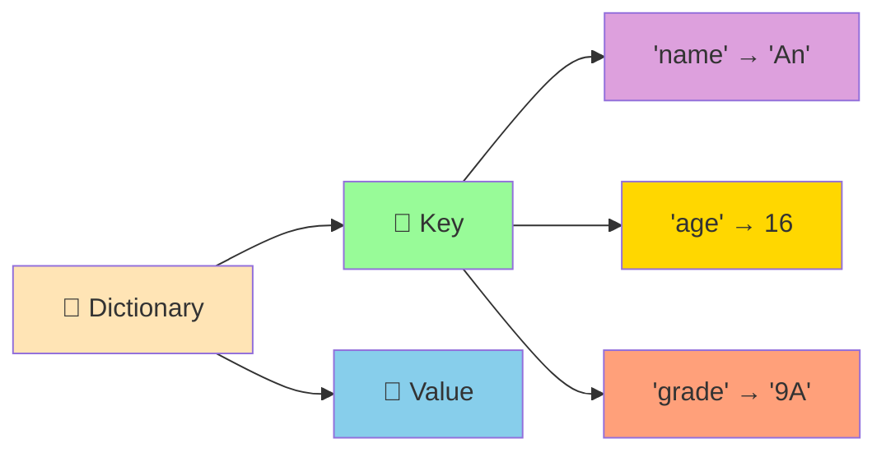

# 📖 Dictionaries - Cấu Trúc Key-Value Siêu Mạnh

:::tip 📖 Ví Dụ Dễ Hiểu
Hãy tưởng tượng Dictionary như một **cuốn từ điển thông minh**! Mỗi từ (key) có nghĩa (value) tương ứng. Bạn tra từ "apple" → nghĩa là "táo", tra "book" → nghĩa là "sách". Python cũng hoạt động tương tự!
:::

## 🤔 Dictionary Là Gì?

**Dictionary (Từ điển)** là cấu trúc dữ liệu lưu trữ thông tin theo cặp **key-value** (khóa-giá trị). Mỗi key là duy nhất và trỏ đến một value cụ thể.



### 🆚 So Sánh Với List

```python
# List - truy cập bằng index (số)
student_list = ["An", 16, "9A", 8.5]
name = student_list[0]      # "An"
age = student_list[1]       # 16

# Dictionary - truy cập bằng key (tên)
student_dict = {
    "name": "An",
    "age": 16,
    "class": "9A",
    "score": 8.5
}
name = student_dict["name"]      # "An"
age = student_dict["age"]        # 16
```

## 🎯 Tạo Dictionary

### 📌 Cách Tạo Cơ Bản

```python
# Từ điển rỗng
empty_dict = {}
empty_dict_2 = dict()

# Từ điển với dữ liệu
student_info = {
    "name": "Nguyễn Văn An",
    "age": 16,
    "class": "9A",
    "math_score": 8.5,
    "literature_score": 7.0,
    "english_score": 9.0,
    "can_swim": True
}

print("Thông tin học sinh:", student_info)
```

### 🎨 Các Kiểu Key và Value

```python
# Key có thể là string, number, tuple
# Value có thể là bất kỳ kiểu dữ liệu nào
diverse_dict = {
    # String keys
    "name": "Python",
    "version": "3.11",
    
    # Number keys
    1: "Một",
    2: "Hai",
    3: "Ba",
    
    # Tuple keys
    (1, 2): "Tọa độ",
    ("x", "y"): [10, 20],
    
    # Mixed values
    "hobbies": ["lập trình", "đọc sách", "chơi game"],
    "info": {
        "height": 1.65,
        "weight": 50.5
    },
    "is_graduated": False
}

print("Dictionary đa dạng:", diverse_dict)
```

## 🔍 Truy Cập Dữ Liệu

### 📖 Truy Cập Bằng Key

```python
student = {
    "name": "Trần Thị Lan",
    "age": 15,
    "class": "9B",
    "average_score": 8.2
}

# Truy cập trực tiếp
print("Tên:", student["name"])        # Trần Thị Lan
print("Tuổi:", student["age"])        # 15
print("Lớp:", student["class"])       # 9B

# Truy cập an toàn với get()
physics_score = student.get("physics_score", "Chưa có điểm")
print("Điểm Lý:", physics_score)      # Chưa có điểm

# Kiểm tra key có tồn tại
if "average_score" in student:
    print(f"Điểm TB: {student['average_score']}")
```

### 🔄 Lặp Qua Dictionary

```python
# Lặp qua keys
print("Các thông tin có sẵn:")
for key in student.keys():
    print(f"- {key}")

# Lặp qua values
print("\nCác giá trị:")
for value in student.values():
    print(f"- {value}")

# Lặp qua cả key và value
print("\nThông tin chi tiết:")
for key, value in student.items():
    print(f"{key}: {value}")
```

## ✏️ Thay Đổi Dữ Liệu

### ➕ Thêm Key-Value Mới

```python
student = {"name": "An", "age": 16}

# Thêm thông tin mới
student["class"] = "9A"
student["math_score"] = 8.5
student["hobbies"] = ["lập trình", "đọc sách"]

print("Sau khi thêm:", student)
```

### 🔄 Cập Nhật Giá Trị

```python
# Cập nhật giá trị hiện có
student["age"] = 17  # Tăng tuổi
student["math_score"] = 9.0  # Cải thiện điểm

# Cập nhật nhiều giá trị cùng lúc
student.update({
    "literature_score": 8.0,
    "english_score": 7.5,
    "class": "10A"  # Lên lớp
})

print("Sau khi cập nhật:", student)
```

### ❌ Xóa Dữ Liệu

```python
# Xóa bằng del
del student["hobbies"]
print("Sau khi xóa hobbies:", student)

# Xóa bằng pop() - trả về giá trị
english_score = student.pop("english_score", "Không có")
print(f"Điểm Anh đã xóa: {english_score}")

# Xóa tất cả
student.clear()
print("Sau khi xóa tất cả:", student)  # {}
```

## 🎪 Ví Dụ Thực Tế: Hệ Thống Quản Lý Học Sinh

```python
# 📚 Hệ thống quản lý học sinh với Dictionary
class StudentManager:
    def __init__(self):
        self.student_list = {}
        self.student_count = 0
    
    def add_student(self, name, age, class_name):
        """Thêm học sinh mới"""
        self.student_count += 1
        student_id = f"HS{self.student_count:03d}"
        
        self.student_list[student_id] = {
            "name": name,
            "age": age,
            "class": class_name,
            "scores": {},
            "enrollment_date": "2024-09-01",
            "status": "Đang học"
        }
        
        print(f"✅ Đã thêm học sinh: {name} (Mã: {student_id})")
        return student_id
    
    def update_score(self, student_id, subject, score):
        """Cập nhật điểm cho học sinh"""
        if student_id in self.student_list:
            self.student_list[student_id]["scores"][subject] = score
            name = self.student_list[student_id]["name"]
            print(f"📊 Đã cập nhật điểm {subject}: {score} cho {name}")
        else:
            print(f"❌ Không tìm thấy học sinh với mã: {student_id}")
    
    def calculate_average_score(self, student_id):
        """Tính điểm trung bình"""
        if student_id not in self.student_list:
            return None
        
        scores_dict = self.student_list[student_id]["scores"]
        if not scores_dict:
            return 0
        
        return sum(scores_dict.values()) / len(scores_dict)
    
    def classify_student(self, student_id):
        """Xếp loại học sinh"""
        average_score = self.calculate_average_score(student_id)
        if average_score is None:
            return "Không có dữ liệu"
        
        if average_score >= 8.5:
            return "Giỏi"
        elif average_score >= 8.0:
            return "Khá"
        elif average_score >= 6.5:
            return "Trung bình"
        else:
            return "Yếu"
    
    def find_student_by_name(self, name):
        """Tìm học sinh theo tên"""
        results = []
        for student_id, student_info in self.student_list.items():
            if name.lower() in student_info["name"].lower():
                results.append((student_id, student_info))
        
        return results
    
    def class_statistics(self, class_name):
        """Thống kê theo lớp"""
        class_students = []
        for student_id, student_info in self.student_list.items():
            if student_info["class"] == class_name:
                class_students.append((student_id, student_info))
        
        if not class_students:
            print(f"❌ Không có học sinh nào trong lớp {class_name}")
            return
        
        print(f"\n📊 THỐNG KÊ LỚP {class_name}")
        print("=" * 50)
        print(f"{'Mã HS':<8} {'Tên':<20} {'Tuổi':<6} {'Điểm TB':<8} {'Xếp loại'}")
        print("-" * 50)
        
        for student_id, student_info in class_students:
            average_score = self.calculate_average_score(student_id)
            classification = self.classify_student(student_id)
            print(f"{student_id:<8} {student_info['name']:<20} {student_info['age']:<6} {average_score:<8.1f} {classification}")
    
    def show_student_details(self, student_id):
        """Hiển thị thông tin chi tiết"""
        if student_id not in self.student_list:
            print(f"❌ Không tìm thấy học sinh với mã: {student_id}")
            return
        
        student_info = self.student_list[student_id]
        average_score = self.calculate_average_score(student_id)
        classification = self.classify_student(student_id)
        
        print(f"\n📋 THÔNG TIN CHI TIẾT - {student_id}")
        print("=" * 40)
        print(f"👤 Tên: {student_info['name']}")
        print(f"🎂 Tuổi: {student_info['age']}")
        print(f"🏫 Lớp: {student_info['class']}")
        print(f"📅 Ngày nhập học: {student_info['enrollment_date']}")
        print(f"📊 Điểm trung bình: {average_score:.1f}")
        print(f"🏆 Xếp loại: {classification}")
        
        if student_info["scores"]:
            print(f"\n📚 CHI TIẾT ĐIỂM SỐ:")
            for subject, score in student_info["scores"].items():
                print(f"   {subject}: {score}")
        else:
            print("\n📚 Chưa có điểm số")

# Sử dụng hệ thống
manager = StudentManager()

# Thêm học sinh
student_id_an = manager.add_student("Nguyễn Văn An", 16, "9A")
student_id_binh = manager.add_student("Trần Thị Bình", 15, "9A")
student_id_chau = manager.add_student("Lê Văn Châu", 16, "9B")

# Cập nhật điểm
manager.update_score(student_id_an, "Toán", 8.5)
manager.update_score(student_id_an, "Văn", 7.0)
manager.update_score(student_id_an, "Anh", 9.0)

manager.update_score(student_id_binh, "Toán", 9.0)
manager.update_score(student_id_binh, "Văn", 8.5)
manager.update_score(student_id_binh, "Anh", 8.0)

manager.update_score(student_id_chau, "Toán", 7.5)
manager.update_score(student_id_chau, "Văn", 6.5)
manager.update_score(student_id_chau, "Anh", 7.0)

# Hiển thị thông tin
manager.show_student_details(student_id_an)
manager.class_statistics("9A")

# Tìm kiếm
search_results = manager.find_student_by_name("An")
print(f"\n🔍 Tìm thấy {len(search_results)} học sinh tên 'An'")
```

## 🎯 Bài Tập Thực Hành

### 🥇 Bài Tập 1: Từ Điển Tiếng Anh

```python
# TODO: Tạo từ điển tiếng Anh đơn giản
english_vietnamese_dict = {
    "hello": "xin chào",
    "goodbye": "tạm biệt",
    "thank you": "cảm ơn",
    "please": "làm ơn",
    "sorry": "xin lỗi",
    "yes": "có",
    "no": "không",
    "water": "nước",
    "food": "thức ăn",
    "book": "sách",
    "computer": "máy tính",
    "python": "con rắn",
    "programming": "lập trình",
    "student": "học sinh",
    "teacher": "giáo viên"
}

def lookup_word(word_to_search):
    """Tra từ trong từ điển"""
    word_lower = word_to_search.lower()
    
    if word_lower in english_vietnamese_dict:
        return english_vietnamese_dict[word_lower]
    else:
        # Tìm từ gần giống
        similar_words = []
        for english_word in english_vietnamese_dict.keys():
            if word_lower in english_word or english_word in word_lower:
                similar_words.append(english_word)
        
        if similar_words:
            return f"Không tìm thấy '{word_to_search}'. Có thể bạn muốn: {', '.join(similar_words)}"
        else:
            return f"Không tìm thấy '{word_to_search}' trong từ điển"

def add_new_word(english_word, vietnamese_word):
    """Thêm từ mới vào từ điển"""
    english_vietnamese_dict[english_word.lower()] = vietnamese_word
    print(f"✅ Đã thêm: {english_word} → {vietnamese_word}")

def show_all_words():
    """Hiển thị tất cả từ trong từ điển"""
    print("\n📖 TỪ ĐIỂN ANH-VIỆT")
    print("=" * 40)
    
    # Sắp xếp theo alphabet
    sorted_words = sorted(english_vietnamese_dict.items())
    
    for english_word, vietnamese_word in sorted_words:
        print(f"{english_word:<15} → {vietnamese_word}")

# Menu chính
while True:
    print("\n📚 TỪ ĐIỂN TIẾNG ANH")
    print("1. Tra từ")
    print("2. Thêm từ mới")
    print("3. Xem tất cả từ")
    print("4. Thoát")
    
    choice = input("👉 Chọn chức năng (1-4): ")
    
    if choice == "1":
        word_to_search = input("Nhập từ tiếng Anh cần tra: ")
        result = lookup_word(word_to_search)
        print(f"📖 {result}")
    
    elif choice == "2":
        english_word = input("Nhập từ tiếng Anh: ")
        vietnamese_word = input("Nhập nghĩa tiếng Việt: ")
        add_new_word(english_word, vietnamese_word)
    
    elif choice == "3":
        show_all_words()
    
    elif choice == "4":
        print("👋 Cảm ơn bạn đã sử dụng từ điển!")
        break
    
    else:
        print("❌ Lựa chọn không hợp lệ!")
```

### 🥈 Bài Tập 2: Quản Lý Kho Hàng

```python
# TODO: Tạo hệ thống quản lý kho hàng
class WarehouseManager:
    def __init__(self):
        self.inventory = {}
        self.transaction_history = []
    
    def add_product(self, product_id, product_name, price, quantity):
        """Thêm sản phẩm mới vào kho"""
        if product_id in self.inventory:
            print(f"⚠️  Sản phẩm {product_id} đã tồn tại!")
            return
        
        self.inventory[product_id] = {
            "name": product_name,
            "price": price,
            "quantity": quantity,
            "date_added": "2024-09-01"
        }
        
        self.transaction_history.append({
            "date": "2024-09-01",
            "type": "NHẬP",
            "product_id": product_id,
            "quantity": quantity,
            "note": f"Thêm sản phẩm mới: {product_name}"
        })
        
        print(f"✅ Đã thêm sản phẩm: {product_name} (Mã: {product_id})")
    
    def stock_in(self, product_id, quantity):
        """Nhập thêm hàng vào kho"""
        if product_id not in self.inventory:
            print(f"❌ Không tìm thấy sản phẩm {product_id}")
            return
        
        self.inventory[product_id]["quantity"] += quantity
        
        self.transaction_history.append({
            "date": "2024-09-01",
            "type": "NHẬP",
            "product_id": product_id,
            "quantity": quantity,
            "note": f"Nhập thêm {quantity} {self.inventory[product_id]['name']}"
        })
        
        print(f"📦 Đã nhập {quantity} {self.inventory[product_id]['name']}")
    
    def stock_out(self, product_id, quantity):
        """Xuất hàng khỏi kho"""
        if product_id not in self.inventory:
            print(f"❌ Không tìm thấy sản phẩm {product_id}")
            return
        
        if self.inventory[product_id]["quantity"] < quantity:
            print(f"❌ Không đủ hàng! Chỉ còn {self.inventory[product_id]['quantity']}")
            return
        
        self.inventory[product_id]["quantity"] -= quantity
        
        self.transaction_history.append({
            "date": "2024-09-01",
            "type": "XUẤT",
            "product_id": product_id,
            "quantity": quantity,
            "note": f"Xuất {quantity} {self.inventory[product_id]['name']}"
        })
        
        print(f"📤 Đã xuất {quantity} {self.inventory[product_id]['name']}")
    
    def display_inventory(self):
        """Hiển thị tình trạng kho"""
        if not self.inventory:
            print("📦 Kho trống")
            return
        
        print("\n📦 TÌNH TRẠNG KHO HÀNG")
        print("=" * 70)
        print(f"{'Mã SP':<8} {'Tên sản phẩm':<20} {'Giá':<10} {'Số lượng':<10} {'Tổng giá trị'}")
        print("-" * 70)
        
        total_value = 0
        for product_id, product_info in self.inventory.items():
            item_value = product_info["price"] * product_info["quantity"]
            total_value += item_value
            
            print(f"{product_id:<8} {product_info['name']:<20} {product_info['price']:<10,} {product_info['quantity']:<10} {item_value:<10,}")
        
        print("-" * 70)
        print(f"💰 TỔNG GIÁ TRỊ KHO: {total_value:,} VNĐ")
    
    def search_product(self, keyword):
        """Tìm sản phẩm theo từ khóa"""
        results = []
        keyword_lower = keyword.lower()
        
        for product_id, product_info in self.inventory.items():
            if (keyword_lower in product_id.lower() or 
                keyword_lower in product_info["name"].lower()):
                results.append((product_id, product_info))
        
        if results:
            print(f"\n🔍 Tìm thấy {len(results)} sản phẩm:")
            for product_id, product_info in results:
                print(f"   {product_id}: {product_info['name']} - {product_info['quantity']} cái")
        else:
            print(f"😅 Không tìm thấy sản phẩm nào chứa '{keyword}'")
    
    def low_stock_report(self, threshold=10):
        """Báo cáo sản phẩm sắp hết hàng"""
        low_stock_products = []
        
        for product_id, product_info in self.inventory.items():
            if product_info["quantity"] <= threshold:
                low_stock_products.append((product_id, product_info))
        
        if low_stock_products:
            print(f"\n⚠️  CẢNH BÁO: {len(low_stock_products)} sản phẩm sắp hết hàng (≤{threshold}):")
            for product_id, product_info in low_stock_products:
                print(f"   {product_id}: {product_info['name']} - Còn {product_info['quantity']} cái")
        else:
            print(f"✅ Tất cả sản phẩm đều đủ hàng (> {threshold})")

# Sử dụng hệ thống quản lý kho
warehouse = WarehouseManager()

# Thêm sản phẩm
warehouse.add_product("SP001", "Laptop Dell", 15000000, 5)
warehouse.add_product("SP002", "Mouse Logitech", 500000, 20)
warehouse.add_product("SP003", "Keyboard Mechanical", 1200000, 8)
warehouse.add_product("SP004", "Monitor 24 inch", 4000000, 3)

# Nhập thêm hàng
warehouse.stock_in("SP001", 3)
warehouse.stock_in("SP002", 10)

# Xuất hàng
warehouse.stock_out("SP001", 2)
warehouse.stock_out("SP003", 5)

# Hiển thị kho
warehouse.display_inventory()

# Tìm kiếm
warehouse.search_product("Laptop")

# Báo cáo tồn kho thấp
warehouse.low_stock_report(5)
```

## 🎊 Tóm Tắt

Trong bài này, bạn đã học được:

✅ **Tạo dictionary** - `{}`, `dict()`  
✅ **Truy cập dữ liệu** - `dict[key]`, `get()`  
✅ **Thay đổi dữ liệu** - Thêm, cập nhật, xóa  
✅ **Lặp qua dictionary** - `keys()`, `values()`, `items()`  
✅ **Ứng dụng thực tế** - Quản lý học sinh, từ điển, kho hàng  
✅ **So sánh với list** - Khi nào dùng dictionary vs list  

## 🚀 Bước Tiếp Theo

Tuyệt vời! Bây giờ bạn đã thành thạo **cấu trúc key-value** mạnh mẽ! Tiếp theo, chúng ta sẽ học về [Functions Basics](/python/intermediate/functions-basics) - cách tạo ra những **"công thức" có thể tái sử dụng**!

:::tip 🎯 Thử Thách Nhỏ
Hãy thử tạo một "hệ thống quản lý thư viện sách" sử dụng dictionary! Mỗi sách có mã, tên, tác giả, thể loại, trạng thái (có sẵn/đã mượn), người mượn. Cho phép mượn, trả, tìm kiếm, và thống kê!
:::

---

*🔗 **Bài tiếp theo**: [Functions Basics - Tạo Công Thức Có Thể Tái Sử Dụng](/python/intermediate/functions-basics)*
