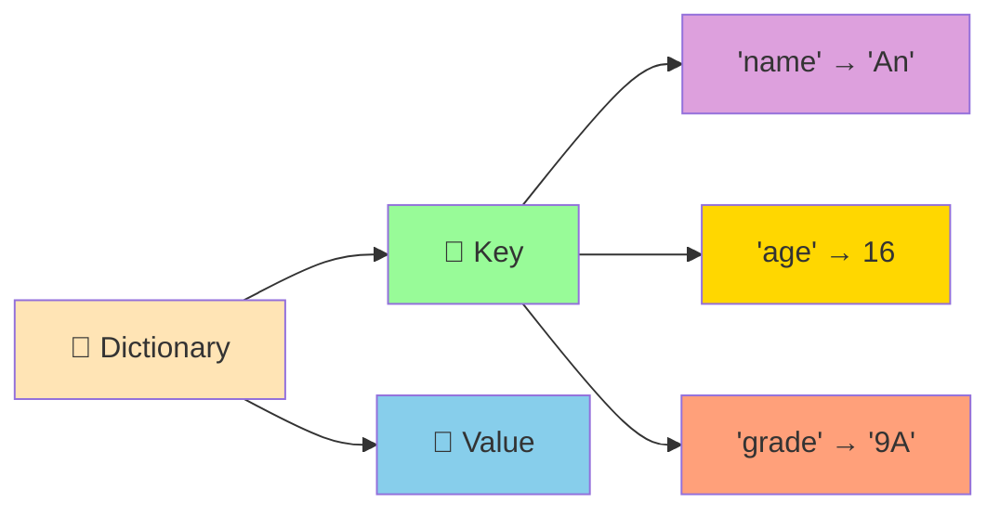

# 📖 Dictionaries - Cấu Trúc Key-Value Siêu Mạnh

:::tip 📖 Ví Dụ Dễ Hiểu
Hãy tưởng tượng Dictionary như một **cuốn từ điển thông minh**! Mỗi từ (key) có nghĩa (value) tương ứng. Bạn tra từ "apple" → nghĩa là "táo", tra "book" → nghĩa là "sách". Python cũng hoạt động tương tự!
:::

## 🤔 Dictionary Là Gì?

**Dictionary (Từ điển)** là cấu trúc dữ liệu lưu trữ thông tin theo cặp **key-value** (khóa-giá trị). Mỗi key là duy nhất và trỏ đến một value cụ thể.



### 🆚 So Sánh Với List

```python
# List - truy cập bằng index (số)
hoc_sinh_list = ["An", 16, "9A", 8.5]
ten = hoc_sinh_list[0]      # "An"
tuoi = hoc_sinh_list[1]     # 16

# Dictionary - truy cập bằng key (tên)
hoc_sinh_dict = {
    "ten": "An",
    "tuoi": 16,
    "lop": "9A",
    "diem": 8.5
}
ten = hoc_sinh_dict["ten"]      # "An"
tuoi = hoc_sinh_dict["tuoi"]    # 16
```

## 🎯 Tạo Dictionary

### 📌 Cách Tạo Cơ Bản

```python
# Từ điển rỗng
tu_dien_rong = {}
tu_dien_rong_2 = dict()

# Từ điển với dữ liệu
thong_tin_hoc_sinh = {
    "ten": "Nguyễn Văn An",
    "tuoi": 16,
    "lop": "9A",
    "diem_toan": 8.5,
    "diem_van": 7.0,
    "diem_anh": 9.0,
    "co_hoi_boi": True
}

print("Thông tin học sinh:", thong_tin_hoc_sinh)
```

### 🎨 Các Kiểu Key và Value

```python
# Key có thể là string, number, tuple
# Value có thể là bất kỳ kiểu dữ liệu nào
tu_dien_da_dang = {
    # String keys
    "ten": "Python",
    "phi_ban": "3.11",
    
    # Number keys
    1: "Một",
    2: "Hai",
    3: "Ba",
    
    # Tuple keys
    (1, 2): "Tọa độ",
    ("x", "y"): [10, 20],
    
    # Mixed values
    "so_thich": ["lập trình", "đọc sách", "chơi game"],
    "thong_tin": {
        "chieu_cao": 1.65,
        "can_nang": 50.5
    },
    "da_tot_nghiep": False
}

print("Dictionary đa dạng:", tu_dien_da_dang)
```

## 🔍 Truy Cập Dữ Liệu

### 📖 Truy Cập Bằng Key

```python
hoc_sinh = {
    "ten": "Trần Thị Lan",
    "tuoi": 15,
    "lop": "9B",
    "diem_tb": 8.2
}

# Truy cập trực tiếp
print("Tên:", hoc_sinh["ten"])        # Trần Thị Lan
print("Tuổi:", hoc_sinh["tuoi"])      # 15
print("Lớp:", hoc_sinh["lop"])        # 9B

# Truy cập an toàn với get()
diem_ly = hoc_sinh.get("diem_ly", "Chưa có điểm")
print("Điểm Lý:", diem_ly)            # Chưa có điểm

# Kiểm tra key có tồn tại
if "diem_tb" in hoc_sinh:
    print(f"Điểm TB: {hoc_sinh['diem_tb']}")
```

### 🔄 Lặp Qua Dictionary

```python
# Lặp qua keys
print("Các thông tin có sẵn:")
for key in hoc_sinh.keys():
    print(f"- {key}")

# Lặp qua values
print("\nCác giá trị:")
for value in hoc_sinh.values():
    print(f"- {value}")

# Lặp qua cả key và value
print("\nThông tin chi tiết:")
for key, value in hoc_sinh.items():
    print(f"{key}: {value}")
```

## ✏️ Thay Đổi Dữ Liệu

### ➕ Thêm Key-Value Mới

```python
hoc_sinh = {"ten": "An", "tuoi": 16}

# Thêm thông tin mới
hoc_sinh["lop"] = "9A"
hoc_sinh["diem_toan"] = 8.5
hoc_sinh["so_thich"] = ["lập trình", "đọc sách"]

print("Sau khi thêm:", hoc_sinh)
```

### 🔄 Cập Nhật Giá Trị

```python
# Cập nhật giá trị hiện có
hoc_sinh["tuoi"] = 17  # Tăng tuổi
hoc_sinh["diem_toan"] = 9.0  # Cải thiện điểm

# Cập nhật nhiều giá trị cùng lúc
hoc_sinh.update({
    "diem_van": 8.0,
    "diem_anh": 7.5,
    "lop": "10A"  # Lên lớp
})

print("Sau khi cập nhật:", hoc_sinh)
```

### ❌ Xóa Dữ Liệu

```python
# Xóa bằng del
del hoc_sinh["so_thich"]
print("Sau khi xóa so_thich:", hoc_sinh)

# Xóa bằng pop() - trả về giá trị
diem_anh = hoc_sinh.pop("diem_anh", "Không có")
print(f"Điểm Anh đã xóa: {diem_anh}")

# Xóa tất cả
hoc_sinh.clear()
print("Sau khi xóa tất cả:", hoc_sinh)  # {}
```

## 🎪 Ví Dụ Thực Tế: Hệ Thống Quản Lý Học Sinh

```python
# 📚 Hệ thống quản lý học sinh với Dictionary
class QuanLyHocSinh:
    def __init__(self):
        self.danh_sach_hoc_sinh = {}
        self.so_hoc_sinh = 0
    
    def them_hoc_sinh(self, ten, tuoi, lop):
        """Thêm học sinh mới"""
        self.so_hoc_sinh += 1
        ma_hoc_sinh = f"HS{self.so_hoc_sinh:03d}"
        
        self.danh_sach_hoc_sinh[ma_hoc_sinh] = {
            "ten": ten,
            "tuoi": tuoi,
            "lop": lop,
            "diem": {},
            "ngay_nhap_hoc": "2024-09-01",
            "trang_thai": "Đang học"
        }
        
        print(f"✅ Đã thêm học sinh: {ten} (Mã: {ma_hoc_sinh})")
        return ma_hoc_sinh
    
    def cap_nhat_diem(self, ma_hoc_sinh, mon_hoc, diem):
        """Cập nhật điểm cho học sinh"""
        if ma_hoc_sinh in self.danh_sach_hoc_sinh:
            self.danh_sach_hoc_sinh[ma_hoc_sinh]["diem"][mon_hoc] = diem
            ten = self.danh_sach_hoc_sinh[ma_hoc_sinh]["ten"]
            print(f"📊 Đã cập nhật điểm {mon_hoc}: {diem} cho {ten}")
        else:
            print(f"❌ Không tìm thấy học sinh với mã: {ma_hoc_sinh}")
    
    def tinh_diem_trung_binh(self, ma_hoc_sinh):
        """Tính điểm trung bình"""
        if ma_hoc_sinh not in self.danh_sach_hoc_sinh:
            return None
        
        diem_dict = self.danh_sach_hoc_sinh[ma_hoc_sinh]["diem"]
        if not diem_dict:
            return 0
        
        return sum(diem_dict.values()) / len(diem_dict)
    
    def xep_loai_hoc_sinh(self, ma_hoc_sinh):
        """Xếp loại học sinh"""
        diem_tb = self.tinh_diem_trung_binh(ma_hoc_sinh)
        if diem_tb is None:
            return "Không có dữ liệu"
        
        if diem_tb >= 8.5:
            return "Giỏi"
        elif diem_tb >= 8.0:
            return "Khá"
        elif diem_tb >= 6.5:
            return "Trung bình"
        else:
            return "Yếu"
    
    def tim_hoc_sinh_theo_ten(self, ten):
        """Tìm học sinh theo tên"""
        ket_qua = []
        for ma, thong_tin in self.danh_sach_hoc_sinh.items():
            if ten.lower() in thong_tin["ten"].lower():
                ket_qua.append((ma, thong_tin))
        
        return ket_qua
    
    def thong_ke_lop(self, lop):
        """Thống kê theo lớp"""
        hoc_sinh_lop = []
        for ma, thong_tin in self.danh_sach_hoc_sinh.items():
            if thong_tin["lop"] == lop:
                hoc_sinh_lop.append((ma, thong_tin))
        
        if not hoc_sinh_lop:
            print(f"❌ Không có học sinh nào trong lớp {lop}")
            return
        
        print(f"\n📊 THỐNG KÊ LỚP {lop}")
        print("=" * 50)
        print(f"{'Mã HS':<8} {'Tên':<20} {'Tuổi':<6} {'Điểm TB':<8} {'Xếp loại'}")
        print("-" * 50)
        
        for ma, thong_tin in hoc_sinh_lop:
            diem_tb = self.tinh_diem_trung_binh(ma)
            xep_loai = self.xep_loai_hoc_sinh(ma)
            print(f"{ma:<8} {thong_tin['ten']:<20} {thong_tin['tuoi']:<6} {diem_tb:<8.1f} {xep_loai}")
    
    def hien_thi_chi_tiet(self, ma_hoc_sinh):
        """Hiển thị thông tin chi tiết"""
        if ma_hoc_sinh not in self.danh_sach_hoc_sinh:
            print(f"❌ Không tìm thấy học sinh với mã: {ma_hoc_sinh}")
            return
        
        thong_tin = self.danh_sach_hoc_sinh[ma_hoc_sinh]
        diem_tb = self.tinh_diem_trung_binh(ma_hoc_sinh)
        xep_loai = self.xep_loai_hoc_sinh(ma_hoc_sinh)
        
        print(f"\n📋 THÔNG TIN CHI TIẾT - {ma_hoc_sinh}")
        print("=" * 40)
        print(f"👤 Tên: {thong_tin['ten']}")
        print(f"🎂 Tuổi: {thong_tin['tuoi']}")
        print(f"🏫 Lớp: {thong_tin['lop']}")
        print(f"📅 Ngày nhập học: {thong_tin['ngay_nhap_hoc']}")
        print(f"📊 Điểm trung bình: {diem_tb:.1f}")
        print(f"🏆 Xếp loại: {xep_loai}")
        
        if thong_tin["diem"]:
            print(f"\n📚 CHI TIẾT ĐIỂM SỐ:")
            for mon, diem in thong_tin["diem"].items():
                print(f"   {mon}: {diem}")
        else:
            print("\n📚 Chưa có điểm số")

# Sử dụng hệ thống
quan_ly = QuanLyHocSinh()

# Thêm học sinh
ma_an = quan_ly.them_hoc_sinh("Nguyễn Văn An", 16, "9A")
ma_binh = quan_ly.them_hoc_sinh("Trần Thị Bình", 15, "9A")
ma_chau = quan_ly.them_hoc_sinh("Lê Văn Châu", 16, "9B")

# Cập nhật điểm
quan_ly.cap_nhat_diem(ma_an, "Toán", 8.5)
quan_ly.cap_nhat_diem(ma_an, "Văn", 7.0)
quan_ly.cap_nhat_diem(ma_an, "Anh", 9.0)

quan_ly.cap_nhat_diem(ma_binh, "Toán", 9.0)
quan_ly.cap_nhat_diem(ma_binh, "Văn", 8.5)
quan_ly.cap_nhat_diem(ma_binh, "Anh", 8.0)

quan_ly.cap_nhat_diem(ma_chau, "Toán", 7.5)
quan_ly.cap_nhat_diem(ma_chau, "Văn", 6.5)
quan_ly.cap_nhat_diem(ma_chau, "Anh", 7.0)

# Hiển thị thông tin
quan_ly.hien_thi_chi_tiet(ma_an)
quan_ly.thong_ke_lop("9A")

# Tìm kiếm
ket_qua_tim = quan_ly.tim_hoc_sinh_theo_ten("An")
print(f"\n🔍 Tìm thấy {len(ket_qua_tim)} học sinh tên 'An'")
```

## 🎯 Bài Tập Thực Hành

### 🥇 Bài Tập 1: Từ Điển Tiếng Anh

```python
# TODO: Tạo từ điển tiếng Anh đơn giản
tu_dien_anh_viet = {
    "hello": "xin chào",
    "goodbye": "tạm biệt",
    "thank you": "cảm ơn",
    "please": "làm ơn",
    "sorry": "xin lỗi",
    "yes": "có",
    "no": "không",
    "water": "nước",
    "food": "thức ăn",
    "book": "sách",
    "computer": "máy tính",
    "python": "con rắn",
    "programming": "lập trình",
    "student": "học sinh",
    "teacher": "giáo viên"
}

def tra_tu(tu_can_tra):
    """Tra từ trong từ điển"""
    tu_lower = tu_can_tra.lower()
    
    if tu_lower in tu_dien_anh_viet:
        return tu_dien_anh_viet[tu_lower]
    else:
        # Tìm từ gần giống
        tu_giong = []
        for tu_anh in tu_dien_anh_viet.keys():
            if tu_lower in tu_anh or tu_anh in tu_lower:
                tu_giong.append(tu_anh)
        
        if tu_giong:
            return f"Không tìm thấy '{tu_can_tra}'. Có thể bạn muốn: {', '.join(tu_giong)}"
        else:
            return f"Không tìm thấy '{tu_can_tra}' trong từ điển"

def them_tu_moi(tu_anh, tu_viet):
    """Thêm từ mới vào từ điển"""
    tu_dien_anh_viet[tu_anh.lower()] = tu_viet
    print(f"✅ Đã thêm: {tu_anh} → {tu_viet}")

def hien_thi_tat_ca():
    """Hiển thị tất cả từ trong từ điển"""
    print("\n📖 TỪ ĐIỂN ANH-VIỆT")
    print("=" * 40)
    
    # Sắp xếp theo alphabet
    tu_sap_xep = sorted(tu_dien_anh_viet.items())
    
    for tu_anh, tu_viet in tu_sap_xep:
        print(f"{tu_anh:<15} → {tu_viet}")

# Menu chính
while True:
    print("\n📚 TỪ ĐIỂN TIẾNG ANH")
    print("1. Tra từ")
    print("2. Thêm từ mới")
    print("3. Xem tất cả từ")
    print("4. Thoát")
    
    lua_chon = input("👉 Chọn chức năng (1-4): ")
    
    if lua_chon == "1":
        tu_can_tra = input("Nhập từ tiếng Anh cần tra: ")
        ket_qua = tra_tu(tu_can_tra)
        print(f"📖 {ket_qua}")
    
    elif lua_chon == "2":
        tu_anh = input("Nhập từ tiếng Anh: ")
        tu_viet = input("Nhập nghĩa tiếng Việt: ")
        them_tu_moi(tu_anh, tu_viet)
    
    elif lua_chon == "3":
        hien_thi_tat_ca()
    
    elif lua_chon == "4":
        print("👋 Cảm ơn bạn đã sử dụng từ điển!")
        break
    
    else:
        print("❌ Lựa chọn không hợp lệ!")
```

### 🥈 Bài Tập 2: Quản Lý Kho Hàng

```python
# TODO: Tạo hệ thống quản lý kho hàng
class QuanLyKho:
    def __init__(self):
        self.kho_hang = {}
        self.lich_su_nhap_xuat = []
    
    def them_san_pham(self, ma_sp, ten_sp, gia, so_luong):
        """Thêm sản phẩm mới vào kho"""
        if ma_sp in self.kho_hang:
            print(f"⚠️  Sản phẩm {ma_sp} đã tồn tại!")
            return
        
        self.kho_hang[ma_sp] = {
            "ten": ten_sp,
            "gia": gia,
            "so_luong": so_luong,
            "ngay_them": "2024-09-01"
        }
        
        self.lich_su_nhap_xuat.append({
            "ngay": "2024-09-01",
            "loai": "NHẬP",
            "ma_sp": ma_sp,
            "so_luong": so_luong,
            "ghi_chu": f"Thêm sản phẩm mới: {ten_sp}"
        })
        
        print(f"✅ Đã thêm sản phẩm: {ten_sp} (Mã: {ma_sp})")
    
    def nhap_kho(self, ma_sp, so_luong):
        """Nhập thêm hàng vào kho"""
        if ma_sp not in self.kho_hang:
            print(f"❌ Không tìm thấy sản phẩm {ma_sp}")
            return
        
        self.kho_hang[ma_sp]["so_luong"] += so_luong
        
        self.lich_su_nhap_xuat.append({
            "ngay": "2024-09-01",
            "loai": "NHẬP",
            "ma_sp": ma_sp,
            "so_luong": so_luong,
            "ghi_chu": f"Nhập thêm {so_luong} {self.kho_hang[ma_sp]['ten']}"
        })
        
        print(f"📦 Đã nhập {so_luong} {self.kho_hang[ma_sp]['ten']}")
    
    def xuat_kho(self, ma_sp, so_luong):
        """Xuất hàng khỏi kho"""
        if ma_sp not in self.kho_hang:
            print(f"❌ Không tìm thấy sản phẩm {ma_sp}")
            return
        
        if self.kho_hang[ma_sp]["so_luong"] < so_luong:
            print(f"❌ Không đủ hàng! Chỉ còn {self.kho_hang[ma_sp]['so_luong']}")
            return
        
        self.kho_hang[ma_sp]["so_luong"] -= so_luong
        
        self.lich_su_nhap_xuat.append({
            "ngay": "2024-09-01",
            "loai": "XUẤT",
            "ma_sp": ma_sp,
            "so_luong": so_luong,
            "ghi_chu": f"Xuất {so_luong} {self.kho_hang[ma_sp]['ten']}"
        })
        
        print(f"📤 Đã xuất {so_luong} {self.kho_hang[ma_sp]['ten']}")
    
    def hien_thi_kho(self):
        """Hiển thị tình trạng kho"""
        if not self.kho_hang:
            print("📦 Kho trống")
            return
        
        print("\n📦 TÌNH TRẠNG KHO HÀNG")
        print("=" * 70)
        print(f"{'Mã SP':<8} {'Tên sản phẩm':<20} {'Giá':<10} {'Số lượng':<10} {'Tổng giá trị'}")
        print("-" * 70)
        
        tong_gia_tri = 0
        for ma_sp, thong_tin in self.kho_hang.items():
            gia_tri = thong_tin["gia"] * thong_tin["so_luong"]
            tong_gia_tri += gia_tri
            
            print(f"{ma_sp:<8} {thong_tin['ten']:<20} {thong_tin['gia']:<10,} {thong_tin['so_luong']:<10} {gia_tri:<10,}")
        
        print("-" * 70)
        print(f"💰 TỔNG GIÁ TRỊ KHO: {tong_gia_tri:,} VNĐ")
    
    def tim_san_pham(self, tu_khoa):
        """Tìm sản phẩm theo từ khóa"""
        ket_qua = []
        tu_khoa_lower = tu_khoa.lower()
        
        for ma_sp, thong_tin in self.kho_hang.items():
            if (tu_khoa_lower in ma_sp.lower() or 
                tu_khoa_lower in thong_tin["ten"].lower()):
                ket_qua.append((ma_sp, thong_tin))
        
        if ket_qua:
            print(f"\n🔍 Tìm thấy {len(ket_qua)} sản phẩm:")
            for ma_sp, thong_tin in ket_qua:
                print(f"   {ma_sp}: {thong_tin['ten']} - {thong_tin['so_luong']} cái")
        else:
            print(f"😅 Không tìm thấy sản phẩm nào chứa '{tu_khoa}'")
    
    def bao_cao_ton_kho_thap(self, nguong=10):
        """Báo cáo sản phẩm sắp hết hàng"""
        san_pham_ton_thap = []
        
        for ma_sp, thong_tin in self.kho_hang.items():
            if thong_tin["so_luong"] <= nguong:
                san_pham_ton_thap.append((ma_sp, thong_tin))
        
        if san_pham_ton_thap:
            print(f"\n⚠️  CẢNH BÁO: {len(san_pham_ton_thap)} sản phẩm sắp hết hàng (≤{nguong}):")
            for ma_sp, thong_tin in san_pham_ton_thap:
                print(f"   {ma_sp}: {thong_tin['ten']} - Còn {thong_tin['so_luong']} cái")
        else:
            print(f"✅ Tất cả sản phẩm đều đủ hàng (> {nguong})")

# Sử dụng hệ thống quản lý kho
kho = QuanLyKho()

# Thêm sản phẩm
kho.them_san_pham("SP001", "Laptop Dell", 15000000, 5)
kho.them_san_pham("SP002", "Mouse Logitech", 500000, 20)
kho.them_san_pham("SP003", "Keyboard Mechanical", 1200000, 8)
kho.them_san_pham("SP004", "Monitor 24 inch", 4000000, 3)

# Nhập thêm hàng
kho.nhap_kho("SP001", 3)
kho.nhap_kho("SP002", 10)

# Xuất hàng
kho.xuat_kho("SP001", 2)
kho.xuat_kho("SP003", 5)

# Hiển thị kho
kho.hien_thi_kho()

# Tìm kiếm
kho.tim_san_pham("Laptop")

# Báo cáo tồn kho thấp
kho.bao_cao_ton_kho_thap(5)
```

## 🎊 Tóm Tắt

Trong bài này, bạn đã học được:

✅ **Tạo dictionary** - `{}`, `dict()`  
✅ **Truy cập dữ liệu** - `dict[key]`, `get()`  
✅ **Thay đổi dữ liệu** - Thêm, cập nhật, xóa  
✅ **Lặp qua dictionary** - `keys()`, `values()`, `items()`  
✅ **Ứng dụng thực tế** - Quản lý học sinh, từ điển, kho hàng  
✅ **So sánh với list** - Khi nào dùng dictionary vs list  

## 🚀 Bước Tiếp Theo

Tuyệt vời! Bây giờ bạn đã thành thạo **cấu trúc key-value** mạnh mẽ! Tiếp theo, chúng ta sẽ học về [Functions Basics](/python/intermediate/functions-basics) - cách tạo ra những **"công thức" có thể tái sử dụng**!

:::tip 🎯 Thử Thách Nhỏ
Hãy thử tạo một "hệ thống quản lý thư viện sách" sử dụng dictionary! Mỗi sách có mã, tên, tác giả, thể loại, trạng thái (có sẵn/đã mượn), người mượn. Cho phép mượn, trả, tìm kiếm, và thống kê!
:::

---

*🔗 **Bài tiếp theo**: [Functions Basics - Tạo Công Thức Có Thể Tái Sử Dụng](/python/intermediate/functions-basics)*
