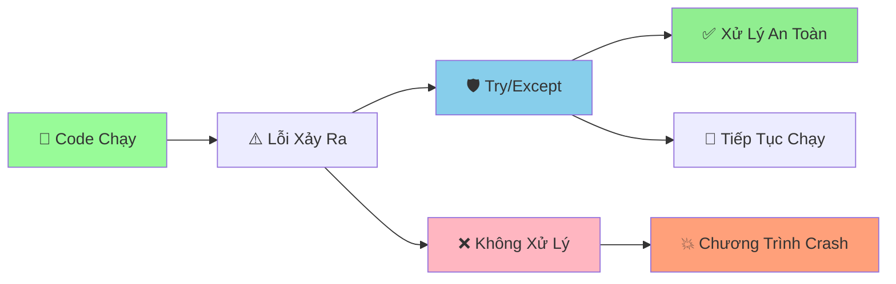

# 🧯 Xử Lý Lỗi – Bình tĩnh và chuyên nghiệp

::::tip Tư duy đúng
Lỗi là bình thường. Mục tiêu của chúng ta: phát hiện sớm, thông báo rõ ràng, và khôi phục an toàn. Đừng lo, điều này dễ hơn bạn nghĩ!
::::

## 🧩 Cấu trúc cơ bản

```python
try:
    user_value = int(input("Nhập số: "))
except ValueError:
    print("❌ Vui lòng nhập số hợp lệ!")
else:
    print("✅ Giá trị hợp lệ:", user_value)
finally:
    print("🔚 Hoàn tất.")
```

## 🎯 Bắt ngoại lệ cụ thể

```python
def read_file(file_path):
    try:
        with open(file_path, "r", encoding="utf-8") as f:
            return f.read()
    except FileNotFoundError:
        print("❌ Không tìm thấy file")
    except PermissionError:
        print("❌ Không có quyền truy cập")
    except OSError as e:
        print(f"❌ Lỗi hệ thống: {e}")
```

## 🛑 Chủ động báo lỗi: `raise`

```python
def divide_numbers(a, b):
    if b == 0:
        raise ZeroDivisionError("Mẫu số phải khác 0")
    return a / b
```

## 🧰 Tạo ngoại lệ tuỳ chỉnh

```python
class AppError(Exception):
    """Lỗi chung trong ứng dụng."""

class ConfigError(AppError):
    """Lỗi cấu hình."""

def load_config(config_data):
    if "key" not in config_data:
        raise ConfigError("Thiếu trường 'key'")
```

## 🧹 Dọn dẹp tài nguyên với context manager

```python
from contextlib import contextmanager

@contextmanager
def managed_resource(resource_name):
    print(f"Mở {resource_name}")
    try:
        yield resource_name
    finally:
        print(f"Đóng {resource_name}")

with managed_resource("kết nối") as resource:
    print("Đang dùng:", resource)
```

## ✅ Nguyên tắc vàng

- Bắt đúng loại lỗi; đừng dùng `except Exception` chung chung nếu không cần.
- Thông điệp lỗi rõ ràng, thân thiện tiếng Việt.
- Ghi log khi hữu ích, nhưng không làm lộ thông tin nhạy cảm.
- Ưu tiên sửa nguyên nhân gốc thay vì che lỗi.

## 🧪 Bài tập nhanh

1) Viết hàm đọc JSON từ file, bắt `JSONDecodeError` và thông báo dễ hiểu.
2) Viết decorator bắt lỗi và in thông báo gợi ý cho người dùng.
3) Chuyển các thao tác mở/đóng file thủ công sang `with`.

---

👉 Áp dụng trong các dự án: thông báo lỗi ngắn gọn, dễ hiểu; luôn dọn dẹp tài nguyên.

---
sidebar_position: 13
title: "⚠️ Error Handling - Xử Lý Lỗi Chuyên Nghiệp"
description: "Học cách xử lý lỗi trong Python với try/except, finally, và các kỹ thuật nâng cao. Làm cho code của bạn mạnh mẽ và đáng tin cậy!"
keywords: ["python", "error handling", "try except", "exception", "finally", "raise", "xử lý lỗi", "robust code"]
---

# ⚠️ Error Handling - Xử Lý Lỗi Chuyên Nghiệp

:::tip ⚠️ Ví Dụ Dễ Hiểu
Hãy tưởng tượng Error Handling như một **hệ thống bảo vệ thông minh**! Khi có "kẻ xâm nhập" (lỗi) xuất hiện, hệ thống sẽ bắt giữ và xử lý chúng một cách an toàn, thay vì để chúng phá hỏng toàn bộ chương trình!
:::

## 🤔 Tại Sao Cần Error Handling?

Trong cuộc sống, chúng ta luôn chuẩn bị cho những tình huống bất ngờ:
- 🚗 **Lái xe**: Chuẩn bị phanh khi có chướng ngại vật
- 🏠 **Ở nhà**: Có bảo hiểm khi có thiên tai
- 🎮 **Chơi game**: Có mạng lưới an toàn khi rơi

Python cũng cần **"hệ thống bảo vệ"** tương tự!



## 🎯 Try/Except Cơ Bản

### 📌 Cú Pháp

```python
try:
    # Code có thể gây lỗi
    pass
except ExceptionType:
    # Xử lý lỗi
    pass
```

### 🌟 Ví Dụ Cơ Bản

```python
# ❌ Code không xử lý lỗi
number = int(input("Nhập số: "))  # Nếu nhập "abc" sẽ crash!

# ✅ Code có xử lý lỗi
try:
    number = int(input("Nhập số: "))
    print(f"Số bạn nhập: {number}")
except ValueError:
    print("❌ Vui lòng nhập số hợp lệ!")

print("Chương trình tiếp tục chạy...")
```

### 🎯 Các Loại Lỗi Phổ Biến

```python
# ValueError - Giá trị không hợp lệ
try:
    number = int("abc")
except ValueError as e:
    print(f"Lỗi ValueError: {e}")

# ZeroDivisionError - Chia cho 0
try:
    result = 10 / 0
except ZeroDivisionError as e:
    print(f"Lỗi ZeroDivisionError: {e}")

# IndexError - Truy cập index không tồn tại
try:
    my_list = [1, 2, 3]
    element = my_list[10]
except IndexError as e:
    print(f"Lỗi IndexError: {e}")

# KeyError - Truy cập key không tồn tại
try:
    my_dict = {"a": 1, "b": 2}
    value = my_dict["c"]
except KeyError as e:
    print(f"Lỗi KeyError: {e}")

# FileNotFoundError - File không tồn tại
try:
    with open("nonexistent_file.txt", "r") as f:
        content = f.read()
except FileNotFoundError as e:
    print(f"Lỗi FileNotFoundError: {e}")
```

## 🎨 Xử Lý Nhiều Loại Lỗi

### 🔄 Multiple Except Blocks

```python
def divide_numbers(a, b):
    try:
        result = a / b
        return result
    except ZeroDivisionError:
        print("❌ Không thể chia cho 0!")
        return None
    except TypeError:
        print("❌ Vui lòng nhập số!")
        return None
    except Exception as e:
        print(f"❌ Lỗi không xác định: {e}")
        return None

# Test
print(divide_numbers(10, 2))    # 5.0
print(divide_numbers(10, 0))    # None (ZeroDivisionError)
print(divide_numbers("10", 2))  # None (TypeError)
```

### 🎯 Single Except Block

```python
def process_number(number_str):
    try:
        number = int(number_str)
        return number * 2
    except (ValueError, TypeError) as e:
        print(f"❌ Lỗi chuyển đổi: {e}")
        return None

# Test
print(process_number("123"))   # 246
print(process_number("abc"))   # None
print(process_number(None))    # None
```

## 🎪 Ví Dụ Thực Tế: Hệ Thống Quản Lý File

```python
# 📁 Hệ thống quản lý file với error handling
import os
import json

class FileManager:
    def __init__(self):
        self.working_directory = "data"
        self.create_directory()
    
    def create_directory(self):
        """Tạo thư mục làm việc"""
        try:
            if not os.path.exists(self.working_directory):
                os.makedirs(self.working_directory)
                print(f"✅ Đã tạo thư mục: {self.working_directory}")
        except PermissionError:
            print("❌ Không có quyền tạo thư mục!")
        except Exception as e:
            print(f"❌ Lỗi tạo thư mục: {e}")
    
    def write_file(self, file_name, content):
        """Ghi nội dung vào file"""
        try:
            file_path = os.path.join(self.working_directory, file_name)
            with open(file_path, 'w', encoding='utf-8') as f:
                f.write(content)
            print(f"✅ Đã ghi file: {file_name}")
            return True
        except PermissionError:
            print(f"❌ Không có quyền ghi file: {file_name}")
            return False
        except OSError as e:
            print(f"❌ Lỗi hệ thống khi ghi file: {e}")
            return False
        except Exception as e:
            print(f"❌ Lỗi không xác định: {e}")
            return False
    
    def read_file(self, file_name):
        """Đọc nội dung từ file"""
        try:
            file_path = os.path.join(self.working_directory, file_name)
            with open(file_path, 'r', encoding='utf-8') as f:
                content = f.read()
            print(f"✅ Đã đọc file: {file_name}")
            return content
        except FileNotFoundError:
            print(f"❌ File không tồn tại: {file_name}")
            return None
        except PermissionError:
            print(f"❌ Không có quyền đọc file: {file_name}")
            return None
        except UnicodeDecodeError:
            print(f"❌ Lỗi mã hóa file: {file_name}")
            return None
        except Exception as e:
            print(f"❌ Lỗi không xác định: {e}")
            return None
    
    def write_json(self, file_name, data):
        """Ghi dữ liệu JSON vào file"""
        try:
            file_path = os.path.join(self.working_directory, file_name)
            with open(file_path, 'w', encoding='utf-8') as f:
                json.dump(data, f, ensure_ascii=False, indent=2)
            print(f"✅ Đã ghi JSON: {file_name}")
            return True
        except TypeError as e:
            print(f"❌ Dữ liệu không thể serialize: {e}")
            return False
        except Exception as e:
            print(f"❌ Lỗi ghi JSON: {e}")
            return False
    
    def read_json(self, file_name):
        """Đọc dữ liệu JSON từ file"""
        try:
            file_path = os.path.join(self.working_directory, file_name)
            with open(file_path, 'r', encoding='utf-8') as f:
                data = json.load(f)
            print(f"✅ Đã đọc JSON: {file_name}")
            return data
        except FileNotFoundError:
            print(f"❌ File JSON không tồn tại: {file_name}")
            return None
        except json.JSONDecodeError as e:
            print(f"❌ Lỗi định dạng JSON: {e}")
            return None
        except Exception as e:
            print(f"❌ Lỗi đọc JSON: {e}")
            return None
    
    def delete_file(self, file_name):
        """Xóa file"""
        try:
            file_path = os.path.join(self.working_directory, file_name)
            if os.path.exists(file_path):
                os.remove(file_path)
                print(f"✅ Đã xóa file: {file_name}")
                return True
            else:
                print(f"⚠️  File không tồn tại: {file_name}")
                return False
        except PermissionError:
            print(f"❌ Không có quyền xóa file: {file_name}")
            return False
        except Exception as e:
            print(f"❌ Lỗi xóa file: {e}")
            return False
    
    def list_files(self):
        """Hiển thị danh sách file"""
        try:
            if os.path.exists(self.working_directory):
                files = os.listdir(self.working_directory)
                if files:
                    print(f"\n📁 Danh sách file trong {self.working_directory}:")
                    for file in files:
                        print(f"   - {file}")
                else:
                    print(f"📁 Thư mục {self.working_directory} trống")
            else:
                print(f"❌ Thư mục {self.working_directory} không tồn tại")
        except Exception as e:
            print(f"❌ Lỗi liệt kê file: {e}")

# Sử dụng hệ thống
file_manager = FileManager()

# Test các chức năng
file_manager.write_file("test.txt", "Hello World!")
file_manager.read_file("test.txt")
file_manager.read_file("nonexistent_file.txt")

# Test JSON
student_data = {"ten": "An", "tuoi": 16, "lop": "9A"}
file_manager.write_json("student.json", student_data)
json_result = file_manager.read_json("student.json")
print(f"Dữ liệu JSON: {json_result}")

# Hiển thị danh sách
file_manager.list_files()
```

## 🎯 Bài Tập Thực Hành

### 🥇 Bài Tập 1: Máy Tính An Toàn

```python
# TODO: Tạo máy tính an toàn với error handling
class SafeCalculator:
    def __init__(self):
        self.history = []
    
    def add(self, a, b):
        """Phép cộng an toàn"""
        try:
            a = float(a)
            b = float(b)
            result = a + b
            self.history.append(f"{a} + {b} = {result}")
            return result
        except (ValueError, TypeError) as e:
            print(f"❌ Lỗi: {e}")
            return None
    
    def subtract(self, a, b):
        """Phép trừ an toàn"""
        try:
            a = float(a)
            b = float(b)
            result = a - b
            self.history.append(f"{a} - {b} = {result}")
            return result
        except (ValueError, TypeError) as e:
            print(f"❌ Lỗi: {e}")
            return None
    
    def multiply(self, a, b):
        """Phép nhân an toàn"""
        try:
            a = float(a)
            b = float(b)
            result = a * b
            self.history.append(f"{a} × {b} = {result}")
            return result
        except (ValueError, TypeError) as e:
            print(f"❌ Lỗi: {e}")
            return None
    
    def divide(self, a, b):
        """Phép chia an toàn"""
        try:
            a = float(a)
            b = float(b)
            
            if b == 0:
                print("❌ Không thể chia cho 0!")
                return None
            
            result = a / b
            self.history.append(f"{a} ÷ {b} = {result}")
            return result
        except (ValueError, TypeError) as e:
            print(f"❌ Lỗi: {e}")
            return None
        except ZeroDivisionError:
            print("❌ Không thể chia cho 0!")
            return None
    
    def square_root(self, a):
        """Căn bậc hai an toàn"""
        try:
            a = float(a)
            
            if a < 0:
                print("❌ Không thể tính căn bậc hai của số âm!")
                return None
            
            result = a ** 0.5
            self.history.append(f"√{a} = {result}")
            return result
        except (ValueError, TypeError) as e:
            print(f"❌ Lỗi: {e}")
            return None
    
    def evaluate_expression(self, expression):
        """Tính biểu thức an toàn"""
        try:
            # Loại bỏ khoảng trắng
            expression = expression.replace(" ", "")
            
            # Kiểm tra ký tự hợp lệ
            if not all(c.isdigit() or c in "+-*/.()" for c in expression):
                print("❌ Biểu thức chứa ký tự không hợp lệ!")
                return None
            
            # Tính toán (chỉ cho phép các phép tính cơ bản)
            result = eval(expression)
            self.history.append(f"{expression} = {result}")
            return result
        except ZeroDivisionError:
            print("❌ Lỗi: Chia cho 0!")
            return None
        except SyntaxError:
            print("❌ Lỗi: Biểu thức không hợp lệ!")
            return None
        except Exception as e:
            print(f"❌ Lỗi: {e}")
            return None
    
    def show_history(self):
        """Hiển thị lịch sử tính toán"""
        if self.history:
            print("\n📋 LỊCH SỬ TÍNH TOÁN")
            print("=" * 30)
            for i, calculation in enumerate(self.history, 1):
                print(f"{i:2d}. {calculation}")
        else:
            print("📋 Chưa có lịch sử tính toán")
    
    def run_calculator(self):
        """Chạy máy tính tương tác"""
        print("🧮 MÁY TÍNH AN TOÀN")
        print("=" * 30)
        print("Các phép tính: +, -, *, /, √, biểu thức")
        print("Gõ 'history' để xem lịch sử")
        print("Gõ 'quit' để thoát")
        print("-" * 30)
        
        while True:
            try:
                user_input = input("\nNhập phép tính: ").strip()
                
                if user_input.lower() == 'quit':
                    print("👋 Tạm biệt!")
                    break
                elif user_input.lower() == 'history':
                    self.show_history()
                    continue
                
                # Xử lý phép tính
                if user_input.startswith('√'):
                    number_str = user_input[1:]
                    result = self.square_root(number_str)
                elif '+' in user_input and len(user_input.split('+')) == 2:
                    a, b = user_input.split('+')
                    result = self.add(a, b)
                elif '-' in user_input and len(user_input.split('-')) == 2:
                    a, b = user_input.split('-')
                    result = self.subtract(a, b)
                elif '*' in user_input and len(user_input.split('*')) == 2:
                    a, b = user_input.split('*')
                    result = self.multiply(a, b)
                elif '/' in user_input and len(user_input.split('/')) == 2:
                    a, b = user_input.split('/')
                    result = self.divide(a, b)
                else:
                    result = self.evaluate_expression(user_input)
                
                if result is not None:
                    print(f"📊 Kết quả: {result}")
                
            except KeyboardInterrupt:
                print("\n👋 Tạm biệt!")
                break
            except Exception as e:
                print(f"❌ Lỗi không mong muốn: {e}")

# Chạy máy tính
calculator = SafeCalculator()
calculator.run_calculator()
```

## 🎊 Tóm Tắt

Trong bài này, bạn đã học được:

✅ **Try/Except cơ bản** - Xử lý lỗi cơ bản  
✅ **Multiple except blocks** - Xử lý nhiều loại lỗi  
✅ **Exception types** - ValueError, ZeroDivisionError, FileNotFoundError  
✅ **Finally block** - Code luôn chạy  
✅ **Raise exceptions** - Tạo lỗi tùy chỉnh  
✅ **Ứng dụng thực tế** - Quản lý file, máy tính an toàn  

## 🚀 Bước Tiếp Theo

Tuyệt vời! Bây giờ bạn đã biết cách **xử lý lỗi chuyên nghiệp**! Tiếp theo, chúng ta sẽ tạo [Password Generator Project](/python/projects/password-generator) - một dự án thực tế và hữu ích!

:::tip 🎯 Thử Thách Nhỏ
Hãy thử tạo một "hệ thống đăng nhập an toàn" với error handling! Xử lý lỗi nhập sai, file không tồn tại, và các tình huống bất ngờ khác!
:::

---

*🔗 **Dự án tiếp theo**: [Password Generator - Tạo Mật Khẩu An Toàn](/python/projects/password-generator)*
