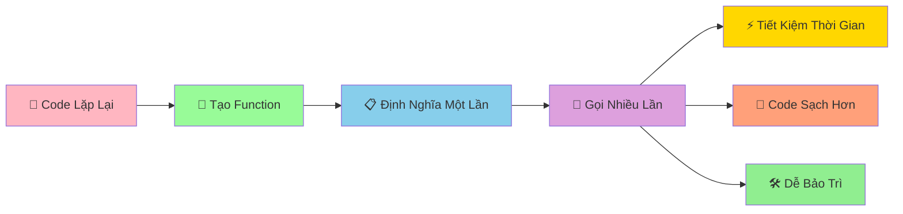

# 🔧 Functions Basics - Tạo Công Thức Có Thể Tái Sử Dụng

:::tip 🔧 Ví Dụ Dễ Hiểu
Hãy tưởng tượng Function như một **công thức nấu ăn**! Một lần viết ra, bạn có thể dùng lại nhiều lần. Thay vì phải nhớ và làm lại từ đầu mỗi lần, chỉ cần gọi tên công thức là có ngay kết quả!
:::

## 🤔 Function Là Gì?

**Function (Hàm)** là một **khối code có tên** thực hiện một công việc cụ thể. Thay vì viết lại code giống nhau nhiều lần, bạn chỉ cần tạo function một lần và gọi nó khi cần.



### 🆚 So Sánh Với Code Thông Thường

```python
# ❌ Cách cũ - lặp lại code
# Tính diện tích hình chữ nhật 3 lần
chieu_dai_1, chieu_rong_1 = 5, 3
dien_tich_1 = chieu_dai_1 * chieu_rong_1
print(f"Hình 1: {dien_tich_1}")

chieu_dai_2, chieu_rong_2 = 7, 4
dien_tich_2 = chieu_dai_2 * chieu_rong_2
print(f"Hình 2: {dien_tich_2}")

chieu_dai_3, chieu_rong_3 = 6, 2
dien_tich_3 = chieu_dai_3 * chieu_rong_3
print(f"Hình 3: {dien_tich_3}")
```

```python
# ✅ Cách mới - sử dụng function
def tinh_dien_tich_hcn(chieu_dai, chieu_rong):
    """Tính diện tích hình chữ nhật"""
    dien_tich = chieu_dai * chieu_rong
    return dien_tich

# Gọi function nhiều lần
dien_tich_1 = tinh_dien_tich_hcn(5, 3)
dien_tich_2 = tinh_dien_tich_hcn(7, 4)
dien_tich_3 = tinh_dien_tich_hcn(6, 2)

print(f"Hình 1: {dien_tich_1}")
print(f"Hình 2: {dien_tich_2}")
print(f"Hình 3: {dien_tich_3}")
```

## 🎯 Tạo Function Cơ Bản

### 📌 Cú Pháp

```python
def ten_function():
    """Docstring - mô tả function"""
    # Code thực hiện công việc
    return ket_qua  # Trả về kết quả (tùy chọn)
```

### 🌟 Ví Dụ Đơn Giản

```python
# Function không có tham số, không trả về
def chao_mung():
    """In lời chào mừng"""
    print("🎉 Chào mừng bạn đến với Python!")
    print("🐍 Hãy cùng học lập trình thú vị!")

# Gọi function
chao_mung()
chao_mung()  # Có thể gọi nhiều lần
```

```python
# Function có tham số
def chao_ten(ten):
    """Chào một người cụ thể"""
    print(f"👋 Xin chào {ten}!")
    print(f"🎯 Chúc {ten} học Python vui vẻ!")

# Gọi function với tham số khác nhau
chao_ten("An")
chao_ten("Bình")
chao_ten("Châu")
```

```python
# Function có trả về giá trị
def tinh_binh_phuong(so):
    """Tính bình phương của một số"""
    ket_qua = so ** 2
    return ket_qua

# Sử dụng kết quả trả về
so_5_bp = tinh_binh_phuong(5)
so_7_bp = tinh_binh_phuong(7)

print(f"5² = {so_5_bp}")  # 25
print(f"7² = {so_7_bp}")  # 49
```

## 🎪 Ví Dụ Thực Tế: Bộ Công Cụ Toán Học

```python
# 🧮 Bộ công cụ toán học với functions
import math

def tinh_chu_vi_hcn(chieu_dai, chieu_rong):
    """Tính chu vi hình chữ nhật"""
    chu_vi = 2 * (chieu_dai + chieu_rong)
    return chu_vi

def tinh_dien_tich_hcn(chieu_dai, chieu_rong):
    """Tính diện tích hình chữ nhật"""
    dien_tich = chieu_dai * chieu_rong
    return dien_tich

def tinh_dien_tich_hinh_tron(ban_kinh):
    """Tính diện tích hình tròn"""
    dien_tich = math.pi * ban_kinh ** 2
    return dien_tich

def tinh_chu_vi_hinh_tron(ban_kinh):
    """Tính chu vi hình tròn"""
    chu_vi = 2 * math.pi * ban_kinh
    return chu_vi

def tinh_bmi(can_nang, chieu_cao):
    """Tính chỉ số BMI"""
    bmi = can_nang / (chieu_cao ** 2)
    return bmi

def danh_gia_bmi(bmi):
    """Đánh giá BMI"""
    if bmi < 18.5:
        return "Thiếu cân"
    elif bmi < 25:
        return "Bình thường"
    elif bmi < 30:
        return "Thừa cân"
    else:
        return "Béo phì"

def tinh_lai_suat(tien_goc, lai_suat, so_nam):
    """Tính lãi suất kép"""
    tien_cuoi = tien_goc * (1 + lai_suat) ** so_nam
    return tien_cuoi

# Sử dụng các functions
print("🧮 BỘ CÔNG CỤ TOÁN HỌC")
print("=" * 40)

# Tính hình chữ nhật
cd, cr = 5, 3
print(f"Hình chữ nhật {cd}x{cr}:")
print(f"  Chu vi: {tinh_chu_vi_hcn(cd, cr):.1f}")
print(f"  Diện tích: {tinh_dien_tich_hcn(cd, cr)}")

# Tính hình tròn
bk = 4
print(f"\nHình tròn bán kính {bk}:")
print(f"  Chu vi: {tinh_chu_vi_hinh_tron(bk):.2f}")
print(f"  Diện tích: {tinh_dien_tich_hinh_tron(bk):.2f}")

# Tính BMI
can_nang, chieu_cao = 60, 1.7
bmi = tinh_bmi(can_nang, chieu_cao)
danh_gia = danh_gia_bmi(bmi)
print(f"\nBMI: {bmi:.1f} - {danh_gia}")

# Tính lãi suất
tien_goc = 1000000
lai_suat = 0.05
so_nam = 3
tien_cuoi = tinh_lai_suat(tien_goc, lai_suat, so_nam)
print(f"\nLãi suất: {tien_goc:,} VNĐ → {tien_cuoi:,.0f} VNĐ sau {so_nam} năm")
```

## 🔄 Function Với Nhiều Tham Số

### 📊 Tham Số Vị Trí

```python
def tinh_diem_trung_binh(diem_toan, diem_van, diem_anh):
    """Tính điểm trung bình 3 môn"""
    diem_tb = (diem_toan + diem_van + diem_anh) / 3
    return diem_tb

# Gọi với tham số theo thứ tự
diem_tb_an = tinh_diem_trung_binh(8.5, 7.0, 9.0)
print(f"Điểm TB của An: {diem_tb_an:.1f}")

diem_tb_binh = tinh_diem_trung_binh(9.0, 8.5, 7.5)
print(f"Điểm TB của Bình: {diem_tb_binh:.1f}")
```

### 🏷️ Tham Số Tên (Keyword Arguments)

```python
def tao_thong_tin_hoc_sinh(ten, tuoi, lop, diem_tb=0.0):
    """Tạo thông tin học sinh"""
    thong_tin = {
        "ten": ten,
        "tuoi": tuoi,
        "lop": lop,
        "diem_tb": diem_tb
    }
    return thong_tin

# Gọi với tên tham số
hs_an = tao_thong_tin_hoc_sinh(ten="An", tuoi=16, lop="9A", diem_tb=8.5)
hs_binh = tao_thong_tin_hoc_sinh(tuoi=15, ten="Bình", diem_tb=7.8, lop="9B")

print("Thông tin An:", hs_an)
print("Thông tin Bình:", hs_binh)
```

### 🎯 Tham Số Mặc Định

```python
def chao_loi(ten, loi_chao="Xin chào"):
    """Chào với lời chào tùy chỉnh"""
    print(f"{loi_chao} {ten}!")

# Sử dụng lời chào mặc định
chao_loi("An")  # Xin chào An!

# Sử dụng lời chào tùy chỉnh
chao_loi("Bình", "Chào mừng")  # Chào mừng Bình!
chao_loi("Châu", "Hẹn gặp lại")  # Hẹn gặp lại Châu!
```

## 🎪 Ví Dụ Thực Tế: Hệ Thống Quản Lý Điểm Số

```python
# 📊 Hệ thống quản lý điểm số với functions
def nhap_diem_mon(ten_mon):
    """Nhập điểm cho một môn học"""
    while True:
        try:
            diem = float(input(f"Nhập điểm {ten_mon}: "))
            if 0 <= diem <= 10:
                return diem
            else:
                print("❌ Điểm phải từ 0-10!")
        except ValueError:
            print("❌ Vui lòng nhập số hợp lệ!")

def tinh_diem_trung_binh(diem_cac_mon):
    """Tính điểm trung bình"""
    if not diem_cac_mon:
        return 0
    return sum(diem_cac_mon.values()) / len(diem_cac_mon)

def xep_loai_hoc_luc(diem_tb):
    """Xếp loại học lực"""
    if diem_tb >= 9.0:
        return "Xuất sắc"
    elif diem_tb >= 8.0:
        return "Giỏi"
    elif diem_tb >= 6.5:
        return "Khá"
    elif diem_tb >= 5.0:
        return "Trung bình"
    else:
        return "Yếu"

def hien_thi_bao_cao(ten_hs, diem_cac_mon, diem_tb, xep_loai):
    """Hiển thị báo cáo điểm số"""
    print(f"\n📋 BÁO CÁO ĐIỂM SỐ - {ten_hs}")
    print("=" * 40)
    
    for mon, diem in diem_cac_mon.items():
        print(f"{mon:<15}: {diem:>5.1f}")
    
    print("-" * 40)
    print(f"Điểm trung bình: {diem_tb:.1f}")
    print(f"Xếp loại: {xep_loai}")

def phan_tich_diem(diem_cac_mon):
    """Phân tích chi tiết điểm số"""
    if not diem_cac_mon:
        return
    
    diem_cao_nhat = max(diem_cac_mon.values())
    diem_thap_nhat = min(diem_cac_mon.values())
    mon_cao_nhat = [mon for mon, diem in diem_cac_mon.items() if diem == diem_cao_nhat]
    mon_thap_nhat = [mon for mon, diem in diem_cac_mon.items() if diem == diem_thap_nhat]
    
    print(f"\n📊 PHÂN TÍCH CHI TIẾT:")
    print(f"   Điểm cao nhất: {diem_cao_nhat} ({', '.join(mon_cao_nhat)})")
    print(f"   Điểm thấp nhất: {diem_thap_nhat} ({', '.join(mon_thap_nhat)})")
    
    # Đếm mức điểm
    diem_gioi = sum(1 for diem in diem_cac_mon.values() if diem >= 8.0)
    diem_kha = sum(1 for diem in diem_cac_mon.values() if 6.5 <= diem < 8.0)
    diem_tb = sum(1 for diem in diem_cac_mon.values() if 5.0 <= diem < 6.5)
    diem_yeu = sum(1 for diem in diem_cac_mon.values() if diem < 5.0)
    
    print(f"   Môn giỏi (≥8.0): {diem_gioi}")
    print(f"   Môn khá (6.5-7.9): {diem_kha}")
    print(f"   Môn TB (5.0-6.4): {diem_tb}")
    print(f"   Môn yếu (<5.0): {diem_yeu}")

def quan_ly_diem_hoc_sinh():
    """Chương trình chính quản lý điểm"""
    print("📚 HỆ THỐNG QUẢN LÝ ĐIỂM SỐ")
    print("=" * 40)
    
    # Nhập thông tin học sinh
    ten_hs = input("Nhập tên học sinh: ")
    
    # Danh sách môn học
    cac_mon = ["Toán", "Lý", "Hóa", "Văn", "Anh", "Sử", "Địa", "Sinh"]
    diem_cac_mon = {}
    
    print(f"\nNhập điểm cho {ten_hs}:")
    for mon in cac_mon:
        diem = nhap_diem_mon(mon)
        diem_cac_mon[mon] = diem
    
    # Tính toán
    diem_tb = tinh_diem_trung_binh(diem_cac_mon)
    xep_loai = xep_loai_hoc_luc(diem_tb)
    
    # Hiển thị kết quả
    hien_thi_bao_cao(ten_hs, diem_cac_mon, diem_tb, xep_loai)
    phan_tich_diem(diem_cac_mon)
    
    # Lời khuyên
    if diem_tb >= 8.0:
        print(f"\n🌟 {ten_hs} học rất tốt! Tiếp tục phát huy!")
    elif diem_tb >= 6.5:
        print(f"\n👍 {ten_hs} học khá tốt! Cố gắng thêm một chút!")
    else:
        print(f"\n💪 {ten_hs} cần cố gắng hơn! Hãy tìm sự hỗ trợ!")

# Chạy chương trình
quan_ly_diem_hoc_sinh()
```

## 🎯 Bài Tập Thực Hành

### 🥇 Bài Tập 1: Máy Tính Đơn Giản

```python
# TODO: Tạo máy tính với functions
def cong(a, b):
    """Phép cộng"""
    return a + b

def tru(a, b):
    """Phép trừ"""
    return a - b

def nhan(a, b):
    """Phép nhân"""
    return a * b

def chia(a, b):
    """Phép chia"""
    if b == 0:
        return "Không thể chia cho 0!"
    return a / b

def luy_thua(a, b):
    """Lũy thừa"""
    return a ** b

def may_tinh():
    """Máy tính chính"""
    print("🧮 MÁY TÍNH ĐƠN GIẢN")
    print("=" * 30)
    print("Các phép tính: +, -, *, /, **")
    print("Gõ 'quit' để thoát")
    print("-" * 30)
    
    while True:
        try:
            bieu_thuc = input("Nhập phép tính (vd: 5 + 3): ")
            
            if bieu_thuc.lower() == 'quit':
                print("👋 Tạm biệt!")
                break
            
            # Tách biểu thức
            parts = bieu_thuc.split()
            if len(parts) != 3:
                print("❌ Định dạng: số phép_tính số")
                continue
            
            a = float(parts[0])
            phep_tinh = parts[1]
            b = float(parts[2])
            
            # Thực hiện phép tính
            if phep_tinh == '+':
                ket_qua = cong(a, b)
            elif phep_tinh == '-':
                ket_qua = tru(a, b)
            elif phep_tinh == '*':
                ket_qua = nhan(a, b)
            elif phep_tinh == '/':
                ket_qua = chia(a, b)
            elif phep_tinh == '**':
                ket_qua = luy_thua(a, b)
            else:
                print("❌ Phép tính không hỗ trợ!")
                continue
            
            print(f"📊 Kết quả: {bieu_thuc} = {ket_qua}")
            
        except ValueError:
            print("❌ Vui lòng nhập số hợp lệ!")
        except:
            print("❌ Có lỗi xảy ra!")

# Chạy máy tính
may_tinh()
```

### 🥈 Bài Tập 2: Game Đoán Số Với Functions

```python
import random

# TODO: Tạo game đoán số với functions
def tao_so_ngau_nhien(min_val, max_val):
    """Tạo số ngẫu nhiên trong khoảng"""
    return random.randint(min_val, max_val)

def kiem_tra_doan(so_doan, so_dung):
    """Kiểm tra số đoán"""
    if so_doan == so_dung:
        return "CHÍNH XÁC"
    elif so_doan < so_dung:
        return "THẤP HƠN"
    else:
        return "CAO HƠN"

def danh_gia_ket_qua(so_lan_thu, so_lan_toi_da):
    """Đánh giá kết quả chơi"""
    ti_le = so_lan_thu / so_lan_toi_da
    
    if ti_le <= 0.3:
        return "🌟 XUẤT SẮC! Bạn là cao thủ đoán số!"
    elif ti_le <= 0.5:
        return "👍 RẤT TỐT! Kỹ năng ổn định!"
    elif ti_le <= 0.7:
        return "😊 KHÔNG SAO! Lần sau sẽ tốt hơn!"
    else:
        return "💪 CỐ GẮNG! Hãy thử chiến lược khác!"

def hien_thi_goi_y(so_lan_thu, so_lan_toi_da):
    """Hiển thị gợi ý"""
    if so_lan_thu == so_lan_toi_da // 2:
        print("💡 Gợi ý: Hãy thử số ở giữa khoảng!")
    elif so_lan_thu >= so_lan_toi_da * 0.8:
        print("⚠️  Cẩn thận! Bạn sắp hết lượt!")

def game_doan_so():
    """Game đoán số chính"""
    print("🎮 GAME ĐOÁN SỐ")
    print("=" * 30)
    
    # Thiết lập game
    min_val = 1
    max_val = 100
    so_lan_toi_da = 7
    
    so_can_doan = tao_so_ngau_nhien(min_val, max_val)
    
    print(f"🎯 Tôi đã nghĩ ra một số từ {min_val}-{max_val}")
    print(f"🎪 Bạn có {so_lan_toi_da} lần đoán!")
    print("💡 Tôi sẽ gợi ý 'cao hơn' hoặc 'thấp hơn'")
    print("-" * 30)
    
    so_lan_thu = 0
    
    while so_lan_thu < so_lan_toi_da:
        so_lan_thu += 1
        
        try:
            so_doan = int(input(f"🔢 Lần {so_lan_thu}/{so_lan_toi_da} - Nhập số: "))
        except ValueError:
            print("❌ Vui lòng nhập số!")
            so_lan_thu -= 1
            continue
        
        # Kiểm tra số đoán
        ket_qua = kiem_tra_doan(so_doan, so_can_doan)
        
        if ket_qua == "CHÍNH XÁC":
            print(f"🎉 {ket_qua}! Số tôi nghĩ là {so_can_doan}")
            print(f"🏆 Bạn đã đoán đúng trong {so_lan_thu} lần!")
            danh_gia = danh_gia_ket_qua(so_lan_thu, so_lan_toi_da)
            print(danh_gia)
            break
        else:
            print(f"📈 Số tôi nghĩ {ket_qua.lower()}!")
            hien_thi_goi_y(so_lan_thu, so_lan_toi_da)
    
    else:
        print(f"\n💔 HẾT LƯỢT! Số tôi nghĩ là {so_can_doan}")
        print("🎯 Lần sau hãy thử chiến lược khác nhé!")

# Chạy game
game_doan_so()
```

## 🎊 Tóm Tắt

Trong bài này, bạn đã học được:

✅ **Tạo function** - `def`, docstring, return  
✅ **Tham số** - positional, keyword, default  
✅ **Gọi function** - tái sử dụng code  
✅ **Function có/không trả về** - return vs print  
✅ **Ứng dụng thực tế** - Bộ công cụ toán học, quản lý điểm  
✅ **Lợi ích** - Code sạch, dễ bảo trì, tái sử dụng  

## 🚀 Bước Tiếp Theo

Tuyệt vời! Bây giờ bạn đã biết cách tạo **"công thức" có thể tái sử dụng**! Tiếp theo, chúng ta sẽ học về [Functions Parameters](/python/intermediate/functions-parameters) - cách làm cho functions **linh hoạt và mạnh mẽ hơn**!

:::tip 🎯 Thử Thách Nhỏ
Hãy thử tạo một "bộ công cụ xử lý văn bản" với các functions: đếm từ, đếm câu, tìm từ dài nhất, tìm từ ngắn nhất, đảo ngược văn bản, và chuyển đổi chữ hoa/thường!
:::

---

*🔗 **Bài tiếp theo**: [Functions Parameters - Làm Functions Linh Hoạt Hơn](/python/intermediate/functions-parameters)*
