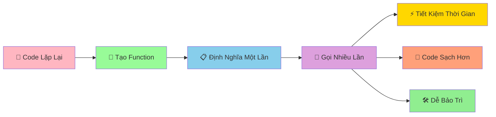

# 🔧 Functions Basics - Tạo Công Thức Có Thể Tái Sử Dụng

:::tip 🔧 Ví Dụ Dễ Hiểu
Hãy tưởng tượng Function như một **công thức nấu ăn**! Một lần viết ra, bạn có thể dùng lại nhiều lần. Thay vì phải nhớ và làm lại từ đầu mỗi lần, chỉ cần gọi tên công thức là có ngay kết quả!
:::

## 🤔 Function Là Gì?

**Function (Hàm)** là một **khối code có tên** thực hiện một công việc cụ thể. Thay vì viết lại code giống nhau nhiều lần, bạn chỉ cần tạo function một lần và gọi nó khi cần.



### 🆚 So Sánh Với Code Thông Thường

```python
# ❌ Cách cũ - lặp lại code
# Tính diện tích hình chữ nhật 3 lần
length_1, width_1 = 5, 3
area_1 = length_1 * width_1
print(f"Hình 1: {area_1}")

length_2, width_2 = 7, 4
area_2 = length_2 * width_2
print(f"Hình 2: {area_2}")

length_3, width_3 = 6, 2
area_3 = length_3 * width_3
print(f"Hình 3: {area_3}")
```

```python
# ✅ Cách mới - sử dụng function
def calculate_rectangle_area(length, width):
    """Tính diện tích hình chữ nhật"""
    area = length * width
    return area

# Gọi function nhiều lần
area_1 = calculate_rectangle_area(5, 3)
area_2 = calculate_rectangle_area(7, 4)
area_3 = calculate_rectangle_area(6, 2)

print(f"Hình 1: {area_1}")
print(f"Hình 2: {area_2}")
print(f"Hình 3: {area_3}")
```

## 🎯 Tạo Function Cơ Bản

### 📌 Cú Pháp

```python
def function_name():
    """Docstring - mô tả function"""
    # Code thực hiện công việc
    return result  # Trả về kết quả (tùy chọn)
```

### 🌟 Ví Dụ Đơn Giản

```python
# Function không có tham số, không trả về
def welcome_message():
    """In lời chào mừng"""
    print("🎉 Chào mừng bạn đến với Python!")
    print("🐍 Hãy cùng học lập trình thú vị!")

# Gọi function
welcome_message()
welcome_message()  # Có thể gọi nhiều lần
```

```python
# Function có tham số
def greet_person(name):
    """Chào một người cụ thể"""
    print(f"👋 Xin chào {name}!")
    print(f"🎯 Chúc {name} học Python vui vẻ!")

# Gọi function với tham số khác nhau
greet_person("An")
greet_person("Bình")
greet_person("Châu")
```

```python
# Function có trả về giá trị
def calculate_square(number):
    """Tính bình phương của một số"""
    result = number ** 2
    return result

# Sử dụng kết quả trả về
square_5 = calculate_square(5)
square_7 = calculate_square(7)

print(f"5² = {square_5}")  # 25
print(f"7² = {square_7}")  # 49
```

## 🎪 Ví Dụ Thực Tế: Bộ Công Cụ Toán Học

```python
# 🧮 Bộ công cụ toán học với functions
import math

def calculate_rectangle_perimeter(length, width):
    """Tính chu vi hình chữ nhật"""
    perimeter = 2 * (length + width)
    return perimeter

def calculate_rectangle_area(length, width):
    """Tính diện tích hình chữ nhật"""
    area = length * width
    return area

def calculate_circle_area(radius):
    """Tính diện tích hình tròn"""
    area = math.pi * radius ** 2
    return area

def calculate_circle_perimeter(radius):
    """Tính chu vi hình tròn"""
    perimeter = 2 * math.pi * radius
    return perimeter

def calculate_bmi(weight, height):
    """Tính chỉ số BMI"""
    bmi = weight / (height ** 2)
    return bmi

def evaluate_bmi(bmi):
    """Đánh giá BMI"""
    if bmi < 18.5:
        return "Thiếu cân"
    elif bmi < 25:
        return "Bình thường"
    elif bmi < 30:
        return "Thừa cân"
    else:
        return "Béo phì"

def calculate_compound_interest(principal, interest_rate, years):
    """Tính lãi suất kép"""
    final_amount = principal * (1 + interest_rate) ** years
    return final_amount

# Sử dụng các functions
print("🧮 BỘ CÔNG CỤ TOÁN HỌC")
print("=" * 40)

# Tính hình chữ nhật
length, width = 5, 3
print(f"Hình chữ nhật {length}x{width}:")
print(f"  Chu vi: {calculate_rectangle_perimeter(length, width):.1f}")
print(f"  Diện tích: {calculate_rectangle_area(length, width)}")

# Tính hình tròn
radius = 4
print(f"\nHình tròn bán kính {radius}:")
print(f"  Chu vi: {calculate_circle_perimeter(radius):.2f}")
print(f"  Diện tích: {calculate_circle_area(radius):.2f}")

# Tính BMI
weight, height = 60, 1.7
bmi = calculate_bmi(weight, height)
evaluation = evaluate_bmi(bmi)
print(f"\nBMI: {bmi:.1f} - {evaluation}")

# Tính lãi suất
principal = 1000000
interest_rate = 0.05
years = 3
final_amount = calculate_compound_interest(principal, interest_rate, years)
print(f"\nLãi suất: {principal:,} VNĐ → {final_amount:,.0f} VNĐ sau {years} năm")
```

## 🔄 Function Với Nhiều Tham Số

### 📊 Tham Số Vị Trí

```python
def calculate_average_score(math_score, literature_score, english_score):
    """Tính điểm trung bình 3 môn"""
    average = (math_score + literature_score + english_score) / 3
    return average

# Gọi với tham số theo thứ tự
avg_score_an = calculate_average_score(8.5, 7.0, 9.0)
print(f"Điểm TB của An: {avg_score_an:.1f}")

avg_score_binh = calculate_average_score(9.0, 8.5, 7.5)
print(f"Điểm TB của Bình: {avg_score_binh:.1f}")
```

### 🏷️ Tham Số Tên (Keyword Arguments)

```python
def create_student_info(name, age, class_name, average_score=0.0):
    """Tạo thông tin học sinh"""
    info = {
        "name": name,
        "age": age,
        "class_name": class_name,
        "average_score": average_score
    }
    return info

# Gọi với tên tham số
student_an = create_student_info(name="An", age=16, class_name="9A", average_score=8.5)
student_binh = create_student_info(age=15, name="Bình", average_score=7.8, class_name="9B")

print("Thông tin An:", student_an)
print("Thông tin Bình:", student_binh)
```

### 🎯 Tham Số Mặc Định

```python
def greet_with_message(name, greeting="Xin chào"):
    """Chào với lời chào tùy chỉnh"""
    print(f"{greeting} {name}!")

# Sử dụng lời chào mặc định
greet_with_message("An")  # Xin chào An!

# Sử dụng lời chào tùy chỉnh
greet_with_message("Bình", "Chào mừng")  # Chào mừng Bình!
greet_with_message("Châu", "Hẹn gặp lại")  # Hẹn gặp lại Châu!
```

## 🎪 Ví Dụ Thực Tế: Hệ Thống Quản Lý Điểm Số

```python
# 📊 Hệ thống quản lý điểm số với functions
def input_subject_score(subject_name):
    """Nhập điểm cho một môn học"""
    while True:
        try:
            score = float(input(f"Nhập điểm {subject_name}: "))
            if 0 <= score <= 10:
                return score
            else:
                print("❌ Điểm phải từ 0-10!")
        except ValueError:
            print("❌ Vui lòng nhập số hợp lệ!")

def calculate_average_score(subject_scores):
    """Tính điểm trung bình"""
    if not subject_scores:
        return 0
    return sum(subject_scores.values()) / len(subject_scores)

def classify_academic_performance(average_score):
    """Xếp loại học lực"""
    if average_score >= 9.0:
        return "Xuất sắc"
    elif average_score >= 8.0:
        return "Giỏi"
    elif average_score >= 6.5:
        return "Khá"
    elif average_score >= 5.0:
        return "Trung bình"
    else:
        return "Yếu"

def display_score_report(student_name, subject_scores, average_score, classification):
    """Hiển thị báo cáo điểm số"""
    print(f"\n📋 BÁO CÁO ĐIỂM SỐ - {student_name}")
    print("=" * 40)
    
    for subject, score in subject_scores.items():
        print(f"{subject:<15}: {score:>5.1f}")
    
    print("-" * 40)
    print(f"Điểm trung bình: {average_score:.1f}")
    print(f"Xếp loại: {classification}")

def analyze_scores(subject_scores):
    """Phân tích chi tiết điểm số"""
    if not subject_scores:
        return
    
    highest_score = max(subject_scores.values())
    lowest_score = min(subject_scores.values())
    highest_subjects = [subject for subject, score in subject_scores.items() if score == highest_score]
    lowest_subjects = [subject for subject, score in subject_scores.items() if score == lowest_score]
    
    print(f"\n📊 PHÂN TÍCH CHI TIẾT:")
    print(f"   Điểm cao nhất: {highest_score} ({', '.join(highest_subjects)})")
    print(f"   Điểm thấp nhất: {lowest_score} ({', '.join(lowest_subjects)})")
    
    # Đếm mức điểm
    excellent_count = sum(1 for score in subject_scores.values() if score >= 8.0)
    good_count = sum(1 for score in subject_scores.values() if 6.5 <= score < 8.0)
    average_count = sum(1 for score in subject_scores.values() if 5.0 <= score < 6.5)
    weak_count = sum(1 for score in subject_scores.values() if score < 5.0)
    
    print(f"   Môn giỏi (≥8.0): {excellent_count}")
    print(f"   Môn khá (6.5-7.9): {good_count}")
    print(f"   Môn TB (5.0-6.4): {average_count}")
    print(f"   Môn yếu (<5.0): {weak_count}")

def manage_student_scores():
    """Chương trình chính quản lý điểm"""
    print("📚 HỆ THỐNG QUẢN LÝ ĐIỂM SỐ")
    print("=" * 40)
    
    # Nhập thông tin học sinh
    student_name = input("Nhập tên học sinh: ")
    
    # Danh sách môn học
    subjects = ["Toán", "Lý", "Hóa", "Văn", "Anh", "Sử", "Địa", "Sinh"]
    subject_scores = {}
    
    print(f"\nNhập điểm cho {student_name}:")
    for subject in subjects:
        score = input_subject_score(subject)
        subject_scores[subject] = score
    
    # Tính toán
    average_score = calculate_average_score(subject_scores)
    classification = classify_academic_performance(average_score)
    
    # Hiển thị kết quả
    display_score_report(student_name, subject_scores, average_score, classification)
    analyze_scores(subject_scores)
    
    # Lời khuyên
    if average_score >= 8.0:
        print(f"\n🌟 {student_name} học rất tốt! Tiếp tục phát huy!")
    elif average_score >= 6.5:
        print(f"\n👍 {student_name} học khá tốt! Cố gắng thêm một chút!")
    else:
        print(f"\n💪 {student_name} cần cố gắng hơn! Hãy tìm sự hỗ trợ!")

# Chạy chương trình
manage_student_scores()
```

## 🎯 Bài Tập Thực Hành

### 🥇 Bài Tập 1: Máy Tính Đơn Giản

```python
# TODO: Tạo máy tính với functions
def add(a, b):
    """Phép cộng"""
    return a + b

def subtract(a, b):
    """Phép trừ"""
    return a - b

def multiply(a, b):
    """Phép nhân"""
    return a * b

def divide(a, b):
    """Phép chia"""
    if b == 0:
        return "Không thể chia cho 0!"
    return a / b

def power(a, b):
    """Lũy thừa"""
    return a ** b

def calculator():
    """Máy tính chính"""
    print("🧮 MÁY TÍNH ĐƠN GIẢN")
    print("=" * 30)
    print("Các phép tính: +, -, *, /, **")
    print("Gõ 'quit' để thoát")
    print("-" * 30)
    
    while True:
        try:
            expression = input("Nhập phép tính (vd: 5 + 3): ")
            
            if expression.lower() == 'quit':
                print("👋 Tạm biệt!")
                break
            
            # Tách biểu thức
            parts = expression.split()
            if len(parts) != 3:
                print("❌ Định dạng: số phép_tính số")
                continue
            
            a = float(parts[0])
            operator = parts[1]
            b = float(parts[2])
            
            # Thực hiện phép tính
            if operator == '+':
                result = add(a, b)
            elif operator == '-':
                result = subtract(a, b)
            elif operator == '*':
                result = multiply(a, b)
            elif operator == '/':
                result = divide(a, b)
            elif operator == '**':
                result = power(a, b)
            else:
                print("❌ Phép tính không hỗ trợ!")
                continue
            
            print(f"📊 Kết quả: {expression} = {result}")
            
        except ValueError:
            print("❌ Vui lòng nhập số hợp lệ!")
        except:
            print("❌ Có lỗi xảy ra!")

# Chạy máy tính
calculator()
```

### 🥈 Bài Tập 2: Game Đoán Số Với Functions

```python
import random

# TODO: Tạo game đoán số với functions
def generate_random_number(min_val, max_val):
    """Tạo số ngẫu nhiên trong khoảng"""
    return random.randint(min_val, max_val)

def check_guess(guess, correct_number):
    """Kiểm tra số đoán"""
    if guess == correct_number:
        return "CHÍNH XÁC"
    elif guess < correct_number:
        return "THẤP HƠN"
    else:
        return "CAO HƠN"

def evaluate_performance(attempts, max_attempts):
    """Đánh giá kết quả chơi"""
    ratio = attempts / max_attempts
    
    if ratio <= 0.3:
        return "🌟 XUẤT SẮC! Bạn là cao thủ đoán số!"
    elif ratio <= 0.5:
        return "👍 RẤT TỐT! Kỹ năng ổn định!"
    elif ratio <= 0.7:
        return "😊 KHÔNG SAO! Lần sau sẽ tốt hơn!"
    else:
        return "💪 CỐ GẮNG! Hãy thử chiến lược khác!"

def show_hint(attempts, max_attempts):
    """Hiển thị gợi ý"""
    if attempts == max_attempts // 2:
        print("💡 Gợi ý: Hãy thử số ở giữa khoảng!")
    elif attempts >= max_attempts * 0.8:
        print("⚠️  Cẩn thận! Bạn sắp hết lượt!")

def guessing_game():
    """Game đoán số chính"""
    print("🎮 GAME ĐOÁN SỐ")
    print("=" * 30)
    
    # Thiết lập game
    min_val = 1
    max_val = 100
    max_attempts = 7
    
    target_number = generate_random_number(min_val, max_val)
    
    print(f"🎯 Tôi đã nghĩ ra một số từ {min_val}-{max_val}")
    print(f"🎪 Bạn có {max_attempts} lần đoán!")
    print("💡 Tôi sẽ gợi ý 'cao hơn' hoặc 'thấp hơn'")
    print("-" * 30)
    
    attempts = 0
    
    while attempts < max_attempts:
        attempts += 1
        
        try:
            guess = int(input(f"🔢 Lần {attempts}/{max_attempts} - Nhập số: "))
        except ValueError:
            print("❌ Vui lòng nhập số!")
            attempts -= 1
            continue
        
        # Kiểm tra số đoán
        result = check_guess(guess, target_number)
        
        if result == "CHÍNH XÁC":
            print(f"🎉 {result}! Số tôi nghĩ là {target_number}")
            print(f"🏆 Bạn đã đoán đúng trong {attempts} lần!")
            evaluation = evaluate_performance(attempts, max_attempts)
            print(evaluation)
            break
        else:
            print(f"📈 Số tôi nghĩ {result.lower()}!")
            show_hint(attempts, max_attempts)
    
    else:
        print(f"\n💔 HẾT LƯỢT! Số tôi nghĩ là {target_number}")
        print("🎯 Lần sau hãy thử chiến lược khác nhé!")

# Chạy game
guessing_game()
```

## 🎊 Tóm Tắt

Trong bài này, bạn đã học được:

✅ **Tạo function** - `def`, docstring, return  
✅ **Tham số** - positional, keyword, default  
✅ **Gọi function** - tái sử dụng code  
✅ **Function có/không trả về** - return vs print  
✅ **Ứng dụng thực tế** - Bộ công cụ toán học, quản lý điểm  
✅ **Lợi ích** - Code sạch, dễ bảo trì, tái sử dụng  

## 🚀 Bước Tiếp Theo

Tuyệt vời! Bây giờ bạn đã biết cách tạo **"công thức" có thể tái sử dụng**! Tiếp theo, chúng ta sẽ học về [Functions Parameters](/python/intermediate/functions-parameters) - cách làm cho functions **linh hoạt và mạnh mẽ hơn**!

:::tip 🎯 Thử Thách Nhỏ
Hãy thử tạo một "bộ công cụ xử lý văn bản" với các functions: đếm từ, đếm câu, tìm từ dài nhất, tìm từ ngắn nhất, đảo ngược văn bản, và chuyển đổi chữ hoa/thường!
:::

---

*🔗 **Bài tiếp theo**: [Functions Parameters - Làm Functions Linh Hoạt Hơn](/python/intermediate/functions-parameters)*
