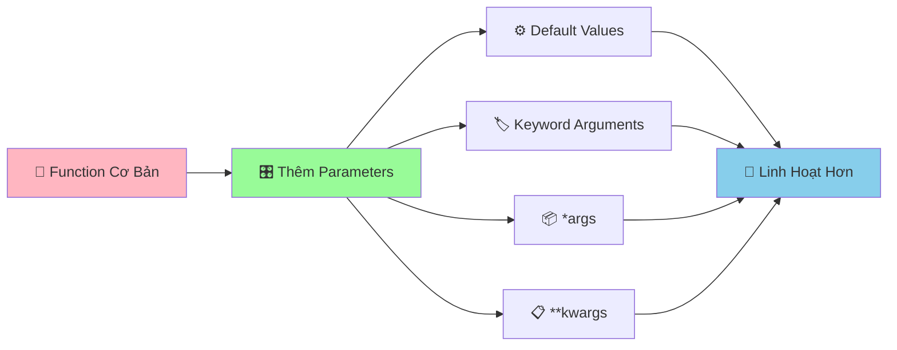

# 🎛️ Functions Parameters - Làm Functions Linh Hoạt Hơn

:::tip 🎛️ Ví Dụ Dễ Hiểu
Hãy tưởng tượng Function như một **máy nướng bánh thông minh**! Parameters là những **nút điều chỉnh** giúp bạn tùy chỉnh: nhiệt độ, thời gian, loại bánh. Có thể đặt mặc định, hoặc điều chỉnh theo ý muốn!
:::

## 🤔 Tại Sao Cần Parameters Linh Hoạt?

Trong cuộc sống, chúng ta thường cần **tùy chỉnh** theo tình huống:

- 🍕 **Đặt pizza**: Size (S/M/L), topping, độ cay
- 🚗 **Gọi taxi**: Điểm đi, điểm đến, loại xe
- 📚 **Mượn sách**: Tên sách, thời gian, có cần gia hạn không
- 🎮 **Chơi game**: Độ khó, nhân vật, chế độ chơi

Python functions cũng cần khả năng **linh hoạt** tương tự!



## 🎯 Default Values - Giá Trị Mặc Định

### 📌 Cú Pháp Cơ Bản

```python
def function_name(param1, param2=default_value):
    """Function với giá trị mặc định"""
    # Code thực hiện
    return result
```

### 🌟 Ví Dụ Thực Tế

```python
def greet_user(name, greeting="Xin chào", emoji="👋"):
    """Chào với lời chào tùy chỉnh"""
    print(f"{emoji} {greeting} {name}!")

# Sử dụng giá trị mặc định
greet_user("An")                    # 👋 Xin chào An!
greet_user("Bình", "Chào mừng")     # 👋 Chào mừng Bình!
greet_user("Châu", "Hẹn gặp lại", "👋")  # 👋 Hẹn gặp lại Châu!

# Tất cả đều hoạt động!
```

```python
def calculate_rectangle_area(length, width=1):
    """Tính diện tích hình chữ nhật với chiều rộng mặc định"""
    return length * width

# Hình vuông (chiều rộng = chiều dài)
square_area = calculate_rectangle_area(5)  # 5 * 1 = 5
print(f"Diện tích hình vuông: {square_area}")

# Hình chữ nhật
rectangle_area = calculate_rectangle_area(5, 3)  # 5 * 3 = 15
print(f"Diện tích hình chữ nhật: {rectangle_area}")
```

### ⚠️ Lưu Ý Quan Trọng

```python
# ✅ ĐÚNG - Default values ở cuối
def good_function(param1, param2, param3="default"):
    pass

# ❌ SAI - Default values ở giữa
def bad_function(param1, param2="default", param3):
    pass  # SyntaxError!
```

## 🏷️ Keyword Arguments - Tham Số Tên

### 📌 Cú Pháp

```python
# Gọi function với tên tham số
function_name(param1=value1, param2=value2)
```

### 🌟 Ví Dụ Thực Tế

```python
def create_student_info(name, age, class_name, average_score=0.0, gender="Không xác định"):
    """Tạo thông tin học sinh với keyword arguments"""
    student_info = {
        "name": name,
        "age": age,
        "class_name": class_name,
        "average_score": average_score,
        "gender": gender
    }
    return student_info

# Sử dụng keyword arguments - thứ tự không quan trọng!
student_an = create_student_info(
    name="Nguyễn Văn An",
    age=16,
    class_name="9A",
    average_score=8.5,
    gender="Nam"
)

student_binh = create_student_info(
    class_name="9B",  # Thứ tự khác nhau
    name="Trần Thị Bình",
    gender="Nữ",
    age=15,
    average_score=7.8
)

print("Thông tin An:", student_an)
print("Thông tin Bình:", student_binh)
```

### 🎯 Kết Hợp Positional và Keyword

```python
def calculate_interest(principal, rate, years, frequency=12):
    """Tính lãi suất với keyword arguments"""
    periods = years * frequency
    final_amount = principal * (1 + rate/frequency) ** periods
    return final_amount

# Positional arguments trước
amount_1 = calculate_interest(1000000, 0.05, 3)

# Keyword arguments sau
amount_2 = calculate_interest(1000000, 0.05, 3, frequency=6)

# Tất cả keyword arguments
amount_3 = calculate_interest(
    principal=2000000,
    rate=0.06,
    years=2,
    frequency=4
)

print(f"Lãi suất 1: {amount_1:,.0f} VNĐ")
print(f"Lãi suất 2: {amount_2:,.0f} VNĐ")
print(f"Lãi suất 3: {amount_3:,.0f} VNĐ")
```

## 📦 *args - Nhiều Tham Số

### 📌 Cú Pháp

```python
def function_name(*args):
    """Function nhận nhiều tham số"""
    # args là một tuple chứa tất cả tham số
    pass
```

### 🌟 Ví Dụ Thực Tế

```python
def calculate_sum(*numbers):
    """Tính tổng của nhiều số"""
    if not numbers:
        return 0
    return sum(numbers)

# Có thể truyền bao nhiêu số cũng được!
sum_1 = calculate_sum(1, 2, 3)                    # 6
sum_2 = calculate_sum(1, 2, 3, 4, 5)              # 15
sum_3 = calculate_sum(10, 20, 30, 40, 50, 60)     # 210
sum_4 = calculate_sum()                            # 0

print(f"Tổng 1: {sum_1}")
print(f"Tổng 2: {sum_2}")
print(f"Tổng 3: {sum_3}")
print(f"Tổng 4: {sum_4}")
```

```python
def create_friends_list(*friend_names):
    """Tạo danh sách bạn bè"""
    if not friend_names:
        return "Chưa có bạn nào"
    
    friends_list = []
    for name in friend_names:
        friends_list.append(f"👋 {name}")
    
    return "\n".join(friends_list)

# Có thể thêm bao nhiêu bạn cũng được!
friends_1 = create_friends_list("An", "Bình")
friends_2 = create_friends_list("An", "Bình", "Châu", "Dung", "Em")

print("Danh sách bạn bè 1:")
print(friends_1)
print("\nDanh sách bạn bè 2:")
print(friends_2)
```

### 🎯 Kết Hợp *args Với Tham Số Khác

```python
def calculate_average_score(student_name, *subject_scores):
    """Tính điểm trung bình của học sinh"""
    if not subject_scores:
        return f"{student_name}: Chưa có điểm nào"
    
    average_score = sum(subject_scores) / len(subject_scores)
    return f"{student_name}: {average_score:.1f}"

# Sử dụng
score_an = calculate_average_score("An", 8.5, 7.0, 9.0, 8.0)
score_binh = calculate_average_score("Bình", 9.0, 8.5, 7.5)
score_chau = calculate_average_score("Châu")  # Chưa có điểm

print(score_an)
print(score_binh)
print(score_chau)
```

## 📋 **kwargs - Tham Số Từ Điển

### 📌 Cú Pháp

```python
def function_name(**kwargs):
    """Function nhận tham số dạng từ điển"""
    # kwargs là một dictionary chứa tất cả tham số
    pass
```

### 🌟 Ví Dụ Thực Tế

```python
def create_student(**info):
    """Tạo học sinh với thông tin linh hoạt"""
    student = {
        "name": info.get("name", "Chưa có tên"),
        "age": info.get("age", 0),
        "class_name": info.get("class_name", "Chưa xếp lớp"),
        "average_score": info.get("average_score", 0.0),
        "hobbies": info.get("hobbies", []),
        "address": info.get("address", "Chưa có địa chỉ")
    }
    return student

# Có thể truyền bất kỳ thông tin nào!
student_an = create_student(
    name="Nguyễn Văn An",
    age=16,
    class_name="9A",
    average_score=8.5,
    hobbies=["lập trình", "đọc sách"]
)

student_binh = create_student(
    name="Trần Thị Bình",
    age=15,
    class_name="9B",
    address="123 Phố Huế, Hà Nội",
    average_score=7.8
)

print("Học sinh An:", student_an)
print("Học sinh Bình:", student_binh)
```

```python
def calculate_travel_cost(**costs):
    """Tính tổng chi phí du lịch"""
    total_cost = 0
    cost_details = []
    
    for cost_type, amount in costs.items():
        total_cost += amount
        cost_details.append(f"  {cost_type}: {amount:,} VNĐ")
    
    return total_cost, cost_details

# Tính chi phí du lịch
total, details = calculate_travel_cost(
    hotel=2000000,
    food=1500000,
    transport=800000,
    shopping=1000000,
    entertainment=500000
)

print("💰 CHI PHÍ DU LỊCH")
print("=" * 30)
for detail in details:
    print(detail)
print("-" * 30)
print(f"Tổng cộng: {total:,} VNĐ")
```

## 🎪 Ví Dụ Thực Tế: Hệ Thống Quản Lý Thư Viện Nâng Cao

```python
# 📚 Hệ thống quản lý thư viện với parameters linh hoạt
class AdvancedLibrary:
    def __init__(self, library_name="Thư Viện Công Cộng"):
        self.library_name = library_name
        self.books = {}
        self.borrowers = {}
    
    def add_book(self, book_title, author, **additional_info):
        """Thêm sách với thông tin linh hoạt"""
        book_id = f"SH{len(self.books) + 1:03d}"
        
        self.books[book_id] = {
            "title": book_title,
            "author": author,
            "genre": additional_info.get("genre", "Chưa phân loại"),
            "year": additional_info.get("year", "Không rõ"),
            "pages": additional_info.get("pages", 0),
            "price": additional_info.get("price", 0),
            "language": additional_info.get("language", "Tiếng Việt"),
            "status": "Có sẵn"
        }
        
        print(f"✅ Đã thêm sách: {book_title} (Mã: {book_id})")
        return book_id
    
    def borrow_book(self, book_id, borrower_name, *additional_info):
        """Cho mượn sách với thông tin bổ sung"""
        if book_id not in self.books:
            print(f"❌ Không tìm thấy sách {book_id}")
            return False
        
        if self.books[book_id]["status"] != "Có sẵn":
            print(f"❌ Sách {book_id} đã được mượn")
            return False
        
        # Cập nhật trạng thái sách
        self.books[book_id]["status"] = "Đã mượn"
        self.books[book_id]["borrower"] = borrower_name
        
        # Lưu thông tin người mượn
        self.borrowers[borrower_name] = {
            "borrowed_book": book_id,
            "borrow_date": "2024-09-01",
            "additional_info": list(additional_info)
        }
        
        print(f"📖 {borrower_name} đã mượn sách: {self.books[book_id]['title']}")
        return True
    
    def return_book(self, book_id, returner_name, **return_info):
        """Trả sách với thông tin chi tiết"""
        if book_id not in self.books:
            print(f"❌ Không tìm thấy sách {book_id}")
            return False
        
        if self.books[book_id]["status"] != "Đã mượn":
            print(f"❌ Sách {book_id} không được mượn")
            return False
        
        if self.books[book_id]["borrower"] != returner_name:
            print(f"❌ {returner_name} không phải người mượn sách này")
            return False
        
        # Cập nhật trạng thái
        self.books[book_id]["status"] = "Có sẵn"
        del self.books[book_id]["borrower"]
        
        # Lưu thông tin trả sách
        return_details = {
            "return_date": return_info.get("return_date", "2024-09-01"),
            "condition": return_info.get("condition", "Tốt"),
            "notes": return_info.get("notes", "Không có")
        }
        
        print(f"📚 {returner_name} đã trả sách: {self.books[book_id]['title']}")
        print(f"   Tình trạng: {return_details['condition']}")
        return True
    
    def search_books(self, **criteria):
        """Tìm sách theo nhiều tiêu chí"""
        results = []
        
        for book_id, book_info in self.books.items():
            found = True
            
            # Kiểm tra từng tiêu chí
            for criterion_key, criterion_value in criteria.items():
                if criterion_key in book_info:
                    if criterion_value.lower() not in str(book_info[criterion_key]).lower():
                        found = False
                        break
                else:
                    found = False
                    break
            
            if found:
                results.append((book_id, book_info))
        
        return results
    
    def display_search_results(self, results):
        """Hiển thị kết quả tìm kiếm"""
        if not results:
            print("😅 Không tìm thấy sách nào phù hợp")
            return
        
        print(f"\n🔍 Tìm thấy {len(results)} sách:")
        print("=" * 60)
        
        for book_id, book_info in results:
            print(f"📖 {book_id}: {book_info['title']}")
            print(f"   Tác giả: {book_info['author']}")
            print(f"   Thể loại: {book_info['genre']}")
            print(f"   Trạng thái: {book_info['status']}")
            print("-" * 40)

# Sử dụng hệ thống
library = AdvancedLibrary("Thư Viện Trường THCS")

# Thêm sách với thông tin khác nhau
book_1 = library.add_book(
    "Python Programming",
    "Guido van Rossum",
    genre="Lập trình",
    year="2023",
    pages=350,
    price=150000,
    language="Tiếng Anh"
)

book_2 = library.add_book(
    "Truyện Kiều",
    "Nguyễn Du",
    genre="Văn học",
    year="1820",
    pages=200
)

book_3 = library.add_book(
    "Toán học 9",
    "Bộ Giáo dục",
    genre="Giáo khoa",
    year="2024",
    pages=180,
    price=45000
)

# Mượn sách
library.borrow_book(book_1, "Nguyễn Văn An", "Học sinh lớp 9A", "Cần cho dự án")
library.borrow_book(book_2, "Trần Thị Bình", "Học sinh lớp 9B")

# Tìm kiếm sách
print("\n🔍 TÌM KIẾM SÁCH")
print("=" * 30)

# Tìm theo thể loại
results_1 = library.search_books(genre="Lập trình")
print("Sách lập trình:")
library.display_search_results(results_1)

# Tìm theo tác giả
results_2 = library.search_books(author="Nguyễn")
print("\nSách của tác giả có tên 'Nguyễn':")
library.display_search_results(results_2)

# Tìm theo trạng thái
results_3 = library.search_books(status="Có sẵn")
print("\nSách có sẵn:")
library.display_search_results(results_3)

# Trả sách
library.return_book(
    book_1, 
    "Nguyễn Văn An",
    return_date="2024-09-15",
    condition="Tốt",
    notes="Sách rất hay, đã học được nhiều"
)
```

## 🎯 Bài Tập Thực Hành

### 🥇 Bài Tập 1: Máy Tính Linh Hoạt

```python
# TODO: Tạo máy tính với parameters linh hoạt
def flexible_calculator(operation, *numbers, **options):
    """Máy tính linh hoạt với nhiều tham số"""
    
    # Kiểm tra số lượng số
    if len(numbers) < 2:
        return "❌ Cần ít nhất 2 số để tính toán"
    
    # Xử lý tùy chọn
    decimal_places = options.get("decimal_places", 2)
    show_details = options.get("show_details", False)
    
    # Thực hiện phép tính
    if operation == "+":
        result = sum(numbers)
        symbol = " + "
    elif operation == "-":
        result = numbers[0] - sum(numbers[1:])
        symbol = " - "
    elif operation == "*":
        result = 1
        for num in numbers:
            result *= num
        symbol = " × "
    elif operation == "/":
        if 0 in numbers[1:]:
            return "❌ Không thể chia cho 0"
        result = numbers[0]
        for num in numbers[1:]:
            result /= num
        symbol = " ÷ "
    else:
        return f"❌ Phép tính '{operation}' không được hỗ trợ"
    
    # Làm tròn kết quả
    result = round(result, decimal_places)
    
    # Tạo chuỗi hiển thị
    numbers_string = symbol.join(map(str, numbers))
    result_display = f"{numbers_string} = {result}"
    
    # Hiển thị chi tiết nếu được yêu cầu
    if show_details:
        result_display += f" (Làm tròn {decimal_places} chữ số)"
    
    return result_display

# Sử dụng máy tính linh hoạt
print("🧮 MÁY TÍNH LINH HOẠT")
print("=" * 40)

# Phép cộng nhiều số
result_1 = flexible_calculator("+", 1, 2, 3, 4, 5)
print(result_1)

# Phép nhân với tùy chọn
result_2 = flexible_calculator("*", 2.5, 3.7, 1.8, decimal_places=3, show_details=True)
print(result_2)

# Phép chia với tùy chọn
result_3 = flexible_calculator("/", 100, 3, decimal_places=4)
print(result_3)

# Phép trừ
result_4 = flexible_calculator("-", 100, 20, 15, 5)
print(result_4)
```

### 🥈 Bài Tập 2: Hệ Thống Quản Lý Điểm Số

```python
# TODO: Tạo hệ thống quản lý điểm với parameters linh hoạt
def input_student_scores(student_name, *subject_scores, **additional_info):
    """Nhập điểm học sinh với thông tin linh hoạt"""
    
    # Tạo thông tin cơ bản
    student_info = {
        "name": student_name,
        "subject_scores": list(subject_scores),
        "subject_count": len(subject_scores),
        "average_score": 0
    }
    
    # Thêm thông tin bổ sung
    student_info.update(additional_info)
    
    # Tính điểm trung bình
    if subject_scores:
        student_info["average_score"] = sum(subject_scores) / len(subject_scores)
    
    # Xếp loại
    avg_score = student_info["average_score"]
    if avg_score >= 9.0:
        student_info["grade"] = "Xuất sắc"
    elif avg_score >= 8.0:
        student_info["grade"] = "Giỏi"
    elif avg_score >= 6.5:
        student_info["grade"] = "Khá"
    elif avg_score >= 5.0:
        student_info["grade"] = "Trung bình"
    else:
        student_info["grade"] = "Yếu"
    
    return student_info

def display_student_report(*student_list, **display_options):
    """Hiển thị báo cáo học sinh với tùy chọn"""
    
    # Tùy chọn hiển thị
    show_details = display_options.get("show_details", False)
    sort_by = display_options.get("sort_by", "average_score")
    min_score = display_options.get("min_score", 0)
    
    # Lọc học sinh theo ngưỡng điểm
    filtered_students = [student for student in student_list if student["average_score"] >= min_score]
    
    # Sắp xếp
    if sort_by == "average_score":
        filtered_students.sort(key=lambda x: x["average_score"], reverse=True)
    elif sort_by == "name":
        filtered_students.sort(key=lambda x: x["name"])
    
    # Hiển thị
    print(f"\n📊 BÁO CÁO HỌC SINH ({len(filtered_students)} học sinh)")
    print("=" * 60)
    
    for i, student in enumerate(filtered_students, 1):
        print(f"{i:2d}. {student['name']}")
        print(f"    Điểm TB: {student['average_score']:.1f} - {student['grade']}")
        
        if show_details:
            print(f"    Số môn: {student['subject_count']}")
            if student['subject_scores']:
                scores_str = ", ".join([f"{score:.1f}" for score in student['subject_scores']])
                print(f"    Điểm các môn: {scores_str}")
            
            # Hiển thị thông tin bổ sung
            for key, value in student.items():
                if key not in ["name", "subject_scores", "subject_count", "average_score", "grade"]:
                    print(f"    {key}: {value}")
        print()

# Sử dụng hệ thống
print("📚 HỆ THỐNG QUẢN LÝ ĐIỂM SỐ")
print("=" * 40)

# Nhập điểm học sinh
student_an = input_student_scores(
    "Nguyễn Văn An",
    8.5, 7.0, 9.0, 8.0, 7.5,
    class_name="9A",
    gender="Nam",
    address="123 Phố Huế"
)

student_binh = input_student_scores(
    "Trần Thị Bình",
    9.0, 8.5, 7.5, 8.0, 9.5,
    class_name="9B",
    gender="Nữ",
    hobbies=["đọc sách", "vẽ tranh"]
)

student_chau = input_student_scores(
    "Lê Văn Châu",
    6.5, 7.0, 6.0, 7.5, 6.8,
    class_name="9A",
    gender="Nam"
)

# Hiển thị báo cáo
display_student_report(
    student_an, student_binh, student_chau,
    show_details=True,
    sort_by="average_score",
    min_score=7.0
)
```

## 🎊 Tóm Tắt

Trong bài này, bạn đã học được:

✅ **Default values** - Giá trị mặc định cho parameters  
✅ **Keyword arguments** - Gọi function với tên tham số  
✅ **Positional + Keyword** - Kết hợp cả hai cách  
✅ ***args** - Nhận nhiều tham số dạng tuple  
✅ ****kwargs** - Nhận tham số dạng dictionary  
✅ **Ứng dụng thực tế** - Hệ thống thư viện, máy tính, quản lý điểm  

## 🚀 Bước Tiếp Theo

Tuyệt vời! Bây giờ bạn đã biết cách tạo **functions siêu linh hoạt**! Tiếp theo, chúng ta sẽ học về [Tuples](/python/intermediate/tuples) - cấu trúc dữ liệu **không thể thay đổi** nhưng rất hữu ích!

:::tip 🎯 Thử Thách Nhỏ
Hãy thử tạo một "hệ thống đặt hàng pizza" với parameters linh hoạt! Cho phép chọn size, toppings, độ cay, thời gian giao hàng, và các tùy chọn đặc biệt khác!
:::

---

*🔗 **Bài tiếp theo**: [Tuples - Cấu Trúc Dữ Liệu Không Thay Đổi](/python/intermediate/tuples)*

