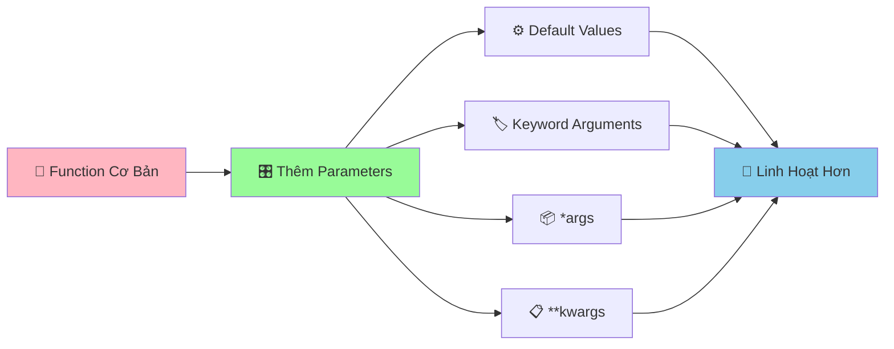

# 🎛️ Functions Parameters - Làm Functions Linh Hoạt Hơn

:::tip 🎛️ Ví Dụ Dễ Hiểu
Hãy tưởng tượng Function như một **máy nướng bánh thông minh**! Parameters là những **nút điều chỉnh** giúp bạn tùy chỉnh: nhiệt độ, thời gian, loại bánh. Có thể đặt mặc định, hoặc điều chỉnh theo ý muốn!
:::

## 🤔 Tại Sao Cần Parameters Linh Hoạt?

Trong cuộc sống, chúng ta thường cần **tùy chỉnh** theo tình huống:

- 🍕 **Đặt pizza**: Size (S/M/L), topping, độ cay
- 🚗 **Gọi taxi**: Điểm đi, điểm đến, loại xe
- 📚 **Mượn sách**: Tên sách, thời gian, có cần gia hạn không
- 🎮 **Chơi game**: Độ khó, nhân vật, chế độ chơi

Python functions cũng cần khả năng **linh hoạt** tương tự!



## 🎯 Default Values - Giá Trị Mặc Định

### 📌 Cú Pháp Cơ Bản

```python
def ten_function(param1, param2=gia_tri_mac_dinh):
    """Function với giá trị mặc định"""
    # Code thực hiện
    return ket_qua
```

### 🌟 Ví Dụ Thực Tế

```python
def chao_loi(ten, loi_chao="Xin chào", emoji="👋"):
    """Chào với lời chào tùy chỉnh"""
    print(f"{emoji} {loi_chao} {ten}!")

# Sử dụng giá trị mặc định
chao_loi("An")                    # 👋 Xin chào An!
chao_loi("Bình", "Chào mừng")     # 👋 Chào mừng Bình!
chao_loi("Châu", "Hẹn gặp lại", "👋")  # 👋 Hẹn gặp lại Châu!

# Tất cả đều hoạt động!
```

```python
def tinh_dien_tich_hcn(chieu_dai, chieu_rong=1):
    """Tính diện tích hình chữ nhật với chiều rộng mặc định"""
    return chieu_dai * chieu_rong

# Hình vuông (chiều rộng = chiều dài)
dien_tich_vuong = tinh_dien_tich_hcn(5)  # 5 * 1 = 5
print(f"Diện tích hình vuông: {dien_tich_vuong}")

# Hình chữ nhật
dien_tich_hcn = tinh_dien_tich_hcn(5, 3)  # 5 * 3 = 15
print(f"Diện tích hình chữ nhật: {dien_tich_hcn}")
```

### ⚠️ Lưu Ý Quan Trọng

```python
# ✅ ĐÚNG - Default values ở cuối
def function_tot(param1, param2, param3="default"):
    pass

# ❌ SAI - Default values ở giữa
def function_xau(param1, param2="default", param3):
    pass  # SyntaxError!
```

## 🏷️ Keyword Arguments - Tham Số Tên

### 📌 Cú Pháp

```python
# Gọi function với tên tham số
ten_function(param1=value1, param2=value2)
```

### 🌟 Ví Dụ Thực Tế

```python
def tao_thong_tin_hoc_sinh(ten, tuoi, lop, diem_tb=0.0, gioi_tinh="Không xác định"):
    """Tạo thông tin học sinh với keyword arguments"""
    thong_tin = {
        "ten": ten,
        "tuoi": tuoi,
        "lop": lop,
        "diem_tb": diem_tb,
        "gioi_tinh": gioi_tinh
    }
    return thong_tin

# Sử dụng keyword arguments - thứ tự không quan trọng!
hs_an = tao_thong_tin_hoc_sinh(
    ten="Nguyễn Văn An",
    tuoi=16,
    lop="9A",
    diem_tb=8.5,
    gioi_tinh="Nam"
)

hs_binh = tao_thong_tin_hoc_sinh(
    lop="9B",  # Thứ tự khác nhau
    ten="Trần Thị Bình",
    gioi_tinh="Nữ",
    tuoi=15,
    diem_tb=7.8
)

print("Thông tin An:", hs_an)
print("Thông tin Bình:", hs_binh)
```

### 🎯 Kết Hợp Positional và Keyword

```python
def tinh_lai_suat(tien_goc, lai_suat, so_nam, ky_han=12):
    """Tính lãi suất với keyword arguments"""
    so_ky = so_nam * ky_han
    tien_cuoi = tien_goc * (1 + lai_suat/ky_han) ** so_ky
    return tien_cuoi

# Positional arguments trước
tien_1 = tinh_lai_suat(1000000, 0.05, 3)

# Keyword arguments sau
tien_2 = tinh_lai_suat(1000000, 0.05, 3, ky_han=6)

# Tất cả keyword arguments
tien_3 = tinh_lai_suat(
    tien_goc=2000000,
    lai_suat=0.06,
    so_nam=2,
    ky_han=4
)

print(f"Lãi suất 1: {tien_1:,.0f} VNĐ")
print(f"Lãi suất 2: {tien_2:,.0f} VNĐ")
print(f"Lãi suất 3: {tien_3:,.0f} VNĐ")
```

## 📦 *args - Nhiều Tham Số

### 📌 Cú Pháp

```python
def ten_function(*args):
    """Function nhận nhiều tham số"""
    # args là một tuple chứa tất cả tham số
    pass
```

### 🌟 Ví Dụ Thực Tế

```python
def tinh_tong(*so):
    """Tính tổng của nhiều số"""
    if not so:
        return 0
    return sum(so)

# Có thể truyền bao nhiêu số cũng được!
tong_1 = tinh_tong(1, 2, 3)                    # 6
tong_2 = tinh_tong(1, 2, 3, 4, 5)              # 15
tong_3 = tinh_tong(10, 20, 30, 40, 50, 60)     # 210
tong_4 = tinh_tong()                            # 0

print(f"Tổng 1: {tong_1}")
print(f"Tổng 2: {tong_2}")
print(f"Tổng 3: {tong_3}")
print(f"Tổng 4: {tong_4}")
```

```python
def tao_danh_sach_ban_be(*ten_ban):
    """Tạo danh sách bạn bè"""
    if not ten_ban:
        return "Chưa có bạn nào"
    
    danh_sach = []
    for ten in ten_ban:
        danh_sach.append(f"👋 {ten}")
    
    return "\n".join(danh_sach)

# Có thể thêm bao nhiêu bạn cũng được!
ban_be_1 = tao_danh_sach_ban_be("An", "Bình")
ban_be_2 = tao_danh_sach_ban_be("An", "Bình", "Châu", "Dung", "Em")

print("Danh sách bạn bè 1:")
print(ban_be_1)
print("\nDanh sách bạn bè 2:")
print(ban_be_2)
```

### 🎯 Kết Hợp *args Với Tham Số Khác

```python
def tinh_diem_trung_binh(ten_hoc_sinh, *diem_cac_mon):
    """Tính điểm trung bình của học sinh"""
    if not diem_cac_mon:
        return f"{ten_hoc_sinh}: Chưa có điểm nào"
    
    diem_tb = sum(diem_cac_mon) / len(diem_cac_mon)
    return f"{ten_hoc_sinh}: {diem_tb:.1f}"

# Sử dụng
diem_an = tinh_diem_trung_binh("An", 8.5, 7.0, 9.0, 8.0)
diem_binh = tinh_diem_trung_binh("Bình", 9.0, 8.5, 7.5)
diem_chau = tinh_diem_trung_binh("Châu")  # Chưa có điểm

print(diem_an)
print(diem_binh)
print(diem_chau)
```

## 📋 **kwargs - Tham Số Từ Điển

### 📌 Cú Pháp

```python
def ten_function(**kwargs):
    """Function nhận tham số dạng từ điển"""
    # kwargs là một dictionary chứa tất cả tham số
    pass
```

### 🌟 Ví Dụ Thực Tế

```python
def tao_hoc_sinh(**thong_tin):
    """Tạo học sinh với thông tin linh hoạt"""
    hoc_sinh = {
        "ten": thong_tin.get("ten", "Chưa có tên"),
        "tuoi": thong_tin.get("tuoi", 0),
        "lop": thong_tin.get("lop", "Chưa xếp lớp"),
        "diem_tb": thong_tin.get("diem_tb", 0.0),
        "so_thich": thong_tin.get("so_thich", []),
        "dia_chi": thong_tin.get("dia_chi", "Chưa có địa chỉ")
    }
    return hoc_sinh

# Có thể truyền bất kỳ thông tin nào!
hs_an = tao_hoc_sinh(
    ten="Nguyễn Văn An",
    tuoi=16,
    lop="9A",
    diem_tb=8.5,
    so_thich=["lập trình", "đọc sách"]
)

hs_binh = tao_hoc_sinh(
    ten="Trần Thị Bình",
    tuoi=15,
    lop="9B",
    dia_chi="123 Phố Huế, Hà Nội",
    diem_tb=7.8
)

print("Học sinh An:", hs_an)
print("Học sinh Bình:", hs_binh)
```

```python
def tinh_chi_phi_du_lich(**chi_phi):
    """Tính tổng chi phí du lịch"""
    tong_chi_phi = 0
    chi_tiet = []
    
    for loai, so_tien in chi_phi.items():
        tong_chi_phi += so_tien
        chi_tiet.append(f"  {loai}: {so_tien:,} VNĐ")
    
    return tong_chi_phi, chi_tiet

# Tính chi phí du lịch
tong, chi_tiet = tinh_chi_phi_du_lich(
    khach_san=2000000,
    an_uong=1500000,
    di_chuyen=800000,
    mua_sam=1000000,
    vui_choi=500000
)

print("💰 CHI PHÍ DU LỊCH")
print("=" * 30)
for chi in chi_tiet:
    print(chi)
print("-" * 30)
print(f"Tổng cộng: {tong:,} VNĐ")
```

## 🎪 Ví Dụ Thực Tế: Hệ Thống Quản Lý Thư Viện Nâng Cao

```python
# 📚 Hệ thống quản lý thư viện với parameters linh hoạt
class ThuVienNangCao:
    def __init__(self, ten_thu_vien="Thư Viện Công Cộng"):
        self.ten_thu_vien = ten_thu_vien
        self.sach = {}
        self.nguoi_muon = {}
    
    def them_sach(self, ten_sach, tac_gia, **thong_tin_them):
        """Thêm sách với thông tin linh hoạt"""
        ma_sach = f"SH{len(self.sach) + 1:03d}"
        
        self.sach[ma_sach] = {
            "ten": ten_sach,
            "tac_gia": tac_gia,
            "the_loai": thong_tin_them.get("the_loai", "Chưa phân loại"),
            "nam_xuat_ban": thong_tin_them.get("nam_xuat_ban", "Không rõ"),
            "so_trang": thong_tin_them.get("so_trang", 0),
            "gia": thong_tin_them.get("gia", 0),
            "ngon_ngu": thong_tin_them.get("ngon_ngu", "Tiếng Việt"),
            "trang_thai": "Có sẵn"
        }
        
        print(f"✅ Đã thêm sách: {ten_sach} (Mã: {ma_sach})")
        return ma_sach
    
    def muon_sach(self, ma_sach, ten_nguoi_muon, *thong_tin_bo_sung):
        """Cho mượn sách với thông tin bổ sung"""
        if ma_sach not in self.sach:
            print(f"❌ Không tìm thấy sách {ma_sach}")
            return False
        
        if self.sach[ma_sach]["trang_thai"] != "Có sẵn":
            print(f"❌ Sách {ma_sach} đã được mượn")
            return False
        
        # Cập nhật trạng thái sách
        self.sach[ma_sach]["trang_thai"] = "Đã mượn"
        self.sach[ma_sach]["nguoi_muon"] = ten_nguoi_muon
        
        # Lưu thông tin người mượn
        self.nguoi_muon[ten_nguoi_muon] = {
            "sach_dang_muon": ma_sach,
            "ngay_muon": "2024-09-01",
            "thong_tin_bo_sung": list(thong_tin_bo_sung)
        }
        
        print(f"📖 {ten_nguoi_muon} đã mượn sách: {self.sach[ma_sach]['ten']}")
        return True
    
    def tra_sach(self, ma_sach, ten_nguoi_tra, **thong_tin_tra):
        """Trả sách với thông tin chi tiết"""
        if ma_sach not in self.sach:
            print(f"❌ Không tìm thấy sách {ma_sach}")
            return False
        
        if self.sach[ma_sach]["trang_thai"] != "Đã mượn":
            print(f"❌ Sách {ma_sach} không được mượn")
            return False
        
        if self.sach[ma_sach]["nguoi_muon"] != ten_nguoi_tra:
            print(f"❌ {ten_nguoi_tra} không phải người mượn sách này")
            return False
        
        # Cập nhật trạng thái
        self.sach[ma_sach]["trang_thai"] = "Có sẵn"
        del self.sach[ma_sach]["nguoi_muon"]
        
        # Lưu thông tin trả sách
        thong_tin_tra_sach = {
            "ngay_tra": thong_tin_tra.get("ngay_tra", "2024-09-01"),
            "tinh_trang": thong_tin_tra.get("tinh_trang", "Tốt"),
            "ghi_chu": thong_tin_tra.get("ghi_chu", "Không có")
        }
        
        print(f"📚 {ten_nguoi_tra} đã trả sách: {self.sach[ma_sach]['ten']}")
        print(f"   Tình trạng: {thong_tin_tra_sach['tinh_trang']}")
        return True
    
    def tim_sach(self, **tieu_chi):
        """Tìm sách theo nhiều tiêu chí"""
        ket_qua = []
        
        for ma_sach, thong_tin in self.sach.items():
            tim_thay = True
            
            # Kiểm tra từng tiêu chí
            for tieu_chi_key, tieu_chi_value in tieu_chi.items():
                if tieu_chi_key in thong_tin:
                    if tieu_chi_value.lower() not in str(thong_tin[tieu_chi_key]).lower():
                        tim_thay = False
                        break
                else:
                    tim_thay = False
                    break
            
            if tim_thay:
                ket_qua.append((ma_sach, thong_tin))
        
        return ket_qua
    
    def hien_thi_ket_qua_tim_kiem(self, ket_qua):
        """Hiển thị kết quả tìm kiếm"""
        if not ket_qua:
            print("😅 Không tìm thấy sách nào phù hợp")
            return
        
        print(f"\n🔍 Tìm thấy {len(ket_qua)} sách:")
        print("=" * 60)
        
        for ma_sach, thong_tin in ket_qua:
            print(f"📖 {ma_sach}: {thong_tin['ten']}")
            print(f"   Tác giả: {thong_tin['tac_gia']}")
            print(f"   Thể loại: {thong_tin['the_loai']}")
            print(f"   Trạng thái: {thong_tin['trang_thai']}")
            print("-" * 40)

# Sử dụng hệ thống
thu_vien = ThuVienNangCao("Thư Viện Trường THCS")

# Thêm sách với thông tin khác nhau
sach_1 = thu_vien.them_sach(
    "Python Programming",
    "Guido van Rossum",
    the_loai="Lập trình",
    nam_xuat_ban="2023",
    so_trang=350,
    gia=150000,
    ngon_ngu="Tiếng Anh"
)

sach_2 = thu_vien.them_sach(
    "Truyện Kiều",
    "Nguyễn Du",
    the_loai="Văn học",
    nam_xuat_ban="1820",
    so_trang=200
)

sach_3 = thu_vien.them_sach(
    "Toán học 9",
    "Bộ Giáo dục",
    the_loai="Giáo khoa",
    nam_xuat_ban="2024",
    so_trang=180,
    gia=45000
)

# Mượn sách
thu_vien.muon_sach(sach_1, "Nguyễn Văn An", "Học sinh lớp 9A", "Cần cho dự án")
thu_vien.muon_sach(sach_2, "Trần Thị Bình", "Học sinh lớp 9B")

# Tìm kiếm sách
print("\n🔍 TÌM KIẾM SÁCH")
print("=" * 30)

# Tìm theo thể loại
ket_qua_1 = thu_vien.tim_sach(the_loai="Lập trình")
print("Sách lập trình:")
thu_vien.hien_thi_ket_qua_tim_kiem(ket_qua_1)

# Tìm theo tác giả
ket_qua_2 = thu_vien.tim_sach(tac_gia="Nguyễn")
print("\nSách của tác giả có tên 'Nguyễn':")
thu_vien.hien_thi_ket_qua_tim_kiem(ket_qua_2)

# Tìm theo trạng thái
ket_qua_3 = thu_vien.tim_sach(trang_thai="Có sẵn")
print("\nSách có sẵn:")
thu_vien.hien_thi_ket_qua_tim_kiem(ket_qua_3)

# Trả sách
thu_vien.tra_sach(
    sach_1, 
    "Nguyễn Văn An",
    ngay_tra="2024-09-15",
    tinh_trang="Tốt",
    ghi_chu="Sách rất hay, đã học được nhiều"
)
```

## 🎯 Bài Tập Thực Hành

### 🥇 Bài Tập 1: Máy Tính Linh Hoạt

```python
# TODO: Tạo máy tính với parameters linh hoạt
def may_tinh_linh_hoat(phep_tinh, *so, **tuy_chon):
    """Máy tính linh hoạt với nhiều tham số"""
    
    # Kiểm tra số lượng số
    if len(so) < 2:
        return "❌ Cần ít nhất 2 số để tính toán"
    
    # Xử lý tùy chọn
    lam_tron = tuy_chon.get("lam_tron", 2)
    hien_thi_chi_tiet = tuy_chon.get("chi_tiet", False)
    
    # Thực hiện phép tính
    if phep_tinh == "+":
        ket_qua = sum(so)
        ky_hieu = " + "
    elif phep_tinh == "-":
        ket_qua = so[0] - sum(so[1:])
        ky_hieu = " - "
    elif phep_tinh == "*":
        ket_qua = 1
        for s in so:
            ket_qua *= s
        ky_hieu = " × "
    elif phep_tinh == "/":
        if 0 in so[1:]:
            return "❌ Không thể chia cho 0"
        ket_qua = so[0]
        for s in so[1:]:
            ket_qua /= s
        ky_hieu = " ÷ "
    else:
        return f"❌ Phép tính '{phep_tinh}' không được hỗ trợ"
    
    # Làm tròn kết quả
    ket_qua = round(ket_qua, lam_tron)
    
    # Tạo chuỗi hiển thị
    chuoi_so = ky_hieu.join(map(str, so))
    ket_qua_hien_thi = f"{chuoi_so} = {ket_qua}"
    
    # Hiển thị chi tiết nếu được yêu cầu
    if hien_thi_chi_tiet:
        ket_qua_hien_thi += f" (Làm tròn {lam_tron} chữ số)"
    
    return ket_qua_hien_thi

# Sử dụng máy tính linh hoạt
print("🧮 MÁY TÍNH LINH HOẠT")
print("=" * 40)

# Phép cộng nhiều số
ket_qua_1 = may_tinh_linh_hoat("+", 1, 2, 3, 4, 5)
print(ket_qua_1)

# Phép nhân với tùy chọn
ket_qua_2 = may_tinh_linh_hoat("*", 2.5, 3.7, 1.8, lam_tron=3, chi_tiet=True)
print(ket_qua_2)

# Phép chia với tùy chọn
ket_qua_3 = may_tinh_linh_hoat("/", 100, 3, lam_tron=4)
print(ket_qua_3)

# Phép trừ
ket_qua_4 = may_tinh_linh_hoat("-", 100, 20, 15, 5)
print(ket_qua_4)
```

### 🥈 Bài Tập 2: Hệ Thống Quản Lý Điểm Số

```python
# TODO: Tạo hệ thống quản lý điểm với parameters linh hoạt
def nhap_diem_hoc_sinh(ten_hoc_sinh, *diem_cac_mon, **thong_tin_bo_sung):
    """Nhập điểm học sinh với thông tin linh hoạt"""
    
    # Tạo thông tin cơ bản
    thong_tin = {
        "ten": ten_hoc_sinh,
        "diem_cac_mon": list(diem_cac_mon),
        "so_mon": len(diem_cac_mon),
        "diem_trung_binh": 0
    }
    
    # Thêm thông tin bổ sung
    thong_tin.update(thong_tin_bo_sung)
    
    # Tính điểm trung bình
    if diem_cac_mon:
        thong_tin["diem_trung_binh"] = sum(diem_cac_mon) / len(diem_cac_mon)
    
    # Xếp loại
    diem_tb = thong_tin["diem_trung_binh"]
    if diem_tb >= 9.0:
        thong_tin["xep_loai"] = "Xuất sắc"
    elif diem_tb >= 8.0:
        thong_tin["xep_loai"] = "Giỏi"
    elif diem_tb >= 6.5:
        thong_tin["xep_loai"] = "Khá"
    elif diem_tb >= 5.0:
        thong_tin["xep_loai"] = "Trung bình"
    else:
        thong_tin["xep_loai"] = "Yếu"
    
    return thong_tin

def hien_thi_bao_cao_hoc_sinh(*danh_sach_hoc_sinh, **tuy_chon_hien_thi):
    """Hiển thị báo cáo học sinh với tùy chọn"""
    
    # Tùy chọn hiển thị
    hien_thi_chi_tiet = tuy_chon_hien_thi.get("chi_tiet", False)
    sap_xep_theo = tuy_chon_hien_thi.get("sap_xep", "diem_tb")
    nguong_diem = tuy_chon_hien_thi.get("nguong", 0)
    
    # Lọc học sinh theo ngưỡng điểm
    hoc_sinh_loc = [hs for hs in danh_sach_hoc_sinh if hs["diem_trung_binh"] >= nguong_diem]
    
    # Sắp xếp
    if sap_xep_theo == "diem_tb":
        hoc_sinh_loc.sort(key=lambda x: x["diem_trung_binh"], reverse=True)
    elif sap_xep_theo == "ten":
        hoc_sinh_loc.sort(key=lambda x: x["ten"])
    
    # Hiển thị
    print(f"\n📊 BÁO CÁO HỌC SINH ({len(hoc_sinh_loc)} học sinh)")
    print("=" * 60)
    
    for i, hs in enumerate(hoc_sinh_loc, 1):
        print(f"{i:2d}. {hs['ten']}")
        print(f"    Điểm TB: {hs['diem_trung_binh']:.1f} - {hs['xep_loai']}")
        
        if hien_thi_chi_tiet:
            print(f"    Số môn: {hs['so_mon']}")
            if hs['diem_cac_mon']:
                diem_str = ", ".join([f"{d:.1f}" for d in hs['diem_cac_mon']])
                print(f"    Điểm các môn: {diem_str}")
            
            # Hiển thị thông tin bổ sung
            for key, value in hs.items():
                if key not in ["ten", "diem_cac_mon", "so_mon", "diem_trung_binh", "xep_loai"]:
                    print(f"    {key}: {value}")
        print()

# Sử dụng hệ thống
print("📚 HỆ THỐNG QUẢN LÝ ĐIỂM SỐ")
print("=" * 40)

# Nhập điểm học sinh
hs_an = nhap_diem_hoc_sinh(
    "Nguyễn Văn An",
    8.5, 7.0, 9.0, 8.0, 7.5,
    lop="9A",
    gioi_tinh="Nam",
    dia_chi="123 Phố Huế"
)

hs_binh = nhap_diem_hoc_sinh(
    "Trần Thị Bình",
    9.0, 8.5, 7.5, 8.0, 9.5,
    lop="9B",
    gioi_tinh="Nữ",
    so_thich=["đọc sách", "vẽ tranh"]
)

hs_chau = nhap_diem_hoc_sinh(
    "Lê Văn Châu",
    6.5, 7.0, 6.0, 7.5, 6.8,
    lop="9A",
    gioi_tinh="Nam"
)

# Hiển thị báo cáo
hien_thi_bao_cao_hoc_sinh(
    hs_an, hs_binh, hs_chau,
    chi_tiet=True,
    sap_xep="diem_tb",
    nguong=7.0
)
```

## 🎊 Tóm Tắt

Trong bài này, bạn đã học được:

✅ **Default values** - Giá trị mặc định cho parameters  
✅ **Keyword arguments** - Gọi function với tên tham số  
✅ **Positional + Keyword** - Kết hợp cả hai cách  
✅ ***args** - Nhận nhiều tham số dạng tuple  
✅ ****kwargs** - Nhận tham số dạng dictionary  
✅ **Ứng dụng thực tế** - Hệ thống thư viện, máy tính, quản lý điểm  

## 🚀 Bước Tiếp Theo

Tuyệt vời! Bây giờ bạn đã biết cách tạo **functions siêu linh hoạt**! Tiếp theo, chúng ta sẽ học về [Tuples](/python/intermediate/tuples) - cấu trúc dữ liệu **không thể thay đổi** nhưng rất hữu ích!

:::tip 🎯 Thử Thách Nhỏ
Hãy thử tạo một "hệ thống đặt hàng pizza" với parameters linh hoạt! Cho phép chọn size, toppings, độ cay, thời gian giao hàng, và các tùy chọn đặc biệt khác!
:::

---

*🔗 **Bài tiếp theo**: [Tuples - Cấu Trúc Dữ Liệu Không Thay Đổi](/python/intermediate/tuples)*
