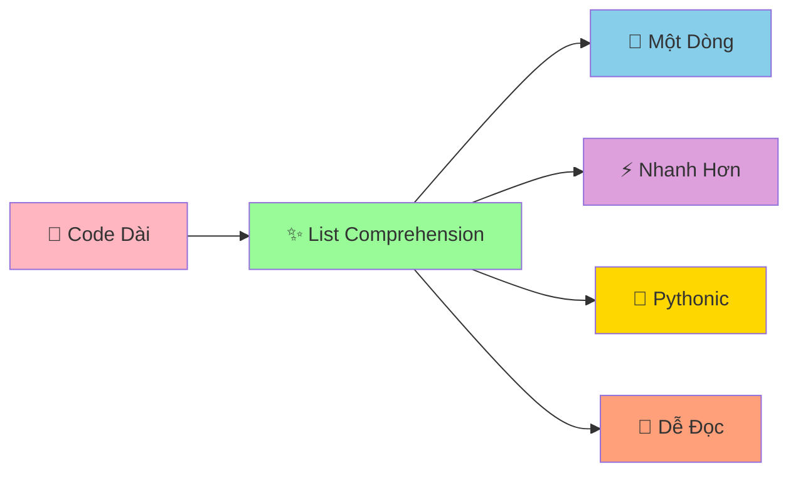

# ⚡ List Comprehension – Viết gọn mà rõ

::::tip Tư duy ngắn gọn
List comprehension giống như công thức pha chế: lấy nguyên liệu (for), lọc (if), rồi chế biến (biểu thức).
::::

## 🍳 Cú pháp cơ bản

```python
# [expression for item in iterable if condition]
squares = [n * n for n in range(6)]          # [0, 1, 4, 9, 16, 25]
evens = [n for n in range(10) if n % 2 == 0] # [0, 2, 4, 6, 8]
```

## 🧹 Làm sạch dữ liệu

```python
raw_data = ["  xin ", " chao", "ban  "]
clean_data = [s.strip() for s in raw_data]  # ['xin', 'chao', 'ban']
```

## 🧭 Lồng nhau (cẩn thận readability)

```python
matrix = [[1, 2], [3, 4], [5, 6]]
flatten = [x for row in matrix for x in row]  # [1,2,3,4,5,6]
```

## 🧰 Set & Dict comprehension

```python
numbers = [1, 2, 2, 3]
unique_doubles = {n * 2 for n in numbers}           # {2, 4, 6}
square_mapping = {n: n * n for n in range(4)}   # {0:0, 1:1, 2:4, 3:9}
```

## 🚨 Lưu ý quan trọng

- Đừng nhồi nhét quá nhiều logic → khó đọc. Ưu tiên rõ ràng.
- Dùng biến tên có nghĩa; tránh dùng một chữ.
- Tránh side-effects trong expression.

## 🧪 Bài tập nhanh

1) Tạo danh sách bình phương của số lẻ từ 1..20.
2) Cho danh sách chuỗi, tạo dict `{chuoi: độ dài}`.
3) Làm phẳng danh sách 3 chiều `data = [[[1],[2]], [[3],[4]]]`.

---

👉 Dùng list comprehension để xử lý dữ liệu đầu vào trong các dự án (ví dụ chuẩn hoá danh sách email, lọc ký tự hợp lệ...).

---
sidebar_position: 12
title: "✨ List Comprehension - Cú Pháp Pythonic Siêu Mạnh"
description: "Học list comprehension trong Python: cú pháp ngắn gọn, hiệu quả cao, và rất Pythonic. Biến code dài thành một dòng!"
keywords: ["python", "list comprehension", "pythonic", "efficient", "one-liner", "functional programming", "cú pháp ngắn gọn"]
---

# ✨ List Comprehension - Cú Pháp Pythonic Siêu Mạnh

:::tip ✨ Ví Dụ Dễ Hiểu
Hãy tưởng tượng List Comprehension như một **máy biến đổi siêu tốc**! Thay vì phải viết nhiều dòng code để tạo danh sách, bạn chỉ cần **một dòng** là có ngay kết quả! Giống như có một phù thủy biến đổi mọi thứ trong nháy mắt!
:::

## 🤔 List Comprehension Là Gì?

**List Comprehension** là cách viết **ngắn gọn và hiệu quả** để tạo danh sách mới từ danh sách cũ. Thay vì viết vòng lặp dài, bạn có thể tạo danh sách chỉ trong **một dòng code**!



### 🆚 So Sánh Với Code Thông Thường

```python
# ❌ Cách cũ - vòng lặp dài
even_numbers = []
for i in range(1, 11):
    if i % 2 == 0:
        even_numbers.append(i)
print("Số chẵn:", even_numbers)  # [2, 4, 6, 8, 10]

# ✅ Cách mới - list comprehension
even_numbers = [i for i in range(1, 11) if i % 2 == 0]
print("Số chẵn:", even_numbers)  # [2, 4, 6, 8, 10]
```

## 🎯 Cú Pháp Cơ Bản

### 📌 Cú Pháp Tổng Quát

```python
# Cú pháp cơ bản
[expression for item in iterable if condition]

# Tương đương với:
result = []
for item in iterable:
    if condition:
        result.append(expression)
```

### 🌟 Ví Dụ Cơ Bản

```python
# Tạo danh sách số bình phương
squares = [x**2 for x in range(1, 6)]
print("Bình phương:", squares)  # [1, 4, 9, 16, 25]

# Tạo danh sách số chẵn
even_numbers = [x for x in range(1, 11) if x % 2 == 0]
print("Số chẵn:", even_numbers)  # [2, 4, 6, 8, 10]

# Tạo danh sách chuỗi
names = ["An", "Bình", "Châu", "Dung"]
uppercase_names = [name.upper() for name in names]
print("Tên chữ hoa:", uppercase_names)  # ['AN', 'BÌNH', 'CHÂU', 'DUNG']

# Tạo danh sách độ dài
name_lengths = [len(name) for name in names]
print("Độ dài tên:", name_lengths)  # [2, 4, 4, 4]
```

## 🎨 Các Loại List Comprehension

### 🔢 Comprehension Với Điều Kiện

```python
# Điều kiện đơn giản
odd_numbers = [x for x in range(1, 11) if x % 2 == 1]
print("Số lẻ:", odd_numbers)  # [1, 3, 5, 7, 9]

# Điều kiện phức tạp
divisible_by_three = [x for x in range(1, 21) if x % 3 == 0]
print("Số chia hết cho 3:", divisible_by_three)  # [3, 6, 9, 12, 15, 18]

# Điều kiện với nhiều điều kiện
special_numbers = [x for x in range(1, 21) if x % 2 == 0 and x % 3 == 0]
print("Số chia hết cho cả 2 và 3:", special_numbers)  # [6, 12, 18]
```

### 🎯 Comprehension Với Biến Đổi

```python
# Biến đổi số
original_numbers = [1, 2, 3, 4, 5]
doubled_numbers = [x * 2 for x in original_numbers]
print("Nhân 2:", doubled_numbers)  # [2, 4, 6, 8, 10]

# Biến đổi chuỗi
words = ["python", "java", "c++", "javascript"]
uppercase_words = [word.upper() for word in words]
print("Chữ hoa:", uppercase_words)  # ['PYTHON', 'JAVA', 'C++', 'JAVASCRIPT']

# Biến đổi với điều kiện
long_words = [word.upper() for word in words if len(word) > 3]
print("Từ dài hơn 3 ký tự:", long_words)  # ['PYTHON', 'JAVA', 'JAVASCRIPT']
```

### 🔄 Comprehension Với Nested Loops

```python
# Nested loops - vòng lặp lồng nhau
products = [i * j for i in range(1, 4) for j in range(1, 4)]
print("Tích số:", products)  # [1, 2, 3, 2, 4, 6, 3, 6, 9]

# Tạo bảng cửu chương
multiplication_table = [f"{i} x {j} = {i*j}" for i in range(1, 4) for j in range(1, 4)]
print("Bảng cửu chương:")
for equation in multiplication_table:
    print(equation)

# Tạo tọa độ
coordinates = [(x, y) for x in range(3) for y in range(3)]
print("Tọa độ:", coordinates)  # [(0, 0), (0, 1), (0, 2), (1, 0), (1, 1), (1, 2), (2, 0), (2, 1), (2, 2)]
```

## 🎪 Ví Dụ Thực Tế: Hệ Thống Xử Lý Dữ Liệu

```python
# 📊 Hệ thống xử lý dữ liệu với list comprehension
class DataProcessor:
    def __init__(self):
        self.raw_data = []
        self.processed_data = []
    
    def input_data(self, data):
        """Nhập dữ liệu cần xử lý"""
        self.raw_data = data
        print(f"✅ Đã nhập {len(data)} mục dữ liệu")
    
    def filter_positive_numbers(self):
        """Lọc số dương"""
        positive_numbers = [x for x in self.raw_data if isinstance(x, (int, float)) and x > 0]
        print(f"📊 Số dương: {positive_numbers}")
        return positive_numbers
    
    def filter_even_numbers(self):
        """Lọc số chẵn"""
        even_numbers = [x for x in self.raw_data if isinstance(x, int) and x % 2 == 0]
        print(f"📊 Số chẵn: {even_numbers}")
        return even_numbers
    
    def calculate_squares(self):
        """Tính bình phương"""
        squares = [x**2 for x in self.raw_data if isinstance(x, (int, float))]
        print(f"📊 Bình phương: {squares}")
        return squares
    
    def filter_long_strings(self, min_length=3):
        """Lọc chuỗi dài"""
        long_strings = [s for s in self.raw_data if isinstance(s, str) and len(s) >= min_length]
        print(f"📊 Chuỗi dài (≥{min_length}): {long_strings}")
        return long_strings
    
    def convert_to_uppercase(self):
        """Chuyển thành chữ hoa"""
        uppercase_strings = [s.upper() for s in self.raw_data if isinstance(s, str)]
        print(f"📊 Chữ hoa: {uppercase_strings}")
        return uppercase_strings
    
    def create_number_pairs(self):
        """Tạo cặp số từ danh sách"""
        numbers = [x for x in self.raw_data if isinstance(x, (int, float))]
        number_pairs = [(numbers[i], numbers[i+1]) for i in range(0, len(numbers)-1, 2)]
        print(f"📊 Cặp số: {number_pairs}")
        return number_pairs
    
    def calculate_statistics(self):
        """Tính thống kê cơ bản"""
        numbers = [x for x in self.raw_data if isinstance(x, (int, float))]
        
        if not numbers:
            print("📊 Không có số để thống kê")
            return
        
        # Thống kê cơ bản
        total = sum(numbers)
        average = total / len(numbers)
        max_number = max(numbers)
        min_number = min(numbers)
        
        # Số dương và âm
        positive_numbers = [x for x in numbers if x > 0]
        negative_numbers = [x for x in numbers if x < 0]
        
        print(f"\n📊 THỐNG KÊ DỮ LIỆU")
        print("=" * 30)
        print(f"Tổng: {total}")
        print(f"Trung bình: {average:.2f}")
        print(f"Số lớn nhất: {max_number}")
        print(f"Số nhỏ nhất: {min_number}")
        print(f"Số dương: {len(positive_numbers)}")
        print(f"Số âm: {len(negative_numbers)}")
    
    def generate_report(self):
        """Tạo báo cáo tổng hợp"""
        print(f"\n📋 BÁO CÁO XỬ LÝ DỮ LIỆU")
        print("=" * 40)
        print(f"Dữ liệu gốc: {self.raw_data}")
        
        # Các loại dữ liệu
        numbers = [x for x in self.raw_data if isinstance(x, (int, float))]
        strings = [x for x in self.raw_data if isinstance(x, str)]
        others = [x for x in self.raw_data if not isinstance(x, (int, float, str))]
        
        print(f"Số: {numbers}")
        print(f"Chuỗi: {strings}")
        if others:
            print(f"Khác: {others}")
        
        # Thống kê
        self.calculate_statistics()

# Sử dụng hệ thống
processor = DataProcessor()

# Dữ liệu mẫu
sample_data = [1, -2, 3, "Python", 4.5, "Java", -1.5, "C++", 0, "JavaScript", 7, 8.9]

# Xử lý dữ liệu
processor.input_data(sample_data)
processor.filter_positive_numbers()
processor.filter_even_numbers()
processor.calculate_squares()
processor.filter_long_strings()
processor.convert_to_uppercase()
processor.create_number_pairs()
processor.generate_report()
```

## 🎯 Bài Tập Thực Hành

### 🥇 Bài Tập 1: Hệ Thống Quản Lý Học Sinh

```python
# TODO: Tạo hệ thống quản lý học sinh với list comprehension
class StudentManager:
    def __init__(self):
        self.student_list = []
    
    def add_student(self, name, age, class_name, score):
        """Thêm học sinh mới"""
        student = {
            "name": name,
            "age": age,
            "class": class_name,
            "score": score
        }
        self.student_list.append(student)
        print(f"✅ Đã thêm học sinh: {name}")
    
    def filter_by_class(self, class_name):
        """Lọc học sinh theo lớp"""
        class_students = [s for s in self.student_list if s["class"] == class_name]
        print(f"📚 Học sinh lớp {class_name}: {len(class_students)} em")
        return class_students
    
    def filter_excellent_students(self, min_score=8.0):
        """Lọc học sinh giỏi"""
        excellent_students = [s for s in self.student_list if s["score"] >= min_score]
        print(f"🌟 Học sinh giỏi (≥{min_score}): {len(excellent_students)} em")
        return excellent_students
    
    def get_student_names(self):
        """Lấy danh sách tên học sinh"""
        student_names = [s["name"] for s in self.student_list]
        print(f"👥 Danh sách tên: {student_names}")
        return student_names
    
    def get_student_scores(self):
        """Lấy danh sách điểm học sinh"""
        student_scores = [s["score"] for s in self.student_list]
        print(f"📊 Danh sách điểm: {student_scores}")
        return student_scores
    
    def calculate_class_average(self, class_name):
        """Tính điểm trung bình của lớp"""
        class_scores = [s["score"] for s in self.student_list if s["class"] == class_name]
        if class_scores:
            average_score = sum(class_scores) / len(class_scores)
            print(f"📊 Điểm TB lớp {class_name}: {average_score:.2f}")
            return average_score
        else:
            print(f"❌ Không có học sinh nào trong lớp {class_name}")
            return 0
    
    def find_highest_score_student(self):
        """Tìm học sinh có điểm cao nhất"""
        if not self.student_list:
            print("❌ Chưa có học sinh nào")
            return None
        
        highest_score = max(s["score"] for s in self.student_list)
        top_students = [s for s in self.student_list if s["score"] == highest_score]
        
        print(f"🏆 Học sinh có điểm cao nhất ({highest_score}):")
        for student in top_students:
            print(f"   - {student['name']} (Lớp {student['class']})")
        
        return top_students
    
    def generate_class_report(self):
        """Tạo báo cáo theo lớp"""
        if not self.student_list:
            print("❌ Chưa có học sinh nào")
            return
        
        # Lấy danh sách lớp
        class_list = list(set(s["class"] for s in self.student_list))
        
        print(f"\n📋 BÁO CÁO THEO LỚP")
        print("=" * 50)
        
        for class_name in sorted(class_list):
            class_students = [s for s in self.student_list if s["class"] == class_name]
            class_scores = [s["score"] for s in class_students]
            
            print(f"\n📚 LỚP {class_name} ({len(class_students)} học sinh)")
            print("-" * 30)
            
            # Thống kê điểm
            if class_scores:
                average_score = sum(class_scores) / len(class_scores)
                highest_score = max(class_scores)
                lowest_score = min(class_scores)
                
                print(f"Điểm TB: {average_score:.2f}")
                print(f"Điểm cao nhất: {highest_score}")
                print(f"Điểm thấp nhất: {lowest_score}")
                
                # Học sinh giỏi
                excellent_students = [s for s in class_students if s["score"] >= 8.0]
                print(f"Học sinh giỏi: {len(excellent_students)} em")
                
                # Danh sách học sinh
                for student in class_students:
                    grade = "Giỏi" if student["score"] >= 8.0 else "Khá" if student["score"] >= 6.5 else "TB"
                    print(f"   {student['name']}: {student['score']} ({grade})")
    
    def generate_summary_report(self):
        """Tạo báo cáo tổng hợp"""
        if not self.student_list:
            print("❌ Chưa có học sinh nào")
            return
        
        print(f"\n📊 BÁO CÁO TỔNG HỢP")
        print("=" * 40)
        
        # Thống kê tổng
        total_students = len(self.student_list)
        all_scores = [s["score"] for s in self.student_list]
        overall_average = sum(all_scores) / len(all_scores)
        
        print(f"Tổng học sinh: {total_students}")
        print(f"Điểm TB tổng: {overall_average:.2f}")
        
        # Thống kê theo xếp loại
        excellent_students = [s for s in self.student_list if s["score"] >= 8.0]
        good_students = [s for s in self.student_list if 6.5 <= s["score"] < 8.0]
        average_students = [s for s in self.student_list if s["score"] < 6.5]
        
        print(f"\n📈 THỐNG KÊ XẾP LOẠI:")
        print(f"Giỏi (≥8.0): {len(excellent_students)} em ({len(excellent_students)/total_students*100:.1f}%)")
        print(f"Khá (6.5-7.9): {len(good_students)} em ({len(good_students)/total_students*100:.1f}%)")
        print(f"TB (<6.5): {len(average_students)} em ({len(average_students)/total_students*100:.1f}%)")
        
        # Top 5 học sinh
        top_5 = sorted(self.student_list, key=lambda x: x["score"], reverse=True)[:5]
        print(f"\n🏆 TOP 5 HỌC SINH:")
        for i, student in enumerate(top_5, 1):
            print(f"   {i}. {student['name']} (Lớp {student['class']}): {student['score']}")

# Sử dụng hệ thống
manager = StudentManager()

# Thêm học sinh
sample_students = [
    ("Nguyễn Văn An", 16, "9A", 8.5),
    ("Trần Thị Bình", 15, "9A", 7.8),
    ("Lê Văn Châu", 16, "9B", 9.0),
    ("Phạm Thị Dung", 15, "9B", 6.5),
    ("Hoàng Văn Em", 16, "9A", 8.0),
    ("Vũ Thị Phương", 15, "9B", 7.5),
    ("Đặng Văn Giang", 16, "9A", 9.5),
    ("Bùi Thị Hoa", 15, "9B", 8.2)
]

for name, age, class_name, score in sample_students:
    manager.add_student(name, age, class_name, score)

# Tạo báo cáo
manager.generate_class_report()
manager.generate_summary_report()
```

### 🥈 Bài Tập 2: Game Tạo Mật Khẩu

```python
# TODO: Tạo game tạo mật khẩu với list comprehension
import random
import string

class PasswordGenerator:
    def __init__(self):
        self.lowercase_chars = string.ascii_lowercase
        self.uppercase_chars = string.ascii_uppercase
        self.digit_chars = string.digits
        self.special_chars = "!@#$%^&*()_+-=[]{}|;:,.<>?"
    
    def generate_basic_password(self, length=8):
        """Tạo mật khẩu cơ bản"""
        # Tạo mật khẩu với chữ thường và số
        valid_chars = self.lowercase_chars + self.digit_chars
        password = [random.choice(valid_chars) for _ in range(length)]
        return ''.join(password)
    
    def generate_strong_password(self, length=12):
        """Tạo mật khẩu mạnh"""
        # Đảm bảo có ít nhất 1 ký tự từ mỗi loại
        password = [
            random.choice(self.lowercase_chars),
            random.choice(self.uppercase_chars),
            random.choice(self.digit_chars),
            random.choice(self.special_chars)
        ]
        
        # Thêm ký tự ngẫu nhiên
        all_chars = self.lowercase_chars + self.uppercase_chars + self.digit_chars + self.special_chars
        password.extend([random.choice(all_chars) for _ in range(length - 4)])
        
        # Xáo trộn
        random.shuffle(password)
        return ''.join(password)
    
    def generate_password_from_word(self, base_word):
        """Tạo mật khẩu từ từ gốc"""
        # Biến đổi từ gốc
        password = []
        
        for char in base_word:
            if char.isalpha():
                # Thay thế chữ cái
                if char.islower():
                    password.append(char.upper())
                else:
                    password.append(char.lower())
            else:
                password.append(char)
        
        # Thêm số và ký tự đặc biệt
        password.extend([random.choice(self.digit_chars) for _ in range(2)])
        password.extend([random.choice(self.special_chars) for _ in range(2)])
        
        # Xáo trộn
        random.shuffle(password)
        return ''.join(password)
    
    def evaluate_password(self, password):
        """Đánh giá độ mạnh của mật khẩu"""
        score = 0
        
        # Độ dài
        if len(password) >= 8:
            score += 2
        elif len(password) >= 6:
            score += 1
        
        # Chữ thường
        if any(c.islower() for c in password):
            score += 1
        
        # Chữ hoa
        if any(c.isupper() for c in password):
            score += 1
        
        # Số
        if any(c.isdigit() for c in password):
            score += 1
        
        # Ký tự đặc biệt
        if any(c in self.special_chars for c in password):
            score += 1
        
        # Đánh giá
        if score >= 6:
            return "Rất mạnh", score
        elif score >= 4:
            return "Mạnh", score
        elif score >= 2:
            return "Trung bình", score
        else:
            return "Yếu", score
    
    def generate_multiple_passwords(self, count=5, length=10):
        """Tạo nhiều mật khẩu"""
        password_list = [self.generate_strong_password(length) for _ in range(count)]
        
        print(f"\n🔐 {count} MẬT KHẨU MẠNH")
        print("=" * 50)
        
        for i, password in enumerate(password_list, 1):
            evaluation, score = self.evaluate_password(password)
            print(f"{i:2d}. {password} - {evaluation} ({score}/6)")
        
        return password_list
    
    def password_game(self):
        """Game tạo mật khẩu chính"""
        print("🔐 GAME TẠO MẬT KHẨU")
        print("=" * 40)
        print("1. Tạo mật khẩu cơ bản")
        print("2. Tạo mật khẩu mạnh")
        print("3. Tạo mật khẩu từ từ gốc")
        print("4. Tạo nhiều mật khẩu")
        print("5. Đánh giá mật khẩu")
        print("6. Thoát")
        print("-" * 40)
        
        while True:
            try:
                choice = input("👉 Chọn chức năng (1-6): ").strip()
                
                if choice == "1":
                    length = int(input("Nhập độ dài mật khẩu (mặc định 8): ") or "8")
                    password = self.generate_basic_password(length)
                    evaluation, score = self.evaluate_password(password)
                    print(f"🔐 Mật khẩu cơ bản: {password}")
                    print(f"📊 Đánh giá: {evaluation} ({score}/6)")
                
                elif choice == "2":
                    length = int(input("Nhập độ dài mật khẩu (mặc định 12): ") or "12")
                    password = self.generate_strong_password(length)
                    evaluation, score = self.evaluate_password(password)
                    print(f"🔐 Mật khẩu mạnh: {password}")
                    print(f"📊 Đánh giá: {evaluation} ({score}/6)")
                
                elif choice == "3":
                    base_word = input("Nhập từ gốc: ").strip()
                    if base_word:
                        password = self.generate_password_from_word(base_word)
                        evaluation, score = self.evaluate_password(password)
                        print(f"🔐 Mật khẩu từ '{base_word}': {password}")
                        print(f"📊 Đánh giá: {evaluation} ({score}/6)")
                    else:
                        print("❌ Vui lòng nhập từ gốc!")
                
                elif choice == "4":
                    count = int(input("Nhập số lượng mật khẩu (mặc định 5): ") or "5")
                    length = int(input("Nhập độ dài mật khẩu (mặc định 10): ") or "10")
                    self.generate_multiple_passwords(count, length)
                
                elif choice == "5":
                    password = input("Nhập mật khẩu cần đánh giá: ").strip()
                    if password:
                        evaluation, score = self.evaluate_password(password)
                        print(f"📊 Đánh giá mật khẩu '{password}': {evaluation} ({score}/6)")
                    else:
                        print("❌ Vui lòng nhập mật khẩu!")
                
                elif choice == "6":
                    print("👋 Tạm biệt!")
                    break
                
                else:
                    print("❌ Lựa chọn không hợp lệ!")
                
                print("-" * 40)
                
            except ValueError:
                print("❌ Vui lòng nhập số hợp lệ!")
            except KeyboardInterrupt:
                print("\n👋 Tạm biệt!")
                break

# Chạy game
game = PasswordGenerator()
game.password_game()
```

## 🎊 Tóm Tắt

Trong bài này, bạn đã học được:

✅ **Cú pháp cơ bản** - `[expression for item in iterable if condition]`  
✅ **Comprehension với điều kiện** - Lọc dữ liệu thông minh  
✅ **Comprehension với biến đổi** - Transform dữ liệu  
✅ **Nested loops** - Vòng lặp lồng nhau trong một dòng  
✅ **Ứng dụng thực tế** - Xử lý dữ liệu, quản lý học sinh, tạo mật khẩu  
✅ **Lợi ích** - Code ngắn gọn, hiệu quả, Pythonic  

## 🚀 Bước Tiếp Theo

Tuyệt vời! Bây giờ bạn đã thành thạo **cú pháp Pythonic siêu mạnh**! Tiếp theo, chúng ta sẽ học về [Error Handling](/python/intermediate/error-handling) - cách xử lý lỗi chuyên nghiệp với try/except!

:::tip 🎯 Thử Thách Nhỏ
Hãy thử tạo một "hệ thống phân tích dữ liệu" sử dụng list comprehension! Phân tích file CSV, tạo báo cáo thống kê, và trực quan hóa dữ liệu!
:::

---

*🔗 **Bài tiếp theo**: [Error Handling - Xử Lý Lỗi Chuyên Nghiệp](/python/intermediate/error-handling)*
