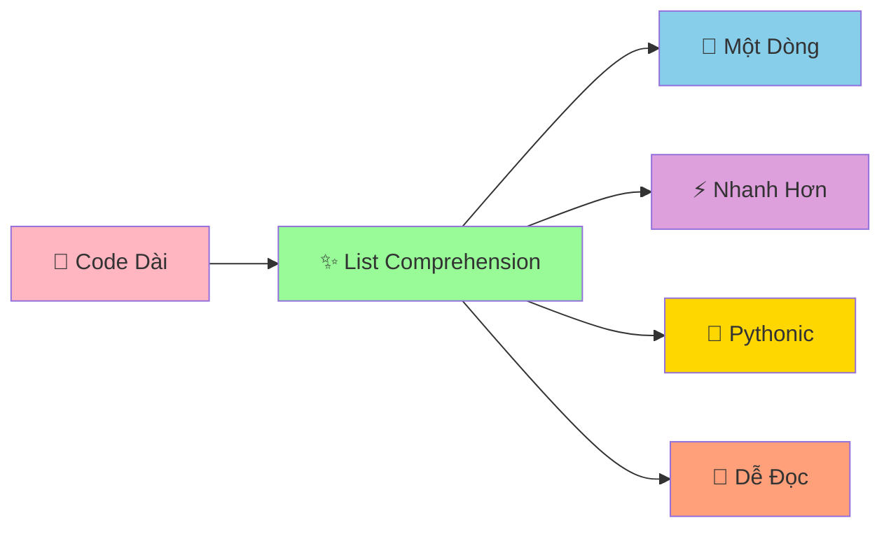

# ⚡ List Comprehension – Viết gọn mà rõ

::::tip Tư duy ngắn gọn
List comprehension giống như công thức pha chế: lấy nguyên liệu (for), lọc (if), rồi chế biến (biểu thức).
::::

## 🍳 Cú pháp cơ bản

```python
# [expression for item in iterable if condition]
squares = [n * n for n in range(6)]          # [0, 1, 4, 9, 16, 25]
evens = [n for n in range(10) if n % 2 == 0] # [0, 2, 4, 6, 8]
```

## 🧹 Làm sạch dữ liệu

```python
raw = ["  xin ", " chao", "ban  "]
clean = [s.strip() for s in raw]  # ['xin', 'chao', 'ban']
```

## 🧭 Lồng nhau (cẩn thận readability)

```python
matrix = [[1, 2], [3, 4], [5, 6]]
flatten = [x for row in matrix for x in row]  # [1,2,3,4,5,6]
```

## 🧰 Set & Dict comprehension

```python
nums = [1, 2, 2, 3]
unique = {n * 2 for n in nums}           # {2, 4, 6}
mapping = {n: n * n for n in range(4)}   # {0:0, 1:1, 2:4, 3:9}
```

## 🚨 Lưu ý quan trọng

- Đừng nhồi nhét quá nhiều logic → khó đọc. Ưu tiên rõ ràng.
- Dùng biến tên có nghĩa; tránh dùng một chữ.
- Tránh side-effects trong expression.

## 🧪 Bài tập nhanh

1) Tạo danh sách bình phương của số lẻ từ 1..20.
2) Cho danh sách chuỗi, tạo dict `{chuoi: độ dài}`.
3) Làm phẳng danh sách 3 chiều `data = [[[1],[2]], [[3],[4]]]`.

---

👉 Dùng list comprehension để xử lý dữ liệu đầu vào trong các dự án (ví dụ chuẩn hoá danh sách email, lọc ký tự hợp lệ...).

---
sidebar_position: 12
title: "✨ List Comprehension - Cú Pháp Pythonic Siêu Mạnh"
description: "Học list comprehension trong Python: cú pháp ngắn gọn, hiệu quả cao, và rất Pythonic. Biến code dài thành một dòng!"
keywords: ["python", "list comprehension", "pythonic", "efficient", "one-liner", "functional programming", "cú pháp ngắn gọn"]
---

# ✨ List Comprehension - Cú Pháp Pythonic Siêu Mạnh

:::tip ✨ Ví Dụ Dễ Hiểu
Hãy tưởng tượng List Comprehension như một **máy biến đổi siêu tốc**! Thay vì phải viết nhiều dòng code để tạo danh sách, bạn chỉ cần **một dòng** là có ngay kết quả! Giống như có một phù thủy biến đổi mọi thứ trong nháy mắt!
:::

## 🤔 List Comprehension Là Gì?

**List Comprehension** là cách viết **ngắn gọn và hiệu quả** để tạo danh sách mới từ danh sách cũ. Thay vì viết vòng lặp dài, bạn có thể tạo danh sách chỉ trong **một dòng code**!



### 🆚 So Sánh Với Code Thông Thường

```python
# ❌ Cách cũ - vòng lặp dài
so_chan = []
for i in range(1, 11):
    if i % 2 == 0:
        so_chan.append(i)
print("Số chẵn:", so_chan)  # [2, 4, 6, 8, 10]

# ✅ Cách mới - list comprehension
so_chan = [i for i in range(1, 11) if i % 2 == 0]
print("Số chẵn:", so_chan)  # [2, 4, 6, 8, 10]
```

## 🎯 Cú Pháp Cơ Bản

### 📌 Cú Pháp Tổng Quát

```python
# Cú pháp cơ bản
[expression for item in iterable if condition]

# Tương đương với:
result = []
for item in iterable:
    if condition:
        result.append(expression)
```

### 🌟 Ví Dụ Cơ Bản

```python
# Tạo danh sách số bình phương
binh_phuong = [x**2 for x in range(1, 6)]
print("Bình phương:", binh_phuong)  # [1, 4, 9, 16, 25]

# Tạo danh sách số chẵn
so_chan = [x for x in range(1, 11) if x % 2 == 0]
print("Số chẵn:", so_chan)  # [2, 4, 6, 8, 10]

# Tạo danh sách chuỗi
ten = ["An", "Bình", "Châu", "Dung"]
ten_hoa = [name.upper() for name in ten]
print("Tên chữ hoa:", ten_hoa)  # ['AN', 'BÌNH', 'CHÂU', 'DUNG']

# Tạo danh sách độ dài
do_dai = [len(name) for name in ten]
print("Độ dài tên:", do_dai)  # [2, 4, 4, 4]
```

## 🎨 Các Loại List Comprehension

### 🔢 Comprehension Với Điều Kiện

```python
# Điều kiện đơn giản
so_le = [x for x in range(1, 11) if x % 2 == 1]
print("Số lẻ:", so_le)  # [1, 3, 5, 7, 9]

# Điều kiện phức tạp
so_chia_het_3 = [x for x in range(1, 21) if x % 3 == 0]
print("Số chia hết cho 3:", so_chia_het_3)  # [3, 6, 9, 12, 15, 18]

# Điều kiện với nhiều điều kiện
so_dac_biet = [x for x in range(1, 21) if x % 2 == 0 and x % 3 == 0]
print("Số chia hết cho cả 2 và 3:", so_dac_biet)  # [6, 12, 18]
```

### 🎯 Comprehension Với Biến Đổi

```python
# Biến đổi số
so_goc = [1, 2, 3, 4, 5]
so_nhan_2 = [x * 2 for x in so_goc]
print("Nhân 2:", so_nhan_2)  # [2, 4, 6, 8, 10]

# Biến đổi chuỗi
tu = ["python", "java", "c++", "javascript"]
tu_hoa = [word.upper() for word in tu]
print("Chữ hoa:", tu_hoa)  # ['PYTHON', 'JAVA', 'C++', 'JAVASCRIPT']

# Biến đổi với điều kiện
tu_dai = [word.upper() for word in tu if len(word) > 3]
print("Từ dài hơn 3 ký tự:", tu_dai)  # ['PYTHON', 'JAVA', 'JAVASCRIPT']
```

### 🔄 Comprehension Với Nested Loops

```python
# Nested loops - vòng lặp lồng nhau
tich_so = [i * j for i in range(1, 4) for j in range(1, 4)]
print("Tích số:", tich_so)  # [1, 2, 3, 2, 4, 6, 3, 6, 9]

# Tạo bảng cửu chương
cuu_chuong = [f"{i} x {j} = {i*j}" for i in range(1, 4) for j in range(1, 4)]
print("Bảng cửu chương:")
for phep_tinh in cuu_chuong:
    print(phep_tinh)

# Tạo tọa độ
toa_do = [(x, y) for x in range(3) for y in range(3)]
print("Tọa độ:", toa_do)  # [(0, 0), (0, 1), (0, 2), (1, 0), (1, 1), (1, 2), (2, 0), (2, 1), (2, 2)]
```

## 🎪 Ví Dụ Thực Tế: Hệ Thống Xử Lý Dữ Liệu

```python
# 📊 Hệ thống xử lý dữ liệu với list comprehension
class XuLyDuLieu:
    def __init__(self):
        self.du_lieu_goc = []
        self.du_lieu_da_xu_ly = []
    
    def nhap_du_lieu(self, du_lieu):
        """Nhập dữ liệu cần xử lý"""
        self.du_lieu_goc = du_lieu
        print(f"✅ Đã nhập {len(du_lieu)} mục dữ liệu")
    
    def loc_so_duong(self):
        """Lọc số dương"""
        so_duong = [x for x in self.du_lieu_goc if isinstance(x, (int, float)) and x > 0]
        print(f"📊 Số dương: {so_duong}")
        return so_duong
    
    def loc_so_chan(self):
        """Lọc số chẵn"""
        so_chan = [x for x in self.du_lieu_goc if isinstance(x, int) and x % 2 == 0]
        print(f"📊 Số chẵn: {so_chan}")
        return so_chan
    
    def tinh_binh_phuong(self):
        """Tính bình phương"""
        binh_phuong = [x**2 for x in self.du_lieu_goc if isinstance(x, (int, float))]
        print(f"📊 Bình phương: {binh_phuong}")
        return binh_phuong
    
    def loc_chuoi_dai(self, do_dai_toi_thieu=3):
        """Lọc chuỗi dài"""
        chuoi_dai = [s for s in self.du_lieu_goc if isinstance(s, str) and len(s) >= do_dai_toi_thieu]
        print(f"📊 Chuỗi dài (≥{do_dai_toi_thieu}): {chuoi_dai}")
        return chuoi_dai
    
    def chuyen_thanh_chu_hoa(self):
        """Chuyển thành chữ hoa"""
        chu_hoa = [s.upper() for s in self.du_lieu_goc if isinstance(s, str)]
        print(f"📊 Chữ hoa: {chu_hoa}")
        return chu_hoa
    
    def tao_cap_so(self):
        """Tạo cặp số từ danh sách"""
        so = [x for x in self.du_lieu_goc if isinstance(x, (int, float))]
        cap_so = [(so[i], so[i+1]) for i in range(0, len(so)-1, 2)]
        print(f"📊 Cặp số: {cap_so}")
        return cap_so
    
    def tinh_thong_ke(self):
        """Tính thống kê cơ bản"""
        so = [x for x in self.du_lieu_goc if isinstance(x, (int, float))]
        
        if not so:
            print("📊 Không có số để thống kê")
            return
        
        # Thống kê cơ bản
        tong = sum(so)
        trung_binh = tong / len(so)
        so_lon_nhat = max(so)
        so_nho_nhat = min(so)
        
        # Số dương và âm
        so_duong = [x for x in so if x > 0]
        so_am = [x for x in so if x < 0]
        
        print(f"\n📊 THỐNG KÊ DỮ LIỆU")
        print("=" * 30)
        print(f"Tổng: {tong}")
        print(f"Trung bình: {trung_binh:.2f}")
        print(f"Số lớn nhất: {so_lon_nhat}")
        print(f"Số nhỏ nhất: {so_nho_nhat}")
        print(f"Số dương: {len(so_duong)}")
        print(f"Số âm: {len(so_am)}")
    
    def tao_bao_cao(self):
        """Tạo báo cáo tổng hợp"""
        print(f"\n📋 BÁO CÁO XỬ LÝ DỮ LIỆU")
        print("=" * 40)
        print(f"Dữ liệu gốc: {self.du_lieu_goc}")
        
        # Các loại dữ liệu
        so = [x for x in self.du_lieu_goc if isinstance(x, (int, float))]
        chuoi = [x for x in self.du_lieu_goc if isinstance(x, str)]
        khac = [x for x in self.du_lieu_goc if not isinstance(x, (int, float, str))]
        
        print(f"Số: {so}")
        print(f"Chuỗi: {chuoi}")
        if khac:
            print(f"Khác: {khac}")
        
        # Thống kê
        self.tinh_thong_ke()

# Sử dụng hệ thống
xu_ly = XuLyDuLieu()

# Dữ liệu mẫu
du_lieu_mau = [1, -2, 3, "Python", 4.5, "Java", -1.5, "C++", 0, "JavaScript", 7, 8.9]

# Xử lý dữ liệu
xu_ly.nhap_du_lieu(du_lieu_mau)
xu_ly.loc_so_duong()
xu_ly.loc_so_chan()
xu_ly.tinh_binh_phuong()
xu_ly.loc_chuoi_dai()
xu_ly.chuyen_thanh_chu_hoa()
xu_ly.tao_cap_so()
xu_ly.tao_bao_cao()
```

## 🎯 Bài Tập Thực Hành

### 🥇 Bài Tập 1: Hệ Thống Quản Lý Học Sinh

```python
# TODO: Tạo hệ thống quản lý học sinh với list comprehension
class QuanLyHocSinh:
    def __init__(self):
        self.danh_sach_hoc_sinh = []
    
    def them_hoc_sinh(self, ten, tuoi, lop, diem):
        """Thêm học sinh mới"""
        hoc_sinh = {
            "ten": ten,
            "tuoi": tuoi,
            "lop": lop,
            "diem": diem
        }
        self.danh_sach_hoc_sinh.append(hoc_sinh)
        print(f"✅ Đã thêm học sinh: {ten}")
    
    def loc_hoc_sinh_theo_lop(self, lop):
        """Lọc học sinh theo lớp"""
        hoc_sinh_lop = [hs for hs in self.danh_sach_hoc_sinh if hs["lop"] == lop]
        print(f"📚 Học sinh lớp {lop}: {len(hoc_sinh_lop)} em")
        return hoc_sinh_lop
    
    def loc_hoc_sinh_gioi(self, diem_toi_thieu=8.0):
        """Lọc học sinh giỏi"""
        hoc_sinh_gioi = [hs for hs in self.danh_sach_hoc_sinh if hs["diem"] >= diem_toi_thieu]
        print(f"🌟 Học sinh giỏi (≥{diem_toi_thieu}): {len(hoc_sinh_gioi)} em")
        return hoc_sinh_gioi
    
    def lay_ten_hoc_sinh(self):
        """Lấy danh sách tên học sinh"""
        ten_hoc_sinh = [hs["ten"] for hs in self.danh_sach_hoc_sinh]
        print(f"👥 Danh sách tên: {ten_hoc_sinh}")
        return ten_hoc_sinh
    
    def lay_diem_hoc_sinh(self):
        """Lấy danh sách điểm học sinh"""
        diem_hoc_sinh = [hs["diem"] for hs in self.danh_sach_hoc_sinh]
        print(f"📊 Danh sách điểm: {diem_hoc_sinh}")
        return diem_hoc_sinh
    
    def tinh_diem_trung_binh_lop(self, lop):
        """Tính điểm trung bình của lớp"""
        diem_lop = [hs["diem"] for hs in self.danh_sach_hoc_sinh if hs["lop"] == lop]
        if diem_lop:
            diem_tb = sum(diem_lop) / len(diem_lop)
            print(f"📊 Điểm TB lớp {lop}: {diem_tb:.2f}")
            return diem_tb
        else:
            print(f"❌ Không có học sinh nào trong lớp {lop}")
            return 0
    
    def tim_hoc_sinh_co_diem_cao_nhat(self):
        """Tìm học sinh có điểm cao nhất"""
        if not self.danh_sach_hoc_sinh:
            print("❌ Chưa có học sinh nào")
            return None
        
        diem_cao_nhat = max(hs["diem"] for hs in self.danh_sach_hoc_sinh)
        hoc_sinh_cao_nhat = [hs for hs in self.danh_sach_hoc_sinh if hs["diem"] == diem_cao_nhat]
        
        print(f"🏆 Học sinh có điểm cao nhất ({diem_cao_nhat}):")
        for hs in hoc_sinh_cao_nhat:
            print(f"   - {hs['ten']} (Lớp {hs['lop']})")
        
        return hoc_sinh_cao_nhat
    
    def tao_bao_cao_lop(self):
        """Tạo báo cáo theo lớp"""
        if not self.danh_sach_hoc_sinh:
            print("❌ Chưa có học sinh nào")
            return
        
        # Lấy danh sách lớp
        lop_list = list(set(hs["lop"] for hs in self.danh_sach_hoc_sinh))
        
        print(f"\n📋 BÁO CÁO THEO LỚP")
        print("=" * 50)
        
        for lop in sorted(lop_list):
            hoc_sinh_lop = [hs for hs in self.danh_sach_hoc_sinh if hs["lop"] == lop]
            diem_lop = [hs["diem"] for hs in hoc_sinh_lop]
            
            print(f"\n📚 LỚP {lop} ({len(hoc_sinh_lop)} học sinh)")
            print("-" * 30)
            
            # Thống kê điểm
            if diem_lop:
                diem_tb = sum(diem_lop) / len(diem_lop)
                diem_cao_nhat = max(diem_lop)
                diem_thap_nhat = min(diem_lop)
                
                print(f"Điểm TB: {diem_tb:.2f}")
                print(f"Điểm cao nhất: {diem_cao_nhat}")
                print(f"Điểm thấp nhất: {diem_thap_nhat}")
                
                # Học sinh giỏi
                hoc_sinh_gioi = [hs for hs in hoc_sinh_lop if hs["diem"] >= 8.0]
                print(f"Học sinh giỏi: {len(hoc_sinh_gioi)} em")
                
                # Danh sách học sinh
                for hs in hoc_sinh_lop:
                    xep_loai = "Giỏi" if hs["diem"] >= 8.0 else "Khá" if hs["diem"] >= 6.5 else "TB"
                    print(f"   {hs['ten']}: {hs['diem']} ({xep_loai})")
    
    def tao_bao_cao_tong_hop(self):
        """Tạo báo cáo tổng hợp"""
        if not self.danh_sach_hoc_sinh:
            print("❌ Chưa có học sinh nào")
            return
        
        print(f"\n📊 BÁO CÁO TỔNG HỢP")
        print("=" * 40)
        
        # Thống kê tổng
        tong_hoc_sinh = len(self.danh_sach_hoc_sinh)
        diem_tat_ca = [hs["diem"] for hs in self.danh_sach_hoc_sinh]
        diem_tb_tong = sum(diem_tat_ca) / len(diem_tat_ca)
        
        print(f"Tổng học sinh: {tong_hoc_sinh}")
        print(f"Điểm TB tổng: {diem_tb_tong:.2f}")
        
        # Thống kê theo xếp loại
        hoc_sinh_gioi = [hs for hs in self.danh_sach_hoc_sinh if hs["diem"] >= 8.0]
        hoc_sinh_kha = [hs for hs in self.danh_sach_hoc_sinh if 6.5 <= hs["diem"] < 8.0]
        hoc_sinh_tb = [hs for hs in self.danh_sach_hoc_sinh if hs["diem"] < 6.5]
        
        print(f"\n📈 THỐNG KÊ XẾP LOẠI:")
        print(f"Giỏi (≥8.0): {len(hoc_sinh_gioi)} em ({len(hoc_sinh_gioi)/tong_hoc_sinh*100:.1f}%)")
        print(f"Khá (6.5-7.9): {len(hoc_sinh_kha)} em ({len(hoc_sinh_kha)/tong_hoc_sinh*100:.1f}%)")
        print(f"TB (<6.5): {len(hoc_sinh_tb)} em ({len(hoc_sinh_tb)/tong_hoc_sinh*100:.1f}%)")
        
        # Top 5 học sinh
        top_5 = sorted(self.danh_sach_hoc_sinh, key=lambda x: x["diem"], reverse=True)[:5]
        print(f"\n🏆 TOP 5 HỌC SINH:")
        for i, hs in enumerate(top_5, 1):
            print(f"   {i}. {hs['ten']} (Lớp {hs['lop']}): {hs['diem']}")

# Sử dụng hệ thống
quan_ly = QuanLyHocSinh()

# Thêm học sinh
hoc_sinh_mau = [
    ("Nguyễn Văn An", 16, "9A", 8.5),
    ("Trần Thị Bình", 15, "9A", 7.8),
    ("Lê Văn Châu", 16, "9B", 9.0),
    ("Phạm Thị Dung", 15, "9B", 6.5),
    ("Hoàng Văn Em", 16, "9A", 8.0),
    ("Vũ Thị Phương", 15, "9B", 7.5),
    ("Đặng Văn Giang", 16, "9A", 9.5),
    ("Bùi Thị Hoa", 15, "9B", 8.2)
]

for ten, tuoi, lop, diem in hoc_sinh_mau:
    quan_ly.them_hoc_sinh(ten, tuoi, lop, diem)

# Tạo báo cáo
quan_ly.tao_bao_cao_lop()
quan_ly.tao_bao_cao_tong_hop()
```

### 🥈 Bài Tập 2: Game Tạo Mật Khẩu

```python
# TODO: Tạo game tạo mật khẩu với list comprehension
import random
import string

class GameTaoMatKhau:
    def __init__(self):
        self.ky_tu_thuong = string.ascii_lowercase
        self.ky_tu_hoa = string.ascii_uppercase
        self.ky_tu_so = string.digits
        self.ky_tu_dac_biet = "!@#$%^&*()_+-=[]{}|;:,.<>?"
    
    def tao_mat_khau_co_ban(self, do_dai=8):
        """Tạo mật khẩu cơ bản"""
        # Tạo mật khẩu với chữ thường và số
        ky_tu_hop_le = self.ky_tu_thuong + self.ky_tu_so
        mat_khau = [random.choice(ky_tu_hop_le) for _ in range(do_dai)]
        return ''.join(mat_khau)
    
    def tao_mat_khau_manh(self, do_dai=12):
        """Tạo mật khẩu mạnh"""
        # Đảm bảo có ít nhất 1 ký tự từ mỗi loại
        mat_khau = [
            random.choice(self.ky_tu_thuong),
            random.choice(self.ky_tu_hoa),
            random.choice(self.ky_tu_so),
            random.choice(self.ky_tu_dac_biet)
        ]
        
        # Thêm ký tự ngẫu nhiên
        ky_tu_tat_ca = self.ky_tu_thuong + self.ky_tu_hoa + self.ky_tu_so + self.ky_tu_dac_biet
        mat_khau.extend([random.choice(ky_tu_tat_ca) for _ in range(do_dai - 4)])
        
        # Xáo trộn
        random.shuffle(mat_khau)
        return ''.join(mat_khau)
    
    def tao_mat_khau_tu_tu(self, tu_goc):
        """Tạo mật khẩu từ từ gốc"""
        # Biến đổi từ gốc
        mat_khau = []
        
        for ky_tu in tu_goc:
            if ky_tu.isalpha():
                # Thay thế chữ cái
                if ky_tu.islower():
                    mat_khau.append(ky_tu.upper())
                else:
                    mat_khau.append(ky_tu.lower())
            else:
                mat_khau.append(ky_tu)
        
        # Thêm số và ký tự đặc biệt
        mat_khau.extend([random.choice(self.ky_tu_so) for _ in range(2)])
        mat_khau.extend([random.choice(self.ky_tu_dac_biet) for _ in range(2)])
        
        # Xáo trộn
        random.shuffle(mat_khau)
        return ''.join(mat_khau)
    
    def danh_gia_mat_khau(self, mat_khau):
        """Đánh giá độ mạnh của mật khẩu"""
        diem = 0
        
        # Độ dài
        if len(mat_khau) >= 8:
            diem += 2
        elif len(mat_khau) >= 6:
            diem += 1
        
        # Chữ thường
        if any(c.islower() for c in mat_khau):
            diem += 1
        
        # Chữ hoa
        if any(c.isupper() for c in mat_khau):
            diem += 1
        
        # Số
        if any(c.isdigit() for c in mat_khau):
            diem += 1
        
        # Ký tự đặc biệt
        if any(c in self.ky_tu_dac_biet for c in mat_khau):
            diem += 1
        
        # Đánh giá
        if diem >= 6:
            return "Rất mạnh", diem
        elif diem >= 4:
            return "Mạnh", diem
        elif diem >= 2:
            return "Trung bình", diem
        else:
            return "Yếu", diem
    
    def tao_nhieu_mat_khau(self, so_luong=5, do_dai=10):
        """Tạo nhiều mật khẩu"""
        mat_khau_list = [self.tao_mat_khau_manh(do_dai) for _ in range(so_luong)]
        
        print(f"\n🔐 {so_luong} MẬT KHẨU MẠNH")
        print("=" * 50)
        
        for i, mat_khau in enumerate(mat_khau_list, 1):
            danh_gia, diem = self.danh_gia_mat_khau(mat_khau)
            print(f"{i:2d}. {mat_khau} - {danh_gia} ({diem}/6)")
        
        return mat_khau_list
    
    def game_tao_mat_khau(self):
        """Game tạo mật khẩu chính"""
        print("🔐 GAME TẠO MẬT KHẨU")
        print("=" * 40)
        print("1. Tạo mật khẩu cơ bản")
        print("2. Tạo mật khẩu mạnh")
        print("3. Tạo mật khẩu từ từ gốc")
        print("4. Tạo nhiều mật khẩu")
        print("5. Đánh giá mật khẩu")
        print("6. Thoát")
        print("-" * 40)
        
        while True:
            try:
                lua_chon = input("👉 Chọn chức năng (1-6): ").strip()
                
                if lua_chon == "1":
                    do_dai = int(input("Nhập độ dài mật khẩu (mặc định 8): ") or "8")
                    mat_khau = self.tao_mat_khau_co_ban(do_dai)
                    danh_gia, diem = self.danh_gia_mat_khau(mat_khau)
                    print(f"🔐 Mật khẩu cơ bản: {mat_khau}")
                    print(f"📊 Đánh giá: {danh_gia} ({diem}/6)")
                
                elif lua_chon == "2":
                    do_dai = int(input("Nhập độ dài mật khẩu (mặc định 12): ") or "12")
                    mat_khau = self.tao_mat_khau_manh(do_dai)
                    danh_gia, diem = self.danh_gia_mat_khau(mat_khau)
                    print(f"🔐 Mật khẩu mạnh: {mat_khau}")
                    print(f"📊 Đánh giá: {danh_gia} ({diem}/6)")
                
                elif lua_chon == "3":
                    tu_goc = input("Nhập từ gốc: ").strip()
                    if tu_goc:
                        mat_khau = self.tao_mat_khau_tu_tu(tu_goc)
                        danh_gia, diem = self.danh_gia_mat_khau(mat_khau)
                        print(f"🔐 Mật khẩu từ '{tu_goc}': {mat_khau}")
                        print(f"📊 Đánh giá: {danh_gia} ({diem}/6)")
                    else:
                        print("❌ Vui lòng nhập từ gốc!")
                
                elif lua_chon == "4":
                    so_luong = int(input("Nhập số lượng mật khẩu (mặc định 5): ") or "5")
                    do_dai = int(input("Nhập độ dài mật khẩu (mặc định 10): ") or "10")
                    self.tao_nhieu_mat_khau(so_luong, do_dai)
                
                elif lua_chon == "5":
                    mat_khau = input("Nhập mật khẩu cần đánh giá: ").strip()
                    if mat_khau:
                        danh_gia, diem = self.danh_gia_mat_khau(mat_khau)
                        print(f"📊 Đánh giá mật khẩu '{mat_khau}': {danh_gia} ({diem}/6)")
                    else:
                        print("❌ Vui lòng nhập mật khẩu!")
                
                elif lua_chon == "6":
                    print("👋 Tạm biệt!")
                    break
                
                else:
                    print("❌ Lựa chọn không hợp lệ!")
                
                print("-" * 40)
                
            except ValueError:
                print("❌ Vui lòng nhập số hợp lệ!")
            except KeyboardInterrupt:
                print("\n👋 Tạm biệt!")
                break

# Chạy game
game = GameTaoMatKhau()
game.game_tao_mat_khau()
```

## 🎊 Tóm Tắt

Trong bài này, bạn đã học được:

✅ **Cú pháp cơ bản** - `[expression for item in iterable if condition]`  
✅ **Comprehension với điều kiện** - Lọc dữ liệu thông minh  
✅ **Comprehension với biến đổi** - Transform dữ liệu  
✅ **Nested loops** - Vòng lặp lồng nhau trong một dòng  
✅ **Ứng dụng thực tế** - Xử lý dữ liệu, quản lý học sinh, tạo mật khẩu  
✅ **Lợi ích** - Code ngắn gọn, hiệu quả, Pythonic  

## 🚀 Bước Tiếp Theo

Tuyệt vời! Bây giờ bạn đã thành thạo **cú pháp Pythonic siêu mạnh**! Tiếp theo, chúng ta sẽ học về [Error Handling](/python/intermediate/error-handling) - cách xử lý lỗi chuyên nghiệp với try/except!

:::tip 🎯 Thử Thách Nhỏ
Hãy thử tạo một "hệ thống phân tích dữ liệu" sử dụng list comprehension! Phân tích file CSV, tạo báo cáo thống kê, và trực quan hóa dữ liệu!
:::

---

*🔗 **Bài tiếp theo**: [Error Handling - Xử Lý Lỗi Chuyên Nghiệp](/python/intermediate/error-handling)*
