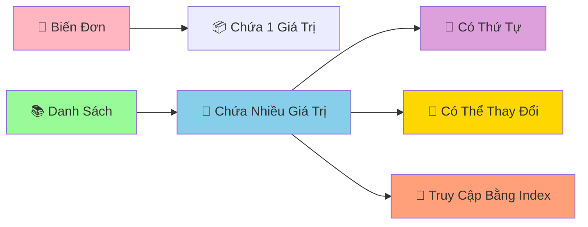

# 📚 Danh Sách Cơ Bản - Lưu Trữ Nhiều Dữ Liệu Cùng Lúc

:::tip 🎒 Ví Dụ Dễ Hiểu
Hãy tưởng tượng danh sách (list) như một **cái túi ma thuật** có thể chứa nhiều thứ khác nhau: sách, bút, kẹo, thậm chí cả những chiếc túi khác! Mỗi vật được đánh số thứ tự để dễ tìm kiếm.
:::

## 🤔 Tại Sao Cần Danh Sách?

Trước đây, để lưu nhiều dữ liệu, chúng ta phải tạo nhiều biến:

```python
# ❌ Cách cũ - phức tạp và không linh hoạt
student_1 = "An"
student_2 = "Bình"
student_3 = "Châu"
student_4 = "Dung"
student_5 = "Em"

score_1 = 8.5
score_2 = 7.0
score_3 = 9.0
score_4 = 6.5
score_5 = 8.0
```

```python
# ✅ Cách mới - sử dụng danh sách
students = ["An", "Bình", "Châu", "Dung", "Em"]
scores = [8.5, 7.0, 9.0, 6.5, 8.0]
```



## 🎯 Tạo Danh Sách

### 📌 Cách Tạo Cơ Bản

```python
# Danh sách rỗng
empty_list = []
empty_list_2 = list()

# Danh sách số
favorite_numbers = [7, 13, 21, 9, 15]

# Danh sách chuỗi
subjects = ["Toán", "Lý", "Hóa", "Văn", "Anh"]

# Danh sách hỗn hợp (nhiều kiểu dữ liệu)
personal_info = ["An", 16, 1.65, True, "9A"]

# Danh sách lồng nhau
class_groups = [
    ["An", "Bình", "Châu"],      # Nhóm 1
    ["Dung", "Em", "Phong"],     # Nhóm 2
    ["Giang", "Hoa", "Ích"]      # Nhóm 3
]

print("Số yêu thích:", favorite_numbers)
print("Môn học:", subjects)
print("Thông tin:", personal_info)
```

## 🔍 Truy Cập Phần Tử

### 📊 Index (Chỉ Số)

```python
subjects = ["Toán", "Lý", "Hóa", "Văn", "Anh"]
#            0      1     2      3      4     (index dương)
#           -5     -4    -3     -2     -1     (index âm)

# Truy cập từ đầu
print("Môn đầu tiên:", subjects[0])      # Toán
print("Môn thứ hai:", subjects[1])       # Lý
print("Môn thứ ba:", subjects[2])        # Hóa

# Truy cập từ cuối
print("Môn cuối cùng:", subjects[-1])    # Anh
print("Môn áp cuối:", subjects[-2])      # Văn

# Kiểm tra độ dài
print("Tổng số môn:", len(subjects))     # 5
```

### ✂️ Cắt Danh Sách (Slicing)

```python
numbers_1_to_10 = [1, 2, 3, 4, 5, 6, 7, 8, 9, 10]

# Lấy 3 số đầu
print("3 số đầu:", numbers_1_to_10[:3])        # [1, 2, 3]

# Lấy 3 số cuối
print("3 số cuối:", numbers_1_to_10[-3:])      # [8, 9, 10]

# Lấy từ vị trí 3 đến 7
print("Từ 3 đến 7:", numbers_1_to_10[3:7])     # [4, 5, 6, 7]

# Lấy số chẵn (bước nhảy 2)
print("Số chẵn:", numbers_1_to_10[1::2])       # [2, 4, 6, 8, 10]

# Đảo ngược danh sách
print("Đảo ngược:", numbers_1_to_10[::-1])     # [10, 9, 8, 7, 6, 5, 4, 3, 2, 1]
```

## ➕ Thêm Phần Tử

### 🎯 Append - Thêm Vào Cuối

```python
favorite_foods = ["Phở", "Bún chả", "Cơm tấm"]
print("Ban đầu:", favorite_foods)

# Thêm món mới
favorite_foods.append("Bánh mì")
print("Sau khi thêm:", favorite_foods)

# Thêm nhiều món (từng món một)
additional_foods = ["Chả cá", "Bún bò Huế"]
for food in additional_foods:
    favorite_foods.append(food)

print("Danh sách cuối:", favorite_foods)
```

### 📥 Insert - Thêm Vào Vị Trí Cụ Thể

```python
queue = ["An", "Bình", "Châu"]
print("Hàng đợi ban đầu:", queue)

# Thêm vào đầu hàng (vị trí 0)
queue.insert(0, "Dung")
print("Dung chen ngang:", queue)

# Thêm vào giữa (vị trí 2)
queue.insert(2, "Em")
print("Em chen giữa:", queue)
```

### 🔗 Extend - Nối Danh Sách

```python
class_9a = ["An", "Bình", "Châu"]
transfer_students = ["Dung", "Em"]
new_students = ["Phong", "Giang"]

print("Lớp 9A ban đầu:", class_9a)

# Thêm học sinh chuyển lớp
class_9a.extend(transfer_students)
print("Sau khi có HS chuyển:", class_9a)

# Cách khác: dùng toán tử +
complete_class_9a = class_9a + new_students
print("Lớp 9A hoàn chỉnh:", complete_class_9a)
```

## ❌ Xóa Phần Tử

### 🗑️ Remove - Xóa Theo Giá Trị

```python
subjects = ["Toán", "Lý", "Hóa", "Văn", "Anh", "Lý"]
print("Danh sách ban đầu:", subjects)

# Xóa môn Lý (chỉ xóa cái đầu tiên)
subjects.remove("Lý")
print("Sau khi xóa Lý:", subjects)

# Xóa an toàn (kiểm tra trước)
subject_to_remove = "Sinh"
if subject_to_remove in subjects:
    subjects.remove(subject_to_remove)
    print(f"Đã xóa {subject_to_remove}")
else:
    print(f"Không tìm thấy {subject_to_remove}")
```

### 📦 Pop - Lấy Ra và Xóa

```python
exam_scores = [8.5, 7.0, 9.0, 6.5, 8.0]
print("Điểm ban đầu:", exam_scores)

# Lấy điểm cuối cùng
last_score = exam_scores.pop()
print(f"Điểm vừa lấy: {last_score}")
print("Điểm còn lại:", exam_scores)

# Lấy điểm ở vị trí 1
score_at_index_1 = exam_scores.pop(1)
print(f"Điểm vị trí 1: {score_at_index_1}")
print("Điểm còn lại:", exam_scores)
```

### 🧹 Clear - Xóa Tất Cả

```python
shopping_cart = ["Sách", "Bút", "Tẩy", "Thước"]
print("Giỏ hàng:", shopping_cart)

# Xóa tất cả
shopping_cart.clear()
print("Sau khi xóa:", shopping_cart)  # []
```

## 🔄 Thay Đổi Phần Tử

```python
scores = [7.0, 6.5, 8.0, 5.5, 9.0]
print("Điểm ban đầu:", scores)

# Thay đổi điểm thứ 2 (index 1)
scores[1] = 8.5
print("Sau khi sửa điểm:", scores)

# Thay đổi nhiều điểm cùng lúc
scores[2:4] = [8.5, 7.0]
print("Sau khi sửa nhiều điểm:", scores)

# Thêm điểm thưởng cho tất cả
for i in range(len(scores)):
    scores[i] += 0.5

print("Sau khi cộng điểm thưởng:", scores)
```

## 🔍 Tìm Kiếm và Kiểm Tra

```python
students = ["An", "Bình", "Châu", "Dung", "An", "Em"]

# Kiểm tra có tồn tại không
print("An có trong lớp?", "An" in students)           # True
print("Phong có trong lớp?", "Phong" in students)     # False

# Tìm vị trí đầu tiên
position_an = students.index("An")
print(f"An ở vị trí: {position_an}")                    # 0

# Đếm số lần xuất hiện
count_an = students.count("An")
print(f"An xuất hiện {count_an} lần")                # 2

# Tìm tất cả vị trí của "An"
all_positions_an = []
for i, name in enumerate(students):
    if name == "An":
        all_positions_an.append(i)

print(f"Tất cả vị trí của An: {all_positions_an}")    # [0, 4]
```

## 🎪 Ví Dụ Thực Tế: Quản Lý Danh Sách Mua Sắm

```python
# 🛒 Ứng dụng quản lý danh sách mua sắm
shopping_list = []

print("🛒 ỨNG DỤNG QUẢN LÝ MUA SẮM")
print("=" * 40)

def display_list():
    """Hiển thị danh sách mua sắm"""
    if not shopping_list:
        print("📝 Danh sách trống")
    else:
        print("📝 DANH SÁCH MUA SẮM:")
        for i, item in enumerate(shopping_list, 1):
            print(f"   {i}. {item}")
    print("-" * 30)

def add_product():
    """Thêm sản phẩm vào danh sách"""
    product = input("➕ Nhập tên sản phẩm: ").strip()
    if product:
        if product not in shopping_list:
            shopping_list.append(product)
            print(f"✅ Đã thêm '{product}'")
        else:
            print(f"⚠️  '{product}' đã có trong danh sách")
    else:
        print("❌ Tên sản phẩm không được rỗng")

def remove_product():
    """Xóa sản phẩm khỏi danh sách"""
    display_list()
    if shopping_list:
        try:
            index = int(input("🗑️  Nhập số thứ tự cần xóa: ")) - 1
            if 0 <= index < len(shopping_list):
                removed_product = shopping_list.pop(index)
                print(f"✅ Đã xóa '{removed_product}'")
            else:
                print("❌ Số thứ tự không hợp lệ")
        except ValueError:
            print("❌ Vui lòng nhập số")

def search_product():
    """Tìm kiếm sản phẩm trong danh sách"""
    keyword = input("🔍 Nhập tên sản phẩm cần tìm: ").strip().lower()
    results = []
    
    for i, product in enumerate(shopping_list):
        if keyword in product.lower():
            results.append((i + 1, product))
    
    if results:
        print("🎯 Kết quả tìm kiếm:")
        for order, product in results:
            print(f"   {order}. {product}")
    else:
        print("😅 Không tìm thấy sản phẩm nào")

# Menu chính
while True:
    print("\n📋 MENU:")
    print("1. Xem danh sách")
    print("2. Thêm sản phẩm")
    print("3. Xóa sản phẩm")
    print("4. Tìm sản phẩm")
    print("5. Thoát")
    
    choice = input("👉 Chọn chức năng (1-5): ")
    
    if choice == "1":
        display_list()
    elif choice == "2":
        add_product()
    elif choice == "3":
        remove_product()
    elif choice == "4":
        search_product()
    elif choice == "5":
        print("👋 Cảm ơn bạn đã sử dụng!")
        print(f"📊 Tổng cộng: {len(shopping_list)} sản phẩm")
        break
    else:
        print("❌ Lựa chọn không hợp lệ!")
```

## 🎯 Bài Tập Thực Hành

### 🥇 Bài Tập 1: Quản Lý Điểm Số

```python
# TODO: Tạo chương trình quản lý điểm số lớp học
student_names = []
math_scores = []
literature_scores = []

print("📊 QUẢN LÝ ĐIỂM SỐ LỚP HỌC")

# Nhập thông tin học sinh
student_count = int(input("Nhập số học sinh: "))

for i in range(student_count):
    print(f"\nHọc sinh {i + 1}:")
    name = input("Tên: ")
    math = float(input("Điểm Toán: "))
    literature = float(input("Điểm Văn: "))
    
    student_names.append(name)
    math_scores.append(math)
    literature_scores.append(literature)

# Tính và hiển thị kết quả
print("\n" + "="*50)
print("📋 BẢNG ĐIỂM LỚP HỌC")
print("="*50)
print(f"{'STT':<3} {'Tên':<15} {'Toán':<6} {'Văn':<6} {'TB':<6} {'Xếp loại'}")
print("-"*50)

for i in range(len(student_names)):
    average_score = (math_scores[i] + literature_scores[i]) / 2
    
    if average_score >= 8.0:
        classification = "Giỏi"
    elif average_score >= 6.5:
        classification = "Khá"
    elif average_score >= 5.0:
        classification = "TB"
    else:
        classification = "Yếu"
    
    print(f"{i+1:<3} {student_names[i]:<15} {math_scores[i]:<6} {literature_scores[i]:<6} {average_score:<6.1f} {classification}")

# Thống kê
print("\n📊 THỐNG KÊ:")
highest_math_score = max(math_scores)
highest_literature_score = max(literature_scores)
best_math_position = math_scores.index(highest_math_score)
best_literature_position = literature_scores.index(highest_literature_score)

print(f"🏆 Điểm Toán cao nhất: {highest_math_score} - {student_names[best_math_position]}")
print(f"🏆 Điểm Văn cao nhất: {highest_literature_score} - {student_names[best_literature_position]}")
```

### 🥈 Bài Tập 2: Game Xổ Số Mini

```python
import random

# TODO: Tạo game xổ số đơn giản
print("🎰 GAME XỔ SỐ MINI")
print("Chọn 6 số từ 1-45")
print("-" * 30)

# Nhập số người chơi
player_numbers = []
for i in range(6):
    while True:
        try:
            number = int(input(f"Nhập số thứ {i+1} (1-45): "))
            if 1 <= number <= 45:
                if number not in player_numbers:
                    player_numbers.append(number)
                    break
                else:
                    print("❌ Số này đã chọn rồi!")
            else:
                print("❌ Số phải từ 1-45!")
        except ValueError:
            print("❌ Vui lòng nhập số!")

# Quay số ngẫu nhiên
print("\n🎲 ĐANG QUAY SỐ...")
winning_numbers = []
while len(winning_numbers) < 6:
    random_number = random.randint(1, 45)
    if random_number not in winning_numbers:
        winning_numbers.append(random_number)

winning_numbers.sort()
player_numbers.sort()

# Hiển thị kết quả
print(f"🎯 Số bạn chọn: {player_numbers}")
print(f"🎰 Số trúng thưởng: {winning_numbers}")

# Kiểm tra trúng
matched_numbers = []
for number in player_numbers:
    if number in winning_numbers:
        matched_numbers.append(number)

print(f"✅ Số trúng: {matched_numbers}")
print(f"🎊 Số lượng trúng: {len(matched_numbers)}/6")

# Xác định giải thưởng
if len(matched_numbers) == 6:
    print("🏆 JACKPOT! Trúng đặc biệt!")
elif len(matched_numbers) == 5:
    print("🥇 Trúng giải nhất!")
elif len(matched_numbers) == 4:
    print("🥈 Trúng giải nhì!")
elif len(matched_numbers) == 3:
    print("🥉 Trúng giải ba!")
else:
    print("😅 Chúc bạn may mắn lần sau!")
```

## 🎊 Tóm Tắt

Trong bài này, bạn đã học được:

✅ **Tạo danh sách** - `[]`, `list()`  
✅ **Truy cập phần tử** - index, slicing  
✅ **Thêm phần tử** - `append()`, `insert()`, `extend()`  
✅ **Xóa phần tử** - `remove()`, `pop()`, `clear()`  
✅ **Tìm kiếm** - `in`, `index()`, `count()`  
✅ **Ứng dụng thực tế** - Quản lý mua sắm, điểm số, game  

## 🚀 Bước Tiếp Theo

Tuyệt vời! Bây giờ bạn đã biết cách lưu trữ **nhiều dữ liệu** trong danh sách! Tiếp theo, chúng ta sẽ học thêm về [Phương Thức Của List](/python/intermediate/lists-methods) - những "công cụ" mạnh mẽ để xử lý danh sách một cách chuyên nghiệp!

:::tip 🎯 Thử Thách Nhỏ
Hãy thử tạo một "chương trình quản lý playlist nhạc"! Cho phép thêm bài hát, xóa bài hát, tìm kiếm, phát ngẫu nhiên, và sắp xếp theo tên. Sử dụng tất cả kỹ năng về danh sách bạn vừa học!
:::

---

*🔗 **Bài tiếp theo**: [Phương Thức Của List - Công Cụ Mạnh Mẽ Cho Danh Sách](/python/intermediate/lists-methods)*
