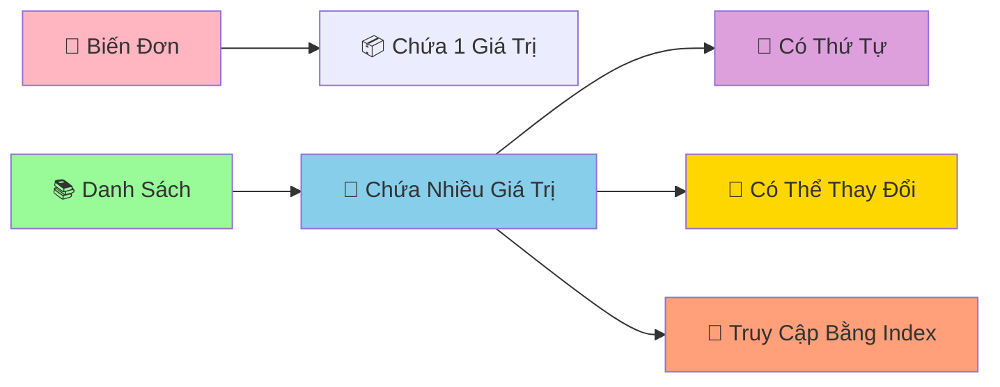

# 📚 Danh Sách Cơ Bản - Lưu Trữ Nhiều Dữ Liệu Cùng Lúc

:::tip 🎒 Ví Dụ Dễ Hiểu
Hãy tưởng tượng danh sách (list) như một **cái túi ma thuật** có thể chứa nhiều thứ khác nhau: sách, bút, kẹo, thậm chí cả những chiếc túi khác! Mỗi vật được đánh số thứ tự để dễ tìm kiếm.
:::

## 🤔 Tại Sao Cần Danh Sách?

Trước đây, để lưu nhiều dữ liệu, chúng ta phải tạo nhiều biến:

```python
# ❌ Cách cũ - phức tạp và không linh hoạt
hoc_sinh_1 = "An"
hoc_sinh_2 = "Bình"
hoc_sinh_3 = "Châu"
hoc_sinh_4 = "Dung"
hoc_sinh_5 = "Em"

diem_1 = 8.5
diem_2 = 7.0
diem_3 = 9.0
diem_4 = 6.5
diem_5 = 8.0
```

```python
# ✅ Cách mới - sử dụng danh sách
hoc_sinh = ["An", "Bình", "Châu", "Dung", "Em"]
diem_so = [8.5, 7.0, 9.0, 6.5, 8.0]
```



## 🎯 Tạo Danh Sách

### 📌 Cách Tạo Cơ Bản

```python
# Danh sách rỗng
danh_sach_rong = []
danh_sach_rong_2 = list()

# Danh sách số
so_yeu_thich = [7, 13, 21, 9, 15]

# Danh sách chuỗi
mon_hoc = ["Toán", "Lý", "Hóa", "Văn", "Anh"]

# Danh sách hỗn hợp (nhiều kiểu dữ liệu)
thong_tin_ca_nhan = ["An", 16, 1.65, True, "9A"]

# Danh sách lồng nhau
lop_hoc = [
    ["An", "Bình", "Châu"],      # Nhóm 1
    ["Dung", "Em", "Phong"],     # Nhóm 2
    ["Giang", "Hoa", "Ích"]      # Nhóm 3
]

print("Số yêu thích:", so_yeu_thich)
print("Môn học:", mon_hoc)
print("Thông tin:", thong_tin_ca_nhan)
```

## 🔍 Truy Cập Phần Tử

### 📊 Index (Chỉ Số)

```python
mon_hoc = ["Toán", "Lý", "Hóa", "Văn", "Anh"]
#           0      1     2      3      4     (index dương)
#          -5     -4    -3     -2     -1     (index âm)

# Truy cập từ đầu
print("Môn đầu tiên:", mon_hoc[0])      # Toán
print("Môn thứ hai:", mon_hoc[1])       # Lý
print("Môn thứ ba:", mon_hoc[2])        # Hóa

# Truy cập từ cuối
print("Môn cuối cùng:", mon_hoc[-1])    # Anh
print("Môn áp cuối:", mon_hoc[-2])      # Văn

# Kiểm tra độ dài
print("Tổng số môn:", len(mon_hoc))     # 5
```

### ✂️ Cắt Danh Sách (Slicing)

```python
so_tu_1_den_10 = [1, 2, 3, 4, 5, 6, 7, 8, 9, 10]

# Lấy 3 số đầu
print("3 số đầu:", so_tu_1_den_10[:3])        # [1, 2, 3]

# Lấy 3 số cuối
print("3 số cuối:", so_tu_1_den_10[-3:])      # [8, 9, 10]

# Lấy từ vị trí 3 đến 7
print("Từ 3 đến 7:", so_tu_1_den_10[3:7])     # [4, 5, 6, 7]

# Lấy số chẵn (bước nhảy 2)
print("Số chẵn:", so_tu_1_den_10[1::2])       # [2, 4, 6, 8, 10]

# Đảo ngược danh sách
print("Đảo ngược:", so_tu_1_den_10[::-1])     # [10, 9, 8, 7, 6, 5, 4, 3, 2, 1]
```

## ➕ Thêm Phần Tử

### 🎯 Append - Thêm Vào Cuối

```python
mon_an_yeu_thich = ["Phở", "Bún chả", "Cơm tấm"]
print("Ban đầu:", mon_an_yeu_thich)

# Thêm món mới
mon_an_yeu_thich.append("Bánh mì")
print("Sau khi thêm:", mon_an_yeu_thich)

# Thêm nhiều món (từng món một)
mon_them = ["Chả cá", "Bún bò Huế"]
for mon in mon_them:
    mon_an_yeu_thich.append(mon)

print("Danh sách cuối:", mon_an_yeu_thich)
```

### 📥 Insert - Thêm Vào Vị Trí Cụ Thể

```python
hang_doi = ["An", "Bình", "Châu"]
print("Hàng đợi ban đầu:", hang_doi)

# Thêm vào đầu hàng (vị trí 0)
hang_doi.insert(0, "Dung")
print("Dung chen ngang:", hang_doi)

# Thêm vào giữa (vị trí 2)
hang_doi.insert(2, "Em")
print("Em chen giữa:", hang_doi)
```

### 🔗 Extend - Nối Danh Sách

```python
lop_9a = ["An", "Bình", "Châu"]
hoc_sinh_chuyen = ["Dung", "Em"]
hoc_sinh_moi = ["Phong", "Giang"]

print("Lớp 9A ban đầu:", lop_9a)

# Thêm học sinh chuyển lớp
lop_9a.extend(hoc_sinh_chuyen)
print("Sau khi có HS chuyển:", lop_9a)

# Cách khác: dùng toán tử +
lop_9a_moi = lop_9a + hoc_sinh_moi
print("Lớp 9A hoàn chỉnh:", lop_9a_moi)
```

## ❌ Xóa Phần Tử

### 🗑️ Remove - Xóa Theo Giá Trị

```python
mon_hoc = ["Toán", "Lý", "Hóa", "Văn", "Anh", "Lý"]
print("Danh sách ban đầu:", mon_hoc)

# Xóa môn Lý (chỉ xóa cái đầu tiên)
mon_hoc.remove("Lý")
print("Sau khi xóa Lý:", mon_hoc)

# Xóa an toàn (kiểm tra trước)
mon_can_xoa = "Sinh"
if mon_can_xoa in mon_hoc:
    mon_hoc.remove(mon_can_xoa)
    print(f"Đã xóa {mon_can_xoa}")
else:
    print(f"Không tìm thấy {mon_can_xoa}")
```

### 📦 Pop - Lấy Ra và Xóa

```python
diem_thi = [8.5, 7.0, 9.0, 6.5, 8.0]
print("Điểm ban đầu:", diem_thi)

# Lấy điểm cuối cùng
diem_cuoi = diem_thi.pop()
print(f"Điểm vừa lấy: {diem_cuoi}")
print("Điểm còn lại:", diem_thi)

# Lấy điểm ở vị trí 1
diem_vi_tri_1 = diem_thi.pop(1)
print(f"Điểm vị trí 1: {diem_vi_tri_1}")
print("Điểm còn lại:", diem_thi)
```

### 🧹 Clear - Xóa Tất Cả

```python
gio_hang = ["Sách", "Bút", "Tẩy", "Thước"]
print("Giỏ hàng:", gio_hang)

# Xóa tất cả
gio_hang.clear()
print("Sau khi xóa:", gio_hang)  # []
```

## 🔄 Thay Đổi Phần Tử

```python
diem_so = [7.0, 6.5, 8.0, 5.5, 9.0]
print("Điểm ban đầu:", diem_so)

# Thay đổi điểm thứ 2 (index 1)
diem_so[1] = 8.5
print("Sau khi sửa điểm:", diem_so)

# Thay đổi nhiều điểm cùng lúc
diem_so[2:4] = [8.5, 7.0]
print("Sau khi sửa nhiều điểm:", diem_so)

# Thêm điểm thưởng cho tất cả
for i in range(len(diem_so)):
    diem_so[i] += 0.5

print("Sau khi cộng điểm thưởng:", diem_so)
```

## 🔍 Tìm Kiếm và Kiểm Tra

```python
hoc_sinh = ["An", "Bình", "Châu", "Dung", "An", "Em"]

# Kiểm tra có tồn tại không
print("An có trong lớp?", "An" in hoc_sinh)           # True
print("Phong có trong lớp?", "Phong" in hoc_sinh)     # False

# Tìm vị trí đầu tiên
vi_tri_an = hoc_sinh.index("An")
print(f"An ở vị trí: {vi_tri_an}")                    # 0

# Đếm số lần xuất hiện
so_lan_an = hoc_sinh.count("An")
print(f"An xuất hiện {so_lan_an} lần")                # 2

# Tìm tất cả vị trí của "An"
vi_tri_tat_ca_an = []
for i, ten in enumerate(hoc_sinh):
    if ten == "An":
        vi_tri_tat_ca_an.append(i)

print(f"Tất cả vị trí của An: {vi_tri_tat_ca_an}")    # [0, 4]
```

## 🎪 Ví Dụ Thực Tế: Quản Lý Danh Sách Mua Sắm

```python
# 🛒 Ứng dụng quản lý danh sách mua sắm
danh_sach_mua_sam = []

print("🛒 ỨNG DỤNG QUẢN LÝ MUA SẮM")
print("=" * 40)

def hien_thi_danh_sach():
    if not danh_sach_mua_sam:
        print("📝 Danh sách trống")
    else:
        print("📝 DANH SÁCH MUA SẮM:")
        for i, item in enumerate(danh_sach_mua_sam, 1):
            print(f"   {i}. {item}")
    print("-" * 30)

def them_san_pham():
    san_pham = input("➕ Nhập tên sản phẩm: ").strip()
    if san_pham:
        if san_pham not in danh_sach_mua_sam:
            danh_sach_mua_sam.append(san_pham)
            print(f"✅ Đã thêm '{san_pham}'")
        else:
            print(f"⚠️  '{san_pham}' đã có trong danh sách")
    else:
        print("❌ Tên sản phẩm không được rỗng")

def xoa_san_pham():
    hien_thi_danh_sach()
    if danh_sach_mua_sam:
        try:
            chi_so = int(input("🗑️  Nhập số thứ tự cần xóa: ")) - 1
            if 0 <= chi_so < len(danh_sach_mua_sam):
                san_pham_da_xoa = danh_sach_mua_sam.pop(chi_so)
                print(f"✅ Đã xóa '{san_pham_da_xoa}'")
            else:
                print("❌ Số thứ tự không hợp lệ")
        except ValueError:
            print("❌ Vui lòng nhập số")

def tim_san_pham():
    tu_khoa = input("🔍 Nhập tên sản phẩm cần tìm: ").strip().lower()
    ket_qua = []
    
    for i, san_pham in enumerate(danh_sach_mua_sam):
        if tu_khoa in san_pham.lower():
            ket_qua.append((i + 1, san_pham))
    
    if ket_qua:
        print("🎯 Kết quả tìm kiếm:")
        for stt, san_pham in ket_qua:
            print(f"   {stt}. {san_pham}")
    else:
        print("😅 Không tìm thấy sản phẩm nào")

# Menu chính
while True:
    print("\n📋 MENU:")
    print("1. Xem danh sách")
    print("2. Thêm sản phẩm")
    print("3. Xóa sản phẩm")
    print("4. Tìm sản phẩm")
    print("5. Thoát")
    
    lua_chon = input("👉 Chọn chức năng (1-5): ")
    
    if lua_chon == "1":
        hien_thi_danh_sach()
    elif lua_chon == "2":
        them_san_pham()
    elif lua_chon == "3":
        xoa_san_pham()
    elif lua_chon == "4":
        tim_san_pham()
    elif lua_chon == "5":
        print("👋 Cảm ơn bạn đã sử dụng!")
        print(f"📊 Tổng cộng: {len(danh_sach_mua_sam)} sản phẩm")
        break
    else:
        print("❌ Lựa chọn không hợp lệ!")
```

## 🎯 Bài Tập Thực Hành

### 🥇 Bài Tập 1: Quản Lý Điểm Số

```python
# TODO: Tạo chương trình quản lý điểm số lớp học
ten_hoc_sinh = []
diem_toan = []
diem_van = []

print("📊 QUẢN LÝ ĐIỂM SỐ LỚP HỌC")

# Nhập thông tin học sinh
so_hoc_sinh = int(input("Nhập số học sinh: "))

for i in range(so_hoc_sinh):
    print(f"\nHọc sinh {i + 1}:")
    ten = input("Tên: ")
    toan = float(input("Điểm Toán: "))
    van = float(input("Điểm Văn: "))
    
    ten_hoc_sinh.append(ten)
    diem_toan.append(toan)
    diem_van.append(van)

# Tính và hiển thị kết quả
print("\n" + "="*50)
print("📋 BẢNG ĐIỂM LỚP HỌC")
print("="*50)
print(f"{'STT':<3} {'Tên':<15} {'Toán':<6} {'Văn':<6} {'TB':<6} {'Xếp loại'}")
print("-"*50)

for i in range(len(ten_hoc_sinh)):
    diem_tb = (diem_toan[i] + diem_van[i]) / 2
    
    if diem_tb >= 8.0:
        xep_loai = "Giỏi"
    elif diem_tb >= 6.5:
        xep_loai = "Khá"
    elif diem_tb >= 5.0:
        xep_loai = "TB"
    else:
        xep_loai = "Yếu"
    
    print(f"{i+1:<3} {ten_hoc_sinh[i]:<15} {diem_toan[i]:<6} {diem_van[i]:<6} {diem_tb:<6.1f} {xep_loai}")

# Thống kê
print("\n📊 THỐNG KÊ:")
diem_cao_nhat_toan = max(diem_toan)
diem_cao_nhat_van = max(diem_van)
vi_tri_gioi_nhat_toan = diem_toan.index(diem_cao_nhat_toan)
vi_tri_gioi_nhat_van = diem_van.index(diem_cao_nhat_van)

print(f"🏆 Điểm Toán cao nhất: {diem_cao_nhat_toan} - {ten_hoc_sinh[vi_tri_gioi_nhat_toan]}")
print(f"🏆 Điểm Văn cao nhất: {diem_cao_nhat_van} - {ten_hoc_sinh[vi_tri_gioi_nhat_van]}")
```

### 🥈 Bài Tập 2: Game Xổ Số Mini

```python
import random

# TODO: Tạo game xổ số đơn giản
print("🎰 GAME XỔ SỐ MINI")
print("Chọn 6 số từ 1-45")
print("-" * 30)

# Nhập số người chơi
so_nguoi_choi = []
for i in range(6):
    while True:
        try:
            so = int(input(f"Nhập số thứ {i+1} (1-45): "))
            if 1 <= so <= 45:
                if so not in so_nguoi_choi:
                    so_nguoi_choi.append(so)
                    break
                else:
                    print("❌ Số này đã chọn rồi!")
            else:
                print("❌ Số phải từ 1-45!")
        except ValueError:
            print("❌ Vui lòng nhập số!")

# Quay số ngẫu nhiên
print("\n🎲 ĐANG QUAY SỐ...")
so_trung_thuong = []
while len(so_trung_thuong) < 6:
    so_ngau_nhien = random.randint(1, 45)
    if so_ngau_nhien not in so_trung_thuong:
        so_trung_thuong.append(so_ngau_nhien)

so_trung_thuong.sort()
so_nguoi_choi.sort()

# Hiển thị kết quả
print(f"🎯 Số bạn chọn: {so_nguoi_choi}")
print(f"🎰 Số trúng thưởng: {so_trung_thuong}")

# Kiểm tra trúng
so_trung = []
for so in so_nguoi_choi:
    if so in so_trung_thuong:
        so_trung.append(so)

print(f"✅ Số trúng: {so_trung}")
print(f"🎊 Số lượng trúng: {len(so_trung)}/6")

# Xác định giải thưởng
if len(so_trung) == 6:
    print("🏆 JACKPOT! Trúng đặc biệt!")
elif len(so_trung) == 5:
    print("🥇 Trúng giải nhất!")
elif len(so_trung) == 4:
    print("🥈 Trúng giải nhì!")
elif len(so_trung) == 3:
    print("🥉 Trúng giải ba!")
else:
    print("😅 Chúc bạn may mắn lần sau!")
```

## 🎊 Tóm Tắt

Trong bài này, bạn đã học được:

✅ **Tạo danh sách** - `[]`, `list()`  
✅ **Truy cập phần tử** - index, slicing  
✅ **Thêm phần tử** - `append()`, `insert()`, `extend()`  
✅ **Xóa phần tử** - `remove()`, `pop()`, `clear()`  
✅ **Tìm kiếm** - `in`, `index()`, `count()`  
✅ **Ứng dụng thực tế** - Quản lý mua sắm, điểm số, game  

## 🚀 Bước Tiếp Theo

Tuyệt vời! Bây giờ bạn đã biết cách lưu trữ **nhiều dữ liệu** trong danh sách! Tiếp theo, chúng ta sẽ học thêm về [Phương Thức Của List](/python/intermediate/lists-methods) - những "công cụ" mạnh mẽ để xử lý danh sách một cách chuyên nghiệp!

:::tip 🎯 Thử Thách Nhỏ
Hãy thử tạo một "chương trình quản lý playlist nhạc"! Cho phép thêm bài hát, xóa bài hát, tìm kiếm, phát ngẫu nhiên, và sắp xếp theo tên. Sử dụng tất cả kỹ năng về danh sách bạn vừa học!
:::

---

*🔗 **Bài tiếp theo**: [Phương Thức Của List - Công Cụ Mạnh Mẽ Cho Danh Sách](/python/intermediate/lists-methods)*
