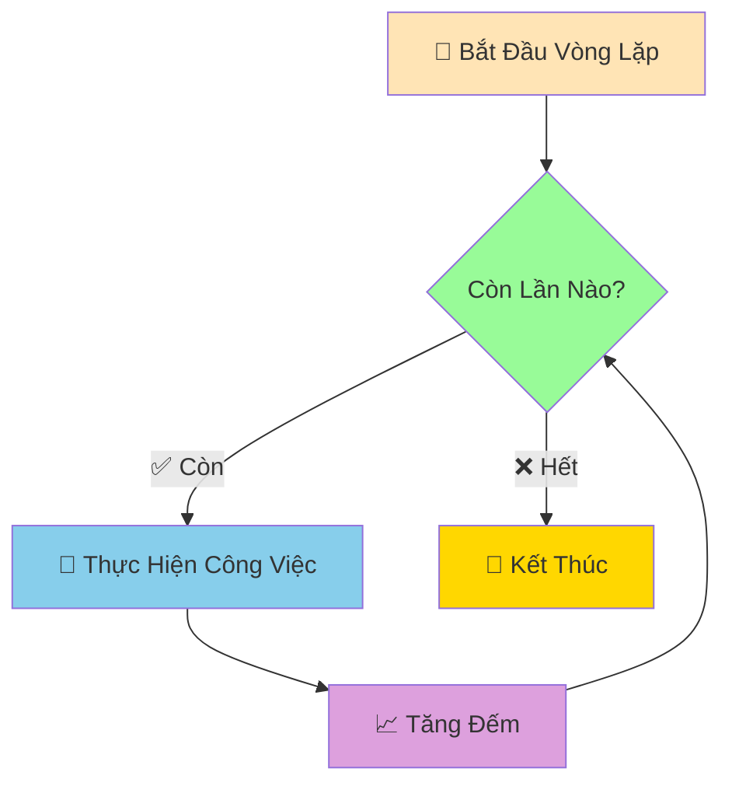

# 🔄 Vòng Lặp For - Dạy Python Lặp Lại Công Việc

:::tip 🤖 Ví Dụ Dễ Hiểu
Hãy tưởng tượng Python như một **robot siêu hiệu quả** có thể lặp lại công việc hàng trăm, hàng nghìn lần mà không bao giờ mệt mỏi hay sai sót! Thay vì bạn viết code giống nhau 100 lần, chỉ cần nói "lặp lại 100 lần" là xong!
:::

## 🤔 Tại Sao Cần Vòng Lặp?

Trong cuộc sống, chúng ta thường phải lặp lại những việc giống nhau:

- 📚 **Học bài**: Đọc từ vựng 50 từ, mỗi từ 3 lần
- 🏃 **Tập thể dục**: Chạy quanh sân 10 vòng
- 📝 **Kiểm tra bài tập**: Chấm 30 bài của cả lớp
- 🎵 **Luyện nhạc**: Chơi một đoạn nhạc 20 lần cho thuần thục

Nếu không có vòng lặp, code sẽ như thế này:

```python
# ❌ Cách làm "ngu ngốc" - lặp lại code
print("Xin chào!")
print("Xin chào!")
print("Xin chào!")
print("Xin chào!")
print("Xin chào!")
# ... 95 dòng nữa để có 100 lần!
```

```python
# ✅ Cách làm "thông minh" - dùng vòng lặp
for i in range(100):
    print("Xin chào!")
```



## 🔢 Vòng Lặp For Với Range

### 📌 Cú Pháp Cơ Bản

```python
for biến_đếm in range(số_lần_lặp):
    # Công việc cần lặp lại
    print("Làm việc gì đó")
```

### 🌟 Ví Dụ Đơn Giản

```python
# Đếm từ 0 đến 4 (5 lần)
print("Đếm từ 0 đến 4:")
for i in range(5):
    print(f"Lần thứ {i}")

print("\n" + "="*30)

# Chào 10 lần
print("Chào bạn 10 lần:")
for lan in range(10):
    print(f"Xin chào lần {lan + 1}!")
```

### 🎯 Range Với Tham Số Khác Nhau

```python
# range(stop) - từ 0 đến stop-1
print("range(5):", list(range(5)))  # [0, 1, 2, 3, 4]

# range(start, stop) - từ start đến stop-1
print("range(2, 8):", list(range(2, 8)))  # [2, 3, 4, 5, 6, 7]

# range(start, stop, step) - với bước nhảy
print("range(0, 10, 2):", list(range(0, 10, 2)))  # [0, 2, 4, 6, 8]
print("range(10, 0, -1):", list(range(10, 0, -1)))  # [10, 9, 8, 7, 6, 5, 4, 3, 2, 1]
```

## 📚 Lặp Qua Danh Sách và Chuỗi

### 🎒 Lặp Qua Danh Sách

```python
# Danh sách môn học
mon_hoc = ["Toán", "Lý", "Hóa", "Văn", "Anh"]

print("Các môn học hôm nay:")
for mon in mon_hoc:
    print(f"📖 {mon}")

print("\n" + "="*30)

# Danh sách điểm số
diem_so = [8.5, 7.0, 9.0, 6.5, 8.0]

print("Báo cáo điểm số:")
for i in range(len(diem_so)):
    print(f"{mon_hoc[i]}: {diem_so[i]} điểm")
```

### 📝 Lặp Qua Chuỗi

```python
# Lặp qua từng ký tự
ten = "PYTHON"

print("Phân tích từng chữ cái:")
for chu_cai in ten:
    print(f"Chữ '{chu_cai}' - Mã ASCII: {ord(chu_cai)}")

print("\n" + "="*30)

# Đếm ngược từ tên
print("Đếm ngược:")
for i in range(len(ten) - 1, -1, -1):
    print(f"Vị trí {i}: {ten[i]}")
```

## 🎪 Ví Dụ Thực Tế: Bảng Cửu Chương

```python
# Tạo bảng cửu chương từ 2 đến 9
print("🧮 BẢNG CỬU CHƯƠNG")
print("=" * 50)

for bang in range(2, 10):
    print(f"\n📋 Bảng cửu chương {bang}:")
    print("-" * 25)
    
    for so in range(1, 11):
        ket_qua = bang * so
        print(f"{bang} × {so:2d} = {ket_qua:2d}")
    
    print("-" * 25)

# Tạo bảng cửu chương ngang
print("\n🎯 BẢNG CỬU CHƯƠNG NGANG")
print("=" * 80)

# In header
print("   ", end="")
for i in range(1, 11):
    print(f"{i:4d}", end="")
print()

print("   " + "-" * 40)

# In từng hàng
for bang in range(2, 10):
    print(f"{bang}: ", end="")
    for so in range(1, 11):
        ket_qua = bang * so
        print(f"{ket_qua:4d}", end="")
    print()
```

## 🎮 Ví Dụ Thực Tế: Hệ Thống Chấm Điểm Lớp

```python
# 📊 Dữ liệu lớp học
ten_hoc_sinh = ["An", "Bình", "Châu", "Dung", "Em", "Phong"]
diem_toan = [8.5, 7.0, 9.5, 6.0, 8.0, 7.5]
diem_van = [7.5, 8.0, 8.5, 7.0, 9.0, 6.5]
diem_anh = [9.0, 6.5, 8.0, 8.5, 7.5, 8.0]

print("📋 BÁO CÁO ĐIỂM SỐ LỚP 9A")
print("=" * 60)

# Tính điểm trung bình từng học sinh
tong_diem_lop = 0
so_hoc_sinh = len(ten_hoc_sinh)

print(f"{'STT':<3} {'Tên':<10} {'Toán':<6} {'Văn':<6} {'Anh':<6} {'TB':<6} {'Xếp Loại'}")
print("-" * 60)

for i in range(so_hoc_sinh):
    # Tính điểm trung bình cá nhân
    diem_tb = (diem_toan[i] + diem_van[i] + diem_anh[i]) / 3
    tong_diem_lop += diem_tb
    
    # Xếp loại
    if diem_tb >= 8.5:
        xep_loai = "Giỏi"
        mau_sac = "🥇"
    elif diem_tb >= 8.0:
        xep_loai = "Khá"
        mau_sac = "🥈"
    elif diem_tb >= 6.5:
        xep_loai = "TB"
        mau_sac = "🥉"
    else:
        xep_loai = "Yếu"
        mau_sac = "📚"
    
    # In thông tin
    print(f"{i+1:<3} {ten_hoc_sinh[i]:<10} {diem_toan[i]:<6} {diem_van[i]:<6} {diem_anh[i]:<6} {diem_tb:<6.1f} {mau_sac} {xep_loai}")

# Thống kê tổng lớp
diem_tb_lop = tong_diem_lop / so_hoc_sinh
print("-" * 60)
print(f"📊 THỐNG KÊ TỔNG LỚP:")
print(f"   Sĩ số: {so_hoc_sinh} học sinh")
print(f"   Điểm TB lớp: {diem_tb_lop:.2f}")

# Đếm số học sinh theo xếp loại
dem_gioi = dem_kha = dem_tb = dem_yeu = 0

for i in range(so_hoc_sinh):
    diem_tb = (diem_toan[i] + diem_van[i] + diem_anh[i]) / 3
    if diem_tb >= 8.5:
        dem_gioi += 1
    elif diem_tb >= 8.0:
        dem_kha += 1
    elif diem_tb >= 6.5:
        dem_tb += 1
    else:
        dem_yeu += 1

print(f"   Giỏi: {dem_gioi} HS ({dem_gioi/so_hoc_sinh*100:.1f}%)")
print(f"   Khá: {dem_kha} HS ({dem_kha/so_hoc_sinh*100:.1f}%)")
print(f"   TB: {dem_tb} HS ({dem_tb/so_hoc_sinh*100:.1f}%)")
print(f"   Yếu: {dem_yeu} HS ({dem_yeu/so_hoc_sinh*100:.1f}%)")
```

## 🎨 Vòng Lặp Lồng Nhau (Nested Loops)

### 🏗️ Tạo Hình Tam Giác

```python
# Tam giác sao
print("⭐ TAM GIÁC SAO")
for hang in range(1, 6):
    for sao in range(hang):
        print("⭐", end=" ")
    print()  # Xuống dòng

print("\n" + "="*20)

# Tam giác số
print("🔢 TAM GIÁC SỐ")
for hang in range(1, 6):
    for so in range(1, hang + 1):
        print(so, end=" ")
    print()

print("\n" + "="*20)

# Hình chữ nhật
print("🟦 HÌNH CHỮ NHẬT 5x3")
for hang in range(3):
    for cot in range(5):
        print("🟦", end=" ")
    print()
```

### 🎯 Tạo Bảng Toạ Độ

```python
# Tạo bảng toạ độ
print("📍 BẢNG TOẠ ĐỘ")
print("   ", end="")

# In header (trục X)
for x in range(5):
    print(f"{x:3d}", end="")
print()

print("   " + "-" * 15)

# In từng hàng (trục Y)
for y in range(4):
    print(f"{y}: ", end="")
    for x in range(5):
        print(f"({x},{y})", end=" ")
    print()
```

## 🔧 Kỹ Thuật Nâng Cao

### 🎯 Enumerate - Lấy Cả Index và Giá Trị

```python
mon_hoc = ["Toán", "Lý", "Hóa", "Văn", "Anh"]

# Cách thông thường
print("Cách thông thường:")
for i in range(len(mon_hoc)):
    print(f"{i+1}. {mon_hoc[i]}")

print("\n" + "="*30)

# Cách dùng enumerate (thanh lịch hơn)
print("Cách dùng enumerate:")
for i, mon in enumerate(mon_hoc, 1):  # Bắt đầu từ 1
    print(f"{i}. {mon}")
```

### 🔄 Zip - Lặp Nhiều Danh Sách Cùng Lúc

```python
ten = ["An", "Bình", "Châu"]
tuoi = [15, 16, 14]
lop = ["9A", "9B", "9A"]

print("Thông tin học sinh:")
for t, tu, l in zip(ten, tuoi, lop):
    print(f"Tên: {t}, Tuổi: {tu}, Lớp: {l}")
```

## 🎯 Bài Tập Thực Hành

### 🥇 Bài Tập 1: Máy Tính Lãi Suất

```python
# TODO: Tính lãi suất kép theo năm
so_tien_ban_dau = float(input("Số tiền gửi ban đầu (VNĐ): "))
lai_suat = float(input("Lãi suất hàng năm (%): ")) / 100
so_nam = int(input("Số năm gửi: "))

print(f"\n📊 BẢNG TÍNH LÃI SUẤT KÉP")
print("=" * 50)
print(f"{'Năm':<5} {'Tiền Gốc':<15} {'Lãi':<15} {'Tổng Tiền':<15}")
print("-" * 50)

so_tien_hien_tai = so_tien_ban_dau

for nam in range(1, so_nam + 1):
    lai = so_tien_hien_tai * lai_suat
    so_tien_hien_tai += lai
    
    print(f"{nam:<5} {so_tien_ban_dau:,.0f} VNĐ{lai:>10,.0f} VNĐ{so_tien_hien_tai:>12,.0f} VNĐ")

print("-" * 50)
tong_lai = so_tien_hien_tai - so_tien_ban_dau
print(f"💰 Tổng lãi nhận được: {tong_lai:,.0f} VNĐ")
print(f"🎯 Tổng tiền cuối kỳ: {so_tien_hien_tai:,.0f} VNĐ")
```

### 🥈 Bài Tập 2: Game Đoán Số Nâng Cao

```python
import random

# TODO: Game đoán số với số lần thử giới hạn
so_may_tinh = random.randint(1, 100)
so_lan_thi_toi_da = 7

print("🎮 GAME ĐOÁN SỐ NÂNG CAO")
print("=" * 40)
print("🎯 Tôi đã nghĩ ra một số từ 1-100")
print(f"🎪 Bạn có {so_lan_thi_toi_da} lần đoán!")
print("💡 Mẹo: Tôi sẽ gợi ý 'cao hơn' hoặc 'thấp hơn'")
print("-" * 40)

for lan_thu in range(1, so_lan_thi_toi_da + 1):
    print(f"\n🔢 Lần thử {lan_thu}/{so_lan_thi_toi_da}")
    
    try:
        so_doan = int(input("Nhập số bạn đoán: "))
    except ValueError:
        print("❌ Vui lòng nhập một số hợp lệ!")
        continue
    
    if so_doan == so_may_tinh:
        print(f"🎉 CHÍNH XÁC! Số tôi nghĩ là {so_may_tinh}")
        print(f"🏆 Bạn đã đoán đúng trong {lan_thu} lần thử!")
        
        # Đánh giá kết quả
        if lan_thu <= 3:
            print("🌟 XUẤT SẮC! Bạn là cao thủ đoán số!")
        elif lan_thu <= 5:
            print("👍 RẤT TỐT! Kỹ năng ổn định!")
        else:
            print("😊 KHÔNG SAO! Lần sau sẽ tốt hơn!")
        break
    elif so_doan < so_may_tinh:
        print("📈 Số tôi nghĩ CAO HÔN!")
    else:
        print("📉 Số tôi nghĩ THẤP HƠN!")
        
    # Kiểm tra lần cuối
    if lan_thu == so_lan_thi_toi_da:
        print(f"\n💔 HẾT LƯỢT! Số tôi nghĩ là {so_may_tinh}")
        print("🎯 Lần sau hãy thử chiến lược khác nhé!")
```

### 🥉 Bài Tập 3: Vẽ Hình Bằng Ký Tự

```python
# TODO: Vẽ kim tự tháp và các hình khác
print("🏛️ KIM TỰ THÁP")

# Kim tự tháp
chieu_cao = int(input("Nhập chiều cao kim tự tháp: "))

for hang in range(chieu_cao):
    # In khoảng trắng
    for space in range(chieu_cao - hang - 1):
        print(" ", end="")
    
    # In dấu sao
    for sao in range(2 * hang + 1):
        print("*", end="")
    
    print()  # Xuống dòng

print("\n" + "="*40)

# Hình thoi
print("💎 HÌNH THOI")
kich_thuoc = 5

# Nửa trên
for i in range(kich_thuoc):
    for j in range(kich_thuoc - i - 1):
        print(" ", end="")
    for j in range(2 * i + 1):
        print("💎", end="")
    print()

# Nửa dưới
for i in range(kich_thuoc - 2, -1, -1):
    for j in range(kich_thuoc - i - 1):
        print(" ", end="")
    for j in range(2 * i + 1):
        print("💎", end="")
    print()
```

## 🎊 Tóm Tắt

Trong bài này, bạn đã học được:

✅ **Vòng lặp for cơ bản** - Lặp với `range()`  
✅ **Range linh hoạt** - start, stop, step  
✅ **Lặp qua dữ liệu** - list, string  
✅ **Vòng lặp lồng nhau** - Tạo hình, bảng  
✅ **Kỹ thuật nâng cao** - enumerate, zip  
✅ **Ứng dụng thực tế** - Chấm điểm, game, vẽ hình  

## 🚀 Bước Tiếp Theo

Tuyệt vời! Python giờ đã biết **lặp lại công việc hiệu quả** rồi! Tiếp theo, chúng ta sẽ học về [Vòng Lặp While](/python/intermediate/loops-while) - loại vòng lặp **linh hoạt hơn** có thể chạy đến khi điều kiện thay đổi!

:::tip 🎯 Thử Thách Nhỏ
Hãy thử tạo một "máy tạo mật khẩu ngẫu nhiên" sử dụng vòng lặp for! Tạo mật khẩu gồm 12 ký tự ngẫu nhiên (chữ hoa, chữ thường, số, ký tự đặc biệt) và cho phép người dùng tạo nhiều mật khẩu cùng lúc!
:::

---

*🔗 **Bài tiếp theo**: [Vòng Lặp While - Lặp Đến Khi Điều Kiện Thay Đổi](/python/intermediate/loops-while)*
