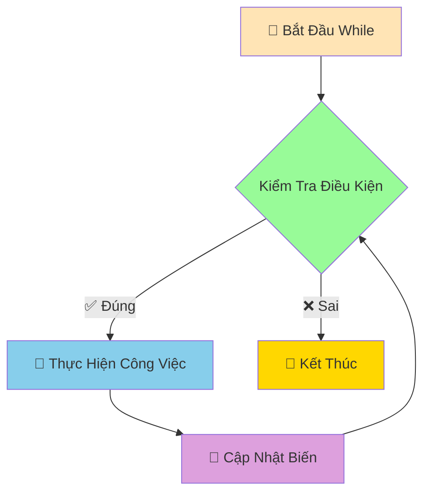

# ⏰ Vòng Lặp While - Lặp Đến Khi Điều Kiện Thay Đổi

:::tip ⏰ Ví Dụ Dễ Hiểu
Hãy tưởng tượng Python như một **người bảo vệ kiên nhẫn** đứng canh cửa! Anh ta sẽ **tiếp tục đứng đó** cho đến khi điều kiện thay đổi (ví dụ: có người đến, trời sáng, hoặc được lệnh nghỉ việc).
:::

## 🤔 While Khác For Như Thế Nào?

**For Loop** giống như **đồng hồ báo thức** - biết trước sẽ lặp bao nhiêu lần:
- "Chạy 10 vòng quanh sân"
- "Đọc 50 từ vựng"
- "In từ 1 đến 100"

**While Loop** giống như **người canh gác** - lặp đến khi điều kiện thay đổi:
- "Chạy **đến khi** mệt"
- "Học **đến khi** hiểu bài"
- "Chơi game **đến khi** thắng"



## 🎯 Cú Pháp While Cơ Bản

```python
while condition:
    # Công việc cần lặp
    # Nhớ cập nhật biến để tránh vòng lặp vô tận!
```

### 🌟 Ví Dụ Đơn Giản

```python
# Đếm từ 1 đến 5
count = 1
while count <= 5:
    print(f"Đếm: {count}")
    count += 1  # QUAN TRỌNG: Tăng biến đếm!

print("Xong rồi!")
```

:::warning ⚠️ Cảnh Báo Vòng Lặp Vô Tận
Nếu quên cập nhật biến, vòng lặp sẽ chạy mãi mãi!
```python
# ❌ NGUY HIỂM - Vòng lặp vô tận!
count = 1
while count <= 5:
    print(f"Đếm: {count}")
    # Quên tăng count - chạy mãi mãi!

# ✅ AN TOÀN - Nhớ cập nhật
count = 1
while count <= 5:
    print(f"Đếm: {count}")
    count += 1  # Cập nhật biến
```
:::

## 🎮 Ví Dụ Thực Tế: Game Đoán Số

```python
import random

# Game đoán số với while
computer_number = random.randint(1, 20)
is_correct_guess = False
attempt_count = 0

print("🎮 GAME ĐOÁN SỐ")
print("Tôi đã nghĩ ra một số từ 1-20")
print("Hãy đoán xem đó là số nào!")
print("-" * 30)

while not is_correct_guess:
    attempt_count += 1
    
    try:
        guessed_number = int(input(f"Lần {attempt_count} - Nhập số: "))
    except ValueError:
        print("❌ Vui lòng nhập một số!")
        continue
    
    if guessed_number == computer_number:
        print(f"🎉 ĐÚNG RỒI! Số tôi nghĩ là {computer_number}")
        print(f"🏆 Bạn đoán đúng sau {attempt_count} lần!")
        is_correct_guess = True  # Kết thúc vòng lặp
    elif guessed_number < computer_number:
        print("📈 Số tôi nghĩ lớn hơn!")
    else:
        print("📉 Số tôi nghĩ nhỏ hơn!")
    
    # Gợi ý nếu đoán quá nhiều lần
    if attempt_count >= 5 and not is_correct_guess:
        print("💡 Gợi ý: Hãy thử số ở giữa khoảng!")

print("Cảm ơn bạn đã chơi!")
```

## 🔧 Break và Continue

### 🛑 Break - Thoát Khỏi Vòng Lặp

```python
# Tìm số chia hết cho 7
number = 1

print("Tìm 5 số đầu tiên chia hết cho 7:")
found_count = 0

while True:  # Vòng lặp vô tận
    if number % 7 == 0:
        print(f"Số {number} chia hết cho 7")
        found_count += 1
        
        if found_count == 5:
            print("Đã tìm đủ 5 số!")
            break  # Thoát khỏi vòng lặp
    
    number += 1

print("Kết thúc tìm kiếm")
```

### ⏭️ Continue - Bỏ Qua Lần Lặp Hiện Tại

```python
# In số từ 1-10, bỏ qua số chẵn
number = 0

print("Các số lẻ từ 1-10:")
while number < 10:
    number += 1
    
    if number % 2 == 0:  # Nếu là số chẵn
        continue         # Bỏ qua, quay lại đầu vòng lặp
    
    print(f"Số lẻ: {number}")

print("Hoàn thành!")
```

## 💰 Ví Dụ Thực Tế: Máy ATM

```python
# Mô phỏng máy ATM đơn giản
account_balance = 1000000  # 1 triệu VNĐ
correct_pin = "1234"
failed_attempts = 0
is_account_locked = False

print("🏧 CHÀO MỪNG ĐẾN VỚI ATM BEHITEK")
print("=" * 40)

# Xác thực PIN
while failed_attempts < 3:
    entered_pin = input("Nhập mã PIN (4 số): ")
    
    if entered_pin == correct_pin:
        print("✅ Xác thực thành công!")
        break
    else:
        failed_attempts += 1
        remaining_attempts = 3 - failed_attempts
        
        if remaining_attempts > 0:
            print(f"❌ Mã PIN sai! Còn {remaining_attempts} lần thử")
        else:
            print("🔒 Tài khoản bị khóa do nhập sai PIN 3 lần!")
            is_account_locked = True

# Nếu tài khoản không bị khóa, cho phép giao dịch
if not is_account_locked:
    print(f"\n💰 Số dư hiện tại: {account_balance:,} VNĐ")
    
    is_transaction_active = True
    while is_transaction_active:
        print("\n📋 MENU GIAO DỊCH:")
        print("1. Kiểm tra số dư")
        print("2. Rút tiền")
        print("3. Thoát")
        
        user_choice = input("Chọn chức năng (1-3): ")
        
        if user_choice == "1":
            print(f"💰 Số dư tài khoản: {account_balance:,} VNĐ")
            
        elif user_choice == "2":
            try:
                withdrawal_amount = int(input("Nhập số tiền muốn rút: "))
                
                if withdrawal_amount <= 0:
                    print("❌ Số tiền phải lớn hơn 0!")
                elif withdrawal_amount > account_balance:
                    print("❌ Số dư không đủ!")
                    print(f"   Số dư hiện tại: {account_balance:,} VNĐ")
                elif withdrawal_amount % 50000 != 0:
                    print("❌ Số tiền rút phải là bội số của 50,000 VNĐ!")
                else:
                    account_balance -= withdrawal_amount
                    print(f"✅ Rút thành công {withdrawal_amount:,} VNĐ")
                    print(f"💰 Số dư còn lại: {account_balance:,} VNĐ")
                    
            except ValueError:
                print("❌ Vui lòng nhập số hợp lệ!")
                
        elif user_choice == "3":
            print("👋 Cảm ơn bạn đã sử dụng dịch vụ ATM!")
            print("🔒 Đang đăng xuất...")
            is_transaction_active = False
            
        else:
            print("❌ Lựa chọn không hợp lệ!")
        
        # Hỏi có muốn tiếp tục không
        if is_transaction_active and user_choice in ["1", "2"]:
            continue_transaction = input("\nBạn có muốn thực hiện giao dịch khác? (y/n): ")
            if continue_transaction.lower() != 'y':
                print("👋 Cảm ơn bạn đã sử dụng dịch vụ!")
                is_transaction_active = False

print("🔚 Kết thúc phiên giao dịch")
```

## 📊 Ví Dụ: Phân Tích Dữ Liệu Với While

```python
# Nhập và phân tích điểm số học sinh
print("📊 PHÂN TÍCH ĐIỂM SỐ LỚP HỌC")
print("Nhập điểm các em (nhập -1 để kết thúc)")
print("-" * 40)

scores_list = []
total_score = 0
student_count = 0

while True:
    try:
        score = float(input(f"Nhập điểm học sinh {student_count + 1}: "))
        
        if score == -1:
            print("Kết thúc nhập liệu!")
            break
            
        if score < 0 or score > 10:
            print("❌ Điểm phải từ 0-10!")
            continue
            
        scores_list.append(score)
        total_score += score
        student_count += 1
        
    except ValueError:
        print("❌ Vui lòng nhập số hợp lệ!")
        continue

# Phân tích kết quả
if student_count > 0:
    average_score = total_score / student_count
    highest_score = max(scores_list)
    lowest_score = min(scores_list)
    
    # Đếm xếp loại
    excellent_count = good_count = fair_count = average_count = poor_count = 0
    
    for score in scores_list:
        if score >= 9:
            excellent_count += 1
        elif score >= 8:
            good_count += 1
        elif score >= 6.5:
            fair_count += 1
        elif score >= 5:
            average_count += 1
        else:
            poor_count += 1
    
    print("\n" + "="*50)
    print("📈 KẾT QUẢ PHÂN TÍCH")
    print("="*50)
    print(f"👥 Tổng số học sinh: {student_count}")
    print(f"📊 Điểm trung bình: {average_score:.2f}")
    print(f"🏆 Điểm cao nhất: {highest_score}")
    print(f"📉 Điểm thấp nhất: {lowest_score}")
    
    print(f"\n🎯 THỐNG KÊ XẾP LOẠI:")
    print(f"   Xuất sắc (≥9.0): {excellent_count} HS ({excellent_count/student_count*100:.1f}%)")
    print(f"   Giỏi (8.0-8.9): {good_count} HS ({good_count/student_count*100:.1f}%)")
    print(f"   Khá (6.5-7.9): {fair_count} HS ({fair_count/student_count*100:.1f}%)")
    print(f"   TB (5.0-6.4): {average_count} HS ({average_count/student_count*100:.1f}%)")
    print(f"   Yếu (<5.0): {poor_count} HS ({poor_count/student_count*100:.1f}%)")
    
else:
    print("❌ Không có dữ liệu để phân tích!")
```

## 🎯 Bài Tập Thực Hành

### 🥇 Bài Tập 1: Máy Tính Đơn Giản

```python
# TODO: Tạo máy tính có thể thực hiện nhiều phép tính
print("🧮 MÁY TÍNH ĐƠN GIẢN")
print("Các phép tính: +, -, *, /, %, **")
print("Gõ 'quit' để thoát")
print("-" * 30)

should_continue = True
while should_continue:
    try:
        # Nhập biểu thức
        expression = input("Nhập phép tính (vd: 5 + 3): ")
        
        if expression.lower() == 'quit':
            print("👋 Tạm biệt!")
            should_continue = False
            continue
        
        # Tính toán (cẩn thận với eval!)
        result = eval(expression)
        print(f"📊 Kết quả: {expression} = {result}")
        
    except ZeroDivisionError:
        print("❌ Không thể chia cho 0!")
    except:
        print("❌ Biểu thức không hợp lệ!")
    
    print()  # Dòng trống
```

### 🥈 Bài Tập 2: Game Tài Xỉu

```python
import random

# TODO: Game tài xỉu với tiền cược
current_money = 100000  # 100k VNĐ ban đầu

print("🎲 GAME TÀI XỈU")
print(f"💰 Tiền ban đầu: {current_money:,} VNĐ")
print("🎯 Tài: tổng >= 11, Xỉu: tổng <= 10")
print("-" * 40)

while current_money > 0:
    print(f"\n💰 Tiền hiện tại: {current_money:,} VNĐ")
    
    # Nhập cược
    try:
        bet_amount = int(input("Số tiền cược (0 để thoát): "))
        
        if bet_amount == 0:
            break
            
        if bet_amount > current_money:
            print("❌ Không đủ tiền!")
            continue
            
        if bet_amount < 1000:
            print("❌ Cược tối thiểu 1,000 VNĐ!")
            continue
            
    except ValueError:
        print("❌ Vui lòng nhập số hợp lệ!")
        continue
    
    # Chọn Tài/Xỉu
    user_choice = input("Chọn Tài (T) hay Xỉu (X): ").upper()
    if user_choice not in ['T', 'X']:
        print("❌ Chọn T hoặc X!")
        continue
    
    # Tung xúc xắc
    dice_1 = random.randint(1, 6)
    dice_2 = random.randint(1, 6)
    dice_3 = random.randint(1, 6)
    total_sum = dice_1 + dice_2 + dice_3
    
    print(f"🎲 Kết quả: {dice_1} - {dice_2} - {dice_3}")
    print(f"📊 Tổng: {total_sum}")
    
    # Xác định kết quả
    if total_sum >= 11:
        game_result = "TÀI"
    else:
        game_result = "XỈU"
    
    print(f"🎯 Kết quả: {game_result}")
    
    # So sánh và tính tiền
    if (user_choice == 'T' and game_result == "TÀI") or (user_choice == 'X' and game_result == "XỈU"):
        winning_amount = bet_amount
        current_money += winning_amount
        print(f"🎉 THẮNG! +{winning_amount:,} VNĐ")
    else:
        current_money -= bet_amount
        print(f"😢 THUA! -{bet_amount:,} VNĐ")
    
    # Kiểm tra hết tiền
    if current_money <= 0:
        print("💸 Bạn đã hết tiền!")
        break

print(f"\n🏁 KẾT THÚC GAME")
print(f"💰 Tiền cuối game: {current_money:,} VNĐ")

if current_money > 100000:
    print("🎊 Chúc mừng! Bạn đã thắng lớn!")
elif current_money == 100000:
    print("😐 Hòa vốn, không thắng không thua!")
else:
    print("😅 Thua rồi! Lần sau cẩn thận hơn nhé!")
```

## 🎊 Tóm Tắt

Trong bài này, bạn đã học được:

✅ **While loop cơ bản** - Lặp theo điều kiện  
✅ **Break và Continue** - Điều khiển vòng lặp  
✅ **Tránh vòng lặp vô tận** - Nhớ cập nhật biến  
✅ **Ứng dụng thực tế** - Game, ATM, phân tích dữ liệu  
✅ **Xử lý input người dùng** - Validation và error handling  

## 🚀 Bước Tiếp Theo

Tuyệt vời! Bây giờ Python đã biết cả **2 loại vòng lặp** rồi! Tiếp theo, chúng ta sẽ học về [Danh Sách Cơ Bản (Lists)](/python/intermediate/lists-basics) - cách lưu trữ và quản lý **nhiều dữ liệu cùng lúc**!

:::tip 🎯 Thử Thách Nhỏ
Hãy thử tạo một "chương trình quản lý mật khẩu" sử dụng while loop! Cho phép người dùng thêm, xem, tìm kiếm và xóa mật khẩu. Chương trình chạy cho đến khi người dùng chọn thoát!
:::

---

*🔗 **Bài tiếp theo**: [Danh Sách Cơ Bản - Lưu Trữ Nhiều Dữ Liệu Cùng Lúc](/python/intermediate/lists-basics)*
