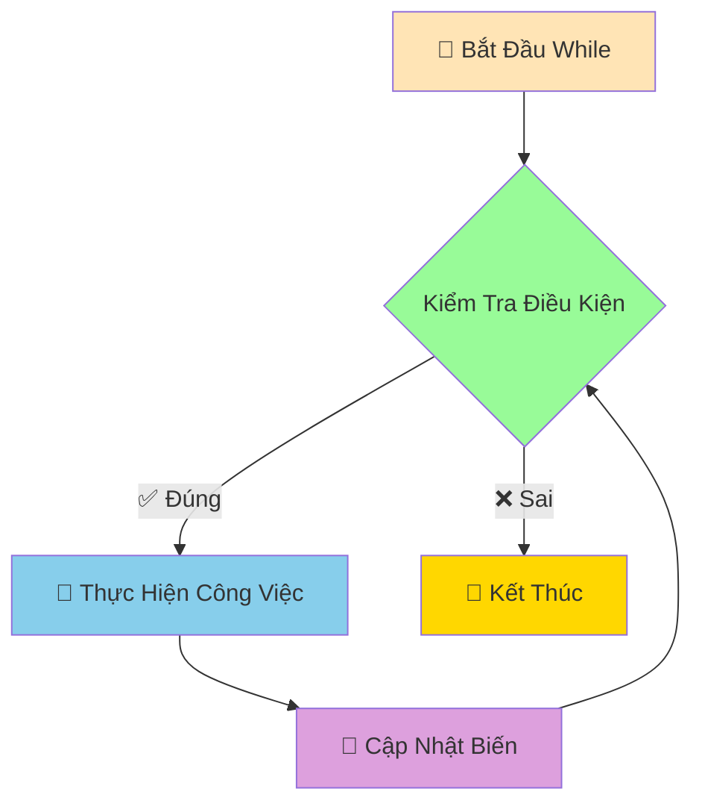

# ⏰ Vòng Lặp While - Lặp Đến Khi Điều Kiện Thay Đổi

:::tip ⏰ Ví Dụ Dễ Hiểu
Hãy tưởng tượng Python như một **người bảo vệ kiên nhẫn** đứng canh cửa! Anh ta sẽ **tiếp tục đứng đó** cho đến khi điều kiện thay đổi (ví dụ: có người đến, trời sáng, hoặc được lệnh nghỉ việc).
:::

## 🤔 While Khác For Như Thế Nào?

**For Loop** giống như **đồng hồ báo thức** - biết trước sẽ lặp bao nhiêu lần:
- "Chạy 10 vòng quanh sân"
- "Đọc 50 từ vựng"
- "In từ 1 đến 100"

**While Loop** giống như **người canh gác** - lặp đến khi điều kiện thay đổi:
- "Chạy **đến khi** mệt"
- "Học **đến khi** hiểu bài"
- "Chơi game **đến khi** thắng"



## 🎯 Cú Pháp While Cơ Bản

```python
while điều_kiện:
    # Công việc cần lặp
    # Nhớ cập nhật biến để tránh vòng lặp vô tận!
```

### 🌟 Ví Dụ Đơn Giản

```python
# Đếm từ 1 đến 5
dem = 1
while dem <= 5:
    print(f"Đếm: {dem}")
    dem += 1  # QUAN TRỌNG: Tăng biến đếm!

print("Xong rồi!")
```

:::warning ⚠️ Cảnh Báo Vòng Lặp Vô Tận
Nếu quên cập nhật biến, vòng lặp sẽ chạy mãi mãi!
```python
# ❌ NGUY HIỂM - Vòng lặp vô tận!
dem = 1
while dem <= 5:
    print(f"Đếm: {dem}")
    # Quên tăng dem - chạy mãi mãi!

# ✅ AN TOÀN - Nhớ cập nhật
dem = 1
while dem <= 5:
    print(f"Đếm: {dem}")
    dem += 1  # Cập nhật biến
```
:::

## 🎮 Ví Dụ Thực Tế: Game Đoán Số

```python
import random

# Game đoán số với while
so_may_tinh = random.randint(1, 20)
da_doan_dung = False
so_lan_thu = 0

print("🎮 GAME ĐOÁN SỐ")
print("Tôi đã nghĩ ra một số từ 1-20")
print("Hãy đoán xem đó là số nào!")
print("-" * 30)

while not da_doan_dung:
    so_lan_thu += 1
    
    try:
        so_doan = int(input(f"Lần {so_lan_thu} - Nhập số: "))
    except ValueError:
        print("❌ Vui lòng nhập một số!")
        continue
    
    if so_doan == so_may_tinh:
        print(f"🎉 ĐÚNG RỒI! Số tôi nghĩ là {so_may_tinh}")
        print(f"🏆 Bạn đoán đúng sau {so_lan_thu} lần!")
        da_doan_dung = True  # Kết thúc vòng lặp
    elif so_doan < so_may_tinh:
        print("📈 Số tôi nghĩ lớn hơn!")
    else:
        print("📉 Số tôi nghĩ nhỏ hơn!")
    
    # Gợi ý nếu đoán quá nhiều lần
    if so_lan_thu >= 5 and not da_doan_dung:
        print("💡 Gợi ý: Hãy thử số ở giữa khoảng!")

print("Cảm ơn bạn đã chơi!")
```

## 🔧 Break và Continue

### 🛑 Break - Thoát Khỏi Vòng Lặp

```python
# Tìm số chia hết cho 7
so = 1

print("Tìm 5 số đầu tiên chia hết cho 7:")
dem_tim_duoc = 0

while True:  # Vòng lặp vô tận
    if so % 7 == 0:
        print(f"Số {so} chia hết cho 7")
        dem_tim_duoc += 1
        
        if dem_tim_duoc == 5:
            print("Đã tìm đủ 5 số!")
            break  # Thoát khỏi vòng lặp
    
    so += 1

print("Kết thúc tìm kiếm")
```

### ⏭️ Continue - Bỏ Qua Lần Lặp Hiện Tại

```python
# In số từ 1-10, bỏ qua số chẵn
so = 0

print("Các số lẻ từ 1-10:")
while so < 10:
    so += 1
    
    if so % 2 == 0:  # Nếu là số chẵn
        continue     # Bỏ qua, quay lại đầu vòng lặp
    
    print(f"Số lẻ: {so}")

print("Hoàn thành!")
```

## 💰 Ví Dụ Thực Tế: Máy ATM

```python
# Mô phỏng máy ATM đơn giản
so_du_tai_khoan = 1000000  # 1 triệu VNĐ
ma_pin_dung = "1234"
so_lan_nhap_sai = 0
tai_khoan_bi_khoa = False

print("🏧 CHÀO MỪNG ĐẾN VỚI ATM BEHITEK")
print("=" * 40)

# Xác thực PIN
while so_lan_nhap_sai < 3:
    ma_pin = input("Nhập mã PIN (4 số): ")
    
    if ma_pin == ma_pin_dung:
        print("✅ Xác thực thành công!")
        break
    else:
        so_lan_nhap_sai += 1
        so_lan_con_lai = 3 - so_lan_nhap_sai
        
        if so_lan_con_lai > 0:
            print(f"❌ Mã PIN sai! Còn {so_lan_con_lai} lần thử")
        else:
            print("🔒 Tài khoản bị khóa do nhập sai PIN 3 lần!")
            tai_khoan_bi_khoa = True

# Nếu tài khoản không bị khóa, cho phép giao dịch
if not tai_khoan_bi_khoa:
    print(f"\n💰 Số dư hiện tại: {so_du_tai_khoan:,} VNĐ")
    
    dang_giao_dich = True
    while dang_giao_dich:
        print("\n📋 MENU GIAO DỊCH:")
        print("1. Kiểm tra số dư")
        print("2. Rút tiền")
        print("3. Thoát")
        
        lua_chon = input("Chọn chức năng (1-3): ")
        
        if lua_chon == "1":
            print(f"💰 Số dư tài khoản: {so_du_tai_khoan:,} VNĐ")
            
        elif lua_chon == "2":
            try:
                so_tien_rut = int(input("Nhập số tiền muốn rút: "))
                
                if so_tien_rut <= 0:
                    print("❌ Số tiền phải lớn hơn 0!")
                elif so_tien_rut > so_du_tai_khoan:
                    print("❌ Số dư không đủ!")
                    print(f"   Số dư hiện tại: {so_du_tai_khoan:,} VNĐ")
                elif so_tien_rut % 50000 != 0:
                    print("❌ Số tiền rút phải là bội số của 50,000 VNĐ!")
                else:
                    so_du_tai_khoan -= so_tien_rut
                    print(f"✅ Rút thành công {so_tien_rut:,} VNĐ")
                    print(f"💰 Số dư còn lại: {so_du_tai_khoan:,} VNĐ")
                    
            except ValueError:
                print("❌ Vui lòng nhập số hợp lệ!")
                
        elif lua_chon == "3":
            print("👋 Cảm ơn bạn đã sử dụng dịch vụ ATM!")
            print("🔒 Đang đăng xuất...")
            dang_giao_dich = False
            
        else:
            print("❌ Lựa chọn không hợp lệ!")
        
        # Hỏi có muốn tiếp tục không
        if dang_giao_dich and lua_chon in ["1", "2"]:
            tiep_tuc = input("\nBạn có muốn thực hiện giao dịch khác? (y/n): ")
            if tiep_tuc.lower() != 'y':
                print("👋 Cảm ơn bạn đã sử dụng dịch vụ!")
                dang_giao_dich = False

print("🔚 Kết thúc phiên giao dịch")
```

## 📊 Ví Dụ: Phân Tích Dữ Liệu Với While

```python
# Nhập và phân tích điểm số học sinh
print("📊 PHÂN TÍCH ĐIỂM SỐ LỚP HỌC")
print("Nhập điểm các em (nhập -1 để kết thúc)")
print("-" * 40)

diem_so = []
tong_diem = 0
so_hoc_sinh = 0

while True:
    try:
        diem = float(input(f"Nhập điểm học sinh {so_hoc_sinh + 1}: "))
        
        if diem == -1:
            print("Kết thúc nhập liệu!")
            break
            
        if diem < 0 or diem > 10:
            print("❌ Điểm phải từ 0-10!")
            continue
            
        diem_so.append(diem)
        tong_diem += diem
        so_hoc_sinh += 1
        
    except ValueError:
        print("❌ Vui lòng nhập số hợp lệ!")
        continue

# Phân tích kết quả
if so_hoc_sinh > 0:
    diem_trung_binh = tong_diem / so_hoc_sinh
    diem_cao_nhat = max(diem_so)
    diem_thap_nhat = min(diem_so)
    
    # Đếm xếp loại
    xuat_sac = gioi = kha = trung_binh = yeu = 0
    
    for diem in diem_so:
        if diem >= 9:
            xuat_sac += 1
        elif diem >= 8:
            gioi += 1
        elif diem >= 6.5:
            kha += 1
        elif diem >= 5:
            trung_binh += 1
        else:
            yeu += 1
    
    print("\n" + "="*50)
    print("📈 KẾT QUẢ PHÂN TÍCH")
    print("="*50)
    print(f"👥 Tổng số học sinh: {so_hoc_sinh}")
    print(f"📊 Điểm trung bình: {diem_trung_binh:.2f}")
    print(f"🏆 Điểm cao nhất: {diem_cao_nhat}")
    print(f"📉 Điểm thấp nhất: {diem_thap_nhat}")
    
    print(f"\n🎯 THỐNG KÊ XẾP LOẠI:")
    print(f"   Xuất sắc (≥9.0): {xuat_sac} HS ({xuat_sac/so_hoc_sinh*100:.1f}%)")
    print(f"   Giỏi (8.0-8.9): {gioi} HS ({gioi/so_hoc_sinh*100:.1f}%)")
    print(f"   Khá (6.5-7.9): {kha} HS ({kha/so_hoc_sinh*100:.1f}%)")
    print(f"   TB (5.0-6.4): {trung_binh} HS ({trung_binh/so_hoc_sinh*100:.1f}%)")
    print(f"   Yếu (<5.0): {yeu} HS ({yeu/so_hoc_sinh*100:.1f}%)")
    
else:
    print("❌ Không có dữ liệu để phân tích!")
```

## 🎯 Bài Tập Thực Hành

### 🥇 Bài Tập 1: Máy Tính Đơn Giản

```python
# TODO: Tạo máy tính có thể thực hiện nhiều phép tính
print("🧮 MÁY TÍNH ĐƠN GIẢN")
print("Các phép tính: +, -, *, /, %, **")
print("Gõ 'quit' để thoát")
print("-" * 30)

tiep_tuc = True
while tiep_tuc:
    try:
        # Nhập biểu thức
        bieu_thuc = input("Nhập phép tính (vd: 5 + 3): ")
        
        if bieu_thuc.lower() == 'quit':
            print("👋 Tạm biệt!")
            tiep_tuc = False
            continue
        
        # Tính toán (cẩn thận với eval!)
        ket_qua = eval(bieu_thuc)
        print(f"📊 Kết quả: {bieu_thuc} = {ket_qua}")
        
    except ZeroDivisionError:
        print("❌ Không thể chia cho 0!")
    except:
        print("❌ Biểu thức không hợp lệ!")
    
    print()  # Dòng trống
```

### 🥈 Bài Tập 2: Game Tài Xỉu

```python
import random

# TODO: Game tài xỉu với tiền cược
tien_hien_tai = 100000  # 100k VNĐ ban đầu

print("🎲 GAME TÀI XỈU")
print(f"💰 Tiền ban đầu: {tien_hien_tai:,} VNĐ")
print("🎯 Tài: tổng >= 11, Xỉu: tổng <= 10")
print("-" * 40)

while tien_hien_tai > 0:
    print(f"\n💰 Tiền hiện tại: {tien_hien_tai:,} VNĐ")
    
    # Nhập cược
    try:
        tien_cuoc = int(input("Số tiền cược (0 để thoát): "))
        
        if tien_cuoc == 0:
            break
            
        if tien_cuoc > tien_hien_tai:
            print("❌ Không đủ tiền!")
            continue
            
        if tien_cuoc < 1000:
            print("❌ Cược tối thiểu 1,000 VNĐ!")
            continue
            
    except ValueError:
        print("❌ Vui lòng nhập số hợp lệ!")
        continue
    
    # Chọn Tài/Xỉu
    lua_chon = input("Chọn Tài (T) hay Xỉu (X): ").upper()
    if lua_chon not in ['T', 'X']:
        print("❌ Chọn T hoặc X!")
        continue
    
    # Tung xúc xắc
    xuc_xac_1 = random.randint(1, 6)
    xuc_xac_2 = random.randint(1, 6)
    xuc_xac_3 = random.randint(1, 6)
    tong = xuc_xac_1 + xuc_xac_2 + xuc_xac_3
    
    print(f"🎲 Kết quả: {xuc_xac_1} - {xuc_xac_2} - {xuc_xac_3}")
    print(f"📊 Tổng: {tong}")
    
    # Xác định kết quả
    if tong >= 11:
        ket_qua = "TÀI"
    else:
        ket_qua = "XỈU"
    
    print(f"🎯 Kết quả: {ket_qua}")
    
    # So sánh và tính tiền
    if (lua_chon == 'T' and ket_qua == "TÀI") or (lua_chon == 'X' and ket_qua == "XỈU"):
        tien_thang = tien_cuoc
        tien_hien_tai += tien_thang
        print(f"🎉 THẮNG! +{tien_thang:,} VNĐ")
    else:
        tien_hien_tai -= tien_cuoc
        print(f"😢 THUA! -{tien_cuoc:,} VNĐ")
    
    # Kiểm tra hết tiền
    if tien_hien_tai <= 0:
        print("💸 Bạn đã hết tiền!")
        break

print(f"\n🏁 KẾT THÚC GAME")
print(f"💰 Tiền cuối game: {tien_hien_tai:,} VNĐ")

if tien_hien_tai > 100000:
    print("🎊 Chúc mừng! Bạn đã thắng lớn!")
elif tien_hien_tai == 100000:
    print("😐 Hòa vốn, không thắng không thua!")
else:
    print("😅 Thua rồi! Lần sau cẩn thận hơn nhé!")
```

## 🎊 Tóm Tắt

Trong bài này, bạn đã học được:

✅ **While loop cơ bản** - Lặp theo điều kiện  
✅ **Break và Continue** - Điều khiển vòng lặp  
✅ **Tránh vòng lặp vô tận** - Nhớ cập nhật biến  
✅ **Ứng dụng thực tế** - Game, ATM, phân tích dữ liệu  
✅ **Xử lý input người dùng** - Validation và error handling  

## 🚀 Bước Tiếp Theo

Tuyệt vời! Bây giờ Python đã biết cả **2 loại vòng lặp** rồi! Tiếp theo, chúng ta sẽ học về [Danh Sách Cơ Bản (Lists)](/python/intermediate/lists-basics) - cách lưu trữ và quản lý **nhiều dữ liệu cùng lúc**!

:::tip 🎯 Thử Thách Nhỏ
Hãy thử tạo một "chương trình quản lý mật khẩu" sử dụng while loop! Cho phép người dùng thêm, xem, tìm kiếm và xóa mật khẩu. Chương trình chạy cho đến khi người dùng chọn thoát!
:::

---

*🔗 **Bài tiếp theo**: [Danh Sách Cơ Bản - Lưu Trữ Nhiều Dữ Liệu Cùng Lúc](/python/intermediate/lists-basics)*
