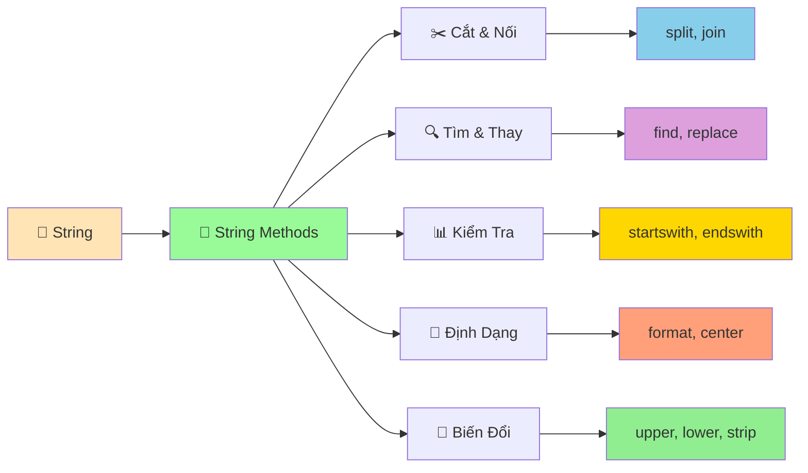

# 🧵 String Methods Nâng Cao – Siêu hay mà dễ

::::tip Gợi ý thân thiện
Chuỗi như sợi dây: bạn có thể cắt, nối, nhuộm màu (viết hoa/thường), kiểm tra, và dệt thành câu hoàn chỉnh. Đừng lo, từng bước một thôi!
::::

## ✂️ Cắt gọt khoảng trắng: `strip`, `lstrip`, `rstrip`

```python
text = "  xin chao  "
print(text.strip())   # "xin chao"
print(text.lstrip())  # "xin chao "
print(text.rstrip())  # "  xin chao"
```

## 🔡 Viết hoa/thường: `lower`, `upper`, `title`, `capitalize`, `casefold`

```python
s = "TiẾng ViỆt"
print(s.lower())      # tiếng việt
print(s.upper())      # TIẾNG VIỆT
print(s.title())      # Tiếng Việt
print(s.capitalize()) # Tiếng việt
print("ß".casefold()) # ss (so sánh không phân biệt chữ hoa/thường mạnh mẽ)
```

## 🔍 Tìm kiếm: `find`, `rfind`, `index`, `startswith`, `endswith`

```python
msg = "hello world"
print(msg.find("o"))        # 4 (không lỗi nếu không thấy: trả -1)
print(msg.rfind("o"))       # 7
print(msg.startswith("he")) # True
print(msg.endswith("ld"))   # True
```

## 🔁 Thay thế & chia nhỏ: `replace`, `split`, `rsplit`, `partition`

```python
print("a,b,c".split(","))          # ['a', 'b', 'c']
print("a,b,c".rsplit(",", 1))      # ['a,b', 'c']
print("2025-09-29".partition("-")) # ('2025', '-', '09-29')
print("banana".replace("na", "*"))  # ba**
```

## 🧵 Nối chuỗi: `join`

```python
words = ["Python", "dễ", "ghê"]
print(" ".join(words))  # "Python dễ ghê"
```

## ✅ Kiểm tra nội dung: nhóm `is*`

```python
print("123".isdecimal())   # True
print("一二三".isdecimal()) # False, nhưng isdigit() có thể True với một số ký tự
print("abc".isalpha())     # True
print("abc123".isalnum())  # True
print("\n\t".isspace())     # True
```

## 🧮 Căn lề & đệm: `center`, `ljust`, `rjust`, `zfill`

```python
print("7".zfill(3))        # 007
print("hi".center(6, "*")) # **hi**
```

## 🧰 Bảng dịch: `maketrans` + `translate`

```python
table = str.maketrans({"a": "@", "s": "$"})
print("password".translate(table))  # p@$$word
```

## 🧩 Định dạng chuỗi: f-strings và `format`

```python
name = "Lan"
score = 9.456
print(f"Bạn {name} đạt {score:.1f} điểm")        # f-string
print("Bạn {0} đạt {1:.1f} điểm".format(name, score))
```

## 🧪 Thực hành nhỏ

1) Tách họ và tên từ chuỗi "  nguyen   van   a  " và in chuẩn hoá: "Nguyen Van A".
2) Viết hàm `mask_email(email)` che tên người dùng: `abc@example.com` → `***@example.com`.
3) Đổi ký tự tiếng Việt có dấu thành không dấu (gợi ý: `translate`).

---

👉 Áp dụng các phương thức này trong dự án `password-generator` để làm sạch input và hiển thị đẹp hơn.

---
sidebar_position: 11
title: "🔤 String Methods - Xử Lý Văn Bản Nâng Cao"
description: "Học các phương thức mạnh mẽ của string trong Python: format, split, join, replace, và nhiều hơn nữa. Biến văn bản thành công cụ siêu mạnh!"
keywords: ["python", "string methods", "text processing", "format", "split", "join", "replace", "xử lý văn bản"]
---

# 🔤 String Methods - Xử Lý Văn Bản Nâng Cao

:::tip 🔤 Ví Dụ Dễ Hiểu
Hãy tưởng tượng String như một **câu văn** và String Methods như những **công cụ chỉnh sửa văn bản**! Bạn có thể cắt, nối, thay thế, tìm kiếm, và biến đổi văn bản theo ý muốn - giống như một nhà biên tập chuyên nghiệp!
:::

## 🤔 String Methods Là Gì?

**String Methods** là những **chức năng đặc biệt** mà Python đã tích hợp sẵn cho chuỗi ký tự. Thay vì bạn phải tự viết code phức tạp, chỉ cần gọi tên phương thức là xong!



### 🆚 So Sánh Với Code Thông Thường

```python
# ❌ Cách cũ - tự viết code phức tạp
def chuyen_thanh_chu_hoa(chuoi):
    ket_qua = ""
    for ky_tu in chuoi:
        if 'a' <= ky_tu <= 'z':
            ket_qua += chr(ord(ky_tu) - 32)
        else:
            ket_qua += ky_tu
    return ket_qua

# ✅ Cách mới - sử dụng string method
chuoi_hoa = chuoi.upper()  # Đơn giản hơn nhiều!
```

## 🎯 Các Phương Thức Cơ Bản

### 🔄 Biến Đổi Chữ Hoa/Thường

```python
# Chuỗi mẫu
ten = "Nguyễn Văn An"

# Chuyển thành chữ hoa
ten_hoa = ten.upper()
print("Chữ hoa:", ten_hoa)  # NGUYỄN VĂN AN

# Chuyển thành chữ thường
ten_thuong = ten.lower()
print("Chữ thường:", ten_thuong)  # nguyễn văn an

# Chữ hoa đầu từ
ten_title = ten.title()
print("Title case:", ten_title)  # Nguyễn Văn An

# Chữ hoa đầu câu
ten_capitalize = ten.capitalize()
print("Capitalize:", ten_capitalize)  # Nguyễn văn an

# Đảo ngược chữ hoa/thường
ten_swap = ten.swapcase()
print("Swap case:", ten_swap)  # nGUYỄN vĂN aN
```

### ✂️ Cắt và Nối Chuỗi

```python
# Chuỗi mẫu
cau = "Python là ngôn ngữ lập trình tuyệt vời"

# Tách chuỗi thành list
tu = cau.split()
print("Tách theo khoảng trắng:", tu)
# ['Python', 'là', 'ngôn', 'ngữ', 'lập', 'trình', 'tuyệt', 'vời']

# Tách theo ký tự cụ thể
email = "user@example.com"
phan_email = email.split("@")
print("Tách email:", phan_email)  # ['user', 'example.com']

# Nối list thành chuỗi
tu_lai = " ".join(tu)
print("Nối lại:", tu_lai)  # Python là ngôn ngữ lập trình tuyệt vời

# Nối với ký tự khác
tu_gach_ngang = "-".join(tu)
print("Nối với gạch ngang:", tu_gach_ngang)
# Python-là-ngôn-ngữ-lập-trình-tuyệt-vời
```

### 🔍 Tìm Kiếm và Thay Thế

```python
# Chuỗi mẫu
van_ban = "Python là ngôn ngữ lập trình Python tuyệt vời"

# Tìm vị trí
vi_tri = van_ban.find("Python")
print("Vị trí đầu tiên của 'Python':", vi_tri)  # 0

vi_tri_cuoi = van_ban.rfind("Python")
print("Vị trí cuối cùng của 'Python':", vi_tri_cuoi)  # 25

# Đếm số lần xuất hiện
so_lan = van_ban.count("Python")
print("Số lần xuất hiện 'Python':", so_lan)  # 2

# Kiểm tra bắt đầu/kết thúc
bat_dau = van_ban.startswith("Python")
ket_thuc = van_ban.endswith("tuyệt vời")
print("Bắt đầu với 'Python':", bat_dau)  # True
print("Kết thúc với 'tuyệt vời':", ket_thuc)  # True

# Thay thế
van_ban_moi = van_ban.replace("Python", "Java")
print("Sau khi thay thế:", van_ban_moi)
# Java là ngôn ngữ lập trình Java tuyệt vời
```

## 🎨 Định Dạng Chuỗi

### 📊 Format và F-strings

```python
# F-strings (Python 3.6+)
ten = "An"
tuoi = 16
diem = 8.5

# F-string cơ bản
thong_tin = f"Tên: {ten}, Tuổi: {tuoi}, Điểm: {diem}"
print("F-string:", thong_tin)

# F-string với định dạng
thong_tin_dinh_dang = f"Tên: {ten:>10}, Tuổi: {tuoi:>3}, Điểm: {diem:>5.1f}"
print("F-string định dạng:", thong_tin_dinh_dang)

# Format method
thong_tin_format = "Tên: {}, Tuổi: {}, Điểm: {}".format(ten, tuoi, diem)
print("Format method:", thong_tin_format)

# Format với chỉ số
thong_tin_chi_so = "Tên: {0}, Tuổi: {1}, Điểm: {2:.1f}".format(ten, tuoi, diem)
print("Format với chỉ số:", thong_tin_chi_so)
```

### 🎯 Căn Chỉnh và Padding

```python
# Chuỗi mẫu
ten = "Python"

# Căn giữa
ten_giua = ten.center(20, "-")
print("Căn giữa:", ten_giua)  # -------Python-------

# Căn trái
ten_trai = ten.ljust(20, ".")
print("Căn trái:", ten_trai)  # Python..............

# Căn phải
ten_phai = ten.rjust(20, ".")
print("Căn phải:", ten_phai)  # ..............Python

# Padding với số
so = "42"
so_padding = so.zfill(5)
print("Zero padding:", so_padding)  # 00042
```

## 🧹 Làm Sạch Chuỗi

### 🗑️ Loại Bỏ Khoảng Trắng

```python
# Chuỗi có khoảng trắng thừa
chuoi_ban = "   Python Programming   "

# Loại bỏ khoảng trắng đầu và cuối
chuoi_sach = chuoi_ban.strip()
print("Strip:", f"'{chuoi_sach}'")  # 'Python Programming'

# Loại bỏ khoảng trắng bên trái
chuoi_trai = chuoi_ban.lstrip()
print("Lstrip:", f"'{chuoi_trai}'")  # 'Python Programming   '

# Loại bỏ khoảng trắng bên phải
chuoi_phai = chuoi_ban.rstrip()
print("Rstrip:", f"'{chuoi_phai}'")  # '   Python Programming'

# Loại bỏ ký tự cụ thể
chuoi_ky_tu = "***Python***"
chuoi_sach_ky_tu = chuoi_ky_tu.strip("*")
print("Strip ký tự:", chuoi_sach_ky_tu)  # Python
```

### 🔤 Kiểm Tra Loại Ký Tự

```python
# Chuỗi mẫu
chuoi_so = "12345"
chuoi_chu = "Python"
chuoi_hoa = "PYTHON"
chuoi_thuong = "python"
chuoi_hoa_thuong = "Python"

# Kiểm tra số
print("Chỉ chứa số:", chuoi_so.isdigit())  # True
print("Chỉ chứa chữ:", chuoi_chu.isalpha())  # True
print("Chỉ chứa chữ và số:", "Python123".isalnum())  # True

# Kiểm tra chữ hoa/thường
print("Tất cả chữ hoa:", chuoi_hoa.isupper())  # True
print("Tất cả chữ thường:", chuoi_thuong.islower())  # True
print("Chữ hoa đầu từ:", chuoi_hoa_thuong.istitle())  # True

# Kiểm tra khoảng trắng
print("Chỉ khoảng trắng:", "   ".isspace())  # True
print("Có thể in được:", "Hello World!".isprintable())  # True
```

## 🎪 Ví Dụ Thực Tế: Hệ Thống Xử Lý Văn Bản

```python
# 📝 Hệ thống xử lý văn bản với string methods
class XuLyVanBan:
    def __init__(self):
        self.van_ban_goc = ""
        self.van_ban_da_xu_ly = ""
    
    def nhap_van_ban(self, van_ban):
        """Nhập văn bản cần xử lý"""
        self.van_ban_goc = van_ban
        self.van_ban_da_xu_ly = van_ban
        print(f"✅ Đã nhập văn bản: {len(van_ban)} ký tự")
    
    def lam_sach_van_ban(self):
        """Làm sạch văn bản"""
        # Loại bỏ khoảng trắng thừa
        self.van_ban_da_xu_ly = self.van_ban_da_xu_ly.strip()
        
        # Thay thế nhiều khoảng trắng bằng một
        import re
        self.van_ban_da_xu_ly = re.sub(r'\s+', ' ', self.van_ban_da_xu_ly)
        
        print("🧹 Đã làm sạch văn bản")
        return self.van_ban_da_xu_ly
    
    def chuan_hoa_ten(self):
        """Chuẩn hóa tên riêng"""
        # Tách thành từng từ
        tu = self.van_ban_da_xu_ly.split()
        
        # Chuẩn hóa từng từ
        tu_chuan_hoa = []
        for tu_rieng in tu:
            # Chuyển thành chữ thường rồi title case
            tu_chuan_hoa.append(tu_rieng.lower().title())
        
        self.van_ban_da_xu_ly = " ".join(tu_chuan_hoa)
        print("📝 Đã chuẩn hóa tên riêng")
        return self.van_ban_da_xu_ly
    
    def tao_slug(self):
        """Tạo slug từ văn bản"""
        # Chuyển thành chữ thường
        slug = self.van_ban_da_xu_ly.lower()
        
        # Thay thế khoảng trắng bằng gạch ngang
        slug = slug.replace(" ", "-")
        
        # Loại bỏ ký tự đặc biệt (giữ lại chữ, số, gạch ngang)
        import re
        slug = re.sub(r'[^a-z0-9\-]', '', slug)
        
        # Loại bỏ nhiều gạch ngang liên tiếp
        slug = re.sub(r'-+', '-', slug)
        
        # Loại bỏ gạch ngang đầu và cuối
        slug = slug.strip('-')
        
        print("🔗 Đã tạo slug")
        return slug
    
    def dem_tu(self):
        """Đếm từ trong văn bản"""
        tu = self.van_ban_da_xu_ly.split()
        so_tu = len(tu)
        
        print(f"📊 Số từ: {so_tu}")
        return so_tu
    
    def dem_ky_tu(self):
        """Đếm ký tự trong văn bản"""
        so_ky_tu = len(self.van_ban_da_xu_ly)
        so_ky_tu_khong_trang = len(self.van_ban_da_xu_ly.replace(" ", ""))
        
        print(f"📊 Tổng ký tự: {so_ky_tu}")
        print(f"📊 Ký tự (không tính khoảng trắng): {so_ky_tu_khong_trang}")
        
        return so_ky_tu, so_ky_tu_khong_trang
    
    def tim_tu_pho_bien(self, top=5):
        """Tìm từ phổ biến nhất"""
        # Tách từ và làm sạch
        tu = self.van_ban_da_xu_ly.lower().split()
        tu_sach = [tu_rieng.strip(".,!?;:") for tu_rieng in tu]
        
        # Đếm tần suất
        tan_suat = {}
        for tu_rieng in tu_sach:
            if len(tu_rieng) > 2:  # Bỏ qua từ quá ngắn
                tan_suat[tu_rieng] = tan_suat.get(tu_rieng, 0) + 1
        
        # Sắp xếp theo tần suất
        tu_pho_bien = sorted(tan_suat.items(), key=lambda x: x[1], reverse=True)
        
        print(f"📈 {top} từ phổ biến nhất:")
        for i, (tu_rieng, so_lan) in enumerate(tu_pho_bien[:top], 1):
            print(f"   {i}. '{tu_rieng}': {so_lan} lần")
        
        return tu_pho_bien[:top]
    
    def tao_tom_tat(self, do_dai=100):
        """Tạo tóm tắt văn bản"""
        if len(self.van_ban_da_xu_ly) <= do_dai:
            tom_tat = self.van_ban_da_xu_ly
        else:
            # Cắt tại từ gần nhất
            tom_tat = self.van_ban_da_xu_ly[:do_dai]
            vi_tri_cat = tom_tat.rfind(" ")
            if vi_tri_cat > 0:
                tom_tat = tom_tat[:vi_tri_cat]
            tom_tat += "..."
        
        print(f"📄 Tóm tắt ({len(tom_tat)} ký tự): {tom_tat}")
        return tom_tat
    
    def hien_thi_ket_qua(self):
        """Hiển thị kết quả xử lý"""
        print("\n📋 KẾT QUẢ XỬ LÝ VĂN BẢN")
        print("=" * 50)
        print(f"📝 Văn bản gốc: {self.van_ban_goc}")
        print(f"✨ Văn bản đã xử lý: {self.van_ban_da_xu_ly}")
        
        # Thống kê
        self.dem_tu()
        self.dem_ky_tu()
        
        # Slug
        slug = self.tao_slug()
        print(f"🔗 Slug: {slug}")
        
        # Tóm tắt
        self.tao_tom_tat()
        
        # Từ phổ biến
        self.tim_tu_pho_bien()

# Sử dụng hệ thống
xu_ly = XuLyVanBan()

# Văn bản mẫu
van_ban_mau = "   Python là ngôn ngữ lập trình tuyệt vời. Python rất dễ học và mạnh mẽ.   "

# Xử lý văn bản
xu_ly.nhap_van_ban(van_ban_mau)
xu_ly.lam_sach_van_ban()
xu_ly.chuan_hoa_ten()
xu_ly.hien_thi_ket_qua()
```

## 🎯 Bài Tập Thực Hành

### 🥇 Bài Tập 1: Hệ Thống Quản Lý Email

```python
# TODO: Tạo hệ thống quản lý email với string methods
class QuanLyEmail:
    def __init__(self):
        self.danh_sach_email = []
    
    def them_email(self, email):
        """Thêm email mới"""
        if self.kiem_tra_email_hop_le(email):
            email_chuan_hoa = self.chuan_hoa_email(email)
            if email_chuan_hoa not in self.danh_sach_email:
                self.danh_sach_email.append(email_chuan_hoa)
                print(f"✅ Đã thêm email: {email_chuan_hoa}")
            else:
                print(f"⚠️  Email đã tồn tại: {email_chuan_hoa}")
        else:
            print(f"❌ Email không hợp lệ: {email}")
    
    def kiem_tra_email_hop_le(self, email):
        """Kiểm tra email có hợp lệ không"""
        email = email.strip().lower()
        
        # Kiểm tra cơ bản
        if "@" not in email:
            return False
        
        # Tách phần local và domain
        phan = email.split("@")
        if len(phan) != 2:
            return False
        
        local, domain = phan
        
        # Kiểm tra phần local
        if not local or len(local) > 64:
            return False
        
        # Kiểm tra phần domain
        if not domain or "." not in domain:
            return False
        
        # Kiểm tra ký tự hợp lệ
        if not local.replace(".", "").replace("_", "").replace("-", "").isalnum():
            return False
        
        return True
    
    def chuan_hoa_email(self, email):
        """Chuẩn hóa email"""
        # Loại bỏ khoảng trắng và chuyển thành chữ thường
        email = email.strip().lower()
        
        # Loại bỏ ký tự đặc biệt không cần thiết
        email = email.replace(" ", "")
        
        return email
    
    def lay_ten_mien(self, email):
        """Lấy tên miền từ email"""
        if "@" in email:
            return email.split("@")[1]
        return None
    
    def loc_email_theo_mien(self, ten_mien):
        """Lọc email theo tên miền"""
        email_cung_mien = []
        for email in self.danh_sach_email:
            if self.lay_ten_mien(email) == ten_mien.lower():
                email_cung_mien.append(email)
        
        return email_cung_mien
    
    def tao_bao_cao(self):
        """Tạo báo cáo thống kê"""
        if not self.danh_sach_email:
            print("📊 Chưa có email nào")
            return
        
        print("\n📊 BÁO CÁO EMAIL")
        print("=" * 40)
        print(f"📧 Tổng số email: {len(self.danh_sach_email)}")
        
        # Thống kê theo tên miền
        thong_ke_mien = {}
        for email in self.danh_sach_email:
            mien = self.lay_ten_mien(email)
            if mien:
                thong_ke_mien[mien] = thong_ke_mien.get(mien, 0) + 1
        
        print(f"\n🌐 Thống kê theo tên miền:")
        for mien, so_luong in sorted(thong_ke_mien.items()):
            print(f"   {mien}: {so_luong} email")
        
        # Email phổ biến nhất
        mien_pho_bien = max(thong_ke_mien.items(), key=lambda x: x[1])
        print(f"\n🏆 Tên miền phổ biến nhất: {mien_pho_bien[0]} ({mien_pho_bien[1]} email)")

# Sử dụng hệ thống
quan_ly = QuanLyEmail()

# Thêm email
email_list = [
    "  user@example.com  ",
    "ADMIN@GMAIL.COM",
    "test.user@yahoo.com",
    "invalid-email",
    "another@example.com",
    "user123@gmail.com"
]

for email in email_list:
    quan_ly.them_email(email)

# Tạo báo cáo
quan_ly.tao_bao_cao()

# Lọc email theo miền
gmail_emails = quan_ly.loc_email_theo_mien("gmail.com")
print(f"\n📧 Email Gmail: {gmail_emails}")
```

### 🥈 Bài Tập 2: Game Đoán Từ Với String Methods

```python
# TODO: Tạo game đoán từ với string methods
import random

class GameDoanTu:
    def __init__(self):
        self.tu_vung = [
            "python", "programming", "computer", "algorithm", "function",
            "variable", "loop", "condition", "string", "number",
            "list", "dictionary", "class", "object", "method"
        ]
        self.tu_can_doan = ""
        self.tu_da_doan = []
        self.ky_tu_da_doan = set()
        self.so_lan_thu = 0
        self.so_lan_thu_toi_da = 0
    
    def bat_dau_game(self):
        """Bắt đầu game mới"""
        self.tu_can_doan = random.choice(self.tu_vung)
        self.tu_da_doan = []
        self.ky_tu_da_doan = set()
        self.so_lan_thu = 0
        self.so_lan_thu_toi_da = len(self.tu_can_doan) + 3
        
        print(f"🎮 GAME ĐOÁN TỪ VỰNG LẬP TRÌNH")
        print("=" * 50)
        print(f"Từ có {len(self.tu_can_doan)} chữ cái")
        print(f"Bạn có {self.so_lan_thu_toi_da} lần đoán")
        print("Gõ 'quit' để thoát, 'hint' để gợi ý")
        print("-" * 50)
    
    def hien_thi_tu_an(self):
        """Hiển thị từ ẩn với ký tự đã đoán"""
        hien_thi = ""
        for ky_tu in self.tu_can_doan:
            if ky_tu in self.ky_tu_da_doan:
                hien_thi += ky_tu
            else:
                hien_thi += "_"
        return hien_thi
    
    def xu_ly_doan_tu(self, doan):
        """Xử lý đoán từ"""
        doan = doan.strip().lower()
        
        if doan == self.tu_can_doan:
            return "correct"
        elif doan in self.tu_da_doan:
            return "already_guessed"
        elif len(doan) != len(self.tu_can_doan):
            return "wrong_length"
        elif not doan.isalpha():
            return "invalid"
        else:
            self.tu_da_doan.append(doan)
            return "wrong"
    
    def xu_ly_doan_ky_tu(self, ky_tu):
        """Xử lý đoán ký tự"""
        ky_tu = ky_tu.strip().lower()
        
        if len(ky_tu) != 1:
            return "invalid_length"
        elif not ky_tu.isalpha():
            return "invalid_char"
        elif ky_tu in self.ky_tu_da_doan:
            return "already_guessed"
        else:
            self.ky_tu_da_doan.add(ky_tu)
            if ky_tu in self.tu_can_doan:
                return "correct"
            else:
                return "wrong"
    
    def tao_goi_y(self):
        """Tạo gợi ý thông minh"""
        ky_tu_chua_doan = set(self.tu_can_doan) - self.ky_tu_da_doan
        
        if not ky_tu_chua_doan:
            return "Bạn đã đoán hết ký tự rồi!"
        
        # Chọn ký tự phổ biến nhất chưa đoán
        ky_tu_pho_bien = max(ky_tu_chua_doan, key=lambda x: self.tu_can_doan.count(x))
        
        # Tạo gợi ý dựa trên vị trí
        vi_tri = self.tu_can_doan.find(ky_tu_pho_bien)
        if vi_tri == 0:
            vi_tri_mo_ta = "đầu"
        elif vi_tri == len(self.tu_can_doan) - 1:
            vi_tri_mo_ta = "cuối"
        else:
            vi_tri_mo_ta = f"vị trí {vi_tri + 1}"
        
        return f"💡 Gợi ý: Từ có chứa ký tự '{ky_tu_pho_bien}' ở {vi_tri_mo_ta}"
    
    def tinh_diem(self):
        """Tính điểm dựa trên hiệu suất"""
        so_ky_tu_dung = len(self.ky_tu_da_doan.intersection(set(self.tu_can_doan)))
        so_ky_tu_sai = len(self.ky_tu_da_doan - set(self.tu_can_doan))
        
        diem_co_ban = len(self.tu_can_doan) * 10
        diem_bo_sung = so_ky_tu_dung * 5
        diem_tru = so_ky_tu_sai * 2
        diem_tru_lan_thu = self.so_lan_thu * 1
        
        diem_tong = diem_co_ban + diem_bo_sung - diem_tru - diem_tru_lan_thu
        return max(0, diem_tong)
    
    def choi_game(self):
        """Chơi game chính"""
        self.bat_dau_game()
        
        while self.so_lan_thu < self.so_lan_thu_toi_da:
            self.so_lan_thu += 1
            remaining = self.so_lan_thu_toi_da - self.so_lan_thu + 1
            
            # Hiển thị trạng thái
            tu_an = self.hien_thi_tu_an()
            print(f"\n🔤 Lần thử {self.so_lan_thu}/{self.so_lan_thu_toi_da} (Còn {remaining} lần)")
            print(f"Từ: {tu_an}")
            
            # Hiển thị ký tự đã đoán
            if self.ky_tu_da_doan:
                ky_tu_str = ", ".join(sorted(self.ky_tu_da_doan))
                print(f"Ký tự đã đoán: {ky_tu_str}")
            
            # Hiển thị từ đã đoán
            if self.tu_da_doan:
                tu_str = ", ".join(self.tu_da_doan)
                print(f"Từ đã đoán: {tu_str}")
            
            # Nhập đoán
            try:
                doan = input("Nhập ký tự hoặc từ: ").strip()
                
                if doan.lower() == 'quit':
                    print("👋 Tạm biệt!")
                    return
                
                if doan.lower() == 'hint':
                    print(self.tao_goi_y())
                    self.so_lan_thu -= 1
                    continue
                
                # Xử lý đoán
                if len(doan) == 1:
                    # Đoán ký tự
                    result = self.xu_ly_doan_ky_tu(doan)
                    
                    if result == "correct":
                        print("✅ Đúng! Ký tự có trong từ")
                        
                        # Kiểm tra đã đoán hết chưa
                        if set(self.tu_can_doan).issubset(self.ky_tu_da_doan):
                            diem = self.tinh_diem()
                            print(f"\n🎉 HOÀN THÀNH! Từ đúng là: {self.tu_can_doan}")
                            print(f"🏆 Điểm: {diem}")
                            return
                    
                    elif result == "wrong":
                        print("❌ Sai! Ký tự không có trong từ")
                    
                    elif result == "already_guessed":
                        print("⚠️  Bạn đã đoán ký tự này rồi!")
                        self.so_lan_thu -= 1
                    
                    elif result == "invalid_length":
                        print("❌ Vui lòng nhập 1 ký tự!")
                        self.so_lan_thu -= 1
                    
                    elif result == "invalid_char":
                        print("❌ Vui lòng nhập ký tự hợp lệ!")
                        self.so_lan_thu -= 1
                
                else:
                    # Đoán từ
                    result = self.xu_ly_doan_tu(doan)
                    
                    if result == "correct":
                        diem = self.tinh_diem()
                        print(f"\n🎉 CHÍNH XÁC! Từ đúng là: {self.tu_can_doan}")
                        print(f"🏆 Điểm: {diem}")
                        return
                    
                    elif result == "wrong":
                        print("❌ Từ không đúng!")
                    
                    elif result == "already_guessed":
                        print("⚠️  Bạn đã đoán từ này rồi!")
                        self.so_lan_thu -= 1
                    
                    elif result == "wrong_length":
                        print(f"❌ Từ phải có {len(self.tu_can_doan)} chữ cái!")
                        self.so_lan_thu -= 1
                    
                    elif result == "invalid":
                        print("❌ Vui lòng nhập từ hợp lệ!")
                        self.so_lan_thu -= 1
            
            except KeyboardInterrupt:
                print("\n👋 Tạm biệt!")
                return
        
        # Hết lượt
        diem = self.tinh_diem()
        print(f"\n💔 HẾT LƯỢT! Từ đúng là: {self.tu_can_doan}")
        print(f"🏆 Điểm: {diem}")

# Chạy game
game = GameDoanTu()
game.choi_game()
```

## 🎊 Tóm Tắt

Trong bài này, bạn đã học được:

✅ **Biến đổi chữ hoa/thường** - `upper()`, `lower()`, `title()`, `capitalize()`  
✅ **Cắt và nối chuỗi** - `split()`, `join()`  
✅ **Tìm kiếm và thay thế** - `find()`, `count()`, `replace()`  
✅ **Định dạng chuỗi** - F-strings, `format()`, `center()`, `just()`  
✅ **Làm sạch chuỗi** - `strip()`, `lstrip()`, `rstrip()`  
✅ **Kiểm tra loại ký tự** - `isdigit()`, `isalpha()`, `isupper()`  
✅ **Ứng dụng thực tế** - Xử lý văn bản, quản lý email, game đoán từ  

## 🚀 Bước Tiếp Theo

Tuyệt vời! Bây giờ bạn đã thành thạo **xử lý văn bản nâng cao**! Tiếp theo, chúng ta sẽ học về [List Comprehension](/python/intermediate/list-comprehension) - cú pháp Pythonic siêu mạnh mẽ!

:::tip 🎯 Thử Thách Nhỏ
Hãy thử tạo một "hệ thống phân tích văn bản" sử dụng tất cả string methods! Phân tích độ dài, tần suất từ, sentiment, và tạo báo cáo chi tiết!
:::

---

*🔗 **Bài tiếp theo**: [List Comprehension - Cú Pháp Pythonic Siêu Mạnh](/python/intermediate/list-comprehension)*
