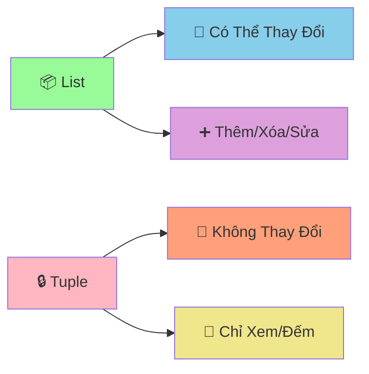

# 🔒 Tuples - Cấu Trúc Dữ Liệu Không Thay Đổi

:::tip 🔒 Ví Dụ Dễ Hiểu
Hãy tưởng tượng Tuple như một **hộp đựng đồ bị khóa**! Một khi đã đóng hộp và khóa lại, bạn không thể thêm, bớt, hay thay đổi gì bên trong. Nhưng bạn vẫn có thể **xem** và **đếm** những gì có trong đó!
:::

## 🤔 Tuple Là Gì?

**Tuple** là cấu trúc dữ liệu giống như List, nhưng **không thể thay đổi** (immutable). Một khi tạo ra, bạn không thể:
- ➕ Thêm phần tử
- ❌ Xóa phần tử  
- 🔄 Thay đổi giá trị phần tử



### 🆚 So Sánh List vs Tuple

```python
# List - có thể thay đổi
danh_sach = [1, 2, 3]
danh_sach.append(4)        # ✅ Được
danh_sach[0] = 10          # ✅ Được
danh_sach.remove(2)        # ✅ Được

# Tuple - không thể thay đổi
danh_sach_co_dinh = (1, 2, 3)
# danh_sach_co_dinh.append(4)     # ❌ Lỗi!
# danh_sach_co_dinh[0] = 10       # ❌ Lỗi!
# danh_sach_co_dinh.remove(2)     # ❌ Lỗi!
```

## 🎯 Tạo Tuple

### 📌 Cách Tạo Cơ Bản

```python
# Cách 1: Dùng dấu ngoặc đơn
tuple_1 = (1, 2, 3, 4, 5)
tuple_2 = ("An", "Bình", "Châu")

# Cách 2: Không cần dấu ngoặc (tuple packing)
tuple_3 = 1, 2, 3, 4, 5
tuple_4 = "Python", "Java", "C++"

# Tuple rỗng
tuple_rong = ()

# Tuple có 1 phần tử (cần dấu phẩy!)
tuple_1_phan_tu = (42,)  # Quan trọng: dấu phẩy!
tuple_1_phan_tu_2 = 42,  # Cũng được

print("Tuple 1:", tuple_1)
print("Tuple 2:", tuple_2)
print("Tuple rỗng:", tuple_rong)
print("Tuple 1 phần tử:", tuple_1_phan_tu)
```

### 🎨 Các Kiểu Dữ Liệu Trong Tuple

```python
# Tuple hỗn hợp
thong_tin_hoc_sinh = ("Nguyễn Văn An", 16, "9A", 8.5, True)

# Tuple lồng nhau
diem_so = ((8.5, 7.0), (9.0, 8.5), (7.5, 6.0))

# Tuple chứa list (list vẫn có thể thay đổi!)
tuple_co_list = (1, 2, [3, 4, 5])
tuple_co_list[2].append(6)  # ✅ Được! Vì list bên trong vẫn mutable
print("Tuple có list:", tuple_co_list)  # (1, 2, [3, 4, 5, 6])
```

## 🔍 Truy Cập Dữ Liệu

### 📊 Index và Slicing

```python
# Tuple điểm số
diem_so = (8.5, 7.0, 9.0, 6.5, 8.0)

# Truy cập bằng index
print("Điểm đầu tiên:", diem_so[0])      # 8.5
print("Điểm cuối cùng:", diem_so[-1])     # 8.0
print("Điểm thứ 3:", diem_so[2])          # 9.0

# Slicing
print("3 điểm đầu:", diem_so[:3])         # (8.5, 7.0, 9.0)
print("2 điểm cuối:", diem_so[-2:])       # (6.5, 8.0)
print("Điểm giữa:", diem_so[1:4])         # (7.0, 9.0, 6.5)
```

### 🔄 Unpacking - Giải Nén Tuple

```python
# Tuple thông tin học sinh
thong_tin = ("Nguyễn Văn An", 16, "9A", 8.5)

# Unpacking - gán từng giá trị vào biến
ten, tuoi, lop, diem_tb = thong_tin

print(f"Tên: {ten}")
print(f"Tuổi: {tuoi}")
print(f"Lớp: {lop}")
print(f"Điểm TB: {diem_tb}")

# Unpacking với dấu * (rest)
diem_so = (8.5, 7.0, 9.0, 6.5, 8.0)
diem_cao_nhat, *diem_con_lai, diem_thap_nhat = diem_so

print(f"Điểm cao nhất: {diem_cao_nhat}")      # 8.5
print(f"Điểm còn lại: {diem_con_lai}")        # [7.0, 9.0, 6.5]
print(f"Điểm thấp nhất: {diem_thap_nhat}")    # 8.0
```

## 🔍 Các Thao Tác Với Tuple

### 📊 Kiểm Tra và Đếm

```python
diem_so = (8.5, 7.0, 9.0, 6.5, 8.0, 7.0)

# Kiểm tra có tồn tại không
print("Có điểm 8.5?", 8.5 in diem_so)        # True
print("Có điểm 10?", 10 in diem_so)          # False

# Đếm số lần xuất hiện
print("Số lần xuất hiện 7.0:", diem_so.count(7.0))  # 2
print("Số lần xuất hiện 9.0:", diem_so.count(9.0))  # 1

# Tìm vị trí
print("Vị trí đầu tiên của 7.0:", diem_so.index(7.0))  # 1

# Độ dài
print("Số lượng điểm:", len(diem_so))        # 6
```

### 🔄 Chuyển Đổi

```python
# Chuyển list thành tuple
danh_sach = [1, 2, 3, 4, 5]
tuple_tu_list = tuple(danh_sach)
print("Tuple từ list:", tuple_tu_list)

# Chuyển tuple thành list
tuple_goc = (1, 2, 3, 4, 5)
danh_sach_tu_tuple = list(tuple_goc)
print("List từ tuple:", danh_sach_tu_tuple)

# Chuyển string thành tuple
chuoi = "Python"
tuple_tu_chuoi = tuple(chuoi)
print("Tuple từ string:", tuple_tu_chuoi)  # ('P', 'y', 't', 'h', 'o', 'n')
```

## 🎪 Ví Dụ Thực Tế: Hệ Thống Quản Lý Tọa Độ

```python
# 🗺️ Hệ thống quản lý tọa độ với tuples
class QuanLyToaDo:
    def __init__(self):
        self.diem_danh_dau = {}
        self.duong_di = []
    
    def them_diem(self, ten_diem, x, y, mo_ta=""):
        """Thêm điểm mới vào bản đồ"""
        toa_do = (x, y)  # Tuple không thể thay đổi
        
        self.diem_danh_dau[ten_diem] = {
            "toa_do": toa_do,
            "mo_ta": mo_ta
        }
        
        print(f"📍 Đã thêm điểm: {ten_diem} tại {toa_do}")
        return toa_do
    
    def tinh_khoang_cach(self, diem_1, diem_2):
        """Tính khoảng cách giữa 2 điểm"""
        if diem_1 not in self.diem_danh_dau or diem_2 not in self.diem_danh_dau:
            return None
        
        # Unpacking tuple tọa độ
        x1, y1 = self.diem_danh_dau[diem_1]["toa_do"]
        x2, y2 = self.diem_danh_dau[diem_2]["toa_do"]
        
        khoang_cach = ((x2 - x1) ** 2 + (y2 - y1) ** 2) ** 0.5
        return round(khoang_cach, 2)
    
    def tao_duong_di(self, *ten_cac_diem):
        """Tạo đường đi qua nhiều điểm"""
        if len(ten_cac_diem) < 2:
            print("❌ Cần ít nhất 2 điểm để tạo đường đi")
            return
        
        # Kiểm tra tất cả điểm có tồn tại
        for ten_diem in ten_cac_diem:
            if ten_diem not in self.diem_danh_dau:
                print(f"❌ Không tìm thấy điểm: {ten_diem}")
                return
        
        # Tạo tuple đường đi (không thể thay đổi)
        duong_di = tuple(ten_cac_diem)
        self.duong_di.append(duong_di)
        
        # Tính tổng khoảng cách
        tong_khoang_cach = 0
        for i in range(len(duong_di) - 1):
            khoang_cach = self.tinh_khoang_cach(duong_di[i], duong_di[i+1])
            tong_khoang_cach += khoang_cach
        
        print(f"🛣️  Đã tạo đường đi: {' → '.join(duong_di)}")
        print(f"📏 Tổng khoảng cách: {tong_khoang_cach:.2f} đơn vị")
        
        return duong_di
    
    def tim_diem_gan_nhat(self, ten_diem_goc):
        """Tìm điểm gần nhất với điểm gốc"""
        if ten_diem_goc not in self.diem_danh_dau:
            print(f"❌ Không tìm thấy điểm: {ten_diem_goc}")
            return
        
        diem_gan_nhat = None
        khoang_cach_ngan_nhat = float('inf')
        
        for ten_diem, thong_tin in self.diem_danh_dau.items():
            if ten_diem != ten_diem_goc:
                khoang_cach = self.tinh_khoang_cach(ten_diem_goc, ten_diem)
                if khoang_cach < khoang_cach_ngan_nhat:
                    khoang_cach_ngan_nhat = khoang_cach
                    diem_gan_nhat = ten_diem
        
        if diem_gan_nhat:
            print(f"🎯 Điểm gần nhất với {ten_diem_goc}: {diem_gan_nhat}")
            print(f"📏 Khoảng cách: {khoang_cach_ngan_nhat:.2f} đơn vị")
        
        return diem_gan_nhat, khoang_cach_ngan_nhat
    
    def hien_thi_ban_do(self):
        """Hiển thị bản đồ"""
        if not self.diem_danh_dau:
            print("🗺️  Bản đồ trống")
            return
        
        print("\n🗺️  BẢN ĐỒ")
        print("=" * 50)
        
        for ten_diem, thong_tin in self.diem_danh_dau.items():
            x, y = thong_tin["toa_do"]
            mo_ta = thong_tin["mo_ta"]
            print(f"📍 {ten_diem}: ({x}, {y}) - {mo_ta}")
        
        if self.duong_di:
            print(f"\n🛣️  ĐƯỜNG ĐI ({len(self.duong_di)} đường)")
            for i, duong in enumerate(self.duong_di, 1):
                print(f"   {i}. {' → '.join(duong)}")

# Sử dụng hệ thống
ban_do = QuanLyToaDo()

# Thêm các điểm
ban_do.them_diem("Nhà", 0, 0, "Nhà của An")
ban_do.them_diem("Trường", 5, 3, "Trường THCS")
ban_do.them_diem("Thư viện", 2, 4, "Thư viện công cộng")
ban_do.them_diem("Công viên", 7, 1, "Công viên trung tâm")
ban_do.them_diem("Siêu thị", 3, 6, "Siêu thị lớn")

# Tạo đường đi
ban_do.tao_duong_di("Nhà", "Trường", "Thư viện")
ban_do.tao_duong_di("Nhà", "Công viên", "Siêu thị")

# Tìm điểm gần nhất
ban_do.tim_diem_gan_nhat("Nhà")
ban_do.tim_diem_gan_nhat("Trường")

# Hiển thị bản đồ
ban_do.hien_thi_ban_do()
```

## 🎯 Bài Tập Thực Hành

### 🥇 Bài Tập 1: Hệ Thống Quản Lý Thời Khóa Biểu

```python
# TODO: Tạo hệ thống quản lý thời khóa biểu với tuples
def tao_thoi_khoa_bieu():
    """Tạo thời khóa biểu cho một tuần"""
    
    # Tuple chứa các ngày trong tuần (không thể thay đổi)
    cac_ngay = ("Thứ 2", "Thứ 3", "Thứ 4", "Thứ 5", "Thứ 6")
    
    # Tuple chứa các tiết học (không thể thay đổi)
    cac_tiet = ("Tiết 1", "Tiết 2", "Tiết 3", "Tiết 4", "Tiết 5")
    
    # Dictionary chứa thời khóa biểu
    thoi_khoa_bieu = {}
    
    # Môn học cho mỗi ngày (tuple không thể thay đổi)
    mon_hoc_ngay = {
        "Thứ 2": ("Toán", "Lý", "Hóa", "Văn", "Anh"),
        "Thứ 3": ("Văn", "Toán", "Sử", "Địa", "Sinh"),
        "Thứ 4": ("Lý", "Hóa", "Toán", "Anh", "Thể dục"),
        "Thứ 5": ("Anh", "Văn", "Toán", "Lý", "Hóa"),
        "Thứ 6": ("Sinh", "Địa", "Sử", "Toán", "Văn")
    }
    
    # Tạo thời khóa biểu
    for ngay in cac_ngay:
        thoi_khoa_bieu[ngay] = {}
        mon_hoc = mon_hoc_ngay[ngay]
        
        for i, tiet in enumerate(cac_tiet):
            thoi_khoa_bieu[ngay][tiet] = mon_hoc[i]
    
    return thoi_khoa_bieu, cac_ngay, cac_tiet

def hien_thi_thoi_khoa_bieu(thoi_khoa_bieu, cac_ngay, cac_tiet):
    """Hiển thị thời khóa biểu"""
    print("📅 THỜI KHÓA BIỂU TUẦN")
    print("=" * 60)
    
    # Header
    print(f"{'Ngày':<10}", end="")
    for tiet in cac_tiet:
        print(f"{tiet:<12}", end="")
    print()
    print("-" * 60)
    
    # Nội dung
    for ngay in cac_ngay:
        print(f"{ngay:<10}", end="")
        for tiet in cac_tiet:
            mon = thoi_khoa_bieu[ngay][tiet]
            print(f"{mon:<12}", end="")
        print()

def tim_mon_hoc_trong_tuan(thoi_khoa_bieu, ten_mon):
    """Tìm môn học trong tuần"""
    ket_qua = []
    
    for ngay, tiet_hoc in thoi_khoa_bieu.items():
        for tiet, mon in tiet_hoc.items():
            if mon == ten_mon:
                ket_qua.append((ngay, tiet))
    
    return ket_qua

def thong_ke_mon_hoc(thoi_khoa_bieu):
    """Thống kê số tiết của mỗi môn"""
    thong_ke = {}
    
    for ngay, tiet_hoc in thoi_khoa_bieu.items():
        for tiet, mon in tiet_hoc.items():
            thong_ke[mon] = thong_ke.get(mon, 0) + 1
    
    return thong_ke

# Sử dụng hệ thống
thoi_khoa_bieu, cac_ngay, cac_tiet = tao_thoi_khoa_bieu()

# Hiển thị thời khóa biểu
hien_thi_thoi_khoa_bieu(thoi_khoa_bieu, cac_ngay, cac_tiet)

# Tìm môn học
print(f"\n🔍 TÌM KIẾM MÔN HỌC")
print("=" * 30)

mon_can_tim = "Toán"
ket_qua_tim = tim_mon_hoc_trong_tuan(thoi_khoa_bieu, mon_can_tim)

if ket_qua_tim:
    print(f"📚 Môn {mon_can_tim} có {len(ket_qua_tim)} tiết:")
    for ngay, tiet in ket_qua_tim:
        print(f"   {ngay} - {tiet}")
else:
    print(f"😅 Không tìm thấy môn {mon_can_tim}")

# Thống kê
print(f"\n📊 THỐNG KÊ MÔN HỌC")
print("=" * 30)

thong_ke = thong_ke_mon_hoc(thoi_khoa_bieu)
for mon, so_tiet in sorted(thong_ke.items()):
    print(f"{mon:<10}: {so_tiet} tiết")
```

### 🥈 Bài Tập 2: Game Tic-Tac-Toe

```python
# TODO: Tạo game Tic-Tac-Toe với tuples
def tao_ban_co():
    """Tạo bàn cờ 3x3"""
    return (
        (" ", " ", " "),
        (" ", " ", " "),
        (" ", " ", " ")
    )

def hien_thi_ban_co(ban_co):
    """Hiển thị bàn cờ"""
    print("\n🎮 BÀN CỜ TIC-TAC-TOE")
    print("=" * 20)
    print("   1   2   3")
    
    for i, hang in enumerate(ban_co):
        print(f"{i+1}  {' | '.join(hang)}")
        if i < 2:
            print("  -----------")

def kiem_tra_thang(ban_co):
    """Kiểm tra có người thắng không"""
    # Chuyển tuple thành list để dễ xử lý
    ban_co_list = [list(hang) for hang in ban_co]
    
    # Kiểm tra hàng ngang
    for hang in ban_co_list:
        if hang[0] == hang[1] == hang[2] != " ":
            return hang[0]
    
    # Kiểm tra cột dọc
    for cot in range(3):
        if ban_co_list[0][cot] == ban_co_list[1][cot] == ban_co_list[2][cot] != " ":
            return ban_co_list[0][cot]
    
    # Kiểm tra đường chéo
    if ban_co_list[0][0] == ban_co_list[1][1] == ban_co_list[2][2] != " ":
        return ban_co_list[0][0]
    
    if ban_co_list[0][2] == ban_co_list[1][1] == ban_co_list[2][0] != " ":
        return ban_co_list[0][2]
    
    return None

def kiem_tra_hoa(ban_co):
    """Kiểm tra hòa"""
    for hang in ban_co:
        if " " in hang:
            return False
    return True

def danh_co(ban_co, hang, cot, ky_hieu):
    """Đánh cờ"""
    # Chuyển tuple thành list để thay đổi
    ban_co_list = [list(hang) for hang in ban_co]
    
    if ban_co_list[hang][cot] != " ":
        return False, ban_co  # Ô đã có quân
    
    ban_co_list[hang][cot] = ky_hieu
    
    # Chuyển lại thành tuple
    ban_co_moi = tuple(tuple(hang) for hang in ban_co_list)
    return True, ban_co_moi

def game_tic_tac_toe():
    """Game Tic-Tac-Toe chính"""
    print("🎮 GAME TIC-TAC-TOE")
    print("=" * 30)
    print("Người chơi 1: X")
    print("Người chơi 2: O")
    print("Nhập tọa độ (hàng, cột) từ 1-3")
    print("Nhập 'quit' để thoát")
    print("-" * 30)
    
    ban_co = tao_ban_co()
    nguoi_choi_hien_tai = "X"
    
    while True:
        hien_thi_ban_co(ban_co)
        
        # Nhập tọa độ
        try:
            nhap = input(f"\nNgười chơi {nguoi_choi_hien_tai}, nhập tọa độ (hàng,cột): ")
            
            if nhap.lower() == 'quit':
                print("👋 Tạm biệt!")
                break
            
            hang, cot = map(int, nhap.split(','))
            hang -= 1  # Chuyển từ 1-3 thành 0-2
            cot -= 1
            
            if not (0 <= hang <= 2 and 0 <= cot <= 2):
                print("❌ Tọa độ không hợp lệ! Nhập từ 1-3")
                continue
            
        except ValueError:
            print("❌ Định dạng không đúng! Nhập: hàng,cột")
            continue
        
        # Đánh cờ
        thanh_cong, ban_co = danh_co(ban_co, hang, cot, nguoi_choi_hien_tai)
        
        if not thanh_cong:
            print("❌ Ô này đã có quân rồi!")
            continue
        
        # Kiểm tra thắng
        nguoi_thang = kiem_tra_thang(ban_co)
        if nguoi_thang:
            hien_thi_ban_co(ban_co)
            print(f"🎉 Người chơi {nguoi_thang} thắng!")
            break
        
        # Kiểm tra hòa
        if kiem_tra_hoa(ban_co):
            hien_thi_ban_co(ban_co)
            print("🤝 Hòa! Không ai thắng!")
            break
        
        # Đổi người chơi
        nguoi_choi_hien_tai = "O" if nguoi_choi_hien_tai == "X" else "X"

# Chạy game
game_tic_tac_toe()
```

## 🎊 Tóm Tắt

Trong bài này, bạn đã học được:

✅ **Tuple là gì** - Cấu trúc dữ liệu immutable  
✅ **Tạo tuple** - `()`, `tuple()`, packing  
✅ **Truy cập dữ liệu** - Index, slicing, unpacking  
✅ **Thao tác cơ bản** - `in`, `count()`, `index()`, `len()`  
✅ **Chuyển đổi** - `tuple()`, `list()`  
✅ **Ứng dụng thực tế** - Tọa độ, thời khóa biểu, game  

## 🚀 Bước Tiếp Theo

Tuyệt vời! Bây giờ bạn đã hiểu về **cấu trúc dữ liệu không thay đổi**! Tiếp theo, chúng ta sẽ học về [Sets](/python/intermediate/sets) - cấu trúc dữ liệu **loại bỏ trùng lặp** và **tối ưu tìm kiếm**!

:::tip 🎯 Thử Thách Nhỏ
Hãy thử tạo một "hệ thống quản lý điểm GPS" sử dụng tuples! Mỗi điểm có tọa độ (x, y) không thể thay đổi, tính khoảng cách, tìm điểm gần nhất, và tạo tuyến đường tối ưu!
:::

---

*🔗 **Bài tiếp theo**: [Sets - Cấu Trúc Dữ Liệu Loại Bỏ Trùng Lặp](/python/intermediate/sets)*
