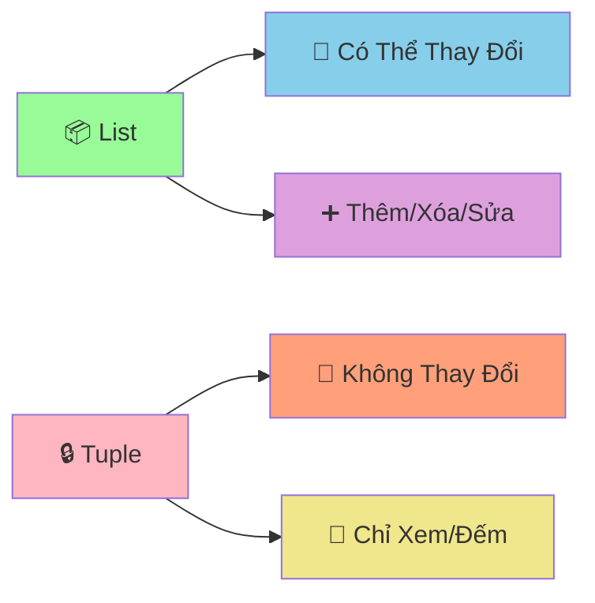

# 🔒 Tuples - Cấu Trúc Dữ Liệu Không Thay Đổi

:::tip 🔒 Ví Dụ Dễ Hiểu
Hãy tưởng tượng Tuple như một **hộp đựng đồ bị khóa**! Một khi đã đóng hộp và khóa lại, bạn không thể thêm, bớt, hay thay đổi gì bên trong. Nhưng bạn vẫn có thể **xem** và **đếm** những gì có trong đó!
:::

## 🤔 Tuple Là Gì?

**Tuple** là cấu trúc dữ liệu giống như List, nhưng **không thể thay đổi** (immutable). Một khi tạo ra, bạn không thể:
- ➕ Thêm phần tử
- ❌ Xóa phần tử  
- 🔄 Thay đổi giá trị phần tử



### 🆚 So Sánh List vs Tuple

```python
# List - có thể thay đổi
list_example = [1, 2, 3]
list_example.append(4)        # ✅ Được
list_example[0] = 10          # ✅ Được
list_example.remove(2)        # ✅ Được

# Tuple - không thể thay đổi
tuple_example = (1, 2, 3)
# tuple_example.append(4)     # ❌ Lỗi!
# tuple_example[0] = 10       # ❌ Lỗi!
# tuple_example.remove(2)     # ❌ Lỗi!
```

## 🎯 Tạo Tuple

### 📌 Cách Tạo Cơ Bản

```python
# Cách 1: Dùng dấu ngoặc đơn
tuple_1 = (1, 2, 3, 4, 5)
tuple_2 = ("An", "Binh", "Chau")

# Cách 2: Không cần dấu ngoặc (tuple packing)
tuple_3 = 1, 2, 3, 4, 5
tuple_4 = "Python", "Java", "C++"

# Tuple rỗng
empty_tuple = ()

# Tuple có 1 phần tử (cần dấu phẩy!)
single_element_tuple = (42,)  # Quan trọng: dấu phẩy!
single_element_tuple_2 = 42,  # Cũng được

print("Tuple 1:", tuple_1)
print("Tuple 2:", tuple_2)
print("Tuple rỗng:", empty_tuple)
print("Tuple 1 phần tử:", single_element_tuple)
```

### 🎨 Các Kiểu Dữ Liệu Trong Tuple

```python
# Tuple hỗn hợp
student_info = ("Nguyen Van An", 16, "9A", 8.5, True)

# Tuple lồng nhau
scores = ((8.5, 7.0), (9.0, 8.5), (7.5, 6.0))

# Tuple chứa list (list vẫn có thể thay đổi!)
tuple_with_list = (1, 2, [3, 4, 5])
tuple_with_list[2].append(6)  # ✅ Được! Vì list bên trong vẫn mutable
print("Tuple có list:", tuple_with_list)  # (1, 2, [3, 4, 5, 6])
```

## 🔍 Truy Cập Dữ Liệu

### 📊 Index và Slicing

```python
# Tuple điểm số
scores = (8.5, 7.0, 9.0, 6.5, 8.0)

# Truy cập bằng index
print("Điểm đầu tiên:", scores[0])      # 8.5
print("Điểm cuối cùng:", scores[-1])     # 8.0
print("Điểm thứ 3:", scores[2])          # 9.0

# Slicing
print("3 điểm đầu:", scores[:3])         # (8.5, 7.0, 9.0)
print("2 điểm cuối:", scores[-2:])       # (6.5, 8.0)
print("Điểm giữa:", scores[1:4])         # (7.0, 9.0, 6.5)
```

### 🔄 Unpacking - Giải Nén Tuple

```python
# Tuple thông tin học sinh
student_info = ("Nguyen Van An", 16, "9A", 8.5)

# Unpacking - gán từng giá trị vào biến
name, age, class_name, average_score = student_info

print(f"Tên: {name}")
print(f"Tuổi: {age}")
print(f"Lớp: {class_name}")
print(f"Điểm TB: {average_score}")

# Unpacking với dấu * (rest)
scores = (8.5, 7.0, 9.0, 6.5, 8.0)
highest_score, *remaining_scores, lowest_score = scores

print(f"Điểm cao nhất: {highest_score}")      # 8.5
print(f"Điểm còn lại: {remaining_scores}")        # [7.0, 9.0, 6.5]
print(f"Điểm thấp nhất: {lowest_score}")    # 8.0
```

## 🔍 Các Thao Tác Với Tuple

### 📊 Kiểm Tra và Đếm

```python
scores = (8.5, 7.0, 9.0, 6.5, 8.0, 7.0)

# Kiểm tra có tồn tại không
print("Có điểm 8.5?", 8.5 in scores)        # True
print("Có điểm 10?", 10 in scores)          # False

# Đếm số lần xuất hiện
print("Số lần xuất hiện 7.0:", scores.count(7.0))  # 2
print("Số lần xuất hiện 9.0:", scores.count(9.0))  # 1

# Tìm vị trí
print("Vị trí đầu tiên của 7.0:", scores.index(7.0))  # 1

# Độ dài
print("Số lượng điểm:", len(scores))        # 6
```

### 🔄 Chuyển Đổi

```python
# Chuyển list thành tuple
list_example = [1, 2, 3, 4, 5]
tuple_from_list = tuple(list_example)
print("Tuple từ list:", tuple_from_list)

# Chuyển tuple thành list
original_tuple = (1, 2, 3, 4, 5)
list_from_tuple = list(original_tuple)
print("List từ tuple:", list_from_tuple)

# Chuyển string thành tuple
string_example = "Python"
tuple_from_string = tuple(string_example)
print("Tuple từ string:", tuple_from_string)  # ('P', 'y', 't', 'h', 'o', 'n')
```

## 🎪 Ví Dụ Thực Tế: Hệ Thống Quản Lý Tọa Độ

```python
# 🗺️ Hệ thống quản lý tọa độ với tuples
class CoordinateManager:
    def __init__(self):
        self.landmarks = {}
        self.routes = []
    
    def add_point(self, point_name, x, y, description=""):
        """Thêm điểm mới vào bản đồ"""
        coordinates = (x, y)  # Tuple không thể thay đổi
        
        self.landmarks[point_name] = {
            "coordinates": coordinates,
            "description": description
        }
        
        print(f"📍 Đã thêm điểm: {point_name} tại {coordinates}")
        return coordinates
    
    def calculate_distance(self, point_1, point_2):
        """Tính khoảng cách giữa 2 điểm"""
        if point_1 not in self.landmarks or point_2 not in self.landmarks:
            return None
        
        # Unpacking tuple tọa độ
        x1, y1 = self.landmarks[point_1]["coordinates"]
        x2, y2 = self.landmarks[point_2]["coordinates"]
        
        distance = ((x2 - x1) ** 2 + (y2 - y1) ** 2) ** 0.5
        return round(distance, 2)
    
    def create_route(self, *point_names):
        """Tạo đường đi qua nhiều điểm"""
        if len(point_names) < 2:
            print("❌ Cần ít nhất 2 điểm để tạo đường đi")
            return
        
        # Kiểm tra tất cả điểm có tồn tại
        for point_name in point_names:
            if point_name not in self.landmarks:
                print(f"❌ Không tìm thấy điểm: {point_name}")
                return
        
        # Tạo tuple đường đi (không thể thay đổi)
        route = tuple(point_names)
        self.routes.append(route)
        
        # Tính tổng khoảng cách
        total_distance = 0
        for i in range(len(route) - 1):
            distance = self.calculate_distance(route[i], route[i+1])
            total_distance += distance
        
        print(f"🛣️  Đã tạo đường đi: {' → '.join(route)}")
        print(f"📏 Tổng khoảng cách: {total_distance:.2f} đơn vị")
        
        return route
    
    def find_nearest_point(self, origin_point):
        """Tìm điểm gần nhất với điểm gốc"""
        if origin_point not in self.landmarks:
            print(f"❌ Không tìm thấy điểm: {origin_point}")
            return
        
        nearest_point = None
        shortest_distance = float('inf')
        
        for point_name, info in self.landmarks.items():
            if point_name != origin_point:
                distance = self.calculate_distance(origin_point, point_name)
                if distance < shortest_distance:
                    shortest_distance = distance
                    nearest_point = point_name
        
        if nearest_point:
            print(f"🎯 Điểm gần nhất với {origin_point}: {nearest_point}")
            print(f"📏 Khoảng cách: {shortest_distance:.2f} đơn vị")
        
        return nearest_point, shortest_distance
    
    def display_map(self):
        """Hiển thị bản đồ"""
        if not self.landmarks:
            print("🗺️  Bản đồ trống")
            return
        
        print("\n🗺️  BẢN ĐỒ")
        print("=" * 50)
        
        for point_name, info in self.landmarks.items():
            x, y = info["coordinates"]
            description = info["description"]
            print(f"📍 {point_name}: ({x}, {y}) - {description}")
        
        if self.routes:
            print(f"\n🛣️  ĐƯỜNG ĐI ({len(self.routes)} đường)")
            for i, route in enumerate(self.routes, 1):
                print(f"   {i}. {' → '.join(route)}")

# Sử dụng hệ thống
map_manager = CoordinateManager()

# Thêm các điểm
map_manager.add_point("Home", 0, 0, "Nhà của An")
map_manager.add_point("School", 5, 3, "Trường THCS")
map_manager.add_point("Library", 2, 4, "Thư viện công cộng")
map_manager.add_point("Park", 7, 1, "Công viên trung tâm")
map_manager.add_point("Market", 3, 6, "Siêu thị lớn")

# Tạo đường đi
map_manager.create_route("Home", "School", "Library")
map_manager.create_route("Home", "Park", "Market")

# Tìm điểm gần nhất
map_manager.find_nearest_point("Home")
map_manager.find_nearest_point("School")

# Hiển thị bản đồ
map_manager.display_map()
```

## 🎯 Bài Tập Thực Hành

### 🥇 Bài Tập 1: Hệ Thống Quản Lý Thời Khóa Biểu

```python
# TODO: Tạo hệ thống quản lý thời khóa biểu với tuples
def create_schedule():
    """Tạo thời khóa biểu cho một tuần"""
    
    # Tuple chứa các ngày trong tuần (không thể thay đổi)
    weekdays = ("Thứ 2", "Thứ 3", "Thứ 4", "Thứ 5", "Thứ 6")
    
    # Tuple chứa các tiết học (không thể thay đổi)
    periods = ("Tiết 1", "Tiết 2", "Tiết 3", "Tiết 4", "Tiết 5")
    
    # Dictionary chứa thời khóa biểu
    schedule = {}
    
    # Môn học cho mỗi ngày (tuple không thể thay đổi)
    daily_subjects = {
        "Thứ 2": ("Toán", "Lý", "Hóa", "Văn", "Anh"),
        "Thứ 3": ("Văn", "Toán", "Sử", "Địa", "Sinh"),
        "Thứ 4": ("Lý", "Hóa", "Toán", "Anh", "Thể dục"),
        "Thứ 5": ("Anh", "Văn", "Toán", "Lý", "Hóa"),
        "Thứ 6": ("Sinh", "Địa", "Sử", "Toán", "Văn")
    }
    
    # Tạo thời khóa biểu
    for day in weekdays:
        schedule[day] = {}
        subjects = daily_subjects[day]
        
        for i, period in enumerate(periods):
            schedule[day][period] = subjects[i]
    
    return schedule, weekdays, periods

def display_schedule(schedule, weekdays, periods):
    """Hiển thị thời khóa biểu"""
    print("📅 THỜI KHÓA BIỂU TUẦN")
    print("=" * 60)
    
    # Header
    print(f"{'Ngày':<10}", end="")
    for period in periods:
        print(f"{period:<12}", end="")
    print()
    print("-" * 60)
    
    # Nội dung
    for day in weekdays:
        print(f"{day:<10}", end="")
        for period in periods:
            subject = schedule[day][period]
            print(f"{subject:<12}", end="")
        print()

def find_subject_in_week(schedule, subject_name):
    """Tìm môn học trong tuần"""
    results = []
    
    for day, periods_dict in schedule.items():
        for period, subject in periods_dict.items():
            if subject == subject_name:
                results.append((day, period))
    
    return results

def count_subjects_statistics(schedule):
    """Thống kê số tiết của mỗi môn"""
    statistics = {}
    
    for day, periods_dict in schedule.items():
        for period, subject in periods_dict.items():
            statistics[subject] = statistics.get(subject, 0) + 1
    
    return statistics

# Sử dụng hệ thống
schedule, weekdays, periods = create_schedule()

# Hiển thị thời khóa biểu
display_schedule(schedule, weekdays, periods)

# Tìm môn học
print(f"\n🔍 TÌM KIẾM MÔN HỌC")
print("=" * 30)

search_subject = "Toán"
search_results = find_subject_in_week(schedule, search_subject)

if search_results:
    print(f"📚 Môn {search_subject} có {len(search_results)} tiết:")
    for day, period in search_results:
        print(f"   {day} - {period}")
else:
    print(f"😅 Không tìm thấy môn {search_subject}")

# Thống kê
print(f"\n📊 THỐNG KÊ MÔN HỌC")
print("=" * 30)

statistics = count_subjects_statistics(schedule)
for subject, period_count in sorted(statistics.items()):
    print(f"{subject:<10}: {period_count} tiết")
```

### 🥈 Bài Tập 2: Game Tic-Tac-Toe

```python
# TODO: Tạo game Tic-Tac-Toe với tuples
def create_board():
    """Tạo bàn cờ 3x3"""
    return (
        (" ", " ", " "),
        (" ", " ", " "),
        (" ", " ", " ")
    )

def display_board(board):
    """Hiển thị bàn cờ"""
    print("\n🎮 BÀN CỜ TIC-TAC-TOE")
    print("=" * 20)
    print("   1   2   3")
    
    for i, row in enumerate(board):
        print(f"{i+1}  {' | '.join(row)}")
        if i < 2:
            print("  -----------")

def check_winner(board):
    """Kiểm tra có người thắng không"""
    # Chuyển tuple thành list để dễ xử lý
    board_list = [list(row) for row in board]
    
    # Kiểm tra hàng ngang
    for row in board_list:
        if row[0] == row[1] == row[2] != " ":
            return row[0]
    
    # Kiểm tra cột dọc
    for col in range(3):
        if board_list[0][col] == board_list[1][col] == board_list[2][col] != " ":
            return board_list[0][col]
    
    # Kiểm tra đường chéo
    if board_list[0][0] == board_list[1][1] == board_list[2][2] != " ":
        return board_list[0][0]
    
    if board_list[0][2] == board_list[1][1] == board_list[2][0] != " ":
        return board_list[0][2]
    
    return None

def check_draw(board):
    """Kiểm tra hòa"""
    for row in board:
        if " " in row:
            return False
    return True

def make_move(board, row, col, symbol):
    """Đánh cờ"""
    # Chuyển tuple thành list để thay đổi
    board_list = [list(row) for row in board]
    
    if board_list[row][col] != " ":
        return False, board  # Ô đã có quân
    
    board_list[row][col] = symbol
    
    # Chuyển lại thành tuple
    new_board = tuple(tuple(row) for row in board_list)
    return True, new_board

def play_tic_tac_toe():
    """Game Tic-Tac-Toe chính"""
    print("🎮 GAME TIC-TAC-TOE")
    print("=" * 30)
    print("Người chơi 1: X")
    print("Người chơi 2: O")
    print("Nhập tọa độ (hàng, cột) từ 1-3")
    print("Nhập 'quit' để thoát")
    print("-" * 30)
    
    board = create_board()
    current_player = "X"
    
    while True:
        display_board(board)
        
        # Nhập tọa độ
        try:
            user_input = input(f"\nNgười chơi {current_player}, nhập tọa độ (hàng,cột): ")
            
            if user_input.lower() == 'quit':
                print("👋 Tạm biệt!")
                break
            
            row, col = map(int, user_input.split(','))
            row -= 1  # Chuyển từ 1-3 thành 0-2
            col -= 1
            
            if not (0 <= row <= 2 and 0 <= col <= 2):
                print("❌ Tọa độ không hợp lệ! Nhập từ 1-3")
                continue
            
        except ValueError:
            print("❌ Định dạng không đúng! Nhập: hàng,cột")
            continue
        
        # Đánh cờ
        success, board = make_move(board, row, col, current_player)
        
        if not success:
            print("❌ Ô này đã có quân rồi!")
            continue
        
        # Kiểm tra thắng
        winner = check_winner(board)
        if winner:
            display_board(board)
            print(f"🎉 Người chơi {winner} thắng!")
            break
        
        # Kiểm tra hòa
        if check_draw(board):
            display_board(board)
            print("🤝 Hòa! Không ai thắng!")
            break
        
        # Đổi người chơi
        current_player = "O" if current_player == "X" else "X"

# Chạy game
play_tic_tac_toe()
```

## 🎊 Tóm Tắt

Trong bài này, bạn đã học được:

✅ **Tuple là gì** - Cấu trúc dữ liệu immutable  
✅ **Tạo tuple** - `()`, `tuple()`, packing  
✅ **Truy cập dữ liệu** - Index, slicing, unpacking  
✅ **Thao tác cơ bản** - `in`, `count()`, `index()`, `len()`  
✅ **Chuyển đổi** - `tuple()`, `list()`  
✅ **Ứng dụng thực tế** - Tọa độ, thời khóa biểu, game  

## 🚀 Bước Tiếp Theo

Tuyệt vời! Bây giờ bạn đã hiểu về **cấu trúc dữ liệu không thay đổi**! Tiếp theo, chúng ta sẽ học về [Sets](/python/intermediate/sets) - cấu trúc dữ liệu **loại bỏ trùng lặp** và **tối ưu tìm kiếm**!

:::tip 🎯 Thử Thách Nhỏ
Hãy thử tạo một "hệ thống quản lý điểm GPS" sử dụng tuples! Mỗi điểm có tọa độ (x, y) không thể thay đổi, tính khoảng cách, tìm điểm gần nhất, và tạo tuyến đường tối ưu!
:::

---

*🔗 **Bài tiếp theo**: [Sets - Cấu Trúc Dữ Liệu Loại Bỏ Trùng Lặp](/python/intermediate/sets)*
