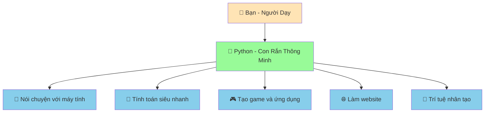
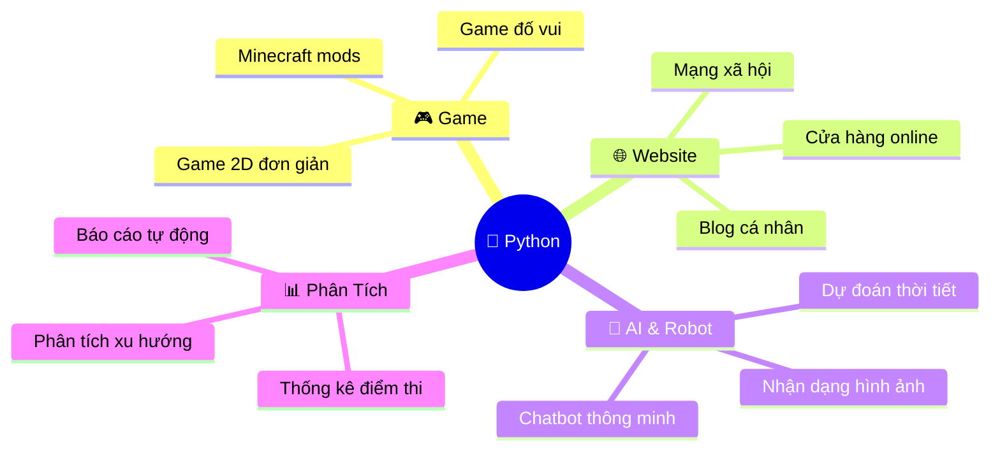

# 🐍 Chào Mừng Đến Với Lập Trình Python!

:::tip 🌟 Chào Bạn!
Chào mừng bạn đến với hành trình học lập trình Python thú vị! Đừng lo lắng nếu bạn chưa biết gì về lập trình - chúng ta sẽ bắt đầu từ những điều cơ bản nhất và giải thích mọi thứ một cách dễ hiểu nhất có thể!
:::

## 🤔 Python Là Gì?

Hãy tưởng tượng Python như một **con rắn thông minh và thân thiện** mà bạn có thể dạy nó làm những việc tuyệt vời! 

## 🌟 Tại Sao Chọn Python?

### 🥰 Thân Thiện Với Người Mới
- **Dễ hiểu**: Python viết giống như tiếng Anh, dễ đọc và dễ hiểu
- **Ít lỗi**: Python giúp bạn tránh những lỗi phức tạp
- **Cộng đồng tốt**: Hàng triệu người trên thế giới sẵn sàng giúp đỡ

### 🚀 Siêu Mạnh Mẽ
Python được sử dụng bởi những công ty lớn mà bạn biết:

- **🌍 Toàn cầu**: Instagram, YouTube, Netflix, Spotify
- **🇻🇳 Việt Nam**: VNG (Zalo), Tiki, Shopee Vietnam, FPT Software

### 🎯 Có Thể Làm Gì Với Python?

## 🎭 Python Như Con Rắn Pet Thông Minh

Trong suốt hành trình học này, chúng ta sẽ tưởng tượng Python như một **con rắn pet siêu thông minh**:

- **🏠 Chuẩn bị nhà**: Cài đặt Python trên máy tính
- **👋 Làm quen**: Dạy Python nói "Xin chào!"
- **🍎 Cho ăn**: Đưa thông tin cho Python xử lý
- **🎪 Dạy kỹ năng**: Lập trình các chức năng mới
- **🎮 Chơi cùng**: Tạo game và dự án thú vị

## 🗺️ Lộ Trình Học Tập

### 🟢 **Cơ Bản Siêu Dễ** (1-2 tuần)
Bạn sẽ học:
- Python là gì và cài đặt như thế nào
- Viết chương trình đầu tiên
- Dạy Python nói chuyện và tính toán
- Tạo trò chơi điền từ đầu tiên

### 🟡 **Trung Bình Thú Vị** (2-3 tuần)
Bạn sẽ học:
- Dạy Python đưa ra quyết định thông minh
- Tạo danh sách và quản lý dữ liệu
- Viết những "công thức" có thể dùng lại
- Xây dựng game và ứng dụng phức tạp hơn

### 🔴 **Thách Thức Cao** (1 tháng+)
Bạn sẽ học:
- Làm việc với file và dữ liệu lớn
- Tạo website và ứng dụng web
- Kết nối với internet và API
- Xây dựng dự án thực tế

## 🎯 Mục Tiêu Của Chúng Ta

Sau khi hoàn thành khóa học này, bạn sẽ có thể:

✅ **Viết chương trình Python tự tin**  
✅ **Tạo ra những dự án thú vị và hữu ích**  
✅ **Hiểu cách máy tính hoạt động**  
✅ **Sẵn sàng học những ngôn ngữ lập trình khác**  
✅ **Có nền tảng vững chắc cho sự nghiệp công nghệ**  

## 🆘 Khi Nào Cần Giúp Đỡ?

:::warning 💡 Đừng Lo Lắng!
Học lập trình giống như học đi xe đạp - ai cũng ngã vài lần trước khi thành thạo. Gặp lỗi là điều hoàn toàn bình thường và là cách tốt nhất để học!
:::

**Nhớ những điều này:**
- 🤝 **Hỏi khi cần**: Không có câu hỏi nào là "ngu ngốc"
- 🔄 **Thử lại**: Lỗi là cơ hội để học hỏi
- 👥 **Tìm bạn đồng hành**: Học cùng bạn bè sẽ vui hơn
- 🎯 **Kiên nhẫn**: Mỗi người có tốc độ học khác nhau

## 🚀 Sẵn Sàng Bắt Đầu?

Tuyệt vời! Hãy bắt đầu hành trình thú vị này bằng cách:

1. **📥 [Cài đặt Python](/python/basics/installing-python)** - Chuẩn bị nhà cho con rắn thông minh
2. **🏠 [Tìm hiểu môi trường làm việc](/python/basics/python-environment)** - Làm quen với không gian
3. **🐍 [Tìm hiểu Python](/python/basics/what-is-python)** - Hiểu rõ hơn về "con rắn" của chúng ta
4. **👋 [Chương trình đầu tiên](/python/basics/first-program)** - Dạy Python nói "Xin chào!"

:::tip 🎉 Lời Khích Lệ
Bạn đang bắt đầu một hành trình tuyệt vời! Hàng triệu người trên thế giới đã học Python và tạo ra những điều kỳ diệu. Bây giờ đến lượt bạn! 

**Hãy nhớ**: Mỗi chuyên gia đều từng là người mới bắt đầu. Bạn có thể làm được!
:::

---

*📚 **Lưu ý**: Tất cả nội dung trong khóa học này được tạo ra với sự hỗ trợ của AI để đảm bảo tính nhất quán và chất lượng. Mọi ví dụ code đều được kiểm tra kỹ lưỡng để đảm bảo hoạt động chính xác.*
