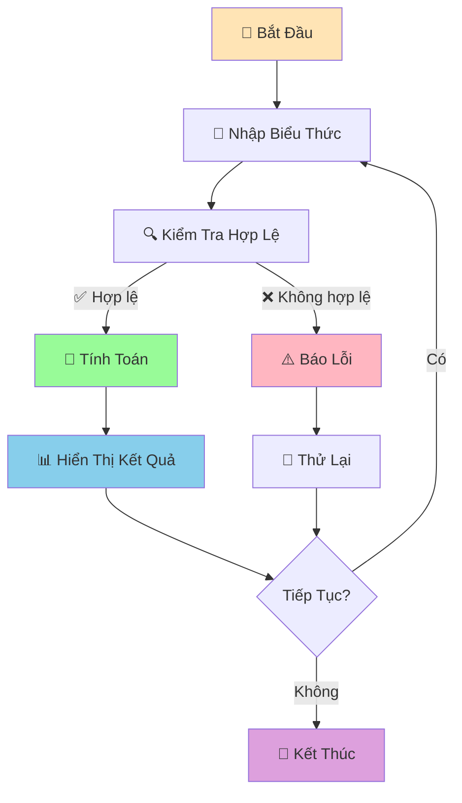

# 🧮 Máy Tính Đơn Giản - Dự Án Đầu Tiên

:::tip 🎯 Mục Tiêu Dự Án
Tạo một **máy tính đơn giản** hoàn chỉnh bằng Python! Đây là dự án đầu tiên giúp bạn áp dụng tất cả kiến thức đã học: variables, functions, loops, và error handling.
:::

## 🎯 Tổng Quan Dự Án

Chúng ta sẽ tạo một máy tính có thể:
- ➕ Cộng, trừ, nhân, chia
- 🔢 Xử lý số thập phân
- ⚠️ Xử lý lỗi (chia cho 0, nhập sai)
- 🔄 Chạy liên tục cho đến khi người dùng thoát
- 📊 Hiển thị lịch sử tính toán



## 🛠️ Bước 1: Tạo Các Functions Cơ Bản

### 📌 Functions Tính Toán

```python
def cong(a, b):
    """Phép cộng"""
    return a + b

def tru(a, b):
    """Phép trừ"""
    return a - b

def nhan(a, b):
    """Phép nhân"""
    return a * b

def chia(a, b):
    """Phép chia"""
    if b == 0:
        raise ValueError("Không thể chia cho 0!")
    return a / b

def luy_thua(a, b):
    """Lũy thừa"""
    return a ** b

def can_bac_hai(a):
    """Căn bậc hai"""
    if a < 0:
        raise ValueError("Không thể tính căn bậc hai của số âm!")
    return a ** 0.5
```

### 🔍 Function Kiểm Tra Input

```python
def kiem_tra_so(so_str):
    """Kiểm tra và chuyển đổi string thành số"""
    try:
        return float(so_str)
    except ValueError:
        raise ValueError(f"'{so_str}' không phải là số hợp lệ!")

def kiem_tra_phep_tinh(phep_tinh):
    """Kiểm tra phép tính có hợp lệ không"""
    phep_tinh_hop_le = ['+', '-', '*', '/', '**', 'sqrt']
    if phep_tinh not in phep_tinh_hop_le:
        raise ValueError(f"Phép tính '{phep_tinh}' không được hỗ trợ!")
    return True
```

## 🎪 Bước 2: Tạo Máy Tính Cơ Bản

```python
def may_tinh_co_ban():
    """Máy tính cơ bản với 2 số"""
    print("🧮 MÁY TÍNH CƠ BẢN")
    print("=" * 40)
    print("Các phép tính: +, -, *, /, **, sqrt")
    print("Ví dụ: 5 + 3, 10 / 2, 2 ** 3, sqrt 16")
    print("Gõ 'quit' để thoát")
    print("-" * 40)
    
    lich_su = []  # Lưu lịch sử tính toán
    
    while True:
        try:
            # Nhập biểu thức
            bieu_thuc = input("\nNhập phép tính: ").strip()
            
            if bieu_thuc.lower() == 'quit':
                print("👋 Tạm biệt!")
                hien_thi_lich_su(lich_su)
                break
            
            if bieu_thuc.lower() == 'history':
                hien_thi_lich_su(lich_su)
                continue
            
            # Xử lý căn bậc hai
            if bieu_thuc.startswith('sqrt'):
                parts = bieu_thuc.split()
                if len(parts) != 2:
                    print("❌ Định dạng: sqrt số")
                    continue
                
                so = kiem_tra_so(parts[1])
                ket_qua = can_bac_hai(so)
                print(f"📊 √{so} = {ket_qua}")
                
                # Lưu vào lịch sử
                lich_su.append(f"√{so} = {ket_qua}")
                continue
            
            # Xử lý phép tính 2 số
            parts = bieu_thuc.split()
            if len(parts) != 3:
                print("❌ Định dạng: số phép_tính số")
                continue
            
            a = kiem_tra_so(parts[0])
            phep_tinh = parts[1]
            b = kiem_tra_so(parts[2])
            
            kiem_tra_phep_tinh(phep_tinh)
            
            # Thực hiện phép tính
            if phep_tinh == '+':
                ket_qua = cong(a, b)
            elif phep_tinh == '-':
                ket_qua = tru(a, b)
            elif phep_tinh == '*':
                ket_qua = nhan(a, b)
            elif phep_tinh == '/':
                ket_qua = chia(a, b)
            elif phep_tinh == '**':
                ket_qua = luy_thua(a, b)
            
            # Hiển thị kết quả
            print(f"📊 {bieu_thuc} = {ket_qua}")
            
            # Lưu vào lịch sử
            lich_su.append(f"{bieu_thuc} = {ket_qua}")
            
        except ValueError as e:
            print(f"❌ Lỗi: {e}")
        except Exception as e:
            print(f"❌ Lỗi không xác định: {e}")

def hien_thi_lich_su(lich_su):
    """Hiển thị lịch sử tính toán"""
    if not lich_su:
        print("📝 Chưa có lịch sử tính toán")
        return
    
    print("\n📝 LỊCH SỬ TÍNH TOÁN")
    print("=" * 30)
    for i, tinh_toan in enumerate(lich_su, 1):
        print(f"{i:2d}. {tinh_toan}")
```

## 🚀 Bước 3: Máy Tính Nâng Cao

```python
def may_tinh_nang_cao():
    """Máy tính nâng cao với nhiều tính năng"""
    print("🚀 MÁY TÍNH NÂNG CAO")
    print("=" * 50)
    print("Tính năng:")
    print("• Phép tính cơ bản: +, -, *, /, **")
    print("• Căn bậc hai: sqrt")
    print("• Tính phần trăm: 50% của 200")
    print("• Tính BMI: bmi 60 1.7")
    print("• Tính lãi suất: lai 1000000 0.05 3")
    print("• Lịch sử: history")
    print("• Thoát: quit")
    print("-" * 50)
    
    lich_su = []
    
    while True:
        try:
            bieu_thuc = input("\nNhập lệnh: ").strip()
            
            if bieu_thuc.lower() == 'quit':
                print("👋 Tạm biệt!")
                hien_thi_lich_su(lich_su)
                break
            
            if bieu_thuc.lower() == 'history':
                hien_thi_lich_su(lich_su)
                continue
            
            # Xử lý các lệnh đặc biệt
            if bieu_thuc.startswith('bmi'):
                ket_qua = xu_ly_bmi(bieu_thuc)
                if ket_qua:
                    lich_su.append(ket_qua)
                continue
            
            if bieu_thuc.startswith('lai'):
                ket_qua = xu_ly_lai_suat(bieu_thuc)
                if ket_qua:
                    lich_su.append(ket_qua)
                continue
            
            if '%' in bieu_thuc:
                ket_qua = xu_ly_phan_tram(bieu_thuc)
                if ket_qua:
                    lich_su.append(ket_qua)
                continue
            
            # Xử lý căn bậc hai
            if bieu_thuc.startswith('sqrt'):
                parts = bieu_thuc.split()
                if len(parts) != 2:
                    print("❌ Định dạng: sqrt số")
                    continue
                
                so = kiem_tra_so(parts[1])
                ket_qua = can_bac_hai(so)
                print(f"📊 √{so} = {ket_qua}")
                lich_su.append(f"√{so} = {ket_qua}")
                continue
            
            # Xử lý phép tính thông thường
            parts = bieu_thuc.split()
            if len(parts) != 3:
                print("❌ Định dạng không hợp lệ!")
                continue
            
            a = kiem_tra_so(parts[0])
            phep_tinh = parts[1]
            b = kiem_tra_so(parts[2])
            
            kiem_tra_phep_tinh(phep_tinh)
            
            # Thực hiện phép tính
            if phep_tinh == '+':
                ket_qua = cong(a, b)
            elif phep_tinh == '-':
                ket_qua = tru(a, b)
            elif phep_tinh == '*':
                ket_qua = nhan(a, b)
            elif phep_tinh == '/':
                ket_qua = chia(a, b)
            elif phep_tinh == '**':
                ket_qua = luy_thua(a, b)
            
            print(f"📊 {bieu_thuc} = {ket_qua}")
            lich_su.append(f"{bieu_thuc} = {ket_qua}")
            
        except ValueError as e:
            print(f"❌ Lỗi: {e}")
        except Exception as e:
            print(f"❌ Lỗi không xác định: {e}")

def xu_ly_bmi(bieu_thuc):
    """Xử lý tính BMI"""
    parts = bieu_thuc.split()
    if len(parts) != 3:
        print("❌ Định dạng: bmi cân_nặng chiều_cao")
        return None
    
    can_nang = kiem_tra_so(parts[1])
    chieu_cao = kiem_tra_so(parts[2])
    
    bmi = can_nang / (chieu_cao ** 2)
    
    # Đánh giá BMI
    if bmi < 18.5:
        danh_gia = "Thiếu cân"
    elif bmi < 25:
        danh_gia = "Bình thường"
    elif bmi < 30:
        danh_gia = "Thừa cân"
    else:
        danh_gia = "Béo phì"
    
    ket_qua = f"BMI: {bmi:.1f} ({danh_gia})"
    print(f"📊 {ket_qua}")
    return ket_qua

def xu_ly_lai_suat(bieu_thuc):
    """Xử lý tính lãi suất"""
    parts = bieu_thuc.split()
    if len(parts) != 4:
        print("❌ Định dạng: lai tiền_gốc lãi_suất số_năm")
        return None
    
    tien_goc = kiem_tra_so(parts[1])
    lai_suat = kiem_tra_so(parts[2])
    so_nam = kiem_tra_so(parts[3])
    
    tien_cuoi = tien_goc * (1 + lai_suat) ** so_nam
    lai_nhan = tien_cuoi - tien_goc
    
    ket_qua = f"Lãi suất: {tien_goc:,.0f} → {tien_cuoi:,.0f} (+{lai_nhan:,.0f})"
    print(f"📊 {ket_qua}")
    return ket_qua

def xu_ly_phan_tram(bieu_thuc):
    """Xử lý tính phần trăm"""
    if 'của' not in bieu_thuc:
        print("❌ Định dạng: X% của Y")
        return None
    
    # Tách phần trăm và số
    phan_tram_str, so_str = bieu_thuc.split('của')
    phan_tram_str = phan_tram_str.strip()
    so_str = so_str.strip()
    
    # Lấy số phần trăm
    phan_tram = kiem_tra_so(phan_tram_str.replace('%', ''))
    so = kiem_tra_so(so_str)
    
    ket_qua_tinh = (phan_tram / 100) * so
    
    ket_qua = f"{phan_tram}% của {so} = {ket_qua_tinh}"
    print(f"📊 {ket_qua}")
    return ket_qua
```

## 🎮 Bước 4: Menu Chính

```python
def menu_chinh():
    """Menu chính của chương trình"""
    while True:
        print("\n🎯 CHƯƠNG TRÌNH MÁY TÍNH PYTHON")
        print("=" * 40)
        print("1. 🧮 Máy tính cơ bản")
        print("2. 🚀 Máy tính nâng cao")
        print("3. 📚 Hướng dẫn sử dụng")
        print("4. 👋 Thoát")
        print("-" * 40)
        
        lua_chon = input("Chọn chức năng (1-4): ").strip()
        
        if lua_chon == '1':
            may_tinh_co_ban()
        elif lua_chon == '2':
            may_tinh_nang_cao()
        elif lua_chon == '3':
            hien_thi_huong_dan()
        elif lua_chon == '4':
            print("👋 Cảm ơn bạn đã sử dụng!")
            break
        else:
            print("❌ Lựa chọn không hợp lệ!")

def hien_thi_huong_dan():
    """Hiển thị hướng dẫn sử dụng"""
    print("\n📚 HƯỚNG DẪN SỬ DỤNG")
    print("=" * 50)
    
    print("\n🧮 MÁY TÍNH CƠ BẢN:")
    print("• Cộng: 5 + 3")
    print("• Trừ: 10 - 4")
    print("• Nhân: 6 * 7")
    print("• Chia: 15 / 3")
    print("• Lũy thừa: 2 ** 3")
    print("• Căn bậc hai: sqrt 16")
    
    print("\n🚀 MÁY TÍNH NÂNG CAO:")
    print("• Tất cả phép tính cơ bản")
    print("• Tính BMI: bmi 60 1.7")
    print("• Tính lãi suất: lai 1000000 0.05 3")
    print("• Tính phần trăm: 25% của 200")
    print("• Xem lịch sử: history")
    
    print("\n⚠️  LƯU Ý:")
    print("• Nhập 'quit' để thoát")
    print("• Nhập 'history' để xem lịch sử")
    print("• Sử dụng dấu chấm cho số thập phân")
    print("• Không thể chia cho 0")
    
    input("\nNhấn Enter để quay lại menu chính...")
```

## 🎯 Chương Trình Hoàn Chỉnh

```python
# 🧮 MÁY TÍNH PYTHON HOÀN CHỈNH
# Tác giả: Học sinh Python
# Ngày: 2024

def main():
    """Hàm chính của chương trình"""
    print("🎉 CHÀO MỪNG ĐẾN VỚI MÁY TÍNH PYTHON!")
    print("🐍 Được tạo bởi học sinh Python")
    print("=" * 50)
    
    try:
        menu_chinh()
    except KeyboardInterrupt:
        print("\n\n👋 Chương trình bị dừng bởi người dùng!")
    except Exception as e:
        print(f"\n❌ Lỗi không mong muốn: {e}")
    finally:
        print("🔚 Chương trình kết thúc!")

# Chạy chương trình
if __name__ == "__main__":
    main()
```

## 🎯 Bài Tập Mở Rộng

### 🥇 Bài Tập 1: Thêm Tính Năng Mới

```python
# TODO: Thêm các tính năng sau vào máy tính
def tinh_giai_thua(n):
    """Tính giai thừa"""
    if n < 0:
        raise ValueError("Không thể tính giai thừa của số âm!")
    if n == 0 or n == 1:
        return 1
    return n * tinh_giai_thua(n - 1)

def tinh_trung_binh_cong(danh_sach_so):
    """Tính trung bình cộng"""
    if not danh_sach_so:
        return 0
    return sum(danh_sach_so) / len(danh_sach_so)

def tinh_khoang_cach_2_diem(x1, y1, x2, y2):
    """Tính khoảng cách giữa 2 điểm"""
    return ((x2 - x1) ** 2 + (y2 - y1) ** 2) ** 0.5

# Thêm vào menu:
# • Tính giai thừa: fact 5
# • Tính trung bình: avg 1 2 3 4 5
# • Tính khoảng cách: dist 0 0 3 4
```

### 🥈 Bài Tập 2: Lưu Lịch Sử Vào File

```python
# TODO: Lưu lịch sử tính toán vào file
import json
from datetime import datetime

def luu_lich_su_vao_file(lich_su):
    """Lưu lịch sử vào file JSON"""
    try:
        with open('lich_su_may_tinh.json', 'w', encoding='utf-8') as f:
            json.dump(lich_su, f, ensure_ascii=False, indent=2)
        print("✅ Đã lưu lịch sử vào file!")
    except Exception as e:
        print(f"❌ Lỗi khi lưu file: {e}")

def doc_lich_su_tu_file():
    """Đọc lịch sử từ file"""
    try:
        with open('lich_su_may_tinh.json', 'r', encoding='utf-8') as f:
            return json.load(f)
    except FileNotFoundError:
        return []
    except Exception as e:
        print(f"❌ Lỗi khi đọc file: {e}")
        return []
```

### 🥉 Bài Tập 3: Giao Diện Đồ Họa

```python
# TODO: Tạo giao diện đồ họa với tkinter
import tkinter as tk
from tkinter import ttk, messagebox

def tao_giao_dien():
    """Tạo giao diện đồ họa cho máy tính"""
    root = tk.Tk()
    root.title("Máy Tính Python")
    root.geometry("400x500")
    
    # Tạo các widget
    display = tk.Entry(root, font=('Arial', 16), justify='right')
    display.grid(row=0, column=0, columnspan=4, padx=10, pady=10, sticky='ew')
    
    # Tạo các nút
    buttons = [
        '7', '8', '9', '/',
        '4', '5', '6', '*',
        '1', '2', '3', '-',
        '0', '.', '=', '+',
        'C', 'sqrt', '**', 'quit'
    ]
    
    row, col = 1, 0
    for button in buttons:
        btn = tk.Button(root, text=button, font=('Arial', 12), 
                       command=lambda b=button: button_click(b, display))
        btn.grid(row=row, column=col, padx=5, pady=5, sticky='ew')
        col += 1
        if col > 3:
            col = 0
            row += 1
    
    root.mainloop()

def button_click(button, display):
    """Xử lý khi nhấn nút"""
    if button == '=':
        try:
            result = eval(display.get())
            display.delete(0, tk.END)
            display.insert(0, str(result))
        except:
            messagebox.showerror("Lỗi", "Biểu thức không hợp lệ!")
    elif button == 'C':
        display.delete(0, tk.END)
    elif button == 'quit':
        root.quit()
    else:
        display.insert(tk.END, button)
```

## 🎊 Tóm Tắt Dự Án

Trong dự án này, bạn đã học được:

✅ **Áp dụng kiến thức** - Variables, functions, loops, error handling  
✅ **Tạo chương trình hoàn chỉnh** - Từ ý tưởng đến sản phẩm  
✅ **Xử lý lỗi** - Try/except, validation input  
✅ **Tổ chức code** - Functions, modules, menu  
✅ **Tính năng nâng cao** - BMI, lãi suất, phần trăm  
✅ **Lưu trữ dữ liệu** - Lịch sử tính toán  

## 🚀 Bước Tiếp Theo

Tuyệt vời! Bạn đã hoàn thành **dự án đầu tiên**! Tiếp theo, chúng ta sẽ tạo [Game Đoán Số](/python/projects/guessing-game) - một dự án thú vị hơn với graphics và animation!

:::tip 🎯 Thử Thách Mở Rộng
Hãy thử thêm các tính năng sau vào máy tính:
1. **Chế độ khoa học**: sin, cos, tan, log
2. **Chuyển đổi đơn vị**: mét ↔ feet, kg ↔ pound
3. **Tính toán tài chính**: EMI, NPV, IRR
4. **Giao diện web**: Sử dụng Flask hoặc Streamlit
:::

---

*🔗 **Dự án tiếp theo**: [Game Đoán Số - Dự Án Thứ Hai](/python/projects/guessing-game)*
