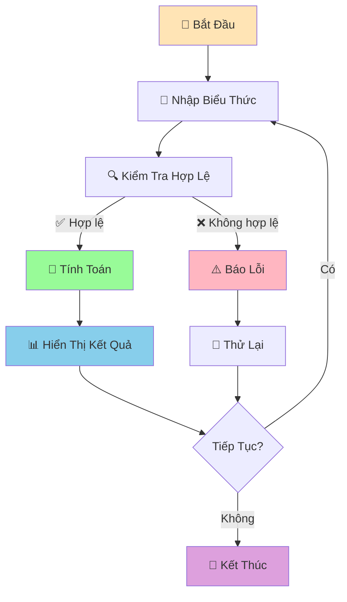

# 🧮 Máy Tính Đơn Giản - Dự Án Đầu Tiên

:::tip 🎯 Mục Tiêu Dự Án
Tạo một **máy tính đơn giản** hoàn chỉnh bằng Python! Đây là dự án đầu tiên giúp bạn áp dụng tất cả kiến thức đã học: variables, functions, loops, và error handling.
:::

## 🎯 Tổng Quan Dự Án

Chúng ta sẽ tạo một máy tính có thể:
- ➕ Cộng, trừ, nhân, chia
- 🔢 Xử lý số thập phân
- ⚠️ Xử lý lỗi (chia cho 0, nhập sai)
- 🔄 Chạy liên tục cho đến khi người dùng thoát
- 📊 Hiển thị lịch sử tính toán



## 🛠️ Bước 1: Tạo Các Functions Cơ Bản

### 📌 Functions Tính Toán

```python
def add(a, b):
    """Phép cộng"""
    return a + b

def subtract(a, b):
    """Phép trừ"""
    return a - b

def multiply(a, b):
    """Phép nhân"""
    return a * b

def divide(a, b):
    """Phép chia"""
    if b == 0:
        raise ValueError("Không thể chia cho 0!")
    return a / b

def power(a, b):
    """Lũy thừa"""
    return a ** b

def square_root(a):
    """Căn bậc hai"""
    if a < 0:
        raise ValueError("Không thể tính căn bậc hai của số âm!")
    return a ** 0.5
```

### 🔍 Function Kiểm Tra Input

```python
def validate_number(number_str):
    """Kiểm tra và chuyển đổi string thành số"""
    try:
        return float(number_str)
    except ValueError:
        raise ValueError(f"'{number_str}' không phải là số hợp lệ!")

def validate_operation(operation):
    """Kiểm tra phép tính có hợp lệ không"""
    valid_operations = ['+', '-', '*', '/', '**', 'sqrt']
    if operation not in valid_operations:
        raise ValueError(f"Phép tính '{operation}' không được hỗ trợ!")
    return True
```

## 🎪 Bước 2: Tạo Máy Tính Cơ Bản

```python
def basic_calculator():
    """Máy tính cơ bản với 2 số"""
    print("🧮 MÁY TÍNH CƠ BẢN")
    print("=" * 40)
    print("Các phép tính: +, -, *, /, **, sqrt")
    print("Ví dụ: 5 + 3, 10 / 2, 2 ** 3, sqrt 16")
    print("Gõ 'quit' để thoát")
    print("-" * 40)
    
    history = []  # Lưu lịch sử tính toán
    
    while True:
        try:
            # Nhập biểu thức
            expression = input("\nNhập phép tính: ").strip()
            
            if expression.lower() == 'quit':
                print("👋 Tạm biệt!")
                display_history(history)
                break
            
            if expression.lower() == 'history':
                display_history(history)
                continue
            
            # Xử lý căn bậc hai
            if expression.startswith('sqrt'):
                parts = expression.split()
                if len(parts) != 2:
                    print("❌ Định dạng: sqrt số")
                    continue
                
                number = validate_number(parts[1])
                result = square_root(number)
                print(f"📊 √{number} = {result}")
                
                # Lưu vào lịch sử
                history.append(f"√{number} = {result}")
                continue
            
            # Xử lý phép tính 2 số
            parts = expression.split()
            if len(parts) != 3:
                print("❌ Định dạng: số phép_tính số")
                continue
            
            a = validate_number(parts[0])
            operation = parts[1]
            b = validate_number(parts[2])
            
            validate_operation(operation)
            
            # Thực hiện phép tính
            if operation == '+':
                result = add(a, b)
            elif operation == '-':
                result = subtract(a, b)
            elif operation == '*':
                result = multiply(a, b)
            elif operation == '/':
                result = divide(a, b)
            elif operation == '**':
                result = power(a, b)
            
            # Hiển thị kết quả
            print(f"📊 {expression} = {result}")
            
            # Lưu vào lịch sử
            history.append(f"{expression} = {result}")
            
        except ValueError as e:
            print(f"❌ Lỗi: {e}")
        except Exception as e:
            print(f"❌ Lỗi không xác định: {e}")

def display_history(history):
    """Hiển thị lịch sử tính toán"""
    if not history:
        print("📝 Chưa có lịch sử tính toán")
        return
    
    print("\n📝 LỊCH SỬ TÍNH TOÁN")
    print("=" * 30)
    for i, calculation in enumerate(history, 1):
        print(f"{i:2d}. {calculation}")
```

## 🚀 Bước 3: Máy Tính Nâng Cao

```python
def advanced_calculator():
    """Máy tính nâng cao với nhiều tính năng"""
    print("🚀 MÁY TÍNH NÂNG CAO")
    print("=" * 50)
    print("Tính năng:")
    print("• Phép tính cơ bản: +, -, *, /, **")
    print("• Căn bậc hai: sqrt")
    print("• Tính phần trăm: 50% của 200")
    print("• Tính BMI: bmi 60 1.7")
    print("• Tính lãi suất: lai 1000000 0.05 3")
    print("• Lịch sử: history")
    print("• Thoát: quit")
    print("-" * 50)
    
    history = []
    
    while True:
        try:
            expression = input("\nNhập lệnh: ").strip()
            
            if expression.lower() == 'quit':
                print("👋 Tạm biệt!")
                display_history(history)
                break
            
            if expression.lower() == 'history':
                display_history(history)
                continue
            
            # Xử lý các lệnh đặc biệt
            if expression.startswith('bmi'):
                result = process_bmi(expression)
                if result:
                    history.append(result)
                continue
            
            if expression.startswith('lai'):
                result = process_interest(expression)
                if result:
                    history.append(result)
                continue
            
            if '%' in expression:
                result = process_percentage(expression)
                if result:
                    history.append(result)
                continue
            
            # Xử lý căn bậc hai
            if expression.startswith('sqrt'):
                parts = expression.split()
                if len(parts) != 2:
                    print("❌ Định dạng: sqrt số")
                    continue
                
                number = validate_number(parts[1])
                result = square_root(number)
                print(f"📊 √{number} = {result}")
                history.append(f"√{number} = {result}")
                continue
            
            # Xử lý phép tính thông thường
            parts = expression.split()
            if len(parts) != 3:
                print("❌ Định dạng không hợp lệ!")
                continue
            
            a = validate_number(parts[0])
            operation = parts[1]
            b = validate_number(parts[2])
            
            validate_operation(operation)
            
            # Thực hiện phép tính
            if operation == '+':
                result = add(a, b)
            elif operation == '-':
                result = subtract(a, b)
            elif operation == '*':
                result = multiply(a, b)
            elif operation == '/':
                result = divide(a, b)
            elif operation == '**':
                result = power(a, b)
            
            print(f"📊 {expression} = {result}")
            history.append(f"{expression} = {result}")
            
        except ValueError as e:
            print(f"❌ Lỗi: {e}")
        except Exception as e:
            print(f"❌ Lỗi không xác định: {e}")

def process_bmi(expression):
    """Xử lý tính BMI"""
    parts = expression.split()
    if len(parts) != 3:
        print("❌ Định dạng: bmi cân_nặng chiều_cao")
        return None
    
    weight = validate_number(parts[1])
    height = validate_number(parts[2])
    
    bmi = weight / (height ** 2)
    
    # Đánh giá BMI
    if bmi < 18.5:
        evaluation = "Thiếu cân"
    elif bmi < 25:
        evaluation = "Bình thường"
    elif bmi < 30:
        evaluation = "Thừa cân"
    else:
        evaluation = "Béo phì"
    
    result = f"BMI: {bmi:.1f} ({evaluation})"
    print(f"📊 {result}")
    return result

def process_interest(expression):
    """Xử lý tính lãi suất"""
    parts = expression.split()
    if len(parts) != 4:
        print("❌ Định dạng: lai tiền_gốc lãi_suất số_năm")
        return None
    
    principal = validate_number(parts[1])
    interest_rate = validate_number(parts[2])
    years = validate_number(parts[3])
    
    final_amount = principal * (1 + interest_rate) ** years
    interest_earned = final_amount - principal
    
    result = f"Lãi suất: {principal:,.0f} → {final_amount:,.0f} (+{interest_earned:,.0f})"
    print(f"📊 {result}")
    return result

def process_percentage(expression):
    """Xử lý tính phần trăm"""
    if 'của' not in expression:
        print("❌ Định dạng: X% của Y")
        return None
    
    # Tách phần trăm và số
    percentage_str, number_str = expression.split('của')
    percentage_str = percentage_str.strip()
    number_str = number_str.strip()
    
    # Lấy số phần trăm
    percentage = validate_number(percentage_str.replace('%', ''))
    number = validate_number(number_str)
    
    calculation_result = (percentage / 100) * number
    
    result = f"{percentage}% của {number} = {calculation_result}"
    print(f"📊 {result}")
    return result
```

## 🎮 Bước 4: Menu Chính

```python
def main_menu():
    """Menu chính của chương trình"""
    while True:
        print("\n🎯 CHƯƠNG TRÌNH MÁY TÍNH PYTHON")
        print("=" * 40)
        print("1. 🧮 Máy tính cơ bản")
        print("2. 🚀 Máy tính nâng cao")
        print("3. 📚 Hướng dẫn sử dụng")
        print("4. 👋 Thoát")
        print("-" * 40)
        
        choice = input("Chọn chức năng (1-4): ").strip()
        
        if choice == '1':
            basic_calculator()
        elif choice == '2':
            advanced_calculator()
        elif choice == '3':
            display_guide()
        elif choice == '4':
            print("👋 Cảm ơn bạn đã sử dụng!")
            break
        else:
            print("❌ Lựa chọn không hợp lệ!")

def display_guide():
    """Hiển thị hướng dẫn sử dụng"""
    print("\n📚 HƯỚNG DẪN SỬ DỤNG")
    print("=" * 50)
    
    print("\n🧮 MÁY TÍNH CƠ BẢN:")
    print("• Cộng: 5 + 3")
    print("• Trừ: 10 - 4")
    print("• Nhân: 6 * 7")
    print("• Chia: 15 / 3")
    print("• Lũy thừa: 2 ** 3")
    print("• Căn bậc hai: sqrt 16")
    
    print("\n🚀 MÁY TÍNH NÂNG CAO:")
    print("• Tất cả phép tính cơ bản")
    print("• Tính BMI: bmi 60 1.7")
    print("• Tính lãi suất: lai 1000000 0.05 3")
    print("• Tính phần trăm: 25% của 200")
    print("• Xem lịch sử: history")
    
    print("\n⚠️  LƯU Ý:")
    print("• Nhập 'quit' để thoát")
    print("• Nhập 'history' để xem lịch sử")
    print("• Sử dụng dấu chấm cho số thập phân")
    print("• Không thể chia cho 0")
    
    input("\nNhấn Enter để quay lại menu chính...")
```

## 🎯 Chương Trình Hoàn Chỉnh

```python
# 🧮 MÁY TÍNH PYTHON HOÀN CHỈNH
# Tác giả: Học sinh Python
# Ngày: 2024

def main():
    """Hàm chính của chương trình"""
    print("🎉 CHÀO MỪNG ĐẾN VỚI MÁY TÍNH PYTHON!")
    print("🐍 Được tạo bởi học sinh Python")
    print("=" * 50)
    
    try:
        main_menu()
    except KeyboardInterrupt:
        print("\n\n👋 Chương trình bị dừng bởi người dùng!")
    except Exception as e:
        print(f"\n❌ Lỗi không mong muốn: {e}")
    finally:
        print("🔚 Chương trình kết thúc!")

# Chạy chương trình
if __name__ == "__main__":
    main()
```

## 🎯 Bài Tập Mở Rộng

### 🥇 Bài Tập 1: Thêm Tính Năng Mới

```python
# TODO: Thêm các tính năng sau vào máy tính
def calculate_factorial(n):
    """Tính giai thừa"""
    if n < 0:
        raise ValueError("Không thể tính giai thừa của số âm!")
    if n == 0 or n == 1:
        return 1
    return n * calculate_factorial(n - 1)

def calculate_average(number_list):
    """Tính trung bình cộng"""
    if not number_list:
        return 0
    return sum(number_list) / len(number_list)

def calculate_distance_2_points(x1, y1, x2, y2):
    """Tính khoảng cách giữa 2 điểm"""
    return ((x2 - x1) ** 2 + (y2 - y1) ** 2) ** 0.5

# Thêm vào menu:
# • Tính giai thừa: fact 5
# • Tính trung bình: avg 1 2 3 4 5
# • Tính khoảng cách: dist 0 0 3 4
```

### 🥈 Bài Tập 2: Lưu Lịch Sử Vào File

```python
# TODO: Lưu lịch sử tính toán vào file
import json
from datetime import datetime

def save_history_to_file(history):
    """Lưu lịch sử vào file JSON"""
    try:
        with open('lich_su_may_tinh.json', 'w', encoding='utf-8') as f:
            json.dump(history, f, ensure_ascii=False, indent=2)
        print("✅ Đã lưu lịch sử vào file!")
    except Exception as e:
        print(f"❌ Lỗi khi lưu file: {e}")

def load_history_from_file():
    """Đọc lịch sử từ file"""
    try:
        with open('lich_su_may_tinh.json', 'r', encoding='utf-8') as f:
            return json.load(f)
    except FileNotFoundError:
        return []
    except Exception as e:
        print(f"❌ Lỗi khi đọc file: {e}")
        return []
```

### 🥉 Bài Tập 3: Giao Diện Đồ Họa

```python
# TODO: Tạo giao diện đồ họa với tkinter
import tkinter as tk
from tkinter import ttk, messagebox

def create_gui():
    """Tạo giao diện đồ họa cho máy tính"""
    root = tk.Tk()
    root.title("Máy Tính Python")
    root.geometry("400x500")
    
    # Tạo các widget
    display = tk.Entry(root, font=('Arial', 16), justify='right')
    display.grid(row=0, column=0, columnspan=4, padx=10, pady=10, sticky='ew')
    
    # Tạo các nút
    buttons = [
        '7', '8', '9', '/',
        '4', '5', '6', '*',
        '1', '2', '3', '-',
        '0', '.', '=', '+',
        'C', 'sqrt', '**', 'quit'
    ]
    
    row, col = 1, 0
    for button in buttons:
        btn = tk.Button(root, text=button, font=('Arial', 12), 
                       command=lambda b=button: handle_button_click(b, display))
        btn.grid(row=row, column=col, padx=5, pady=5, sticky='ew')
        col += 1
        if col > 3:
            col = 0
            row += 1
    
    root.mainloop()

def handle_button_click(button, display):
    """Xử lý khi nhấn nút"""
    if button == '=':
        try:
            result = eval(display.get())
            display.delete(0, tk.END)
            display.insert(0, str(result))
        except:
            messagebox.showerror("Lỗi", "Biểu thức không hợp lệ!")
    elif button == 'C':
        display.delete(0, tk.END)
    elif button == 'quit':
        root.quit()
    else:
        display.insert(tk.END, button)
```

## 🎊 Tóm Tắt Dự Án

Trong dự án này, bạn đã học được:

✅ **Áp dụng kiến thức** - Variables, functions, loops, error handling  
✅ **Tạo chương trình hoàn chỉnh** - Từ ý tưởng đến sản phẩm  
✅ **Xử lý lỗi** - Try/except, validation input  
✅ **Tổ chức code** - Functions, modules, menu  
✅ **Tính năng nâng cao** - BMI, lãi suất, phần trăm  
✅ **Lưu trữ dữ liệu** - Lịch sử tính toán  

## 🚀 Bước Tiếp Theo

Tuyệt vời! Bạn đã hoàn thành **dự án đầu tiên**! Tiếp theo, chúng ta sẽ tạo [Game Đoán Số](/python/projects/guessing-game) - một dự án thú vị hơn với graphics và animation!

:::tip 🎯 Thử Thách Mở Rộng
Hãy thử thêm các tính năng sau vào máy tính:
1. **Chế độ khoa học**: sin, cos, tan, log
2. **Chuyển đổi đơn vị**: mét ↔ feet, kg ↔ pound
3. **Tính toán tài chính**: EMI, NPV, IRR
4. **Giao diện web**: Sử dụng Flask hoặc Streamlit
:::

---

*🔗 **Dự án tiếp theo**: [Game Đoán Số - Dự Án Thứ Hai](/python/projects/guessing-game)*
