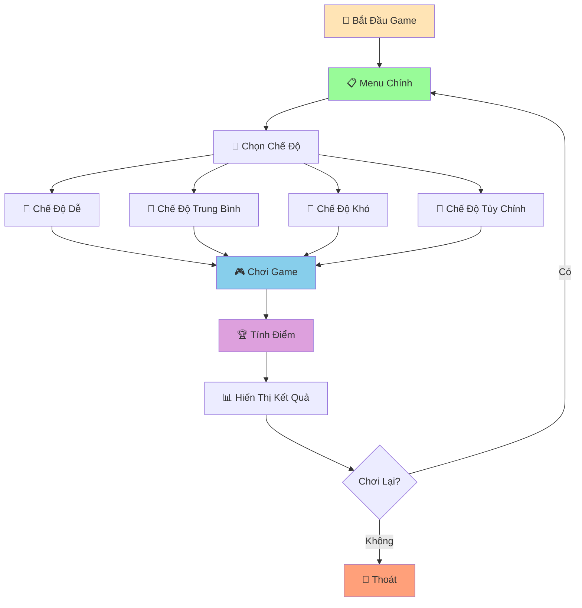

# 🎮 Game Đoán Số - Dự Án Thứ Hai

:::tip 🎯 Mục Tiêu Dự Án
Tạo một **game đoán số tương tác** với nhiều chế độ chơi, hệ thống điểm thông minh, và giao diện đẹp mắt! Áp dụng tất cả kiến thức đã học: functions, loops, conditions, data structures, và error handling.
:::

## 🎯 Tổng Quan Dự Án

Chúng ta sẽ tạo một game đoán số có thể:
- 🎲 **Nhiều chế độ chơi**: Dễ, Trung bình, Khó, Tùy chỉnh
- 🏆 **Hệ thống điểm**: Điểm dựa trên độ khó và số lần thử
- 📊 **Thống kê**: Lưu điểm cao nhất, số lần chơi
- 🎨 **Giao diện đẹp**: ASCII art, màu sắc, animation
- 🔄 **Chơi lại**: Menu linh hoạt, thoát dễ dàng



## 🛠️ Bước 1: Tạo Các Functions Cơ Bản

### 📌 Functions Hỗ Trợ

```python
import random
import time
import os

def clear_screen():
    """Xóa màn hình"""
    os.system('cls' if os.name == 'nt' else 'clear')

def print_header():
    """In header đẹp mắt"""
    print("=" * 60)
    print("🎮 GAME ĐOÁN SỐ PYTHON 🎮")
    print("=" * 60)
    print("🐍 Được tạo bởi học sinh Python")
    print("🎯 Hãy đoán số mà máy tính đang nghĩ!")
    print("=" * 60)

def print_separator():
    """In dòng phân cách"""
    print("-" * 60)

def animate_text(text, delay=0.05):
    """Hiệu ứng gõ chữ"""
    for char in text:
        print(char, end='', flush=True)
        time.sleep(delay)
    print()

def get_difficulty_settings():
    """Lấy cài đặt độ khó"""
    return {
        "dễ": {"min": 1, "max": 10, "attempts": 5, "multiplier": 1},
        "trung bình": {"min": 1, "max": 50, "attempts": 7, "multiplier": 2},
        "khó": {"min": 1, "max": 100, "attempts": 10, "multiplier": 3},
        "siêu khó": {"min": 1, "max": 1000, "attempts": 15, "multiplier": 5}
    }
```

### 🎯 Functions Game Logic

```python
def generate_secret_number(min_val, max_val):
    """Tạo số bí mật"""
    return random.randint(min_val, max_val)

def get_user_guess(min_val, max_val):
    """Lấy số đoán từ người dùng"""
    while True:
        try:
            guess = int(input(f"Nhập số đoán ({min_val}-{max_val}): "))
            if min_val <= guess <= max_val:
                return guess
            else:
                print(f"❌ Số phải từ {min_val} đến {max_val}!")
        except ValueError:
            print("❌ Vui lòng nhập số hợp lệ!")
        except KeyboardInterrupt:
            print("\n👋 Tạm biệt!")
            return None

def check_guess(secret, guess):
    """Kiểm tra số đoán"""
    if guess == secret:
        return "correct"
    elif guess < secret:
        return "too_low"
    else:
        return "too_high"

def calculate_score(secret, attempts, max_attempts, multiplier):
    """Tính điểm"""
    base_score = secret * multiplier
    attempt_bonus = (max_attempts - attempts + 1) * 10
    return base_score + attempt_bonus

def get_hint(secret, guess, min_val, max_val):
    """Tạo gợi ý thông minh"""
    difference = abs(secret - guess)
    range_size = max_val - min_val
    
    if difference <= range_size * 0.1:
        return "🔥 Rất gần rồi!"
    elif difference <= range_size * 0.2:
        return "🔥 Gần lắm!"
    elif difference <= range_size * 0.3:
        return "🔥 Khá gần!"
    elif difference <= range_size * 0.5:
        return "🤔 Còn xa một chút"
    else:
        return "😅 Còn xa lắm!"
```

## 🎪 Bước 2: Tạo Game Engine

```python
class GuessingGame:
    def __init__(self):
        self.high_scores = {}
        self.games_played = 0
        self.total_score = 0
        self.difficulty_settings = get_difficulty_settings()
    
    def show_main_menu(self):
        """Hiển thị menu chính"""
        clear_screen()
        print_header()
        
        print("\n📋 MENU CHÍNH")
        print_separator()
        print("1. 🎯 Chế độ Dễ (1-10, 5 lần thử)")
        print("2. 🎯 Chế độ Trung bình (1-50, 7 lần thử)")
        print("3. 🎯 Chế độ Khó (1-100, 10 lần thử)")
        print("4. 🎯 Chế độ Siêu khó (1-1000, 15 lần thử)")
        print("5. 🎯 Chế độ Tùy chỉnh")
        print("6. 📊 Xem thống kê")
        print("7. 🏆 Xem điểm cao nhất")
        print("8. 👋 Thoát")
        print_separator()
    
    def get_custom_settings(self):
        """Lấy cài đặt tùy chỉnh"""
        print("\n🎯 CHẾ ĐỘ TÙY CHỈNH")
        print_separator()
        
        while True:
            try:
                min_val = int(input("Nhập số nhỏ nhất: "))
                max_val = int(input("Nhập số lớn nhất: "))
                
                if min_val >= max_val:
                    print("❌ Số nhỏ nhất phải nhỏ hơn số lớn nhất!")
                    continue
                
                attempts = int(input("Nhập số lần thử: "))
                
                if attempts < 1:
                    print("❌ Số lần thử phải ít nhất là 1!")
                    continue
                
                multiplier = int(input("Nhập hệ số điểm (1-10): "))
                
                return {
                    "min": min_val,
                    "max": max_val,
                    "attempts": attempts,
                    "multiplier": max(1, min(10, multiplier))
                }
                
            except ValueError:
                print("❌ Vui lòng nhập số hợp lệ!")
            except KeyboardInterrupt:
                return None
    
    def play_game(self, difficulty_name, settings):
        """Chơi game với cài đặt cụ thể"""
        clear_screen()
        
        # Hiển thị thông tin game
        print_header()
        print(f"\n🎮 CHẾ ĐỘ: {difficulty_name.upper()}")
        print_separator()
        print(f"📊 Khoảng số: {settings['min']} - {settings['max']}")
        print(f"🎯 Số lần thử: {settings['attempts']}")
        print(f"⭐ Hệ số điểm: {settings['multiplier']}x")
        print_separator()
        
        # Tạo số bí mật
        secret = generate_secret_number(settings['min'], settings['max'])
        
        # Hiển thị animation
        animate_text("🤔 Máy tính đang nghĩ số...")
        time.sleep(1)
        animate_text("🎲 Đã chọn xong! Hãy bắt đầu đoán!")
        print_separator()
        
        # Vòng lặp chính
        attempts = 0
        max_attempts = settings['attempts']
        
        while attempts < max_attempts:
            attempts += 1
            remaining = max_attempts - attempts + 1
            
            print(f"\n🔢 Lần thử {attempts}/{max_attempts} (Còn {remaining} lần)")
            
            # Lấy số đoán
            guess = get_user_guess(settings['min'], settings['max'])
            if guess is None:
                return False
            
            # Kiểm tra số đoán
            result = check_guess(secret, guess)
            
            if result == "correct":
                # Thắng!
                score = calculate_score(secret, attempts, max_attempts, settings['multiplier'])
                
                print(f"\n🎉 CHÍNH XÁC! Số bí mật là {secret}!")
                print(f"🏆 Bạn đã đoán đúng trong {attempts} lần!")
                print(f"⭐ Điểm: {score}")
                
                # Đánh giá hiệu suất
                self.evaluate_performance(attempts, max_attempts)
                
                # Cập nhật thống kê
                self.update_stats(difficulty_name, score, True)
                
                return True
            
            elif result == "too_low":
                print("📈 Số bạn đoán THẤP HƠN số bí mật!")
            else:
                print("📉 Số bạn đoán CAO HƠN số bí mật!")
            
            # Hiển thị gợi ý
            if attempts < max_attempts:
                hint = get_hint(secret, guess, settings['min'], settings['max'])
                print(f"💡 {hint}")
        
        # Hết lượt
        print(f"\n💔 HẾT LƯỢT! Số bí mật là {secret}")
        print("😔 Lần sau hãy thử chiến lược khác nhé!")
        
        # Cập nhật thống kê
        self.update_stats(difficulty_name, 0, False)
        
        return False
    
    def evaluate_performance(self, attempts, max_attempts):
        """Đánh giá hiệu suất"""
        ratio = attempts / max_attempts
        
        if ratio <= 0.3:
            print("🌟 XUẤT SẮC! Bạn là cao thủ đoán số!")
        elif ratio <= 0.5:
            print("👍 RẤT TỐT! Kỹ năng ổn định!")
        elif ratio <= 0.7:
            print("😊 KHÔNG SAO! Lần sau sẽ tốt hơn!")
        else:
            print("💪 CỐ GẮNG! Hãy thử chiến lược khác!")
    
    def update_stats(self, difficulty, score, won):
        """Cập nhật thống kê"""
        self.games_played += 1
        if won:
            self.total_score += score
            
            # Cập nhật điểm cao nhất
            if difficulty not in self.high_scores or score > self.high_scores[difficulty]:
                self.high_scores[difficulty] = score
                print(f"🎊 ĐIỂM CAO NHẤT MỚI! ({difficulty})")
    
    def show_stats(self):
        """Hiển thị thống kê"""
        clear_screen()
        print_header()
        
        print("\n📊 THỐNG KÊ CÁ NHÂN")
        print_separator()
        
        print(f"🎮 Số lần chơi: {self.games_played}")
        print(f"🏆 Tổng điểm: {self.total_score}")
        
        if self.games_played > 0:
            avg_score = self.total_score / self.games_played
            print(f"📈 Điểm trung bình: {avg_score:.1f}")
        
        if self.high_scores:
            print(f"\n🏆 ĐIỂM CAO NHẤT THEO CHẾ ĐỘ:")
            for difficulty, score in self.high_scores.items():
                print(f"   {difficulty.title()}: {score}")
        
        input("\nNhấn Enter để quay lại menu chính...")
    
    def show_high_scores(self):
        """Hiển thị điểm cao nhất"""
        clear_screen()
        print_header()
        
        print("\n🏆 BẢNG ĐIỂM CAO NHẤT")
        print_separator()
        
        if self.high_scores:
            # Sắp xếp theo điểm
            sorted_scores = sorted(self.high_scores.items(), key=lambda x: x[1], reverse=True)
            
            for i, (difficulty, score) in enumerate(sorted_scores, 1):
                medal = "🥇" if i == 1 else "🥈" if i == 2 else "🥉" if i == 3 else "🏅"
                print(f"{medal} {i}. {difficulty.title()}: {score} điểm")
        else:
            print("😅 Chưa có điểm cao nhất nào!")
        
        input("\nNhấn Enter để quay lại menu chính...")
    
    def run(self):
        """Chạy game chính"""
        while True:
            self.show_main_menu()
            
            try:
                choice = input("👉 Chọn chế độ (1-8): ").strip()
                
                if choice == "1":
                    self.play_game("dễ", self.difficulty_settings["dễ"])
                elif choice == "2":
                    self.play_game("trung bình", self.difficulty_settings["trung bình"])
                elif choice == "3":
                    self.play_game("khó", self.difficulty_settings["khó"])
                elif choice == "4":
                    self.play_game("siêu khó", self.difficulty_settings["siêu khó"])
                elif choice == "5":
                    custom_settings = self.get_custom_settings()
                    if custom_settings:
                        self.play_game("tùy chỉnh", custom_settings)
                elif choice == "6":
                    self.show_stats()
                elif choice == "7":
                    self.show_high_scores()
                elif choice == "8":
                    print("\n👋 Cảm ơn bạn đã chơi!")
                    print("🐍 Hẹn gặp lại trong game tiếp theo!")
                    break
                else:
                    print("❌ Lựa chọn không hợp lệ!")
                    time.sleep(1)
                
                # Hỏi có chơi lại không
                if choice in ["1", "2", "3", "4", "5"]:
                    while True:
                        play_again = input("\n🔄 Chơi lại? (y/n): ").lower().strip()
                        if play_again in ['y', 'yes', 'có', 'c']:
                            break
                        elif play_again in ['n', 'no', 'không', 'k']:
                            break
                        else:
                            print("❌ Vui lòng nhập 'y' hoặc 'n'!")
                    
                    if play_again in ['n', 'no', 'không', 'k']:
                        continue
                
            except KeyboardInterrupt:
                print("\n\n👋 Tạm biệt!")
                break
            except Exception as e:
                print(f"❌ Lỗi không mong muốn: {e}")
                time.sleep(2)
```

## 🚀 Bước 3: Chương Trình Hoàn Chỉnh

```python
# 🎮 GAME ĐOÁN SỐ PYTHON HOÀN CHỈNH
# Tác giả: Học sinh Python
# Ngày: 2024

def main():
    """Hàm chính của chương trình"""
    try:
        # Tạo và chạy game
        game = GuessingGame()
        game.run()
        
    except KeyboardInterrupt:
        print("\n\n👋 Chương trình bị dừng bởi người dùng!")
    except Exception as e:
        print(f"\n❌ Lỗi không mong muốn: {e}")
    finally:
        print("🔚 Chương trình kết thúc!")

# Chạy chương trình
if __name__ == "__main__":
    main()
```

## 🎯 Bài Tập Mở Rộng

### 🥇 Bài Tập 1: Thêm Tính Năng Mới

```python
# TODO: Thêm các tính năng sau vào game
def save_game_data(game):
    """Lưu dữ liệu game vào file"""
    import json
    
    data = {
        "high_scores": game.high_scores,
        "games_played": game.games_played,
        "total_score": game.total_score
    }
    
    try:
        with open('game_data.json', 'w') as f:
            json.dump(data, f, indent=2)
        print("✅ Đã lưu dữ liệu game!")
    except Exception as e:
        print(f"❌ Lỗi khi lưu: {e}")

def load_game_data():
    """Tải dữ liệu game từ file"""
    import json
    
    try:
        with open('game_data.json', 'r') as f:
            data = json.load(f)
        return data
    except FileNotFoundError:
        return {"high_scores": {}, "games_played": 0, "total_score": 0}
    except Exception as e:
        print(f"❌ Lỗi khi tải: {e}")
        return {"high_scores": {}, "games_played": 0, "total_score": 0}

def add_achievement_system(game):
    """Thêm hệ thống thành tích"""
    achievements = {
        "first_win": {"name": "Chiến thắng đầu tiên", "unlocked": False},
        "perfect_game": {"name": "Thắng hoàn hảo (1 lần thử)", "unlocked": False},
        "high_score": {"name": "Điểm cao (1000+)", "unlocked": False},
        "persistent": {"name": "Kiên trì (10 lần chơi)", "unlocked": False}
    }
    
    # Kiểm tra và mở khóa thành tích
    if game.games_played >= 1 and not achievements["first_win"]["unlocked"]:
        achievements["first_win"]["unlocked"] = True
        print("🏆 THÀNH TÍCH MỚI: Chiến thắng đầu tiên!")
    
    if game.games_played >= 10 and not achievements["persistent"]["unlocked"]:
        achievements["persistent"]["unlocked"] = True
        print("🏆 THÀNH TÍCH MỚI: Kiên trì!")
    
    return achievements
```

### 🥈 Bài Tập 2: Giao Diện Đồ Họa

```python
# TODO: Tạo giao diện đồ họa với tkinter
import tkinter as tk
from tkinter import ttk, messagebox
import random

class GuessingGameGUI:
    def __init__(self):
        self.root = tk.Tk()
        self.root.title("Game Đoán Số Python")
        self.root.geometry("500x400")
        
        self.secret_number = 0
        self.attempts = 0
        self.max_attempts = 7
        self.score = 0
        
        self.setup_ui()
    
    def setup_ui(self):
        """Thiết lập giao diện"""
        # Header
        header = tk.Label(self.root, text="🎮 GAME ĐOÁN SỐ", 
                         font=("Arial", 20, "bold"))
        header.pack(pady=20)
        
        # Difficulty selection
        diff_frame = tk.Frame(self.root)
        diff_frame.pack(pady=10)
        
        tk.Label(diff_frame, text="Chọn độ khó:").pack()
        
        self.diff_var = tk.StringVar(value="Trung bình")
        difficulties = ["Dễ", "Trung bình", "Khó", "Siêu khó"]
        
        for diff in difficulties:
            tk.Radiobutton(diff_frame, text=diff, variable=self.diff_var, 
                          value=diff).pack(anchor="w")
        
        # Start button
        start_btn = tk.Button(self.root, text="Bắt đầu game", 
                             command=self.start_game, bg="green", fg="white")
        start_btn.pack(pady=10)
        
        # Game area
        self.game_frame = tk.Frame(self.root)
        
        # Status
        self.status_label = tk.Label(self.game_frame, text="", 
                                    font=("Arial", 12))
        self.status_label.pack(pady=10)
        
        # Input
        input_frame = tk.Frame(self.game_frame)
        input_frame.pack(pady=10)
        
        tk.Label(input_frame, text="Nhập số đoán:").pack()
        
        self.guess_entry = tk.Entry(input_frame, font=("Arial", 14))
        self.guess_entry.pack(pady=5)
        self.guess_entry.bind('<Return>', self.make_guess)
        
        # Guess button
        guess_btn = tk.Button(input_frame, text="Đoán", 
                             command=self.make_guess, bg="blue", fg="white")
        guess_btn.pack(pady=5)
        
        # Result
        self.result_label = tk.Label(self.game_frame, text="", 
                                    font=("Arial", 12), fg="red")
        self.result_label.pack(pady=10)
        
        # Score
        self.score_label = tk.Label(self.game_frame, text="", 
                                   font=("Arial", 12), fg="green")
        self.score_label.pack(pady=5)
    
    def start_game(self):
        """Bắt đầu game mới"""
        # Ẩn menu, hiển thị game
        self.game_frame.pack(pady=20)
        
        # Thiết lập độ khó
        diff = self.diff_var.get()
        if diff == "Dễ":
            self.max_attempts = 5
            self.secret_number = random.randint(1, 10)
        elif diff == "Trung bình":
            self.max_attempts = 7
            self.secret_number = random.randint(1, 50)
        elif diff == "Khó":
            self.max_attempts = 10
            self.secret_number = random.randint(1, 100)
        else:  # Siêu khó
            self.max_attempts = 15
            self.secret_number = random.randint(1, 1000)
        
        self.attempts = 0
        self.score = 0
        
        self.status_label.config(text=f"Đã chọn số từ 1-{self.secret_number if diff == 'Dễ' else 50 if diff == 'Trung bình' else 100 if diff == 'Khó' else 1000}")
        self.result_label.config(text="")
        self.score_label.config(text="")
        self.guess_entry.delete(0, tk.END)
        self.guess_entry.focus()
    
    def make_guess(self, event=None):
        """Thực hiện đoán"""
        try:
            guess = int(self.guess_entry.get())
            self.attempts += 1
            
            if guess == self.secret_number:
                # Thắng!
                self.score = self.secret_number * (self.max_attempts - self.attempts + 1)
                self.result_label.config(text=f"🎉 CHÍNH XÁC! Số bí mật là {self.secret_number}!", fg="green")
                self.score_label.config(text=f"🏆 Điểm: {self.score}")
                messagebox.showinfo("Thắng!", f"Bạn đã thắng trong {self.attempts} lần!\nĐiểm: {self.score}")
                self.game_frame.pack_forget()
            elif self.attempts >= self.max_attempts:
                # Hết lượt
                self.result_label.config(text=f"💔 HẾT LƯỢT! Số bí mật là {self.secret_number}", fg="red")
                messagebox.showinfo("Thua!", f"Số bí mật là {self.secret_number}")
                self.game_frame.pack_forget()
            elif guess < self.secret_number:
                self.result_label.config(text=f"📈 Số {guess} THẤP HƠN! (Lần {self.attempts}/{self.max_attempts})", fg="orange")
            else:
                self.result_label.config(text=f"📉 Số {guess} CAO HƠN! (Lần {self.attempts}/{self.max_attempts})", fg="orange")
            
            self.guess_entry.delete(0, tk.END)
            
        except ValueError:
            messagebox.showerror("Lỗi", "Vui lòng nhập số hợp lệ!")
    
    def run(self):
        """Chạy ứng dụng"""
        self.root.mainloop()

# Chạy giao diện đồ họa
if __name__ == "__main__":
    app = GuessingGameGUI()
    app.run()
```

### 🥉 Bài Tập 3: Multiplayer Mode

```python
# TODO: Thêm chế độ chơi nhiều người
class MultiplayerGame:
    def __init__(self):
        self.players = []
        self.current_player = 0
        self.secret_number = 0
        self.attempts = 0
        self.max_attempts = 10
    
    def add_player(self, name):
        """Thêm người chơi"""
        self.players.append({"name": name, "score": 0, "wins": 0})
    
    def start_multiplayer_game(self):
        """Bắt đầu game nhiều người"""
        print("👥 CHẾ ĐỘ NHIỀU NGƯỜI")
        print("=" * 40)
        
        # Thêm người chơi
        num_players = int(input("Số người chơi (2-4): "))
        
        for i in range(num_players):
            name = input(f"Tên người chơi {i+1}: ")
            self.add_player(name)
        
        # Tạo số bí mật
        self.secret_number = random.randint(1, 100)
        self.attempts = 0
        self.max_attempts = len(self.players) * 3
        
        print(f"\n🎲 Số bí mật đã được chọn (1-100)")
        print(f"🎯 Mỗi người có {self.max_attempts // len(self.players)} lần thử")
        print("=" * 40)
        
        # Vòng lặp chính
        while self.attempts < self.max_attempts:
            current_player = self.players[self.current_player]
            
            print(f"\n🔢 Lượt của {current_player['name']}")
            print(f"📊 Điểm hiện tại: {current_player['score']}")
            
            guess = get_user_guess(1, 100)
            if guess is None:
                return
            
            self.attempts += 1
            result = check_guess(self.secret_number, guess)
            
            if result == "correct":
                # Thắng!
                score = calculate_score(self.secret_number, self.attempts, self.max_attempts, 2)
                current_player['score'] += score
                current_player['wins'] += 1
                
                print(f"\n🎉 {current_player['name']} THẮNG!")
                print(f"🏆 Điểm: {score}")
                print(f"⭐ Tổng điểm: {current_player['score']}")
                
                self.show_final_scores()
                return
            
            elif result == "too_low":
                print("📈 Số THẤP HƠN!")
            else:
                print("📉 Số CAO HƠN!")
            
            # Chuyển lượt
            self.current_player = (self.current_player + 1) % len(self.players)
        
        # Hết lượt
        print(f"\n💔 HẾT LƯỢT! Số bí mật là {self.secret_number}")
        self.show_final_scores()
    
    def show_final_scores(self):
        """Hiển thị điểm cuối"""
        print("\n🏆 BẢNG ĐIỂM CUỐI")
        print("=" * 40)
        
        # Sắp xếp theo điểm
        sorted_players = sorted(self.players, key=lambda x: x['score'], reverse=True)
        
        for i, player in enumerate(sorted_players, 1):
            medal = "🥇" if i == 1 else "🥈" if i == 2 else "🥉" if i == 3 else "🏅"
            print(f"{medal} {i}. {player['name']}: {player['score']} điểm ({player['wins']} lần thắng)")
```

## 🎊 Tóm Tắt Dự Án

Trong dự án này, bạn đã học được:

✅ **Áp dụng kiến thức tổng hợp** - Functions, classes, data structures  
✅ **Tạo game tương tác** - Menu, multiple modes, user input  
✅ **Hệ thống điểm thông minh** - Scoring, statistics, achievements  
✅ **Giao diện đẹp mắt** - ASCII art, animations, colors  
✅ **Xử lý lỗi chuyên nghiệp** - Try/except, validation  
✅ **Tổ chức code tốt** - Classes, methods, separation of concerns  

## 🚀 Bước Tiếp Theo

Tuyệt vời! Bạn đã hoàn thành **dự án thứ hai** với nhiều tính năng thú vị! Tiếp theo, chúng ta sẽ tạo [Password Generator](/python/projects/password-generator) - một dự án thực tế và hữu ích!

:::tip 🎯 Thử Thách Mở Rộng
Hãy thử thêm các tính năng sau vào game:
1. **Chế độ câu đố**: Đoán số dựa trên gợi ý
2. **Chế độ thời gian**: Đoán trong thời gian giới hạn
3. **Chế độ AI**: Máy tính đoán số bạn nghĩ
4. **Lưu trữ dữ liệu**: File JSON, database
5. **Giao diện web**: Flask, Streamlit
:::

---

*🔗 **Dự án tiếp theo**: [Password Generator - Tạo Mật Khẩu An Toàn](/python/projects/password-generator)*
