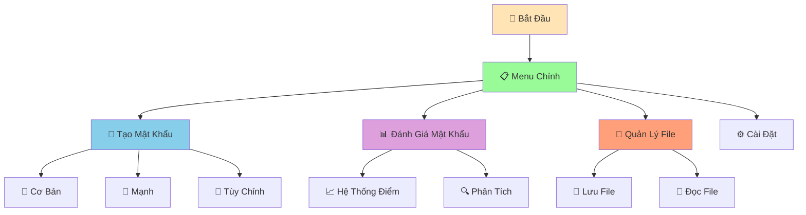

# 🔐 Password Generator - Tạo Mật Khẩu An Toàn

:::tip 🔐 Mục Tiêu Dự Án
Tạo một **ứng dụng tạo mật khẩu an toàn** với nhiều tùy chọn, đánh giá độ mạnh, và lưu trữ! Áp dụng tất cả kiến thức đã học: functions, error handling, string methods, và data structures.
:::

## 🎯 Tổng Quan Dự Án

Chúng ta sẽ tạo một ứng dụng tạo mật khẩu có thể:
- 🎲 **Nhiều loại mật khẩu**: Cơ bản, mạnh, tùy chỉnh
- 🔒 **Tùy chọn bảo mật**: Độ dài, ký tự đặc biệt, số
- 📊 **Đánh giá độ mạnh**: Hệ thống điểm thông minh
- 💾 **Lưu trữ**: Lưu mật khẩu vào file
- 🎨 **Giao diện đẹp**: Menu tương tác, màu sắc



## 🛠️ Bước 1: Tạo Các Functions Cơ Bản

### 📌 Import và Setup

```python
import random
import string
import json
import os
from datetime import datetime

class PasswordGenerator:
    def __init__(self):
        self.lowercase_chars = string.ascii_lowercase
        self.uppercase_chars = string.ascii_uppercase
        self.digit_chars = string.digits
        self.special_chars = "!@#$%^&*()_+-=[]{}|;:,.<>?"
        self.password_history = []
        self.storage_folder = "passwords"
        self.create_folder()
    
    def create_folder(self):
        """Tạo thư mục lưu trữ"""
        try:
            if not os.path.exists(self.storage_folder):
                os.makedirs(self.storage_folder)
                print(f"✅ Đã tạo thư mục: {self.storage_folder}")
        except Exception as e:
            print(f"❌ Lỗi tạo thư mục: {e}")
    
    def print_header(self):
        """In header đẹp mắt"""
        print("=" * 60)
        print("🔐 PASSWORD GENERATOR - TẠO MẬT KHẨU AN TOÀN 🔐")
        print("=" * 60)
        print("🛡️  Bảo vệ tài khoản của bạn với mật khẩu mạnh!")
        print("=" * 60)
    
    def print_separator(self):
        """In dòng phân cách"""
        print("-" * 60)
```

### 🎲 Functions Tạo Mật Khẩu

```python
    def generate_basic_password(self, length=8):
        """Tạo mật khẩu cơ bản"""
        try:
            # Chỉ sử dụng chữ thường và số
            valid_chars = self.lowercase_chars + self.digit_chars
            password = [random.choice(valid_chars) for _ in range(length)]
            random.shuffle(password)
            return ''.join(password)
        except Exception as e:
            print(f"❌ Lỗi tạo mật khẩu cơ bản: {e}")
            return None
    
    def generate_strong_password(self, length=12):
        """Tạo mật khẩu mạnh"""
        try:
            # Đảm bảo có ít nhất 1 ký tự từ mỗi loại
            password = [
                random.choice(self.lowercase_chars),
                random.choice(self.uppercase_chars),
                random.choice(self.digit_chars),
                random.choice(self.special_chars)
            ]
            
            # Thêm ký tự ngẫu nhiên
            all_chars = (self.lowercase_chars + self.uppercase_chars + 
                        self.digit_chars + self.special_chars)
            password.extend([random.choice(all_chars) 
                           for _ in range(length - 4)])
            
            # Xáo trộn
            random.shuffle(password)
            return ''.join(password)
        except Exception as e:
            print(f"❌ Lỗi tạo mật khẩu mạnh: {e}")
            return None
    
    def generate_custom_password(self, length, include_lowercase=True, 
                               include_uppercase=True, include_digits=True, 
                               include_special=True):
        """Tạo mật khẩu tùy chỉnh"""
        try:
            valid_chars = ""
            
            if include_lowercase:
                valid_chars += self.lowercase_chars
            if include_uppercase:
                valid_chars += self.uppercase_chars
            if include_digits:
                valid_chars += self.digit_chars
            if include_special:
                valid_chars += self.special_chars
            
            if not valid_chars:
                print("❌ Phải chọn ít nhất một loại ký tự!")
                return None
            
            password = [random.choice(valid_chars) for _ in range(length)]
            random.shuffle(password)
            return ''.join(password)
        except Exception as e:
            print(f"❌ Lỗi tạo mật khẩu tùy chỉnh: {e}")
            return None
    
    def generate_password_from_word(self, base_word):
        """Tạo mật khẩu từ từ gốc"""
        try:
            password = []
            
            # Biến đổi từ gốc
            for char in base_word:
                if char.isalpha():
                    if char.islower():
                        password.append(char.upper())
                    else:
                        password.append(char.lower())
                else:
                    password.append(char)
            
            # Thêm số và ký tự đặc biệt
            password.extend([random.choice(self.digit_chars) for _ in range(2)])
            password.extend([random.choice(self.special_chars) for _ in range(2)])
            
            # Xáo trộn
            random.shuffle(password)
            return ''.join(password)
        except Exception as e:
            print(f"❌ Lỗi tạo mật khẩu từ từ: {e}")
            return None
```

## 🎪 Bước 2: Hệ Thống Đánh Giá Mật Khẩu

```python
    def evaluate_password(self, password):
        """Đánh giá độ mạnh của mật khẩu"""
        try:
            score = 0
            details = []
            
            # Độ dài
            if len(password) >= 12:
                score += 3
                details.append("✅ Độ dài tốt (≥12)")
            elif len(password) >= 8:
                score += 2
                details.append("✅ Độ dài trung bình (≥8)")
            else:
                score += 1
                details.append("⚠️  Độ dài ngắn (<8)")
            
            # Chữ thường
            if any(c.islower() for c in password):
                score += 1
                details.append("✅ Có chữ thường")
            else:
                details.append("❌ Thiếu chữ thường")
            
            # Chữ hoa
            if any(c.isupper() for c in password):
                score += 1
                details.append("✅ Có chữ hoa")
            else:
                details.append("❌ Thiếu chữ hoa")
            
            # Số
            if any(c.isdigit() for c in password):
                score += 1
                details.append("✅ Có số")
            else:
                details.append("❌ Thiếu số")
            
            # Ký tự đặc biệt
            if any(c in self.special_chars for c in password):
                score += 2
                details.append("✅ Có ký tự đặc biệt")
            else:
                details.append("❌ Thiếu ký tự đặc biệt")
            
            # Đánh giá tổng thể
            if score >= 8:
                rating = "Rất mạnh"
                color_indicator = "🟢"
            elif score >= 6:
                rating = "Mạnh"
                color_indicator = "🟡"
            elif score >= 4:
                rating = "Trung bình"
                color_indicator = "🟠"
            else:
                rating = "Yếu"
                color_indicator = "🔴"
            
            return {
                "score": score,
                "rating": rating,
                "color_indicator": color_indicator,
                "details": details
            }
        except Exception as e:
            print(f"❌ Lỗi đánh giá mật khẩu: {e}")
            return None
    
    def display_evaluation(self, password, evaluation):
        """Hiển thị đánh giá mật khẩu"""
        try:
            print(f"\n📊 ĐÁNH GIÁ MẬT KHẨU")
            print("=" * 40)
            print(f"🔐 Mật khẩu: {password}")
            print(f"{evaluation['color_indicator']} Xếp loại: {evaluation['rating']}")
            print(f"📈 Điểm: {evaluation['score']}/8")
            
            print(f"\n📋 CHI TIẾT:")
            for detail in evaluation['details']:
                print(f"   {detail}")
            
            # Gợi ý cải thiện
            if evaluation['score'] < 8:
                print(f"\n💡 GỢI Ý CẢI THIỆN:")
                if len(password) < 12:
                    print("   - Tăng độ dài mật khẩu (≥12 ký tự)")
                if not any(c.islower() for c in password):
                    print("   - Thêm chữ thường")
                if not any(c.isupper() for c in password):
                    print("   - Thêm chữ hoa")
                if not any(c.isdigit() for c in password):
                    print("   - Thêm số")
                if not any(c in self.special_chars for c in password):
                    print("   - Thêm ký tự đặc biệt")
        except Exception as e:
            print(f"❌ Lỗi hiển thị đánh giá: {e}")
```

## 🎯 Bước 3: Hệ Thống Lưu Trữ

```python
    def save_password(self, password, account_name="", note=""):
        """Lưu mật khẩu vào lịch sử"""
        try:
            info = {
                "password": password,
                "account_name": account_name,
                "note": note,
                "timestamp": datetime.now().strftime("%Y-%m-%d %H:%M:%S"),
                "evaluation": self.evaluate_password(password)
            }
            
            self.password_history.append(info)
            print(f"✅ Đã lưu mật khẩu vào lịch sử")
            return True
        except Exception as e:
            print(f"❌ Lỗi lưu mật khẩu: {e}")
            return False
    
    def save_to_file(self, filename="passwords.json"):
        """Lưu lịch sử mật khẩu vào file"""
        try:
            file_path = os.path.join(self.storage_folder, filename)
            with open(file_path, 'w', encoding='utf-8') as f:
                json.dump(self.password_history, f, ensure_ascii=False, indent=2)
            print(f"✅ Đã lưu {len(self.password_history)} mật khẩu vào {filename}")
            return True
        except Exception as e:
            print(f"❌ Lỗi lưu file: {e}")
            return False
    
    def load_from_file(self, filename="passwords.json"):
        """Đọc lịch sử mật khẩu từ file"""
        try:
            file_path = os.path.join(self.storage_folder, filename)
            if os.path.exists(file_path):
                with open(file_path, 'r', encoding='utf-8') as f:
                    self.password_history = json.load(f)
                print(f"✅ Đã đọc {len(self.password_history)} mật khẩu từ {filename}")
                return True
            else:
                print(f"⚠️  File {filename} không tồn tại")
                return False
        except Exception as e:
            print(f"❌ Lỗi đọc file: {e}")
            return False
    
    def display_history(self):
        """Hiển thị lịch sử mật khẩu"""
        try:
            if not self.password_history:
                print("📋 Chưa có mật khẩu nào trong lịch sử")
                return
            
            print(f"\n📋 LỊCH SỬ MẬT KHẨU ({len(self.password_history)} mật khẩu)")
            print("=" * 60)
            
            for i, info in enumerate(self.password_history, 1):
                print(f"{i:2d}. {info['password']}")
                if info['account_name']:
                    print(f"    Tài khoản: {info['account_name']}")
                if info['note']:
                    print(f"    Ghi chú: {info['note']}")
                print(f"    Thời gian: {info['timestamp']}")
                print(f"    Xếp loại: {info['evaluation']['rating']}")
                print("-" * 40)
        except Exception as e:
            print(f"❌ Lỗi hiển thị lịch sử: {e}")
```

## 🚀 Bước 4: Menu Chính

```python
    def show_main_menu(self):
        """Hiển thị menu chính"""
        self.print_header()
        print("\n📋 MENU CHÍNH")
        print("1. 🔐 Tạo mật khẩu cơ bản")
        print("2. 💪 Tạo mật khẩu mạnh")
        print("3. 🎯 Tạo mật khẩu tùy chỉnh")
        print("4. 📝 Tạo mật khẩu từ từ gốc")
        print("5. 📊 Đánh giá mật khẩu")
        print("6. 📋 Xem lịch sử")
        print("7. 💾 Lưu vào file")
        print("8. 📖 Đọc từ file")
        print("9. ⚙️  Cài đặt")
        print("0. 👋 Thoát")
        self.print_separator()
    
    def run_application(self):
        """Chạy ứng dụng chính"""
        # Đọc lịch sử từ file
        self.load_from_file()
        
        while True:
            try:
                self.show_main_menu()
                choice = input("👉 Chọn chức năng (0-9): ").strip()
                
                if choice == "0":
                    print("👋 Cảm ơn bạn đã sử dụng!")
                    break
                elif choice == "1":
                    self.basic_password_menu()
                elif choice == "2":
                    self.strong_password_menu()
                elif choice == "3":
                    self.custom_password_menu()
                elif choice == "4":
                    self.word_based_password_menu()
                elif choice == "5":
                    self.password_evaluation_menu()
                elif choice == "6":
                    self.display_history()
                elif choice == "7":
                    self.save_to_file()
                elif choice == "8":
                    self.load_from_file()
                elif choice == "9":
                    self.settings_menu()
                else:
                    print("❌ Lựa chọn không hợp lệ!")
                
                input("\nNhấn Enter để tiếp tục...")
                
            except KeyboardInterrupt:
                print("\n👋 Tạm biệt!")
                break
            except Exception as e:
                print(f"❌ Lỗi không mong muốn: {e}")
                input("Nhấn Enter để tiếp tục...")
    
    def basic_password_menu(self):
        """Menu tạo mật khẩu cơ bản"""
        try:
            print("\n🔐 TẠO MẬT KHẨU CƠ BẢN")
            self.print_separator()
            
            length = int(input("Nhập độ dài mật khẩu (mặc định 8): ") or "8")
            
            if length < 4:
                print("❌ Độ dài mật khẩu phải ít nhất 4 ký tự!")
                return
            
            password = self.generate_basic_password(length)
            if password:
                print(f"🔐 Mật khẩu cơ bản: {password}")
                
                # Đánh giá
                evaluation = self.evaluate_password(password)
                self.display_evaluation(password, evaluation)
                
                # Lưu vào lịch sử
                save_choice = input("\n💾 Lưu vào lịch sử? (y/n): ").lower()
                if save_choice in ['y', 'yes', 'có', 'c']:
                    account_name = input("Tên tài khoản (tùy chọn): ").strip()
                    note = input("Ghi chú (tùy chọn): ").strip()
                    self.save_password(password, account_name, note)
        except ValueError:
            print("❌ Vui lòng nhập số hợp lệ!")
        except Exception as e:
            print(f"❌ Lỗi: {e}")
    
    def strong_password_menu(self):
        """Menu tạo mật khẩu mạnh"""
        try:
            print("\n💪 TẠO MẬT KHẨU MẠNH")
            self.print_separator()
            
            length = int(input("Nhập độ dài mật khẩu (mặc định 12): ") or "12")
            
            if length < 8:
                print("❌ Mật khẩu mạnh phải ít nhất 8 ký tự!")
                return
            
            password = self.generate_strong_password(length)
            if password:
                print(f"💪 Mật khẩu mạnh: {password}")
                
                # Đánh giá
                evaluation = self.evaluate_password(password)
                self.display_evaluation(password, evaluation)
                
                # Lưu vào lịch sử
                save_choice = input("\n💾 Lưu vào lịch sử? (y/n): ").lower()
                if save_choice in ['y', 'yes', 'có', 'c']:
                    account_name = input("Tên tài khoản (tùy chọn): ").strip()
                    note = input("Ghi chú (tùy chọn): ").strip()
                    self.save_password(password, account_name, note)
        except ValueError:
            print("❌ Vui lòng nhập số hợp lệ!")
        except Exception as e:
            print(f"❌ Lỗi: {e}")
    
    def custom_password_menu(self):
        """Menu tạo mật khẩu tùy chỉnh"""
        try:
            print("\n🎯 TẠO MẬT KHẨU TÙY CHỈNH")
            self.print_separator()
            
            length = int(input("Nhập độ dài mật khẩu: "))
            
            if length < 4:
                print("❌ Độ dài mật khẩu phải ít nhất 4 ký tự!")
                return
            
            print("\nChọn loại ký tự:")
            include_lowercase = input("Chữ thường (a-z)? (y/n): ").lower() in ['y', 'yes', 'có', 'c']
            include_uppercase = input("Chữ hoa (A-Z)? (y/n): ").lower() in ['y', 'yes', 'có', 'c']
            include_digits = input("Số (0-9)? (y/n): ").lower() in ['y', 'yes', 'có', 'c']
            include_special = input("Ký tự đặc biệt (!@#$...)? (y/n): ").lower() in ['y', 'yes', 'có', 'c']
            
            password = self.generate_custom_password(length, include_lowercase, 
                                                   include_uppercase, include_digits, 
                                                   include_special)
            if password:
                print(f"🎯 Mật khẩu tùy chỉnh: {password}")
                
                # Đánh giá
                evaluation = self.evaluate_password(password)
                self.display_evaluation(password, evaluation)
                
                # Lưu vào lịch sử
                save_choice = input("\n💾 Lưu vào lịch sử? (y/n): ").lower()
                if save_choice in ['y', 'yes', 'có', 'c']:
                    account_name = input("Tên tài khoản (tùy chọn): ").strip()
                    note = input("Ghi chú (tùy chọn): ").strip()
                    self.save_password(password, account_name, note)
        except ValueError:
            print("❌ Vui lòng nhập số hợp lệ!")
        except Exception as e:
            print(f"❌ Lỗi: {e}")
    
    def word_based_password_menu(self):
        """Menu tạo mật khẩu từ từ gốc"""
        try:
            print("\n📝 TẠO MẬT KHẨU TỪ TỪ GỐC")
            self.print_separator()
            
            base_word = input("Nhập từ gốc: ").strip()
            
            if not base_word:
                print("❌ Vui lòng nhập từ gốc!")
                return
            
            password = self.generate_password_from_word(base_word)
            if password:
                print(f"📝 Mật khẩu từ '{base_word}': {password}")
                
                # Đánh giá
                evaluation = self.evaluate_password(password)
                self.display_evaluation(password, evaluation)
                
                # Lưu vào lịch sử
                save_choice = input("\n💾 Lưu vào lịch sử? (y/n): ").lower()
                if save_choice in ['y', 'yes', 'có', 'c']:
                    account_name = input("Tên tài khoản (tùy chọn): ").strip()
                    note = input("Ghi chú (tùy chọn): ").strip()
                    self.save_password(password, account_name, note)
        except Exception as e:
            print(f"❌ Lỗi: {e}")
    
    def password_evaluation_menu(self):
        """Menu đánh giá mật khẩu"""
        try:
            print("\n📊 ĐÁNH GIÁ MẬT KHẨU")
            self.print_separator()
            
            password = input("Nhập mật khẩu cần đánh giá: ").strip()
            
            if not password:
                print("❌ Vui lòng nhập mật khẩu!")
                return
            
            evaluation = self.evaluate_password(password)
            if evaluation:
                self.display_evaluation(password, evaluation)
        except Exception as e:
            print(f"❌ Lỗi: {e}")
    
    def settings_menu(self):
        """Menu cài đặt"""
        try:
            print("\n⚙️  CÀI ĐẶT")
            self.print_separator()
            print(f"📁 Thư mục lưu trữ: {self.storage_folder}")
            print(f"📊 Số mật khẩu trong lịch sử: {len(self.password_history)}")
            print(f"🔤 Ký tự đặc biệt: {self.special_chars}")
            
            # Tùy chọn thay đổi thư mục
            change_folder = input("\nThay đổi thư mục lưu trữ? (y/n): ").lower()
            if change_folder in ['y', 'yes', 'có', 'c']:
                new_folder = input("Nhập thư mục mới: ").strip()
                if new_folder:
                    self.storage_folder = new_folder
                    self.create_folder()
                    print(f"✅ Đã thay đổi thư mục thành: {new_folder}")
        except Exception as e:
            print(f"❌ Lỗi: {e}")
```

## 🎯 Chương Trình Hoàn Chỉnh

```python
# 🔐 PASSWORD GENERATOR HOÀN CHỈNH
# Tác giả: Behitek Team
# Ngày: 2024

def main():
    """Hàm chính của chương trình"""
    try:
        # Tạo và chạy ứng dụng
        app = PasswordGenerator()
        app.run_application()
        
    except KeyboardInterrupt:
        print("\n\n👋 Chương trình bị dừng bởi người dùng!")
    except Exception as e:
        print(f"\n❌ Lỗi không mong muốn: {e}")
    finally:
        print("🔚 Chương trình kết thúc!")

# Chạy chương trình
if __name__ == "__main__":
    main()
```

## 🎯 Bài Tập Mở Rộng

### 🥇 Bài Tập 1: Thêm Tính Năng Mới

```python
# TODO: Thêm các tính năng sau vào password generator
def generate_biometric_password(self, personal_info):
    """Tạo mật khẩu dựa trên thông tin cá nhân"""
    # Sử dụng thông tin cá nhân để tạo mật khẩu dễ nhớ
    pass

def check_password_breach(self, password):
    """Kiểm tra mật khẩu có bị hack không"""
    # Kiểm tra với danh sách mật khẩu phổ biến
    pass

def generate_2fa_code(self):
    """Tạo mã 2FA"""
    # Tạo mã xác thực 2 yếu tố
    pass

def encrypt_password(self, password, encryption_key):
    """Mã hóa mật khẩu"""
    # Mã hóa mật khẩu với khóa
    pass
```

### 🥈 Bài Tập 2: Giao Diện Web

```python
# TODO: Tạo giao diện web với Flask
from flask import Flask, render_template, request, jsonify

app = Flask(__name__)

@app.route('/')
def index():
    return render_template('index.html')

@app.route('/generate', methods=['POST'])
def generate_password():
    data = request.json
    # Tạo mật khẩu dựa trên yêu cầu
    return jsonify({'password': 'generated_password'})

@app.route('/evaluate', methods=['POST'])
def evaluate_password():
    data = request.json
    # Đánh giá mật khẩu
    return jsonify({'score': 8, 'rating': 'Very Strong'})

if __name__ == '__main__':
    app.run(debug=True)
```

## 🎊 Tóm Tắt Dự Án

Trong dự án này, bạn đã học được:

✅ **Áp dụng kiến thức tổng hợp** - Functions, classes, error handling  
✅ **Tạo ứng dụng thực tế** - Password generator hữu ích  
✅ **Hệ thống đánh giá thông minh** - Scoring, analysis, suggestions  
✅ **Lưu trữ dữ liệu** - JSON, file management  
✅ **Giao diện tương tác** - Menu, user input, validation  
✅ **Xử lý lỗi chuyên nghiệp** - Try/except, error messages  

## 🚀 Bước Tiếp Theo

Tuyệt vời! Bạn đã hoàn thành **dự án thứ ba** với nhiều tính năng thực tế! Tiếp theo, chúng ta sẽ tạo [Todo List](/python/projects/todo-list) - một ứng dụng quản lý công việc hoàn chỉnh!

:::tip 🎯 Thử Thách Mở Rộng
Hãy thử thêm các tính năng sau vào password generator:
1. **Mã hóa mật khẩu**: Sử dụng cryptography library
2. **Kiểm tra độ mạnh**: So sánh với database mật khẩu phổ biến
3. **Giao diện web**: Flask hoặc Streamlit
4. **Mobile app**: Kivy hoặc BeeWare
5. **Cloud sync**: Lưu trữ trên cloud
:::

---

*🔗 **Dự án tiếp theo**: [Todo List - Ứng Dụng Quản Lý Công Việc](/python/projects/todo-list)*
