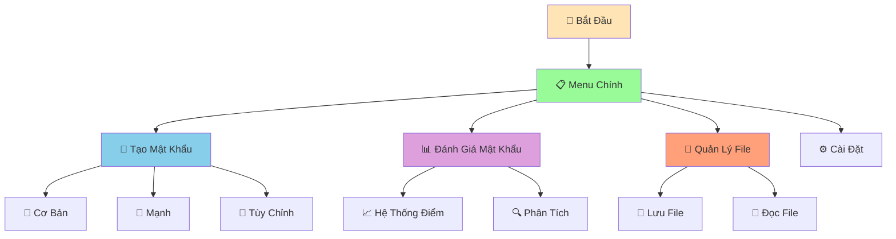

# 🔐 Password Generator - Tạo Mật Khẩu An Toàn

:::tip 🔐 Mục Tiêu Dự Án
Tạo một **ứng dụng tạo mật khẩu an toàn** với nhiều tùy chọn, đánh giá độ mạnh, và lưu trữ! Áp dụng tất cả kiến thức đã học: functions, error handling, string methods, và data structures.
:::

## 🎯 Tổng Quan Dự Án

Chúng ta sẽ tạo một ứng dụng tạo mật khẩu có thể:
- 🎲 **Nhiều loại mật khẩu**: Cơ bản, mạnh, tùy chỉnh
- 🔒 **Tùy chọn bảo mật**: Độ dài, ký tự đặc biệt, số
- 📊 **Đánh giá độ mạnh**: Hệ thống điểm thông minh
- 💾 **Lưu trữ**: Lưu mật khẩu vào file
- 🎨 **Giao diện đẹp**: Menu tương tác, màu sắc



## 🛠️ Bước 1: Tạo Các Functions Cơ Bản

### 📌 Import và Setup

```python
import random
import string
import json
import os
from datetime import datetime

class PasswordGenerator:
    def __init__(self):
        self.ky_tu_thuong = string.ascii_lowercase
        self.ky_tu_hoa = string.ascii_uppercase
        self.ky_tu_so = string.digits
        self.ky_tu_dac_biet = "!@#$%^&*()_+-=[]{}|;:,.<>?"
        self.lich_su_mat_khau = []
        self.thu_muc_luu = "passwords"
        self.tao_thu_muc()
    
    def tao_thu_muc(self):
        """Tạo thư mục lưu trữ"""
        try:
            if not os.path.exists(self.thu_muc_luu):
                os.makedirs(self.thu_muc_luu)
                print(f"✅ Đã tạo thư mục: {self.thu_muc_luu}")
        except Exception as e:
            print(f"❌ Lỗi tạo thư mục: {e}")
    
    def print_header(self):
        """In header đẹp mắt"""
        print("=" * 60)
        print("🔐 PASSWORD GENERATOR - TẠO MẬT KHẨU AN TOÀN 🔐")
        print("=" * 60)
        print("🛡️  Bảo vệ tài khoản của bạn với mật khẩu mạnh!")
        print("=" * 60)
    
    def print_separator(self):
        """In dòng phân cách"""
        print("-" * 60)
```

### 🎲 Functions Tạo Mật Khẩu

```python
    def tao_mat_khau_co_ban(self, do_dai=8):
        """Tạo mật khẩu cơ bản"""
        try:
            # Chỉ sử dụng chữ thường và số
            ky_tu_hop_le = self.ky_tu_thuong + self.ky_tu_so
            mat_khau = [random.choice(ky_tu_hop_le) for _ in range(do_dai)]
            random.shuffle(mat_khau)
            return ''.join(mat_khau)
        except Exception as e:
            print(f"❌ Lỗi tạo mật khẩu cơ bản: {e}")
            return None
    
    def tao_mat_khau_manh(self, do_dai=12):
        """Tạo mật khẩu mạnh"""
        try:
            # Đảm bảo có ít nhất 1 ký tự từ mỗi loại
            mat_khau = [
                random.choice(self.ky_tu_thuong),
                random.choice(self.ky_tu_hoa),
                random.choice(self.ky_tu_so),
                random.choice(self.ky_tu_dac_biet)
            ]
            
            # Thêm ký tự ngẫu nhiên
            ky_tu_tat_ca = (self.ky_tu_thuong + self.ky_tu_hoa + 
                           self.ky_tu_so + self.ky_tu_dac_biet)
            mat_khau.extend([random.choice(ky_tu_tat_ca) 
                           for _ in range(do_dai - 4)])
            
            # Xáo trộn
            random.shuffle(mat_khau)
            return ''.join(mat_khau)
        except Exception as e:
            print(f"❌ Lỗi tạo mật khẩu mạnh: {e}")
            return None
    
    def tao_mat_khau_tuy_chinh(self, do_dai, co_chu_thuong=True, 
                               co_chu_hoa=True, co_so=True, co_ky_tu_dac_biet=True):
        """Tạo mật khẩu tùy chỉnh"""
        try:
            ky_tu_hop_le = ""
            
            if co_chu_thuong:
                ky_tu_hop_le += self.ky_tu_thuong
            if co_chu_hoa:
                ky_tu_hop_le += self.ky_tu_hoa
            if co_so:
                ky_tu_hop_le += self.ky_tu_so
            if co_ky_tu_dac_biet:
                ky_tu_hop_le += self.ky_tu_dac_biet
            
            if not ky_tu_hop_le:
                print("❌ Phải chọn ít nhất một loại ký tự!")
                return None
            
            mat_khau = [random.choice(ky_tu_hop_le) for _ in range(do_dai)]
            random.shuffle(mat_khau)
            return ''.join(mat_khau)
        except Exception as e:
            print(f"❌ Lỗi tạo mật khẩu tùy chỉnh: {e}")
            return None
    
    def tao_mat_khau_tu_tu(self, tu_goc):
        """Tạo mật khẩu từ từ gốc"""
        try:
            mat_khau = []
            
            # Biến đổi từ gốc
            for ky_tu in tu_goc:
                if ky_tu.isalpha():
                    if ky_tu.islower():
                        mat_khau.append(ky_tu.upper())
                    else:
                        mat_khau.append(ky_tu.lower())
                else:
                    mat_khau.append(ky_tu)
            
            # Thêm số và ký tự đặc biệt
            mat_khau.extend([random.choice(self.ky_tu_so) for _ in range(2)])
            mat_khau.extend([random.choice(self.ky_tu_dac_biet) for _ in range(2)])
            
            # Xáo trộn
            random.shuffle(mat_khau)
            return ''.join(mat_khau)
        except Exception as e:
            print(f"❌ Lỗi tạo mật khẩu từ từ: {e}")
            return None
```

## 🎪 Bước 2: Hệ Thống Đánh Giá Mật Khẩu

```python
    def danh_gia_mat_khau(self, mat_khau):
        """Đánh giá độ mạnh của mật khẩu"""
        try:
            diem = 0
            chi_tiet = []
            
            # Độ dài
            if len(mat_khau) >= 12:
                diem += 3
                chi_tiet.append("✅ Độ dài tốt (≥12)")
            elif len(mat_khau) >= 8:
                diem += 2
                chi_tiet.append("✅ Độ dài trung bình (≥8)")
            else:
                diem += 1
                chi_tiet.append("⚠️  Độ dài ngắn (<8)")
            
            # Chữ thường
            if any(c.islower() for c in mat_khau):
                diem += 1
                chi_tiet.append("✅ Có chữ thường")
            else:
                chi_tiet.append("❌ Thiếu chữ thường")
            
            # Chữ hoa
            if any(c.isupper() for c in mat_khau):
                diem += 1
                chi_tiet.append("✅ Có chữ hoa")
            else:
                chi_tiet.append("❌ Thiếu chữ hoa")
            
            # Số
            if any(c.isdigit() for c in mat_khau):
                diem += 1
                chi_tiet.append("✅ Có số")
            else:
                chi_tiet.append("❌ Thiếu số")
            
            # Ký tự đặc biệt
            if any(c in self.ky_tu_dac_biet for c in mat_khau):
                diem += 2
                chi_tiet.append("✅ Có ký tự đặc biệt")
            else:
                chi_tiet.append("❌ Thiếu ký tự đặc biệt")
            
            # Đánh giá tổng thể
            if diem >= 8:
                xep_loai = "Rất mạnh"
                mau_sac = "🟢"
            elif diem >= 6:
                xep_loai = "Mạnh"
                mau_sac = "🟡"
            elif diem >= 4:
                xep_loai = "Trung bình"
                mau_sac = "🟠"
            else:
                xep_loai = "Yếu"
                mau_sac = "🔴"
            
            return {
                "diem": diem,
                "xep_loai": xep_loai,
                "mau_sac": mau_sac,
                "chi_tiet": chi_tiet
            }
        except Exception as e:
            print(f"❌ Lỗi đánh giá mật khẩu: {e}")
            return None
    
    def hien_thi_danh_gia(self, mat_khau, danh_gia):
        """Hiển thị đánh giá mật khẩu"""
        try:
            print(f"\n📊 ĐÁNH GIÁ MẬT KHẨU")
            print("=" * 40)
            print(f"🔐 Mật khẩu: {mat_khau}")
            print(f"{danh_gia['mau_sac']} Xếp loại: {danh_gia['xep_loai']}")
            print(f"📈 Điểm: {danh_gia['diem']}/8")
            
            print(f"\n📋 CHI TIẾT:")
            for chi_tiet in danh_gia['chi_tiet']:
                print(f"   {chi_tiet}")
            
            # Gợi ý cải thiện
            if danh_gia['diem'] < 8:
                print(f"\n💡 GỢI Ý CẢI THIỆN:")
                if len(mat_khau) < 12:
                    print("   - Tăng độ dài mật khẩu (≥12 ký tự)")
                if not any(c.islower() for c in mat_khau):
                    print("   - Thêm chữ thường")
                if not any(c.isupper() for c in mat_khau):
                    print("   - Thêm chữ hoa")
                if not any(c.isdigit() for c in mat_khau):
                    print("   - Thêm số")
                if not any(c in self.ky_tu_dac_biet for c in mat_khau):
                    print("   - Thêm ký tự đặc biệt")
        except Exception as e:
            print(f"❌ Lỗi hiển thị đánh giá: {e}")
```

## 🎯 Bước 3: Hệ Thống Lưu Trữ

```python
    def luu_mat_khau(self, mat_khau, ten_tai_khoan="", ghi_chu=""):
        """Lưu mật khẩu vào lịch sử"""
        try:
            thong_tin = {
                "mat_khau": mat_khau,
                "ten_tai_khoan": ten_tai_khoan,
                "ghi_chu": ghi_chu,
                "thoi_gian": datetime.now().strftime("%Y-%m-%d %H:%M:%S"),
                "danh_gia": self.danh_gia_mat_khau(mat_khau)
            }
            
            self.lich_su_mat_khau.append(thong_tin)
            print(f"✅ Đã lưu mật khẩu vào lịch sử")
            return True
        except Exception as e:
            print(f"❌ Lỗi lưu mật khẩu: {e}")
            return False
    
    def luu_vao_file(self, ten_file="passwords.json"):
        """Lưu lịch sử mật khẩu vào file"""
        try:
            duong_dan = os.path.join(self.thu_muc_luu, ten_file)
            with open(duong_dan, 'w', encoding='utf-8') as f:
                json.dump(self.lich_su_mat_khau, f, ensure_ascii=False, indent=2)
            print(f"✅ Đã lưu {len(self.lich_su_mat_khau)} mật khẩu vào {ten_file}")
            return True
        except Exception as e:
            print(f"❌ Lỗi lưu file: {e}")
            return False
    
    def doc_tu_file(self, ten_file="passwords.json"):
        """Đọc lịch sử mật khẩu từ file"""
        try:
            duong_dan = os.path.join(self.thu_muc_luu, ten_file)
            if os.path.exists(duong_dan):
                with open(duong_dan, 'r', encoding='utf-8') as f:
                    self.lich_su_mat_khau = json.load(f)
                print(f"✅ Đã đọc {len(self.lich_su_mat_khau)} mật khẩu từ {ten_file}")
                return True
            else:
                print(f"⚠️  File {ten_file} không tồn tại")
                return False
        except Exception as e:
            print(f"❌ Lỗi đọc file: {e}")
            return False
    
    def hien_thi_lich_su(self):
        """Hiển thị lịch sử mật khẩu"""
        try:
            if not self.lich_su_mat_khau:
                print("📋 Chưa có mật khẩu nào trong lịch sử")
                return
            
            print(f"\n📋 LỊCH SỬ MẬT KHẨU ({len(self.lich_su_mat_khau)} mật khẩu)")
            print("=" * 60)
            
            for i, thong_tin in enumerate(self.lich_su_mat_khau, 1):
                print(f"{i:2d}. {thong_tin['mat_khau']}")
                if thong_tin['ten_tai_khoan']:
                    print(f"    Tài khoản: {thong_tin['ten_tai_khoan']}")
                if thong_tin['ghi_chu']:
                    print(f"    Ghi chú: {thong_tin['ghi_chu']}")
                print(f"    Thời gian: {thong_tin['thoi_gian']}")
                print(f"    Xếp loại: {thong_tin['danh_gia']['xep_loai']}")
                print("-" * 40)
        except Exception as e:
            print(f"❌ Lỗi hiển thị lịch sử: {e}")
```

## 🚀 Bước 4: Menu Chính

```python
    def menu_chinh(self):
        """Hiển thị menu chính"""
        self.print_header()
        print("\n📋 MENU CHÍNH")
        print("1. 🔐 Tạo mật khẩu cơ bản")
        print("2. 💪 Tạo mật khẩu mạnh")
        print("3. 🎯 Tạo mật khẩu tùy chỉnh")
        print("4. 📝 Tạo mật khẩu từ từ gốc")
        print("5. 📊 Đánh giá mật khẩu")
        print("6. 📋 Xem lịch sử")
        print("7. 💾 Lưu vào file")
        print("8. 📖 Đọc từ file")
        print("9. ⚙️  Cài đặt")
        print("0. 👋 Thoát")
        self.print_separator()
    
    def chay_ung_dung(self):
        """Chạy ứng dụng chính"""
        # Đọc lịch sử từ file
        self.doc_tu_file()
        
        while True:
            try:
                self.menu_chinh()
                lua_chon = input("👉 Chọn chức năng (0-9): ").strip()
                
                if lua_chon == "0":
                    print("👋 Cảm ơn bạn đã sử dụng!")
                    break
                elif lua_chon == "1":
                    self.tao_mat_khau_co_ban_menu()
                elif lua_chon == "2":
                    self.tao_mat_khau_manh_menu()
                elif lua_chon == "3":
                    self.tao_mat_khau_tuy_chinh_menu()
                elif lua_chon == "4":
                    self.tao_mat_khau_tu_tu_menu()
                elif lua_chon == "5":
                    self.danh_gia_mat_khau_menu()
                elif lua_chon == "6":
                    self.hien_thi_lich_su()
                elif lua_chon == "7":
                    self.luu_vao_file()
                elif lua_chon == "8":
                    self.doc_tu_file()
                elif lua_chon == "9":
                    self.cai_dat_menu()
                else:
                    print("❌ Lựa chọn không hợp lệ!")
                
                input("\nNhấn Enter để tiếp tục...")
                
            except KeyboardInterrupt:
                print("\n👋 Tạm biệt!")
                break
            except Exception as e:
                print(f"❌ Lỗi không mong muốn: {e}")
                input("Nhấn Enter để tiếp tục...")
    
    def tao_mat_khau_co_ban_menu(self):
        """Menu tạo mật khẩu cơ bản"""
        try:
            print("\n🔐 TẠO MẬT KHẨU CƠ BẢN")
            self.print_separator()
            
            do_dai = int(input("Nhập độ dài mật khẩu (mặc định 8): ") or "8")
            
            if do_dai < 4:
                print("❌ Độ dài mật khẩu phải ít nhất 4 ký tự!")
                return
            
            mat_khau = self.tao_mat_khau_co_ban(do_dai)
            if mat_khau:
                print(f"🔐 Mật khẩu cơ bản: {mat_khau}")
                
                # Đánh giá
                danh_gia = self.danh_gia_mat_khau(mat_khau)
                self.hien_thi_danh_gia(mat_khau, danh_gia)
                
                # Lưu vào lịch sử
                luu = input("\n💾 Lưu vào lịch sử? (y/n): ").lower()
                if luu in ['y', 'yes', 'có', 'c']:
                    ten_tk = input("Tên tài khoản (tùy chọn): ").strip()
                    ghi_chu = input("Ghi chú (tùy chọn): ").strip()
                    self.luu_mat_khau(mat_khau, ten_tk, ghi_chu)
        except ValueError:
            print("❌ Vui lòng nhập số hợp lệ!")
        except Exception as e:
            print(f"❌ Lỗi: {e}")
    
    def tao_mat_khau_manh_menu(self):
        """Menu tạo mật khẩu mạnh"""
        try:
            print("\n💪 TẠO MẬT KHẨU MẠNH")
            self.print_separator()
            
            do_dai = int(input("Nhập độ dài mật khẩu (mặc định 12): ") or "12")
            
            if do_dai < 8:
                print("❌ Mật khẩu mạnh phải ít nhất 8 ký tự!")
                return
            
            mat_khau = self.tao_mat_khau_manh(do_dai)
            if mat_khau:
                print(f"💪 Mật khẩu mạnh: {mat_khau}")
                
                # Đánh giá
                danh_gia = self.danh_gia_mat_khau(mat_khau)
                self.hien_thi_danh_gia(mat_khau, danh_gia)
                
                # Lưu vào lịch sử
                luu = input("\n💾 Lưu vào lịch sử? (y/n): ").lower()
                if luu in ['y', 'yes', 'có', 'c']:
                    ten_tk = input("Tên tài khoản (tùy chọn): ").strip()
                    ghi_chu = input("Ghi chú (tùy chọn): ").strip()
                    self.luu_mat_khau(mat_khau, ten_tk, ghi_chu)
        except ValueError:
            print("❌ Vui lòng nhập số hợp lệ!")
        except Exception as e:
            print(f"❌ Lỗi: {e}")
    
    def tao_mat_khau_tuy_chinh_menu(self):
        """Menu tạo mật khẩu tùy chỉnh"""
        try:
            print("\n🎯 TẠO MẬT KHẨU TÙY CHỈNH")
            self.print_separator()
            
            do_dai = int(input("Nhập độ dài mật khẩu: "))
            
            if do_dai < 4:
                print("❌ Độ dài mật khẩu phải ít nhất 4 ký tự!")
                return
            
            print("\nChọn loại ký tự:")
            co_chu_thuong = input("Chữ thường (a-z)? (y/n): ").lower() in ['y', 'yes', 'có', 'c']
            co_chu_hoa = input("Chữ hoa (A-Z)? (y/n): ").lower() in ['y', 'yes', 'có', 'c']
            co_so = input("Số (0-9)? (y/n): ").lower() in ['y', 'yes', 'có', 'c']
            co_ky_tu_dac_biet = input("Ký tự đặc biệt (!@#$...)? (y/n): ").lower() in ['y', 'yes', 'có', 'c']
            
            mat_khau = self.tao_mat_khau_tuy_chinh(do_dai, co_chu_thuong, co_chu_hoa, co_so, co_ky_tu_dac_biet)
            if mat_khau:
                print(f"🎯 Mật khẩu tùy chỉnh: {mat_khau}")
                
                # Đánh giá
                danh_gia = self.danh_gia_mat_khau(mat_khau)
                self.hien_thi_danh_gia(mat_khau, danh_gia)
                
                # Lưu vào lịch sử
                luu = input("\n💾 Lưu vào lịch sử? (y/n): ").lower()
                if luu in ['y', 'yes', 'có', 'c']:
                    ten_tk = input("Tên tài khoản (tùy chọn): ").strip()
                    ghi_chu = input("Ghi chú (tùy chọn): ").strip()
                    self.luu_mat_khau(mat_khau, ten_tk, ghi_chu)
        except ValueError:
            print("❌ Vui lòng nhập số hợp lệ!")
        except Exception as e:
            print(f"❌ Lỗi: {e}")
    
    def tao_mat_khau_tu_tu_menu(self):
        """Menu tạo mật khẩu từ từ gốc"""
        try:
            print("\n📝 TẠO MẬT KHẨU TỪ TỪ GỐC")
            self.print_separator()
            
            tu_goc = input("Nhập từ gốc: ").strip()
            
            if not tu_goc:
                print("❌ Vui lòng nhập từ gốc!")
                return
            
            mat_khau = self.tao_mat_khau_tu_tu(tu_goc)
            if mat_khau:
                print(f"📝 Mật khẩu từ '{tu_goc}': {mat_khau}")
                
                # Đánh giá
                danh_gia = self.danh_gia_mat_khau(mat_khau)
                self.hien_thi_danh_gia(mat_khau, danh_gia)
                
                # Lưu vào lịch sử
                luu = input("\n💾 Lưu vào lịch sử? (y/n): ").lower()
                if luu in ['y', 'yes', 'có', 'c']:
                    ten_tk = input("Tên tài khoản (tùy chọn): ").strip()
                    ghi_chu = input("Ghi chú (tùy chọn): ").strip()
                    self.luu_mat_khau(mat_khau, ten_tk, ghi_chu)
        except Exception as e:
            print(f"❌ Lỗi: {e}")
    
    def danh_gia_mat_khau_menu(self):
        """Menu đánh giá mật khẩu"""
        try:
            print("\n📊 ĐÁNH GIÁ MẬT KHẨU")
            self.print_separator()
            
            mat_khau = input("Nhập mật khẩu cần đánh giá: ").strip()
            
            if not mat_khau:
                print("❌ Vui lòng nhập mật khẩu!")
                return
            
            danh_gia = self.danh_gia_mat_khau(mat_khau)
            if danh_gia:
                self.hien_thi_danh_gia(mat_khau, danh_gia)
        except Exception as e:
            print(f"❌ Lỗi: {e}")
    
    def cai_dat_menu(self):
        """Menu cài đặt"""
        try:
            print("\n⚙️  CÀI ĐẶT")
            self.print_separator()
            print(f"📁 Thư mục lưu trữ: {self.thu_muc_luu}")
            print(f"📊 Số mật khẩu trong lịch sử: {len(self.lich_su_mat_khau)}")
            print(f"🔤 Ký tự đặc biệt: {self.ky_tu_dac_biet}")
            
            # Tùy chọn thay đổi thư mục
            thay_doi = input("\nThay đổi thư mục lưu trữ? (y/n): ").lower()
            if thay_doi in ['y', 'yes', 'có', 'c']:
                thu_muc_moi = input("Nhập thư mục mới: ").strip()
                if thu_muc_moi:
                    self.thu_muc_luu = thu_muc_moi
                    self.tao_thu_muc()
                    print(f"✅ Đã thay đổi thư mục thành: {thu_muc_moi}")
        except Exception as e:
            print(f"❌ Lỗi: {e}")
```

## 🎯 Chương Trình Hoàn Chỉnh

```python
# 🔐 PASSWORD GENERATOR HOÀN CHỈNH
# Tác giả: Học sinh Python
# Ngày: 2024

def main():
    """Hàm chính của chương trình"""
    try:
        # Tạo và chạy ứng dụng
        app = PasswordGenerator()
        app.chay_ung_dung()
        
    except KeyboardInterrupt:
        print("\n\n👋 Chương trình bị dừng bởi người dùng!")
    except Exception as e:
        print(f"\n❌ Lỗi không mong muốn: {e}")
    finally:
        print("🔚 Chương trình kết thúc!")

# Chạy chương trình
if __name__ == "__main__":
    main()
```

## 🎯 Bài Tập Mở Rộng

### 🥇 Bài Tập 1: Thêm Tính Năng Mới

```python
# TODO: Thêm các tính năng sau vào password generator
def tao_mat_khau_phan_biom(self, thong_tin_ca_nhan):
    """Tạo mật khẩu dựa trên thông tin cá nhân"""
    # Sử dụng thông tin cá nhân để tạo mật khẩu dễ nhớ
    pass

def kiem_tra_mat_khau_bi_hack(self, mat_khau):
    """Kiểm tra mật khẩu có bị hack không"""
    # Kiểm tra với danh sách mật khẩu phổ biến
    pass

def tao_mat_khau_2fa(self):
    """Tạo mã 2FA"""
    # Tạo mã xác thực 2 yếu tố
    pass

def ma_hoa_mat_khau(self, mat_khau, khoa):
    """Mã hóa mật khẩu"""
    # Mã hóa mật khẩu với khóa
    pass
```

### 🥈 Bài Tập 2: Giao Diện Web

```python
# TODO: Tạo giao diện web với Flask
from flask import Flask, render_template, request, jsonify

app = Flask(__name__)

@app.route('/')
def index():
    return render_template('index.html')

@app.route('/generate', methods=['POST'])
def generate_password():
    data = request.json
    # Tạo mật khẩu dựa trên yêu cầu
    return jsonify({'password': 'generated_password'})

@app.route('/evaluate', methods=['POST'])
def evaluate_password():
    data = request.json
    # Đánh giá mật khẩu
    return jsonify({'score': 8, 'rating': 'Very Strong'})

if __name__ == '__main__':
    app.run(debug=True)
```

## 🎊 Tóm Tắt Dự Án

Trong dự án này, bạn đã học được:

✅ **Áp dụng kiến thức tổng hợp** - Functions, classes, error handling  
✅ **Tạo ứng dụng thực tế** - Password generator hữu ích  
✅ **Hệ thống đánh giá thông minh** - Scoring, analysis, suggestions  
✅ **Lưu trữ dữ liệu** - JSON, file management  
✅ **Giao diện tương tác** - Menu, user input, validation  
✅ **Xử lý lỗi chuyên nghiệp** - Try/except, error messages  

## 🚀 Bước Tiếp Theo

Tuyệt vời! Bạn đã hoàn thành **dự án thứ ba** với nhiều tính năng thực tế! Tiếp theo, chúng ta sẽ tạo [Todo List](/python/projects/todo-list) - một ứng dụng quản lý công việc hoàn chỉnh!

:::tip 🎯 Thử Thách Mở Rộng
Hãy thử thêm các tính năng sau vào password generator:
1. **Mã hóa mật khẩu**: Sử dụng cryptography library
2. **Kiểm tra độ mạnh**: So sánh với database mật khẩu phổ biến
3. **Giao diện web**: Flask hoặc Streamlit
4. **Mobile app**: Kivy hoặc BeeWare
5. **Cloud sync**: Lưu trữ trên cloud
:::

---

*🔗 **Dự án tiếp theo**: [Todo List - Ứng Dụng Quản Lý Công Việc](/python/projects/todo-list)*
