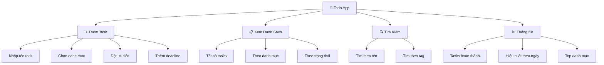

# 📝 Ứng Dụng Todo List - Quản Lý Công Việc Thông Minh

> **Mục tiêu**: Xây dựng ứng dụng quản lý công việc hoàn chỉnh với giao diện đẹp và tính năng đầy đủ! 🎯

## 🎮 Giới Thiệu Dự Án

**Todo List App** là ứng dụng giúp bạn:
- ✅ **Quản lý công việc** hàng ngày
- 🗂️ **Phân loại theo danh mục** 
- ⭐ **Đặt mức độ ưu tiên**
- 📅 **Theo dõi deadline**
- 📊 **Thống kê hiệu suất**



## 📋 Tính Năng Chính

### ✨ **Phiên Bản 1.0 - Cơ Bản**
- [x] Thêm, sửa, xóa task
- [x] Đánh dấu hoàn thành
- [x] Lưu trữ persistent với JSON
- [x] Giao diện console đẹp mắt

### 🚀 **Phiên Bản 2.0 - Nâng Cao**  
- [x] Phân loại theo danh mục
- [x] Mức độ ưu tiên (High, Medium, Low)
- [x] Deadline và nhắc nhở
- [x] Tìm kiếm và filter

### 💎 **Phiên Bản 3.0 - Pro**
- [x] Thống kê chi tiết
- [x] Export/Import dữ liệu
- [x] Backup tự động
- [x] Multi-user support

## 🏗️ Kiến Trúc Ứng Dụng

```python
import json
import os
from datetime import datetime, date
from enum import Enum
from typing import List, Dict, Optional
import uuid

class Priority(Enum):
    """Enum cho mức độ ưu tiên"""
    LOW = "Thấp"
    MEDIUM = "Trung bình" 
    HIGH = "Cao"
    URGENT = "Khẩn cấp"

class TaskStatus(Enum):
    """Enum cho trạng thái task"""
    PENDING = "Đang chờ"
    IN_PROGRESS = "Đang làm"
    COMPLETED = "Hoàn thành"
    CANCELLED = "Đã hủy"

class Task:
    """Class đại diện cho một task"""
    
    def __init__(self, title: str, description: str = "", 
                 category: str = "General", priority: Priority = Priority.MEDIUM,
                 deadline: Optional[date] = None):
        self.id = str(uuid.uuid4())
        self.title = title
        self.description = description
        self.category = category
        self.priority = priority
        self.status = TaskStatus.PENDING
        self.created_at = datetime.now()
        self.updated_at = datetime.now()
        self.completed_at = None
        self.deadline = deadline
        self.tags = []
    
    def to_dict(self) -> Dict:
        """Chuyển đổi task thành dictionary để lưu JSON"""
        return {
            'id': self.id,
            'title': self.title,
            'description': self.description,
            'category': self.category,
            'priority': self.priority.value,
            'status': self.status.value,
            'created_at': self.created_at.isoformat(),
            'updated_at': self.updated_at.isoformat(),
            'completed_at': self.completed_at.isoformat() if self.completed_at else None,
            'deadline': self.deadline.isoformat() if self.deadline else None,
            'tags': self.tags
        }
    
    @classmethod
    def from_dict(cls, data: Dict) -> 'Task':
        """Tạo task từ dictionary"""
        task = cls(data['title'], data['description'], data['category'])
        task.id = data['id']
        
        # Chuyển đổi enum
        for priority in Priority:
            if priority.value == data['priority']:
                task.priority = priority
                break
        
        for status in TaskStatus:
            if status.value == data['status']:
                task.status = status
                break
        
        # Chuyển đổi datetime
        task.created_at = datetime.fromisoformat(data['created_at'])
        task.updated_at = datetime.fromisoformat(data['updated_at'])
        
        if data['completed_at']:
            task.completed_at = datetime.fromisoformat(data['completed_at'])
        
        if data['deadline']:
            task.deadline = date.fromisoformat(data['deadline'])
        
        task.tags = data.get('tags', [])
        
        return task
    
    def mark_completed(self):
        """Đánh dấu task hoàn thành"""
        self.status = TaskStatus.COMPLETED
        self.completed_at = datetime.now()
        self.updated_at = datetime.now()
    
    def mark_in_progress(self):
        """Đánh dấu task đang thực hiện"""
        self.status = TaskStatus.IN_PROGRESS
        self.updated_at = datetime.now()
    
    def add_tag(self, tag: str):
        """Thêm tag cho task"""
        if tag not in self.tags:
            self.tags.append(tag)
            self.updated_at = datetime.now()
    
    def remove_tag(self, tag: str):
        """Xóa tag khỏi task"""
        if tag in self.tags:
            self.tags.remove(tag)
            self.updated_at = datetime.now()
    
    def is_overdue(self) -> bool:
        """Kiểm tra task có quá hạn không"""
        if self.deadline and self.status != TaskStatus.COMPLETED:
            return date.today() > self.deadline
        return False
    
    def days_until_deadline(self) -> Optional[int]:
        """Số ngày còn lại đến deadline"""
        if self.deadline:
            delta = self.deadline - date.today()
            return delta.days
        return None
    
    def __str__(self) -> str:
        """String representation của task"""
        status_emoji = {
            TaskStatus.PENDING: "⭕",
            TaskStatus.IN_PROGRESS: "🔄", 
            TaskStatus.COMPLETED: "✅",
            TaskStatus.CANCELLED: "❌"
        }
        
        priority_emoji = {
            Priority.LOW: "🟢",
            Priority.MEDIUM: "🟡",
            Priority.HIGH: "🟠", 
            Priority.URGENT: "🔴"
        }
        
        result = f"{status_emoji[self.status]} {priority_emoji[self.priority]} {self.title}"
        
        if self.deadline:
            days_left = self.days_until_deadline()
            if days_left is not None:
                if days_left < 0:
                    result += f" 📅 (Quá hạn {abs(days_left)} ngày)"
                elif days_left == 0:
                    result += f" 📅 (Hôm nay)"
                else:
                    result += f" 📅 ({days_left} ngày nữa)"
        
        if self.tags:
            result += f" 🏷️ {', '.join(self.tags)}"
            
        return result

print("✅ Task class đã được định nghĩa!")
```

## 🗄️ Todo Manager - Quản Lý Dữ Liệu

```python
class TodoManager:
    """Class quản lý toàn bộ todo list"""
    
    def __init__(self, data_file: str = "behitek_todo.json"):
        self.data_file = data_file
        self.tasks: Dict[str, Task] = {}
        self.categories = set()
        self.load_data()
    
    def load_data(self):
        """Tải dữ liệu từ file JSON"""
        if os.path.exists(self.data_file):
            try:
                with open(self.data_file, 'r', encoding='utf-8') as f:
                    data = json.load(f)
                
                # Load tasks
                for task_data in data.get('tasks', []):
                    task = Task.from_dict(task_data)
                    self.tasks[task.id] = task
                    self.categories.add(task.category)
                
                print(f"📂 Đã tải {len(self.tasks)} tasks từ {self.data_file}")
                
            except Exception as e:
                print(f"❌ Lỗi khi tải dữ liệu: {e}")
        else:
            print(f"📝 Tạo file dữ liệu mới: {self.data_file}")
            self.save_data()
    
    def save_data(self):
        """Lưu dữ liệu vào file JSON"""
        try:
            data = {
                'tasks': [task.to_dict() for task in self.tasks.values()],
                'metadata': {
                    'total_tasks': len(self.tasks),
                    'categories': list(self.categories),
                    'last_updated': datetime.now().isoformat(),
                    'app_version': '1.0.0'
                }
            }
            
            with open(self.data_file, 'w', encoding='utf-8') as f:
                json.dump(data, f, ensure_ascii=False, indent=2)
            
            print(f"💾 Đã lưu {len(self.tasks)} tasks vào {self.data_file}")
            
        except Exception as e:
            print(f"❌ Lỗi khi lưu dữ liệu: {e}")
    
    def add_task(self, title: str, description: str = "", category: str = "General",
                 priority: Priority = Priority.MEDIUM, deadline: Optional[date] = None) -> Task:
        """Thêm task mới"""
        task = Task(title, description, category, priority, deadline)
        self.tasks[task.id] = task
        self.categories.add(category)
        self.save_data()
        
        print(f"✅ Đã thêm task: {task.title}")
        return task
    
    def get_task(self, task_id: str) -> Optional[Task]:
        """Lấy task theo ID"""
        return self.tasks.get(task_id)
    
    def update_task(self, task_id: str, **kwargs) -> bool:
        """Cập nhật task"""
        task = self.get_task(task_id)
        if not task:
            print(f"❌ Không tìm thấy task với ID: {task_id}")
            return False
        
        # Cập nhật các thuộc tính
        for key, value in kwargs.items():
            if hasattr(task, key):
                setattr(task, key, value)
        
        task.updated_at = datetime.now()
        self.save_data()
        
        print(f"✅ Đã cập nhật task: {task.title}")
        return True
    
    def delete_task(self, task_id: str) -> bool:
        """Xóa task"""
        if task_id in self.tasks:
            task = self.tasks.pop(task_id)
            self.save_data()
            print(f"🗑️ Đã xóa task: {task.title}")
            return True
        else:
            print(f"❌ Không tìm thấy task với ID: {task_id}")
            return False
    
    def complete_task(self, task_id: str) -> bool:
        """Đánh dấu task hoàn thành"""
        task = self.get_task(task_id)
        if task:
            task.mark_completed()
            self.save_data()
            print(f"🎉 Hoàn thành task: {task.title}")
            return True
        return False
    
    def get_tasks_by_status(self, status: TaskStatus) -> List[Task]:
        """Lấy tasks theo trạng thái"""
        return [task for task in self.tasks.values() if task.status == status]
    
    def get_tasks_by_category(self, category: str) -> List[Task]:
        """Lấy tasks theo danh mục"""
        return [task for task in self.tasks.values() if task.category == category]
    
    def get_tasks_by_priority(self, priority: Priority) -> List[Task]:
        """Lấy tasks theo mức ưu tiên"""
        return [task for task in self.tasks.values() if task.priority == priority]
    
    def search_tasks(self, query: str) -> List[Task]:
        """Tìm kiếm tasks"""
        query_lower = query.lower()
        results = []
        
        for task in self.tasks.values():
            if (query_lower in task.title.lower() or
                query_lower in task.description.lower() or
                query_lower in task.category.lower() or
                any(query_lower in tag.lower() for tag in task.tags)):
                results.append(task)
        
        return results
    
    def get_overdue_tasks(self) -> List[Task]:
        """Lấy tasks quá hạn"""
        return [task for task in self.tasks.values() if task.is_overdue()]
    
    def get_today_tasks(self) -> List[Task]:
        """Lấy tasks hạn chót hôm nay"""
        today = date.today()
        return [task for task in self.tasks.values() 
                if task.deadline == today and task.status != TaskStatus.COMPLETED]
    
    def get_statistics(self) -> Dict:
        """Lấy thống kê tổng quan"""
        total = len(self.tasks)
        completed = len(self.get_tasks_by_status(TaskStatus.COMPLETED))
        pending = len(self.get_tasks_by_status(TaskStatus.PENDING))
        in_progress = len(self.get_tasks_by_status(TaskStatus.IN_PROGRESS))
        overdue = len(self.get_overdue_tasks())
        
        # Thống kê theo danh mục
        category_stats = {}
        for category in self.categories:
            cat_tasks = self.get_tasks_by_category(category)
            category_stats[category] = {
                'total': len(cat_tasks),
                'completed': len([t for t in cat_tasks if t.status == TaskStatus.COMPLETED])
            }
        
        # Thống kê theo mức ưu tiên
        priority_stats = {}
        for priority in Priority:
            pri_tasks = self.get_tasks_by_priority(priority)
            priority_stats[priority.value] = len(pri_tasks)
        
        return {
            'overview': {
                'total': total,
                'completed': completed,
                'pending': pending,
                'in_progress': in_progress,
                'overdue': overdue,
                'completion_rate': (completed / total * 100) if total > 0 else 0
            },
            'by_category': category_stats,
            'by_priority': priority_stats
        }

print("✅ TodoManager class đã được định nghĩa!")
```

## 🎨 Giao Diện Console Đẹp Mắt

```python
import os
import sys
from datetime import datetime, date, timedelta

class TodoUI:
    """Class giao diện người dùng cho Todo App"""
    
    def __init__(self):
        self.manager = TodoManager()
        self.running = True
    
    def clear_screen(self):
        """Xóa màn hình console"""
        os.system('cls' if os.name == 'nt' else 'clear')
    
    def print_header(self, title: str):
        """In header đẹp mắt"""
        width = 60
        print("=" * width)
        print(f"🎯 {title:^{width-4}} 🎯")
        print("=" * width)
    
    def print_separator(self):
        """In dòng phân cách"""
        print("-" * 60)
    
    def show_main_menu(self):
        """Hiển thị menu chính"""
        self.clear_screen()
        self.print_header("BEHITEK TODO LIST APP")
        
        print("""
📋 MENU CHÍNH:

1️⃣  Xem tất cả tasks
2️⃣  Thêm task mới  
3️⃣  Tìm kiếm tasks
4️⃣  Quản lý tasks
5️⃣  Xem theo danh mục
6️⃣  Tasks hôm nay & quá hạn
7️⃣  Thống kê & báo cáo
8️⃣  Cài đặt
9️⃣  Thoát

""")
        
        # Hiển thị thống kê nhanh
        stats = self.manager.get_statistics()
        overview = stats['overview']
        
        print("📊 THỐNG KÊ NHANH:")
        print(f"   📝 Tổng tasks: {overview['total']}")
        print(f"   ✅ Hoàn thành: {overview['completed']}")
        print(f"   ⏳ Đang chờ: {overview['pending']}")
        print(f"   📊 Tỷ lệ hoàn thành: {overview['completion_rate']:.1f}%")
        
        overdue = len(self.manager.get_overdue_tasks())
        today = len(self.manager.get_today_tasks())
        
        if overdue > 0:
            print(f"   🚨 Quá hạn: {overdue}")
        if today > 0:
            print(f"   📅 Hạn hôm nay: {today}")
    
    def show_all_tasks(self):
        """Hiển thị tất cả tasks"""
        self.clear_screen()
        self.print_header("TẤT CẢ TASKS")
        
        if not self.manager.tasks:
            print("📭 Chưa có task nào. Hãy thêm task đầu tiên!")
            input("\nNhấn Enter để tiếp tục...")
            return
        
        # Sắp xếp tasks theo priority và deadline
        tasks = list(self.manager.tasks.values())
        
        # Sorting key: priority (urgent first) -> deadline -> created_at
        def sort_key(task):
            priority_order = {Priority.URGENT: 0, Priority.HIGH: 1, Priority.MEDIUM: 2, Priority.LOW: 3}
            return (
                0 if task.status == TaskStatus.COMPLETED else 1,  # Completed last
                priority_order[task.priority],
                task.deadline or date.max,
                task.created_at
            )
        
        tasks.sort(key=sort_key)
        
        # Nhóm theo trạng thái
        groups = {
            "🚨 KHẨN CẤP & QUÁ HẠN": [],
            "🔄 ĐANG LÀM": [],
            "⭕ ĐANG CHỜ": [],
            "✅ HOÀN THÀNH": []
        }
        
        for task in tasks:
            if task.status == TaskStatus.COMPLETED:
                groups["✅ HOÀN THÀNH"].append(task)
            elif task.priority == Priority.URGENT or task.is_overdue():
                groups["🚨 KHẨN CẤP & QUÁ HẠN"].append(task)
            elif task.status == TaskStatus.IN_PROGRESS:
                groups["🔄 ĐANG LÀM"].append(task)
            else:
                groups["⭕ ĐANG CHỜ"].append(task)
        
        # Hiển thị từng nhóm
        for group_name, group_tasks in groups.items():
            if group_tasks:
                print(f"\n{group_name}:")
                self.print_separator()
                
                for i, task in enumerate(group_tasks, 1):
                    print(f"{i:2d}. {task}")
                    if task.description:
                        print(f"     📝 {task.description}")
                    print(f"     📂 {task.category} | 🗓️ {task.created_at.strftime('%d/%m/%Y')}")
        
        print(f"\n📊 Tổng cộng: {len(tasks)} tasks")
        input("\nNhấn Enter để tiếp tục...")
    
    def add_new_task(self):
        """Thêm task mới"""
        self.clear_screen()
        self.print_header("THÊM TASK MỚI")
        
        try:
            # Nhập thông tin cơ bản
            title = input("📝 Tên task: ").strip()
            if not title:
                print("❌ Tên task không được để trống!")
                input("Nhấn Enter để tiếp tục...")
                return
            
            description = input("📄 Mô tả (tùy chọn): ").strip()
            
            # Chọn danh mục
            print("\n📂 Danh mục có sẵn:", list(self.manager.categories))
            category = input("📂 Danh mục (Enter = General): ").strip() or "General"
            
            # Chọn mức ưu tiên
            print("\n⭐ Mức độ ưu tiên:")
            print("1. Thấp 🟢")
            print("2. Trung bình 🟡") 
            print("3. Cao 🟠")
            print("4. Khẩn cấp 🔴")
            
            priority_choice = input("Chọn (1-4, Enter = 2): ").strip() or "2"
            priority_map = {
                "1": Priority.LOW,
                "2": Priority.MEDIUM, 
                "3": Priority.HIGH,
                "4": Priority.URGENT
            }
            priority = priority_map.get(priority_choice, Priority.MEDIUM)
            
            # Deadline
            deadline = None
            deadline_input = input("\n📅 Deadline (dd/mm/yyyy, Enter = không có): ").strip()
            if deadline_input:
                try:
                    deadline = datetime.strptime(deadline_input, "%d/%m/%Y").date()
                except ValueError:
                    print("⚠️ Format ngày không đúng, bỏ qua deadline")
            
            # Thêm task
            task = self.manager.add_task(title, description, category, priority, deadline)
            
            # Thêm tags
            tags_input = input("\n🏷️ Tags (cách nhau bởi dấu phẩy): ").strip()
            if tags_input:
                tags = [tag.strip() for tag in tags_input.split(',')]
                for tag in tags:
                    if tag:
                        task.add_tag(tag)
                self.manager.save_data()
            
            print(f"\n🎉 Đã thêm task thành công!")
            print(f"📋 {task}")
            
        except KeyboardInterrupt:
            print("\n❌ Hủy thêm task")
        except Exception as e:
            print(f"\n❌ Lỗi: {e}")
        
        input("\nNhấn Enter để tiếp tục...")
    
    def search_tasks(self):
        """Tìm kiếm tasks"""
        self.clear_screen()
        self.print_header("TÌM KIẾM TASKS")
        
        query = input("🔍 Nhập từ khóa tìm kiếm: ").strip()
        if not query:
            print("❌ Vui lòng nhập từ khóa!")
            input("Nhấn Enter để tiếp tục...")
            return
        
        results = self.manager.search_tasks(query)
        
        if results:
            print(f"\n🎯 Tìm thấy {len(results)} kết quả cho '{query}':")
            self.print_separator()
            
            for i, task in enumerate(results, 1):
                print(f"{i:2d}. {task}")
                if task.description:
                    print(f"     📝 {task.description}")
        else:
            print(f"\n❌ Không tìm thấy task nào chứa '{query}'")
        
        input("\nNhấn Enter để tiếp tục...")
    
    def manage_tasks(self):
        """Quản lý tasks (complete, edit, delete)"""
        self.clear_screen()
        self.print_header("QUẢN LÝ TASKS")
        
        if not self.manager.tasks:
            print("📭 Chưa có task nào!")
            input("Nhấn Enter để tiếp tục...")
            return
        
        # Hiển thị tasks với index
        tasks = list(self.manager.tasks.values())
        print("📋 DANH SÁCH TASKS:")
        for i, task in enumerate(tasks, 1):
            print(f"{i:2d}. {task}")
        
        try:
            choice = input(f"\nChọn task (1-{len(tasks)}): ").strip()
            if not choice.isdigit() or int(choice) < 1 or int(choice) > len(tasks):
                print("❌ Lựa chọn không hợp lệ!")
                input("Nhấn Enter để tiếp tục...")
                return
            
            task = tasks[int(choice) - 1]
            
            print(f"\n📋 Task được chọn: {task.title}")
            print("🛠️ Hành động:")
            print("1. Đánh dấu hoàn thành")
            print("2. Đang thực hiện")
            print("3. Chỉnh sửa")  
            print("4. Xóa")
            print("5. Thêm tag")
            print("6. Hủy")
            
            action = input("Chọn hành động (1-6): ").strip()
            
            if action == "1":
                self.manager.complete_task(task.id)
            elif action == "2":
                task.mark_in_progress()
                self.manager.save_data()
                print(f"🔄 Task '{task.title}' đang được thực hiện")
            elif action == "3":
                self.edit_task(task)
            elif action == "4":
                confirm = input(f"❓ Xác nhận xóa '{task.title}'? (y/N): ").lower()
                if confirm == 'y':
                    self.manager.delete_task(task.id)
                else:
                    print("❌ Hủy xóa")
            elif action == "5":
                tag = input("🏷️ Nhập tag mới: ").strip()
                if tag:
                    task.add_tag(tag)
                    self.manager.save_data()
                    print(f"✅ Đã thêm tag '{tag}'")
            elif action == "6":
                print("❌ Hủy")
            else:
                print("❌ Lựa chọn không hợp lệ!")
                
        except Exception as e:
            print(f"❌ Lỗi: {e}")
        
        input("\nNhấn Enter để tiếp tục...")
    
    def edit_task(self, task: Task):
        """Chỉnh sửa task"""
        print(f"\n✏️ CHỈNH SỬA TASK: {task.title}")
        print("(Nhấn Enter để giữ nguyên giá trị hiện tại)")
        
        # Edit title
        new_title = input(f"📝 Tên mới [{task.title}]: ").strip()
        if new_title:
            task.title = new_title
        
        # Edit description
        new_desc = input(f"📄 Mô tả mới [{task.description}]: ").strip()
        if new_desc:
            task.description = new_desc
        
        # Edit category
        new_category = input(f"📂 Danh mục mới [{task.category}]: ").strip()
        if new_category:
            task.category = new_category
        
        task.updated_at = datetime.now()
        self.manager.save_data()
        print("✅ Đã cập nhật task!")
    
    def show_statistics(self):
        """Hiển thị thống kê chi tiết"""
        self.clear_screen()
        self.print_header("THỐNG KÊ & BÁO CÁO")
        
        stats = self.manager.get_statistics()
        overview = stats['overview']
        
        print("📊 TỔNG QUAN:")
        print(f"   📝 Tổng tasks: {overview['total']}")
        print(f"   ✅ Hoàn thành: {overview['completed']}")
        print(f"   ⏳ Đang chờ: {overview['pending']}")
        print(f"   🔄 Đang làm: {overview['in_progress']}")
        print(f"   🚨 Quá hạn: {overview['overdue']}")
        print(f"   📈 Tỷ lệ hoàn thành: {overview['completion_rate']:.1f}%")
        
        print("\n📂 THEO DANH MỤC:")
        for category, cat_stats in stats['by_category'].items():
            completion = (cat_stats['completed'] / cat_stats['total'] * 100) if cat_stats['total'] > 0 else 0
            print(f"   {category}: {cat_stats['completed']}/{cat_stats['total']} ({completion:.1f}%)")
        
        print("\n⭐ THEO MỨC ƯU TIÊN:")
        for priority, count in stats['by_priority'].items():
            print(f"   {priority}: {count} tasks")
        
        input("\nNhấn Enter để tiếp tục...")
    
    def run(self):
        """Chạy ứng dụng chính"""
        while self.running:
            self.show_main_menu()
            
            choice = input("\n🎯 Chọn chức năng (1-9): ").strip()
            
            if choice == "1":
                self.show_all_tasks()
            elif choice == "2":
                self.add_new_task()
            elif choice == "3":
                self.search_tasks()
            elif choice == "4":
                self.manage_tasks()
            elif choice == "5":
                self.show_by_category()
            elif choice == "6":
                self.show_urgent_tasks()
            elif choice == "7":
                self.show_statistics()
            elif choice == "8":
                self.show_settings()
            elif choice == "9":
                self.quit_app()
            else:
                print("❌ Lựa chọn không hợp lệ!")
                input("Nhấn Enter để tiếp tục...")
    
    def show_by_category(self):
        """Hiển thị tasks theo danh mục"""
        self.clear_screen()
        self.print_header("TASKS THEO DANH MỤC")
        
        if not self.manager.categories:
            print("📭 Chưa có danh mục nào!")
            input("Nhấn Enter để tiếp tục...")
            return
        
        categories = list(self.manager.categories)
        print("📂 DANH MỤC:")
        for i, category in enumerate(categories, 1):
            tasks_count = len(self.manager.get_tasks_by_category(category))
            print(f"{i}. {category} ({tasks_count} tasks)")
        
        try:
            choice = input(f"\nChọn danh mục (1-{len(categories)}): ").strip()
            if choice.isdigit() and 1 <= int(choice) <= len(categories):
                category = categories[int(choice) - 1]
                tasks = self.manager.get_tasks_by_category(category)
                
                print(f"\n📂 TASKS TRONG '{category}':")
                self.print_separator()
                
                for i, task in enumerate(tasks, 1):
                    print(f"{i:2d}. {task}")
            else:
                print("❌ Lựa chọn không hợp lệ!")
        except Exception as e:
            print(f"❌ Lỗi: {e}")
        
        input("\nNhấn Enter để tiếp tục...")
    
    def show_urgent_tasks(self):
        """Hiển thị tasks khẩn cấp và quá hạn"""
        self.clear_screen()
        self.print_header("TASKS KHẨN CẤP & HÔM NAY")
        
        # Tasks quá hạn
        overdue = self.manager.get_overdue_tasks()
        if overdue:
            print("🚨 TASKS QUÁ HẠN:")
            self.print_separator()
            for i, task in enumerate(overdue, 1):
                print(f"{i:2d}. {task}")
        
        # Tasks hôm nay
        today = self.manager.get_today_tasks()
        if today:
            print("\n📅 TASKS HẠN HÔM NAY:")
            self.print_separator()
            for i, task in enumerate(today, 1):
                print(f"{i:2d}. {task}")
        
        # Tasks khẩn cấp
        urgent = self.manager.get_tasks_by_priority(Priority.URGENT)
        urgent = [t for t in urgent if t.status != TaskStatus.COMPLETED]
        if urgent:
            print("\n🔴 TASKS KHẨN CẤP:")
            self.print_separator()
            for i, task in enumerate(urgent, 1):
                print(f"{i:2d}. {task}")
        
        if not overdue and not today and not urgent:
            print("🎉 Không có task nào khẩn cấp!")
            print("✨ Bạn đang quản lý thời gian rất tốt!")
        
        input("\nNhấn Enter để tiếp tục...")
    
    def show_settings(self):
        """Hiển thị cài đặt"""
        self.clear_screen()
        self.print_header("CÀI ĐẶT")
        
        print("⚙️ TÍNH NĂNG:")
        print("1. Backup dữ liệu")
        print("2. Export CSV")  
        print("3. Xóa tất cả tasks hoàn thành")
        print("4. Thông tin ứng dụng")
        print("5. Quay lại")
        
        choice = input("\nChọn (1-5): ").strip()
        
        if choice == "1":
            self.backup_data()
        elif choice == "2":
            self.export_csv()
        elif choice == "3":
            self.clean_completed_tasks()
        elif choice == "4":
            self.show_app_info()
        
        if choice != "5":
            input("\nNhấn Enter để tiếp tục...")
    
    def backup_data(self):
        """Backup dữ liệu"""
        try:
            backup_name = f"backup_todo_{datetime.now().strftime('%Y%m%d_%H%M%S')}.json"
            
            import shutil
            shutil.copy2(self.manager.data_file, backup_name)
            
            print(f"💾 Đã backup dữ liệu thành {backup_name}")
        except Exception as e:
            print(f"❌ Lỗi backup: {e}")
    
    def export_csv(self):
        """Export dữ liệu ra CSV"""
        try:
            import csv
            
            csv_name = f"todo_export_{datetime.now().strftime('%Y%m%d_%H%M%S')}.csv"
            
            with open(csv_name, 'w', newline='', encoding='utf-8') as csvfile:
                fieldnames = ['Tên', 'Mô tả', 'Danh mục', 'Ưu tiên', 'Trạng thái', 
                             'Ngày tạo', 'Deadline', 'Tags']
                writer = csv.DictWriter(csvfile, fieldnames=fieldnames)
                
                writer.writeheader()
                for task in self.manager.tasks.values():
                    writer.writerow({
                        'Tên': task.title,
                        'Mô tả': task.description,
                        'Danh mục': task.category,
                        'Ưu tiên': task.priority.value,
                        'Trạng thái': task.status.value,
                        'Ngày tạo': task.created_at.strftime('%d/%m/%Y'),
                        'Deadline': task.deadline.strftime('%d/%m/%Y') if task.deadline else '',
                        'Tags': ', '.join(task.tags)
                    })
            
            print(f"📊 Đã export dữ liệu thành {csv_name}")
        except Exception as e:
            print(f"❌ Lỗi export: {e}")
    
    def clean_completed_tasks(self):
        """Xóa tất cả tasks đã hoàn thành"""
        completed_tasks = self.manager.get_tasks_by_status(TaskStatus.COMPLETED)
        
        if not completed_tasks:
            print("✨ Không có task hoàn thành nào để xóa!")
            return
        
        confirm = input(f"❓ Xác nhận xóa {len(completed_tasks)} tasks hoàn thành? (y/N): ").lower()
        
        if confirm == 'y':
            for task in completed_tasks:
                del self.manager.tasks[task.id]
            
            self.manager.save_data()
            print(f"🗑️ Đã xóa {len(completed_tasks)} tasks hoàn thành!")
        else:
            print("❌ Hủy xóa")
    
    def show_app_info(self):
        """Hiển thị thông tin ứng dụng"""
        print("📱 BEHITEK TODO LIST APP")
        print("Version: 1.0.0")
        print("Tác giả: Behitek Academy")
        print("Website: https://behitek.com")
        print("\n✨ Cảm ơn bạn đã sử dụng ứng dụng!")
        
        stats = self.manager.get_statistics()
        print(f"\n📊 Bạn đã tạo {stats['overview']['total']} tasks")
        print(f"🎉 Hoàn thành {stats['overview']['completed']} tasks")
    
    def quit_app(self):
        """Thoát ứng dụng"""
        print("\n👋 Cảm ơn bạn đã sử dụng Behitek Todo List!")
        print("✨ Chúc bạn làm việc hiệu quả!")
        self.running = False

print("✅ TodoUI class đã được định nghĩa!")
```

## 🚀 Chạy Ứng Dụng

```python
def main():
    """Hàm main chạy ứng dụng"""
    print("🎯 Khởi động Behitek Todo List App...")
    
    try:
        app = TodoUI()
        app.run()
    except KeyboardInterrupt:
        print("\n\n👋 Tạm biệt! Hẹn gặp lại!")
    except Exception as e:
        print(f"\n❌ Lỗi ứng dụng: {e}")
        print("🔧 Vui lòng liên hệ support@behitek.com")

# Chạy ứng dụng nếu file được execute trực tiếp
if __name__ == "__main__":
    main()
```

## 🎮 Demo và Test

```python
def create_demo_data():
    """Tạo dữ liệu demo để test app"""
    manager = TodoManager("demo_todo.json")
    
    # Thêm một số tasks demo
    tasks_demo = [
        ("Học Python cơ bản", "Hoàn thành khóa học Python tại Behitek", "Học tập", Priority.HIGH, date.today() + timedelta(days=3)),
        ("Làm bài tập về nhà", "Bài tập môn Toán và Lý", "Học tập", Priority.MEDIUM, date.today() + timedelta(days=1)),
        ("Đi siêu thị", "Mua thực phẩm cho tuần này", "Cá nhân", Priority.LOW, date.today()),
        ("Họp team", "Meeting với team về dự án mới", "Công việc", Priority.HIGH, date.today() - timedelta(days=1)),  # Quá hạn
        ("Tập thể dục", "Chạy bộ 30 phút", "Sức khỏe", Priority.MEDIUM, None),
        ("Đọc sách", "Đọc sách về lập trình", "Cá nhân", Priority.LOW, date.today() + timedelta(days=7))
    ]
    
    for title, desc, category, priority, deadline in tasks_demo:
        task = manager.add_task(title, desc, category, priority, deadline)
        
        # Thêm tags cho một số tasks
        if "Python" in title:
            task.add_tag("programming")
            task.add_tag("behitek")
        elif "tập" in title.lower():
            task.add_tag("health")
        elif "họp" in title.lower():
            task.add_tag("meeting")
            task.add_tag("urgent")
    
    # Đánh dấu một số tasks hoàn thành
    tasks = list(manager.tasks.values())
    if len(tasks) >= 2:
        tasks[0].mark_completed()  # Học Python
        tasks[4].mark_in_progress()  # Tập thể dục
    
    manager.save_data()
    
    print("🎮 Đã tạo dữ liệu demo!")
    print(f"📁 File: demo_todo.json")
    print(f"📊 {len(tasks_demo)} tasks demo")
    
    return manager

# Tạo demo data
# create_demo_data()

print("""
🎉 BEHITEK TODO LIST APP ĐÃ SẴN SÀNG!

🚀 Để chạy ứng dụng:
   python todo_app.py

✨ Tính năng chính:
   ✅ Quản lý tasks với danh mục & priority
   📅 Deadline và nhắc nhở
   🔍 Tìm kiếm thông minh
   📊 Thống kê chi tiết
   💾 Lưu trữ persistent với JSON
   🎨 Giao diện console đẹp mắt

📚 Học thêm tại: https://behitek.com
""")
```

## 🔗 Kiến Thức Sử Dụng

### 🎯 **Concepts Đã Học**
- **[Classes & Objects](../advanced/classes-and-objects.md)** - Task, TodoManager classes
- **[File Handling](../advanced/file-handling.md)** - Lưu/đọc JSON
- **[JSON Processing](../advanced/working-with-json.md)** - Serialize/deserialize data
- **[Enums](../intermediate/enums.md)** - Priority, TaskStatus
- **[Datetime](../intermediate/datetime.md)** - Quản lý thời gian
- **[Error Handling](../intermediate/error-handling.md)** - Try/except

### 🚀 **Tính Năng Nâng Cao Có Thể Thêm**
- 🌐 **Web interface** với Flask
- 📱 **Mobile app** với Kivy  
- 🔄 **Sync với cloud** (Google Drive, Dropbox)
- 📧 **Email notifications** 
- 🎨 **Themes & customization**
- 👥 **Multi-user & collaboration**

---

*🎉 **Chúc mừng!** Bạn đã xây dựng một ứng dụng Todo List hoàn chỉnh với Python! Đây là dự án tuyệt vời để áp dụng nhiều kiến thức đã học! 🚀*
