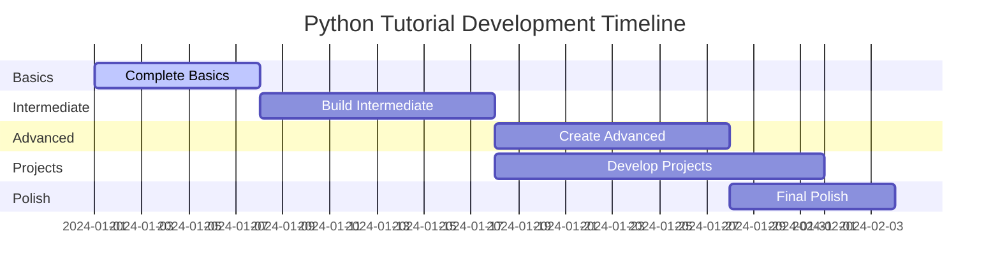

# 📋 Danh Sách Công Việc - Hoàn Thiện Python Tutorial

> **Mục tiêu**: Xây dựng khóa học Python hoàn chỉnh theo phương pháp ELI5, từ cơ bản đến nâng cao, phù hợp với học sinh Việt Nam và người mới bắt đầu.

## 🎯 Tổng Quan Dự Án

**Trạng thái hiện tại**: 
- ✅ **Hoàn thành**: Phần cơ bản (100%), Phần trung cấp (70%), 3 dự án
- 🟡 **Đang thiếu**: Phần trung cấp còn lại, nâng cao, thực hành và dự án
- 🔴 **Cần làm**: Hoàn thiện phần trung cấp, nâng cao và các dự án còn lại

---

## 📚 PHẦN 1: CƠ BẢN SIÊU DỄ (🟢 Green Level)

### ✅ Đã Hoàn Thành
- [x] `intro.md` - Giới thiệu tổng quan
- [x] `basics/what-is-python.md` - Python là gì?
- [x] `basics/installing-python.md` - Cài đặt Python
- [x] `basics/python-environment.md` - Môi trường làm việc
- [x] `basics/first-program.md` - Chương trình đầu tiên
- [x] `basics/printing-messages.md` - In thông điệp
- [x] `basics/comments.md` - Ghi chú trong code
- [x] `basics/getting-input.md` - Nhận input từ người dùng

### ✅ Đã Hoàn Thành Thêm
- [x] `basics/variables-and-data-types.md` - Biến và kiểu dữ liệu cơ bản
- [x] `basics/basic-math-operations.md` - Phép tính cơ bản
- [x] `basics/strings-basics.md` - Làm việc với chuỗi cơ bản
- [x] `basics/boolean-and-logic.md` - Boolean và logic cơ bản
- [x] `basics/errors-and-debugging.md` - Hiểu và sửa lỗi cơ bản
- [x] `basics/_category_.json` - Cấu hình category cho basics

---

## 🧮 PHẦN 2: TRUNG BÌNH THÚ VỊ (🟡 Yellow Level)

### 📁 Thư mục: `intermediate/`
- [x] `intermediate/_category_.json` - Cấu hình category
- [x] `intermediate/conditional-statements.md` - Câu lệnh điều kiện (if/elif/else)
- [x] `intermediate/loops-for.md` - Vòng lặp for
- [x] `intermediate/loops-while.md` - Vòng lặp while
- [x] `intermediate/lists-basics.md` - Danh sách cơ bản
- [x] `intermediate/lists-methods.md` - Phương thức của list
- [x] `intermediate/dictionaries.md` - Từ điển (dictionary)
- [x] `intermediate/tuples.md` - Tuple
- [x] `intermediate/sets.md` - Tập hợp (set)
- [x] `intermediate/functions-basics.md` - Hàm cơ bản
- [x] `intermediate/functions-parameters.md` - Tham số trong hàm
- [x] `intermediate/scope-and-variables.md` - Phạm vi biến
- [x] `intermediate/string-methods.md` - Phương thức chuỗi nâng cao
- [x] `intermediate/list-comprehension.md` - List comprehension
- [x] `intermediate/error-handling.md` - Xử lý lỗi với try/except

---

## 🚀 PHẦN 3: THÁCH THỨC CAO (🔴 Red Level)

### 📁 Thư mục: `advanced/`
- [ ] `advanced/_category_.json` - Cấu hình category
- [ ] `advanced/file-handling.md` - Làm việc với file
- [ ] `advanced/modules-and-packages.md` - Module và package
- [ ] `advanced/classes-and-objects.md` - Lớp và đối tượng (OOP cơ bản)
- [ ] `advanced/inheritance.md` - Kế thừa
- [ ] `advanced/working-with-json.md` - Làm việc với JSON
- [ ] `advanced/working-with-apis.md` - Gọi API
- [ ] `advanced/regular-expressions.md` - Biểu thức chính quy
- [ ] `advanced/decorators-basics.md` - Decorator cơ bản
- [ ] `advanced/generators.md` - Generator
- [ ] `advanced/context-managers.md` - Context manager
- [ ] `advanced/lambda-functions.md` - Lambda function
- [ ] `advanced/map-filter-reduce.md` - Map, filter, reduce

---

## 🎮 PHẦN 4: DỰ ÁN THỰC HÀNH

### 📁 Thư mục: `projects/`
- [x] `projects/_category_.json` - Cấu hình category
- [x] `projects/calculator.md` - Máy tính đơn giản
- [x] `projects/guessing-game.md` - Game đoán số
- [x] `projects/password-generator.md` - Tạo mật khẩu ngẫu nhiên
- [ ] `projects/todo-list.md` - Ứng dụng todo list
- [ ] `projects/weather-app.md` - Ứng dụng thời tiết
- [ ] `projects/quiz-game.md` - Game quiz
- [ ] `projects/file-organizer.md` - Sắp xếp file tự động
- [ ] `projects/web-scraper.md` - Thu thập dữ liệu web
- [ ] `projects/chatbot-basic.md` - Chatbot đơn giản
- [ ] `projects/expense-tracker.md` - Quản lý chi tiêu

---

## 💪 PHẦN 5: BÀI TẬP THỰC HÀNH

### 📁 Thư mục: `practice/`
- [ ] `practice/_category_.json` - Cấu hình category
- [ ] `practice/basic-exercises.md` - Bài tập cơ bản
- [ ] `practice/variable-exercises.md` - Bài tập về biến
- [ ] `practice/string-exercises.md` - Bài tập về chuỗi
- [ ] `practice/list-exercises.md` - Bài tập về danh sách
- [ ] `practice/function-exercises.md` - Bài tập về hàm
- [ ] `practice/loop-exercises.md` - Bài tập về vòng lặp
- [ ] `practice/conditional-exercises.md` - Bài tập về điều kiện
- [ ] `practice/file-exercises.md` - Bài tập về file
- [ ] `practice/oop-exercises.md` - Bài tập về OOP
- [ ] `practice/challenge-problems.md` - Bài tập thách thức

---

## 📖 PHẦN 6: TÀI LIỆU THAM KHẢO

### 📁 Thư mục: `reference/`
- [ ] `reference/_category_.json` - Cấu hình category
- [ ] `reference/python-cheatsheet.md` - Bảng tra cứu nhanh
- [ ] `reference/built-in-functions.md` - Hàm có sẵn
- [ ] `reference/common-modules.md` - Module thông dụng
- [ ] `reference/error-messages.md` - Thông báo lỗi thường gặp
- [ ] `reference/coding-style.md` - Quy tắc viết code
- [ ] `reference/best-practices.md` - Thực hành tốt nhất
- [ ] `reference/performance-tips.md` - Tối ưu hiệu suất
- [ ] `reference/useful-resources.md` - Tài nguyên hữu ích

---

## 📚 PHẦN 7: TỪ ĐIỂN THUẬT NGỮ

### 📁 Thư mục: `glossary/`
- [ ] `glossary/_category_.json` - Cấu hình category
- [ ] `glossary/programming-terms.md` - Thuật ngữ lập trình
- [ ] `glossary/python-specific.md` - Thuật ngữ riêng Python
- [ ] `glossary/data-structures.md` - Cấu trúc dữ liệu
- [ ] `glossary/algorithms.md` - Thuật toán cơ bản

---

## 🛠️ PHẦN 8: CẤU HÌNH VÀ TỐI ƯU

### 🔧 File cấu hình cần tạo/cập nhật
- [ ] Cập nhật `sidebars-python.js` với cấu trúc hoàn chỉnh
- [ ] Tạo các file `_category_.json` cho từng thư mục con
- [ ] Kiểm tra và cập nhật metadata trong tất cả file
- [ ] Đảm bảo tính nhất quán về format và style

### 🎨 Tối ưu trải nghiệm người dùng
- [ ] Thêm Mermaid diagrams cho các khái niệm phức tạp
- [ ] Tạo interactive code examples
- [ ] Thêm video demos cho các phần quan trọng
- [ ] Tối ưu responsive design
- [ ] Kiểm tra theme compatibility (dark/light mode)

---

## 🎯 ƯU TIÊN THỰC HIỆN

### 🚨 Ưu tiên cao (Tuần 1-2)
1. **Hoàn thiện phần Basics** - Bổ sung các bài còn thiếu
2. **Tạo phần Intermediate** - Xây dựng nền tảng vững chắc
3. **Dự án đầu tiên** - Calculator và Guessing Game
4. **Bài tập cơ bản** - Để người học thực hành

### 🟡 Ưu tiên trung bình (Tuần 3-4)
1. **Phần Advanced** - Các chủ đề nâng cao
2. **Thêm dự án** - Todo List, Weather App
3. **Tài liệu tham khảo** - Cheatsheet, built-in functions
4. **Từ điển thuật ngữ** - Giải thích các khái niệm

### 🟢 Ưu tiên thấp (Tuần 5+)
1. **Tối ưu UI/UX** - Cải thiện trải nghiệm
2. **Video content** - Thêm video hướng dẫn
3. **Interactive elements** - Code playground
4. **SEO optimization** - Tối ưu tìm kiếm

---

## 📊 TIẾN ĐỘ THỰC HIỆN

### 📈 Thống kê hiện tại
- **Tổng số bài cần viết**: ~85 bài
- **Đã hoàn thành**: 25 bài (29.4%)
- **Còn lại**: 60 bài (70.6%)
- **Thời gian ước tính**: 4-5 tuần (với tốc độ 3-4 bài/ngày)

### 🎯 Mục tiêu từng giai đoạn
- **Tuần 1**: Hoàn thành 15 bài (Basics + một phần Intermediate)
- **Tuần 2**: Hoàn thành 15 bài (Intermediate + Projects cơ bản)
- **Tuần 3**: Hoàn thành 15 bài (Advanced + Practice)
- **Tuần 4**: Hoàn thành 15 bài (Reference + Glossary)
- **Tuần 5-6**: Tối ưu và hoàn thiện

---

## 🔄 QUY TRÌNH LÀM VIỆC

### 📝 Quy trình viết bài
1. **Research** - Tìm hiểu chủ đề và ví dụ thực tế
2. **Outline** - Tạo dàn ý chi tiết theo format ELI5
3. **Write** - Viết nội dung với analogies và examples
4. **Review** - Kiểm tra code examples và grammar
5. **Test** - Đảm bảo tất cả code đều chạy được
6. **Publish** - Commit và push lên repository

### ✅ Checklist cho mỗi bài viết
- [ ] Tiêu đề hấp dẫn với emoji
- [ ] Mô tả ngắn gọn và keywords SEO
- [ ] Phần giới thiệu với analogy dễ hiểu
- [ ] Ít nhất 2-3 code examples thực tế
- [ ] Mermaid diagram cho khái niệm phức tạp
- [ ] Bài tập thực hành cuối bài
- [ ] Links đến bài liên quan
- [ ] Kiểm tra dark/light theme compatibility

---

## 🤝 PHÂN CÔNG NHIỆM VỤ

### 👨‍💻 Vai trò và trách nhiệm
- **Content Creator**: Viết nội dung chính
- **Code Reviewer**: Kiểm tra và test code examples  
- **UI/UX Designer**: Tối ưu trải nghiệm người dùng
- **SEO Specialist**: Tối ưu từ khóa và metadata

### 📅 Timeline chi tiết

---

## 📞 LIÊN HỆ VÀ HỖ TRỢ

**Khi cần hỗ trợ, hãy liên hệ:**
- 🐛 **Bug reports**: Tạo issue trên GitHub
- 💡 **Feature requests**: Thảo luận trong team
- ❓ **Questions**: Slack channel #python-tutorial
- 📝 **Content review**: Pull request process

---

*📝 **Lưu ý**: File này sẽ được cập nhật thường xuyên theo tiến độ thực tế. Hãy đánh dấu [x] khi hoàn thành một task và thêm ghi chú nếu cần.*

**Cập nhật lần cuối**: 29/09/2025  
**Người tạo**: AI Assistant với sự hỗ trợ từ Web Search  
**Trạng thái**: 🚀 Đang triển khai tích cực - 29.4% hoàn thành
