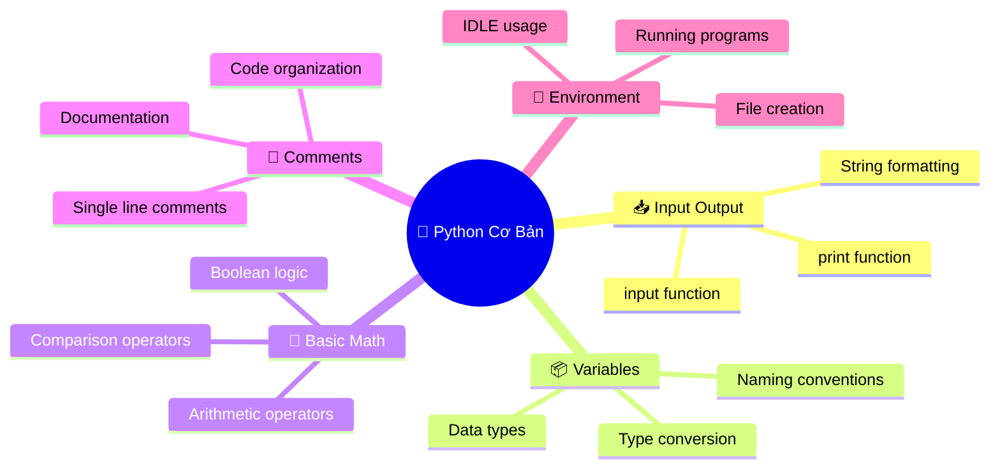
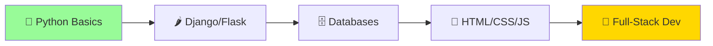
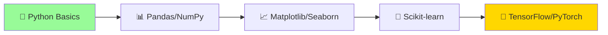
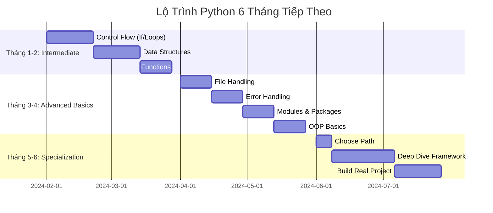
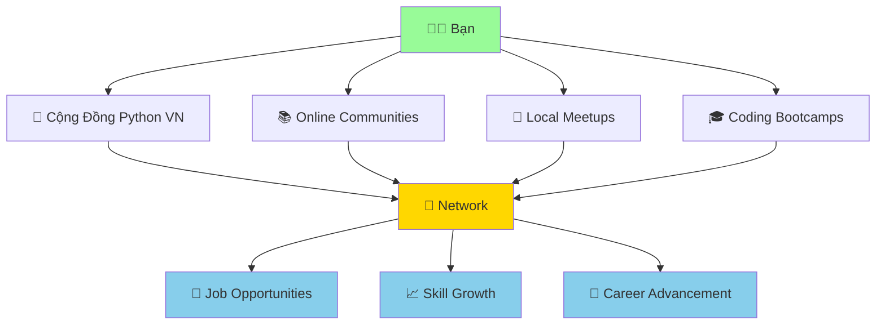

# 🚀 Bước Tiếp Theo Sau Python Cơ Bản

:::tip 🎊 Chúc Mừng!
Bạn đã hoàn thành phần Python cơ bản! Con rắn Python của bạn giờ đã biết "nói chuyện", "tính toán", "nhớ thông tin" và "đưa ra quyết định". Đây là nền tảng vững chắc để bước vào thế giới Python rộng lớn hơn!
:::

## 🎯 Bạn Đã Học Được Gì?

### ✅ **Kỹ Năng Cơ Bản Đã Thành Thạo**



### 🏆 **Thành Tựu Đáng Tự Hào**
- ✨ **Viết chương trình đầu tiên** và thấy nó chạy thành công
- 🗣️ **Giao tiếp với Python** thông qua print() và input()
- 🧠 **Hiểu cách máy tính "suy nghĩ"** với variables và data types
- 🔧 **Biết cách tìm và sửa lỗi** cơ bản
- 💪 **Tự tin với môi trường lập trình** Python

## 🗺️ Lộ Trình Tiếp Theo

### 🟡 **Level Intermediate - Trung Bình Thú Vị**

#### 1. **Control Flow - Điều Khiển Luồng** (2-3 tuần)
```python
# If-else: Dạy Python đưa ra quyết định
age = int(input("Tuổi của bạn: "))
if age >= 18:
    print("Bạn có thể lái xe!")
else:
    print("Bạn cần chờ thêm vài năm!")

# Loops: Dạy Python làm việc lặp đi lặp lại
for i in range(5):
    print(f"Python đang đếm: {i}")
```

**Sẽ học:**
- 🤔 **If/elif/else statements** - Python đưa ra quyết định thông minh
- 🔄 **For loops** - Lặp lại công việc không biết mệt
- ⚡ **While loops** - Lặp cho đến khi điều kiện thỏa mãn
- 🎯 **Nested conditions** - Quyết định phức tạp hơn

#### 2. **Data Structures - Cấu Trúc Dữ Liệu** (2-3 tuần)
```python
# Lists: Danh sách học sinh
hoc_sinh = ["An", "Bình", "Chi", "Dũng"]
hoc_sinh.append("Em")  # Thêm học sinh mới

# Dictionaries: Thông tin chi tiết
thong_tin = {
    "tên": "Minh",
    "tuổi": 15,
    "sở thích": ["đọc sách", "chơi game", "học Python"]
}
```

**Sẽ học:**
- 📝 **Lists** - Danh sách có thể thay đổi
- 📚 **Dictionaries** - Lưu trữ thông tin có cặp key-value
- 🎯 **Tuples** - Danh sách không thể thay đổi
- 🔧 **List/Dict methods** - Các thao tác với dữ liệu

#### 3. **Functions - Hàm** (2-3 tuần)
```python
def chao_hoi(ten, tuoi):
    """Hàm chào hỏi thân thiện"""
    return f"Xin chào {ten}! Bạn {tuoi} tuổi, rất vui được gặp!"

# Sử dụng hàm
loi_chao = chao_hoi("Lan", 16)
print(loi_chao)
```

**Sẽ học:**
- 🏭 **Định nghĩa functions** - Tạo "công thức" có thể dùng lại
- 📥 **Parameters và arguments** - Truyền thông tin vào function
- 📤 **Return values** - Nhận kết quả từ function
- 🎯 **Local vs global scope** - Phạm vi hoạt động của biến

### 🔴 **Level Advanced - Thách Thức Cao**

#### 1. **Object-Oriented Programming** (1 tháng)
```python
class ConNguoi:
    def __init__(self, ten, tuoi):
        self.ten = ten
        self.tuoi = tuoi
    
    def gioi_thieu(self):
        return f"Tôi là {self.ten}, {self.tuoi} tuổi"

# Tạo object
nguoi = ConNguoi("Minh", 20)
print(nguoi.gioi_thieu())
```

#### 2. **File Handling & Data Processing** (2-3 tuần)
```python
# Đọc/ghi file
with open("danh_sach.txt", "r", encoding="utf-8") as file:
    noi_dung = file.read()
    print(noi_dung)

# Xử lý CSV
import csv
with open("diem_thi.csv", "r") as file:
    reader = csv.reader(file)
    for row in reader:
        print(f"Học sinh: {row[0]}, Điểm: {row[1]}")
```

#### 3. **Web Development & APIs** (1 tháng)
```python
# Flask - Tạo website đơn giản
from flask import Flask
app = Flask(__name__)

@app.route("/")
def home():
    return "<h1>Website Python của tôi!</h1>"

# Requests - Kết nối API
import requests
response = requests.get("https://api.github.com/users/python")
data = response.json()
print(f"Python có {data['public_repos']} repositories!")
```

## 🎯 Chọn Chuyên Ngành

### 🌐 **Web Development**


**Frameworks phổ biến:**
- **Django**: Framework mạnh mẽ, đầy đủ tính năng
- **Flask**: Nhẹ, linh hoạt, dễ học
- **FastAPI**: Hiện đại, nhanh, tự động tạo API docs

**Dự án gợi ý:**
- 📝 Blog cá nhân với Django
- 🛒 Website bán hàng nhỏ
- 📊 Dashboard hiển thị dữ liệu
- 🔐 Hệ thống đăng nhập/đăng ký

### 🤖 **Data Science & AI**


**Libraries quan trọng:**
- **Pandas**: Xử lý dữ liệu dạng bảng
- **NumPy**: Tính toán khoa học
- **Matplotlib/Seaborn**: Vẽ biểu đồ đẹp
- **Scikit-learn**: Machine Learning cơ bản

**Dự án gợi ý:**
- 📈 Phân tích dữ liệu bán hàng
- 🏠 Dự đoán giá nhà
- 📧 Phân loại email spam
- 🎵 Hệ thống gợi ý nhạc

### 🎮 **Game Development**
```python
import pygame

# Tạo game đơn giản với Pygame
pygame.init()
screen = pygame.display.set_mode((800, 600))
pygame.display.set_caption("Game Python của tôi!")

running = True
while running:
    for event in pygame.event.get():
        if event.type == pygame.QUIT:
            running = False
    
    screen.fill((0, 0, 0))  # Màn hình đen
    pygame.display.flip()

pygame.quit()
```

**Dự án gợi ý:**
- 🐍 Game rắn săn mồi (Snake)
- 🎯 Game bắn súng 2D
- 🧩 Game puzzle
- 🏓 Game Pong

### 🔧 **Automation & Scripting**
```python
# Tự động gửi email
import smtplib
from email.mime.text import MIMEText

def gui_email_tu_dong(to_email, subject, message):
    # Code gửi email tự động
    pass

# Tự động tải file từ web
import requests
import os

def tai_file_tu_dong(url, ten_file):
    response = requests.get(url)
    with open(ten_file, 'wb') as file:
        file.write(response.content)
    print(f"Đã tải {ten_file}")
```

**Dự án gợi ý:**
- 📧 Gửi email sinh nhật tự động
- 📁 Tự động sắp xếp file trong máy tính
- 📊 Tự động tạo báo cáo từ Excel
- 🌐 Web scraping - thu thập dữ liệu web

## 💼 Cơ Hội Nghề Nghiệp

### 📊 **Mức Lương Python Developer Việt Nam (2024)**

| Cấp Độ | Kinh Nghiệm | Mức Lương (VNĐ/tháng) | Kỹ Năng Cần Có |
|---------|-------------|----------------------|-----------------|
| **Intern** | 0-6 tháng | 3-8 triệu | Python cơ bản, Git |
| **Junior** | 6 tháng - 2 năm | 8-18 triệu | Framework, Database |
| **Mid-level** | 2-5 năm | 18-35 triệu | Architecture, Team work |
| **Senior** | 5+ năm | 35-60+ triệu | Leadership, System design |

### 🏢 **Các Vị Trí Phổ Biến**

#### 1. **Backend Developer**
- **Công việc**: Xây dựng server, API, database
- **Kỹ năng**: Django/Flask, SQL, Redis, Docker
- **Công ty**: VNG, Tiki, Shopee, FPT Software

#### 2. **Data Analyst/Scientist**  
- **Công việc**: Phân tích dữ liệu, báo cáo, machine learning
- **Kỹ năng**: Pandas, SQL, Statistics, ML algorithms
- **Công ty**: Viettel, VNPT, Banks, Startups

#### 3. **DevOps Engineer**
- **Công việc**: Tự động hóa deployment, monitoring
- **Kỹ năng**: Docker, Kubernetes, CI/CD, Cloud
- **Công ty**: Tech companies, Banks, Enterprises

#### 4. **AI/ML Engineer**
- **Công việc**: Xây dựng mô hình AI, deep learning
- **Kỹ năng**: TensorFlow, PyTorch, Mathematics
- **Công ty**: VinAI, FPT AI, Zalo AI, Research labs

## 📚 Tài Nguyên Học Tập Tiếp Theo

### 🌐 **Khóa Học Online**

#### Tiếng Việt
- **Học lập trình**: [hoclaptrinh.vn](https://hoclaptrinh.vn)
- **CodeGym**: [codegym.vn](https://codegym.vn)
- **Techmaster**: [techmaster.vn](https://techmaster.vn)
- **F8**: [fullstack.edu.vn](https://fullstack.edu.vn)

#### Tiếng Anh (Chất lượng cao)
- **freeCodeCamp**: Miễn phí, đầy đủ
- **Coursera**: Các khóa từ đại học top
- **edX**: MIT, Harvard courses
- **Udemy**: Practical, project-based

### 📖 **Sách Hay**

#### Tiếng Việt
- "Lập trình Python căn bản" - Vũ Hữu Tiệp
- "Python cho người mới bắt đầu" - Lê Minh Hoàng

#### Tiếng Anh
- "Automate the Boring Stuff with Python" - Al Sweigart
- "Python Crash Course" - Eric Matthes
- "Fluent Python" - Luciano Ramalho (Advanced)

### 🎮 **Thực Hành Coding**

#### Platforms
- **HackerRank**: [hackerrank.com](https://hackerrank.com)
- **LeetCode**: [leetcode.com](https://leetcode.com)
- **Codewars**: [codewars.com](https://codewars.com)
- **VNOI**: [oj.vnoi.info](https://oj.vnoi.info) (Tiếng Việt)

#### Project Ideas
```python
# 🟢 Beginner Projects
- Máy tính cá nhân
- Trò chơi đoán số
- To-do list app
- Password generator

# 🟡 Intermediate Projects  
- Weather app với API
- Web scraper
- Chat bot
- Personal finance tracker

# 🔴 Advanced Projects
- E-commerce website
- Social media dashboard
- Machine learning model
- Real-time chat application
```

## 🎯 Kế Hoạch 6 Tháng Tiếp Theo

### 📅 **Roadmap Chi Tiết**



### 🎯 **Mục Tiêu Cụ Thể**

#### **Tháng 1-2: Intermediate Python**
- ✅ Viết được chương trình có logic phức tạp (if/else/loops)
- ✅ Xử lý được lists, dictionaries thành thạo
- ✅ Tạo và sử dụng functions hiệu quả
- 🎯 **Milestone**: Hoàn thành 5 projects nhỏ

#### **Tháng 3-4: Advanced Basics**
- ✅ Đọc/ghi file, xử lý CSV/JSON
- ✅ Handle errors gracefully
- ✅ Hiểu modules và packages
- ✅ OOP cơ bản (classes, objects)
- 🎯 **Milestone**: Build 2 substantial projects

#### **Tháng 5-6: Chuyên Sâu**
- ✅ Chọn 1 chuyên ngành (Web/Data/AI/Game)
- ✅ Học framework chính của chuyên ngành
- ✅ Build 1 project lớn để showcase
- 🎯 **Milestone**: Portfolio project hoàn chỉnh

## 🌟 Lời Khuyên Cuối Cùng

### 💪 **Mindset Quan Trọng**

:::tip 🎯 Ghi Nhớ
- **Consistency > Intensity**: 30 phút/ngày tốt hơn 5 tiếng/tuần
- **Practice > Theory**: Code nhiều hơn đọc
- **Build > Learn**: Tạo projects thực tế
- **Share > Hoard**: Chia sẻ kiến thức giúp củng cố
:::

### 🤝 **Tham Gia Cộng Đồng**



### 🎉 **Ăn Mừng Thành Tựu**

Hãy dành thời gian để:
- 🎊 **Tự hào** về những gì đã học được
- 📸 **Chia sẻ** projects trên social media
- 🎯 **Đặt mục tiêu** cho giai đoạn tiếp theo
- 🤝 **Giúp đỡ** người mới bắt đầu học Python

## 🚀 Sẵn Sàng Cho Hành Trình Tiếp Theo!

:::success 🌟 Bạn Đã Sẵn Sàng!
Với nền tảng Python cơ bản vững chắc, bạn giờ có thể:
- 🎯 **Chọn chuyên ngành** phù hợp với sở thích
- 💻 **Build projects** thực tế và ý nghĩa
- 🤝 **Tham gia cộng đồng** developer
- 💼 **Hướng tới career** trong công nghệ
- 🌟 **Tạo impact** với code của mình
:::

**Con rắn Python của bạn giờ đã trưởng thành!** 🐍✨

Nó không còn chỉ là một con rắn pet đơn giản, mà đã trở thành một **companion thông minh** có thể giúp bạn:
- 🏗️ **Xây dựng** websites và applications
- 📊 **Phân tích** dữ liệu và tạo insights
- 🤖 **Tạo ra** AI và automation tools
- 🎮 **Phát triển** games và entertainment
- 💼 **Mở ra** cơ hội nghề nghiệp tuyệt vời

**Hành trình Python của bạn mới chỉ bắt đầu - và tương lai thật sáng lạn! 🌟🚀**

---

*🎓 **Tốt nghiệp**: Chúc mừng bạn đã hoàn thành Python Basics! Bây giờ hãy chọn con đường riêng và tiếp tục khám phá thế giới Python vô tận!*
