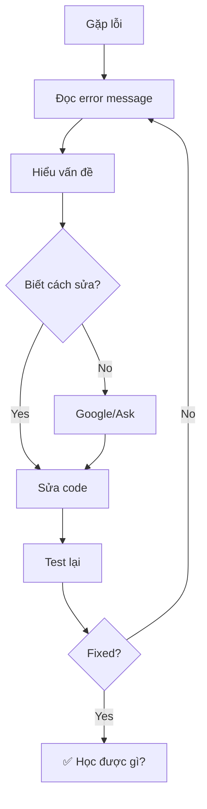

# 🐛 Lỗi Là Bạn, Không Phải Kẻ Thù!

## Giới Thiệu

**Errors** (lỗi) là phần không thể tránh khỏi khi lập trình. Tin tốt: **Rust compiler là giáo viên tốt nhất!**

:::tip Giải Thích Cho Bạn 5 Tuổi
Lỗi giống như **giáo viên chữa bài**:
- ✏️ Bạn làm bài tập
- 👨‍🏫 Thầy kiểm tra
- ❌ Thầy khoanh chỗ sai
- 💡 Thầy giải thích tại sao sai
- ✅ Bạn sửa và học được điều mới!

**Rust compiler = Thầy giáo siêu tốt!**
- 🔍 Tìm lỗi rất kỹ
- 📖 Giải thích rất rõ
- 💡 Gợi ý cách sửa
- 🎓 Dạy bạn cách viết code tốt hơn

**Đừng sợ lỗi - Hãy đọc kỹ và học!** 🦀✨
:::

## 🎯 Hai Loại Lỗi Chính

### 1. Compile-Time Errors (Lỗi Biên Dịch)

**Lỗi khi compile** - Compiler bắt được!

```rust
fn main() {
    let x = 5;
    x = 10;  // ❌ Error! x is immutable
}
```

✅ **Ưu điểm**: Bắt lỗi TRƯỚC KHI chạy!

### 2. Runtime Errors (Lỗi Khi Chạy)

**Lỗi khi chạy** - Program crash!

```rust
fn main() {
    let numbers = vec![1, 2, 3];
    let x = numbers[10];  // ❌ Panic! Index out of bounds
}
```

⚠️ **Nguy hiểm hơn**: User gặp lỗi!

## 📖 Đọc Error Messages

### Cấu Trúc Error Message

```
error[E0384]: cannot assign twice to immutable variable `x`
 --> src/main.rs:3:5
  |
2 |     let x = 5;
  |         - first assignment to `x`
3 |     x = 10;
  |     ^^^^^^ cannot assign twice to immutable variable
  |
help: consider making this binding mutable
  |
2 |     let mut x = 5;
  |         +++
```

**Phần quan trọng:**

1. **Error code**: `E0384`
2. **Mô tả**: "cannot assign twice..."
3. **Vị trí**: `src/main.rs:3:5`
4. **Context**: Hiển thị code xung quanh
5. **Giải thích**: Tại sao lỗi
6. **Gợi ý**: `help: consider making...`

### Ví Dụ Chi Tiết

```rust
fn main() {
    let name = "An";
    name = "Bình";  // ❌ Error!
}
```

**Error message:**
```
error[E0384]: cannot assign twice to immutable variable `name`
 --> src/main.rs:3:5
  |
2 |     let name = "An";
  |         ---- first assignment to `name`
3 |     name = "Bình";
  |     ^^^^^^^^^^^^ cannot assign twice to immutable variable
  |
help: consider making this binding mutable
  |
2 |     let mut name = "An";
  |         +++
```

**Cách đọc:**
1. ❌ **Vấn đề**: Gán 2 lần cho immutable variable
2. 📍 **Ở đâu**: Dòng 3
3. 💡 **Giải pháp**: Thêm `mut`

## 🔧 Lỗi Thường Gặp

### 1. Immutable Variable

```rust
fn main() {
    let x = 5;
    x = 10;  // ❌ Error!
}
```

**Error:**
```
cannot assign twice to immutable variable
```

**Fix:**
```rust
fn main() {
    let mut x = 5;  // ✅ Thêm mut
    x = 10;
}
```

### 2. Type Mismatch

```rust
fn main() {
    let x: i32 = "5";  // ❌ Error!
}
```

**Error:**
```
expected `i32`, found `&str`
```

**Fix:**
```rust
fn main() {
    let x: i32 = 5;  // ✅ Đúng type

    // Hoặc parse
    let x: i32 = "5".parse().expect("Not a number");
}
```

### 3. Variable Not Found

```rust
fn main() {
    println!("{}", x);  // ❌ Error! x chưa được khai báo
}
```

**Error:**
```
cannot find value `x` in this scope
```

**Fix:**
```rust
fn main() {
    let x = 5;  // ✅ Khai báo trước
    println!("{}", x);
}
```

### 4. Missing Semicolon

```rust
fn main() {
    let x = 5
    let y = 10;  // ❌ Error!
}
```

**Error:**
```
expected `;`, found `let`
```

**Fix:**
```rust
fn main() {
    let x = 5;  // ✅ Thêm ;
    let y = 10;
}
```

### 5. Unused Variable

```rust
fn main() {
    let x = 5;  // ⚠️ Warning! x không dùng
}
```

**Warning:**
```
warning: unused variable: `x`
```

**Fix - Cách 1:** Dùng biến

```rust
fn main() {
    let x = 5;
    println!("{}", x);  // ✅ Dùng x
}
```

**Fix - Cách 2:** Underscore prefix

```rust
fn main() {
    let _x = 5;  // ✅ _ = "tôi biết không dùng"
}
```

### 6. Moved Value

```rust
fn main() {
    let s = String::from("hello");
    take_ownership(s);
    println!("{}", s);  // ❌ Error! s đã moved
}

fn take_ownership(text: String) {
    println!("{}", text);
}
```

**Error:**
```
borrow of moved value: `s`
```

**Fix - Cách 1:** Borrow

```rust
fn main() {
    let s = String::from("hello");
    take_ownership(&s);  // ✅ Borrow
    println!("{}", s);   // ✅ Vẫn có s!
}

fn take_ownership(text: &String) {
    println!("{}", text);
}
```

**Fix - Cách 2:** Clone

```rust
fn main() {
    let s = String::from("hello");
    take_ownership(s.clone());  // ✅ Clone
    println!("{}", s);           // ✅ Vẫn có s!
}

fn take_ownership(text: String) {
    println!("{}", text);
}
```

### 7. Index Out of Bounds

```rust
fn main() {
    let numbers = vec![1, 2, 3];
    let x = numbers[10];  // ❌ Panic!
}
```

**Runtime error:**
```
thread 'main' panicked at 'index out of bounds'
```

**Fix - Cách 1:** Check trước

```rust
fn main() {
    let numbers = vec![1, 2, 3];

    if 10 < numbers.len() {
        let x = numbers[10];
    } else {
        println!("Index quá lớn!");
    }
}
```

**Fix - Cách 2:** Dùng `.get()`

```rust
fn main() {
    let numbers = vec![1, 2, 3];

    match numbers.get(10) {
        Some(x) => println!("Giá trị: {}", x),
        None => println!("Index không tồn tại!"),
    }
}
```

## 🎓 Học Từ Error Messages

### Error Code: `E0384`

**Tra cứu:**
```bash
rustc --explain E0384
```

Hoặc online: https://doc.rust-lang.org/error-index.html

**Giải thích chi tiết:**
- Mô tả lỗi
- Tại sao Rust làm vậy
- Ví dụ
- Cách sửa

### Ví Dụ: Đọc Explanation

```bash
$ rustc --explain E0384
```

**Output:**
```
An immutable variable was reassigned.

Erroneous code example:

fn main() {
    let x = 3;
    x = 5; // error: cannot assign twice to immutable variable `x`
}

By default, variables in Rust are immutable. To fix this error, add the `mut`
keyword after `let`:

fn main() {
    let mut x = 3;
    x = 5;
}
```

## 🔍 Debug Strategies

### 1. Read Error Carefully

❌ **Sai:**
```
"Lỗi! Không hiểu! Help!"
```

✅ **Đúng:**
```
1. Đọc error message
2. Xem dòng lỗi
3. Hiểu vấn đề là gì
4. Áp dụng gợi ý
5. Test lại
```

### 2. Use `println!` Debugging

```rust
fn main() {
    let x = 5;
    println!("x = {}", x);  // Debug

    let y = x + 10;
    println!("y = {}", y);  // Debug

    let z = y * 2;
    println!("z = {}", z);  // Debug
}
```

### 3. Use `dbg!` Macro

```rust
fn main() {
    let x = 5;
    dbg!(x);  // [src/main.rs:3] x = 5

    let y = dbg!(x + 10);  // [src/main.rs:5] x + 10 = 15
    dbg!(y);  // [src/main.rs:6] y = 15
}
```

**Kết quả:**
```
[src/main.rs:3] x = 5
[src/main.rs:5] x + 10 = 15
[src/main.rs:6] y = 15
```

### 4. Simplify Code

Khi bug phức tạp:
1. Comment phần lớn code
2. Chỉ giữ phần tối thiểu
3. Thêm dần từng phần
4. Tìm ra đoạn gây lỗi

### 5. Search Error

Google: `"rust [error message]"`

Ví dụ:
- `"rust cannot assign twice to immutable variable"`
- `"rust E0384"`

Resources:
- Stack Overflow
- Rust Users Forum
- Reddit r/rust

## 💡 Mindset Khi Gặp Lỗi

### ❌ Mindset Tệ

- "Lỗi này khó quá!"
- "Tôi không hiểu gì cả!"
- "Rust khó quá, bỏ đi!"
- "Compiler ghét tôi!"

### ✅ Mindset Tốt

- "Compiler đang dạy tôi!"
- "Lỗi này giúp tôi học thêm!"
- "Đọc kỹ error message!"
- "Mỗi lỗi = một bài học!"

### 🎯 Quy Trình Fix Bug



## 📊 Các Error Messages Phổ Biến

| Error | Nghĩa | Fix |
|-------|-------|-----|
| `cannot assign twice to immutable variable` | Gán 2 lần cho immutable | Thêm `mut` |
| `expected X, found Y` | Sai kiểu dữ liệu | Đổi type hoặc cast |
| `cannot find value X` | Biến chưa khai báo | Khai báo biến |
| `borrow of moved value` | Dùng biến đã moved | Borrow hoặc clone |
| `expected `;`` | Thiếu `;` | Thêm `;` |
| `index out of bounds` | Index quá lớn | Check bounds |
| `unused variable` | Biến không dùng | Dùng hoặc `_` prefix |

## 🎯 Thực Hành

### Bài Tập 1: Tìm và Sửa Lỗi

```rust
fn main() {
    let x = 5;
    x = 10;
    println!("{}", x);
}
```

<details>
<summary>💡 Xem đáp án</summary>

**Lỗi:** `x` là immutable

**Fix:**
```rust
fn main() {
    let mut x = 5;  // Thêm mut
    x = 10;
    println!("{}", x);
}
```

</details>

### Bài Tập 2: Tìm và Sửa Lỗi

```rust
fn main() {
    let name = String::from("An");
    print_name(name);
    println!("Tên: {}", name);
}

fn print_name(n: String) {
    println!("{}", n);
}
```

<details>
<summary>💡 Xem đáp án</summary>

**Lỗi:** `name` bị moved vào `print_name`

**Fix - Cách 1:** Borrow
```rust
fn main() {
    let name = String::from("An");
    print_name(&name);  // Borrow
    println!("Tên: {}", name);
}

fn print_name(n: &String) {
    println!("{}", n);
}
```

**Fix - Cách 2:** Clone
```rust
fn main() {
    let name = String::from("An");
    print_name(name.clone());  // Clone
    println!("Tên: {}", name);
}

fn print_name(n: String) {
    println!("{}", n);
}
```

</details>

### Bài Tập 3: Tìm và Sửa Lỗi

```rust
fn main() {
    let numbers = vec![1, 2, 3, 4, 5];
    for i in 0..10 {
        println!("{}", numbers[i]);
    }
}
```

<details>
<summary>💡 Xem đáp án</summary>

**Lỗi:** Loop chạy 0..10 nhưng vec chỉ có 5 elements

**Fix - Cách 1:** Dùng `.len()`
```rust
fn main() {
    let numbers = vec![1, 2, 3, 4, 5];
    for i in 0..numbers.len() {
        println!("{}", numbers[i]);
    }
}
```

**Fix - Cách 2:** Iterate trực tiếp
```rust
fn main() {
    let numbers = vec![1, 2, 3, 4, 5];
    for num in &numbers {
        println!("{}", num);
    }
}
```

</details>

## 📚 Tóm Tắt

**Lỗi là bạn:**
- 🎓 Compiler là giáo viên
- 📖 Error messages rất chi tiết
- 💡 Luôn có gợi ý sửa
- ✅ Bắt lỗi trước khi chạy

**Đọc error messages:**
1. Error code (E0384)
2. Mô tả lỗi
3. Vị trí (file:line:column)
4. Context code
5. Gợi ý sửa

**Lỗi thường gặp:**
- Immutable variable
- Type mismatch
- Variable not found
- Moved value
- Index out of bounds

**Debug strategies:**
- Đọc error kỹ
- `println!` debugging
- `dbg!` macro
- Simplify code
- Google error message

**Mindset:**
- ✅ Lỗi = học được điều mới
- ✅ Compiler giúp bạn
- ✅ Kiên nhẫn đọc error
- ✅ Mỗi lỗi sửa = progress

## 🎉 Chúc Mừng!

**Bạn đã hoàn thành phần CƠ BẢN của Rust!** 🦀🎊

Những gì bạn đã học:
- ✅ Rust là gì và tại sao đặc biệt
- ✅ Cài đặt và setup
- ✅ Cargo và project management
- ✅ Hello World
- ✅ Printing và formatting
- ✅ Comments
- ✅ Variables và mutability
- ✅ Data types
- ✅ Strings
- ✅ Arithmetic
- ✅ Boolean logic
- ✅ Input/Output
- ✅ **Error handling!**

## 🚀 Bước Tiếp Theo

Giờ bạn đã sẵn sàng cho **phần TRUNG BÌNH**! 🟡

Những gì sẽ học:
- If/else statements
- Loops (while, for)
- Functions
- Collections (Vec, HashMap)
- Error handling với Result
- ... và nhiều hơn nữa!

➡️ **Tiếp theo**: Bắt đầu [Trung Bình Thú Vị](#) (coming soon!)

---

:::tip Lời Nhắn Cuối
**"Mọi chuyên gia đều từng là người mới bắt đầu!"** 🌱

Bạn vừa hoàn thành **bước đầu tiên** trong hành trình Rust!

Rust khó ở đầu, nhưng:
- 💪 Mỗi lỗi bạn sửa → Bạn mạnh hơn
- 🧠 Mỗi concept bạn hiểu → Bạn thông minh hơn
- 🎯 Mỗi chương trình chạy được → Bạn tự tin hơn

**Đừng bỏ cuộc!** Rust community luôn sẵn sàng giúp đỡ!

Keep coding! Keep learning! Keep rust-ing! 🦀✨

**See you in Intermediate!** 🚀
:::
