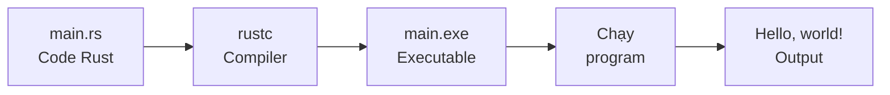

# 👋 Chương Trình Rust Đầu Tiên - Hello, World!

## Giới Thiệu

Chào mừng đến với chương trình Rust đầu tiên của bạn! Theo truyền thống lập trình, chúng ta sẽ bắt đầu với "Hello, World!" 🌍

:::tip Giải Thích Cho Bạn 5 Tuổi
Viết chương trình giống như **dạy robot nói chào**:
1. Bạn viết hướng dẫn (code)
2. Robot đọc hướng dẫn (compiler)
3. Robot hiểu và làm theo (chạy chương trình)
4. Robot nói: "Hello, World!" 🤖👋
:::

## 🎯 Mục Tiêu

Sau bài này, bạn sẽ:
- ✅ Viết chương trình Rust đầu tiên
- ✅ Hiểu cấu trúc cơ bản của Rust
- ✅ Biên dịch và chạy code
- ✅ Hiểu `main()` function
- ✅ Dùng `println!` macro

## 🚀 Cách 1: Dùng Cargo (Khuyến Nghị)

### Bước 1: Tạo Project

```bash
cargo new hello_rust
cd hello_rust
```

**Cargo tạo:**
```
hello_rust/
├── Cargo.toml
└── src/
    └── main.rs
```

### Bước 2: Mở File main.rs

```bash
code src/main.rs  # Nếu dùng VS Code
# Hoặc editor khác
```

**Bạn sẽ thấy:**
```rust
fn main() {
    println!("Hello, world!");
}
```

**Chúc mừng! Code đã viết sẵn!** 🎉

### Bước 3: Chạy Chương Trình

```bash
cargo run
```

**Kết quả:**
```
   Compiling hello_rust v0.1.0 (/path/to/hello_rust)
    Finished dev [unoptimized + debuginfo] target(s) in 1.23s
     Running `target/debug/hello_rust`
Hello, world!
```

**🎊 Chúc mừng! Bạn vừa chạy chương trình Rust đầu tiên!**

## 🔧 Cách 2: Dùng rustc Trực Tiếp

### Bước 1: Tạo File

```bash
# Tạo thư mục
mkdir hello_world
cd hello_world

# Tạo file
touch main.rs  # Linux/Mac
# Hoặc: echo. > main.rs  # Windows
```

### Bước 2: Viết Code

Mở `main.rs` và viết:

```rust
fn main() {
    println!("Hello, world!");
}
```

### Bước 3: Biên Dịch

```bash
rustc main.rs
```

**Tạo ra**:
- `main` (Linux/Mac)
- `main.exe` (Windows)

### Bước 4: Chạy

```bash
./main        # Linux/Mac
main.exe      # Windows
```

**Kết quả:**
```
Hello, world!
```

:::warning Lưu Ý
**rustc** chỉ dùng cho file đơn giản. Với projects thật, luôn dùng **Cargo**!
:::

## 📖 Giải Thích Code

Hãy phân tích từng dòng code:

### Code Hoàn Chỉnh

```rust
fn main() {
    println!("Hello, world!");
}
```

### Dòng 1: `fn main() {`

```rust
fn main() {
```

**Giải thích:**
- `fn` = function (hàm)
- `main` = tên hàm đặc biệt
- `()` = không có parameters (tham số)
- `{` = bắt đầu function body

**`main` function là gì?**
- ✅ **Entry point** - Điểm bắt đầu chương trình
- ✅ Chương trình LUÔN chạy từ `main()` trước
- ✅ Mỗi chương trình chỉ có MỘT `main()` function

**Ví dụ thực tế:**
```
Chương trình Rust ← Cửa chính nhà bạn
main() function  ← Cửa chính
Dòng đầu tiên trong main() ← Bước vào nhà
```

### Dòng 2: `println!("Hello, world!");`

```rust
println!("Hello, world!");
```

**Giải thích:**
- `println!` = macro in ra màn hình (print line)
- `"Hello, world!"` = chuỗi ký tự (string)
- `;` = kết thúc statement

**Tại sao có dấu `!`?**
- `println!` là **macro**, không phải function
- Dấu `!` báo cho Rust biết đây là macro
- Macros giống functions nhưng mạnh hơn

**Tại sao có dấu `;`?**
- Rust yêu cầu `;` ở cuối mỗi statement
- Như dấu chấm trong tiếng Việt
- Quên `;` → Lỗi compile!

```rust
// ❌ Lỗi - Thiếu dấu chấm phẩy
println!("Hello")

// ✅ Đúng
println!("Hello");
```

### Dòng 3: `}`

```rust
}
```

- Đóng function `main()`
- Kết thúc chương trình

## 🎨 Thử Nghiệm

### Thay Đổi Message

```rust
fn main() {
    println!("Xin chào Việt Nam!");
}
```

**Chạy:**
```bash
cargo run
```

**Kết quả:**
```
Xin chào Việt Nam!
```

### In Nhiều Dòng

```rust
fn main() {
    println!("Xin chào!");
    println!("Đây là chương trình Rust đầu tiên của tôi.");
    println!("Rust rất thú vị!");
}
```

**Kết quả:**
```
Xin chào!
Đây là chương trình Rust đầu tiên của tôi.
Rust rất thú vị!
```

### Sử Dụng Emojis

Rust hỗ trợ Unicode!

```rust
fn main() {
    println!("🦀 Rust là tuyệt vời!");
    println!("🚀 Chào mừng đến với lập trình!");
    println!("✨ Bạn đang làm rất tốt!");
}
```

**Kết quả:**
```
🦀 Rust là tuyệt vời!
🚀 Chào mừng đến với lập trình!
✨ Bạn đang làm rất tốt!
```

## 🔍 Quá Trình Biên Dịch

### Từ Code Đến Executable



### Compile vs Run

**Compile (Biên dịch)**:
```bash
cargo build
```
- Chuyển Rust code → Machine code
- Tạo file executable
- Mất thời gian

**Run (Chạy)**:
```bash
cargo run
```
- Compile (nếu cần)
- Chạy program
- Nhanh hơn

:::info Điểm Khác Biệt
**Rust là compiled language** (giống C/C++, khác Python/JavaScript):
- ✅ **Ưu điểm**: Nhanh, kiểm tra lỗi trước khi chạy
- ⚠️ **Nhược điểm**: Phải compile trước (mất thời gian)
:::

## 🐛 Lỗi Thường Gặp

### Lỗi 1: Quên Dấu Chấm Phẩy

```rust
fn main() {
    println!("Hello")  // ❌ Thiếu ;
}
```

**Compiler báo:**
```
error: expected `;`, found `}`
 --> src/main.rs:3:1
  |
2 |     println!("Hello")
  |                      ^ help: add `;` here
3 | }
  | ^
```

**Sửa:** Thêm `;`

```rust
fn main() {
    println!("Hello");  // ✅
}
```

### Lỗi 2: Quên Dấu Ngoặc Kép

```rust
fn main() {
    println!(Hello);  // ❌ Thiếu ""
}
```

**Compiler báo:**
```
error[E0425]: cannot find value `Hello` in this scope
 --> src/main.rs:2:14
  |
2 |     println!(Hello);
  |              ^^^^^ not found in this scope
```

**Sửa:** Thêm `""`

```rust
fn main() {
    println!("Hello");  // ✅
}
```

### Lỗi 3: Quên Dấu Chấm Than

```rust
fn main() {
    println("Hello");  // ❌ Thiếu !
}
```

**Compiler báo:**
```
error[E0423]: expected function, found macro `println`
 --> src/main.rs:2:5
  |
2 |     println("Hello");
  |     ^^^^^^^ not a function
  |
help: use `!` to invoke the macro
  |
2 |     println!("Hello");
  |            ^
```

**Sửa:** Thêm `!`

```rust
fn main() {
    println!("Hello");  // ✅
}
```

### Lỗi 4: Sai Tên Function

```rust
fn Main() {  // ❌ Viết hoa M
    println!("Hello");
}
```

**Compiler báo:**
```
warning: function `Main` should have a snake case name
 --> src/main.rs:1:4
  |
1 | fn Main() {
  |    ^^^^ help: convert the identifier to snake case: `main`

error: `main` function not found in crate `hello_rust`
```

**Giải thích:**
- Rust cần function tên `main` (viết thường)
- Function khác có thể tên gì cũng được

**Sửa:**

```rust
fn main() {  // ✅
    println!("Hello");
}
```

## 💡 Hiểu Sâu Hơn

### Tại Sao Cần `main()` Function?

**Trong mọi chương trình:**
- 🎬 Phải có điểm bắt đầu
- 🚀 `main()` là điểm bắt đầu đó
- 🔄 CPU không biết bắt đầu từ đâu nếu không có `main()`

**Ví dụ:**
```rust
fn greet() {
    println!("Xin chào!");
}

fn farewell() {
    println!("Tạm biệt!");
}

fn main() {  // Bắt đầu từ đây!
    greet();     // Gọi greet()
    farewell();  // Gọi farewell()
}
```

**Thứ tự thực thi:**
1. Chương trình bắt đầu: `main()`
2. Gọi `greet()` → In "Xin chào!"
3. Gọi `farewell()` → In "Tạm biệt!"
4. Kết thúc `main()` → Chương trình dừng

### Tại Sao `println!` Là Macro?

**Macros** mạnh hơn functions:
- ✅ Có thể nhận số lượng arguments bất kỳ
- ✅ Có thể xử lý nhiều kiểu dữ liệu
- ✅ Thực thi lúc compile time

**Ví dụ:**
```rust
// println! nhận 1 argument
println!("Hello");

// Hoặc nhiều arguments
println!("{} + {} = {}", 1, 2, 3);

// Function không làm được điều này dễ dàng!
```

## 🎯 Thực Hành

### Bài Tập 1: Giới Thiệu Bản Thân

Viết chương trình in ra:
- Tên bạn
- Tuổi
- Sở thích

**Mục tiêu:**
```
Tên tôi là Nguyễn Văn A
Tôi 20 tuổi
Tôi thích lập trình Rust
```

<details>
<summary>💡 Xem đáp án</summary>

```rust
fn main() {
    println!("Tên tôi là Nguyễn Văn A");
    println!("Tôi 20 tuổi");
    println!("Tôi thích lập trình Rust");
}
```

</details>

### Bài Tập 2: Vẽ Hình Bằng Text

Dùng `println!` để vẽ:

```
    *
   ***
  *****
 *******
*********
```

<details>
<summary>💡 Xem đáp án</summary>

```rust
fn main() {
    println!("    *");
    println!("   ***");
    println!("  *****");
    println!(" *******");
    println!("*********");
}
```

</details>

### Bài Tập 3: ASCII Art

Tạo logo Rust bằng text:

```
 _____           _
|  __ \         | |
| |__) |   _ ___| |_
|  _  / | | / __| __|
| | \ \ |_| \__ \ |_
|_|  \_\__,_|___/\__|
```

<details>
<summary>💡 Xem đáp án</summary>

```rust
fn main() {
    println!(" _____           _   ");
    println!("|  __ \\         | |  ");
    println!("| |__) |   _ ___| |_ ");
    println!("|  _  / | | / __| __|");
    println!("| | \\ \\ |_| \\__ \\ |_ ");
    println!("|_|  \\_\\__,_|___/\\__|");
    println!();
    println!("🦀 Rust Programming");
}
```

**Lưu ý:** `\\` để in ra `\` (escape character)

</details>

## 📚 Tóm Tắt

**Chương trình Rust cơ bản:**
```rust
fn main() {          // Điểm bắt đầu
    println!("...");  // In ra màn hình
}                     // Kết thúc
```

**Những điều quan trọng:**
- ✅ Mọi chương trình bắt đầu từ `main()`
- ✅ Dùng `println!` để in
- ✅ Mỗi statement kết thúc bằng `;`
- ✅ `println!` là macro (có dấu `!`)
- ✅ Strings nằm trong `""`
- ✅ Rust hỗ trợ Unicode (emojis, tiếng Việt)

**Commands:**
```bash
cargo new my_project   # Tạo project
cargo run             # Build và chạy
cargo build           # Chỉ build
```

## 🚀 Bước Tiếp Theo

Bạn đã biết:
- ✅ Viết "Hello, World!"
- ✅ Cấu trúc cơ bản: `fn main() { }`
- ✅ Dùng `println!` macro
- ✅ Biên dịch và chạy code

Tiếp theo, học cách in dữ liệu phức tạp hơn!

➡️ **Tiếp theo**: [In Thông Tin Ra Màn Hình](printing-output)

---

:::tip Lời Khuyên Vàng
**"Hello, World!" là bước đầu tiên quan trọng!**

Mỗi lập trình viên lớn đều bắt đầu từ đây. Steve Jobs, Bill Gates, Linus Torvalds... tất cả đều từng viết "Hello, World!"

Bạn đang trên con đường đúng! Hãy tiếp tục! 🦀✨
:::

**Tiếp theo**: [In Thông Tin Ra Màn Hình →](printing-output)
