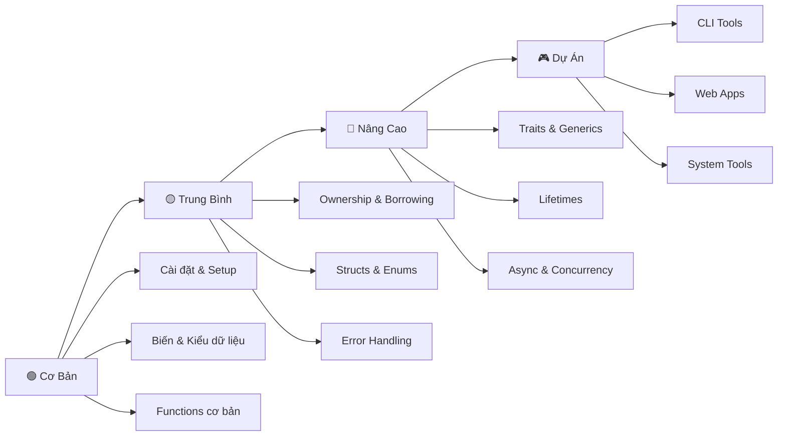

# 🦀 Chào Mừng Đến Với Rust!

## Rust Là Gì?

Chào bạn! 👋 Hãy tưởng tượng bạn là một **công nhân xây dựng** đang làm việc trên công trường. Để an toàn, bạn cần:

- 🪖 **Mũ bảo hiểm** - Bảo vệ đầu
- 🦺 **Áo phản quang** - Để mọi người thấy bạn
- 🥾 **Giày bảo hộ** - Bảo vệ chân
- 🧤 **Găng tay** - Bảo vệ tay

**Rust chính là "bộ đồ bảo hộ" cho lập trình viên!** 🛡️

Rust giúp bạn viết code:
- ✅ **An toàn** - Không bị lỗi bộ nhớ nguy hiểm
- ✅ **Nhanh** - Chạy nhanh như C/C++
- ✅ **Đáng tin cậy** - Ít bug, ít crash

:::tip Giải Thích Cho Bạn 5 Tuổi
Rust giống như có một **người thầy siêu tốt** luôn kiểm tra bài của bạn TRƯỚC KHI nộp. Thầy sẽ chỉ ra mọi lỗi sai, giúp bạn sửa, và chỉ cho phép nộp bài khi đã hoàn hảo! 📝✨
:::

## 🤔 Tại Sao Rust Đặc Biệt?

### 1. An Toàn Bộ Nhớ (Memory Safety)

**Ví dụ thực tế:**
Bạn có một chiếc xe máy (dữ liệu). Trong các ngôn ngữ khác:
- **C/C++**: Ai cũng có thể lấy xe, dẫn đến mất xe hoặc hỏng xe
- **Python/Java**: Có "người giữ xe" (garbage collector) nhưng đôi khi chậm
- **Rust**: Chỉ có MỘT người giữ chìa khóa tại một thời điểm! 🔑

```rust
fn main() {
    let xe = String::from("Wave RSX"); // Bạn sở hữu chiếc xe
    di_choi(xe);                        // Chuyển quyền sở hữu
    // println!("{}", xe);              // ❌ Lỗi! Bạn đã cho xe rồi!
}

fn di_choi(chiec_xe: String) {
    println!("Đang đi chơi bằng {}", chiec_xe);
}
```

### 2. Hiệu Năng Cao (High Performance)

Rust nhanh như C/C++ vì:
- ❌ **Không có garbage collector** - không bị lag đột ngột
- ✅ **Compile ra machine code** - CPU chạy trực tiếp
- ✅ **Zero-cost abstractions** - Code đẹp mà không chậm

### 3. Compiler Thông Minh

Compiler của Rust như **một người bạn tốt** luôn giúp bạn:

```rust
fn main() {
    let x = 5;
    x = 10;  // ❌ Compiler báo: "Này bạn, x không thể thay đổi đâu!"
}
```

Thay vì chương trình chạy rồi bị lỗi (như Python, JavaScript), Rust bắt lỗi TRƯỚC KHI chạy! 🎯

## 🌟 Ai Đang Sử Dụng Rust?

### Các Công Ty Lớn
- 🦊 **Mozilla Firefox** - Trình duyệt web
- 💬 **Discord** - Ứng dụng chat game thủ
- 📦 **Dropbox** - Lưu trữ file đám mây
- 🎮 **Microsoft** - Windows components
- 📱 **Meta (Facebook)** - Infrastructure tools
- ☁️ **Amazon Web Services** - Cloud services

### Các Dự Án Nổi Tiếng
- 🚀 **Rocket** - Web framework
- 🔍 **Ripgrep** - Công cụ tìm kiếm siêu nhanh
- ⚡ **Tokio** - Async runtime
- 🦀 **Servo** - Engine trình duyệt web

## 🎯 Bạn Sẽ Học Được Gì?

### 🟢 Cơ Bản Siêu Dễ
Bắt đầu từ con số 0:
- Cài đặt Rust và Cargo
- Viết chương trình "Hello, World!"
- Biến, kiểu dữ liệu, in ra màn hình
- Tính toán cơ bản

**Thời gian**: 1-2 tuần
**Dự án**: Máy tính đơn giản, trò chơi đoán số

### 🟡 Trung Bình Thú Vị
Học các công cụ mạnh mẽ:
- If/else, loops, functions
- Collections: Vector, HashMap
- Xử lý lỗi: Option và Result
- Closures và iterators

**Thời gian**: 2-3 tuần
**Dự án**: Todo list CLI, password generator

### 🔴 Nâng Cao Pro
Làm chủ những gì làm Rust đặc biệt:
- **Ownership** - Trái tim của Rust
- **Borrowing & Lifetimes** - Mượn dữ liệu an toàn
- **Traits & Generics** - Code tái sử dụng
- **Async/Await** - Lập trình bất đồng bộ
- **Concurrency** - Đa luồng an toàn

**Thời gian**: 4-6 tuần
**Dự án**: Web server, REST API, chat app

### 🎮 Dự Án Thực Hành
Áp dụng kiến thức vào thực tế:
- CLI tools với Clap
- Web applications với Actix/Axum
- Async programming với Tokio
- Database integration

## 🗺️ Lộ Trình Học Rust



## 💡 Rust Khác Gì Python, Java, C++?

### So Với Python 🐍
| Python | Rust |
|--------|------|
| Dễ học, dễ viết | Khó hơn, nhưng an toàn hơn |
| Chậm (interpreted) | Nhanh (compiled) |
| Có garbage collector | Không cần GC |
| Dynamic typing | Static typing |
| Tốt cho: Script, AI/ML | Tốt cho: System, Web backend |

### So Với Java ☕
| Java | Rust |
|------|------|
| Cần JVM | Compile ra native code |
| Có garbage collector | Ownership system |
| Null pointer exceptions | Không có null! |
| Nhiều boilerplate | Concise hơn |
| Tốt cho: Enterprise apps | Tốt cho: Performance-critical |

### So Với C++ ⚡
| C++ | Rust |
|-----|------|
| Dễ bị lỗi bộ nhớ | An toàn bộ nhớ |
| Manual memory management | Automatic nhưng không GC |
| Undefined behavior nhiều | Bắt lỗi lúc compile |
| Tốn thời gian debug | Ít bug hơn |
| Tốt cho: Legacy, Games | Tốt cho: Modern systems |

## 🎓 Rust Có Khó Không?

**Thật lòng**: Rust khó hơn Python, JavaScript.
**Nhưng**: Đây là lý do TỐT! 🎯

### Tại Sao Rust "Khó"?

1. **Ownership system** - Khái niệm mới, cần thời gian hiểu
2. **Compiler nghiêm khắc** - Bắt lỗi nhiều hơn ngôn ngữ khác
3. **Lifetimes** - Phải chỉ rõ dữ liệu sống bao lâu

### Nhưng Đừng Lo!

✅ **Compiler là bạn**: Mỗi lỗi đều có giải thích chi tiết
✅ **Cộng đồng thân thiện**: Rust community rất sẵn sàng giúp đỡ
✅ **Tài liệu tuyệt vời**: The Rust Book miễn phí và dễ hiểu
✅ **ELI5 style**: Chúng ta học theo phong cách "Giải thích cho bé 5 tuổi"

:::info Lời Khuyên Từ Người Đã Học
"3 tuần đầu tôi thấy khó, nhưng sau đó mọi thứ 'click'. Giờ tôi không muốn quay lại ngôn ngữ khác vì Rust giúp tôi tự tin code không bị bug!"
- Nguyễn Văn A, Rust Developer
:::

## 🚀 Sẵn Sàng Bắt Đầu?

### Bước 1: Tư Duy Đúng
- 💪 **Kiên nhẫn**: Học Rust cần thời gian, đừng vội
- 🎯 **Thực hành nhiều**: Code mỗi ngày, dù chỉ 30 phút
- 🤝 **Hỏi khi cần**: Không có câu hỏi "ngu" nào cả
- 🎉 **Ăn mừng chiến thắng nhỏ**: Code compile được là đáng tự hào!

### Bước 2: Thiết Lập Môi Trường
Đầu tiên, bạn cần cài đặt Rust:
- 💻 Rustup (công cụ quản lý Rust)
- 📦 Cargo (package manager)
- 🛠️ IDE/Editor (VS Code, RustRover)

➡️ **Tiếp theo**: [Cài Đặt Rust và Công Cụ](basics/installing-rust)

### Bước 3: Hello, World!
Viết chương trình Rust đầu tiên:
- 👋 In "Hello, World!" ra màn hình
- 🎨 Hiểu cấu trúc một Rust program
- 🔨 Dùng Cargo để build và run

➡️ **Xem thêm**: [Chương Trình Đầu Tiên](basics/first-program)

## 📚 Tài Nguyên Học Thêm

### Tiếng Anh
- 📖 [The Rust Book](https://doc.rust-lang.org/book/) - Tài liệu chính thức
- 💻 [Rust by Example](https://doc.rust-lang.org/rust-by-example/) - Học qua ví dụ
- 🎓 [Rustlings](https://github.com/rust-lang/rustlings) - Bài tập thực hành

### Cộng Đồng
- 💬 [Rust Users Forum](https://users.rust-lang.org/)
- 🐦 [r/rust subreddit](https://reddit.com/r/rust)
- 💼 [Rust Discord](https://discord.gg/rust-lang)

### Tiếng Việt
- 📚 Beli5 Rust Tutorial (bạn đang đọc!)
- 🇻🇳 Rust Vietnam Community (coming soon)

## 🎯 Mục Tiêu Của Khóa Học

Sau khi hoàn thành khóa học này, bạn sẽ:

✅ Hiểu **ownership, borrowing, lifetimes** - Trái tim của Rust
✅ Viết được **command-line tools** hữu ích
✅ Xây dựng **web applications** với Rust
✅ Xử lý **concurrency** và **async programming** an toàn
✅ Đọc và hiểu **Rust code** của người khác
✅ Đóng góp vào **open source projects**
✅ Tự tin **phỏng vấn Rust developer position**

## 💬 Một Lời Cuối

Học Rust giống như học võ thuật:
- 🥋 **Ban đầu khó**: Động tác lạ, cơ thể chưa quen
- 💪 **Luyện tập đều đặn**: Mỗi ngày một chút
- 🎯 **Hiểu nguyên lý**: Tại sao lại làm như vậy?
- 🏆 **Thành thạo**: Trở thành phản xạ tự nhiên

**Rust sẽ thay đổi cách bạn nghĩ về lập trình!** 🦀

Sẵn sàng bắt đầu hành trình? Hãy chuyển sang bài đầu tiên:

## 🗺️ Lộ Trình Tiếp Theo

### Bắt Đầu Ngay
1. 📥 [Cài Đặt Rust](basics/installing-rust) - 15 phút
2. 📦 [Làm Quen Với Cargo](basics/cargo-basics) - 20 phút
3. 👋 [Hello, World!](basics/first-program) - 30 phút

### Học Theo Chủ Đề
- 🟢 **Mới bắt đầu?** → Bắt đầu từ [Cơ Bản Siêu Dễ](basics/what-is-rust)
- 🟡 **Đã biết lập trình?** → Nhảy vào [Trung Bình Thú Vị](intermediate/if-else)
- 🔴 **Muốn master Rust?** → Khám phá [Nâng Cao Pro](advanced/ownership-basics)
- 🎮 **Học qua làm?** → Thử [Dự Án Thực Hành](projects/guessing-game)

---

:::tip Lời Khuyên Vàng
**"Đừng bỏ cuộc khi compiler báo lỗi! Đọc kỹ error message - Rust compiler là giáo viên tốt nhất của bạn!"** 🎓

Mỗi lỗi bạn sửa = Một bài học về cách viết code an toàn hơn.
:::

**Chúc bạn học Rust vui vẻ!** 🦀🎉

---

*📝 Ghi chú: Khóa học này được thiết kế theo phong cách ELI5 (Explain Like I'm 5) để dễ hiểu nhất có thể. Nếu bạn thấy khó hiểu phần nào, hãy liên hệ với chúng tôi để cải thiện!*
